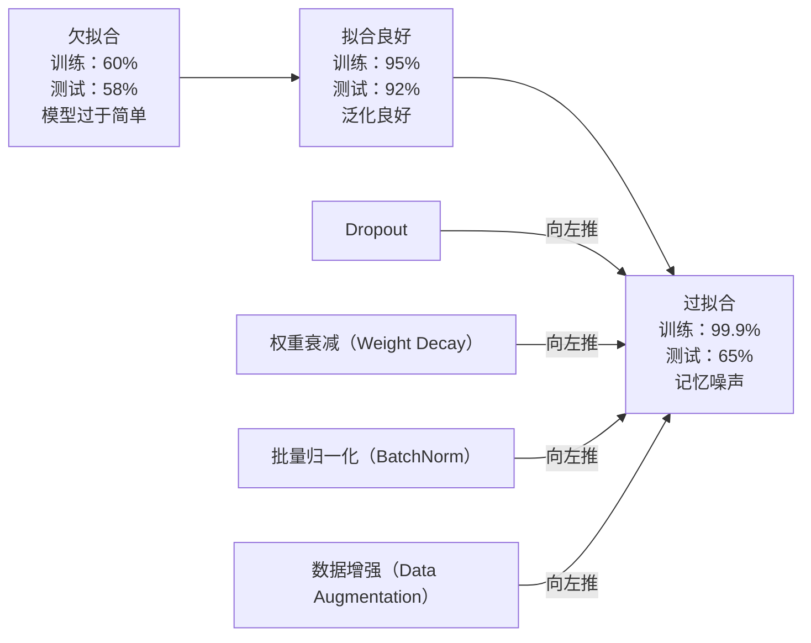
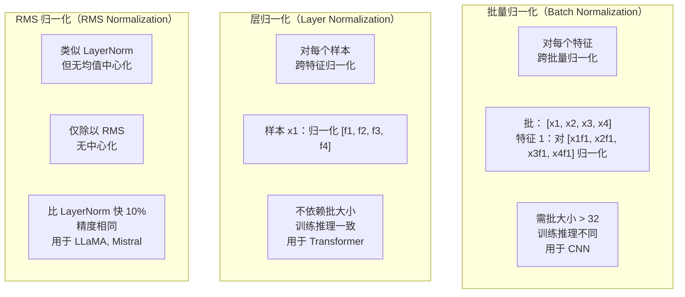
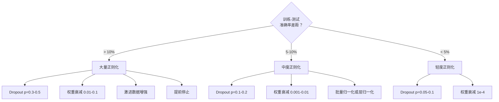

# 正则化（Regularization）

> 你的模型在训练数据上达到 99% 准确率，但在测试数据上只有 60%。它记忆了而非学习。正则化是你对复杂度施加的一种“税”，以强制模型泛化。

**类型：** 构建  
**语言：** Python  
**先决条件：** 第 03.06 课（优化器（Optimizers））  
**时间：** ~75 分钟

## 学习目标

- 从零实现带倒置缩放（inverted scaling）的 dropout、L2 权重衰减、批量归一化（Batch Normalization）、层归一化（Layer Normalization）和 RMSNorm
- 测量训练-测试准确率差异，并通过正则化实验诊断过拟合
- 解释为什么 Transformer（Transformer 架构）使用 LayerNorm 而非 BatchNorm，现代大语言模型（LLM）为何偏爱 RMSNorm
- 根据过拟合程度应用正确的正则化技术组合

## 问题

拥有足够参数的神经网络可以记忆任何数据集。这不是假设——Zhang 等人（2017）通过在带随机标签的 ImageNet 上训练标准网络证明了这一点。网络在完全随机的标签分配上训练损失几乎为零。它们记住了百万个随机的输入-输出对，没有模式可学。训练损失完美，而测试准确率为零。

这就是过拟合问题，且随着模型规模变大而加剧。GPT-3 有 1750 亿参数，训练集约有 5000 亿个标记。如此多的参数，模型有能力逐字记忆训练数据的大片段。没有正则化，模型只会复述训练示例，而非学习可泛化的模式。

训练性能和测试性能之间的差距即为过拟合差距。本课中的每种技术都从不同角度解决这一差距。Dropout 迫使网络不依赖任何单个神经元；权重衰减防止某个权重过大；批量归一化使损失曲面更平滑，从而让优化器找到更平坦、更具泛化性的极小值；层归一化实现了相同效果，却适用于批量归一化失效的场景（小批量、变长序列）；RMSNorm 通过省略均值计算，比层归一化快 10%。每种方法都简单，合在一起，是模型从记忆转向泛化的关键。

## 概念

### 过拟合光谱

每个模型都位于欠拟合（模型过于简单，无法捕捉模式）到过拟合（模型过于复杂，捕捉了噪声）之间的光谱某处。最佳位置在中间，正则化从过拟合端推模型向这个甜蜜点靠拢。



### Dropout

最简单且解释优雅的正则化技术。训练时，以概率 p 随机将每个神经元的输出置为零。

```text
output = activation(z) * mask    其中 mask[i] ~ Bernoulli(1 - p)
```

当 p=0.5 时，每次前向传播有一半神经元被“屏蔽”。网络必须学习冗余表示，因为不能预测哪些神经元可用。这样避免了神经元的协同适应——即神经元依赖特定其他神经元存在。

集成解释：神经元数为 N，dropout 产生 2^N 种子网络（每种神经元开关组合）。训练时，dropout 近似同时训练所有 2^N 个子网络，每个用不同小批量。测试时，使用所有神经元（无 dropout），并将输出乘以 (1 - p)，与训练时取值期望相匹配。等价于平均 2^N 个子网络的预测——单模型实现海量集成。

实际中，缩放发生在训练时（倒置 dropout）：

```text
训练时：output = activation(z) * mask / (1 - p)
测试时：output = activation(z)   （无变化）
```

这样测试代码无需感知 dropout，更简洁。

默认概率：transformers 为 p=0.1，MLP 为 p=0.5，CNN 为 p=0.2-0.3。更高 dropout 强度更大，正则化更强，但欠拟合风险增大。

### 权重衰减（L2 正则化）

将所有权重的平方和加入损失：

```text
total_loss = task_loss + (lambda / 2) * sum(w_i^2)
```

正则化项的梯度为 lambda * w。意味着每步中，每个权重按其大小的比例向零收缩。权重大受惩罚。模型被驱动向无单一权重占主导的解收敛。

为何有利于泛化：过拟合模型通常有大权重，放大训练数据的噪声。权重衰减保持权重小，限制有效容量，强迫模型依靠稳健、泛化的特征，而非记忆数据中的特殊。

lambda 超参数控制力度。常用值：

- transformers 上 AdamW: 0.01  
- CNN 上 SGD: 1e-4  
- 过拟合严重时: 0.1  

如第 06 课讨论：权重衰减和 L2 在 SGD 下等价，但在 Adam 下不等价。用 Adam 时应始终使用 AdamW（解耦权重衰减）。

### 批量归一化（Batch Normalization）

在传给下一层前，对小批量内每层的输出归一化。

对于某层的小批量激活：

```text
mu = (1/B) * sum(x_i)           （批均值）
sigma^2 = (1/B) * sum((x_i - mu)^2)   （批方差）
x_hat = (x_i - mu) / sqrt(sigma^2 + eps)   （归一化）
y = gamma * x_hat + beta        （缩放与偏移）
```

gamma 和 beta 是可学习参数，允许网络若最优则撤销归一化。无它们将强制每层输出均值为 0，方差为 1，或许不符合需要。

**训练与推理的区别：**训练时 mu 和 sigma 来自当前批次；推理时使用训练期间累积的滑动平均（指数移动平均，动量 0.1，表示 90% 旧 +10% 新）。

为何 BatchNorm 有效仍有争议。原论文声称它减少了“内部协变量偏移”（内部层输入分布随前层更新变化）。Santurkar 等（2018）指出此释义错误。真正原因在于：BatchNorm 使损失曲面更平滑。梯度更具预测性，Lipschitz 常数更小，优化器能安全执行更大步长。故允许更大学习率与更快收敛。

BatchNorm 的根本限制：依赖批统计。批大小为 1 时均值与方差无意义，批小于 32 时统计噪声大，影响性能。此限制在目标检测（内存限制批量大小）和语言建模（序列长短变化）等任务中尤为重要。

### 层归一化（Layer Normalization）

对特征维度归一化，而非对批量归一化。针对单个样本：

```text
mu = (1/D) * sum(x_j)           （特征均值）
sigma^2 = (1/D) * sum((x_j - mu)^2)   （特征方差）
x_hat = (x_j - mu) / sqrt(sigma^2 + eps)
y = gamma * x_hat + beta
```

D 是特征维度。每个样本独立归一化，无批量依赖。这就是为何 Transformer 使用 LayerNorm 而非 BatchNorm。序列长度不定，批大小常小（推理时为 1），训练与推理计算一致。

Transformer 中 LayerNorm 通常在每个自注意力块（self-attention block）和前馈块（feed-forward block）后施加（Post-LN），或在前面（Pre-LN，更稳定）。

### RMSNorm

不做均值中心化的 LayerNorm。由 Zhang & Sennrich（2019）提出。

```text
rms = sqrt((1/D) * sum(x_j^2))
y = gamma * x / rms
```

仅此而已，无均值计算，无 beta 参数。观察到 LayerNorm 的均值中心化对模型性能贡献很小，却增加了算力消耗。去掉均值计算，精度维持不变，计算量减少约 10%。

LLaMA、LLaMA 2、LLaMA 3、Mistral 及大多数现代大语言模型用 RMSNorm 替代 LayerNorm。在数十亿参数、万亿标记规模下，这 10% 计算节省极其重要。

### 归一化技术对比



### 数据增强作为正则化

非模型修改而是数据修改。变换训练输入，同时保持标签不变：

- 图片：随机裁剪、翻转、旋转、颜色抖动、遮挡（cutout）  
- 文本：同义词替换、回译、随机删除  
- 音频：时间拉伸、音调变化、加噪声

效果与正则化相同：扩大训练集有效规模，使模型更难记忆特定实例。只见每张原图一次的模型可以记忆它；见到每张图 50 个增强版本的模型，被迫学会不变量结构。

### 提前停止（Early Stopping）

最简单的正则器：当验证损失开始上升时停止训练，说明模型尚未完全过拟合。实践中，每轮跟踪验证损失，保存最佳模型，然后继续训练一个“耐心”期（通常 5-20 轮）。若耐心期内验证损失无改善，则中止并加载最佳模型。

### 何时应用何种正则化



## 实践构建

### 第1步：Dropout（训练模式和评估模式）

```python
import random
import math


class Dropout:
    def __init__(self, p=0.5):
        self.p = p
        self.training = True
        self.mask = None

    def forward(self, x):
        if not self.training:
            return list(x)
        self.mask = []
        output = []
        for val in x:
            if random.random() < self.p:
                self.mask.append(0)
                output.append(0.0)
            else:
                self.mask.append(1)
                output.append(val / (1 - self.p))
        return output

    def backward(self, grad_output):
        grads = []
        for g, m in zip(grad_output, self.mask):
            if m == 0:
                grads.append(0.0)
            else:
                grads.append(g / (1 - self.p))
        return grads
```

### 第2步：L2权重衰减（L2 Weight Decay）

```python
def l2_regularization(weights, lambda_reg):
    penalty = 0.0
    for w in weights:
        penalty += w * w
    return lambda_reg * 0.5 * penalty

def l2_gradient(weights, lambda_reg):
    return [lambda_reg * w for w in weights]
```

### 第3步：批量归一化（Batch Normalization）

```python
class BatchNorm:
    def __init__(self, num_features, momentum=0.1, eps=1e-5):
        self.gamma = [1.0] * num_features
        self.beta = [0.0] * num_features
        self.eps = eps
        self.momentum = momentum
        self.running_mean = [0.0] * num_features
        self.running_var = [1.0] * num_features
        self.training = True
        self.num_features = num_features

    def forward(self, batch):
        batch_size = len(batch)
        if self.training:
            mean = [0.0] * self.num_features
            for sample in batch:
                for j in range(self.num_features):
                    mean[j] += sample[j]
            mean = [m / batch_size for m in mean]

            var = [0.0] * self.num_features
            for sample in batch:
                for j in range(self.num_features):
                    var[j] += (sample[j] - mean[j]) ** 2
            var = [v / batch_size for v in var]

            for j in range(self.num_features):
                self.running_mean[j] = (1 - self.momentum) * self.running_mean[j] + self.momentum * mean[j]
                self.running_var[j] = (1 - self.momentum) * self.running_var[j] + self.momentum * var[j]
        else:
            mean = list(self.running_mean)
            var = list(self.running_var)

        self.x_hat = []
        output = []
        for sample in batch:
            normalized = []
            out_sample = []
            for j in range(self.num_features):
                x_h = (sample[j] - mean[j]) / math.sqrt(var[j] + self.eps)
                normalized.append(x_h)
                out_sample.append(self.gamma[j] * x_h + self.beta[j])
            self.x_hat.append(normalized)
            output.append(out_sample)
        return output
```

### 第4步：层归一化（Layer Normalization）

```python
class LayerNorm:
    def __init__(self, num_features, eps=1e-5):
        self.gamma = [1.0] * num_features
        self.beta = [0.0] * num_features
        self.eps = eps
        self.num_features = num_features

    def forward(self, x):
        mean = sum(x) / len(x)
        var = sum((xi - mean) ** 2 for xi in x) / len(x)

        self.x_hat = []
        output = []
        for j in range(self.num_features):
            x_h = (x[j] - mean) / math.sqrt(var + self.eps)
            self.x_hat.append(x_h)
            output.append(self.gamma[j] * x_h + self.beta[j])
        return output
```

### 第5步：RMSNorm

```python
class RMSNorm:
    def __init__(self, num_features, eps=1e-6):
        self.gamma = [1.0] * num_features
        self.eps = eps
        self.num_features = num_features

    def forward(self, x):
        rms = math.sqrt(sum(xi * xi for xi in x) / len(x) + self.eps)
        output = []
        for j in range(self.num_features):
            output.append(self.gamma[j] * x[j] / rms)
        return output
```

### 第6步：带正则化和不带正则化的训练

```python
def sigmoid(x):
    x = max(-500, min(500, x))
    return 1.0 / (1.0 + math.exp(-x))


def make_circle_data(n=200, seed=42):
    random.seed(seed)
    data = []
    for _ in range(n):
        x = random.uniform(-2, 2)
        y = random.uniform(-2, 2)
        label = 1.0 if x * x + y * y < 1.5 else 0.0
        data.append(([x, y], label))
    return data


class RegularizedNetwork:
    def __init__(self, hidden_size=16, lr=0.05, dropout_p=0.0, weight_decay=0.0):
        random.seed(0)
        self.hidden_size = hidden_size
        self.lr = lr
        self.dropout_p = dropout_p
        self.weight_decay = weight_decay
        self.dropout = Dropout(p=dropout_p) if dropout_p > 0 else None

        self.w1 = [[random.gauss(0, 0.5) for _ in range(2)] for _ in range(hidden_size)]
        self.b1 = [0.0] * hidden_size
        self.w2 = [random.gauss(0, 0.5) for _ in range(hidden_size)]
        self.b2 = 0.0

    def forward(self, x, training=True):
        self.x = x
        self.z1 = []
        self.h = []
        for i in range(self.hidden_size):
            z = self.w1[i][0] * x[0] + self.w1[i][1] * x[1] + self.b1[i]
            self.z1.append(z)
            self.h.append(max(0.0, z))

        if self.dropout and training:
            self.dropout.training = True
            self.h = self.dropout.forward(self.h)
        elif self.dropout:
            self.dropout.training = False
            self.h = self.dropout.forward(self.h)

        self.z2 = sum(self.w2[i] * self.h[i] for i in range(self.hidden_size)) + self.b2
        self.out = sigmoid(self.z2)
        return self.out

    def backward(self, target):
        eps = 1e-15
        p = max(eps, min(1 - eps, self.out))
        d_loss = -(target / p) + (1 - target) / (1 - p)
        d_sigmoid = self.out * (1 - self.out)
        d_out = d_loss * d_sigmoid

        for i in range(self.hidden_size):
            d_relu = 1.0 if self.z1[i] > 0 else 0.0
            d_h = d_out * self.w2[i] * d_relu
            self.w2[i] -= self.lr * (d_out * self.h[i] + self.weight_decay * self.w2[i])
            for j in range(2):
                self.w1[i][j] -= self.lr * (d_h * self.x[j] + self.weight_decay * self.w1[i][j])
            self.b1[i] -= self.lr * d_h
        self.b2 -= self.lr * d_out

    def evaluate(self, data):
        correct = 0
        total_loss = 0.0
        for x, y in data:
            pred = self.forward(x, training=False)
            eps = 1e-15
            p = max(eps, min(1 - eps, pred))
            total_loss += -(y * math.log(p) + (1 - y) * math.log(1 - p))
            if (pred >= 0.5) == (y >= 0.5):
                correct += 1
        return total_loss / len(data), correct / len(data) * 100

    def train_model(self, train_data, test_data, epochs=300):
        history = []
        for epoch in range(epochs):
            total_loss = 0.0
            correct = 0
            for x, y in train_data:
                pred = self.forward(x, training=True)
                self.backward(y)
                eps = 1e-15
                p = max(eps, min(1 - eps, pred))
                total_loss += -(y * math.log(p) + (1 - y) * math.log(1 - p))
                if (pred >= 0.5) == (y >= 0.5):
                    correct += 1
            train_loss = total_loss / len(train_data)
            train_acc = correct / len(train_data) * 100
            test_loss, test_acc = self.evaluate(test_data)
            history.append((train_loss, train_acc, test_loss, test_acc))
            if epoch % 75 == 0 or epoch == epochs - 1:
                gap = train_acc - test_acc
                print(f"    Epoch {epoch:3d}: train_acc={train_acc:.1f}%, test_acc={test_acc:.1f}%, gap={gap:.1f}%")
        return history
```

## 使用方法

PyTorch 提供了所有归一化和正则化的模块：

```python
import torch
import torch.nn as nn

model = nn.Sequential(
    nn.Linear(784, 256),
    nn.BatchNorm1d(256),
    nn.ReLU(),
    nn.Dropout(0.3),
    nn.Linear(256, 128),
    nn.BatchNorm1d(128),
    nn.ReLU(),
    nn.Dropout(0.3),
    nn.Linear(128, 10),
)

model.train()
out_train = model(torch.randn(32, 784))

model.eval()
out_test = model(torch.randn(1, 784))
```

`model.train()` / `model.eval()` 切换非常关键。它切换 dropout 的开启/关闭，并告诉 BatchNorm 是使用批次统计数据还是运行时统计数据。忘记在推理前调用 `model.eval()` 是深度学习中最常见的错误之一。你的测试精度会随机波动，因为 dropout 仍在激活，BatchNorm 使用的是小批量统计数据。

对于 Transformer（Transformer 架构），使用的模式不同：

```python
class TransformerBlock(nn.Module):
    def __init__(self, d_model=512, nhead=8, dropout=0.1):
        super().__init__()
        self.attention = nn.MultiheadAttention(d_model, nhead, dropout=dropout)
        self.norm1 = nn.LayerNorm(d_model)
        self.ff = nn.Sequential(
            nn.Linear(d_model, d_model * 4),
            nn.GELU(),
            nn.Linear(d_model * 4, d_model),
            nn.Dropout(dropout),
        )
        self.norm2 = nn.LayerNorm(d_model)
        self.dropout = nn.Dropout(dropout)

    def forward(self, x):
        attended, _ = self.attention(x, x, x)
        x = self.norm1(x + self.dropout(attended))
        x = self.norm2(x + self.ff(x))
        return x
```

这里用的是 LayerNorm（层归一化），不是 BatchNorm（批量归一化）。dropout 的概率是0.1，不是0.5。这些是 Transformer 的默认设置。

## 发布该内容

本课产生的内容：
- `outputs/prompt-regularization-advisor.md` -- 一个提示，诊断过拟合并推荐适当的正则化策略

## 练习

1. 实现二维数据的空间 dropout（spatial dropout）：不是丢弃单个神经元，而是丢弃整个特征通道。通过将连续的一组特征视为通道，并丢弃整组来模拟。比较该方法与标准 dropout 在 circle 数据集（hidden_size=32）上的训练-测试差距。

2. 实现第05课的标签平滑（label smoothing）结合本课的 dropout。用四种配置训练：两者都没有，只用 dropout，只用标签平滑，两者都用。测量每种配置的最终训练-测试准确率差距。哪个组合的差距最小？

3. 在你的 circle 数据集网络中，隐藏层与激活层之间加一个 BatchNorm 层。分别在学习率0.01、0.05和0.1下训练，有无 BatchNorm 对比。BatchNorm 应该允许在更高学习率下实现稳定训练，而普通网络则会发散。

4. 实现早停法（early stopping）：跟踪每个 epoch 的测试损失，保存最佳权重，如果测试损失连续20个 epoch 未改善则停止训练。用正则化网络训练1000个 epoch。报告最优测试精度出现的 epoch 以及节省了多少计算量。

5. 比较 LayerNorm 与 RMSNorm 在4层网络（而不仅是2层）上的表现。用相同权重初始化两者，训练200个 epoch，比较最终准确率、训练速率（每个 epoch 的耗时）和第一层的梯度大小。验证 RMSNorm 是否在保持相同时准确率下更快。

## 关键词

| 术语 | 大众说法 | 实际含义 |
|------|---------|----------|
| Overfitting（过拟合） | “模型记住了数据” | 当模型的训练表现远超测试表现，说明它学到了噪声而非信号 |
| Regularization（正则化） | “防止过拟合” | 任何约束模型复杂度以提升泛化能力的技术：dropout（丢弃）、weight decay（权重衰减）、normalization（归一化）、augmentation（增强） |
| Dropout（丢弃法） | “随机删除神经元” | 在训练时以概率 p 将随机神经元置零，迫使形成冗余表示；相当于训练一个集成模型 |
| Weight decay（权重衰减） | “L2 惩罚” | 通过每步减去 lambda * w 来缩小所有权重，惩罚权重幅度以降低复杂度 |
| Batch normalization（批归一化） | “按批归一化” | 在训练时使用批统计量对层输出按批次维度归一化，推理时用运行平均值 |
| Layer normalization（层归一化） | “按样本归一化” | 在每个样本内对特征归一化；与批大小无关，常用于批大小变化的transformers（Transformer 架构）中 |
| RMSNorm | “无均值的 LayerNorm” | 均方根归一化；剔除了 LayerNorm 的均值减法，带来大约 10% 的加速且精度相当 |
| Early stopping（提前停止） | “过拟合前停止” | 当验证损失不再改善时停止训练；最简单的正则化方法，常与其他方法结合使用 |
| Data augmentation（数据增强） | “用少量数据造更多数据” | 通过变换训练输入（翻转、裁剪、噪声）来增大有效数据集规模，迫使模型学习不变性 |
| Generalization gap（泛化差距） | “训练-测试差异” | 训练表现与测试表现之间的差异；正则化旨在最小化这一差距 |

## 延伸阅读

- Srivastava 等，“Dropout: A Simple Way to Prevent Neural Networks from Overfitting”（2014）——原始 dropout 论文，含集成视角和大量实验
- Ioffe & Szegedy，“Batch Normalization: Accelerating Deep Network Training by Reducing Internal Covariate Shift”（2015）——介绍了 BatchNorm 及其训练过程，是引用极高的深度学习论文之一
- Zhang & Sennrich，“Root Mean Square Layer Normalization”（2019）——展示了 RMSNorm 以较低计算成本匹配 LayerNorm 性能；被 LLaMA 和 Mistral 采用
- Zhang 等，“Understanding Deep Learning Requires Rethinking Generalization”（2017）——里程碑论文，展示神经网络能记忆随机标签，挑战传统泛化观念
