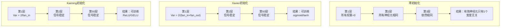
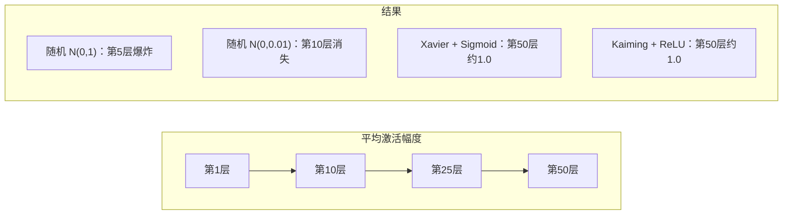
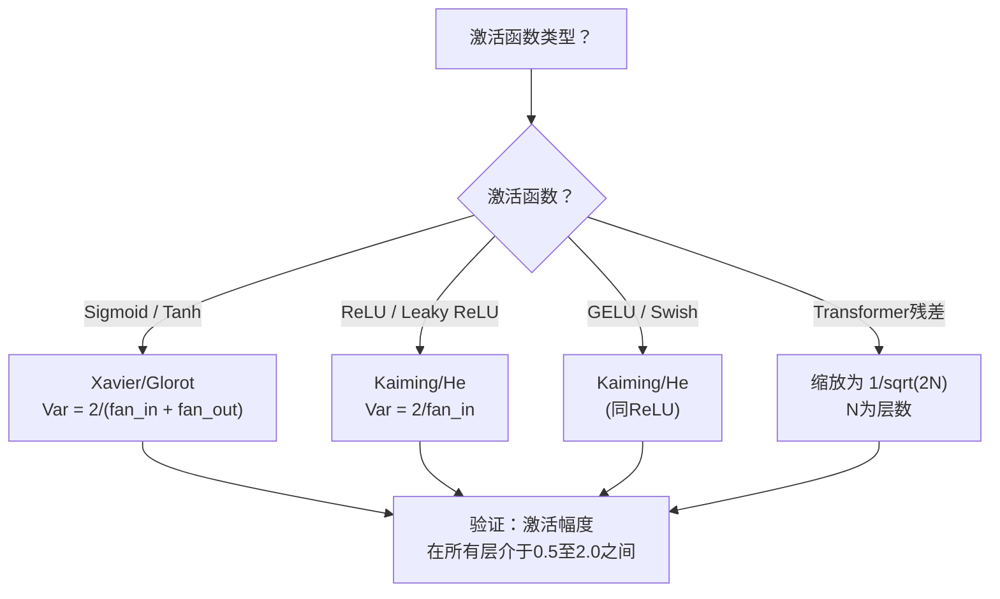

# 权重初始化和训练稳定性

> 初始化错误，训练从未开始。初始化正确，50层训练如同3层一样顺畅。

**类型:** 构建  
**语言:** Python  
**先决条件:** 第03.04课（激活函数），第03.07课（正则化）  
**时间:** 大约90分钟

## 学习目标

- 实现零初始化、随机初始化、Xavier/Glorot初始化和Kaiming/He初始化策略，并衡量它们对50层中激活幅度的影响
- 推导为何Xavier初始化使用 Var(w) = 2/(fan_in + fan_out)，而Kaiming使用 Var(w) = 2/fan_in
- 演示零初始化导致的对称性问题，并解释为何仅随机尺度不足以确保训练
- 将正确的初始化策略与激活函数匹配：sigmoid/tanh用Xavier，ReLU/GELU用Kaiming

## 问题

将所有权重初始化为零。网络无法学习。每个神经元计算相同函数，接收相同梯度，参数更新完全相同。经过10,000个epoch，你的512神经元隐藏层仍然是512个相同神经元的副本。你支付了512个参数的代价，却只得到了1个有效神经元。

将权重初始化得过大。激活在网络中爆炸。到第10层时，数值达到1e15。第20层时，数值溢出为无穷。梯度按相反路径同样爆炸。

将权重从标准正态分布中随机初始化。对于3层网络有效。对于50层，信号会塌缩到零或爆炸到无穷，具体取决于随机尺度是否稍微偏小或稍微偏大。“可训练”和“失效”之间界限极其细微。

权重初始化是深度学习中最被低估的决策。架构能出论文。优化器能写博客。初始化通常只得脚注。但初始化错误，其他一切都无关紧要——你的网络训练一开始就死了。

## 概念

### 对称性问题

同一层的每个神经元结构相同：输入乘以权重，加偏置，再应用激活函数。如果所有权重一开始都相同（零初始化是极端情况），每个神经元输出相同。在反向传播时，每个神经元接收相同梯度。更新时，每个神经元参数也以相同方式变化。

你陷入困境。网络中虽有数百个参数，但都同步变动。这称为对称性，随机初始化是破除它的暴力方法。每个神经元从权重空间不同点开始，因此学习不同特征。

但“随机”本身不够。随机的*尺度*决定了网络是否能训练。

### 通过层传播的方差

考虑一层有fan_in个输入：

```text
z = w1*x1 + w2*x2 + ... + w_n*x_n
```

如果每个权重 wi 来自方差为 Var(w) 的分布，每个输入 xi 方差为 Var(x)，则输出方差为：

```text
Var(z) = fan_in * Var(w) * Var(x)
```

如果 Var(w) = 1 且 fan_in = 512，输出方差是输入方差的512倍。10层后：512^10 = 1.2e27。信号爆炸。

如果 Var(w) = 0.001，输出方差每层缩小0.001 * 512 = 0.512。10层后：0.512^10 = 0.00013。信号消失。

目标：选择 Var(w) 使得 Var(z) = Var(x)，信号幅度跨层保持恒定。

### Xavier/Glorot初始化

Glorot和Bengio（2010）为sigmoid和tanh激活推导了解决方案。为保持前向传播和反向传播过程中方差稳定：

```text
Var(w) = 2 / (fan_in + fan_out)
```

通常权重采样来自：

```text
w ~ Uniform(-limit, limit)  其中 limit = sqrt(6 / (fan_in + fan_out))
```

或：

```text
w ~ Normal(0, sqrt(2 / (fan_in + fan_out)))
```

这有效是因为sigmoid和tanh在零点附近大致线性，正确初始化的激活也在此范围内。方差在几十层中保持稳定。

### Kaiming/He初始化

ReLU使一半输出为零（负值变零）。有效fan_in减半，因为平均一半输入被置零。Xavier初始化未考虑这一点，低估了所需方差。

He等人（2015）调整公式为：

```text
Var(w) = 2 / fan_in
```

权重采样自：

```text
w ~ Normal(0, sqrt(2 / fan_in))
```

乘以2的因子补偿ReLU导致的一半激活为零。否则，信号每层缩小约0.5倍。50层后：0.5^50 = 8.8e-16。Kaiming初始化防止此问题。

### Transformer初始化

GPT-2引入了不同的模式。残差连接将每个子层输出加到输入上：

```text
x = x + sublayer(x)
```

每次相加都会增加方差。N个残差层时，方差按比例增长。GPT-2将残差层权重缩放为 1/sqrt(2N)，N为层数。这样保持累积信号幅度稳定。

Llama 3（405B参数，126层）采用了类似方案。若无此缩放，残差流会在126层注意力与前馈块中无限增长。



### 50层的激活幅度



### 选择正确初始化



## 实现

### 步骤1：初始化策略

四种初始化权重矩阵的方式。每种返回一个二维列表（矩阵），fan_in为列数，fan_out为行数。

```python
import math
import random


def zero_init(fan_in, fan_out):
    return [[0.0 for _ in range(fan_in)] for _ in range(fan_out)]


def random_init(fan_in, fan_out, scale=1.0):
    return [[random.gauss(0, scale) for _ in range(fan_in)] for _ in range(fan_out)]


def xavier_init(fan_in, fan_out):
    std = math.sqrt(2.0 / (fan_in + fan_out))
    return [[random.gauss(0, std) for _ in range(fan_in)] for _ in range(fan_out)]


def kaiming_init(fan_in, fan_out):
    std = math.sqrt(2.0 / fan_in)
    return [[random.gauss(0, std) for _ in range(fan_in)] for _ in range(fan_out)]
```

### 步骤2：激活函数

需要sigmoid、tanh和ReLU，用来测试每种初始化策略与其对应激活函数。

```python
def sigmoid(x):
    x = max(-500, min(500, x))
    return 1.0 / (1.0 + math.exp(-x))


def tanh_act(x):
    return math.tanh(x)


def relu(x):
    return max(0.0, x)
```

### 步骤3：50层的前向传播

将随机数据传入深层网络，测量每层的平均激活幅度。

```python
def forward_deep(init_fn, activation_fn, n_layers=50, width=64, n_samples=100):
    random.seed(42)
    layer_magnitudes = []

    inputs = [[random.gauss(0, 1) for _ in range(width)] for _ in range(n_samples)]

    for layer_idx in range(n_layers):
        weights = init_fn(width, width)
        biases = [0.0] * width

        new_inputs = []
        for sample in inputs:
            output = []
            for neuron_idx in range(width):
                z = sum(weights[neuron_idx][j] * sample[j] for j in range(width)) + biases[neuron_idx]
                output.append(activation_fn(z))
            new_inputs.append(output)
        inputs = new_inputs

        magnitudes = []
        for sample in inputs:
            magnitudes.append(sum(abs(v) for v in sample) / width)
        mean_mag = sum(magnitudes) / len(magnitudes)
        layer_magnitudes.append(mean_mag)

    return layer_magnitudes
```

### 步骤4：实验

运行所有组合：零初始化，N(0,1)随机，N(0,0.01)随机，Xavier+sigmoid，Xavier+tanh，Kaiming+ReLU。打印关键层的激活幅度。

```python
def run_experiment():
    configs = [
        ("零初始化 + Sigmoid", lambda fi, fo: zero_init(fi, fo), sigmoid),
        ("随机 N(0,1) + ReLU", lambda fi, fo: random_init(fi, fo, 1.0), relu),
        ("随机 N(0,0.01) + ReLU", lambda fi, fo: random_init(fi, fo, 0.01), relu),
        ("Xavier + Sigmoid", xavier_init, sigmoid),
        ("Xavier + Tanh", xavier_init, tanh_act),
        ("Kaiming + ReLU", kaiming_init, relu),
    ]

    print(f"{'策略':<30} {'第1层':>10} {'第5层':>10} {'第10层':>10} {'第25层':>10} {'第50层':>10}")
    print("-" * 80)

    for name, init_fn, act_fn in configs:
        mags = forward_deep(init_fn, act_fn)
        row = f"{name:<30}"
        for idx in [0, 4, 9, 24, 49]:
            val = mags[idx]
            if val > 1e6:
                row += f" {'爆炸':>10}"
            elif val < 1e-6:
                row += f" {'消失':>10}"
            else:
                row += f" {val:>10.4f}"
        print(row)
```

### 步骤5：对称性演示

验证零初始化导致神经元输出完全相同。

```python
def symmetry_demo():
    random.seed(42)
    weights = zero_init(2, 4)
    biases = [0.0] * 4

    inputs = [0.5, -0.3]
    outputs = []
    for neuron_idx in range(4):
        z = sum(weights[neuron_idx][j] * inputs[j] for j in range(2)) + biases[neuron_idx]
        outputs.append(sigmoid(z))

    print("\n对称性演示（4个神经元，零初始化）：")
    for i, out in enumerate(outputs):
        print(f"  神经元 {i}: 输出 = {out:.6f}")
    all_same = all(abs(outputs[i] - outputs[0]) < 1e-10 for i in range(len(outputs)))
    print(f"  全部相同：{all_same}")
    print(f"  实际有效参数数量：1 （非 {len(weights) * len(weights[0])}）")
```

### 步骤6：每层激活幅度报告

打印50层激活幅度的可视化柱状图。

```python
def magnitude_report(name, magnitudes):
    print(f"\n{name}:")
    for i, mag in enumerate(magnitudes):
        if i % 5 == 0 or i == len(magnitudes) - 1:
            if mag > 1e6:
                bar = "X" * 50 + " 爆炸"
            elif mag < 1e-6:
                bar = "." + " 消失"
            else:
                bar_len = min(50, max(1, int(mag * 10)))
                bar = "#" * bar_len
            print(f"  第 {i+1:3d} 层: {bar} ({mag:.6f})")
```

## 使用它

PyTorch 提供了这些内置函数：

```python
import torch
import torch.nn as nn

layer = nn.Linear(512, 256)

nn.init.xavier_uniform_(layer.weight)
nn.init.xavier_normal_(layer.weight)

nn.init.kaiming_uniform_(layer.weight, nonlinearity='relu')
nn.init.kaiming_normal_(layer.weight, nonlinearity='relu')

nn.init.zeros_(layer.bias)
```

当你调用 `nn.Linear(512, 256)` 时，PyTorch 默认采用 Kaiming uniform 初始化。这就是为什么大多数简单网络“能够正常工作”——PyTorch 已经做出了正确的选择。但当你构建自定义架构或网络深度超过 20 层时，你需要理解到底发生了什么，并可能需要覆盖默认设置。

对于 transformers，HuggingFace 模型通常在它们的 `_init_weights` 方法中处理初始化。GPT-2 的实现通过 1/sqrt(N) 缩放残差投影。如果你是从零开始构建 transformer，需要自己添加这个。

## 发布它

本课产生：
- `outputs/prompt-init-strategy.md` —— 一个诊断权重初始化问题并推荐正确策略的提示

## 练习

1. 添加 LeCun 初始化（方差 Var = 1/fan_in，针对 SELU 激活设计）。用 LeCun 初始化 + tanh 运行 50 层实验，并与 Xavier + tanh 比较。

2. 实现 GPT-2 的残差缩放：在加到残差流之前，将每层的输出乘以 1/sqrt(2*N)。分别用和不用缩放跑 50 层，测量残差幅度增长速度。

3. 创建一个“初始化健康检查”函数，输入网络层尺寸和激活类型，推荐正确初始化方法，并警告当前初始化是否会导致问题。

4. 运行 fan_in = 16 和 fan_in = 1024 的实验。Xavier 和 Kaiming 会自适应 fan_in，但随机初始化不会。展示层数增大时“可行”与“失败”的差距如何拉大。

5. 实现正交初始化（生成随机矩阵，计算其奇异值分解 SVD，使用正交矩阵 U）。在 50 层 ReLU 网络中与 Kaiming 进行对比。

## 关键词

| 术语 | 常见说法 | 实际含义 |
|------|----------|----------|
| 权重初始化（Weight initialization） | “随机设置初始权重” | 选择初始权重值的策略，决定了网络是否能够训练 |
| 对称破坏（Symmetry breaking） | “让神经元不同” | 通过随机初始化确保神经元学习不同特征，而不是计算相同函数 |
| fan-in | “一个神经元的输入数量” | 输入连接的数量，决定加权和中输入方差的累积 |
| fan-out | “一个神经元的输出数量” | 输出连接的数量，影响反向传播时梯度方差的保持 |
| Xavier/Glorot 初始化 | “sigmoid 初始化” | Var(w) = 2/(fan_in + fan_out)，设计用于通过 sigmoid 和 tanh 激活保持方差 |
| Kaiming/He 初始化 | “ReLU 初始化” | Var(w) = 2/fan_in，考虑 ReLU 激活会把一半激活置零 |
| 方差传播（Variance propagation） | “信号如何在层间增减” | 分析激活方差如何基于权重尺度逐层变化的数学方法 |
| 残差缩放（Residual scaling） | “GPT-2 的初始化技巧” | 用 1/sqrt(2N) 缩放残差连接权重，避免 N 层 transformer 中方差增长 |
| 死网（Dead network） | “网络无法训练” | 由于初始化不好，所有梯度为零或所有激活值饱和的网络 |
| 激活爆炸（Exploding activations） | “数值无限大” | 权重方差过大导致激活值层层指数增长 |

## 延伸阅读

- Glorot & Bengio, “Understanding the difficulty of training deep feedforward neural networks”（2010）——原始 Xavier 初始化论文及方差分析  
- He 等人，“Delving Deep into Rectifiers”（2015）——提出针对 ReLU 网络的 Kaiming 初始化  
- Radford 等人，“Language Models are Unsupervised Multitask Learners”（2019）——GPT-2 论文中的残差缩放初始化  
- Mishkin & Matas，“All You Need is a Good Init”（2016）——基于经验的逐层单位方差初始化，作为解析公式的替代方案
