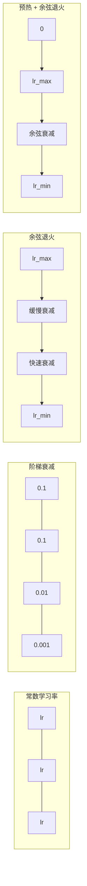
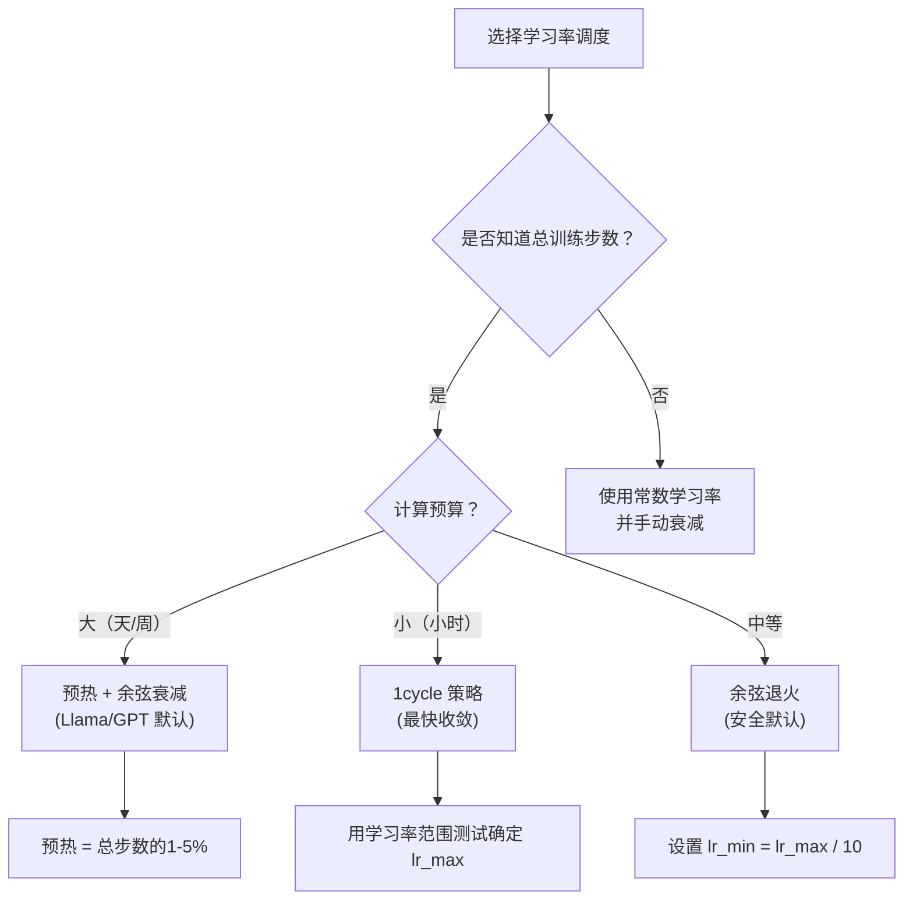
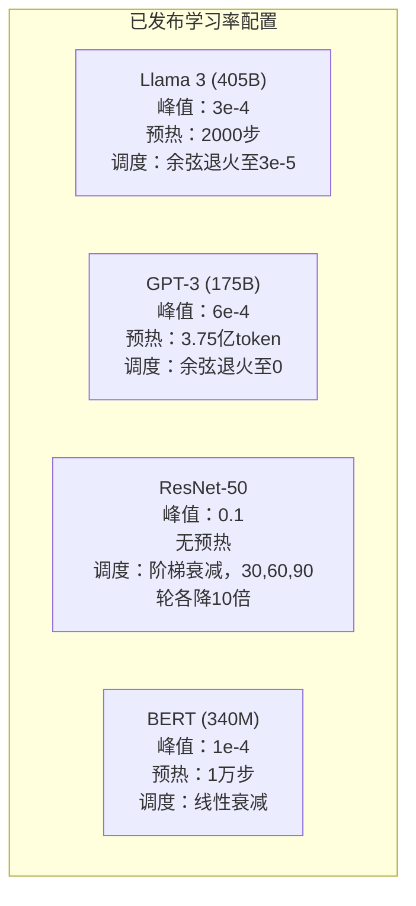

# 学习率调度和预热（Warmup）

> 学习率是唯一最重要的超参数。不是架构。不是数据集大小。不是激活函数。学习率。如果你只调参一项，那就调这个。

**类型：** 构建  
**语言：** Python  
**先修课：** 第 03.06 课（优化器），第 03.08 课（权重初始化）  
**时间：** ~90 分钟

## 学习目标

- 从零实现常数、阶梯衰减、余弦退火、预热+余弦和1cycle学习率调度
- 演示学习率选择的三种失败模式：发散（过大）、停滞（过小）和振荡（无衰减）
- 解释为什么Adam及其他自适应优化器需要预热以及预热如何稳定早期训练
- 比较这五种调度在同一任务上的收敛速度，并针对给定训练预算选择合适的调度

## 问题描述

把学习率设为0.1，训练发散——3步内损失跳到无穷大。设为0.0001，训练极其缓慢——100个epoch后模型几乎没变。设为0.01，训练正常进行50个epoch，但损失在某个最小值附近振荡，无法收敛，因为步长太大。

最优学习率不是常数。它随着训练过程变化。训练早期希望步长大，快速覆盖参数空间。训练后期则用极小步长，收敛到精确极小点。模型准确率从90%提升到95%，往往只因为合理的学习率调度。

过去三年发布的所有主流模型都采用了学习率调度。Llama 3用峰值学习率 3e-4，预热2000步，余弦衰减至 3e-5。GPT-3用学习率6e-4，预热覆盖3.75亿token。它们并非随意选择，而是亿万美元级的大规模超参搜索结果。

你必须懂调度，因为默认值不会适用于你的问题。微调预训练模型时，调度和从零训练完全不同。增加批次大小，预热步数也要调整。训练在第10000步崩溃时，你需要知道是调度问题还是其它问题。

## 概念

### 常数学习率

最简单的方法。选一个数，训练全程用它。

```text
lr(t) = lr_0
```

很少是最优。早期太小，浪费计算资源；后期过大，振荡在最小值附近。适合小模型和调试，训练时间长则表现极差。

### 阶梯衰减

ResNet时代的传统方法。每隔固定epoch数，将学习率乘以一个因子（通常是0.1）。

```text
lr(t) = lr_0 * gamma^(floor(epoch / step_size))
```

例如 gamma=0.1，step_size=30 表示：每隔30个epoch学习率降低10倍。ResNet-50采用此法，lr=0.1，在30、60、90 epoch时下降10倍。

缺点是最佳衰减时间依赖数据集和架构，换个任务常须重新调参。下降是突变，损失可能突然激增。

### 余弦退火（Cosine Annealing）

学习率从最大值平滑衰减到最小值，遵循余弦曲线：

```text
lr(t) = lr_min + 0.5 * (lr_max - lr_min) * (1 + cos(pi * t / T))
```

其中 t 是当前步数，T 为总步数。

t=0 时 cos 项是 1，学习率是 lr_max；t=T 时 cos 项是 -1，学习率是 lr_min。衰减初期缓慢，中间加速，末尾再次缓慢。

这是大多数现代训练的默认选择。只需调 lr_max 和 lr_min。曲线符合经验：大部分学习发生在训练中期，关键阶段步长合适。

### 预热（Warmup）：为什么起始步长要小

Adam等自适应优化器维护梯度均值和方差的滑动估计。第0步时估计初始化为0，最初几步基于“垃圾”统计量。若此时学习率太大，模型会走巨大的、错误方向的步子。

预热解决这个。起始用极小学习率（通常是 lr_max / warmup_steps 或零），线性增长到 lr_max，在前N步完成。到达峰值时，Adam估计已稳定。

```text
lr(t) = lr_max * (t / warmup_steps)     for t < warmup_steps
```

典型预热步数占总步数1%-5%。Llama 3训练约1.8万亿token，预热2000步。GPT-3预热覆盖3.75亿token。

### 线性预热 + 余弦衰减

现代默认方案。先线性升高，后余弦衰减：

```text
if t < warmup_steps:
    lr(t) = lr_max * (t / warmup_steps)
else:
    progress = (t - warmup_steps) / (total_steps - warmup_steps)
    lr(t) = lr_min + 0.5 * (lr_max - lr_min) * (1 + cos(pi * progress))
```

Llama、GPT、PaLM 及大多数现代 Transformer 都用此方案。预热避免早期不稳定，余弦退火帮助模型安稳收敛。

### 1cycle 策略

Leslie Smith（2018年）发现：训练前半段线性升高学习率，从低值升到高值；后半段再线性降低学习率。乍一看反直觉：中途为什么要**增加**学习率？

理论上，较大学习率作为正则化，在优化轨迹中添加噪声，使模型在上升期探索更多解空间，发现更优盆地。下降期则在最佳盆地精炼。

```text
阶段1（0到T/2）：学习率从 lr_max/25 线性上升到 lr_max
阶段2（T/2到T）：学习率从 lr_max 线性下降到 lr_max/10000
```

1cycle相比余弦退火，在固定计算预算下通常更快收敛。但你必须提前知道总步数。

### 调度曲线形状



### 决策流程图



### 已发布模型的真实数值



## 构建实现

### 步骤1：调度函数

每个函数接受当前步数，输出该步数的学习率。

```python
import math


def constant_schedule(step, lr=0.01, **kwargs):
    return lr


def step_decay_schedule(step, lr=0.1, step_size=100, gamma=0.1, **kwargs):
    return lr * (gamma ** (step // step_size))


def cosine_schedule(step, lr=0.01, total_steps=1000, lr_min=1e-5, **kwargs):
    if step >= total_steps:
        return lr_min
    return lr_min + 0.5 * (lr - lr_min) * (1 + math.cos(math.pi * step / total_steps))


def warmup_cosine_schedule(step, lr=0.01, total_steps=1000, warmup_steps=100, lr_min=1e-5, **kwargs):
    if total_steps <= warmup_steps:
        return lr * (step / max(warmup_steps, 1))
    if step < warmup_steps:
        return lr * step / warmup_steps
    progress = (step - warmup_steps) / (total_steps - warmup_steps)
    return lr_min + 0.5 * (lr - lr_min) * (1 + math.cos(math.pi * progress))


def one_cycle_schedule(step, lr=0.01, total_steps=1000, **kwargs):
    mid = max(total_steps // 2, 1)
    if step < mid:
        return (lr / 25) + (lr - lr / 25) * step / mid
    else:
        progress = (step - mid) / max(total_steps - mid, 1)
        return lr * (1 - progress) + (lr / 10000) * progress
```

### 步骤2：可视化所有调度

打印基于文本的图形，展示每个调度训练过程的学习率变化。

```python
def visualize_schedule(name, schedule_fn, total_steps=500, **kwargs):
    steps = list(range(0, total_steps, total_steps // 20))
    if total_steps - 1 not in steps:
        steps.append(total_steps - 1)

    lrs = [schedule_fn(s, total_steps=total_steps, **kwargs) for s in steps]
    max_lr = max(lrs) if max(lrs) > 0 else 1.0

    print(f"\n{name}:")
    for s, lr_val in zip(steps, lrs):
        bar_len = int(lr_val / max_lr * 40)
        bar = "#" * bar_len
        print(f"  Step {s:4d}: lr={lr_val:.6f} {bar}")
```

### 步骤3：训练神经网络

一个简单的两层网络，用于圆形数据集，和之前课一致，但现在可变学习率调度。

```python
import random


def sigmoid(x):
    x = max(-500, min(500, x))
    return 1.0 / (1.0 + math.exp(-x))


def relu(x):
    return max(0.0, x)


def relu_deriv(x):
    return 1.0 if x > 0 else 0.0


def make_circle_data(n=200, seed=42):
    random.seed(seed)
    data = []
    for _ in range(n):
        x = random.uniform(-2, 2)
        y = random.uniform(-2, 2)
        label = 1.0 if x * x + y * y < 1.5 else 0.0
        data.append(([x, y], label))
    return data


def train_with_schedule(schedule_fn, schedule_name, data, epochs=300, base_lr=0.05, **kwargs):
    random.seed(0)
    hidden_size = 8
    total_steps = epochs * len(data)

    std = math.sqrt(2.0 / 2)
    w1 = [[random.gauss(0, std) for _ in range(2)] for _ in range(hidden_size)]
    b1 = [0.0] * hidden_size
    w2 = [random.gauss(0, std) for _ in range(hidden_size)]
    b2 = 0.0

    step = 0
    epoch_losses = []

    for epoch in range(epochs):
        total_loss = 0
        correct = 0

        for x, target in data:
            lr = schedule_fn(step, lr=base_lr, total_steps=total_steps, **kwargs)

            z1 = []
            h = []
            for i in range(hidden_size):
                z = w1[i][0] * x[0] + w1[i][1] * x[1] + b1[i]
                z1.append(z)
                h.append(relu(z))

            z2 = sum(w2[i] * h[i] for i in range(hidden_size)) + b2
            out = sigmoid(z2)

            error = out - target
            d_out = error * out * (1 - out)

            for i in range(hidden_size):
                d_h = d_out * w2[i] * relu_deriv(z1[i])
                w2[i] -= lr * d_out * h[i]
                for j in range(2):
                    w1[i][j] -= lr * d_h * x[j]
                b1[i] -= lr * d_h
            b2 -= lr * d_out

            total_loss += (out - target) ** 2
            if (out >= 0.5) == (target >= 0.5):
                correct += 1
            step += 1

        avg_loss = total_loss / len(data)
        accuracy = correct / len(data) * 100
        epoch_losses.append(avg_loss)

    return epoch_losses
```

### 第4步：比较所有调度策略

用每种调度策略训练相同的网络，并比较最终损失和收敛行为。

```python
def compare_schedules(data):
    configs = [
        ("Constant", constant_schedule, {}),
        ("Step Decay", step_decay_schedule, {"step_size": 15000, "gamma": 0.1}),
        ("Cosine", cosine_schedule, {"lr_min": 1e-5}),
        ("Warmup+Cosine", warmup_cosine_schedule, {"warmup_steps": 3000, "lr_min": 1e-5}),
        ("1cycle", one_cycle_schedule, {}),
    ]

    print(f"\n{'Schedule':<20} {'Start Loss':>12} {'Mid Loss':>12} {'End Loss':>12} {'Best Loss':>12}")
    print("-" * 70)

    for name, schedule_fn, extra_kwargs in configs:
        losses = train_with_schedule(schedule_fn, name, data, epochs=300, base_lr=0.05, **extra_kwargs)
        mid_idx = len(losses) // 2
        best = min(losses)
        print(f"{name:<20} {losses[0]:>12.6f} {losses[mid_idx]:>12.6f} {losses[-1]:>12.6f} {best:>12.6f}")
```

### 第5步：学习率过高与过低

演示三种失败模式：过高（发散）、过低（缓慢）以及刚好合适。

```python
def lr_sensitivity(data):
    learning_rates = [1.0, 0.1, 0.01, 0.001, 0.0001]

    print("\n学习率敏感性（恒定调度，100个epoch）：")
    print(f"  {'LR':>10} {'开始损失':>12} {'结束损失':>12} {'状态':>15}")
    print("  " + "-" * 52)

    for lr in learning_rates:
        losses = train_with_schedule(constant_schedule, f"lr={lr}", data, epochs=100, base_lr=lr)
        start = losses[0]
        end = losses[-1]

        if end > start or math.isnan(end) or end > 1.0:
            status = "发散"
        elif end > start * 0.9:
            status = "几乎无变化"
        elif end < 0.15:
            status = "已收敛"
        else:
            status = "学习中"

        end_str = f"{end:.6f}" if not math.isnan(end) else "NaN"
        print(f"  {lr:>10.4f} {start:>12.6f} {end_str:>12} {status:>15}")
```

## 使用方法

PyTorch 在 `torch.optim.lr_scheduler` 中提供了多种调度器：

```python
import torch
import torch.optim as optim
from torch.optim.lr_scheduler import CosineAnnealingLR, OneCycleLR, StepLR

model = nn.Sequential(nn.Linear(10, 64), nn.ReLU(), nn.Linear(64, 1))
optimizer = optim.Adam(model.parameters(), lr=3e-4)

scheduler = CosineAnnealingLR(optimizer, T_max=1000, eta_min=1e-5)

for step in range(1000):
    loss = train_step(model, optimizer)
    scheduler.step()
```

对于 warmup + cosine，使用 lambda 调度器或者来自 HuggingFace 的 `get_cosine_schedule_with_warmup`：

```python
from transformers import get_cosine_schedule_with_warmup

scheduler = get_cosine_schedule_with_warmup(
    optimizer,
    num_warmup_steps=2000,
    num_training_steps=100000,
)
```

HuggingFace 的函数是大多数 Llama 和 GPT 微调脚本使用的方法。如有疑问，采用 warmup + cosine，warmup 设置为总步数的3-5%。该方法几乎适用于所有情况。

## 实施方案

本节产出：
- `outputs/prompt-lr-schedule-advisor.md` —— 一个提示，推荐适合您的训练设置的学习率调度策略与超参数

## 练习

1. 实现指数衰减：lr(t) = lr_0 * gamma^t，其中 gamma=0.999。与圆形数据集上的cosine annealing比较。

2. 实现学习率范围测试（Leslie Smith 方法）：训练数百步，同时指数增加学习率从1e-7到1。绘制损失与学习率的关系图。最优最大学习率是在损失开始上升前的值。

3. 使用 warmup + cosine 训练，但改变 warmup 长度：0%、1%、5%、10%、20% 的总步数。找出训练最稳定的最佳点。

4. 实现带有热重启（SGDR）的 cosine annealing：每隔 T 步将学习率重置为 lr_max 并重新衰减。与标准 cosine 方案在更长训练期间比较。

5. 构建“调度医生”，自动监测训练损失，在损失稳定时自动从 warmup 切换到 cosine，损失长时间停滞时自动降低学习率。

## 关键词

| 术语 | 人们说 | 实际含义 |
|------|----------------|----------------------|
| Learning rate（学习率） | “模型学习的速度” | 用于乘以梯度决定参数更新大小的标量 |
| Schedule（调度策略） | “改变学习率随时间变化” | 一个将训练步骤映射为学习率的函数，旨在优化收敛性 |
| Warmup（预热） | “从小学习率开始” | 在前N步内线性增加学习率从近零到目标值，以稳定优化器统计信息 |
| Cosine annealing（Cosine 退火） | “平滑的学习率衰减” | 按照余弦曲线从 lr_max 衰减到 lr_min |
| Step decay（阶梯衰减） | “在里程碑时降低学习率” | 在固定epoch间隔时将学习率乘以一个因子（通常为0.1） |
| 1cycle policy（单周期策略） | “先升后降” | Leslie Smith 提出的策略，在一个周期内先升学习率然后降，实现更快收敛 |
| LR range test（学习率范围测试） | “找到最佳学习率” | 短暂训练同时增加学习率，用于确定损失开始发散的学习率值 |
| Cosine with warm restarts（带热重启的Cosine） | “重置并重复” | 周期性重置学习率为 lr_max 并重新衰减（SGDR） |
| Eta min（最小学习率） | “学习率的底线” | 调度器衰减到的最小学习率 |
| Peak learning rate（峰值学习率） | “最大学习率” | 训练期间达到的最高学习率，通常在预热后 |

## 延伸阅读

- Loshchilov & Hutter, "SGDR: Stochastic Gradient Descent with Warm Restarts" (2017) —— 引入了余弦退火和热重启
- Smith, "Super-Convergence: Very Fast Training of Neural Networks Using Large Learning Rates" (2018) —— 1cycle 策略论文
- Touvron et al., "Llama 2: Open Foundation and Fine-Tuned Chat Models" (2023) —— 记录大规模使用的 warmup+cosine 调度策略
- Goyal et al., "Accurate, Large Minibatch SGD: Training ImageNet in 1 Hour" (2017) —— 大批量训练的线性缩放规则和预热方法
