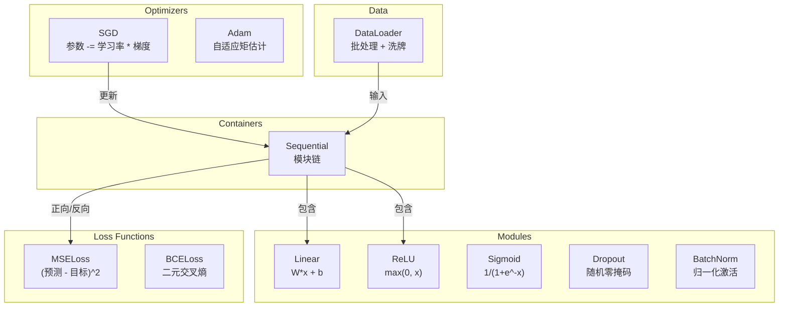
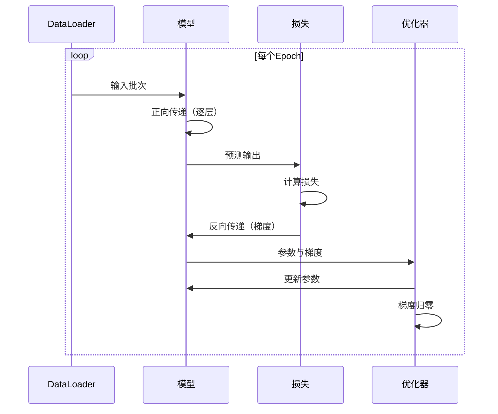
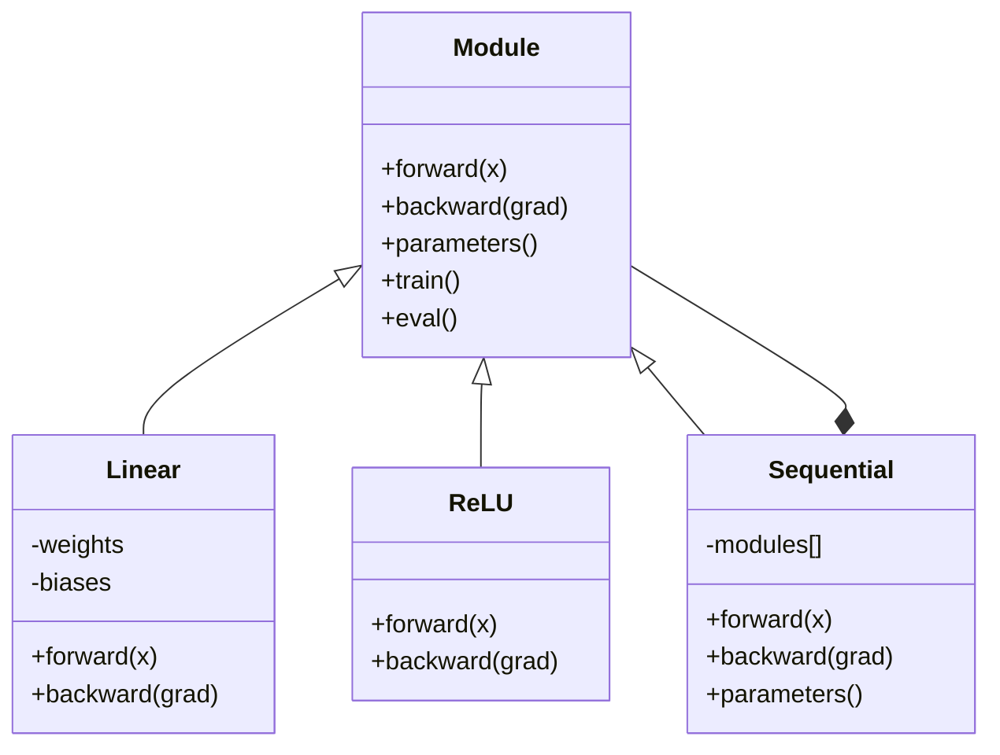

# 构建你自己的迷你框架

> 你已经构建了神经元（neurons）、层（layers）、网络（networks）、反向传播（backprop）、激活函数（activations）、损失函数（loss functions）、优化器（optimizers）、正则化（regularization）、初始化（initialization）和学习率调度（LR schedules）。这些都是独立的模块。现在将它们组合成一个框架。不是 PyTorch。也不是 TensorFlow。是你自己的。

**类型：** 构建  
**语言：** Python  
**先决条件：** 第三阶段全部课程（课程01-09）  
**时间：** 约120分钟

## 学习目标

- 构建一个完整的深度学习框架（约500行代码），包含 Module、Linear、ReLU、Sigmoid、Dropout、BatchNorm、Sequential、损失函数、优化器和 DataLoader  
- 解释 Module 抽象（forward、backward、parameters）以及训练/评估模式切换的必要性  
- 将所有组件连接成一个有效的训练循环，在圆形分类任务上训练4层网络  
- 将你框架中的每个组件映射到 PyTorch 对应组件（nn.Module、nn.Sequential、optim.Adam、DataLoader）

## 问题

你有十节课的构建模块分散在不同的文件中。这里有一个 `Value` 类，那边有训练循环，另一个文件中是权重初始化，学习率调度又是在另外一个文件。要训练网络，你需要从五节不同课程复制粘贴代码并手动连接它们。

这正是框架要解决的问题。PyTorch 提供了 `nn.Module`、`nn.Sequential`、`optim.Adam`、`DataLoader` 和一个将它们连接起来的训练循环模式。TensorFlow 提供了 `keras.Layer`、`keras.Sequential`、`keras.optimizers.Adam`。这些不是魔法，它们是组织模式，使你能够定义、训练和评估网络而无需每次都重新发明底层逻辑。

你将用约500行 Python 代码构建出同样的东西。不用 numpy。没有外部依赖。一个能定义任意前馈网络、用 SGD 或 Adam 训练、批处理数据、应用 Dropout 和批归一化、用任意激活函数并调度学习率的框架。

完成后，你会完全理解在 PyTorch 写 `model = nn.Sequential(...)` 时到底发生了什么。你会明白为什么有 `model.train()` 和 `model.eval()`。你会理解为什么 `optimizer.zero_grad()` 是独立的调用。你会全都明白，因为都是你亲手搭建的。

## 概念

### Module 抽象

PyTorch 中每层都继承自 `nn.Module`。Module 有三个职责：

1. **forward()** —— 给定输入计算输出  
2. **parameters()** —— 返回所有可训练权重  
3. **backward()** —— 计算梯度（PyTorch 用 autograd 自动处理，我们框架中显式实现）

线性层（Linear）是一个 Module。ReLU 激活是 Module。Dropout 层是 Module。批归一化层（BatchNorm）是 Module。它们都遵循相同接口。

### Sequential 容器

`nn.Sequential` 串联多个 Module。正向传递：输入依次通过模块1、模块2、模块3。反向传递：顺序反过来。容器本身也是 Module，带有 forward()、parameters() 和 backward()。这就是组合模式：一系列 Module 本身又是 Module。

### 训练模式与评估模式

Dropout 在训练时随机置零神经元，但评估时直接保留所有。批归一化在训练时用批量统计量，评估时用滑动平均。`train()` 和 `eval()` 方法用来切换这行为。每个 Module 都有一个 `training` 标志。

### 优化器（Optimizer）

优化器用梯度更新参数。SGD：`param -= lr * grad`。Adam：维护动量和方差估计然后更新。优化器不关心网络架构，只看到参数列表及对应梯度。

### DataLoader

批处理的意义有两个：一是大规模问题无法将整个数据集装入内存；二是小批量随机梯度下降带来的噪声有助于跳出局部极小值。DataLoader 将数据分成批次，并在每个 epoch 之间可选地打乱顺序。

### 框架架构



### 训练循环



### Module 层级结构



## 实现步骤

### 第1步：Module 基类

抽象接口，所有层都实现它。

```python
class Module:
    def __init__(self):
        self.training = True

    def forward(self, x):
        raise NotImplementedError

    def backward(self, grad):
        raise NotImplementedError

    def parameters(self):
        return []

    def train(self):
        self.training = True

    def eval(self):
        self.training = False
```

### 第2步：Linear 线性层

基础构建块。存储权重和偏置，正向计算 Wx + b，反向计算权重和输入梯度。

```python
import math
import random


class Linear(Module):
    def __init__(self, fan_in, fan_out):
        super().__init__()
        std = math.sqrt(2.0 / fan_in)
        self.weights = [[random.gauss(0, std) for _ in range(fan_in)] for _ in range(fan_out)]
        self.biases = [0.0] * fan_out
        self.weight_grads = [[0.0] * fan_in for _ in range(fan_out)]
        self.bias_grads = [0.0] * fan_out
        self.fan_in = fan_in
        self.fan_out = fan_out
        self.input = None

    def forward(self, x):
        self.input = x
        output = []
        for i in range(self.fan_out):
            val = self.biases[i]
            for j in range(self.fan_in):
                val += self.weights[i][j] * x[j]
            output.append(val)
        return output

    def backward(self, grad):
        input_grad = [0.0] * self.fan_in
        for i in range(self.fan_out):
            self.bias_grads[i] += grad[i]
            for j in range(self.fan_in):
                self.weight_grads[i][j] += grad[i] * self.input[j]
                input_grad[j] += grad[i] * self.weights[i][j]
        return input_grad

    def parameters(self):
        params = []
        for i in range(self.fan_out):
            for j in range(self.fan_in):
                params.append((self.weights, i, j, self.weight_grads))
            params.append((self.biases, i, None, self.bias_grads))
        return params
```

### 第3步：激活模块

ReLU、Sigmoid 和 Tanh 都是 Module。各自缓存反向传播所需数据。

```python
class ReLU(Module):
    def __init__(self):
        super().__init__()
        self.mask = None

    def forward(self, x):
        self.mask = [1.0 if v > 0 else 0.0 for v in x]
        return [max(0.0, v) for v in x]

    def backward(self, grad):
        return [g * m for g, m in zip(grad, self.mask)]


class Sigmoid(Module):
    def __init__(self):
        super().__init__()
        self.output = None

    def forward(self, x):
        self.output = []
        for v in x:
            v = max(-500, min(500, v))
            self.output.append(1.0 / (1.0 + math.exp(-v)))
        return self.output

    def backward(self, grad):
        return [g * o * (1 - o) for g, o in zip(grad, self.output)]


class Tanh(Module):
    def __init__(self):
        super().__init__()
        self.output = None

    def forward(self, x):
        self.output = [math.tanh(v) for v in x]
        return self.output

    def backward(self, grad):
        return [g * (1 - o * o) for g, o in zip(grad, self.output)]
```

### 第4步：Dropout 模块

训练时随机零掉元素。剩余元素按 1/(1-p) 缩放，保持期望值不变。评估时无操作。

```python
class Dropout(Module):
    def __init__(self, p=0.5):
        super().__init__()
        self.p = p
        self.mask = None

    def forward(self, x):
        if not self.training:
            return x
        self.mask = [0.0 if random.random() < self.p else 1.0 / (1 - self.p) for _ in x]
        return [v * m for v, m in zip(x, self.mask)]

    def backward(self, grad):
        if self.mask is None:
            return grad
        return [g * m for g, m in zip(grad, self.mask)]
```

### 第5步：BatchNorm 模块

对激活值在批次维度做零均值单位方差归一化。维护滑动均值和方差用于评估模式。

```python
class BatchNorm(Module):
    def __init__(self, size, momentum=0.1, eps=1e-5):
        super().__init__()
        self.size = size
        self.gamma = [1.0] * size
        self.beta = [0.0] * size
        self.gamma_grads = [0.0] * size
        self.beta_grads = [0.0] * size
        self.running_mean = [0.0] * size
        self.running_var = [1.0] * size
        self.momentum = momentum
        self.eps = eps
        self.x_norm = None
        self.std_inv = None
        self.batch_input = None

    def forward_batch(self, batch):
        batch_size = len(batch)
        output_batch = []

        if self.training:
            mean = [0.0] * self.size
            for sample in batch:
                for j in range(self.size):
                    mean[j] += sample[j]
            mean = [m / batch_size for m in mean]

            var = [0.0] * self.size
            for sample in batch:
                for j in range(self.size):
                    var[j] += (sample[j] - mean[j]) ** 2
            var = [v / batch_size for v in var]

            self.std_inv = [1.0 / math.sqrt(v + self.eps) for v in var]

            self.x_norm = []
            self.batch_input = batch
            for sample in batch:
                normed = [(sample[j] - mean[j]) * self.std_inv[j] for j in range(self.size)]
                self.x_norm.append(normed)
                output = [self.gamma[j] * normed[j] + self.beta[j] for j in range(self.size)]
                output_batch.append(output)

            for j in range(self.size):
                self.running_mean[j] = (1 - self.momentum) * self.running_mean[j] + self.momentum * mean[j]
                self.running_var[j] = (1 - self.momentum) * self.running_var[j] + self.momentum * var[j]
        else:
            std_inv = [1.0 / math.sqrt(v + self.eps) for v in self.running_var]
            for sample in batch:
                normed = [(sample[j] - self.running_mean[j]) * std_inv[j] for j in range(self.size)]
                output = [self.gamma[j] * normed[j] + self.beta[j] for j in range(self.size)]
                output_batch.append(output)

        return output_batch

    def forward(self, x):
        result = self.forward_batch([x])
        return result[0]

    def backward(self, grad):
        if self.x_norm is None:
            return grad
        for j in range(self.size):
            self.gamma_grads[j] += self.x_norm[0][j] * grad[j]
            self.beta_grads[j] += grad[j]
        return [grad[j] * self.gamma[j] * self.std_inv[j] for j in range(self.size)]

    def parameters(self):
        params = []
        for j in range(self.size):
            params.append((self.gamma, j, None, self.gamma_grads))
            params.append((self.beta, j, None, self.beta_grads))
        return params
```

### 步骤 6：顺序容器（Sequential Container）

模块链。前向传播从左到右，反向传播从右到左。

```python
class Sequential(Module):
    def __init__(self, *modules):
        super().__init__()
        self.modules = list(modules)

    def forward(self, x):
        for module in self.modules:
            x = module.forward(x)
        return x

    def backward(self, grad):
        for module in reversed(self.modules):
            grad = module.backward(grad)
        return grad

    def parameters(self):
        params = []
        for module in self.modules:
            params.extend(module.parameters())
        return params

    def train(self):
        self.training = True
        for module in self.modules:
            module.train()

    def eval(self):
        self.training = False
        for module in self.modules:
            module.eval()
```

### 步骤 7：损失函数（Loss Functions）

均方误差（MSE）和二元交叉熵（Binary Cross-Entropy）。每个都返回损失值并提供一个 `backward()` 方法返回梯度。

```python
class MSELoss:
    def __call__(self, predicted, target):
        self.predicted = predicted
        self.target = target
        n = len(predicted)
        self.loss = sum((p - t) ** 2 for p, t in zip(predicted, target)) / n
        return self.loss

    def backward(self):
        n = len(self.predicted)
        return [2 * (p - t) / n for p, t in zip(self.predicted, self.target)]


class BCELoss:
    def __call__(self, predicted, target):
        self.predicted = predicted
        self.target = target
        eps = 1e-7
        n = len(predicted)
        self.loss = 0
        for p, t in zip(predicted, target):
            p = max(eps, min(1 - eps, p))
            self.loss += -(t * math.log(p) + (1 - t) * math.log(1 - p))
        self.loss /= n
        return self.loss

    def backward(self):
        eps = 1e-7
        n = len(self.predicted)
        grads = []
        for p, t in zip(self.predicted, self.target):
            p = max(eps, min(1 - eps, p))
            grads.append((-t / p + (1 - t) / (1 - p)) / n)
        return grads
```

### 步骤 8：SGD 和 Adam 优化器（Optimizers）

两者都接受参数列表并使用梯度更新权重。

```python
class SGD:
    def __init__(self, parameters, lr=0.01):
        self.params = parameters
        self.lr = lr

    def step(self):
        for container, i, j, grad_container in self.params:
            if j is not None:
                container[i][j] -= self.lr * grad_container[i][j]
            else:
                container[i] -= self.lr * grad_container[i]

    def zero_grad(self):
        for container, i, j, grad_container in self.params:
            if j is not None:
                grad_container[i][j] = 0.0
            else:
                grad_container[i] = 0.0


class Adam:
    def __init__(self, parameters, lr=0.001, beta1=0.9, beta2=0.999, eps=1e-8):
        self.params = parameters
        self.lr = lr
        self.beta1 = beta1
        self.beta2 = beta2
        self.eps = eps
        self.t = 0
        self.m = [0.0] * len(parameters)
        self.v = [0.0] * len(parameters)

    def step(self):
        self.t += 1
        for idx, (container, i, j, grad_container) in enumerate(self.params):
            if j is not None:
                g = grad_container[i][j]
            else:
                g = grad_container[i]

            self.m[idx] = self.beta1 * self.m[idx] + (1 - self.beta1) * g
            self.v[idx] = self.beta2 * self.v[idx] + (1 - self.beta2) * g * g

            m_hat = self.m[idx] / (1 - self.beta1 ** self.t)
            v_hat = self.v[idx] / (1 - self.beta2 ** self.t)

            update = self.lr * m_hat / (math.sqrt(v_hat) + self.eps)

            if j is not None:
                container[i][j] -= update
            else:
                container[i] -= update

    def zero_grad(self):
        for container, i, j, grad_container in self.params:
            if j is not None:
                grad_container[i][j] = 0.0
            else:
                grad_container[i] = 0.0
```

### 步骤 9：数据加载器（DataLoader）

将数据拆分成批次，支持每轮训练时随机打乱。

```python
class DataLoader:
    def __init__(self, data, batch_size=32, shuffle=True):
        self.data = data
        self.batch_size = batch_size
        self.shuffle = shuffle

    def __iter__(self):
        indices = list(range(len(self.data)))
        if self.shuffle:
            random.shuffle(indices)
        for start in range(0, len(indices), self.batch_size):
            batch_indices = indices[start:start + self.batch_size]
            batch = [self.data[i] for i in batch_indices]
            inputs = [item[0] for item in batch]
            targets = [item[1] for item in batch]
            yield inputs, targets

    def __len__(self):
        return (len(self.data) + self.batch_size - 1) // self.batch_size
```

### 步骤 10：训练一个四层网络进行圆形分类

将所有模块连接起来。定义模型，选择损失函数，选用优化器，运行训练循环。

```python
def make_circle_data(n=500, seed=42):
    random.seed(seed)
    data = []
    for _ in range(n):
        x = random.uniform(-2, 2)
        y = random.uniform(-2, 2)
        label = 1.0 if x * x + y * y < 1.5 else 0.0
        data.append(([x, y], [label]))
    return data


def train():
    random.seed(42)

    model = Sequential(
        Linear(2, 16),
        ReLU(),
        Linear(16, 16),
        ReLU(),
        Linear(16, 8),
        ReLU(),
        Linear(8, 1),
        Sigmoid(),
    )

    criterion = BCELoss()
    optimizer = Adam(model.parameters(), lr=0.01)

    data = make_circle_data(500)
    split = int(len(data) * 0.8)
    train_data = data[:split]
    test_data = data[split:]

    loader = DataLoader(train_data, batch_size=16, shuffle=True)

    model.train()

    for epoch in range(100):
        total_loss = 0
        total_correct = 0
        total_samples = 0

        for batch_inputs, batch_targets in loader:
            batch_loss = 0
            for x, t in zip(batch_inputs, batch_targets):
                pred = model.forward(x)
                loss = criterion(pred, t)
                batch_loss += loss

                optimizer.zero_grad()
                grad = criterion.backward()
                model.backward(grad)
                optimizer.step()

                predicted_class = 1.0 if pred[0] >= 0.5 else 0.0
                if predicted_class == t[0]:
                    total_correct += 1
                total_samples += 1

            total_loss += batch_loss

        avg_loss = total_loss / total_samples
        accuracy = total_correct / total_samples * 100

        if epoch % 10 == 0 or epoch == 99:
            print(f"Epoch {epoch:3d} | Loss: {avg_loss:.6f} | Train Accuracy: {accuracy:.1f}%")

    model.eval()
    correct = 0
    for x, t in test_data:
        pred = model.forward(x)
        predicted_class = 1.0 if pred[0] >= 0.5 else 0.0
        if predicted_class == t[0]:
            correct += 1
    test_accuracy = correct / len(test_data) * 100
    print(f"\nTest Accuracy: {test_accuracy:.1f}% ({correct}/{len(test_data)})")

    return model, test_accuracy
```

## 使用示例（Use It）

这是你刚刚构建的代码对应的 PyTorch 实现：

```python
import torch
import torch.nn as nn
from torch.utils.data import DataLoader, TensorDataset

model = nn.Sequential(
    nn.Linear(2, 16),
    nn.ReLU(),
    nn.Linear(16, 16),
    nn.ReLU(),
    nn.Linear(16, 8),
    nn.ReLU(),
    nn.Linear(8, 1),
    nn.Sigmoid(),
)

criterion = nn.BCELoss()
optimizer = torch.optim.Adam(model.parameters(), lr=0.01)

for epoch in range(100):
    model.train()
    for inputs, targets in dataloader:
        optimizer.zero_grad()
        predictions = model(inputs)
        loss = criterion(predictions, targets)
        loss.backward()
        optimizer.step()

    model.eval()
    with torch.no_grad():
        test_predictions = model(test_inputs)
```

结构完全相同。`Sequential`、`Linear`、`ReLU`、`Sigmoid`、`BCELoss`、`Adam`、`zero_grad`、`backward`、`step`、`train`、`eval`。每个概念一一对应。差别在于 PyTorch 自动处理自动微分（无需在每个模块实现 `backward()`方法），支持 GPU 运行，并经过多年优化。但基本骨架是一致的。

现在你看到 PyTorch 代码时，完全理解每一行的含义。这正是我们学习的意义所在。

## 发布（Ship It）

本课产出内容：
- `outputs/prompt-framework-architect.md` —— 使用框架抽象设计神经网络架构的提示文档

## 练习（Exercises）

1. 添加一个 `SoftmaxCrossEntropyLoss` 类用于多分类。对预测结果应用 softmax，计算交叉熵损失，并实现联合反向传播。在一个三分类螺旋数据集上进行测试。

2. 在优化器中实现学习率调度：添加 `set_lr()` 方法，并接入第 09 课中的余弦调度。在圆形分类任务中使用 warmup + cosine 调度，并与固定学习率进行比较。

3. 给 `Sequential` 增加 `save()` 和 `load()` 方法，实现将所有权重序列化到 JSON 文件并重新加载。验证加载后的模型与原模型预测结果一致。

4. 在 Adam 优化器中实现权重衰减（L2 正则化）。添加一个 `weight_decay` 参数，每步使权重向零收缩。比较 `decay=0` 和 `decay=0.01` 下的训练效果。

5. 用真正的 mini-batch 梯度累积替换逐样本训练循环：在整个 batch 上累积梯度，然后除以 batch 大小并进行一次优化器更新。测量这是否改变了收敛速度。

## 关键词（Key Terms）

| 术语        | 常用说法            | 实际含义                           |
|------------|-------------------|--------------------------------|
| Module（模块）      | “一层”              | 框架中的基础抽象 —— 具有 `forward()`, `backward()`, 和 `parameters()` 方法的任何对象 |
| Sequential（顺序容器） | “按顺序堆叠层”        | 一个容器，将多个模块串联，正向按顺序执行，反向按相反顺序执行                 |
| Forward pass（前向传播）  | “运行网络”            | 通过每个模块顺序传递输入以计算输出                      |
| Backward pass（反向传播） | “计算梯度”            | 反向传递损失梯度，计算各参数梯度                       |
| Parameters（参数）     | “可训练权重”          | 网络中所有可以被优化器更新的数值 —— 权重与偏置               |
| Optimizer（优化器）     | “更新权重的工具”       | 利用梯度更新参数的算法，实现 SGD、Adam等奖励规则               |
| DataLoader（数据加载器）  | “喂数据的工具”        | 将数据集拆分为批次的迭代器，支持每轮训练时随机打乱               |
| Training mode（训练模式） | “model.train()”        | 启用诸如 dropout 和基于批次统计的 batch normalization 等随机行为的开关      |
| Evaluation mode（评估模式） | “model.eval()”         | 禁用 dropout，采用运行时统计量进行 batch normalization 的开关            |
| Zero grad（清零梯度）     | “清除梯度”            | 在计算下一批次梯度前，将所有参数梯度重置为零                       |

## 进一步阅读

- Paszke 等人, "PyTorch: An Imperative Style, High-Performance Deep Learning Library"（2019）——描述 PyTorch 设计决策的论文  
- Chollet, "Deep Learning with Python, Second Edition"（2021）——第3章介绍了具有相同模块/层抽象的 Keras 内部结构  
- Johnson, "Tiny-DNN" (https://github.com/tiny-dnn/tiny-dnn)——一个仅头文件的 C++ 深度学习框架，用于理解框架内部机制
