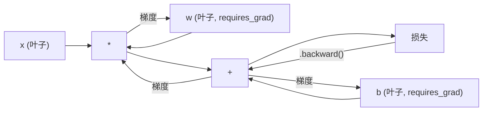
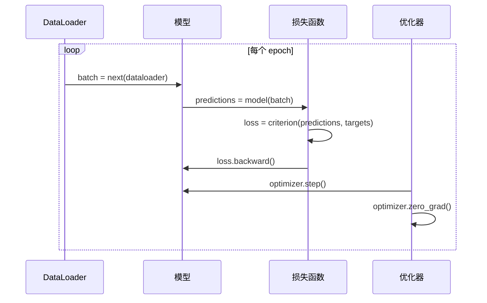

# PyTorch 入门

> 你已经用活塞和曲轴构建了引擎。现在学习大家真正驾驶的那个。

**类型:** 构建  
**语言:** Python  
**先决条件:** 课程 03.10（构建你自己的迷你框架）  
**时长:** 约 75 分钟

## 学习目标

- 使用 PyTorch 的 nn.Module、nn.Sequential 和 autograd 构建并训练神经网络  
- 使用 PyTorch 张量（tensors）、GPU 加速和标准训练循环（zero_grad、forward、loss、backward、step）  
- 将你从零开始构建的迷你框架组件转换为对应的 PyTorch 版本  
- 对比同一任务下纯 Python 框架与 PyTorch 的训练速度  

## 问题描述

你有一个可用的迷你框架，包括线性层、ReLU、dropout、batch norm、Adam 优化器、DataLoader 和训练循环。它在纯 Python 中训练一个四层网络，用于圆形分类问题。

但它在相同问题上比 PyTorch 慢 500 倍。

你的迷你框架用嵌套的 Python 循环一次处理一个样本。PyTorch 将相同操作调度到优化过的 C++/CUDA 核函数，这些核函数在 GPU 上运行。在一台 NVIDIA A100 上，PyTorch 训练一个具有 2560 万参数的 ResNet-50，处理 ImageNet（128 万张图片）大约需要 6 小时。你的框架在处理同样任务时大约需要 3000 小时——如果不是首先因为内存不足而崩溃。

速度差距不是唯一的问题。你的框架不支持 GPU，也没有自动微分——你为每个模块手写了 backward()。没有序列化、没有分布式训练、没有混合精度，也不能在不使用 print 语句的情况下调试梯度流。

PyTorch 填补了所有这些空白。同时，它保持了你已构建的完全相同的思维模型：Module、forward()、parameters()、backward()、optimizer.step()。概念一一对应，语法几乎相同。不同的是，PyTorch 在你设计的接口背后，封装了十年的系统工程。

## 概念介绍

### PyTorch 为什么会胜出

2015 年，TensorFlow 需要你先定义一个静态计算图，然后运行它。你先构建图，编译图，然后将数据传入。调试意味着盯着图形可视化。改变架构意味着从头重建计算图。

PyTorch 于 2017 年推出，采用了完全不同的理念：即时执行（eager execution）。你写 Python，它立即运行。`y = model(x)` 实际上是立刻计算出 y，而不是“往图里添加一个节点，之后才计算 y”。这意味着标准的 Python 调试工具可以正常工作。`print()` 工作正常。`pdb` 工作正常。forward 函数内的 if/else 也没问题。

到 2020 年，市场已做出选择。PyTorch 在机器学习研究论文中的份额从 7%（2017 年）增长到超过 75%（2022 年）。Meta、Google DeepMind、OpenAI、Anthropic 和 Hugging Face 都将 PyTorch 作为各自的主要框架。TensorFlow 2.x 也相应采纳了即时执行——这是一种默认承认 PyTorch 设计正确的表现。

教训：开发者体验是复利。一个运行速度慢 10%，但调试快 50% 的框架，无论何时都会获胜。

### 张量（Tensors）

张量是一个多维数组，具有三个重要属性：形状（shape）、数据类型（dtype）和设备（device）。

```python
import torch

x = torch.zeros(3, 4)           # 形状: (3, 4)，数据类型: float32，设备: cpu
x = torch.randn(2, 3, 224, 224) # 批量为 2 的 RGB 图像，大小 224x224
x = torch.tensor([1, 2, 3])     # 由 Python 列表创建
```

**形状** 表示维度。标量为 shape ()，向量为 (n,)，矩阵为 (m, n)，批量图像为 (batch, channels, height, width)。

**数据类型** 控制精度和内存占用。

| dtype    | 位数 | 范围                | 用例         |
|----------|------|---------------------|--------------|
| float32  | 32   | 约 7 位十进制数精度 | 默认训练     |
| float16  | 16   | 约 3.3 位十进制数    | 混合精度训练 |
| bfloat16 | 16   | 范围同 float32，精度较低 | 大语言模型训练 |
| int8     | 8    | -128 到 127         | 量化推理     |

**设备** 决定计算在哪里执行。

```python
device = torch.device("cuda" if torch.cuda.is_available() else "cpu")
x = torch.randn(3, 4, device=device)
x = x.to("cuda")
x = x.cpu()
```

所有操作要求参与的所有张量均在同一设备上。这是初学者遇到的 PyTorch 最常见错误：`RuntimeError: Expected all tensors to be on the same device`。解决方法是在计算之前，将所有张量迁移到同一设备。

**重塑形状** 是常数时间操作——它改变的是元数据，而非数据本身。

```python
x = torch.randn(2, 3, 4)
x.view(2, 12)      # 重塑为 (2, 12) -- 需连续内存
x.reshape(6, 4)    # 总是能工作，重塑为 (6, 4)
x.permute(2, 0, 1) # 维度重新排序
x.unsqueeze(0)     # 增加维度：(1, 2, 3, 4)
x.squeeze()        # 移除大小为 1 的维度
```

### 自动微分（Autograd）

你的迷你框架要求你为每个模块实现 backward()。PyTorch 不需要。它会将张量上的每个操作记录成一个有向无环图（计算图），然后自动反向遍历该图计算梯度。



与迷你框架的关键区别是：PyTorch 使用基于“磁带”的自动微分。每个操作在前向传递期间会追加到“磁带”上。调用 `.backward()` 会反向回放这段磁带。

```python
x = torch.randn(3, requires_grad=True)
y = x ** 2 + 3 * x
z = y.sum()
z.backward()
print(x.grad)  # dz/dx = 2x + 3
```

自动微分的三个规则：

1. 只有设置了 `requires_grad=True` 的叶子张量会累积梯度  
2. 梯度默认累计——每次反向传播前调用 `optimizer.zero_grad()` 清零  
3. `torch.no_grad()` 关闭梯度跟踪（用于评估阶段）  

### nn.Module

`nn.Module` 是 PyTorch 中所有神经网络组件的基类。你已经在第 10 课中构建了这个抽象。PyTorch 的版本添加了自动参数注册、递归模块发现、设备管理和状态字典（state dict）序列化。

```python
import torch.nn as nn

class MLP(nn.Module):
    def __init__(self, input_dim, hidden_dim, output_dim):
        super().__init__()
        self.layer1 = nn.Linear(input_dim, hidden_dim)
        self.relu = nn.ReLU()
        self.layer2 = nn.Linear(hidden_dim, output_dim)

    def forward(self, x):
        x = self.layer1(x)
        x = self.relu(x)
        x = self.layer2(x)
        return x
```

当你在 `__init__` 中将 `nn.Module` 或 `nn.Parameter` 赋值为属性时，PyTorch 会自动注册它们。`model.parameters()` 会递归搜集所有注册参数。这就是为什么你不必像在迷你框架中那样手动收集权重。

主要构建模块：

| 模块               | 功能               | 参数数量                       |
|--------------------|--------------------|-------------------------------|
| nn.Linear(in, out)  | 线性变换 Wx + b    | in*out + out                   |
| nn.Conv2d(in_ch, out_ch, k) | 二维卷积       | in_ch*out_ch*k*k + out_ch      |
| nn.BatchNorm1d(features) | 激活归一化       | 2 * features                  |
| nn.Dropout(p)       | 随机丢弃           | 0                             |
| nn.ReLU()           | max(0, x)          | 0                             |
| nn.GELU()           | 高斯误差线性单元   | 0                             |
| nn.Embedding(vocab, dim) | 查表操作         | vocab * dim                   |
| nn.LayerNorm(dim)   | 样本内归一化       | 2 * dim                       |

### 损失函数与优化器

PyTorch 提供你构建过的所有组件的生产级版本。

**损失函数**（来自 `torch.nn`）：

| 损失函数               | 任务             | 输入         |
|------------------------|------------------|--------------|
| nn.MSELoss()           | 回归             | 任意形状     |
| nn.CrossEntropyLoss()  | 多分类           | logits（非 softmax） |
| nn.BCEWithLogitsLoss() | 二分类           | logits（非 sigmoid） |
| nn.L1Loss()            | 鲁棒回归         | 任意形状     |
| nn.CTCLoss()           | 序列对齐         | 对数概率     |

注意：`CrossEntropyLoss` 内部结合了 `LogSoftmax` + `NLLLoss`。传入原始 logits，非 softmax 输出。这是一个常见错误，会默默产生错误梯度。

**优化器**（来自 `torch.optim`）：

| 优化器                  | 适用场景         | 典型学习率（LR） |
|-------------------------|------------------|-----------------|
| SGD(params, lr, momentum) | CNN、调优良好的模型 | 0.01--0.1      |
| Adam(params, lr)          | 默认起点          | 1e-3           |
| AdamW(params, lr, weight_decay) | Transformer、微调 | 1e-4--1e-3   |
| LBFGS(params)             | 小规模二阶方法    | 1.0            |

### 训练循环

每个 PyTorch 训练循环都遵循相同的五步模式。你在第 10 课已经学过。



标准套路：

```python
for epoch in range(num_epochs):
    model.train()
    for inputs, targets in train_loader:
        inputs, targets = inputs.to(device), targets.to(device)
        optimizer.zero_grad()
        outputs = model(inputs)
        loss = criterion(outputs, targets)
        loss.backward()
        optimizer.step()
```

批次循环内五行代码。训练 GPT-4、Stable Diffusion 和 LLaMA 时都使用这五行。模型架构变了，数据变了，这五行不变。

### Dataset 和 DataLoader

PyTorch 的 `Dataset` 是一个抽象类，定义了两个方法：`__len__` 和 `__getitem__`。`DataLoader` 对其封装，支持批量、随机洗牌和多进程加载数据。

```python
from torch.utils.data import Dataset, DataLoader

class MNISTDataset(Dataset):
    def __init__(self, images, labels):
        self.images = images
        self.labels = labels

    def __len__(self):
        return len(self.labels)

    def __getitem__(self, idx):
        return self.images[idx], self.labels[idx]

loader = DataLoader(dataset, batch_size=64, shuffle=True, num_workers=4)
```

参数 `num_workers=4` 开启 4 个进程并行加载数据，同时 GPU 在训练当前批次。对于磁盘 I/O 瓶颈（大图像、音频等）任务，仅此一项就可以提升训练速度一倍。

### GPU 训练

将模型移动到 GPU：

```python
device = torch.device("cuda" if torch.cuda.is_available() else "cpu")
model = model.to(device)
```

该操作递归迁移模型的每个参数和缓存到 GPU，然后训练时每个批次迁移数据：

```python
inputs, targets = inputs.to(device), targets.to(device)
```

**混合精度** 可将显存用量减半，同时在现代 GPU（A100、H100、RTX 4090）上实现吞吐量翻倍。它使用 float16 执行前向/反向传播，同时主权重保留 float32 精度：

```python
from torch.amp import autocast, GradScaler

scaler = GradScaler()
for inputs, targets in loader:
    with autocast(device_type="cuda"):
        outputs = model(inputs)
        loss = criterion(outputs, targets)
    scaler.scale(loss).backward()
    scaler.step(optimizer)
    scaler.update()
    optimizer.zero_grad()
```

### 对比：Mini Framework 与 PyTorch 与 JAX

| 功能 | Mini Framework（第10课） | PyTorch | JAX |
|---------|---------------------|---------|-----|
| Autodiff（自动微分） | 手动 `backward()` | 基于 Tape 的 autograd | 函数式变换 |
| 执行方式 | Eager（Python 循环） | Eager（C++ 内核） | 跟踪 + JIT 编译 |
| GPU 支持 | 无 | 有（CUDA，ROCm，MPS） | 有（CUDA，TPU） |
| 速度（MNIST MLP） | 约300秒/轮 | 约0.5秒/轮 | 约0.3秒/轮 |
| 模块系统 | 自定义 Module 类 | `nn.Module` | 无状态函数（Flax/Equinox） |
| 调试 | `print()` | `print()`，`pdb`，`breakpoint()` | 较难（JIT 跟踪破坏打印） |
| 生态系统 | 无 | Hugging Face，Lightning，timm | Flax，Optax，Orbax |
| 学习曲线 | 你手写的 | 中等 | 陡峭（函数式范式） |
| 生产使用 | 玩具问题 | Meta，OpenAI，Anthropic，HF | Google DeepMind，Midjourney |

## 构建它

使用纯 PyTorch 原语训练一个三层 MLP 在 MNIST 数据集上。无高阶包装器，无 `torchvision.datasets`，我们自己下载并解析原始数据。

### 第一步：从原始文件加载 MNIST

MNIST 分发为4个 gzip 压缩文件：训练图片（60,000 x 28 x 28）、训练标签、测试图片（10,000 x 28 x 28）、测试标签。我们下载它们并解析二进制格式。

```python
import torch
import torch.nn as nn
import struct
import gzip
import urllib.request
import os

def download_mnist(path="./mnist_data"):
    base_url = "https://storage.googleapis.com/cvdf-datasets/mnist/"
    files = [
        "train-images-idx3-ubyte.gz",
        "train-labels-idx1-ubyte.gz",
        "t10k-images-idx3-ubyte.gz",
        "t10k-labels-idx1-ubyte.gz",
    ]
    os.makedirs(path, exist_ok=True)
    for f in files:
        filepath = os.path.join(path, f)
        if not os.path.exists(filepath):
            urllib.request.urlretrieve(base_url + f, filepath)

def load_images(filepath):
    with gzip.open(filepath, "rb") as f:
        magic, num, rows, cols = struct.unpack(">IIII", f.read(16))
        data = f.read()
        images = torch.frombuffer(bytearray(data), dtype=torch.uint8)
        images = images.reshape(num, rows * cols).float() / 255.0
    return images

def load_labels(filepath):
    with gzip.open(filepath, "rb") as f:
        magic, num = struct.unpack(">II", f.read(8))
        data = f.read()
        labels = torch.frombuffer(bytearray(data), dtype=torch.uint8).long()
    return labels
```

### 第二步：定义模型

一个三层 MLP：784 -> 256 -> 128 -> 10，ReLU 激活，使用 Dropout 做正则化。为简化，不用 BatchNorm。

```python
class MNISTModel(nn.Module):
    def __init__(self):
        super().__init__()
        self.net = nn.Sequential(
            nn.Linear(784, 256),
            nn.ReLU(),
            nn.Dropout(0.2),
            nn.Linear(256, 128),
            nn.ReLU(),
            nn.Dropout(0.2),
            nn.Linear(128, 10),
        )

    def forward(self, x):
        return self.net(x)
```

输出层产生10个原始 logits（每个类别一个）。无 Softmax —— `CrossEntropyLoss` 内部处理。

参数数量：784*256 + 256 + 256*128 + 128 + 128*10 + 10 = 235,146。现代标准算很小，GPT-2 small 有1.24亿参数。这个训练秒级完成。

### 第三步：训练循环

标准的前向-损失-反向-优化步骤。

```python
def train_one_epoch(model, loader, criterion, optimizer, device):
    model.train()
    total_loss = 0
    correct = 0
    total = 0
    for images, labels in loader:
        images, labels = images.to(device), labels.to(device)
        optimizer.zero_grad()
        outputs = model(images)
        loss = criterion(outputs, labels)
        loss.backward()
        optimizer.step()
        total_loss += loss.item() * images.size(0)
        _, predicted = outputs.max(1)
        correct += predicted.eq(labels).sum().item()
        total += labels.size(0)
    return total_loss / total, correct / total


def evaluate(model, loader, criterion, device):
    model.eval()
    total_loss = 0
    correct = 0
    total = 0
    with torch.no_grad():
        for images, labels in loader:
            images, labels = images.to(device), labels.to(device)
            outputs = model(images)
            loss = criterion(outputs, labels)
            total_loss += loss.item() * images.size(0)
            _, predicted = outputs.max(1)
            correct += predicted.eq(labels).sum().item()
            total += labels.size(0)
    return total_loss / total, correct / total
```

注意评估时使用 `torch.no_grad()`。禁用 autograd，减少内存占用并加速推理。否则 PyTorch 会构建一个你不用的计算图。

### 第四步：整合所有代码

```python
def main():
    device = torch.device("cuda" if torch.cuda.is_available() else "cpu")

    download_mnist()
    train_images = load_images("./mnist_data/train-images-idx3-ubyte.gz")
    train_labels = load_labels("./mnist_data/train-labels-idx1-ubyte.gz")
    test_images = load_images("./mnist_data/t10k-images-idx3-ubyte.gz")
    test_labels = load_labels("./mnist_data/t10k-labels-idx1-ubyte.gz")

    train_dataset = torch.utils.data.TensorDataset(train_images, train_labels)
    test_dataset = torch.utils.data.TensorDataset(test_images, test_labels)
    train_loader = torch.utils.data.DataLoader(
        train_dataset, batch_size=64, shuffle=True
    )
    test_loader = torch.utils.data.DataLoader(
        test_dataset, batch_size=256, shuffle=False
    )

    model = MNISTModel().to(device)
    criterion = nn.CrossEntropyLoss()
    optimizer = torch.optim.Adam(model.parameters(), lr=1e-3)

    num_params = sum(p.numel() for p in model.parameters())
    print(f"设备: {device}")
    print(f"参数数量: {num_params:,}")
    print(f"训练样本数: {len(train_dataset):,}")
    print(f"测试样本数: {len(test_dataset):,}")
    print()

    for epoch in range(10):
        train_loss, train_acc = train_one_epoch(
            model, train_loader, criterion, optimizer, device
        )
        test_loss, test_acc = evaluate(
            model, test_loader, criterion, device
        )
        print(
            f"第 {epoch+1:2d} 轮 | "
            f"训练损失: {train_loss:.4f} | 训练准确率: {train_acc:.4f} | "
            f"测试损失: {test_loss:.4f} | 测试准确率: {test_acc:.4f}"
        )

    torch.save(model.state_dict(), "mnist_mlp.pt")
    print(f"\n模型已保存至 mnist_mlp.pt")
    print(f"最终测试准确率: {test_acc:.4f}")
```

10 轮后预期测试准确率约97.8%。CPU 训练时间约30秒，GPU上约5秒。在你的 Mini Framework 上相同架构约45分钟。

## 使用它

### 快速对比：Mini Framework 与 PyTorch

| Mini Framework（第10课） | PyTorch |
|---------------------------|---------|
| `model = Sequential(Linear(784, 256), ReLU(), ...)` | `model = nn.Sequential(nn.Linear(784, 256), nn.ReLU(), ...)` |
| `pred = model.forward(x)` | `pred = model(x)` |
| `optimizer.zero_grad()` | `optimizer.zero_grad()` |
| `grad = criterion.backward()` 然后 `model.backward(grad)` | `loss.backward()` |
| `optimizer.step()` | `optimizer.step()` |
| 无 GPU 支持 | `model.to("cuda")` |
| 每个模块手动反向 | Autograd 自动处理 |

接口几乎相同，区别在于底层实现。

### 模型保存和加载

```python
torch.save(model.state_dict(), "model.pt")

model = MNISTModel()
model.load_state_dict(torch.load("model.pt", weights_only=True))
model.eval()
```

总是保存 `state_dict()`（参数字典），而非模型对象。保存模型对象用的是 pickle，重构代码时会坏。State dict 是可移植的。

### 学习率调度

```python
scheduler = torch.optim.lr_scheduler.CosineAnnealingLR(
    optimizer, T_max=10
)
for epoch in range(10):
    train_one_epoch(model, train_loader, criterion, optimizer, device)
    scheduler.step()
```

PyTorch 标配提供15+种调度器：StepLR，ExponentialLR，CosineAnnealingLR，OneCycleLR，ReduceLROnPlateau。全部兼容统一的优化器接口。

## 交付它

本课产出两个成果：

- `outputs/prompt-pytorch-debugger.md` —— 用于诊断常见 PyTorch 训练故障的提示
- `outputs/skill-pytorch-patterns.md` —— PyTorch 训练模式的技能参考

## 练习

1. **加入批归一化（BatchNorm）。** 在每个线性层后（激活前）插入 `nn.BatchNorm1d`。对比测试准确率及训练速度和仅用 Dropout 版本。BatchNorm 通常用更少轮次达到98%+准确率。

2. **实现学习率发现器（learning rate finder）。** 训练一个周期，学习率指数增长（1e-7 到 1.0）。绘制损失随学习率变化的曲线。最佳学习率就在损失开始上升之前。用它为 MNIST 模型选个更好的学习率。

3. **迁移 GPU 并混合精度训练。** 训练循环加入 `torch.amp.autocast` 和 `GradScaler`。在 GPU 上测量混合精度和非混合精度的吞吐量（样本/秒）。在 A100 上预期约2倍加速。

4. **自定义数据集类。** 下载 Fashion-MNIST（结构同 MNIST，但样本是服装）。实现一个 `FashionMNISTDataset(Dataset)` 类，定义 `__getitem__` 和 `__len__`。用同样 MLP 训练并对比准确率。Fashion-MNIST 更难，约88% vs 约98%。

5. **将 Adam 换成 SGD + 动量。** 用 `SGD(params, lr=0.01, momentum=0.9)` 训练。对比收敛曲线。然后用 `CosineAnnealingLR` 调度，观察是否能在第10轮赶上 Adam。

## 关键词术语

| 术语 | 大众说法 | 实际含义 |
|------|----------|----------|
| Tensor（张量） | “一个多维数组” | 一个带类型、设备感知，并且每个操作内置自动微分支持的数组 |
| Autograd（自动微分） | “自动反向传播” | 以 Tape 为基础的系统，前向执行时记录操作，反向时逆序重放计算精确梯度 |
| nn.Module（模块） | “一层” | 任意可微计算块的基类——注册参数，支持嵌套，处理训练/评估状态 |
| state_dict（状态字典） | “模型权重” | 一个 OrderedDict，映射参数名到张量——训练模型可移植、可序列化的表示 |
| .backward()（反向传播） | “计算梯度” | 逆序遍历计算图，在所有 requires_grad=True 的叶子节点累积梯度 |
| .to(device)（转移设备） | “移到 GPU” | 递归将所有参数和缓冲转移到指定设备（CPU，CUDA，MPS） |
| DataLoader（数据加载器） | “数据管道” | 一个迭代器，批处理、打乱，并可选并行从 Dataset 加载数据 |
| Mixed precision（混合精度） | “使用 float16” | 用 float16 做前向/反向计算加速，保持 float32 主权重以保障数值稳定 |
| Eager execution（即时执行） | “马上运行” | 操作调用即刻执行，不延迟到后续编译步骤——是 PyTorch 和 TF 1.x 主要设计差异 |
| zero_grad（梯度清零） | “重置梯度” | 在下一次反向传播前将所有参数梯度设为零，因为 PyTorch 默认梯度累加 |

## 拓展阅读

- Paszke 等人，《PyTorch：一种命令式风格的高性能深度学习库》（2019）——解释 PyTorch 设计权衡的原创论文  
- PyTorch 教程：《用示例学习 PyTorch》（https://pytorch.org/tutorials/beginner/pytorch_with_examples.html）——从张量（tensor）到 nn.Module 的官方路径  
- PyTorch 性能调优指南（https://pytorch.org/tutorials/recipes/recipes/tuning_guide.html）——混合精度（mixed precision）、DataLoader 工作线程、页锁内存（pinned memory）及其他生产优化  
- Horace He，《让深度学习飞起来》（https://horace.io/brrr_intro.html）——为什么 GPU 训练快速，以及 PyTorch 相关的优化策略
