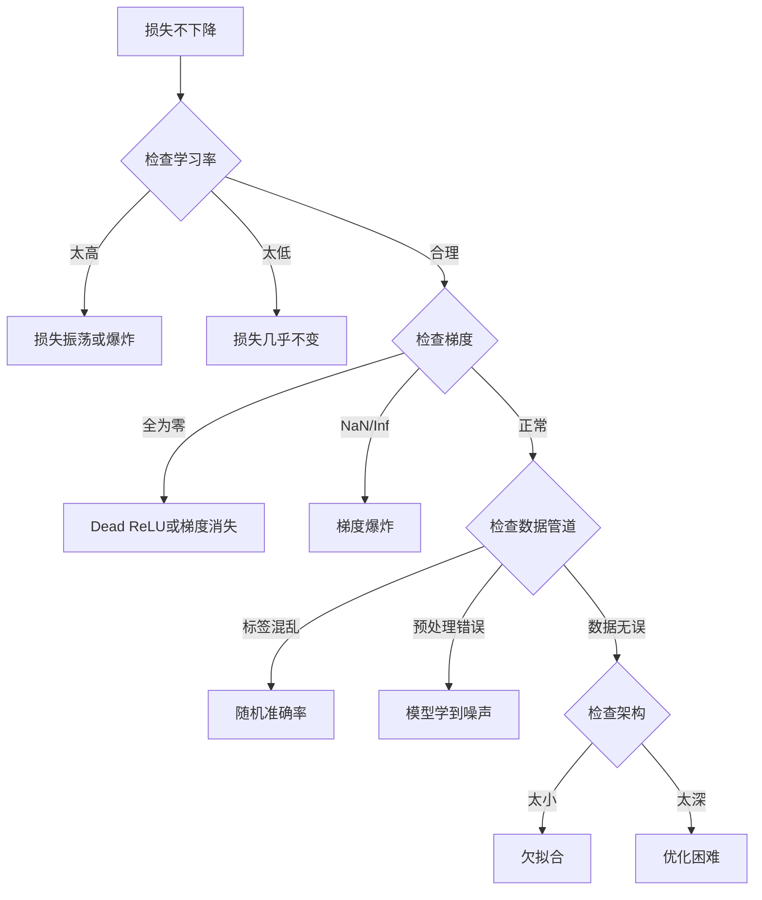
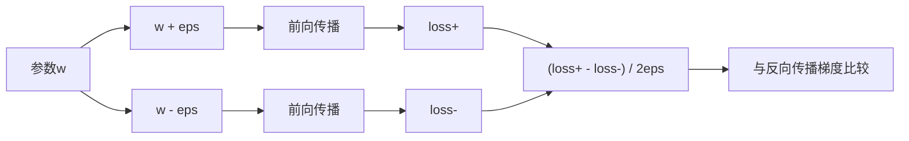
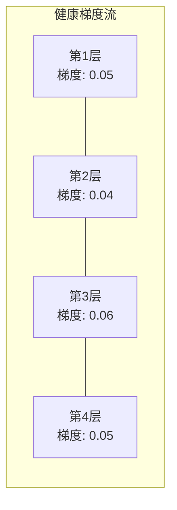
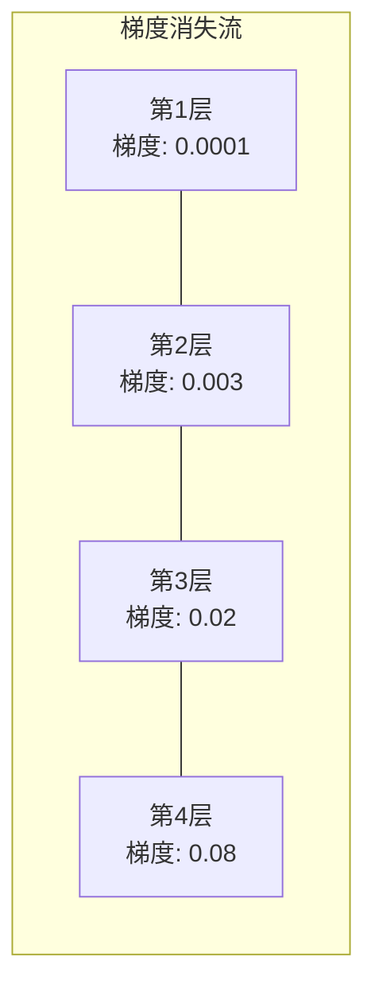

# 调试神经网络

> 你的网络编译通过了。它运行了。它产生了一个数值。这个数值是错的，没有任何崩溃。欢迎来到最难的调试类型——没有错误提示的调试。

**类型：** 练习  
**语言：** Python, PyTorch  
**先决条件：** 第03阶段第01-10课（特别是反向传播、损失函数、优化器）  
**时间：** 约90分钟

## 学习目标

- 使用系统化调试策略诊断常见神经网络故障（NaN损失、损失曲线平坦、过拟合、振荡）  
- 应用“单批次过拟合”技术验证模型架构和训练循环的正确性  
- 检查梯度大小、激活分布和权重范数，识别梯度消失/爆炸问题  
- 制作涵盖数据管道、模型架构、损失函数、优化器和学习率问题的调试清单

## 问题描述

传统软件出错时会崩溃。空指针抛出异常。类型不匹配在编译时报错。越界错误产生明显错误的输出。

神经网络没有这种便利。

损坏的神经网络仍然能运行完成，打印出损失值并输出预测。损失可能下降。预测可能看起来合理。但模型默默错误——学习捷径、记忆噪声或者收敛到无用的局部最优。谷歌研究者估计60-70%的机器学习调试时间花在“沉默”错误上——没有报错但导致模型性能下降。

运行正常的模型和损坏模型的区别往往就是一行写错的代码：缺少`zero_grad()`、维度转置错误、学习率错了10倍。经典的“训练神经网络的配方”（2019）开篇写道：“最常见的神经网络错误是那些不会崩溃的Bug。”

本课将教你如何发现这些Bug。

## 概念

### 调试心态

忘掉那种“打印输出希望有效”的调试方法。神经网络调试需要系统化的方法，因为反馈循环很慢（训练一次可能需要几分钟到几个小时），且症状含糊不清（坏的损失可能有20种原因）。

黄金法则：**从简单开始，每次只加一个新元素，并独立验证每个元素。**



### 症状1：损失不下降

这是最常见的抱怨。训练循环运行，epoch过去，损失保持平坦或剧烈振荡。

**学习率错了。** 太高：损失振荡或跳变为NaN。太低：损失下降过慢，看起来平坦。Adam从1e-3开始，SGD从1e-1或1e-2开始。总是试3个跨10倍的学习率（如1e-2，1e-3，1e-4），然后再判断问题所在。

**Dead ReLU。** ReLU神经元遇到大的负输入时输出0，梯度为0，之后永远不激活。如果死神经元过多，网络无法学习。检查：打印每个ReLU层后激活值为零的比例。如果超过50%，换LeakyReLU或者降低学习率。

**梯度消失。** 对于采用sigmoid或tanh激活的深层网络，梯度向后传播时指数级衰减，到第一层时几乎为0，第一层不再学习。解决办法：用ReLU/GELU，添加残差连接，或使用Batch Normalization（批归一化）。

**梯度爆炸。** 相反的问题——梯度指数级增长。常见于RNN和超深网络。损失跳变为NaN。解决：梯度裁剪（`torch.nn.utils.clip_grad_norm_`），降低学习率，或加归一化。

### 症状2：损失下降但模型性能差

损失降低，训练准确率达到99%，但测试准确率仅55%，或者实际数据上输出荒谬。

**过拟合。** 模型记住训练样本而非学习模式，训练和验证损失差距越来越大。解决：更多数据、dropout、权重衰减、早停、数据增强。

**数据泄露。** 测试数据漏入训练，准确率异常高。常见原因：先打乱再分割，使用全数据统计量预处理，跨拆分重复样本。解决：先拆分再预处理，检查重复。

**标签错误。** 多数真实数据集有5-10%的标签错误（Northcutt 等, 2021——“测试集普遍存在标签错误”）。模型学到了噪声。解决：用confident learning找出并修正错误标签，或用损失截断忽略高损失样本。

### 症状3：损失出现NaN或Inf

损失值变成`nan`或`inf`。训练失败。

**学习率过高。** 梯度更新振荡导致权重爆炸。解决：降低10倍。

**log(0)或log负数。** 交叉熵损失计算`log(p)`，若模型输出正好是0或负概率，log爆炸。解决：将预测概率限制在`[eps, 1-eps]`，其中`eps=1e-7`。

**除零。** Batch Normalization除以标准差，若批次恒定值则std为0。解决：加epsilon到分母（PyTorch默认有，但自定义实现可能无）。

**数值溢出。** 大激活输入`exp()`产生Inf。Softmax尤其易爆。解决：指数前减去最大值（log-sum-exp技巧）。

### 技术1：梯度检查

比对解析梯度（反向传播）与数值梯度（有限差分），若不一致，后向计算有Bug。

参数`w`的数值梯度：

```text
grad_numerical = (loss(w + eps) - loss(w - eps)) / (2 * eps)
```

相对误差指标：

```text
rel_diff = |grad_analytical - grad_numerical| / max(|grad_analytical|, |grad_numerical|, 1e-8)
```

若`rel_diff < 1e-5`：正确。若`rel_diff > 1e-3`：几乎肯定有Bug。



### 技术2：激活统计

训练时监控每层激活的均值和标准差。健康网络的激活均值接近0，标准差接近1（归一化后）或至少有限。

| 健康指标 | 均值 | 标准差 | 诊断 |
|---|---|---|---|
| 健康 | ~0 | ~1 | 网络正常学习 |
| 饱和 | >>0 或 <<0 | ~0 | 激活卡在极值 |
| 死亡 | 0 | 0 | 神经元死亡（全零） |
| 爆炸 | >>10 | >>10 | 激活无界增长 |

### 技术3：梯度流可视化

绘制各层平均梯度大小。健康网络中，各层梯度大小大致相近。若前层梯度比后层小1000倍，说明存在梯度消失。





### 技术4：单批次过拟合测试

深度学习中最重要的调试技术。

取一批小样本（8-32个），连续训练100+次。损失应接近0，训练准确率达100%。若不达标，说明模型或训练循环有根本错误——不要继续全量训练。

此测法可发现：  
- 损失函数有问题  
- 后向传播有Bug  
- 模型容量不足  
- 优化器未关联模型参数  
- 数据标签错位

此测试用时约30秒，可节省数小时全训练调试。

### 技术5：学习率查找器

Leslie Smith（2017）提出在一轮训练中将学习率从极小（1e-7）扫到极大（10），并记录损失，绘制损失与学习率曲线。最佳学习率约为损失开始最快下降点的10倍以下。


本例最佳LR约为1e-3（最大下降点前一阶）。

### 常见PyTorch Bug

这些Bug浪费了PyTorch社区最多工时：

| Bug | 症状 | 解决|
|-----|---------|-----|
| 忘记`optimizer.zero_grad()` | 梯度累积，损失振荡 | 在`loss.backward()`前加`optimizer.zero_grad()` |
| 测试时忘记`model.eval()` | Dropout与BatchNorm行为不同，测试不稳定 | 加`model.eval()`和`torch.no_grad()` |
| 张量形状错误 | 隐式广播错结果，无报错 | 调试时每步打印形状 |
| CPU/GPU不匹配 | `RuntimeError: expected CUDA tensor` | 模型和数据都用`.to(device)` |
| 未detach张量 | 计算图无限增长，OOM | 用`.detach()`或`with torch.no_grad()` |
| 原地操作破坏自动求导 | `RuntimeError: modified by in-place operation` | 用`x = x + 1`代替`x += 1` |
| 数据未归一化 | 损失停在随机水平 | 输入归一化到均值0、标准差1 |
| 标签类型错 | 交叉熵需要`Long`标签，给了`Float` | 转为长整型：`labels.long()` |

### 高级调试表

| 症状 | 可能原因 | 先尝试的操作 |
|-------|-----------|-----------------|
| 损失停在 -log(1/类别数) | 模型预测均匀概率分布 | 检查数据管道，确认标签与输入匹配 |
| 损失几步后NaN | 学习率太高 | 学习率降低10倍 |
| 损失立即NaN | log(0)或除零 | 给log/除法加epsilon |
| 损失剧烈振荡 | 学习率高或批次太小 | 减低学习率，增大批次 |
| 损失下降后平台期 | 学习率对微调阶段过高 | 添加学习率调度（余弦或阶梯衰减） |
| 训练准确率高，测试准确率低 | 过拟合 | 加dropout、权重衰减，更多数据 |
| 训练准确率=测试准确率=随机水平 | 模型没有学到东西 | 运行单批次过拟合测试 |
| 训练准确率=测试准确率且都低 | 欠拟合 | 模型更大，增加层数或特征 |
| 梯度全零 | Dead ReLU或计算图断裂 | 换LeakyReLU，检查`.requires_grad` |
| 训练时内存不足 | 批次过大或图未释放 | 减小批次，评估用`torch.no_grad()` |

## 构建它

一个监控激活（activation）、梯度（gradient）和损失曲线（loss curves）的诊断工具包。你将故意破坏一个网络并使用工具包诊断每个问题。

### 步骤 1：NetworkDebugger 类

钩入一个 PyTorch 模型以记录每层的激活和梯度统计数据。

```python
import torch
import torch.nn as nn
import math


class NetworkDebugger:
    def __init__(self, model):
        self.model = model
        self.activation_stats = {}
        self.gradient_stats = {}
        self.loss_history = []
        self.lr_losses = []
        self.hooks = []
        self._register_hooks()

    def _register_hooks(self):
        for name, module in self.model.named_modules():
            if isinstance(module, (nn.Linear, nn.Conv2d, nn.ReLU, nn.LeakyReLU)):
                hook = module.register_forward_hook(self._make_activation_hook(name))
                self.hooks.append(hook)
                hook = module.register_full_backward_hook(self._make_gradient_hook(name))
                self.hooks.append(hook)

    def _make_activation_hook(self, name):
        def hook(module, input, output):
            with torch.no_grad():
                out = output.detach().float()
                self.activation_stats[name] = {
                    "mean": out.mean().item(),
                    "std": out.std().item(),
                    "fraction_zero": (out == 0).float().mean().item(),
                    "min": out.min().item(),
                    "max": out.max().item(),
                }
        return hook

    def _make_gradient_hook(self, name):
        def hook(module, grad_input, grad_output):
            if grad_output[0] is not None:
                with torch.no_grad():
                    grad = grad_output[0].detach().float()
                    self.gradient_stats[name] = {
                        "mean": grad.mean().item(),
                        "std": grad.std().item(),
                        "abs_mean": grad.abs().mean().item(),
                        "max": grad.abs().max().item(),
                    }
        return hook

    def record_loss(self, loss_value):
        self.loss_history.append(loss_value)

    def check_loss_health(self):
        if len(self.loss_history) < 2:
            return "NOT_ENOUGH_DATA"
        recent = self.loss_history[-10:]
        if any(math.isnan(v) or math.isinf(v) for v in recent):
            return "NAN_OR_INF"
        if len(self.loss_history) >= 20:
            first_half = sum(self.loss_history[:10]) / 10
            second_half = sum(self.loss_history[-10:]) / 10
            if second_half >= first_half * 0.99:
                return "NOT_DECREASING"
        if len(recent) >= 5:
            diffs = [recent[i+1] - recent[i] for i in range(len(recent)-1)]
            if max(diffs) - min(diffs) > 2 * abs(sum(diffs) / len(diffs)):
                return "OSCILLATING"
        return "HEALTHY"

    def check_activations(self):
        issues = []
        for name, stats in self.activation_stats.items():
            if stats["fraction_zero"] > 0.5:
                issues.append(f"DEAD_NEURONS: {name} 有 {stats['fraction_zero']:.0%} 的激活为零")
            if abs(stats["mean"]) > 10:
                issues.append(f"EXPLODING_ACTIVATIONS: {name} 均值={stats['mean']:.2f}")
            if stats["std"] < 1e-6:
                issues.append(f"COLLAPSED_ACTIVATIONS: {name} 标准差={stats['std']:.2e}")
        return issues if issues else ["HEALTHY"]

    def check_gradients(self):
        issues = []
        grad_magnitudes = []
        for name, stats in self.gradient_stats.items():
            grad_magnitudes.append((name, stats["abs_mean"]))
            if stats["abs_mean"] < 1e-7:
                issues.append(f"VANISHING_GRADIENT: {name} 绝对平均={stats['abs_mean']:.2e}")
            if stats["abs_mean"] > 100:
                issues.append(f"EXPLODING_GRADIENT: {name} 绝对平均={stats['abs_mean']:.2e}")
        if len(grad_magnitudes) >= 2:
            first_mag = grad_magnitudes[0][1]
            last_mag = grad_magnitudes[-1][1]
            if last_mag > 0 and first_mag / last_mag > 100:
                issues.append(f"GRADIENT_RATIO: first/last = {first_mag/last_mag:.0f} 倍（梯度消失）")
        return issues if issues else ["HEALTHY"]

    def print_report(self):
        print("\n=== 网络调试器报告 ===")
        print(f"\n损失健康状态: {self.check_loss_health()}")
        if self.loss_history:
            print(f"  最近 5 次损失: {[f'{v:.4f}' for v in self.loss_history[-5:]]}")
        print("\n激活诊断：")
        for item in self.check_activations():
            print(f"  {item}")
        print("\n梯度诊断：")
        for item in self.check_gradients():
            print(f"  {item}")
        print("\n每层激活统计：")
        for name, stats in self.activation_stats.items():
            print(f"  {name}: 均值={stats['mean']:.4f} 标准差={stats['std']:.4f} 零值比例={stats['fraction_zero']:.1%}")
        print("\n每层梯度统计：")
        for name, stats in self.gradient_stats.items():
            print(f"  {name}: 绝对平均={stats['abs_mean']:.2e} 最大值={stats['max']:.2e}")

    def remove_hooks(self):
        for hook in self.hooks:
            hook.remove()
        self.hooks.clear()
```

### 步骤 2：单批次过拟合测试（Overfit-One-Batch Test）

```python
def overfit_one_batch(model, x_batch, y_batch, criterion, lr=0.01, steps=200):
    optimizer = torch.optim.Adam(model.parameters(), lr=lr)
    model.train()
    print("\n=== 单批次过拟合测试 ===")
    print(f"批次大小: {x_batch.shape[0]}, 训练步数: {steps}")

    for step in range(steps):
        optimizer.zero_grad()
        output = model(x_batch)
        loss = criterion(output, y_batch)
        loss.backward()
        optimizer.step()

        if step % 50 == 0 or step == steps - 1:
            with torch.no_grad():
                preds = (output > 0).float() if output.shape[-1] == 1 else output.argmax(dim=1)
                targets = y_batch if y_batch.dim() == 1 else y_batch.squeeze()
                acc = (preds.squeeze() == targets).float().mean().item()
            print(f"  步骤 {step:3d} | 损失: {loss.item():.6f} | 准确率: {acc:.1%}")

    final_loss = loss.item()
    if final_loss > 0.1:
        print(f"\n  失败: 损失未收敛（{final_loss:.4f}）。模型或训练流程存在问题。")
        return False
    print(f"\n  通过: 损失收敛至 {final_loss:.6f}")
    return True
```

### 步骤 3：学习率查找器（Learning Rate Finder）

```python
def find_learning_rate(model, x_data, y_data, criterion, start_lr=1e-7, end_lr=10, steps=100):
    import copy
    original_state = copy.deepcopy(model.state_dict())
    optimizer = torch.optim.SGD(model.parameters(), lr=start_lr)
    lr_mult = (end_lr / start_lr) ** (1 / steps)

    model.train()
    results = []
    best_loss = float("inf")
    current_lr = start_lr

    print("\n=== 学习率查找器 ===")

    for step in range(steps):
        optimizer.zero_grad()
        output = model(x_data)
        loss = criterion(output, y_data)

        if math.isnan(loss.item()) or loss.item() > best_loss * 10:
            break

        best_loss = min(best_loss, loss.item())
        results.append((current_lr, loss.item()))

        loss.backward()
        optimizer.step()

        current_lr *= lr_mult
        for param_group in optimizer.param_groups:
            param_group["lr"] = current_lr

    model.load_state_dict(original_state)

    if len(results) < 10:
        print("  学习率扫描未完成 —— 损失迅速发散")
        return results

    min_loss_idx = min(range(len(results)), key=lambda i: results[i][1])
    suggested_lr = results[max(0, min_loss_idx - 10)][0]

    print(f"  扫描了 {len(results)} 步，学习率从 {start_lr:.0e} 变到 {results[-1][0]:.0e}")
    print(f"  最小损失 {results[min_loss_idx][1]:.4f} 在 lr={results[min_loss_idx][0]:.2e}")
    print(f"  建议学习率：{suggested_lr:.2e}")

    return results
```

### 步骤 4：梯度检查器（Gradient Checker）

```python
def _flat_to_multi_index(flat_idx, shape):
    multi_idx = []
    remaining = flat_idx
    for dim in reversed(shape):
        multi_idx.insert(0, remaining % dim)
        remaining //= dim
    return tuple(multi_idx)


def gradient_check(model, x, y, criterion, eps=1e-4):
    model.train()
    x_double = x.double()
    y_double = y.double()
    model_double = model.double()

    print("\n=== 梯度检查 ===")
    overall_max_diff = 0
    checked = 0

    for name, param in model_double.named_parameters():
        if not param.requires_grad:
            continue

        layer_max_diff = 0

        model_double.zero_grad()
        output = model_double(x_double)
        loss = criterion(output, y_double)
        loss.backward()
        analytical_grad = param.grad.clone()

        num_checks = min(5, param.numel())
        for i in range(num_checks):
            idx = _flat_to_multi_index(i, param.shape)
            original = param.data[idx].item()

            param.data[idx] = original + eps
            with torch.no_grad():
                loss_plus = criterion(model_double(x_double), y_double).item()

            param.data[idx] = original - eps
            with torch.no_grad():
                loss_minus = criterion(model_double(x_double), y_double).item()

            param.data[idx] = original

            numerical = (loss_plus - loss_minus) / (2 * eps)
            analytical = analytical_grad[idx].item()

            denom = max(abs(numerical), abs(analytical), 1e-8)
            rel_diff = abs(numerical - analytical) / denom

            layer_max_diff = max(layer_max_diff, rel_diff)
            checked += 1

        overall_max_diff = max(overall_max_diff, layer_max_diff)
        status = "OK" if layer_max_diff < 1e-5 else "不匹配"
        print(f"  {name}: 最大相对差异={layer_max_diff:.2e} [{status}]")

    model.float()

    print(f"\n  检查了 {checked} 个参数")
    if overall_max_diff < 1e-5:
        print("  通过: 梯度匹配（相对差异小于 1e-5）")
    elif overall_max_diff < 1e-3:
        print("  警告: 存在小差异（1e-5 < 相对差异 < 1e-3）")
    else:
        print("  失败: 检测到梯度不匹配（相对差异大于 1e-3）")
    return overall_max_diff
```

### 步骤 5：故意破坏的网络

现在将工具应用于破坏的网络并诊断每一个。

```python
def demo_broken_networks():
    torch.manual_seed(42)
    x = torch.randn(64, 10)
    y = (x[:, 0] > 0).long()

    print("\n" + "=" * 60)
    print("BUG 1: 学习率过高 (lr=10)")
    print("=" * 60)
    model1 = nn.Sequential(nn.Linear(10, 32), nn.ReLU(), nn.Linear(32, 2))
    debugger1 = NetworkDebugger(model1)
    optimizer1 = torch.optim.SGD(model1.parameters(), lr=10.0)
    criterion = nn.CrossEntropyLoss()
    for step in range(20):
        optimizer1.zero_grad()
        out = model1(x)
        loss = criterion(out, y)
        debugger1.record_loss(loss.item())
        loss.backward()
        optimizer1.step()
    debugger1.print_report()
    debugger1.remove_hooks()

    print("\n" + "=" * 60)
    print("BUG 2: 由错误初始化导致的死亡 ReLU")
    print("=" * 60)
    model2 = nn.Sequential(nn.Linear(10, 32), nn.ReLU(), nn.Linear(32, 32), nn.ReLU(), nn.Linear(32, 2))
    with torch.no_grad():
        for m in model2.modules():
            if isinstance(m, nn.Linear):
                m.weight.fill_(-1.0)
                m.bias.fill_(-5.0)
    debugger2 = NetworkDebugger(model2)
    optimizer2 = torch.optim.Adam(model2.parameters(), lr=1e-3)
    for step in range(50):
        optimizer2.zero_grad()
        out = model2(x)
        loss = criterion(out, y)
        debugger2.record_loss(loss.item())
        loss.backward()
        optimizer2.step()
    debugger2.print_report()
    debugger2.remove_hooks()

    print("\n" + "=" * 60)
    print("BUG 3: 缺少 zero_grad（梯度累积）")
    print("=" * 60)
    model3 = nn.Sequential(nn.Linear(10, 32), nn.ReLU(), nn.Linear(32, 2))
    debugger3 = NetworkDebugger(model3)
    optimizer3 = torch.optim.SGD(model3.parameters(), lr=0.01)
    for step in range(50):
        out = model3(x)
        loss = criterion(out, y)
        debugger3.record_loss(loss.item())
        loss.backward()
        optimizer3.step()
    debugger3.print_report()
    debugger3.remove_hooks()

    print("\n" + "=" * 60)
    print("健康网络: 正确设置以作对比")
    print("=" * 60)
    model_good = nn.Sequential(nn.Linear(10, 32), nn.ReLU(), nn.Linear(32, 2))
    debugger_good = NetworkDebugger(model_good)
    optimizer_good = torch.optim.Adam(model_good.parameters(), lr=1e-3)
    for step in range(50):
        optimizer_good.zero_grad()
        out = model_good(x)
        loss = criterion(out, y)
        debugger_good.record_loss(loss.item())
        loss.backward()
        optimizer_good.step()
    debugger_good.print_report()
    debugger_good.remove_hooks()

    print("\n" + "=" * 60)
    print("单批次过拟合测试（健康模型）")
    print("=" * 60)
    model_test = nn.Sequential(nn.Linear(10, 32), nn.ReLU(), nn.Linear(32, 2))
    overfit_one_batch(model_test, x[:8], y[:8], criterion)

    print("\n" + "=" * 60)
    print("学习率查找器")
    print("=" * 60)
    model_lr = nn.Sequential(nn.Linear(10, 32), nn.ReLU(), nn.Linear(32, 2))
    find_learning_rate(model_lr, x, y, criterion)

    print("\n" + "=" * 60)
    print("梯度检查")
    print("=" * 60)
    model_grad = nn.Sequential(nn.Linear(10, 8), nn.ReLU(), nn.Linear(8, 2))
    gradient_check(model_grad, x[:4], y[:4], criterion)
```

## 使用方法

### PyTorch 内置工具

```python
import torch
import torch.nn as nn

model = nn.Sequential(
    nn.Linear(768, 256),
    nn.ReLU(),
    nn.Linear(256, 10),
)

with torch.autograd.detect_anomaly():
    output = model(input_tensor)
    loss = criterion(output, target)
    loss.backward()

for name, param in model.named_parameters():
    if param.grad is not None:
        print(f"{name}: grad_mean={param.grad.abs().mean():.2e}")
```

### Weights & Biases 集成

```python
import wandb

wandb.init(project="debug-training")

for epoch in range(100):
    loss = train_one_epoch()
    wandb.log({
        "loss": loss,
        "lr": optimizer.param_groups[0]["lr"],
        "grad_norm": torch.nn.utils.clip_grad_norm_(model.parameters(), float("inf")),
    })

    for name, param in model.named_parameters():
        if param.grad is not None:
            wandb.log({f"grad/{name}": wandb.Histogram(param.grad.cpu().numpy())})
```

### TensorBoard

```python
from torch.utils.tensorboard import SummaryWriter

writer = SummaryWriter("runs/debug_experiment")

for epoch in range(100):
    loss = train_one_epoch()
    writer.add_scalar("Loss/train", loss, epoch)

    for name, param in model.named_parameters():
        writer.add_histogram(f"weights/{name}", param, epoch)
        if param.grad is not None:
            writer.add_histogram(f"gradients/{name}", param.grad, epoch)
```

### 调试清单（正式训练前）

1. 执行过拟合单批次测试。如果失败，则停止。
2. 打印模型摘要 —— 验证参数数量是否合理。
3. 用随机数据运行一次前向传播 —— 检查输出形状。
4. 训练 5 个 epoch —— 验证损失是否下降。
5. 检查激活统计 —— 确保无死层，无爆炸。
6. 检查梯度流 —— 无消失，无爆炸。
7. 验证数据流水线 —— 打印 5 个随机样本及标签。

## 发布

本课输出：
- `outputs/prompt-nn-debugger.md` —— 用于诊断神经网络训练失败的提示
- `outputs/skill-debug-checklist.md` —— 用于调试训练问题的决策树清单

调试的关键部署模式：
- 在生产训练脚本中添加监控钩子
- 每 N 步记录激活和梯度统计到 W&B 或 TensorBoard
- 实现自动报警功能：NaN 损失、死神经元（超过 80% 输出为零）、梯度爆炸
- 每次修改架构或数据流水线时，务必运行过拟合单批次测试

## 练习

1. **添加梯度爆炸检测器。** 修改 `NetworkDebugger`，检测梯度是否超过阈值，并自动建议梯度裁剪值。在无归一化的 20 层网络上测试。
2. **构建死神经元复活器。** 编写函数识别死 ReLU 神经元（始终输出 0），并用 Kaiming 初始化重新初始化它们的输入权重。证明这能恢复超过 70% 神经元死亡的网络。
3. **实现带绘图的学习率发现器。** 扩展 `find_learning_rate` 保存结果为 CSV，写一个单独脚本使用 matplotlib 读取 CSV 并显示 LR 和损失曲线。找出 ResNet-18 在 CIFAR-10 上的最佳学习率。
4. **创建数据流水线验证器。** 编写函数检查：训练/测试拆分中样本重复、标签分布不均（超过 10:1）、输入归一化（均值接近 0，标准差接近 1）、数据中是否存在 NaN/Inf。对故意污染的数据集运行。
5. **调试一个真实的故障。** 使用第 10 课的小型框架，故意引入一个微妙的错误（如反向传播中权重矩阵转置错误），并用梯度检查定位哪个参数的梯度错误。记录调试过程。

## 关键词

| 术语 | 常见说法 | 实际含义 |
|------|----------|----------|
| Silent bug（隐性错误） | “运行了但结果很差” | 不报错但导致模型质量下降的错误 —— 机器学习中的主要失败模式 |
| Dead ReLU（死 ReLU） | “神经元死了” | 输入总为负，因此输出恒为 0，梯度永远为 0 的 ReLU 神经元 |
| Vanishing gradients（梯度消失） | “早期层停止学习” | 梯度经过层层传递呈指数衰减，导致早期层权重基本被冻结 |
| Exploding gradients（梯度爆炸） | “损失变成 NaN” | 梯度经过层层传递呈指数增长，权重更新过大导致溢出 |
| Gradient checking（梯度检查） | “验证反向传播正确” | 将反向传播的解析梯度与有限差分的数值梯度进行比较 |
| Overfit-one-batch（过拟合单批次） | “最重要的调试测试” | 在单个小批次上训练，验证模型是否能学会——如果不能，说明基础有问题 |
| LR finder（学习率发现器） | “扫一遍找合适学习率” | 在一个 epoch 中指数增加学习率，选取损失发散前的学习率 |
| Data leakage（数据泄漏） | “测试数据泄露进训练” | 测试集信息污染了训练，导致准确率虚高 |
| Activation statistics（激活统计） | “监控层的健康状况” | 跟踪每层输出的均值、标准差和零比例，检测死神经元、饱和或者爆炸情况 |
| Gradient clipping（梯度裁剪） | “限制梯度大小” | 当梯度范数超过阈值时缩放梯度，防止梯度爆炸 |

## 深入阅读

- Smith, “Cyclical Learning Rates for Training Neural Networks” (2017) —— 引入学习率范围测试（LR finder）的论文
- Northcutt 等，“Pervasive Label Errors in Test Sets Destabilize Machine Learning Benchmarks” (2021) —— 证明 ImageNet、CIFAR-10 等主要基准数据集中 3-6% 标签错误
- Zhang 等，“Understanding Deep Learning Requires Rethinking Generalization” (2017) —— 展示神经网络可以记忆随机标签，解释为什么过拟合单批次测试有效
- PyTorch 文档中关于 `torch.autograd.detect_anomaly` 和 `torch.autograd.set_detect_anomaly` 的 NaN/Inf 内置检测介绍
