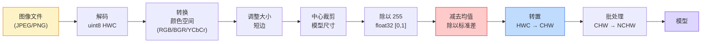
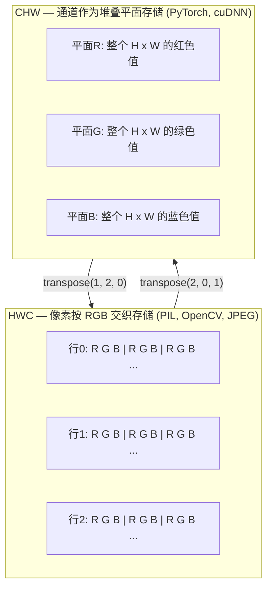

# 图像基础 — 像素、通道、颜色空间

> 图像是光样本的张量。你将使用的每个视觉模型都从这个事实出发。

**类型：** 构建  
**语言：** Python  
**先决条件：** 第1阶段第12课（张量操作），第3阶段第11课（PyTorch入门）  
**时间：** 约45分钟

## 学习目标

- 解释如何将连续场景离散成像素，以及为何采样/量化的决策设定了所有下游模型的上限
- 作为 NumPy 数组读取、切片和检查图像，熟练转换 HWC 和 CHW 布局
- 在 RGB、灰度、HSV 和 YCbCr 之间转换，并说明每种颜色空间存在的理由
- 应用像素级预处理（归一化、标准化、调整大小、通道优先）以完全符合 torchvision 的预期

## 问题

你读取的每篇论文、下载的每个预训练权重、调用的每个视觉API都假设输入具有特定的编码。若模型需要 `float32`，你传递了 `uint8`，它仍将运行——但会无声地产出垃圾结果。将 BGR 输入送入在 RGB 上训练的网络，准确率会陡降十个百分点。输入应为通道优先时用通道最后格式，第一层卷积会把高度当成特征通道。所有这些都不会报错，只会毁掉你的指标，让你花一周时间排查这个文件加载方式的小坑。

卷积本身不复杂，关键是你知道它滑动的是什么。难点是“图像”对相机、JPEG 解码器、PIL、OpenCV、torchvision 和 CUDA 内核来说意义各异。每个栈有自己的轴顺序、字节范围和通道约定。一个无法分清这些的视觉工程师交付的永远是损坏的流水线。

本课打好基础，供后续课程建设。结束时，你将知道像素是什么，为什么每个像素有三个数字而非一个，“用 ImageNet 统计归一化”实际做了什么，以及如何在阶段中其它课程假定的两种或三种布局间切换。

## 概念

### 完整预处理管道一览

每个生产环境视觉系统都是一连串可逆的变换。多一步错，模型见到的输入就与训练时不同。



红色和蓝色盒子占了80%的无声失效点：缺失标准化和布局错误。

### 像素是一个采样，不是方块

相机传感器数算落在微小探测器网格上的光子。每个探测器对光积分一小段时间，输出与光子数成比例的电压。传感器将该电压离散成整数。一个探测器转换成一个像素。

```text
连续场景                    传感器网格                  数字图像
（无限细节）                 （H x W 个探测器）            （H x W 个整数）

    ~~~~~                        +--+--+--+--+--+             210 198 180 155 120
   ~   ~   ~                     |  |  |  |  |  |             205 195 178 152 118
  ~ 光线 ~      ---->           +--+--+--+--+--+   ---->     200 190 175 150 115
   ~~~~~                         |  |  |  |  |  |             195 185 170 148 112
                                 +--+--+--+--+--+             188 180 165 145 108
```

此步骤做了两个决定，决定了后续所有操作的极限：

- **空间采样（spatial sampling）** 决定每度视角多少探测器。探测器太少边缘锯齿化（混叠），太多则存储和计算量爆炸。
- **强度量化（intensity quantization）** 决定电压被分桶的精细度。8位是标准，给256级，适合显示。10、12、16位更平滑，适合医疗成像、HDR和原始传感器处理。

像素不是有面积的彩色方块，而是个单一测量。调整大小或旋转时其实是对这个测量网格重新采样。

### 为什么三个通道

一个探测器采集整个可见光谱的光子——即灰度。要获得颜色，传感器覆盖了用红、绿、蓝滤波器组成的马赛克阵列。去马赛克后，每个空间位置拥有三个整数：红色滤波器探测的响应，绿色滤波器的响应，和附近蓝色滤波器的响应。这三个整数就是一个像素的 RGB 三元组。

```text
内存中的一个像素：

    (R, G, B) = (210, 140, 30)   <- 红橙色调

一个 H x W 的 RGB 图像：

    形状 (H, W, 3)    存储为   H 行，每行 W 个像素，每像素3个值
                              每个值为 uint8 时范围 [0, 255]
```

三通道不是魔法。深度摄像机有Z通道。卫星图像有红外和紫外波段。医学扫描一般是单通道（X光、CT）或多通道（高光谱）。通道数是最后一个轴，卷积层学会在该轴混合信息。

### 两种布局约定：HWC 和 CHW

同一个张量，两种顺序。各库偏好不同。

```text
HWC（高度，宽度，通道）            CHW（通道，高度，宽度）

   W ->                              H ->
  +-----+-----+-----+               +-----+-----+
H |R G B|R G B|R G B|             C |R R R R R R|
| +-----+-----+-----+             | +-----+-----+
v |R G B|R G B|R G B|             v |G G G G G G|
  +-----+-----+-----+               +-----+-----+
                                    |B B B B B B|
                                    +-----+-----+

   PIL, OpenCV, matplotlib,         PyTorch，大多数深度学习框架
   几乎所有磁盘图像文件              cuDNN 内核
```

CHW 布局存在的原因是卷积核滑动时需要跨 H 和 W 维度。把通道轴放前面，令卷积核每次处理通道的连续二维平面，方便向量化。磁盘格式保留 HWC，因为它对应传感器扫描线的原始顺序。

你会敲成千上万次的单行转换：

```text
img_chw = img_hwc.transpose(2, 0, 1)      # NumPy
img_chw = img_hwc.permute(2, 0, 1)       # PyTorch 张量
```

内存布局可视化：



### 字节范围和数据类型（dtype）

主流约定有三种：

| 约定       | dtype      | 范围         | 见于                     |
|------------|------------|--------------|--------------------------|
| 原始（Raw） | `uint8`    | [0, 255]     | 磁盘文件，PIL，OpenCV输出 |
| 归一化（Normalized） | `float32` | [0.0, 1.0]   | `img.astype('float32') / 255` 后 |
| 标准化（Standardized） | `float32` | 约 [-2, +2]  | 减均值除以标准差后       |

卷积网络训练时用的是标准化输入。ImageNet统计均值 `mean=[0.485, 0.456, 0.406]`，标准差 `std=[0.229, 0.224, 0.225]` 是对 [0,1] 归一化像素在整个 ImageNet 训练集三个通道上的算数均值和标准差。将原始 `uint8` 输入送给期望标准化浮点的模型，是应用视觉中最常见的无声失败原因。

### 颜色空间及其存在的理由

RGB 是捕获格式，但对模型来说不一定最有用。

```text
 RGB               HSV                       YCbCr / YUV

 R 红色             H 色相（角度0-360）         Y 亮度（明度）
 G 绿色             S 饱和度（0-1）             Cb 蓝-黄色差
 B 蓝色             V 值/亮度（0-1）           Cr 红-绿色差

 与传感器输出线性转换     分离颜色和亮度。适合            分离亮度和颜色。JPEG及大多数视频
                        颜色阈值，UI滑块，简单滤波        编解码器对色差通道压缩更厉害，因为
                                                       人眼对色差细节不如对亮度敏感。
```

对大多数现代 CNN，你输入 RGB。你会遇到其他颜色空间当：

- **HSV** — 经典计算机视觉代码，基于颜色的分割，白平衡
- **YCbCr** — 读取 JPEG 内部数据，视频管线，超分辨率模型只处理 Y
- **灰度** — OCR、文档模型，颜色是干扰变量非信号的场合

灰度是 RGB 的加权和非简单平均，因为人眼对绿更敏感：

```text
Y = 0.299 R + 0.587 G + 0.114 B       (ITU-R BT.601，经典权重)
```

### 纵横比、调整大小和插值

每个模型有固定输入尺寸（大多数 ImageNet 分类器是224x224，现代检测器是384x384或512x512）。图像通常不匹配。三种重要的调整大小选项：

- **调整短边，再中心裁剪** — 标准 ImageNet 方案。保持纵横比，舍弃边缘像素条。
- **调整和填充** — 保持纵横比和每个像素，增加黑边。检测和 OCR 常用。
- **直接调整到目标尺寸** — 拉伸图像。便宜但变形，许多分类任务够用。

插值决定了当新网格和旧网格不对齐时中间像素如何计算：

```text
最近邻插值       最快，块状，仅用于掩码/标签的唯一选择
双线性插值       快且平滑，大多数图像调整的默认选项
三次插值         慢一些，上采样更锐利
Lanczos插值      最慢，质量最好，主要用于最终显示
```

经验法则：训练用双线性，查看用三次或 Lanczos，带整数类 ID 的用最近邻。

## 构建代码

### 步骤1：加载图像并检查形状

用 Pillow 加载任意 JPEG 或 PNG，转成 NumPy，并打印信息。为了离线可复现示例，合成一张图。

```python
import numpy as np
from PIL import Image

def synthetic_rgb(h=128, w=192, seed=0):
    rng = np.random.default_rng(seed)
    yy, xx = np.meshgrid(np.linspace(0, 1, h), np.linspace(0, 1, w), indexing="ij")
    r = (np.sin(xx * 6) * 0.5 + 0.5) * 255
    g = yy * 255
    b = (1 - yy) * xx * 255
    rgb = np.stack([r, g, b], axis=-1) + rng.normal(0, 6, (h, w, 3))
    return np.clip(rgb, 0, 255).astype(np.uint8)

arr = synthetic_rgb()
# 或从磁盘加载：
# arr = np.asarray(Image.open("your_image.jpg").convert("RGB"))

print(f"type:   {type(arr).__name__}")
print(f"dtype:  {arr.dtype}")
print(f"shape:  {arr.shape}     # (H, W, C)")
print(f"min:    {arr.min()}")
print(f"max:    {arr.max()}")
print(f"像素 (0, 0): {arr[0, 0]}")
```

预期输出：`shape: (H, W, 3)`，`dtype: uint8`，范围 `[0, 255]`。这是字节来自相机、JPEG 解码器或合成生成器时的规范磁盘表示。

### 第2步：分离通道并重排序布局

分别提取 R、G、B，然后将 HWC 转换为 PyTorch 的 CHW。

```python
R = arr[:, :, 0]
G = arr[:, :, 1]
B = arr[:, :, 2]
print(f"R shape: {R.shape}, mean: {R.mean():.1f}")
print(f"G shape: {G.shape}, mean: {G.mean():.1f}")
print(f"B shape: {B.shape}, mean: {B.mean():.1f}")

arr_chw = arr.transpose(2, 0, 1)
print(f"\nHWC shape: {arr.shape}")
print(f"CHW shape: {arr_chw.shape}")
```

三个灰度平面，每个通道一个。CHW 只是重新排序轴；当内存布局允许时，严格来说不需要复制数据。

### 第3步：灰度和 HSV 转换

加权求和灰度，然后手动实现 RGB 到 HSV。

```python
def rgb_to_grayscale(rgb):
    weights = np.array([0.299, 0.587, 0.114], dtype=np.float32)
    return (rgb.astype(np.float32) @ weights).astype(np.uint8)

def rgb_to_hsv(rgb):
    rgb_f = rgb.astype(np.float32) / 255.0
    r, g, b = rgb_f[..., 0], rgb_f[..., 1], rgb_f[..., 2]
    cmax = np.max(rgb_f, axis=-1)
    cmin = np.min(rgb_f, axis=-1)
    delta = cmax - cmin

    h = np.zeros_like(cmax)
    mask = delta > 0
    rmax = mask & (cmax == r)
    gmax = mask & (cmax == g)
    bmax = mask & (cmax == b)
    h[rmax] = ((g[rmax] - b[rmax]) / delta[rmax]) % 6
    h[gmax] = ((b[gmax] - r[gmax]) / delta[gmax]) + 2
    h[bmax] = ((r[bmax] - g[bmax]) / delta[bmax]) + 4
    h = h * 60.0

    s = np.where(cmax > 0, delta / cmax, 0)
    v = cmax
    return np.stack([h, s, v], axis=-1)

gray = rgb_to_grayscale(arr)
hsv = rgb_to_hsv(arr)
print(f"gray shape: {gray.shape}, range: [{gray.min()}, {gray.max()}]")
print(f"hsv   shape: {hsv.shape}")
print(f"hue range: [{hsv[..., 0].min():.1f}, {hsv[..., 0].max():.1f}] degrees")
print(f"sat range: [{hsv[..., 1].min():.2f}, {hsv[..., 1].max():.2f}]")
print(f"val range: [{hsv[..., 2].min():.2f}, {hsv[..., 2].max():.2f}]")
```

色调（Hue）以度数表示，饱和度和明度在 [0, 1] 范围内。符合 OpenCV 的 `hsv_full` 约定。

### 第4步：归一化、标准化及反向操作

从原始字节转到预训练 ImageNet 模型所需的精确张量，再反转回去。

```python
mean = np.array([0.485, 0.456, 0.406], dtype=np.float32)
std = np.array([0.229, 0.224, 0.225], dtype=np.float32)

def preprocess_imagenet(rgb_uint8):
    x = rgb_uint8.astype(np.float32) / 255.0
    x = (x - mean) / std
    x = x.transpose(2, 0, 1)
    return x

def deprocess_imagenet(chw_float32):
    x = chw_float32.transpose(1, 2, 0)
    x = x * std + mean
    x = np.clip(x * 255.0, 0, 255).astype(np.uint8)
    return x

x = preprocess_imagenet(arr)
print(f"preprocessed shape: {x.shape}     # (C, H, W)")
print(f"preprocessed dtype: {x.dtype}")
print(f"preprocessed mean per channel:  {x.mean(axis=(1, 2)).round(3)}")
print(f"preprocessed std  per channel:  {x.std(axis=(1, 2)).round(3)}")

roundtrip = deprocess_imagenet(x)
max_diff = np.abs(roundtrip.astype(int) - arr.astype(int)).max()
print(f"roundtrip max pixel diff: {max_diff}    # 应为 0 或 1")
```

每通道均值应接近零，标准差接近一。`preprocess/deprocess` 对应了每个 torchvision `transforms.Normalize` 调用的底层工作。

### 第5步：使用三种插值方法调整大小

比较用最近邻（nearest）、双线性（bilinear）和双三次（bicubic）放大，使差异明显。

```python
target = (arr.shape[0] * 3, arr.shape[1] * 3)

nearest = np.asarray(Image.fromarray(arr).resize(target[::-1], Image.NEAREST))
bilinear = np.asarray(Image.fromarray(arr).resize(target[::-1], Image.BILINEAR))
bicubic = np.asarray(Image.fromarray(arr).resize(target[::-1], Image.BICUBIC))

def local_roughness(x):
    gy = np.diff(x.astype(float), axis=0)
    gx = np.diff(x.astype(float), axis=1)
    return float(np.abs(gy).mean() + np.abs(gx).mean())

for name, out in [("nearest", nearest), ("bilinear", bilinear), ("bicubic", bicubic)]:
    print(f"{name:>8}  shape={out.shape}  roughness={local_roughness(out):6.2f}")
```

最近邻在粗糙度上得分最高，因为它保持了硬边。双线性最平滑。双三次居中，保留了感知的清晰度且无阶梯状伪影。

## 使用它

`torchvision.transforms` 将上述所有环节打包成一个可组合的流水线。以下代码完全复现了 `preprocess_imagenet` 的操作，并额外包括了 resize 和 crop。

```python
import torch
from torchvision import transforms
from PIL import Image

img = Image.fromarray(synthetic_rgb(256, 256))

pipeline = transforms.Compose([
    transforms.Resize(256),
    transforms.CenterCrop(224),
    transforms.ToTensor(),
    transforms.Normalize(mean=[0.485, 0.456, 0.406], std=[0.229, 0.224, 0.225]),
])

x = pipeline(img)
print(f"tensor type:  {type(x).__name__}")
print(f"tensor dtype: {x.dtype}")
print(f"tensor shape: {tuple(x.shape)}      # (C, H, W)")
print(f"per-channel mean: {x.mean(dim=(1, 2)).tolist()}")
print(f"per-channel std:  {x.std(dim=(1, 2)).tolist()}")

batch = x.unsqueeze(0)
print(f"\nbatched shape: {tuple(batch.shape)}   # (N, C, H, W) — 为模型准备")
```

四个步骤，严格按此顺序：`Resize(256)` 缩放较短边至 256；`CenterCrop(224)` 从中心裁切 224×224 区域；`ToTensor()` 除以 255 并转换 HWC 到 CHW；`Normalize` 减去 ImageNet 均值并除以标准差。倒过来做会悄无声息地改变输给模型的数据。

## 发布它

本课生成：

- `outputs/prompt-vision-preprocessing-audit.md` — 一个提示，用于将任何模型卡或数据集卡转成团队必须遵守的精确预处理不变量清单。
- `outputs/skill-image-tensor-inspector.md` — 一个技能模块，给定任何图像形状的张量或数组，报告其 dtype、布局、范围，以及是否为原始、归一化或标准化格式。

## 练习

1. **（简单）** 用 OpenCV (`cv2.imread`) 和 Pillow 加载 JPEG。打印两者的形状和 `(0, 0)` 像素。解释通道顺序的差异，然后写一行代码把 OpenCV 数组转成与 Pillow 相同。
2. **（中等）** 编写 `standardize(img, mean, std)` 及其逆函数，使它们对任意 uint8 图像的 `roundtrip_max_diff <= 1` 测试通过。你的函数必须能同时对单张 HWC 图像和批量 NCHW 调用有效。
3. **（困难）** 对一个 3 通道 ImageNet 标准化张量，利用一个 1x1 卷积学习将 RGB 加权组合成单通道灰度。将权重初始化为 `[0.299, 0.587, 0.114]`，固定权重，验证输出与手写 `rgb_to_grayscale` 在浮点误差范围内吻合。还有哪些经典颜色空间转换可以用 1x1 卷积实现？

## 关键术语

| 术语     | 大家说       | 实际含义                         |
|---------|-------------|--------------------------------|
| Pixel（像素）  | “一个彩色方块” | 网格上一个光强采样值——彩色为三个数，灰度为一个 |
| Channel（通道） | “颜色”       | 组成图像张量的平行空间格子之一；HWC 最后轴，CHW 第一轴 |
| HWC / CHW | “形状”       | 图像张量的轴顺序；磁盘和 PIL 用 HWC，PyTorch 和 cuDNN 用 CHW |
| Normalize（归一化） | “缩放图像”   | 除以 255 使像素变成 [0, 1] 范围——必要但不足够 |
| Standardize（标准化） | “零中心化” | 对每通道减均值除标准差，使输入分布匹配模型训练时 |
| Grayscale conversion（灰度转换） | “通道平均”   | 用 0.299/0.587/0.114 权重的加权和，符合人类亮度感知 |
| Interpolation（插值） | “大小调整怎么取像素” | 新旧网格不重复时决定输出值的规则——标签选最近邻，训练用双线性，显示用双三次 |
| Aspect ratio（长宽比） | “宽除高”     | 区分“缩放加填充”与“缩放加拉伸”的比例 |

## 延伸阅读

- [Charles Poynton — A Guided Tour of Color Space](https://poynton.ca/PDFs/Guided_tour.pdf) — 关于为何有这么多颜色空间以及各自适用场景的最清晰技术讲解
- [PyTorch Vision Transforms Docs](https://pytorch.org/vision/stable/transforms.html) — 你最终会在生产中使用的完整转换流水线
- [How JPEG Works (Colt McAnlis)](https://www.youtube.com/watch?v=F1kYBnY6mwg) — 清晰图解色度子采样、DCT，以及为什么 JPEG 编码 YCbCr 而非 RGB
- [ImageNet Preprocessing Conventions (torchvision models)](https://pytorch.org/vision/stable/models.html) — `mean=[0.485, 0.456, 0.406]` 的权威来源，及为何模型库中的每个模型都期待它
