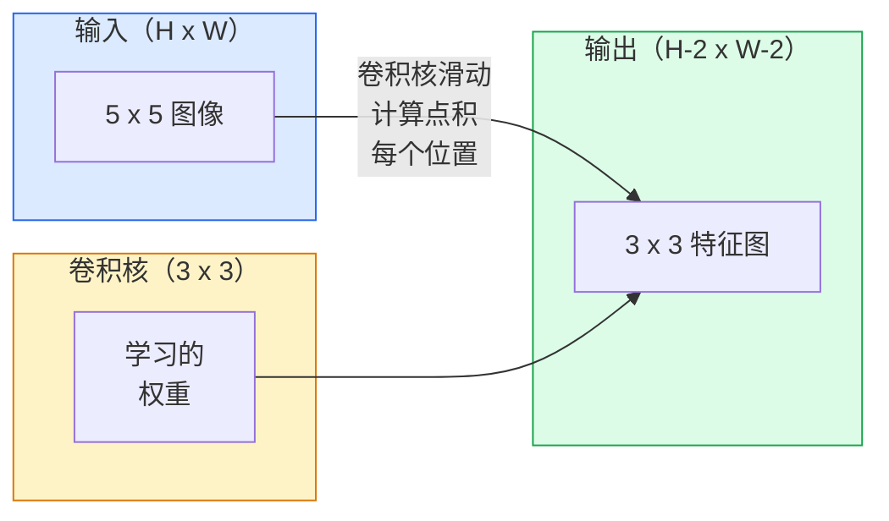
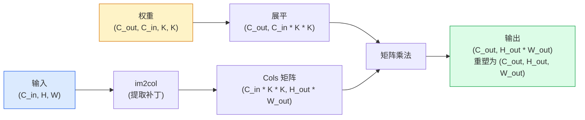

# 从零开始实现卷积层（Convolutions from Scratch）

> 卷积是一种微小的密集层（dense layer），你可以将它滑动在图像上，每个位置共享相同的权重。

**类型：** 构建  
**语言：** Python  
**先决条件：** 第 3 阶段（深度学习核心），第 4 阶段第 01 课（图像基础知识）  
**时间：** 约 75 分钟

## 学习目标

- 使用仅有的 NumPy 从头实现二维卷积，包括嵌套循环版本和向量化的 `im2col` 版本  
- 对任意输入尺寸、核大小、填充（padding）和步长（stride）组合计算输出空间尺寸，并证明 `(H - K + 2P) / S + 1` 公式的合理性  
- 手动设计卷积核（边缘检测、模糊、锐化、Sobel），并解释每个核为什么会激活特定的模式  
- 将卷积堆叠成特征提取器，并将堆叠层数与感受野（receptive field）大小联系起来  

## 问题背景

对于一张 224x224 的 RGB 图像，全连接层每个神经元需要 224 * 224 * 3 = 150,528 个输入权重。一个包含 1,000 个单元的隐藏层就已经有 1.5 亿参数——这还是在你学到有用的东西之前。更糟的是，该层无法理解左上角的狗和右下角的狗是相同的模式。它将每个像素位置视为相互独立，这对于图像来说正好是错误的：猫移动三像素不应该迫使网络重新学习这个概念。

图像模型需要的两个属性是：**平移等变性**（translation equivariance，输入移动时输出也跟着移动）和**参数共享**（parameter sharing，全局同一特征检测器）。密集层两者都没有。卷积层则天然具备这两点。

卷积并非为深度学习发明。它是 JPEG 压缩、高斯模糊（Gaussian blur，用于 Photoshop）、工业视觉边缘检测和各种音频滤波中使用的相同操作。CNN 能在 2012 年到 2020 年称霸 ImageNet 的原因是，卷积是基于邻近值相关且相同模式可出现在任意位置数据的正确先验。

## 概念介绍

### 单个卷积核滑动

二维卷积使用一个小的权重矩阵称为卷积核（kernel，或滤波器 filter），滑动于输入图像上，在每个位置计算对应元素乘积的和，得到一个输出像素。



一个具体的 3x3 卷积核在 5x5 输入上计算（无填充，步长为 1）：

```text
输入 X（5 x 5）：                卷积核 W（3 x 3）：

  1  2  0  1  2                   1  0 -1
  0  1  3  1  0                   2  0 -2
  2  1  0  2  1                   1  0 -1
  1  0  2  1  3
  2  1  1  0  1

卷积核滑动于每个有效的 3 x 3 窗口。输出 Y 大小为 3 x 3：

 Y[0,0] = sum( W * X[0:3, 0:3] )
 Y[0,1] = sum( W * X[0:3, 1:4] )
 Y[0,2] = sum( W * X[0:3, 2:5] )
 Y[1,0] = sum( W * X[1:4, 0:3] )
 ... 等等
```

这一个公式——**权重共享、局部性、滑动窗口**——就是整个核心思想。其他的都是细节处理。

### 输出尺寸公式

给定输入空间尺寸 `H`、卷积核大小 `K`、填充大小 `P`、步长 `S`：

```text
H_out = floor( (H - K + 2P) / S ) + 1
```

记住这个公式。你会在设计架构时用到它很多次。

| 场景           | H  | K  | P | S | H_out |
|----------------|----|----|---|---|-------|
| Valid 卷积，无填充 | 32 | 3  | 0 | 1 | 30    |
| Same 卷积（保持尺寸） | 32 | 3  | 1 | 1 | 32    |
| 步长为 2 下采样    | 32 | 3  | 1 | 2 | 16    |
| 2x2 池化          | 32 | 2  | 0 | 2 | 16    |
| 大感受野           | 32 | 7  | 3 | 2 | 16    |

"Same padding" 意味着选取 P 使得当 S=1 时，`H_out == H`。对于奇数 K，公式是 `P = (K - 1) / 2`。这也是为什么 3x3 卷积核普遍主导，因为它是有中心点的最小奇数尺寸核。

### 填充（Padding）

没有填充，卷积会让特征图尺寸缩小。堆叠 20 层卷积，224x224 的图像就变成了 184x184，浪费边缘计算，且残差连接时形状也不匹配。

```text
对一个 5 x 5 输入做零填充（P = 1）：

  0  0  0  0  0  0  0
  0  1  2  0  1  2  0
  0  0  1  3  1  0  0
  0  2  1  0  2  1  0       现在卷积核中心可以对准像素
  0  1  0  2  1  3  0       (0, 0)，仍有三行三列可用
  0  2  1  1  0  1  0       乘积计算。
  0  0  0  0  0  0  0
```

常见填充模式：`zero`（最常用）、`reflect`（边缘镜像，避免生成模型硬边）、`replicate`（复制边缘）、`circular`（循环，环面问题用）。

### 步长（Stride）

步长是滑动步幅。`stride=1` 是默认值。`stride=2` 空间尺寸减半，是 CNN 内部不使用池化直接下采样的经典方式——现代架构（ResNet、ConvNeXt、MobileNet）均在某处用步长卷积替代最大池化。

```text
对 5 x 5 输入，3 x 3 卷积核，步长为 1：

  开始点：(0,0) (0,1) (0,2)        -> 输出第 0 行
          (1,0) (1,1) (1,2)        -> 输出第 1 行
          (2,0) (2,1) (2,2)        -> 输出第 2 行

  输出尺寸：3 x 3

步长为 2：

  开始点：(0,0) (0,2)              -> 输出第 0 行
          (2,0) (2,2)              -> 输出第 1 行

  输出尺寸：2 x 2
```

### 多输入通道

真实图像有三个通道。RGB 输入的 3x3 卷积其实是一个 3x3x3 的体积：每个输入通道有一片 3x3 的权重。在空间位置上，你把这三片按元素乘后加和，并加偏置。

```text
输入尺寸：   (C_in,  H,  W)        3 x 5 x 5
卷积核尺寸： (C_in,  K,  K)        3 x 3 x 3（单个核）
输出尺寸：   (1,     H', W')       2D 特征图

当你有 C_out 个输出通道时，堆叠 C_out 个卷积核：

权重大小： (C_out, C_in, K, K)   例如 64 x 3 x 3 x 3
输出大小： (C_out, H', W')       64 x 3 x 3

参数总数： C_out * C_in * K * K + C_out   （+C_out 是偏置）
```

最后一行是你设计模型时计算的参量数。举例：一个 3 输入通道，64 输出通道，3x3 卷积核的卷积层有 `64 * 3 * 3 * 3 + 64 = 1792` 个参数，非常节省。

### im2col 技巧

嵌套循环写法简单明了，但速度慢。GPU 更喜欢大规模矩阵乘法。技巧是：把输入的每一个感受野窗口（receptive field）展开成一列，卷积核展开成一行，整个卷积变成矩阵乘法。



所有实用卷积底层实现都是此技巧，加上一些缓存切片 (cache-tiling) 优化（如直接卷积、Winograd、FFT 卷积等大核方法）。理解 im2col 就理解了卷积核心。

### 感受野（Receptive Field）

一个 3x3 卷积覆盖 9 个输入像素。堆叠两个 3x3 卷积后，第二层的神经元覆盖 5x5 输入像素，三个 3x3 卷积覆盖 7x7。通用公式：

```text
L 层堆叠的 K x K 卷积（步长 1）感受野大小：
RF = 1 + L * (K - 1)

带步长时：感受野沿每层步长方向乘法增长。
```

“全是 3x3 核”有效（如 VGG、ResNet、ConvNeXt），因为两个 3x3 卷积覆盖的输入区域等同于一个 5x5 卷积，但参数更少，中间还有非线性激活。

## 实现步骤

### 步骤 1：给数组填充边界

从最基本做起：写一个函数在 H x W 矩阵外部用零填充。

```python
import numpy as np

def pad2d(x, p):
    if p == 0:
        return x
    h, w = x.shape[-2:]
    out = np.zeros(x.shape[:-2] + (h + 2 * p, w + 2 * p), dtype=x.dtype)
    out[..., p:p + h, p:p + w] = x
    return out

x = np.arange(9).reshape(3, 3)
print(x)
print()
print(pad2d(x, 1))
```

末尾 `x.shape[:-2]` 的技巧使得该函数可用于 `(H, W)`、`(C, H, W)` 或 `(N, C, H, W)` 形状，无需修改。

### 步骤 2：用嵌套循环实现二维卷积

这是参考实现——慢但直观。原则上就是 `torch.nn.functional.conv2d` 做的事。

```python
def conv2d_naive(x, w, b=None, stride=1, padding=0):
    c_in, h, w_in = x.shape
    c_out, c_in_w, kh, kw = w.shape
    assert c_in == c_in_w

    x_pad = pad2d(x, padding)
    h_out = (h + 2 * padding - kh) // stride + 1
    w_out = (w_in + 2 * padding - kw) // stride + 1

    out = np.zeros((c_out, h_out, w_out), dtype=np.float32)
    for oc in range(c_out):
        for i in range(h_out):
            for j in range(w_out):
                hs = i * stride
                ws = j * stride
                patch = x_pad[:, hs:hs + kh, ws:ws + kw]
                out[oc, i, j] = np.sum(patch * w[oc])
        if b is not None:
            out[oc] += b[oc]
    return out
```

四层嵌套循环（输出通道、行、列，加上隐含的 C_in、kh、kw 求和）。这是你校验任何更快实现时的地面真理。

### 步骤 3：用手工设计核验证

构造一个垂直 Sobel 卷积核，应用于合成的阶跃图像，看垂直边缘是否被点亮。

```python
def synthetic_step_image():
    img = np.zeros((1, 16, 16), dtype=np.float32)
    img[:, :, 8:] = 1.0
    return img

sobel_x = np.array([
    [[-1, 0, 1],
     [-2, 0, 2],
     [-1, 0, 1]]
], dtype=np.float32)[None]

x = synthetic_step_image()
y = conv2d_naive(x, sobel_x, padding=1)
print(y[0].round(1))
```

期望在第 7 列出现大正值（表示从左至右的亮度增加），其他地方为零。这个打印即为数学正确性的 sanity check。

### 步骤 4：im2col

将输入中每个卷积核大小的窗口提取为矩阵的一列。对于 `C_in=3, K=3`，每列包含 27 个数。

```python
def im2col(x, kh, kw, stride=1, padding=0):
    c_in, h, w = x.shape
    x_pad = pad2d(x, padding)
    h_out = (h + 2 * padding - kh) // stride + 1
    w_out = (w + 2 * padding - kw) // stride + 1

    cols = np.zeros((c_in * kh * kw, h_out * w_out), dtype=x.dtype)
    col = 0
    for i in range(h_out):
        for j in range(w_out):
            hs = i * stride
            ws = j * stride
            patch = x_pad[:, hs:hs + kh, ws:ws + kw]
            cols[:, col] = patch.reshape(-1)
            col += 1
    return cols, h_out, w_out
```

仍有 Python 循环，但后续计算中将全部依靠单次向量化矩阵乘法完成重运算。

### 步骤 5：利用 im2col + 矩阵乘法实现快速卷积

用一次矩阵乘法，替代嵌套的四重循环。

```python
def conv2d_im2col(x, w, b=None, stride=1, padding=0):
    c_out, c_in, kh, kw = w.shape
    cols, h_out, w_out = im2col(x, kh, kw, stride, padding)
    w_flat = w.reshape(c_out, -1)
    out = w_flat @ cols
    if b is not None:
        out += b[:, None]
    return out.reshape(c_out, h_out, w_out)
```

正确性检查：运行两个实现并进行比较。

```python
rng = np.random.default_rng(0)
x = rng.normal(0, 1, (3, 16, 16)).astype(np.float32)
w = rng.normal(0, 1, (8, 3, 3, 3)).astype(np.float32)
b = rng.normal(0, 1, (8,)).astype(np.float32)

y_naive = conv2d_naive(x, w, b, padding=1)
y_im2col = conv2d_im2col(x, w, b, padding=1)

print(f"max abs diff: {np.max(np.abs(y_naive - y_im2col)):.2e}")
```

`max abs diff` 应该在 `1e-5` 附近 —— 差异来自浮点累积顺序，而非错误。

### 第6步：一组手工设计的卷积核

五个滤波器展示了未经训练的单层卷积层能表达什么。

```python
KERNELS = {
    "identity": np.array([[0, 0, 0], [0, 1, 0], [0, 0, 0]], dtype=np.float32),
    "blur_3x3": np.ones((3, 3), dtype=np.float32) / 9.0,
    "sharpen": np.array([[0, -1, 0], [-1, 5, -1], [0, -1, 0]], dtype=np.float32),
    "sobel_x": np.array([[-1, 0, 1], [-2, 0, 2], [-1, 0, 1]], dtype=np.float32),
    "sobel_y": np.array([[-1, -2, -1], [0, 0, 0], [1, 2, 1]], dtype=np.float32),
}

def apply_kernel(img2d, kernel):
    x = img2d[None].astype(np.float32)
    w = kernel[None, None]
    return conv2d_im2col(x, w, padding=1)[0]
```

应用于任何灰度图像时，模糊（blur）会使图像变柔和，锐化（sharpen）使边缘更清晰，Sobel-x 会突出垂直边缘，Sobel-y 会突出水平边缘。这正是 AlexNet 和 VGG 中*第一个*训练卷积层最终学到的模式——因为一个好的图像模型无论后续任务如何，都需要边缘和斑点检测器。

## 使用它

PyTorch 的 `nn.Conv2d` 封装了相同的操作，并集成了自动求导（autograd）、CUDA 内核和 cuDNN 优化。形状语义完全相同。

```python
import torch
import torch.nn as nn

conv = nn.Conv2d(in_channels=3, out_channels=64, kernel_size=3, stride=1, padding=1)
print(conv)
print(f"weight shape: {tuple(conv.weight.shape)}   # (C_out, C_in, K, K)")
print(f"bias shape:   {tuple(conv.bias.shape)}")
print(f"param count:  {sum(p.numel() for p in conv.parameters())}")

x = torch.randn(8, 3, 224, 224)
y = conv(x)
print(f"\ninput  shape: {tuple(x.shape)}")
print(f"output shape: {tuple(y.shape)}")
```

将 `padding=1` 换成 `padding=0`，输出尺寸变为 222x222。将 `stride=1` 换成 `stride=2`，输出变为 112x112。正是你之前记忆的相同公式。

## 部署它

本节产出：

- `outputs/prompt-cnn-architect.md` — 一个提示，根据输入大小、参数预算和目标感受野，设计一组带有合适 K/S/P 的 `Conv2d` 层堆栈。
- `outputs/skill-conv-shape-calculator.md` — 一个技能，逐层解析网络规格，返回每个块的输出形状、感受野和参数数量。

## 练习

1. **（简单）** 给定 128x128 的灰度输入和一堆 `[Conv3x3(s=1,p=1), Conv3x3(s=2,p=1), Conv3x3(s=1,p=1), Conv3x3(s=2,p=1)]`，手工计算每层的输出空间尺寸和感受野。用 PyTorch 的 `nn.Sequential` 假卷积验证。
2. **（中等）** 扩展 `conv2d_naive` 和 `conv2d_im2col` 以接受 `groups` 参数。证明当 `groups=C_in=C_out` 时相当于深度卷积（depthwise convolution），其参数数量是 `C * K * K`，而非 `C * C * K * K`。
3. **（困难）** 手动实现 `conv2d_im2col` 的反向传播：给定输出梯度，计算 `x` 和 `w` 的梯度。用相同的输入和权重，和 `torch.autograd.grad` 对比验证。关键点：`im2col` 的梯度是 `col2im`，需要累加重叠的窗口。

## 关键词

| 术语 | 人们说 | 实际含义 |
|------|--------|----------|
| Convolution（卷积） | “滑动一个滤波器” | 每个空间位置上应用的可学习点积，权重共享；数学上是互相关，但统称为卷积 |
| Kernel / filter（卷积核 / 滤波器） | “特征检测器” | 小的权重张量，形状为 (C_in, K, K)，和输入窗口的点积产生一个输出像素 |
| Stride（步幅） | “跳多远” | 连续卷积核位置之间的步长；步幅为2时，每个空间维度减半 |
| Padding（填充） | “边缘补零” | 在输入周围添加额外值，使卷积核能以边缘像素为中心；`same` 填充保持输出与输入尺寸相等 |
| Receptive field（感受野） | “神经元看到多少” | 某个输出激活所依赖的原始输入区域，随深度和步幅增大 |
| im2col | “GEMM技巧” | 把每个感受窗口排列成列，使卷积变成一次大矩阵乘法 —— 所有快速卷积内核的核心 |
| Depthwise conv（深度卷积） | “每通道一个卷积核” | `groups == C_in` 的卷积，每个输出通道仅由对应输入通道计算；MobileNet 和 ConvNeXt 的骨干 |
| Translation equivariance（平移等变性） | “输入平移，输出等量平移” | 输入平移 k 像素，输出也平移 k 像素的性质；权重共享自然保证 |

## 深入阅读

- [A guide to convolution arithmetic for deep learning (Dumoulin & Visin, 2016)](https://arxiv.org/abs/1603.07285) — 有关于填充 / 步幅 / 膨胀的权威图示，所有课程都会默默引用
- [CS231n: Convolutional Neural Networks for Visual Recognition](https://cs231n.github.io/convolutional-networks/) — 经典讲义，包括原始的 im2col 解释
- [The Annotated ConvNet (fast.ai)](https://nbviewer.org/github/fastai/fastbook/blob/master/13_convolutions.ipynb) — 交互式笔记，带你从手动卷积走到训练好的数字分类器
- [Receptive Field Arithmetic for CNNs (Dang Ha The Hien)](https://distill.pub/2019/computing-receptive-fields/) — 论文级交互式感受野计算解释器
