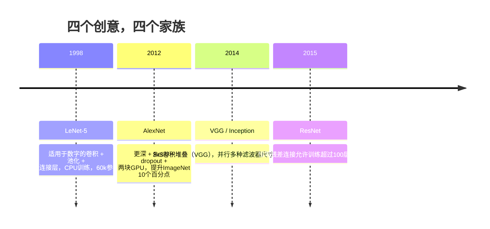
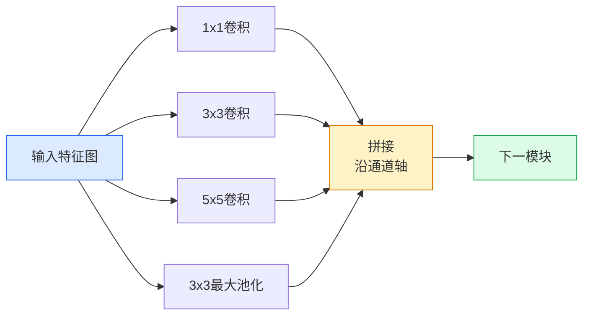
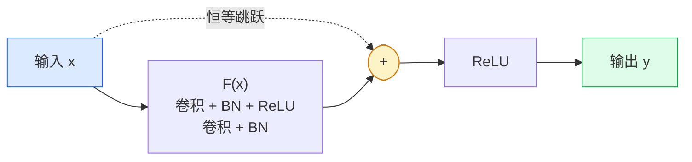

# CNNs — LeNet 到 ResNet

> 过去三十年中每个重要的 CNN 都是同样的卷积（conv）–非线性（nonlinearity）–下采样（downsample）配方，加入了一个新的创意。按顺序学习这些创意。

**类型：** 学习 + 构建  
**语言：** Python  
**先决条件：** 第3阶段第11课（PyTorch），第4阶段第01课（图像基础），第4阶段第02课（从零实现卷积）  
**时间：** 大约75分钟

## 学习目标

- 追踪架构谱系 LeNet-5 -> AlexNet -> VGG -> Inception -> ResNet 并说明每个家族贡献的唯一新思路  
- 在 PyTorch 中实现 LeNet-5、VGG 风格模块和 ResNet BasicBlock，每个均不超过40行代码  
- 解释为什么残差连接（residual connections）能将一个1000层的网络从不可训练变成最先进模型  
- 阅读一个现代主干网络（ResNet-18，ResNet-50）并在查看源码前预测其输出形状、感受野和参数数量  

## 问题背景

2011年，最好的 ImageNet 分类器顶级5准确率（top-5 accuracy）约为74%。2012年，AlexNet 达到85%。2015年，ResNet 达到96%。没有新数据，没有新GPU一代。提升来自架构创新。视觉工程师必须知道每个创意来自哪篇论文，因为2026年发布的每个生产主干网络都是这些组件的重组——而且这些创意持续迁移：分组卷积（grouped conv）从 CNN 扩散到 Transformer，残差连接从 ResNet 扩散到所有存在的 LLM，批量归一化（batch normalization）渗透进扩散模型。

按时间顺序研究这些网络还能让你避免一个常见错误：直接选择最大的可用模型，而一个 LeNet 规模的网络就能解决问题。MNIST 不需要用 ResNet。了解每个家族的缩放曲线告诉你该选多大。

## 核心概念

### 改变视觉领域的四个创意



在经典视觉领域，没有比这四次飞跃更重要的了。

### LeNet-5（1998）

Yann LeCun的数字识别器。60,000参数。两个卷积-池化模块，两个全连接层，tanh激活。定义了每个 CNN 继承的模板：

```text
input (1, 32, 32)
  conv 5x5 -> (6, 28, 28)
  avg pool 2x2 -> (6, 14, 14)
  conv 5x5 -> (16, 10, 10)
  avg pool 2x2 -> (16, 5, 5)
  flatten -> 400
  dense -> 120
  dense -> 84
  dense -> 10
```

现代所谓 CNN 的本质——交替进行卷积和下采样，连接一个小型分类头——就是 LeNet 的升级版，拥有更多层、更大的通道、更好的激活函数。

### AlexNet（2012）

三个改变共同突破了 ImageNet：

1. 用**ReLU**代替tanh。梯度消失被阻止，训练速度提升6倍。
2. 全连接头中使用了**dropout**。正则化成为一层，而非技巧。
3. 更深更宽。五卷积层，三个全连接层，6000万参数，跨两块GPU训练，模型拆分在两者间。

论文中图2仍显示GPU拆分为两条并行流。这是硬件的权宜之计，不是架构创新——但上述三大创意仍在你所有使用的模型中。

### VGG（2014）

VGG提出：只用3x3卷积层且加深网络会怎样？

```text
堆叠：   conv 3x3 -> conv 3x3 -> pool 2x2
重复：  16或19个卷积层
```

两个3x3卷积覆盖的输入区是一个5x5卷积同样大，参数更少（2*9*C^2 = 18C^2 vs 25*C^2），中间多了一个ReLU。VGG将这个观察发展成架构核心。简单——单一模块反复堆叠——使其成为后续所有网络的标杆。

代价是：1.38亿参数，训练慢，推理昂贵。

### Inception（2014，同年）

Google提出，“应该用什么大小的核？”答案是：同时用所有尺寸，并行。



每一分支专注不同任务——1x1负责通道混合，3x3捕捉局部纹理，5x5捕获大尺度图案，池化提取平移不变特征；拼接让下一层自由选择有用分支。Inception v1 中每分支使用1x1卷积做瓶颈以控制参数量。

### 退化问题

2015年，VGG-19有效，VGG-32无效。深度理应带来好处，但超过约20层，训练和测试损失都变差。这不是过拟合，而是优化器找不到有用权重，因为梯度经过每层时呈乘法收缩。

```text
普通深层网络：
  y = f_L( f_{L-1}( ... f_1(x) ... ) )

早层梯度：
  dL/dW_1 = dL/dy * df_L/df_{L-1} * ... * df_2/df_1 * df_1/dW_1

每个乘法项约等于（权重大小）*（激活增益）。
累积100次，当增益 < 1时，梯度几乎为零。
```

VGG-19之所以能用，是因为批量归一化（同时期发表）保持激活规模适中。但批归一化也未能支持超过30层的深度。

### ResNet（2015）

He、Zhang、Ren、Sun提出的一个改变解决了所有问题：

```text
标准块：   y = F(x)
残差块：   y = F(x) + x
```

`+ x` 意味着层可以选择什么都不做，只要驱动 `F(x)` 为零。1000层的 ResNet 至多和1层网络一样糟，因为额外块都能绕开。优化器愿意让每个块*稍微地*有用——堆叠100次，轻微有用就是最先进。



该模块有两种常见变体：

- **BasicBlock**（ResNet-18, ResNet-34）：两个3x3卷积，跳跃连接跨越两个卷积。
- **Bottleneck**（ResNet-50, -101, -152）：1x1降维、3x3核心、1x1升维，跳跃连接覆盖三层。通道多时更节省计算。

当跳跃连接跨越下采样（stride=2），恒等路径用1x1 stride=2卷积替代以匹配形状。

### 为什么残差连接超越视觉领域重要

这不仅仅是图像分类问题，而是将深层网络从“祈祷梯度幸存”变成可靠可扩展工程工具。你后续学习的所有 Transformer 中，每个块都有同样的跳跃连接。没有 ResNet，就没有 GPT。

## 实战

### 第1步：LeNet-5

简化且忠实的 LeNet。tanh激活，平均池化。唯一现代化妥协是我们用 `nn.CrossEntropyLoss` 代替原论文的高斯连接。

```python
import torch
import torch.nn as nn
import torch.nn.functional as F

class LeNet5(nn.Module):
    def __init__(self, num_classes=10):
        super().__init__()
        self.conv1 = nn.Conv2d(1, 6, kernel_size=5)
        self.conv2 = nn.Conv2d(6, 16, kernel_size=5)
        self.pool = nn.AvgPool2d(2)
        self.fc1 = nn.Linear(16 * 5 * 5, 120)
        self.fc2 = nn.Linear(120, 84)
        self.fc3 = nn.Linear(84, num_classes)

    def forward(self, x):
        x = self.pool(torch.tanh(self.conv1(x)))
        x = self.pool(torch.tanh(self.conv2(x)))
        x = torch.flatten(x, 1)
        x = torch.tanh(self.fc1(x))
        x = torch.tanh(self.fc2(x))
        return self.fc3(x)

net = LeNet5()
x = torch.randn(1, 1, 32, 32)
print(f"output: {net(x).shape}")
print(f"params: {sum(p.numel() for p in net.parameters()):,}")
```

预期输出：`output: torch.Size([1, 10])`, `params: 61,706`。这是开启现代视觉的大门的完整数字分类器。

### 第2步：一个VGG块

复用的模块：两层3x3卷积，ReLU，批归一化，最大池化。

```python
class VGGBlock(nn.Module):
    def __init__(self, in_c, out_c):
        super().__init__()
        self.conv1 = nn.Conv2d(in_c, out_c, kernel_size=3, padding=1)
        self.bn1 = nn.BatchNorm2d(out_c)
        self.conv2 = nn.Conv2d(out_c, out_c, kernel_size=3, padding=1)
        self.bn2 = nn.BatchNorm2d(out_c)
        self.pool = nn.MaxPool2d(2)

    def forward(self, x):
        x = F.relu(self.bn1(self.conv1(x)))
        x = F.relu(self.bn2(self.conv2(x)))
        return self.pool(x)

class MiniVGG(nn.Module):
    def __init__(self, num_classes=10):
        super().__init__()
        self.stack = nn.Sequential(
            VGGBlock(3, 32),
            VGGBlock(32, 64),
            VGGBlock(64, 128),
        )
        self.head = nn.Sequential(
            nn.AdaptiveAvgPool2d(1),
            nn.Flatten(),
            nn.Linear(128, num_classes),
        )

    def forward(self, x):
        return self.head(self.stack(x))

net = MiniVGG()
x = torch.randn(1, 3, 32, 32)
print(f"output: {net(x).shape}")
print(f"params: {sum(p.numel() for p in net.parameters()):,}")
```

输入CIFAR大小图像，三VGG块，加自适应池化，一层线性层。约29万参数，足够CIFAR-10。

### 第3步：ResNet BasicBlock

ResNet-18和ResNet-34的核心构建块。

```python
class BasicBlock(nn.Module):
    def __init__(self, in_c, out_c, stride=1):
        super().__init__()
        self.conv1 = nn.Conv2d(in_c, out_c, kernel_size=3, stride=stride, padding=1, bias=False)
        self.bn1 = nn.BatchNorm2d(out_c)
        self.conv2 = nn.Conv2d(out_c, out_c, kernel_size=3, stride=1, padding=1, bias=False)
        self.bn2 = nn.BatchNorm2d(out_c)
        if stride != 1 or in_c != out_c:
            self.shortcut = nn.Sequential(
                nn.Conv2d(in_c, out_c, kernel_size=1, stride=stride, bias=False),
                nn.BatchNorm2d(out_c),
            )
        else:
            self.shortcut = nn.Identity()

    def forward(self, x):
        out = F.relu(self.bn1(self.conv1(x)))
        out = self.bn2(self.conv2(out))
        out = out + self.shortcut(x)
        return F.relu(out)
```

卷积层`bias=False`是批量归一化惯例——BN的β参数已处理偏置，再带卷积偏置多余。`shortcut`只有在步长或通道数变化时才是真卷积，否则是恒等映射。

### 第4步：一个微型ResNet

堆叠四组 BasicBlock，构建适用于 CIFAR 大小输入的工作 ResNet。

```python
class TinyResNet(nn.Module):
    def __init__(self, num_classes=10):
        super().__init__()
        self.stem = nn.Sequential(
            nn.Conv2d(3, 32, kernel_size=3, stride=1, padding=1, bias=False),
            nn.BatchNorm2d(32),
            nn.ReLU(inplace=True),
        )
        self.layer1 = self._make_group(32, 32, num_blocks=2, stride=1)
        self.layer2 = self._make_group(32, 64, num_blocks=2, stride=2)
        self.layer3 = self._make_group(64, 128, num_blocks=2, stride=2)
        self.layer4 = self._make_group(128, 256, num_blocks=2, stride=2)
        self.head = nn.Sequential(
            nn.AdaptiveAvgPool2d(1),
            nn.Flatten(),
            nn.Linear(256, num_classes),
        )

    def _make_group(self, in_c, out_c, num_blocks, stride):
        blocks = [BasicBlock(in_c, out_c, stride=stride)]
        for _ in range(num_blocks - 1):
            blocks.append(BasicBlock(out_c, out_c, stride=1))
        return nn.Sequential(*blocks)

    def forward(self, x):
        x = self.stem(x)
        x = self.layer1(x)
        x = self.layer2(x)
        x = self.layer3(x)
        x = self.layer4(x)
        return self.head(x)

net = TinyResNet()
x = torch.randn(1, 3, 32, 32)
print(f"output: {net(x).shape}")
print(f"params: {sum(p.numel() for p in net.parameters()):,}")
```

四组，每组两个块。第2、3、4组开始时步幅为2。每次下采样时通道数翻倍。大约有2.8M参数。这是能干净扩展到ResNet-152的标准配方。

### 第5步：比较参数与特征的效率

通过所有三个网络运行相同输入并比较参数数量。

```python
def summary(name, net, x):
    y = net(x)
    params = sum(p.numel() for p in net.parameters())
    print(f"{name:12s}  input {tuple(x.shape)} -> output {tuple(y.shape)}  params {params:>10,}")

x = torch.randn(1, 3, 32, 32)
summary("LeNet5",     LeNet5(),       torch.randn(1, 1, 32, 32))
summary("MiniVGG",    MiniVGG(),      x)
summary("TinyResNet", TinyResNet(),   x)
```

三个模型，三个时代，参数数量相差三个数量级。对于CIFAR-10准确率，大致需要：LeNet 60%，MiniVGG 89%，TinyResNet 93%，经过几轮训练后。

## 使用它

`torchvision.models`提供了上述所有模型的预训练版本。所有系列调用签名一致，这正是backbone抽象的意义所在。

```python
from torchvision.models import resnet18, ResNet18_Weights, vgg16, VGG16_Weights

r18 = resnet18(weights=ResNet18_Weights.IMAGENET1K_V1)
r18.eval()

print(f"ResNet-18 params: {sum(p.numel() for p in r18.parameters()):,}")
print(r18.layer1[0])
print()

v16 = vgg16(weights=VGG16_Weights.IMAGENET1K_V1)
v16.eval()
print(f"VGG-16   params: {sum(p.numel() for p in v16.parameters()):,}")
```

ResNet-18有1170万参数。VGG-16有1.38亿参数。两者ImageNet top-1准确率接近（69.8% vs 71.6%）。残差连接让你获得12倍参数效率提升。这就是为什么从2016年到2021年ViT出现之前，ResNet变体一直占主导地位——并且仍然主导计算资源受限的实际部署。

对于迁移学习，流程始终相同：加载预训练权重，冻结backbone，替换分类器头。

```python
for p in r18.parameters():
    p.requires_grad = False
r18.fc = nn.Linear(r18.fc.in_features, 10)
```

三行代码。你现在拥有一个10类的CIFAR分类器，它继承了ImageNet预训练的表示能力。

## 部署它

本课产出：

- `outputs/prompt-backbone-selector.md` — 一个提示，用于根据任务、数据集大小和计算预算选择合适的CNN系列（LeNet/VGG/ResNet/MobileNet/ConvNeXt）。
- `outputs/skill-residual-block-reviewer.md` — 一个技能，读取PyTorch模块并标记跳跃连接错误（步幅变化处缺失shortcut，shortcut激活顺序，BN相对于加法的位置）。

## 练习

1. **（简单）** 手工逐层计算`TinyResNet`参数数量。与`sum(p.numel() for p in net.parameters())`比较。参数预算的主要部分花在哪里——卷积层（convs）、BN还是分类头？
2. **（中等）** 实现Bottleneck模块（1x1 -> 3x3 -> 1x1带跳跃连接），并用它构建一个CIFAR的ResNet-50风格网络。与`TinyResNet`参数比较。
3. **（困难）** 从`BasicBlock`中移除跳跃连接，训练一个34层“plain”网络和一个34层ResNet，在CIFAR-10上各训练10个epoch。绘制两者的训练损失随epoch变化曲线。复现He等人论文中图1的结果：plain深层网络收敛到比其浅层“孪生”网络更高的损失。

## 关键词

| 术语 | 常说怎么说 | 实际含义 |
|------|------------|----------|
| Backbone（主干网络） | “模型” | 生产输入任务头特征图的卷积块堆栈 |
| Residual connection（残差连接） | “跳跃连接” | `y = F(x) + x`；允许优化器通过将F设为零学习恒等映射，使任意深度网络可训练 |
| BasicBlock（基本块） | “两个3x3卷积带跳跃” | ResNet-18/34的构建块：conv-BN-ReLU-conv-BN-加法-ReLU |
| Bottleneck（瓶颈块） | “1x1降维，3x3，1x1升维” | ResNet-50/101/152的块；高通道数量时高效，因为3x3卷积在降低宽度后计算 |
| Degradation problem（退化问题） | “更深更差” | 超过约20层plain卷积后，训练和测试误差均增长；通过残差连接解决，非数据量增加解决 |
| Stem（干茎） | “第一层” | 最初的卷积层，将3通道输入转换为基准特征宽度；ImageNet通常为7x7步幅2，CIFAR为3x3步幅1 |
| Head（头部） | “分类器” | 最后主干网络块之后的层：自适应池化、展平、线性层 |
| Transfer learning（迁移学习） | “预训练权重” | 加载在ImageNet上训练的backbone，且只微调你任务的分类头 |

## 延伸阅读

- [Deep Residual Learning for Image Recognition (He et al., 2015)](https://arxiv.org/abs/1512.03385) — ResNet论文；每个图都值得研究
- [Very Deep Convolutional Networks (Simonyan & Zisserman, 2014)](https://arxiv.org/abs/1409.1556) — VGG论文；仍是“为何用3x3卷积”的最佳参考
- [ImageNet Classification with Deep CNNs (Krizhevsky et al., 2012)](https://papers.nips.cc/paper_files/paper/2012/hash/c399862d3b9d6b76c8436e924a68c45b-Abstract.html) — AlexNet；终结手工特征时代的论文
- [Going Deeper with Convolutions (Szegedy et al., 2014)](https://arxiv.org/abs/1409.4842) — Inception v1；并行滤波器概念，至今仍出现在视觉Transformer中
