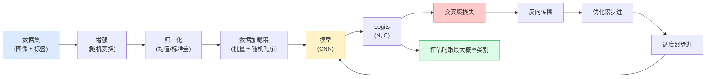

# 图像分类（Image Classification）

> 分类器（classifier）是一个将像素映射到类别概率分布（class probability distribution）的函数。其余的都是管道实现细节。

**类型:** 构建  
**语言:** Python  
**先决条件:** 第二阶段第09课（模型评估）、第三阶段第10课（迷你框架）、第四阶段第03课（卷积神经网络 CNNs）  
**时长:** 约75分钟

## 学习目标

- 构建一个端到端的图像分类流水线，基于 CIFAR-10：数据集、增强、模型、训练循环、评估
- 解释各组成部分（数据加载器、损失函数、优化器、调度器、数据增强）的作用，并预测任一环节出错时损失曲线的表现
- 从头实现 mixup、cutout 和标签平滑（label smoothing），并说明何时值得使用
- 阅读混淆矩阵和每类别的精确率/召回率表，以诊断数据集和模型在整体准确率之外的失败行为

## 双语术语速查

| 中文术语 | English term |
|----------|--------------|
| 图像分类 | Image classification |
| 分类器 | Classifier |
| 类别概率分布 | Class probability distribution |
| 流水线 | Pipeline |
| 数据集 | Dataset |
| 数据加载器 | DataLoader |
| 数据增强 | Data augmentation |
| 归一化 | Normalization |
| 训练循环 | Training loop |
| 评估 | Evaluation |
| 损失函数 | Loss function |
| 优化器 | Optimizer |
| 学习率调度器 | Learning-rate scheduler |
| logits | Logits |
| softmax | Softmax |
| 交叉熵 | Cross-entropy |
| 负对数似然 | Negative log-likelihood, NLL |
| 混淆矩阵 | Confusion matrix |
| 精确率/召回率 | Precision/recall |
| 校准误差 | Expected calibration error, ECE |


## 问题描述

每个发布的视觉任务在某种程度上都可以归结为图像分类。目标检测对区域进行分类。语义分割对像素进行分类。检索根据与类别质心的相似度排序。正确做到分类——数据集循环、增强策略、损失计算、评估——是本阶段其他任务都能迁移的核心能力。

大多数分类错误并不在模型内部，而是在流水线中：归一化出了问题、训练集未打乱、增强导致标签失真、验证集被训练数据污染、第三十个 epoch 后学习率默默发散。一个用正确配置能在 CIFAR-10 上达到 93% 的 CNN，配置错误时常见得分为 70-75%，且其损失曲线看起来合理。

本课将手工实现整个流水线，使所有部分可检查。你不会用任何可能隐藏错误的 `torchvision.datasets`。

## 概念讲解

### 关键公式（Key equations）

分类头输出 logits $z \in \mathbb{R}^C$。softmax 将它们变成类别概率，交叉熵只惩罚真实类别 $y$ 的负对数概率：

$$
p_i = \operatorname{softmax}(z)_i = \frac{\exp(z_i)}{\sum_{j=1}^{C} \exp(z_j)}
$$

$$
\mathcal{L}_{\mathrm{CE}}(z, y) = -\log p_y = -z_y + \log \sum_{j=1}^{C} \exp(z_j)
$$

### 分类流水线



该循环的每一条线都可能藏着错误。交叉熵接受原始 logits，不是 softmax 后的输出，因此任何在损失前调用 `model(x).softmax()` 都会悄无声息地计算错误的梯度。数据增强只作用于输入图片，不作用于标签——除 mixup 外，它混合了输入和标签。`optimizer.zero_grad()` 必须在每步调用一次，跳过它会累积梯度，看似学习率极不稳定。每个错误都会让损失曲线看起来平滑但结果不佳。

### 交叉熵、logits 和 softmax

分类器输出每个图像 `C` 个数字，称作 logits。应用 softmax 可将其转为概率分布：

```text
softmax(z)_i = exp(z_i) / sum_j exp(z_j)
```

交叉熵定义为正确类别的负对数概率：

```text
CE(z, y) = -log( softmax(z)_y )
        = -z_y + log( sum_j exp(z_j) )
```

右式是数值稳定的形式（对数-和-指数展开）。PyTorch 的 `nn.CrossEntropyLoss` 将 softmax 和 NLL（负对数似然）合并成一个操作，直接接受原始 logits。事先手动加 softmax 几乎总是错误——你计算的是 log(softmax(softmax(z)))，这是没有意义的。

### 为什么增强有效

CNN 对平移具有归纳偏置（权重共享），但对于裁剪、翻转、颜色抖动或遮挡没有内置的不变性。教会它这些不变性，唯有示范含有这些变换的像素数据。训练中的每个随机变换都在告诉模型：“这两张图像标签相同，学习那些忽略差异的特征。”

```text
原始裁剪：  “朝左的狗”
翻转：      “朝右的狗”          <- 同标签，不同像素
顺时针旋转15度：“狗，轻微倾斜”
颜色抖动：  “暖光中的狗”
随机擦除：  “缺块的狗”
```

原则：增强必须保持标签不变。剪切遮挡和旋转数字时，可能把“6”变成“9”；在这类数据集上，你需缩小旋转范围且选用符合数字特定不变性的增强。

### Mixup 和 Cutmix

普通增强改变像素，但标签保持独热向量。**Mixup** 和 **Cutmix** 则同时对像素与标签进行插值。

```text
Mixup:
  lambda ~ Beta(a, a)
  x = lambda * x_i + (1 - lambda) * x_j
  y = lambda * y_i + (1 - lambda) * y_j

Cutmix:
  将 x_j 的随机矩形区域贴到 x_i 上
  y = 标签按区域面积加权混合 y_i 和 y_j
```

它的好处是模型不再死记硬背尖锐的单热标签，而学会在类别间插值。训练损失升高，测试准确率提升。这是提升分类器鲁棒性成本最低的方法。

### 标签平滑

Mixup 的表亲。不是将模型训练成 `[0, 0, 1, 0, 0]` 这样单热标签，而是训练成 `[eps/C, eps/C, 1-eps, eps/C, eps/C]`，eps 取小数，比如 0.1。标签平滑防止模型生成任意尖锐的 logits，几乎无成本提高校准效果。PyTorch 1.10 以后的 `nn.CrossEntropyLoss(label_smoothing=0.1)` 内建支持该功能。

### 超越准确率的评估

整体准确率掩盖类别不平衡。一个90-10的二分类，如果总预测多数类，也能得90%。真正揭示现状的工具：

- **类别准确率** — 每个类别一个数字，立即暴露表现不佳的类别。
- **混淆矩阵** — C x C 网格，行i列j表示真实类别i预测为类别j的计数；对角线为正确预测，非对角线是模型出错的地方。
- **Top-1/Top-5准确率** — 正确类别是否在前1或前5预测中；Top-5对 ImageNet 很重要，因为像“Norwich犬”和“Norfolk犬”等类别本身具有歧义。
- **校准 (ECE)** — 预测置信度为0.8时，正确概率是否为80%？现代网络普遍过于自信；用温度缩放或标签平滑修正。

## 构建实现

### 第1步：确定性合成数据集

CIFAR-10 保存在磁盘上。为使本课既可复现又快速，我们构造一个长得像 CIFAR 的合成数据集——32x32 彩色图像，包含类别特定的结构，模型必须学习该信号。相同代码管道不变，可直接用在真实 CIFAR-10。

```python
import numpy as np
import torch
from torch.utils.data import Dataset


def synthetic_cifar(num_per_class=1000, num_classes=10, seed=0):
    rng = np.random.default_rng(seed)
    X = []
    Y = []
    for c in range(num_classes):
        centre = rng.uniform(0, 1, (3,))
        freq = 2 + c
        for _ in range(num_per_class):
            yy, xx = np.meshgrid(np.linspace(0, 1, 32), np.linspace(0, 1, 32), indexing="ij")
            r = np.sin(xx * freq) * 0.5 + centre[0]
            g = np.cos(yy * freq) * 0.5 + centre[1]
            b = (xx + yy) * 0.5 * centre[2]
            img = np.stack([r, g, b], axis=-1)
            img += rng.normal(0, 0.08, img.shape)
            img = np.clip(img, 0, 1)
            X.append(img.astype(np.float32))
            Y.append(c)
    X = np.stack(X)
    Y = np.array(Y)
    idx = rng.permutation(len(X))
    return X[idx], Y[idx]


class ArrayDataset(Dataset):
    def __init__(self, X, Y, transform=None):
        self.X = X
        self.Y = Y
        self.transform = transform

    def __len__(self):
        return len(self.X)

    def __getitem__(self, i):
        img = self.X[i]
        if self.transform is not None:
            img = self.transform(img)
        img = torch.from_numpy(img).permute(2, 0, 1)
        return img, int(self.Y[i])
```

每个类别有自己独特的颜色调色板和频率模式，加入高斯噪声，迫使模型学习信号而非简单记忆像素。共十类每类一千张，打乱顺序。

### 第2步：归一化和增强

两种所有视觉流水线必备的变换。

```python
def standardize(mean, std):
    mean = np.array(mean, dtype=np.float32)
    std = np.array(std, dtype=np.float32)
    def _fn(img):
        return (img - mean) / std
    return _fn


def random_hflip(p=0.5):
    def _fn(img):
        if np.random.random() < p:
            return img[:, ::-1, :].copy()
        return img
    return _fn


def random_crop(pad=4):
    def _fn(img):
        h, w = img.shape[:2]
        padded = np.pad(img, ((pad, pad), (pad, pad), (0, 0)), mode="reflect")
        y = np.random.randint(0, 2 * pad)
        x = np.random.randint(0, 2 * pad)
        return padded[y:y + h, x:x + w, :]
    return _fn


def compose(*fns):
    def _fn(img):
        for fn in fns:
            img = fn(img)
        return img
    return _fn
```

裁剪前进行反射填充 (reflect-pad)，而非零填充，防止出现模型学会利用黑色边框的无效信号。

### 第3步：Mixup

将两张图片与对应标签混合，作用于训练步骤中。实现为批量变换，保持靠近前向传递逻辑，而非放在数据集内。

```python
def mixup_batch(x, y, num_classes, alpha=0.2):
    if alpha <= 0:
        return x, torch.nn.functional.one_hot(y, num_classes).float()
    lam = float(np.random.beta(alpha, alpha))
    idx = torch.randperm(x.size(0), device=x.device)
    x_mixed = lam * x + (1 - lam) * x[idx]
    y_onehot = torch.nn.functional.one_hot(y, num_classes).float()
    y_mixed = lam * y_onehot + (1 - lam) * y_onehot[idx]
    return x_mixed, y_mixed


def soft_cross_entropy(logits, soft_targets):
    log_probs = torch.log_softmax(logits, dim=-1)
    return -(soft_targets * log_probs).sum(dim=-1).mean()
```

`soft_cross_entropy` 是面向软标签分布的交叉熵。当目标是严格单热标签时，它退化为普通交叉熵。

### 第4步：训练循环

完整方案：一次遍历数据集，每批次一次反向传播，调度器每个 epoch 更新一次。

```python
import torch
import torch.nn as nn
from torch.utils.data import DataLoader
from torch.optim import SGD
from torch.optim.lr_scheduler import CosineAnnealingLR

def train_one_epoch(model, loader, optimizer, device, num_classes, use_mixup=True):
    model.train()
    total, correct, loss_sum = 0, 0, 0.0
    for x, y in loader:
        x, y = x.to(device), y.to(device)
        if use_mixup:
            x_m, y_soft = mixup_batch(x, y, num_classes)
            logits = model(x_m)
            loss = soft_cross_entropy(logits, y_soft)
        else:
            logits = model(x)
            loss = nn.functional.cross_entropy(logits, y, label_smoothing=0.1)
        optimizer.zero_grad()
        loss.backward()
        optimizer.step()
        loss_sum += loss.item() * x.size(0)
        total += x.size(0)
        # 当开启 mixup 时，训练准确率以未混合标签 `y` 计算仅作为粗略信号
        # 真正性能请依赖验证准确率。
        with torch.no_grad():
            pred = logits.argmax(dim=-1)
            correct += (pred == y).sum().item()
    return loss_sum / total, correct / total


@torch.no_grad()
def evaluate(model, loader, device, num_classes):
    model.eval()
    total, correct = 0, 0
    loss_sum = 0.0
    cm = torch.zeros(num_classes, num_classes, dtype=torch.long)
    for x, y in loader:
        x, y = x.to(device), y.to(device)
        logits = model(x)
        loss = nn.functional.cross_entropy(logits, y)
        pred = logits.argmax(dim=-1)
        for t, p in zip(y.cpu(), pred.cpu()):
            cm[t, p] += 1
        loss_sum += loss.item() * x.size(0)
        total += x.size(0)
        correct += (pred == y).sum().item()
    return loss_sum / total, correct / total, cm
```

每次编写训练循环时要检查的五个不变量（invariants）：

1. 训练前调用 `model.train()`，评估前调用 `model.eval()` — 切换 dropout 和 batchnorm 行为。
2. 在调用 `.backward()` 前执行 `.zero_grad()`。
3. 在累积指标时使用 `.item()`，避免计算图被意外保留。
4. 评估时使用装饰器 `@torch.no_grad()` — 节省内存和时间，防止细微的错误。
5. 对原始 logits 使用 Argmax，而不是 softmax — 结果相同，但少一个操作。

### 第5步：整合

使用上一课的 `TinyResNet`，训练几个 epoch，评估。

```python
from main import synthetic_cifar, ArrayDataset
from main import standardize, random_hflip, random_crop, compose
from main import mixup_batch, soft_cross_entropy
from main import train_one_epoch, evaluate
# TinyResNet 来自上一课（03-cnns-lenet-to-resnet）。
# 调整导入路径到你存放上一课代码的位置。
from cnns_lenet_to_resnet import TinyResNet  # 示例占位符

X, Y = synthetic_cifar(num_per_class=500)
split = int(0.9 * len(X))
X_train, Y_train = X[:split], Y[:split]
X_val, Y_val = X[split:], Y[split:]

mean = [0.5, 0.5, 0.5]
std = [0.25, 0.25, 0.25]
train_tf = compose(random_hflip(), random_crop(pad=4), standardize(mean, std))
eval_tf = standardize(mean, std)

train_ds = ArrayDataset(X_train, Y_train, transform=train_tf)
val_ds = ArrayDataset(X_val, Y_val, transform=eval_tf)

train_loader = DataLoader(train_ds, batch_size=128, shuffle=True, num_workers=0)
val_loader = DataLoader(val_ds, batch_size=256, shuffle=False, num_workers=0)

device = "cuda" if torch.cuda.is_available() else "cpu"
model = TinyResNet(num_classes=10).to(device)
optimizer = SGD(model.parameters(), lr=0.1, momentum=0.9, weight_decay=5e-4, nesterov=True)
scheduler = CosineAnnealingLR(optimizer, T_max=10)

for epoch in range(10):
    tr_loss, tr_acc = train_one_epoch(model, train_loader, optimizer, device, 10, use_mixup=True)
    va_loss, va_acc, _ = evaluate(model, val_loader, device, 10)
    scheduler.step()
    print(f"epoch {epoch:2d}  lr {scheduler.get_last_lr()[0]:.4f}  "
          f"train {tr_loss:.3f}/{tr_acc:.3f}  val {va_loss:.3f}/{va_acc:.3f}")
```

在这个合成数据集上，五个 epoch 内验证准确率就接近完美，这正是要点：流程正确，模型可以学习可学的内容。换成真实的 CIFAR-10 数据集，同样的循环无需改动即可训练到约 90% 的准确率。

### 第6步：读取混淆矩阵（confusion matrix）

仅凭准确率并不能告诉你模型失败的具体位置，混淆矩阵可以。

```python
def print_confusion(cm, labels=None):
    c = cm.shape[0]
    labels = labels or [str(i) for i in range(c)]
    print(f"{'':>6}" + "".join(f"{l:>5}" for l in labels))
    for i in range(c):
        row = cm[i].tolist()
        print(f"{labels[i]:>6}" + "".join(f"{v:>5}" for v in row))
    print()
    tp = cm.diag().float()
    fp = cm.sum(dim=0).float() - tp
    fn = cm.sum(dim=1).float() - tp
    prec = tp / (tp + fp).clamp_min(1)
    rec = tp / (tp + fn).clamp_min(1)
    f1 = 2 * prec * rec / (prec + rec).clamp_min(1e-9)
    for i in range(c):
        print(f"{labels[i]:>6}  prec {prec[i]:.3f}  rec {rec[i]:.3f}  f1 {f1[i]:.3f}")

_, _, cm = evaluate(model, val_loader, device, 10)
print_confusion(cm)
```

行表示真实类别，列表示预测类别。类别 3 和 5 之间的非对角聚集表示模型将这两类混淆了，给你一个有针对性进行数据采集或类别特定增强的起点。

## 使用它

`torchvision` 将上述所有内容封装成惯用组件。对于真实的 CIFAR-10，完整流程仅需四行代码加一个训练循环。

```python
from torchvision.datasets import CIFAR10
from torchvision.transforms import Compose, RandomCrop, RandomHorizontalFlip, ToTensor, Normalize

mean = (0.4914, 0.4822, 0.4465)
std = (0.2470, 0.2435, 0.2616)
train_tf = Compose([
    RandomCrop(32, padding=4, padding_mode="reflect"),
    RandomHorizontalFlip(),
    ToTensor(),
    Normalize(mean, std),
])
eval_tf = Compose([ToTensor(), Normalize(mean, std)])

train_ds = CIFAR10(root="./data", train=True,  download=True, transform=train_tf)
val_ds   = CIFAR10(root="./data", train=False, download=True, transform=eval_tf)
```

需要注意两点：mean/std 是**数据集特有的** — 基于 CIFAR-10 训练集计算的，不是 ImageNet 的 — 并且反射填充（reflect pad）是社区默认的裁剪策略。直接套用 ImageNet 统计数据会导致约 1% 的准确率损失，这通常没人察觉，直到有人对模型进行性能分析。

## 部署它

本课会产生：

- `outputs/prompt-classifier-pipeline-auditor.md` — 一个 prompt，用于审计训练脚本的五个不变量，并指出第一个违反点。
- `outputs/skill-classification-diagnostics.md` — 一个 skill，给定混淆矩阵和类别名称列表，汇总各类别失败情况并提出最具影响力的单一修正建议。

## 练习

1. **(简单)** 在合成数据集上分别用和不用 mixup 训练同一模型五个 epoch。绘制训练和验证的损失曲线，解释为何使用 mixup 时训练损失更高，但验证准确率相似或更好。
2. **(中等)** 实现 Cutout —— 在每张训练图像上随机置零一个 8x8 的正方形 —— 并做消融实验，比较无增强、hflip+crop、hflip+crop+cutout、hflip+crop+mixup 四种情况下的验证准确率。
3. **(困难)** 构建 CIFAR-100 流程（100 类，输入尺寸相同），复现 ResNet-34 训练结果，精度误差不超过 1%。附加任务：调研三种学习率和两种权重衰减，记录到本地 CSV，生成最终混淆矩阵中最常混淆类别的表格。

## 关键词

| 术语 | 常见说法 | 实际含义 |
|------|----------|----------|
| Logits | “原始输出” | 每张图片的 C 维向量，softmax 前的结果；交叉熵期望的输入，而非 softmax 后的值 |
| 交叉熵（Cross-entropy） | “损失” | 正确类别的负对数概率；结合了 log-softmax 和 NLL，稳定计算 |
| DataLoader | “批处理器” | 封装数据集，支持 shuffle、批处理及（可选）多线程加载；常被误认为训练出错原因 |
| 数据增强（Augmentation） | “随机变换” | 训练时的任何像素级变换，不改变标签；教会 CNN 训练外的不变性 |
| Mixup / Cutmix | “混合两张图” | 混合输入图和标签，使分类器学习平滑插值而非硬边界 |
| 标签平滑（Label smoothing） | “软标签” | 将 one-hot 替换成 (1-eps, eps/(C-1), ...)，提升校准并略微提高准确率 |
| Top-k 准确率 | “Top-5” | 正确类别在预测概率最高的 k 个中；常用于类别本质模糊的数据集 |
| 混淆矩阵（Confusion matrix） | “错误分布” | C × C 矩阵，(i, j) 表示真实类别 i 被预测为 j 的图片数；对角线是正确，非对角线指示改进方向 |

## 拓展阅读

- [CS231n: Training Neural Networks](https://cs231n.github.io/neural-networks-3/) — 至今最清晰的训练流程单页介绍
- [Bag of Tricks for Image Classification (He et al., 2019)](https://arxiv.org/abs/1812.01187) — 各种小技巧综合提升 ResNet 在 ImageNet 上 3-4% 准确率
- [mixup: Beyond Empirical Risk Minimization (Zhang et al., 2017)](https://arxiv.org/abs/1710.09412) — 原始 mixup 论文；三页理论加令人信服的实验
- [Why temperature scaling matters (Guo et al., 2017)](https://arxiv.org/abs/1706.04599) — 证明现代网络误校准，提出用单参数温度缩放修正论文
