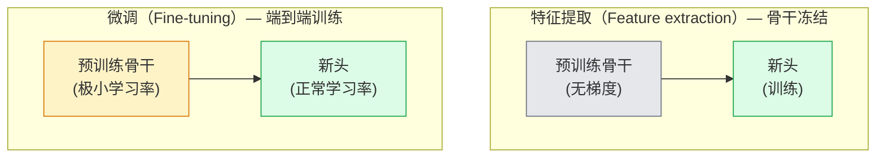

# 迁移学习（Transfer Learning）与微调（Fine-Tuning）

> 别人已经花费了数百万 GPU 小时教会网络识别边缘（edges）、纹理（textures）和物体部件（object parts）。在训练你自己的模型之前，应该借用那些特征。

**类型：** 实践构建  
**语言：** Python  
**先决条件：** 第4阶段第03课（CNNs），第4阶段第04课（图像分类）  
**时间：** 约75分钟

## 学习目标

- 区分特征提取（feature extraction）与微调（fine-tuning），并基于数据集大小、领域差距和计算预算选择合适的方法
- 加载预训练骨干网络，替换分类器头，只训练头部，20行代码内实现工作基线
- 逐步解冻层，采用判别学习率，使得早期通用特征更新较小，晚期任务特定层更新较大
- 诊断三种常见失败：过高学习率造成特征漂移，BatchNorm统计信息在小数据集崩塌，以及灾难性遗忘

## 双语术语速查

| 中文术语 | English term |
|----------|--------------|
| 迁移学习 | Transfer learning |
| 微调 | Fine-tuning |
| 特征提取 | Feature extraction |
| 预训练骨干网络 | Pretrained backbone |
| 分类器头 | Classifier head |
| 线性探测 | Linear probe |
| 逐步解冻 | Progressive unfreezing |
| 判别式学习率 | Discriminative learning rates |
| 分层学习率衰减 | Layer-wise learning-rate decay |
| 领域差距 | Domain gap |
| 特征漂移 | Feature drift |
| 灾难性遗忘 | Catastrophic forgetting |
| 灾难性崩塌 | Catastrophic collapse |
| 批归一化 | Batch Normalization, BatchNorm |
| 运行统计 | Running statistics |
| 组归一化 | GroupNorm |
| dropout | Dropout |
| 端到端训练 | End-to-end training |


## 问题背景

训练一个ResNet-50模型在ImageNet上的代价约为2000 GPU小时。几乎没有团队能为每个任务都投入如此大预算。几乎所有团队实际交付的是一个预训练的骨干网络，加上在几百到几千个任务特定图像上微调的新头。

这不是捷径。任何一个在ImageNet上训练的卷积神经网络的第一个卷积块学到的是边缘和Gabor滤波器。接下来的几个块学习纹理和简单的图案。中间块学习物体部件。最后几个块学习组合，开始类似于ImageNet中的1000个类别。这个层级中前90%几乎可以无变化地迁移到医学成像、工业检测、卫星数据以及其他视觉任务——因为自然中的边缘和纹理是有限的词汇。最后10%是你实际需要训练的。

正确做迁移存在三个陷阱：用过高学习率破坏预训练特征，冻结太多层导致模型信息不足，及BatchNorm的运行统计向从未被网络学习过的小数据集漂移。本课将有意识地演示这三种问题。

## 概念解析

### 关键公式（Key equations）

分层学习率衰减（layer-wise learning-rate decay）让靠近输入端的通用特征更新更小，靠近任务头的层更新更大：

$$
\eta_l = \eta_{\mathrm{head}} \cdot \gamma^{L-l}, \qquad 0 < \gamma < 1
$$

其中 $l$ 是层编号，$L$ 是最后一层编号，$\eta_{\mathrm{head}}$ 是分类头学习率。

### 特征提取（Feature extraction）与微调（Fine-tuning）

两种模式，根据你对预训练特征的信任度和拥有的数据量来选择。



经验法则：

| 数据集大小       | 领域差距           | 方案                                                        |
|------------------|--------------------|-------------------------------------------------------------|
| < 1k图像         | 接近ImageNet       | 冻结骨干，仅训练头部                                          |
| 1k-10k           | 接近               | 冻结前2-3个阶段，微调其余                                      |
| 10k-100k         | 任何               | 端到端微调，采用判别学习率                                    |
| 100k+            | 远离               | 微调所有层；领域远时则考虑从头训练                            |

“接近ImageNet”大致指自然RGB照片，含有类物体内容。医学CT、上空卫星影像和显微镜图像属于远领域——特征仍有帮助，但需要更多层适应。

### 为什么冻结有效

CNN在ImageNet学得的特征并非针对1000个类别专门设计，而是适应自然图像的统计特征：特定方向的边缘、纹理、对比模式、形状原语。这些统计特征在人类能识别的几乎所有视觉领域中是稳定的。这也是为何ImageNet训练的模型，搭配仅替换线性头零微调，在CIFAR-10上的零样本评估能取得80%以上准确率。头部学的是权重如何组合已有特征。

### 判别学习率（Discriminative learning rates）

解冻时，早期层应比晚期层学习率更低。早期层编码通用特征希望保持稳定；晚期层编码任务特定特征，需要大幅更新。

```text
典型方案：

  stage 0 (stem + 第一个组): 学习率 = base_lr / 100    (大多固定)
  stage 1:                   学习率 = base_lr / 10
  stage 2:                   学习率 = base_lr / 3
  stage 3 (最后骨干组):      学习率 = base_lr
  头部:                     学习率 = base_lr  (或稍高)
```

PyTorch 实现很简单，就是传给优化器的参数组列表。一个模型，五种学习率，无需额外代码。

### BatchNorm问题

BN层保持着ImageNet上计算的`running_mean`和`running_var`缓冲区。如果任务图像像素分布不同——光照、传感器、色彩空间不同——这些缓冲区就是错误的。三种处理方案，优先级递减：

1. **训练模式下微调BN。** 让BN一边训练一边更新运行统计。中等大小数据集（>= 5k样本）首选。
2. **冻结BN，并保持评估模式。** 保留ImageNet统计，仅训练权重。适合非常小数据集，避免BN移动平均统计噪声。
3. **用GroupNorm替换BN。** 彻底消除移动平均问题。检测与分割骨干网络常用，尤其是单GPU小batch场景。

此处错误会使准确率悄无声息下滑5-15%。

### 头部设计

分类器头由1-3个线性层组成，可选含dropout。每个torchvision骨干网络默认带有需要替换的头：

```python
backbone.fc = nn.Linear(backbone.fc.in_features, num_classes)          # ResNet
backbone.classifier[1] = nn.Linear(..., num_classes)                   # EfficientNet, MobileNet
backbone.heads.head = nn.Linear(..., num_classes)                      # torchvision ViT
```

小数据集通常用单线性层足够。若任务分布离骨干训练分布较远，加入隐藏层（Linear -> ReLU -> Dropout -> Linear）效果更佳。

### 层级学习率衰减（Layer-wise LR decay）

一种更平滑的判别学习率，现代微调常用（BEiT、DINOv2、ViT-B微调均采用）。不是按组分层，而是给每层一个比上一层略低的学习率：

```text
lr_layer_k = base_lr * decay^(L - k)
```

以 decay=0.75，L=12层Transformer为例，第1层学习率是头部的约0.04倍。对Transformer微调意义更大，CNN用分组学习率通常足够。

### 评估指标

迁移学习需记录两种准确率：

- **只用预训练特征的准确率** — 冻结骨干，仅训练头部的准确率，代表基线下限。
- **微调后的准确率** — 经过端到端训练的准确率，代表上限。

微调准确率低于仅预训练时，说明学习率或BN设置有问题。务必两者都打印。

## 实战构建

### 第1步：加载预训练骨干网络并查看结构

```python
import torch
import torch.nn as nn
from torchvision.models import resnet18, ResNet18_Weights

backbone = resnet18(weights=ResNet18_Weights.IMAGENET1K_V1)
print(backbone)
print()
print("分类器头:", backbone.fc)
print("特征维度:", backbone.fc.in_features)
```

`ResNet18`有四个阶段（`layer1..layer4`），一个stem层和一个`fc`头。每个torchvision分类骨干类似。

### 第2步：特征提取 — 冻结所有层，替换头部

```python
def make_feature_extractor(num_classes=10):
    model = resnet18(weights=ResNet18_Weights.IMAGENET1K_V1)
    for p in model.parameters():
        p.requires_grad = False
    model.fc = nn.Linear(model.fc.in_features, num_classes)
    return model

model = make_feature_extractor(num_classes=10)
trainable = sum(p.numel() for p in model.parameters() if p.requires_grad)
frozen = sum(p.numel() for p in model.parameters() if not p.requires_grad)
print(f"可训练参数量: {trainable:>10,}")
print(f"冻结参数量:    {frozen:>10,}")
```

仅`model.fc`可训练，骨干网络是冻结的不变特征提取器。

### 第3步：判别式微调

构建参数分组，分配每阶段独立学习率的工具函数。

```python
def discriminative_param_groups(model, base_lr=1e-3, decay=0.3):
    stages = [
        ["conv1", "bn1"],
        ["layer1"],
        ["layer2"],
        ["layer3"],
        ["layer4"],
        ["fc"],
    ]
    groups = []
    for i, names in enumerate(stages):
        lr = base_lr * (decay ** (len(stages) - 1 - i))
        params = [p for n, p in model.named_parameters()
                  if any(n.startswith(k) for k in names)]
        if params:
            groups.append({"params": params, "lr": lr, "name": "_".join(names)})
    return groups

model = resnet18(weights=ResNet18_Weights.IMAGENET1K_V1)
model.fc = nn.Linear(model.fc.in_features, 10)
for p in model.parameters():
    p.requires_grad = True

groups = discriminative_param_groups(model)
for g in groups:
    print(f"{g['name']:>10s}  lr={g['lr']:.2e}  参数数={sum(p.numel() for p in g['params']):>8,}")
```

`decay=0.3`表示每个阶段的学习率是下一阶段的30%。`fc`是`base_lr`，`layer4`为`0.3*base_lr`，`conv1`为`0.3^5*base_lr ≈ 0.00243*base_lr`。听起来极端但经验有效。

### 第4步：BatchNorm处理

冻结BN运行统计，但不冻结其权重的辅助函数。

```python
def freeze_bn_stats(model):
    for m in model.modules():
        if isinstance(m, (nn.BatchNorm1d, nn.BatchNorm2d, nn.BatchNorm3d)):
            m.eval()
            for p in m.parameters():
                p.requires_grad = False
    return model
```

在每个epoch开始调用`model.train()`后执行此函数。`model.train()`会将所有层切为训练模式，该函数仅将BN层保持评估模式。

### 第5步：最简端到端微调训练循环

```python
from torch.optim import SGD
from torch.utils.data import DataLoader
from torch.optim.lr_scheduler import CosineAnnealingLR
import torch.nn.functional as F

def fine_tune(model, train_loader, val_loader, device, epochs=5, base_lr=1e-3, freeze_bn=False):
    model = model.to(device)
    groups = discriminative_param_groups(model, base_lr=base_lr)
    optimizer = SGD(groups, momentum=0.9, weight_decay=1e-4, nesterov=True)
    scheduler = CosineAnnealingLR(optimizer, T_max=epochs)

    for epoch in range(epochs):
        model.train()
        if freeze_bn:
            freeze_bn_stats(model)
        tr_loss, tr_correct, tr_total = 0.0, 0, 0
        for x, y in train_loader:
            x, y = x.to(device), y.to(device)
            logits = model(x)
            loss = F.cross_entropy(logits, y, label_smoothing=0.1)
            optimizer.zero_grad()
            loss.backward()
            optimizer.step()
            tr_loss += loss.item() * x.size(0)
            tr_total += x.size(0)
            tr_correct += (logits.argmax(-1) == y).sum().item()
        scheduler.step()

        model.eval()
        va_total, va_correct = 0, 0
        with torch.no_grad():
            for x, y in val_loader:
                x, y = x.to(device), y.to(device)
                pred = model(x).argmax(-1)
                va_total += x.size(0)
                va_correct += (pred == y).sum().item()
        print(f"epoch {epoch}  训练集损失/准确率 {tr_loss/tr_total:.3f}/{tr_correct/tr_total:.3f}  "
              f"验证集准确率 {va_correct/va_total:.3f}")
    return model
```

在 CIFAR-10 上使用上述方案训练五个 epoch 可以将 `ResNet18-IMAGENET1K_V1` 的零样本线性探测（zero-shot linear-probe）准确率从约 70% 提升到约 93% 的微调（fine-tuned）准确率。仅训练头部（head）部分，准确率会在 86% 左右平台期，且永远不会涉及主干网络（backbone）。

### 第 6 步：逐步解冻（Progressive unfreezing）

一个每个 epoch 解冻一个阶段（stage），从末端向起始方向逐步解冻的调度策略。以一些额外 epoch 的代价缓解特征漂移（feature drift）问题。

```python
def progressive_unfreeze_schedule(model):
    stages = ["layer4", "layer3", "layer2", "layer1"]
    yielded = set()

    def start():
        for p in model.parameters():
            p.requires_grad = False
        for p in model.fc.parameters():
            p.requires_grad = True

    def unfreeze(epoch):
        if epoch < len(stages):
            name = stages[epoch]
            yielded.add(name)
            for n, p in model.named_parameters():
                if n.startswith(name):
                    p.requires_grad = True
            return name
        return None

    return start, unfreeze
```

`start()` 在第一个 epoch 之前调用一次。每个 epoch 开始时调用 `unfreeze(epoch)`。每当可训练参数集变化时，都需要重构优化器（optimizer），否则被冻结的参数仍然持有缓存的动量，导致优化器行为异常。

## 使用方法

对于大多数实际任务，`torchvision.models` 加三行代码就够了。以上复杂机制只在遇到库默认设置无法解决的问题时才重要。

```python
from torchvision.models import resnet50, ResNet50_Weights

model = resnet50(weights=ResNet50_Weights.IMAGENET1K_V2)
model.fc = nn.Linear(model.fc.in_features, num_classes)
optimizer = torch.optim.AdamW(model.parameters(), lr=1e-4, weight_decay=1e-4)
```

另外两个生产级默认配置：

- `timm` 提供约 800 个预训练视觉主干网络，具有统一的 API（`timm.create_model("resnet50", pretrained=True, num_classes=10)`）。对于任何超越 torchvision 模型库的微调，它是标准选择。
- 对于 Transformer（Transformer 架构），使用 `transformers.AutoModelForImageClassification.from_pretrained(name, num_labels=N)` 可以获得 ViT / BEiT / DeiT，加载语义与文本模型相同。

## 部署

本课将生成：

- `outputs/prompt-fine-tune-planner.md` — 一个提示，根据数据集大小、领域距离和计算预算，选择特征提取（feature-extraction）、逐步微调（progressive）、或端到端微调（end-to-end fine-tuning）。
- `outputs/skill-freeze-inspector.md` — 一个技能模块，给定 PyTorch 模型，报告哪些参数可训练，哪些 BatchNorm 层处于评估模式，优化器是否真的处理可训练参数。

## 练习

1. **（简单）** 在同一个合成 CIFAR 数据集上，分别训练 `ResNet18` 作为线性探测（backbone 冻结）和全微调模型。对比并报告两者准确率。说明哪个差距代表特征迁移良好，哪个表明迁移不佳。
2. **（中等）** 故意引入错误：将主干阶段的 `base_lr` 设置为 1e-1 而非头部。展示训练损失爆炸，然后通过应用 `discriminative_param_groups` 辅助函数恢复。记录每个阶段开始发散时的学习率。
3. **（困难）** 选取医学影像数据集（如 CheXpert-small、PatchCamelyon 或 HAM10000），比较三种训练方案：（a）ImageNet 预训练冻结主干+线性头；（b）ImageNet 预训练端到端微调；（c）从头训练。报告准确率和计算成本。在哪个数据集规模下从头训练开始具备竞争力？

## 关键词

| 术语 | 常说的含义 | 实际含义 |
|------|------------|----------|
| Feature extraction（特征提取） | “冻结并训练头部” | 主干参数冻结，只有新分类器头部接收梯度 |
| Fine-tuning（微调） | “端到端重训练” | 所有参数可训练，通常学习率远低于从头训练 |
| Discriminative LR（判别式学习率） | “早期层使用更小的学习率” | 优化器参数组中，早期阶段学习率为后期阶段的某个分数 |
| Layer-wise LR decay（分层学习率衰减） | “平滑学习率梯度” | 每层学习率乘以 decay^(L - k)；Transformer 微调中常见 |
| Catastrophic forgetting（灾难性遗忘） | “模型忘记了 ImageNet” | 学习率过高，已预训练特征在新任务信号之前被覆盖 |
| BN statistics drift（BatchNorm 统计漂移） | “运行均值出错” | BatchNorm 的 running_mean/var 来自与当前任务不同的分布，默默损害准确率 |
| Linear probe（线性探测） | “冻结主干+线性头” | 评估预训练特征——在冻结表示顶部训练最佳线性分类器的准确率 |
| Catastrophic collapse（灾难性崩塌） | “所有样本预测同一类” | 微调时学习率过高，在头部梯度稳定前摧毁特征导致 |

## 拓展阅读

- [How transferable are features in deep neural networks? (Yosinski et al., 2014)](https://arxiv.org/abs/1411.1792) — 量化不同层特征迁移能力的论文
- [Universal Language Model Fine-tuning (ULMFiT, Howard & Ruder, 2018)](https://arxiv.org/abs/1801.06146) — 判别式学习率和逐步解冻的原创方案；理念可直接应用视觉领域
- [timm documentation](https://huggingface.co/docs/timm) — 现代视觉主干网络及其精确微调默认配置参考
- [A Simple Framework for Linear-Probe Evaluation (Kornblith et al., 2019)](https://arxiv.org/abs/1805.08974) — 解释为何线性探测准确率重要及其规范报告方法
