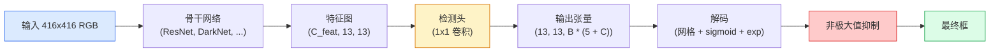

# 目标检测（Object Detection）——从零实现 YOLO

> 检测（detection）是分类（classification）加回归（regression），在特征图的每个位置运行，然后通过非极大值抑制（non-maximum suppression, NMS）进行清理。

**类型：** 构建  
**语言：** Python  
**先修知识：** 第4阶段第3课（CNN），第4阶段第4课（图像分类），第4阶段第5课（迁移学习）  
**时间：** 约75分钟

## 学习目标

- 解释网格和锚框设计如何将检测转变为密集预测问题，并说明输出张量中每个数字的含义  
- 计算框之间的交并比（Intersection-over-Union）并从零实现非极大值抑制  
- 在预训练骨干网络上构建最简化的 YOLO 风格头部，包括分类、目标存在性和框回归损失  
- 解读检测指标的行（precision@0.5, recall, mAP@0.5, mAP@0.5:0.95）并确定下一步调整的参数  

## 双语术语速查

| 中文术语 | English term |
|----------|--------------|
| 目标检测 | Object detection |
| YOLO | You Only Look Once |
| 密集预测 | Dense prediction |
| 特征图 | Feature map |
| 网格单元 | Grid cell |
| 锚框 | Anchor box |
| 检测头 | Detection head |
| 分类头 | Classification head |
| 回归头 | Regression head |
| 物体存在性分数 | Objectness score |
| 边界框回归 | Box regression |
| 交并比 | Intersection over Union, IoU |
| 非极大值抑制 | Non-maximum suppression, NMS |
| 真正例 | True positive |
| 平均精度 | Average precision, AP |
| 平均精度均值 | Mean average precision, mAP |
| 精确率 | Precision |
| 召回率 | Recall |
| 特征金字塔网络 | Feature Pyramid Network, FPN |


## 问题描述

分类告诉我们“这张图是狗”。检测告诉我们“在像素（112, 40, 280, 210）处有只狗，在（400, 180, 560, 310）处有只猫，画面其他部分没有目标”。这种结构性的变化——预测可变数量的带标签框而非每张图一个标签——是所有自主系统、监控产品、文档布局解析器和工业视觉流水线的核心需求。

检测同时体现了视觉领域所有的工程权衡。你要预测准确的框（回归头）、每个框的正确类别（分类头）、模型要知道什么时候没有物体（物体存在性分数），并且每个真实物体只输出一个预测（非极大值抑制）。缺一不可，否则检测管线要么漏检，要么报告虚假框，要么同一个物体重复检测数次，位置略有差异。

YOLO（You Only Look Once，Redmon 等，2016）设计通过一次卷积神经网络的前向传播实现实时运行，这些结构性决策仍然是现代检测器的骨干（如 YOLOv8, YOLOv9, YOLO-NAS, RT-DETR）。掌握核心，所有变体本质上都是相同部件的重组。

## 核心概念

### 关键公式（Key equations）

检测框质量通常先用交并比（Intersection over Union, IoU）衡量，再用 NMS 移除高度重叠的重复框：

$$
\operatorname{IoU}(A, B) = \frac{|A \cap B|}{|A \cup B|}
$$

$$
\mathcal{L}_{\mathrm{det}} = \lambda_{\mathrm{box}}\mathcal{L}_{\mathrm{box}} + \lambda_{\mathrm{obj}}\mathcal{L}_{\mathrm{obj}} + \lambda_{\mathrm{cls}}\mathcal{L}_{\mathrm{cls}}
$$

### 将检测视为密集预测

分类器每张图输出 C 个数。YOLO 风格的检测器输出 `(S x S x (5 + C))` 个数字，S 是空间的网格大小。



每个 `S * S` 网格单元预测 `B` 个框。对每个框：

- 4 个数字描述几何信息：`tx, ty, tw, th`  
- 1 个数字表示物体存在性分数：“该单元中心是否有物体？”  
- C 个数字为类别概率  

每个单元总计：`B * (5 + C)` 个数字。VOC 数据集的设置是 `S=13, B=2, C=20`，每个单元50个数字。

### 为什么使用网格和锚框

直回归会直接预测每个目标的绝对坐标 `(x, y, w, h)`。这对卷积网络来说困难，因为图像平移不应该导致所有预测都平移相同幅度，每个目标被空间锚定。网格解决这个问题：把每个真实框指派给它中心所在的网格单元，只有该单元负责预测该目标。

锚框解决第二个问题：3x3 的卷积无法从16像素感受野的特征单元准确回归500像素宽的大框。我们预定义每个单元 `B` 个先验框（锚框），网络预测相对于锚框的小偏差。模型学习选对锚框并微调它，而非盲目回归。

```text
锚框先验（416x416 输入示例）：

  小尺寸:   (30,  60)
  中等尺寸: (75,  170)
  大尺寸:   (200, 380)

每个网格单元，所有锚框发出 (tx, ty, tw, th, obj, c_1, ..., c_C)。
```

现代检测网络常结合 FPN 在不同分辨率下使用不同锚框——高分辨率浅层特征使用小锚框，低分辨率深层使用大锚框。同样思路，多尺度支持。

### 解码预测

预测的 `tx, ty, tw, th` 不是_box_坐标；是回归目标，需要转换后才能绘制：

```text
中心x = (sigmoid(tx) + cell_x) * stride
中心y = (sigmoid(ty) + cell_y) * stride
宽度 = anchor_w * exp(tw)
高度 = anchor_h * exp(th)
```

`sigmoid` 限制中心偏移在单元内，`exp` 让宽高自由伸缩且不发生符号翻转，`stride` 用来将网格坐标还原为像素坐标。这个解码步骤自 YOLO v2 起未变。

### IoU（交并比）

检测中框间相似度的通用度量：

```text
IoU(A, B) = area(A ∩ B) / area(A ∪ B)
```

IoU=1 表示完全一致；IoU=0 表示无重叠。预测和真实框的 IoU 决定预测是否为真正例（一般阈值 >=0.5）。两个预测框间的 IoU 用于 NMS 去重。

### 非极大值抑制（NMS）

训练于相邻锚框上的卷积网络经常会对同一物体预测多个重叠框。NMS 保留最高置信度的预测，删除与其 IoU 超阈值的其他预测。

```text
NMS(boxes, scores, iou_threshold):
    按分数降序排序框
    keep = []
    while boxes 不空:
        选最高分框，加入 keep
        删除所有与选框 IoU > iou_threshold 的框
    返回 keep
```

常用阈值为0.45。最新版检测器用 soft-NMS、DIoU-NMS 或直接学习抑制（如 RT-DETR），但结构目的相同。

### 损失函数

YOLO 损失由三部分加权和：

```text
L = lambda_coord * L_box(pred, target, 物体存在=1的单元)
  + lambda_obj   * L_obj(pred, 1,    物体存在=1的单元)
  + lambda_noobj * L_obj(pred, 0,    物体不存在=0的单元)
  + lambda_cls   * L_cls(pred, target, 物体存在=1的单元)
```

只有有物体的单元对框回归和分类损失贡献，没物体的单元只对物体存在性损失贡献，训练模型保持静默。`lambda_noobj` 通常较小（约0.5），防止空单元的损失主导。

现代变体用 CIoU/DIoU 损失替代均方误差框损失（直接优化 IoU），用焦点损失（focal loss）处理类别不平衡，平衡物体存在性和质量焦点损失。三部分结构不变。

### 检测指标

准确率不适合检测。改用四个指标：

- **Precision@IoU=0.5** — 被当作正样本的预测中，有多少正确。  
- **Recall@IoU=0.5** — 实际目标中，被检测出的比例。  
- **AP@0.5** — 在 IoU 阈值0.5下的精确-召回曲线面积；每类一个数字。  
- **mAP@0.5:0.95** — 0.5到0.95 以0.05递增的 IoU 阈值平均 AP；COCO 标准，最严格且信息最丰富。  

输出全部四项。mAP@0.5 强但 mAP@0.5:0.95 弱，说明定位粗糙；需改进框回归损失。精准高但召回低，说明过于保守；可降低置信度阈值或增加物体存在性权重。

## 动手实践

### 步骤1：IoU 计算

本课的工作核心，对两个 `(x1, y1, x2, y2)` 格式的框数组计算。

```python
import numpy as np

def box_iou(boxes_a, boxes_b):
    ax1, ay1, ax2, ay2 = boxes_a[:, 0], boxes_a[:, 1], boxes_a[:, 2], boxes_a[:, 3]
    bx1, by1, bx2, by2 = boxes_b[:, 0], boxes_b[:, 1], boxes_b[:, 2], boxes_b[:, 3]

    inter_x1 = np.maximum(ax1[:, None], bx1[None, :])
    inter_y1 = np.maximum(ay1[:, None], by1[None, :])
    inter_x2 = np.minimum(ax2[:, None], bx2[None, :])
    inter_y2 = np.minimum(ay2[:, None], by2[None, :])

    inter_w = np.clip(inter_x2 - inter_x1, 0, None)
    inter_h = np.clip(inter_y2 - inter_y1, 0, None)
    inter = inter_w * inter_h

    area_a = (ax2 - ax1) * (ay2 - ay1)
    area_b = (bx2 - bx1) * (by2 - by1)
    union = area_a[:, None] + area_b[None, :] - inter
    return inter / np.clip(union, 1e-8, None)
```

返回 `(N_a, N_b)` 矩阵的成对 IoU。与单个真实框对比时使其中一个数组形状为 `(1, 4)`。

### 步骤2：非极大值抑制

```python
def nms(boxes, scores, iou_threshold=0.45):
    order = np.argsort(-scores)
    keep = []
    while len(order) > 0:
        i = order[0]
        keep.append(i)
        if len(order) == 1:
            break
        rest = order[1:]
        ious = box_iou(boxes[[i]], boxes[rest])[0]
        order = rest[ious <= iou_threshold]
    return np.array(keep, dtype=np.int64)
```

保证确定性，复杂度为排序的 `O(N log N)`，行为与 `torchvision.ops.nms` 保持一致。

### 步骤3：框编码和解码

网络实际回归的是 `(tx, ty, tw, th)`，需在像素坐标和这些目标回退转换。

```python
def encode(box_xyxy, cell_x, cell_y, stride, anchor_wh):
    x1, y1, x2, y2 = box_xyxy
    cx = 0.5 * (x1 + x2)
    cy = 0.5 * (y1 + y2)
    w = x2 - x1
    h = y2 - y1
    tx = cx / stride - cell_x
    ty = cy / stride - cell_y
    tw = np.log(w / anchor_wh[0] + 1e-8)
    th = np.log(h / anchor_wh[1] + 1e-8)
    return np.array([tx, ty, tw, th])


def decode(tx_ty_tw_th, cell_x, cell_y, stride, anchor_wh):
    tx, ty, tw, th = tx_ty_tw_th
    cx = (sigmoid(tx) + cell_x) * stride
    cy = (sigmoid(ty) + cell_y) * stride
    w = anchor_wh[0] * np.exp(tw)
    h = anchor_wh[1] * np.exp(th)
    return np.array([cx - w / 2, cy - h / 2, cx + w / 2, cy + h / 2])


def sigmoid(x):
    return 1.0 / (1.0 + np.exp(-x))
```

测试方法：先编码一个框再解码，应得到非常接近原始框（由于 sigmoid 逆函数在 `tx` 不在 sigmoid 有效范围内时不完全可逆，存在轻微误差）。

### 步骤4：最简化 YOLO 头部

在特征图上使用一个 1x1 卷积，重塑为 `(B, S, S, num_anchors, 5 + C)` 形状。

```python
import torch
import torch.nn as nn

class YOLOHead(nn.Module):
    def __init__(self, in_c, num_anchors, num_classes):
        super().__init__()
        self.num_anchors = num_anchors
        self.num_classes = num_classes
        self.conv = nn.Conv2d(in_c, num_anchors * (5 + num_classes), kernel_size=1)

    def forward(self, x):
        n, _, h, w = x.shape
        y = self.conv(x)
        y = y.view(n, self.num_anchors, 5 + self.num_classes, h, w)
        y = y.permute(0, 3, 4, 1, 2).contiguous()
        return y
```

输出形状为 `(N, H, W, num_anchors, 5 + C)`。最后一维保存 `[tx, ty, tw, th, obj, cls_0, ..., cls_{C-1}]`。

### 步骤5：真实框分配

对每个真实框，确定哪个 `(单元格, 锚框)` 负责它。

```python
def assign_targets(boxes_xyxy, classes, anchors, stride, grid_size, num_classes):
    num_anchors = len(anchors)
    target = np.zeros((grid_size, grid_size, num_anchors, 5 + num_classes), dtype=np.float32)
    has_obj = np.zeros((grid_size, grid_size, num_anchors), dtype=bool)

    for box, cls in zip(boxes_xyxy, classes):
        x1, y1, x2, y2 = box
        cx, cy = 0.5 * (x1 + x2), 0.5 * (y1 + y2)
        gx, gy = int(cx / stride), int(cy / stride)
        bw, bh = x2 - x1, y2 - y1

        ious = np.array([
            (min(bw, aw) * min(bh, ah)) / (bw * bh + aw * ah - min(bw, aw) * min(bh, ah))
            for aw, ah in anchors
        ])
        best = int(np.argmax(ious))
        aw, ah = anchors[best]

        target[gy, gx, best, 0] = cx / stride - gx
        target[gy, gx, best, 1] = cy / stride - gy
        target[gy, gx, best, 2] = np.log(bw / aw + 1e-8)
        target[gy, gx, best, 3] = np.log(bh / ah + 1e-8)
        target[gy, gx, best, 4] = 1.0
        target[gy, gx, best, 5 + cls] = 1.0
        has_obj[gy, gx, best] = True
    return target, has_obj
```

Anchor 选择是“与真实框的最佳形状 IoU” — 这是一种廉价的代理方法，与 YOLOv2/v3 的分配方法相匹配。v5 及以后版本使用更复杂的策略（任务对齐匹配、动态 k）来细化同样的思想。

### 第 6 步：三种损失

```python
def yolo_loss(pred, target, has_obj, lambda_coord=5.0, lambda_obj=1.0, lambda_noobj=0.5, lambda_cls=1.0):
    has_obj_t = torch.from_numpy(has_obj).bool()
    target_t = torch.from_numpy(target).float()

    # 边框回归损失：只对有目标的单元格计算
    box_pred = pred[..., :4][has_obj_t]
    box_true = target_t[..., :4][has_obj_t]
    loss_box = torch.nn.functional.mse_loss(box_pred, box_true, reduction="sum")

    # 目标存在性损失
    obj_pred = pred[..., 4]
    obj_true = target_t[..., 4]
    loss_obj_pos = torch.nn.functional.binary_cross_entropy_with_logits(
        obj_pred[has_obj_t], obj_true[has_obj_t], reduction="sum")
    loss_obj_neg = torch.nn.functional.binary_cross_entropy_with_logits(
        obj_pred[~has_obj_t], obj_true[~has_obj_t], reduction="sum")

    # 有目标单元格上的分类损失
    cls_pred = pred[..., 5:][has_obj_t]
    cls_true = target_t[..., 5:][has_obj_t]
    loss_cls = torch.nn.functional.binary_cross_entropy_with_logits(
        cls_pred, cls_true, reduction="sum")

    total = (lambda_coord * loss_box
             + lambda_obj * loss_obj_pos
             + lambda_noobj * loss_obj_neg
             + lambda_cls * loss_cls)
    return total, {"box": loss_box.item(), "obj_pos": loss_obj_pos.item(),
                   "obj_neg": loss_obj_neg.item(), "cls": loss_cls.item()}
```

五个超参数，每个 YOLO 教程或是硬编码或是调参。比例很重要：`lambda_coord=5, lambda_noobj=0.5` 对应于原始的 YOLOv1 论文，仍然是一个合理的默认值。

### 第 7 步：推理流程

解码原始头部输出，应用 sigmoid/exp，基于目标存在性阈值筛选，并进行 NMS。

```python
def postprocess(pred_tensor, anchors, stride, img_size, conf_threshold=0.25, iou_threshold=0.45):
    pred = pred_tensor.detach().cpu().numpy()
    grid_h, grid_w = pred.shape[1], pred.shape[2]
    num_anchors = len(anchors)

    boxes, scores, classes = [], [], []
    for gy in range(grid_h):
        for gx in range(grid_w):
            for a in range(num_anchors):
                tx, ty, tw, th, obj, *cls = pred[0, gy, gx, a]
                score = sigmoid(obj) * sigmoid(np.array(cls)).max()
                if score < conf_threshold:
                    continue
                cls_idx = int(np.argmax(cls))
                cx = (sigmoid(tx) + gx) * stride
                cy = (sigmoid(ty) + gy) * stride
                w = anchors[a][0] * np.exp(tw)
                h = anchors[a][1] * np.exp(th)
                boxes.append([cx - w / 2, cy - h / 2, cx + w / 2, cy + h / 2])
                scores.append(float(score))
                classes.append(cls_idx)

    if not boxes:
        return np.zeros((0, 4)), np.zeros((0,)), np.zeros((0,), dtype=int)
    boxes = np.array(boxes)
    scores = np.array(scores)
    classes = np.array(classes)
    keep = nms(boxes, scores, iou_threshold)
    return boxes[keep], scores[keep], classes[keep]
```

这就是完整的评估路径：head -> 解码 -> 阈值筛选 -> NMS。

## 使用它

`torchvision.models.detection` 提供了与此相同结构的生产级检测器。加载预训练模型只需三行代码。

```python
import torch
from torchvision.models.detection import fasterrcnn_resnet50_fpn_v2

model = fasterrcnn_resnet50_fpn_v2(weights="DEFAULT")
model.eval()
with torch.no_grad():
    predictions = model([torch.randn(3, 400, 600)])
print(predictions[0].keys())
print(f"boxes:  {predictions[0]['boxes'].shape}")
print(f"scores: {predictions[0]['scores'].shape}")
print(f"labels: {predictions[0]['labels'].shape}")
```

对于实时推理流程，`ultralytics`（YOLOv8/v9）是标准选择：`from ultralytics import YOLO; model = YOLO('yolov8n.pt'); model(img)`。模型内部处理解码和 NMS，并返回和上述相同的 `boxes / scores / labels` 三元组。

## 部署它

本课内容会生成：

- `outputs/prompt-detection-metric-reader.md` — 一个提示，将一行 `precision, recall, AP, mAP@0.5:0.95` 结果转成一句诊断和最有用的后续实验建议。
- `outputs/skill-anchor-designer.md` — 一项技能，给定真实框数据集，运行 `(w, h)` k-means 聚类，返回 FPN 各层的锚框集合及对应覆盖率统计，帮助你选择合适的锚框数量。

## 练习

1. **（简单）** 实现 `box_iou` 并对比 `torchvision.ops.box_iou`，在 1000 对随机框上验证最大绝对差小于 `1e-6`。
2. **（中等）** 改写 `yolo_loss` 使用 `CIoU` 边框损失替代 MSE。在 100 张合成图像数据集上展示 CIoU 收敛得到的最终 mAP@0.5:0.95 比 MSE 更好，且迭代次数相同。
3. **（困难）** 实现多尺度推理：用同一张图的三种分辨率作为输入，合并所有边框预测，最后做一次 NMS。对比单尺度推理，在验证集上测量 mAP 提升。

## 关键词汇

| 术语 | 俗称 | 实际含义 |
|------|----------------|----------------------|
| Anchor | “先验框” | 每个网格单元的预定义框形状，网络预测偏移量而非绝对坐标 |
| IoU | “重叠度” | 两个框的交并比，是检测中的通用相似度度量 |
| NMS | “去重” | 贪心算法，保留得分最高的预测，移除与其重叠度超过阈值的预测 |
| Objectness | “这里有东西吗” | 每个锚框每个单元格的标量，预测该单元格中心是否有物体 |
| Grid stride | “下采样因子” | 每个网格单元对应的像素数，以 416 像素输入、13 网格头为例，stride 为 32 |
| mAP | “平均准确率均值” | 精确率-召回率曲线下的面积，在各类别和（对 COCO）IoU 阈值上取平均 |
| AP@0.5 | “PASCAL VOC AP” | IoU 阈值 0.5 的平均准确率，是宽松版本的指标 |
| mAP@0.5:0.95 | “COCO AP” | 以 0.5 到 0.95（步长 0.05）多个 IoU 阈值的平均值，是严格版本且当前社区标准 |

## 延伸阅读

- [YOLOv1: You Only Look Once (Redmon et al., 2016)](https://arxiv.org/abs/1506.02640) — 创始论文；每个 YOLO 基于该结构不断改进
- [YOLOv3 (Redmon & Farhadi, 2018)](https://arxiv.org/abs/1804.02767) — 引入多尺度 FPN 风格头部的论文；依然是最清晰的结构图
- [Ultralytics YOLOv8 文档](https://docs.ultralytics.com) — 当前生产参考；涵盖数据集格式、增强、训练策略
- [The Illustrated Guide to Object Detection (Jonathan Hui)](https://jonathan-hui.medium.com/object-detection-series-24d03a12f904) — 最通俗易懂的检测系列讲解；理解 DETR、RetinaNet、FCOS 和 YOLO 的关系极有价值
