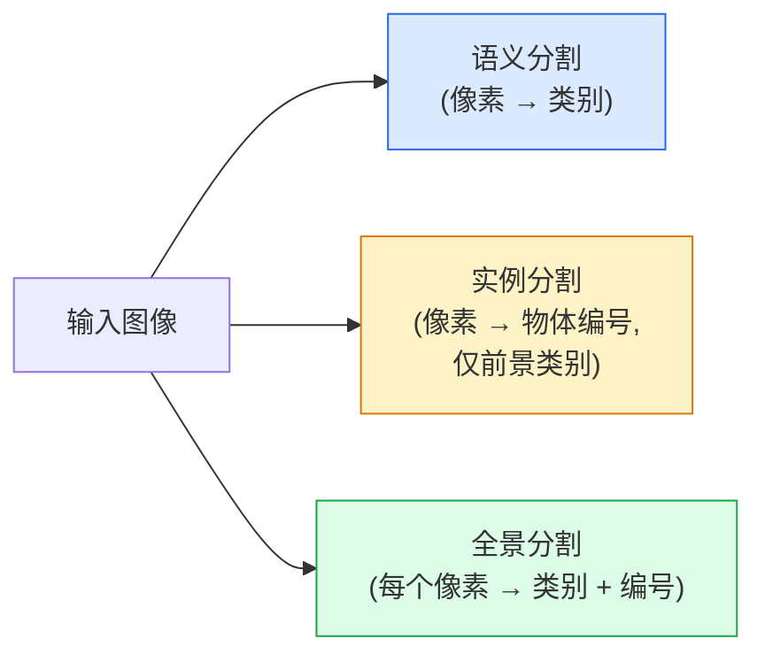
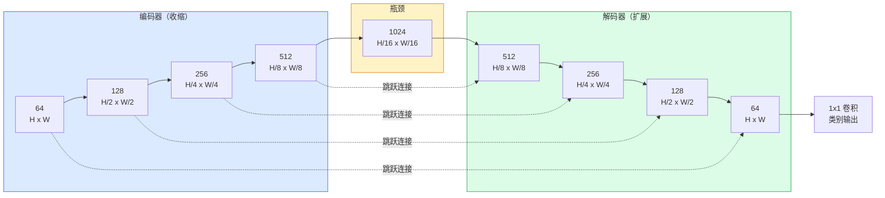

# 语义分割（Semantic Segmentation）——U-Net

> 分割（segmentation）是在每个像素上进行分类。U-Net 通过将下采样编码器（encoder）与上采样解码器（decoder）配对，并在它们之间连接跳跃连接（skip connections），使其得以实现。

**类型：** 构建
**语言：** Python
**先决条件：** 第 4 阶段 第 3 课（卷积神经网络 CNN），第 4 阶段 第 4 课（图像分类）
**时间：** ~75 分钟

## 学习目标

- 区分语义分割（semantic segmentation）、实例分割（instance segmentation）和全景分割（panoptic segmentation），并为给定问题选择合适的任务
- 使用 PyTorch 从零构建 U-Net，包含编码器模块（encoder blocks）、瓶颈（bottleneck）、带有转置卷积（transposed convolutions）的解码器和跳跃连接（skip connections）
- 实现像素级交叉熵损失（pixel-wise cross-entropy）、Dice 损失及医学和工业分割中当前默认的组合损失
- 读取每类的 IoU（交并比）和 Dice 指标，并诊断低分是由小目标召回率（small-object recall）、边界准确性（boundary accuracy）还是类别不平衡（class imbalance）引起的

## 双语术语速查

| 中文术语 | English term |
|----------|--------------|
| 语义分割 | Semantic segmentation |
| 实例分割 | Instance segmentation |
| 全景分割 | Panoptic segmentation |
| 密集预测 | Dense prediction |
| 像素级分类 | Pixel-wise classification |
| U-Net | U-Net |
| 编码器 | Encoder |
| 解码器 | Decoder |
| 瓶颈层 | Bottleneck |
| 跳跃连接 | Skip connection |
| 转置卷积 | Transposed convolution |
| 双线性上采样 | Bilinear upsampling |
| 像素级交叉熵 | Pixel-wise cross-entropy |
| Dice 损失 | Dice loss |
| 组合损失 | Combined loss |
| 平均交并比 | Mean IoU, mIoU |
| 边界 F1 | Boundary F1 |
| 类别不平衡 | Class imbalance |


## 问题描述

分类输出每张图像一个标签。检测输出每张图像几个框。分割输出每个像素一个标签。对于大小为 `H x W` 的输入，输出是形状为 `H x W`（语义）或 `H x W x N_instances`（实例）的张量。即每张图像有数百万个预测，而不是一个。

分割的结构决定了它几乎主导了所有密集预测视觉产品：医学影像（肿瘤掩膜）、自动驾驶（道路、车道、障碍物）、卫星图像（建筑轮廓、作物边界）、文档解析（布局区域）、机器人技术（可抓取区域）。这些任务都不是简单地画框能解决的；它们需要精确的轮廓。

架构上的核心问题说起来简单做起来难：网络需要同时看见图像的全局上下文（这是什么场景）和局部像素细节（哪个像素是道路，哪个是人行道）。标准 CNN 空间上压缩以获得上下文，但会丢失细节。U-Net 是解决两者兼顾的设计。

## 概念

### 关键公式（Key equations）

像素级交叉熵处理每个像素的类别概率，Dice 系数直接衡量预测掩码与真实掩码的重叠程度：

```text
Loss = mean over (n, h, w) of -log(softmax(logits[n, :, h, w])[target[n, h, w]])
```

```text
Dice(p, y) = 2 * sum(p * y) / (sum(p) + sum(y) + epsilon)
Dice_loss = 1 - Dice
```

其中 `p` 是某个类别的 sigmoid/softmax 概率图，`y` 是对应类别的二值真值掩码。交叉熵负责稳定地学习每个像素的类别概率，Dice 直接优化预测掩码和真实掩码的重叠程度。

### 语义分割 vs 实例分割 vs 全景分割



- **语义分割（Semantic）** 指“这个像素是道路，那个像素是汽车”。两个并排的汽车合并成一个单独的区域。
- **实例分割（Instance）** 指“这个像素是汽车编号3，那个像素是汽车编号5”。忽略背景物体（背景物体 = 天空、道路、草地）。
- **全景分割（Panoptic）** 结合两者：每个像素都有类别标签，每个实例都有唯一编号，背景和物体都被分割。

本课覆盖语义分割。下一课（Mask R-CNN）将覆盖实例分割。

### U-Net 的形状



编码器将空间尺寸减半四次，同时通道数翻倍。解码器反向操作：空间尺寸翻倍四次，通道数减半。跳跃连接在每个分辨率层串联匹配的编码器和解码器特征。最终 1x1 卷积在全尺寸下将 64 通道映射为类别数。

跳跃连接为什么必要：解码器在输出像素级预测前只见过小特征图。没有跳跃连接，它无法准确定位边界，因为这些信息在编码器中被压缩丢失。跳跃连接传递编码器计算的高分辨率特征图。

### 转置卷积 vs 双线性上采样

解码器必须扩大空间维度。有两个选择：

- **转置卷积（nn.ConvTranspose2d）** — 可学习的上采样，历史上 U-Net 默认。如步长和核大小不匹配，会产生棋盘状伪影。
- **双线性上采样 + 3x3 卷积** — 平滑上采样后接卷积。伪影少，参数少，现为现代默认。

两者在实际中都有采用。对于第一个 U-Net，用双线性更安全。

### 像素网格上的交叉熵

语义分割有 C 个类别，模型输出尺寸为 `(N, C, H, W)`，目标尺寸为 `(N, H, W)`，其中为整数类别 ID。交叉熵与分类相同，只是应用在每个空间位置：

```text
Loss = mean over (n, h, w) of -log(softmax(logits[n, :, h, w])[target[n, h, w]])
```

PyTorch 中的 `F.cross_entropy` 原生支持这个形状，无需 reshape。

### Dice 损失及其必要性

交叉熵对每个像素一视同仁。当某类占画面绝大多数时（医学影像中背景占 99%，肿瘤占 1%），这不好。网络可通过全部预测为背景获得 99% 准确率，却毫无用处。

Dice 损失通过直接优化预测掩膜与真值掩膜的重叠度解决此问题：

```text
Dice(p, y) = 2 * sum(p * y) / (sum(p) + sum(y) + epsilon)
Dice_loss = 1 - Dice
```

其中 `p` 是该类别的 sigmoid/softmax 概率图，`y` 是二值真值掩膜。损失仅在重叠完美时为零。因其基于比例，类别不平衡不影响。

实际中，使用**组合损失**：

```text
L = L_cross_entropy + lambda * L_dice       (lambda ≈ 1)
```

交叉熵在训练初期提供稳定梯度；Dice 损失使训练后期聚焦于匹配掩膜形状。这是医学影像默认组合，也难被任何类别不平衡数据集超越。

### 评估指标

- **Pixel accuracy（像素准确率）** — 预测正确的像素占比。计算便宜，但在类别不平衡时容易失真：如果背景占 99%，全预测背景也能得到很高准确率。
- **IoU per class（每类交并比）** — 对每个类别分别计算预测掩码与真实掩码的交集除以并集；再对类别求平均就是 mIoU。
- **Dice / pixel F1（Dice 系数，像素级 F1）** — 另一个重叠指标，和 IoU 单调相关：`Dice = 2 * IoU / (1 + IoU)`。医学影像通常报告 Dice，自动驾驶和通用视觉分割更常报告 IoU。
- **Boundary F1（边界 F1）** — 只在边界附近计算 F1，衡量预测轮廓是否贴近真实轮廓。对半导体检测、医学边缘和高精度抠图这类任务很重要。

报告每类 IoU，而非仅给 mIoU。均值隐藏了单个类别 15% 但其余 9 类有 85% 的情况。

### 输入分辨率权衡

U-Net 编码器尺寸减半 4 次，输入须为 16 的倍数。医学图像多为 512x512 或 1024x1024。自动驾驶裁剪图是 2048x1024。U-Net 的内存需求随 `H * W * C_max` 线性增长，1024x1024 且瓶颈通道数为 1024 时，前向传递已占用数 GB 显存。

两种常见解决方案：
1. 切片输入 — 对 256x256 的带重叠切片分别处理再拼接。
2. 用膨胀卷积（dilated convolutions）替代瓶颈，保持较高空间分辨率同时扩大感受野（例如 DeepLab 系列）。

初学时，256x256 输入、64 通道基数的 U-Net 可在 8GB 显存上顺利训练。

## 构建

### 第 1 步：编码器模块

两层 3x3 卷积，带批归一化（batch norm）和 ReLU 激活。第一层卷积改变通道数，第二层保持通道数。

```python
import torch
import torch.nn as nn
import torch.nn.functional as F

class DoubleConv(nn.Module):
    def __init__(self, in_c, out_c):
        super().__init__()
        self.net = nn.Sequential(
            nn.Conv2d(in_c, out_c, kernel_size=3, padding=1, bias=False),
            nn.BatchNorm2d(out_c),
            nn.ReLU(inplace=True),
            nn.Conv2d(out_c, out_c, kernel_size=3, padding=1, bias=False),
            nn.BatchNorm2d(out_c),
            nn.ReLU(inplace=True),
        )

    def forward(self, x):
        return self.net(x)
```

此模块在整个网络中多处重复使用。`bias=False` 因为 BN 中的 beta 参数承担偏置作用。

### 第 2 步：下采样和上采样块

```python
class Down(nn.Module):
    def __init__(self, in_c, out_c):
        super().__init__()
        self.net = nn.Sequential(
            nn.MaxPool2d(2),
            DoubleConv(in_c, out_c),
        )

    def forward(self, x):
        return self.net(x)


class Up(nn.Module):
    def __init__(self, in_c, out_c):
        super().__init__()
        self.up = nn.Upsample(scale_factor=2, mode="bilinear", align_corners=False)
        self.conv = DoubleConv(in_c, out_c)

    def forward(self, x, skip):
        x = self.up(x)
        if x.shape[-2:] != skip.shape[-2:]:
            x = F.interpolate(x, size=skip.shape[-2:], mode="bilinear", align_corners=False)
        x = torch.cat([skip, x], dim=1)
        return self.conv(x)
```

只比较空间维度 `shape[-2:]` 处理那些维度不整除16的输入。通过安全 `F.interpolate` 实现尺寸对齐后拼接。若比较完整形状，将对通道数不同也触发，后者应当报错，而非悄悄插值。

### 第 3 步：构造 U-Net

```python
class UNet(nn.Module):
    def __init__(self, in_channels=3, num_classes=2, base=64):
        super().__init__()
        self.inc = DoubleConv(in_channels, base)
        self.d1 = Down(base, base * 2)
        self.d2 = Down(base * 2, base * 4)
        self.d3 = Down(base * 4, base * 8)
        self.d4 = Down(base * 8, base * 16)
        self.u1 = Up(base * 16 + base * 8, base * 8)
        self.u2 = Up(base * 8 + base * 4, base * 4)
        self.u3 = Up(base * 4 + base * 2, base * 2)
        self.u4 = Up(base * 2 + base, base)
        self.outc = nn.Conv2d(base, num_classes, kernel_size=1)

    def forward(self, x):
        x1 = self.inc(x)
        x2 = self.d1(x1)
        x3 = self.d2(x2)
        x4 = self.d3(x3)
        x5 = self.d4(x4)
        x = self.u1(x5, x4)
        x = self.u2(x, x3)
        x = self.u3(x, x2)
        x = self.u4(x, x1)
        return self.outc(x)

net = UNet(in_channels=3, num_classes=2, base=32)
x = torch.randn(1, 3, 256, 256)
print(f"output: {net(x).shape}")
print(f"params: {sum(p.numel() for p in net.parameters()):,}")
```

输出形状 `(1, 2, 256, 256)` — 与输入空间尺寸相同，输出通道数为类别数。`base=32` 时约 770 万参数。

### 第 4 步：损失函数

```python
def dice_loss(logits, targets, num_classes, eps=1e-6):
    probs = F.softmax(logits, dim=1)
    targets_one_hot = F.one_hot(targets, num_classes).permute(0, 3, 1, 2).float()
    dims = (0, 2, 3)
    intersection = (probs * targets_one_hot).sum(dim=dims)
    denom = probs.sum(dim=dims) + targets_one_hot.sum(dim=dims)
    dice = (2 * intersection + eps) / (denom + eps)
    return 1 - dice.mean()


def combined_loss(logits, targets, num_classes, lam=1.0):
    ce = F.cross_entropy(logits, targets)
    dc = dice_loss(logits, targets, num_classes)
    return ce + lam * dc, {"ce": ce.item(), "dice": dc.item()}
```

Dice 计算为每个类别的得分后平均（宏 Dice）。`eps` 防止对批次中不存在的类别除零。

### 第5步：IoU 指标

```python
@torch.no_grad()
def iou_counts(logits, targets, num_classes):
    preds = logits.argmax(dim=1)
    intersections = torch.zeros(num_classes, device=logits.device)
    unions = torch.zeros(num_classes, device=logits.device)
    for c in range(num_classes):
        pred_c = (preds == c)
        true_c = (targets == c)
        intersections[c] = (pred_c & true_c).sum().float()
        unions[c] = (pred_c | true_c).sum().float()
    return intersections, unions
```

返回每个类别的交集和并集计数。评估时在整个验证集上累加这些计数，再做除法，避免按 batch 平均引入偏差。

### 第6步：用于端到端验证的合成数据集

在有色背景上生成形状，使网络必须学习形状而非像素颜色。

```python
import numpy as np
from torch.utils.data import Dataset, DataLoader

def synthetic_segmentation(num_samples=200, size=64, seed=0):
    rng = np.random.default_rng(seed)
    images = np.zeros((num_samples, size, size, 3), dtype=np.float32)
    masks = np.zeros((num_samples, size, size), dtype=np.int64)
    for i in range(num_samples):
        bg = rng.uniform(0, 1, (3,))
        images[i] = bg
        masks[i] = 0
        num_shapes = rng.integers(1, 4)
        for _ in range(num_shapes):
            cls = int(rng.integers(1, 3))
            color = rng.uniform(0, 1, (3,))
            cx, cy = rng.integers(10, size - 10, size=2)
            r = int(rng.integers(4, 12))
            yy, xx = np.meshgrid(np.arange(size), np.arange(size), indexing="ij")
            if cls == 1:
                mask = (xx - cx) ** 2 + (yy - cy) ** 2 < r ** 2
            else:
                mask = (np.abs(xx - cx) < r) & (np.abs(yy - cy) < r)
            images[i][mask] = color
            masks[i][mask] = cls
        images[i] += rng.normal(0, 0.02, images[i].shape)
        images[i] = np.clip(images[i], 0, 1)
    return images, masks


class SegDataset(Dataset):
    def __init__(self, images, masks):
        self.images = images
        self.masks = masks

    def __len__(self):
        return len(self.images)

    def __getitem__(self, i):
        img = torch.from_numpy(self.images[i]).permute(2, 0, 1).float()
        mask = torch.from_numpy(self.masks[i]).long()
        return img, mask
```

三个类别：背景（0）、圆形（1）、方形（2）。网络必须学习区分形状。

### 第7步：训练循环

```python
def evaluate_iou(model, loader, device, num_classes):
    model.eval()
    iou_intersections = torch.zeros(num_classes, device=device)
    iou_unions = torch.zeros(num_classes, device=device)
    with torch.no_grad():
        for x, y in loader:
            x, y = x.to(device), y.to(device)
            batch_intersections, batch_unions = iou_counts(model(x), y, num_classes)
            iou_intersections += batch_intersections
            iou_unions += batch_unions
    return torch.where(
        iou_unions > 0,
        iou_intersections / iou_unions,
        torch.full_like(iou_unions, float("nan")),
    )


def train_one_epoch(model, loader, optimizer, device, num_classes):
    model.train()
    loss_sum, total = 0.0, 0
    for x, y in loader:
        x, y = x.to(device), y.to(device)
        logits = model(x)
        loss, _ = combined_loss(logits, y, num_classes)
        optimizer.zero_grad()
        loss.backward()
        optimizer.step()
        loss_sum += loss.item() * x.size(0)
        total += x.size(0)
    return loss_sum / total
```

在合成数据集上运行 10-30 个 epoch，观察形状类别的 mIoU 逐渐超过 0.9。关键是像 `main.py` 那样在验证集层面累计交并计数，而不是先算 batch IoU 再平均。

## 使用它

生产中，`segmentation_models_pytorch`（“smp”）封装了所有标准分割架构以及任何 torchvision 或 timm 的骨干网络。三行代码：

```python
import segmentation_models_pytorch as smp

model = smp.Unet(
    encoder_name="resnet34",
    encoder_weights="imagenet",
    in_channels=3,
    classes=3,
)
```

实际工作中还值得了解：
- **DeepLabV3+** 用膨胀卷积替代基于最大池化的下采样，使瓶颈层保持分辨率；在卫星和驾驶数据上边界更准确且速度更快。
- **SegFormer** 用分层 transformer 代替卷积编码器；当前许多基准测试的 SOTA。
- **Mask2Former** / **OneFormer** 将语义、实例和全景分割统一到单一架构中。

这三者都是 `smp` 或 `transformers` 中的即插即用替代方案，使用相同的数据加载器。

## 部署它

本课程产出：

- `outputs/prompt-segmentation-task-picker.md` — 一个提示，根据任务选择语义、实例或全景分割，并命名架构。
- `outputs/skill-segmentation-mask-inspector.md` — 一个技能报告类分布、预测掩码统计，以及欠预测或边界模糊的类别。

## 练习

1. **（简单）** 为二分类分割任务（前景 vs 背景）实现 `bce_dice_loss`。在合成两类数据集上验证，组合损失比单独 BCE 在前景仅占 5% 像素时收敛更快。
2. **（中等）** 用 `nn.ConvTranspose2d` 上采样块替换 `nn.Upsample + conv` 上采样块。分别训练并比较 mIoU，观察转置卷积版本中出现棋盘伪影的位置。
3. **（困难）** 选用真实分割数据集（Oxford-IIIT Pets、Cityscapes 小分割或医学子集）训练 U-Net，达到距 `smp.Unet` 参考模型 IoU 两点以内的表现。报告各类 IoU，指出加入 Dice 损失带来最大收益的类别。

## 关键词

| 术语            | 大众说法           | 实际含义                                  |
|-----------------|---------------------|---------------------------------------|
| Semantic segmentation（语义分割） | “标记每个像素”       | 每像素分类为 C 类；同类实例合并                 |
| Instance segmentation（实例分割） | “标记每个对象”       | 区分同类别不同实例；仅前景                      |
| Panoptic segmentation（全景分割） | “语义 + 实例”        | 每像素分配类别；每个物体实例给唯一 ID            |
| Skip connection（跳跃连接）        | “U-Net 桥接”         | 将编码器特征拼接到匹配分辨率的解码器特征，保留高频细节 |
| Transposed conv（转置卷积）         | “反卷积”             | 可学习的上采样；可能产生棋盘纹伪影               |
| Dice loss（Dice 损失）               | “重叠损失”           | 1 - 2|A ∩ B| / (|A| + |B|)；直接优化掩码重叠且对类别不平衡鲁棒 |
| mIoU（平均交并比）                   | “平均交并比”         | 各类别 IoU 平均；分割领域的标准评价指标           |
| Boundary F1（边界 F1）               | “边界准确率”         | 仅在边界像素计算的 F1 分数；精度关键任务的重要指标 |

## 拓展阅读

- [U-Net: Convolutional Networks for Biomedical Image Segmentation (Ronneberger et al., 2015)](https://arxiv.org/abs/1505.04597) — 原始论文；大家都引用的图在第2页
- [Fully Convolutional Networks (Long et al., 2015)](https://arxiv.org/abs/1411.4038) — 首个将分割任务做成端到端卷积问题的论文
- [segmentation_models_pytorch](https://github.com/qubvel/segmentation_models.pytorch) — 生产级分割参考代码；包含所有标准架构与损失
- [Lessons learned from training SOTA segmentation (kaggle.com competitions)](https://www.kaggle.com/code/iafoss/carvana-unet-pytorch) — 讲解为何 TTA、伪标签、类别权重对真实数据很重要
