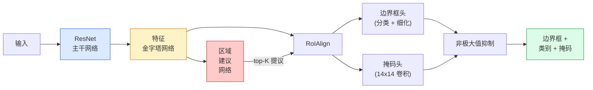

# 实例分割（Instance Segmentation）——Mask R-CNN

> 在 Faster R-CNN 检测器（detector）上添加一个小的掩码分支（mask branch），就实现了实例分割。难点在于 RoIAlign，它比看上去更复杂。

**类型：** 构建 + 学习  
**语言：** Python  
**先修要求：** 阶段 4 课时 06（YOLO），阶段 4 课时 07（U-Net）  
**时间：** 约 75 分钟

## 学习目标

- 端到端理解 Mask R-CNN 架构：backbone（主干网络）、FPN（特征金字塔网络）、RPN（区域建议网络）、RoIAlign、box head（边界框头）、mask head（掩码头）
- 从零实现 RoIAlign，并解释为什么不再使用 RoIPool
- 使用 torchvision `maskrcnn_resnet50_fpn_v2` 预训练模型获取生产级实例掩码并正确解析其输出格式
- 通过替换 box 和 mask 头，冻结 backbone，实现对小型自定义数据集的 Mask R-CNN 微调

## 双语术语速查

| 中文术语 | English term |
|----------|--------------|
| 实例分割 | Instance segmentation |
| Mask R-CNN | Mask R-CNN |
| Faster R-CNN | Faster R-CNN |
| 主干网络 | Backbone |
| 特征金字塔网络 | Feature Pyramid Network, FPN |
| 区域建议网络 | Region Proposal Network, RPN |
| 候选区域 | Region of Interest, RoI |
| RoIAlign | RoIAlign |
| RoIPool | RoIPool |
| 双线性采样 | Bilinear sampling |
| 边界框头 | Box head |
| 掩码头 | Mask head |
| 二值掩码头 | Binary mask head |
| 量化误差 | Quantization error |
| 目标存在性 | Objectness |
| 掩码平均精度 | Mask AP |
| 背景类 | Background class |
| 微调 | Fine-tuning |


## 问题描述

语义分割为每个类别产生一个掩码。实例分割为每个对象产生一个掩码，即使两个对象属于同一类别。识别个体数量、跨帧追踪和测量（如墙中每一块砖的边界框、显微镜图像中每个细胞的边界框）都需要实例分割。

Mask R-CNN（He 等，2017）通过将实例分割重新定义为检测加掩码的问题解决了这个难题。设计如此简洁，以至于随后五年内几乎所有实例分割论文都是 Mask R-CNN 的变体，torchvision 实现仍是小到中型数据集的生产默认。

工程难点是采样：如何从一个角点不对齐像素边界的建议框中裁剪固定大小的特征区域？失败会在所有地方损失十分之一的 mAP 点数。RoIAlign 就是解决方案。

## 概念

### 关键公式（Key equations）

RoIAlign 对连续坐标处的特征做双线性插值（bilinear interpolation），避免 RoIPool 的量化误差：

$$
F(x, y) = \sum_{i \in \{\lfloor x \rfloor, \lceil x \rceil\}}\sum_{j \in \{\lfloor y \rfloor, \lceil y \rceil\}} w_{ij} F_{ij}
$$

Mask R-CNN 的多任务目标由分类、边框和掩码损失组成：

$$
\mathcal{L} = \mathcal{L}_{\mathrm{cls}} + \mathcal{L}_{\mathrm{box}} + \mathcal{L}_{\mathrm{mask}}
$$

### 架构



五个部分需要理解：

1. **Backbone（主干网络）** — ResNet-50 或 ResNet-101，在 ImageNet 上训练，输出步幅为 4、8、16、32 的特征图层级。
2. **FPN（特征金字塔网络）** — 自上而下及横向连接，为每个层级提供固定通道数的语义丰富特征。检测按对象大小查询对应 FPN 层。
3. **RPN（区域建议网络）** — 一个小卷积头，在每个锚点位置预测“这里有对象吗？”以及“如何调整边界框？”，每张图像生成约 1000 个候选框。
4. **RoIAlign** — 从任意 FPN 层的任意建议框采样固定大小（例如 7x7）的特征块，采用双线性采样，无量化。
5. **Heads（头部）** — 两层边界框头，用于细化边界框并选择类别；一个小卷积头输出每个候选框的 `28x28` 二值掩码。

### 为什么用 RoIAlign 而不用 RoIPool

最初的 Fast R-CNN 使用 RoIPool，将建议框划分为网格，取每个单元的最大特征值，并将坐标四舍五入到整数。该四舍五入使得特征图与输入像素坐标最多偏移一个特征图像素——在 224x224 图像上影响不大，但在步幅为 32 的特征图上灾难性。

```text
RoIPool:
  边界框 (34.7, 51.3, 98.2, 142.9)
  四舍五入 -> (34, 51, 98, 142)
  划分网格 -> 四舍五入每个单元边界
  每步累计偏移

RoIAlign:
  边界框 (34.7, 51.3, 98.2, 142.9)
  在精确浮点坐标处用双线性插值采样
  无任何四舍五入
```

RoIAlign 在 COCO 上免费提高掩码 AP 3-4 点。现在所有关注定位的检测器，比如 YOLOv7 seg，RT-DETR，Mask2Former，都使用它。

### RPN 简述

在特征图的每个位置放置 K 个不同大小形状的锚框。为每个锚框预测一个目标置信度分数以及一个回归偏移量，将锚框调整得更精准。保留得分最高的约 1000 个框，对它们做 IoU 0.7 的非极大值抑制（NMS），将剩余候选框传给后续头部。RPN 训练使用自己的小损失函数，与课时 6 YOLO 损失结构一样，只是类别数为两类（有物体/无物体）。

### 掩码头

每个建议框（经过 RoIAlign 后）输入掩码头，它是一个小型 FCN：四个 3x3 卷积，一个 2x 上采样卷积，一个 1x1 卷积，输出 `(num_classes)` 通道、分辨率为 `28x28` 的掩码。只保留预测类别对应的通道，其他忽略，实现掩码与分类解耦。

将 28x28 掩码上采样至建议框原始像素大小，得到最终二值掩码。

### 损失函数

Mask R-CNN 的总损失为四个损失之和：

```text
L = L_rpn_cls + L_rpn_box + L_box_cls + L_box_reg + L_mask
```

- `L_rpn_cls`, `L_rpn_box` — RPN 的目标置信度和边界框回归损失。
- `L_box_cls` — 头部分类别交叉熵损失（含背景共 C+1 类）。
- `L_box_reg` — 头部框细化的平滑 L1 损失。
- `L_mask` — 28x28 掩码输出的每像素二元交叉熵损失。

各损失有默认权重，torchvision 实现支持作为构造函数参数传入。

### 输出格式

`torchvision.models.detection.maskrcnn_resnet50_fpn_v2` 返回一个字典列表，每张图片一个字典：

```text
{
    "boxes":  (N, 4) 以 (x1, y1, x2, y2) 像素坐标表示的边界框，
    "labels": (N,) 类别 ID，0=背景，索引从 1 开始，
    "scores": (N,) 置信度分数，
    "masks":  (N, 1, H, W) 浮点掩码，范围 [0, 1] — 以 0.5 为阈值做二值化，
}
```

掩码为全图分辨率。28x28 掩码头输出已在内部上采样。

## 构建

### 第 1 步：从零实现 RoIAlign

这是 Mask R-CNN 中用代码理解比文字更容易的部分。

```python
import torch
import torch.nn.functional as F

def roi_align_single(feature, box, output_size=7, spatial_scale=1 / 16.0):
    """
    feature: (C, H, W) 单张图像的特征图
    box: (x1, y1, x2, y2) 原始图像像素坐标
    output_size: 输出网格边长（box 头用 7，mask 头用 14）
    spatial_scale: 特征图步幅倒数
    """
    C, H, W = feature.shape
    x1, y1, x2, y2 = [c * spatial_scale - 0.5 for c in box]
    bin_w = (x2 - x1) / output_size
    bin_h = (y2 - y1) / output_size

    grid_y = torch.linspace(y1 + bin_h / 2, y2 - bin_h / 2, output_size)
    grid_x = torch.linspace(x1 + bin_w / 2, x2 - bin_w / 2, output_size)
    yy, xx = torch.meshgrid(grid_y, grid_x, indexing="ij")

    gx = 2 * (xx + 0.5) / W - 1
    gy = 2 * (yy + 0.5) / H - 1
    grid = torch.stack([gx, gy], dim=-1).unsqueeze(0)
    sampled = F.grid_sample(feature.unsqueeze(0), grid, mode="bilinear",
                            align_corners=False)
    return sampled.squeeze(0)
```

每个数值代表一个双线性采样点。无四舍五入、无量化、无梯度丢失。

### 第 2 步：与 torchvision 的 RoIAlign 比较

```python
from torchvision.ops import roi_align

feature = torch.randn(1, 16, 50, 50)
boxes = torch.tensor([[0, 10, 20, 100, 90]], dtype=torch.float32)  # (batch_idx, x1, y1, x2, y2)

ours = roi_align_single(feature[0], boxes[0, 1:].tolist(), output_size=7, spatial_scale=1/4)
theirs = roi_align(feature, boxes, output_size=(7, 7), spatial_scale=1/4, sampling_ratio=1, aligned=True)[0]

print(f"ours 形状:   {tuple(ours.shape)}")
print(f"theirs 形状: {tuple(theirs.shape)}")
print(f"最大差异:    {(ours - theirs).abs().max().item():.3e}")
```

在 `sampling_ratio=1` 和 `aligned=True` 时，两者结果相差不超过 `1e-5`。

### 第 3 步：加载预训练 Mask R-CNN

```python
import torch
from torchvision.models.detection import maskrcnn_resnet50_fpn_v2, MaskRCNN_ResNet50_FPN_V2_Weights

model = maskrcnn_resnet50_fpn_v2(weights=MaskRCNN_ResNet50_FPN_V2_Weights.DEFAULT)
model.eval()
print(f"参数数量: {sum(p.numel() for p in model.parameters()):,}")
print(f"类别数（含背景）: {len(model.roi_heads.box_predictor.cls_score.out_features * [0])}")
```

4600 万参数，91 个类别（COCO）。第一个类别（id 0）是背景，模型检测的类别从 id 1 开始。

### 第 4 步：推理

```python
with torch.no_grad():
    x = torch.randn(3, 400, 600)
    predictions = model([x])
p = predictions[0]
print(f"边界框：  {tuple(p['boxes'].shape)}")
print(f"类别标签： {tuple(p['labels'].shape)}")
print(f"置信度：  {tuple(p['scores'].shape)}")
print(f"掩码：    {tuple(p['masks'].shape)}")
```

掩码张量形状为 `(N, 1, H, W)`。以 0.5 阈值得到每个对象的二值掩码：

```python
binary_masks = (p['masks'] > 0.5).squeeze(1)  # (N, H, W) 布尔型
```

### 第 5 步：替换头部以适应自定义类别数

常用微调方式：复用 backbone、FPN、RPN，替换两分类头。

```python
from torchvision.models.detection.faster_rcnn import FastRCNNPredictor
from torchvision.models.detection.mask_rcnn import MaskRCNNPredictor

def build_custom_maskrcnn(num_classes):
    model = maskrcnn_resnet50_fpn_v2(weights=MaskRCNN_ResNet50_FPN_V2_Weights.DEFAULT)
    in_features = model.roi_heads.box_predictor.cls_score.in_features
    model.roi_heads.box_predictor = FastRCNNPredictor(in_features, num_classes)
    in_features_mask = model.roi_heads.mask_predictor.conv5_mask.in_channels
    hidden_layer = 256
    model.roi_heads.mask_predictor = MaskRCNNPredictor(in_features_mask, hidden_layer, num_classes)
    return model

custom = build_custom_maskrcnn(num_classes=5)
print(f"custom cls_score.out_features: {custom.roi_heads.box_predictor.cls_score.out_features}")
```

`num_classes` 必须包含背景类，因此有 4 个对象类别的数据集应设为 `num_classes=5`。

### 第 6 步：冻结无需训练的部分

在小数据集上冻结 backbone 和 FPN，仅训练 RPN 的目标置信度和回归、两个头部。

```python
def freeze_backbone_and_fpn(model):
    # torchvision Mask R-CNN 将 FPN 包含在 `model.backbone`（即
    # `model.backbone.fpn`）中，迭代 `model.backbone.parameters()` 
    # 同时覆盖 ResNet 特征层和 FPN 侧边及输出卷积层。
    for p in model.backbone.parameters():
        p.requires_grad = False
    return model

custom = freeze_backbone_and_fpn(custom)
trainable = sum(p.numel() for p in custom.parameters() if p.requires_grad)
print(f"冻结后可训练参数数: {trainable:,}")
```

在 500 张图像数据集上，这决定了是否收敛还是过拟合。

## 使用

torchvision 里完整训练 Mask R-CNN 的循环只有 40 行，且跨任务无显著变化——换数据集即可。

```python
def train_step(model, images, targets, optimizer):
    model.train()
    loss_dict = model(images, targets)
    losses = sum(loss for loss in loss_dict.values())
    optimizer.zero_grad()
    losses.backward()
    optimizer.step()
    return {k: v.item() for k, v in loss_dict.items()}
```

`targets` 列表必须包含每张图像的字典，字典中含有 `boxes`、`labels` 和 `masks`（以 `(num_instances, H, W)` 二进制张量形式）。模型在训练时返回一个包含四个损失的字典，在评估时返回一个预测列表，依据 `model.training` 键值区分。

`pycocotools` 评估器会输出盒子和掩码的 mAP@IoU=0.5:0.95；你需要两组数据来判断究竟是盒子头还是掩码头成为瓶颈。

## 交付成果

本课输出：

- `outputs/prompt-instance-vs-semantic-router.md` — 一个提示，提出三个问题并选择实例分割、语义分割还是全景分割，以及要使用的具体模型。
- `outputs/skill-mask-rcnn-head-swapper.md` — 一段脚本代码，生成用于替换任何 torchvision 检测模型头的 10 行代码，输入新 `num_classes`。

## 练习

1. **（简单）** 在 100 个随机盒子上验证你的 RoIAlign 是否和 `torchvision.ops.roi_align` 一致。报告最大绝对差异。同时运行 RoIPool（2017 年前的行为）并展示其在边界附近的盒子上会有约 1-2 个特征图像素的偏差。
2. **（中等）** 在一个包含 50 张图片的自定义数据集上微调 `maskrcnn_resnet50_fpn_v2`（数据集包含任意两类：气球、鱼、坑洞、标志）。冻结骨干网，训练 20 个 epoch，汇报 mask AP@0.5。
3. **（困难）** 用预测 56x56 大小掩码而非 28x28 的掩码头替换 Mask R-CNN 的掩码头。比较前后 mAP@IoU=0.75。解释该收益（或缺失）符合预期的边界精度/内存权衡的原因。

## 关键术语

| 术语 | 俗称 | 实际含义 |
|------|----------------|----------------------|
| Mask R-CNN | “检测加掩码” | Faster R-CNN 加上一个小型 FCN 头，为每个提议和类别预测 28x28 掩码 |
| FPN | “特征金字塔” | 自顶向下加横向连接，令每个步幅层都包含含语义的 C 通道特征 |
| RPN | “区域建议器” | 一个小卷积头，生成约 1000 个目标/非目标建议框 |
| RoIAlign | “无舍入裁剪” | 对任意浮点坐标框进行双线性采样，生成固定尺寸特征网格 |
| RoIPool | “2017年前裁剪” | 功能同 RoIAlign，但对框坐标舍入；已过时 |
| Mask AP | “实例 mAP” | 用掩码 IoU 计算的平均精度；COCO 实例分割指标 |
| Binary mask head | “逐类掩码” | 对每类预测一个二进制掩码，仅保留预测类对应的通道 |
| Background class | “类别 0” | 包含所有非目标的“背景”类；真实类别从 1 开始编号 |

## 延伸阅读

- [Mask R-CNN (He et al., 2017)](https://arxiv.org/abs/1703.06870) — 论文；第 3 章 RoIAlign 必读
- [FPN: Feature Pyramid Networks (Lin et al., 2017)](https://arxiv.org/abs/1612.03144) — FPN 论文；所有现代检测器均采用
- [torchvision Mask R-CNN 教程](https://pytorch.org/tutorials/intermediate/torchvision_tutorial.html) — 微调流程参考
- [Detectron2 模型库](https://github.com/facebookresearch/detectron2/blob/main/MODEL_ZOO.md) — 生产级实现及几乎所有检测和分割变体的预训练权重
