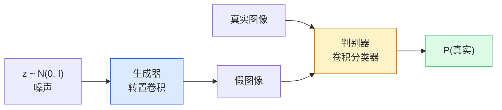
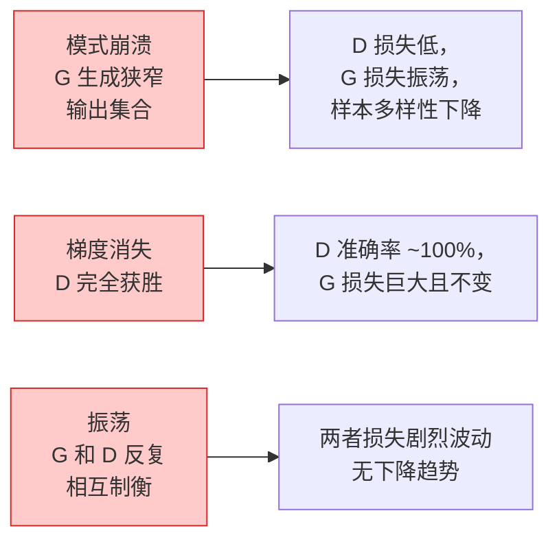

# 图像生成（Image Generation）——生成对抗网络（GANs）

> 生成对抗网络（Generative Adversarial Network, GAN）是两个神经网络固定的博弈（game）。一个绘图，一个批判。它们共同进步，直到生成的图片可以骗过批判者。

**类型：** 实践  
**语言：** Python  
**先决条件：** 第4阶段第3课（卷积神经网络CNNs）、第3阶段第6课（优化器）、第3阶段第7课（正则化）  
**时长：** 约75分钟

## 学习目标

- 解释生成器和判别器之间的极小-极大（minimax）博弈，以及为什么平衡点对应于 `p_model = p_data`（模型分布等于真实数据分布）  
- 在 PyTorch 中实现一个 DCGAN（深度卷积生成对抗网络），在不到60行代码中生成连贯的 32x32 合成图像  
- 使用三个标准技巧稳定GAN训练：非饱和损失（non-saturating loss）、谱归一化（spectral norm）、两时间尺度更新规则（TTUR）  
- 解读训练曲线，区分健康收敛、模式崩溃、振荡和判别器完全获胜的情况  

## 双语术语速查

| 中文术语 | English term |
|----------|--------------|
| 图像生成 | Image generation |
| 生成对抗网络 | Generative Adversarial Network, GAN |
| 生成器 | Generator |
| 判别器 | Discriminator |
| 噪声向量 | Noise vector |
| 真实分布 | Data distribution |
| 模型分布 | Model distribution |
| 极小极大博弈 | Minimax game |
| 非饱和损失 | Non-saturating loss |
| 深度卷积 GAN | Deep Convolutional GAN, DCGAN |
| 转置卷积 | Transposed convolution |
| 模式崩溃 | Mode collapse |
| 梯度消失 | Vanishing gradients |
| 振荡 | Oscillation |
| 谱归一化 | Spectral normalization |
| 双时间尺度更新规则 | Two-timescale update rule, TTUR |
| Fréchet Inception Distance (FID) | Fréchet Inception Distance, FID |


## 问题描述

分类任务教网络将图像映射为标签。生成任务则相反：采样出看起来来自相同分布的新图像。没有“正确”的输出可供比较，只有一个想要模拟的分布。

标准损失函数（MSE，交叉熵）无法判断“该样本是否来自真实分布”。最小化像素级误差产生模糊的平均图像，而非真实样本。突破点是学习损失：训练第二个网络负责区分真伪，并用其判断来驱动生成器。

GANs（Goodfellow 等，2014）就是定义了这样一个框架。到2018年StyleGAN能生成1024x1024分辨率的人脸，几乎无法分辨真伪。扩散模型虽然后续在质量和可控性上超越，但使扩散实用化的每个技巧——归一化选择、潜空间、特征损失——最初都在GAN上得到理解。

## 核心概念

### 关键公式（Key equations）

原始 GAN 目标是生成器 $G$ 与判别器 $D$ 之间的极小极大博弈：

$$
\min_G \max_D \; \mathbb{E}_{x \sim p_{\mathrm{data}}}[\log D(x)] + \mathbb{E}_{z \sim p_z}[\log(1 - D(G(z)))]
$$

实践中常用非饱和生成器损失来提供更强梯度：

$$
\mathcal{L}_G = -\mathbb{E}_{z \sim p_z}[\log D(G(z))]
$$

### 两个网络



**生成器**G 接收噪声向量 `z`，输出图像。**判别器**D 接收图像，输出一个标量：该图像是真实的概率。

### 博弈

G 想让 D 判断错误。D 想判断正确。形式化表达为：

```text
min_G max_D  E_x[log D(x)] + E_z[log(1 - D(G(z)))]
```

从右到左读，D 最大化对真实 `log D(real)` 和伪造 `log(1 - D(fake))` 图像的判别准确率。G 最小化 D 对伪造图像的判别准确率——它希望 `D(G(z))` 变高。

Goodfellow 证明该极小极大方程存在全球均衡点，此时 `p_G = p_data`，D 输出处处为 0.5，生成分布和真实分布的 Jensen-Shannon 散度为零。难点是达到该点。

### 非饱和损失

上述形式数值不稳定。训练初期，`D(G(z))` 对所有伪图均接近零，导致 `log(1 - D(G(z)))` 关于G的梯度消失。解决方案是翻转 G 的损失：

```text
L_D = -E_x[log D(x)] - E_z[log(1 - D(G(z)))]
L_G = -E_z[log D(G(z))]                          # 非饱和损失
```

此时当 `D(G(z))` 接近零，G 的损失很大且梯度有信息量。所有现代GAN均使用此变体训练。

### DCGAN 架构规则

Radford、Metz、Chintala（2015）总结多年失败实验，提炼出五条规则确保 GAN 训练稳定：

1. 用步幅卷积替代池化（两网均是）。
2. 在生成器和判别器中使用批归一化，除了生成器输出层和判别器输入层。
3. 深层架构去除全连接层。
4. 生成器每层用 ReLU，输出层用 tanh（输出范围 [-1,1]）。
5. 判别器每层用 LeakyReLU，负斜率为0.2。

所有现代基于卷积的GAN（StyleGAN, BigGAN, GigaGAN）仍从这些规则开始，逐步替换模块。

### 失败模式及其表现



- **模式崩溃**：G 找到一张能骗过 D 的图像，仅生成这张。解决：引入小批量判别、谱归一化或标签条件。
- **判别器获胜**：D 过快变强，G 梯度消失。解决：减小D容量，降低D学习率，或对真实标签做平滑处理。
- **振荡**：两网反复获胜，无均衡。解决：TTUR（D学习速率比G快2-4倍），或者切换到 Wasserstein 损失。

### 评估
GAN没有真实标签，怎样判断是否有效？

- **Sample inspection** — 每个 epoch 结束看64个样本。必做。
- **FID (Fréchet Inception Distance)** — 衡量真实和生成图像的Inception-v3特征分布距离，值越小越好。社区标准。
- **Inception Score** — 较旧且脆弱，推荐FID。
- **Precision/Recall for generative models** — 分别衡量质量（精度）和覆盖度（召回），比FID更具信息量。

小规模合成数据训练时，样本观察足够。

## 实践构建

### 第1步：生成器

一个小型 DCGAN 生成器，接收64维噪声，输出32x32图像。

```python
import torch
import torch.nn as nn

class Generator(nn.Module):
    def __init__(self, z_dim=64, img_channels=3, feat=64):
        super().__init__()
        self.net = nn.Sequential(
            nn.ConvTranspose2d(z_dim, feat * 4, kernel_size=4, stride=1, padding=0, bias=False),
            nn.BatchNorm2d(feat * 4),
            nn.ReLU(inplace=True),
            nn.ConvTranspose2d(feat * 4, feat * 2, kernel_size=4, stride=2, padding=1, bias=False),
            nn.BatchNorm2d(feat * 2),
            nn.ReLU(inplace=True),
            nn.ConvTranspose2d(feat * 2, feat, kernel_size=4, stride=2, padding=1, bias=False),
            nn.BatchNorm2d(feat),
            nn.ReLU(inplace=True),
            nn.ConvTranspose2d(feat, img_channels, kernel_size=4, stride=2, padding=1, bias=False),
            nn.Tanh(),
        )

    def forward(self, z):
        return self.net(z.view(z.size(0), -1, 1, 1))
```

四个转置卷积层，每层设置 `kernel_size=4, stride=2, padding=1`，空间尺寸倍增。输出激活通过 tanh 限制在 `[-1, 1]`。

### 第2步：判别器

生成器的镜像结构。LeakyReLU激活，步幅卷积，最后输出标量logit。

```python
class Discriminator(nn.Module):
    def __init__(self, img_channels=3, feat=64):
        super().__init__()
        self.net = nn.Sequential(
            nn.Conv2d(img_channels, feat, kernel_size=4, stride=2, padding=1),
            nn.LeakyReLU(0.2, inplace=True),
            nn.Conv2d(feat, feat * 2, kernel_size=4, stride=2, padding=1, bias=False),
            nn.BatchNorm2d(feat * 2),
            nn.LeakyReLU(0.2, inplace=True),
            nn.Conv2d(feat * 2, feat * 4, kernel_size=4, stride=2, padding=1, bias=False),
            nn.BatchNorm2d(feat * 4),
            nn.LeakyReLU(0.2, inplace=True),
            nn.Conv2d(feat * 4, 1, kernel_size=4, stride=1, padding=0),
        )

    def forward(self, x):
        return self.net(x).view(-1)
```

最后一层卷积将 `4x4` 特征图缩成 `1x1`，输出每张图一个标量；在计算损失时再接sigmoid。

### 第3步：训练步骤

交替更新：每批次更新判别器一次，生成器一次。

```python
import torch.nn.functional as F

def train_step(G, D, real, z, opt_g, opt_d, device):
    real = real.to(device)
    bs = real.size(0)

    # 判别器步骤
    opt_d.zero_grad()
    d_real = D(real)
    d_fake = D(G(z).detach())
    loss_d = (F.binary_cross_entropy_with_logits(d_real, torch.ones_like(d_real))
              + F.binary_cross_entropy_with_logits(d_fake, torch.zeros_like(d_fake)))
    loss_d.backward()
    opt_d.step()

    # 生成器步骤
    opt_g.zero_grad()
    d_fake = D(G(z))
    loss_g = F.binary_cross_entropy_with_logits(d_fake, torch.ones_like(d_fake))
    loss_g.backward()
    opt_g.step()

    return loss_d.item(), loss_g.item()
```

判别器步骤里 `G(z).detach()` 很关键：防止在更新 D 时梯度流入 G。忘掉这点是经典新手错误。

### 第4步：合成形状上的完整训练循环

```python
from torch.utils.data import DataLoader, TensorDataset
import numpy as np

def synthetic_images(num=2000, size=32, seed=0):
    rng = np.random.default_rng(seed)
    imgs = np.zeros((num, 3, size, size), dtype=np.float32) - 1.0
    for i in range(num):
        r = rng.uniform(6, 12)
        cx, cy = rng.uniform(r, size - r, size=2)
        yy, xx = np.meshgrid(np.arange(size), np.arange(size), indexing="ij")
        mask = (xx - cx) ** 2 + (yy - cy) ** 2 < r ** 2
        color = rng.uniform(-0.5, 1.0, size=3)
        for c in range(3):
            imgs[i, c][mask] = color[c]
    return torch.from_numpy(imgs)

device = "cuda" if torch.cuda.is_available() else "cpu"
data = synthetic_images()
loader = DataLoader(TensorDataset(data), batch_size=64, shuffle=True)

G = Generator(z_dim=64, img_channels=3, feat=32).to(device)
D = Discriminator(img_channels=3, feat=32).to(device)
opt_g = torch.optim.Adam(G.parameters(), lr=2e-4, betas=(0.5, 0.999))
opt_d = torch.optim.Adam(D.parameters(), lr=2e-4, betas=(0.5, 0.999))

for epoch in range(10):
    for (batch,) in loader:
        z = torch.randn(batch.size(0), 64, device=device)
        ld, lg = train_step(G, D, batch, z, opt_g, opt_d, device)
    print(f"epoch {epoch}  D {ld:.3f}  G {lg:.3f}")
```

`Adam(lr=2e-4, betas=(0.5, 0.999))` 是 DCGAN 默认，低 beta1 防止动量项过度稳定对抗训练。

### 第5步：采样

```python
@torch.no_grad()
def sample(G, n=16, z_dim=64, device="cpu"):
    G.eval()
    z = torch.randn(n, z_dim, device=device)
    imgs = G(z)
    imgs = (imgs + 1) / 2
    return imgs.clamp(0, 1)
```

采样前务必切换到 eval 模式。DCGAN中很重要，因为批归一化使用运行统计量，而非当前批次统计量。

### 第6步：谱归一化

Spectral Normalization 就是在每次训练时，把神经网络权重矩阵除以它的最大奇异值（Spectral Norm），从而限制网络的最大放大能力，使判别器满足近似 Lipschitz 条件，训练更加稳定。

```python
from torch.nn.utils import spectral_norm

def build_sn_discriminator(img_channels=3, feat=64):
    return nn.Sequential(
        spectral_norm(nn.Conv2d(img_channels, feat, 4, 2, 1)),
        nn.LeakyReLU(0.2, inplace=True),
        spectral_norm(nn.Conv2d(feat, feat * 2, 4, 2, 1)),
        nn.LeakyReLU(0.2, inplace=True),
        spectral_norm(nn.Conv2d(feat * 2, feat * 4, 4, 2, 1)),
        nn.LeakyReLU(0.2, inplace=True),
        spectral_norm(nn.Conv2d(feat * 4, 1, 4, 1, 0)),
    )
```

将 `Discriminator` 替换为 `build_sn_discriminator()`，通常就不需要 TTUR 技巧。Spectral norm（谱范数）是你能应用的最简单的增强鲁棒性的升级。

## 使用它

对于严肃的生成任务，使用预训练权重或切换到扩散（diffusion）模型。两个标准库：

- `torch_fidelity` 可以在不编写自定义评估代码的情况下计算生成器的 FID / IS。
- `pytorch-gan-zoo`（遗留）和 `StudioGAN` 提供经过测试的 DCGAN、WGAN-GP、SN-GAN、StyleGAN 和 BigGAN 实现。

到了 2026 年，GAN 仍然是实时图像生成（延迟 <10 毫秒）、风格迁移、具有精确控制的图像到图像转换（Pix2Pix、CycleGAN）的最佳选择。扩散模型则在逼真度和文本条件控制方面胜出。

## 发布它

本课产出：

- `outputs/prompt-gan-training-triage.md` — 读取训练曲线描述并选择故障模式（模式崩溃、判别器胜利、振荡）及单一推荐的修复方法的提示。
- `outputs/skill-dcgan-scaffold.md` — 一个技能，基于 `z_dim`、目标 `image_size` 和 `num_channels` 写出 DCGAN 脚手架，包括训练循环和样本保存器。

## 练习

1. **（简单）** 在合成圆形数据集上训练上述 DCGAN，并在每个 epoch 结束时保存 16 个样本的网格。生成的圆形在哪个 epoch 明显变得圆滑？
2. **（中等）** 将判别器的批归一化替换为谱范数。并行训练两个版本。哪个收敛更快？三个随机种子下哪个方差更小？
3. **（困难）** 实现条件 DCGAN：将类别标签输入 G 和 D（在 G 中将 one-hot 向量与噪声拼接，在 D 中拼接类别嵌入通道）。在第 7 课的合成“圆形 vs 方形”数据集上训练，并通过指定标签采样证明类别条件有效。

## 关键词

| 术语 | 常见说法 | 实际含义 |
|------|----------|---------|
| Generator（G）（生成器） | “绘图网络” | 将噪声映射为图像；训练以欺骗判别器 |
| Discriminator（D）（判别器） | “评判者” | 二分类器；训练来区分真实和生成图像 |
| Minimax（极小极大） | “对抗游戏” | G 以极小化，D 以极大化对抗损失；平衡点是 p_G = p_data |
| Non-saturating loss（非饱和损失） | “数值稳定版本” | G 的损失为 -log(D(G(z))) 而非 log(1 - D(G(z)))，避免训练早期梯度消失 |
| Mode collapse（模式崩溃） | “生成器只做一种” | G 只生成数据分布的一小部分；用 SN、mini-batch 判别或更大 batch 解决 |
| TTUR（双重学习率） | “两个学习率” | D 以比 G 快 2-4 倍速度学习，稳定训练 |
| Spectral norm（谱范数） | “1-Lipschitz 层” | 权重归一化，限制每层的 Lipschitz 常数；防止判别器过陡 |
| FID (Fréchet Inception Distance) | “Fréchet Inception Distance” | 真实和生成图集的 Inception-v3 特征分布间的距离；标准评价指标 |

## 延伸阅读

- [Generative Adversarial Networks（Goodfellow 等，2014）](https://arxiv.org/abs/1406.2661) — GAN 的开山之作
- [DCGAN（Radford、Metz、Chintala，2015）](https://arxiv.org/abs/1511.06434) — 让 GAN 可训练的架构规范
- [Spectral Normalization for GANs（Miyato 等，2018）](https://arxiv.org/abs/1802.05957) — 最有用的稳定技巧
- [StyleGAN3（Karras 等，2021）](https://arxiv.org/abs/2106.12423) — 现今最先进的 GAN；几乎集成了过去十年所有技巧的精选辑
