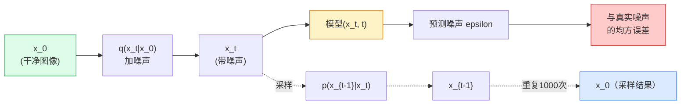

# 图像生成（Image Generation）——扩散模型（Diffusion Models）

> 扩散模型（diffusion models）学习去噪（denoising）。训练它从带噪图像中去除一小点噪声，反复执行上千次，你就得到了一个图像生成器。

**类型:** 构建  
**语言:** Python  
**先决条件:** 第4阶段第07课（U-Net），第1阶段第06课（概率），第3阶段第06课（优化器）  
**时间:** ~75分钟

## 学习目标

- 导出前向加噪过程 `x_0 -> x_1 -> ... -> x_T` 并解释为什么对任意 t 成立封闭形式 `q(x_t | x_0)`
- 实现类似DDPM的训练目标回归每一步添加的噪声，以及一个从纯噪声逆向生成图像的采样器
- 构建一个时间条件的U-Net（足够小以在CPU上训练），预测任意时刻的噪声
- 解释DDPM和DDIM采样的区别及各自适用场景（第23课深入讲解流匹配和修正流）

## 双语术语速查

| 中文术语 | English term |
|----------|--------------|
| 扩散模型 | Diffusion model |
| 去噪 | Denoising |
| 扩散概率模型 | Denoising Diffusion Probabilistic Model, DDPM |
| 前向过程 | Forward process |
| 反向过程 | Reverse process |
| 噪声调度 | Noise schedule |
| 方差调度 | Variance schedule |
| 闭式采样 | Closed-form sampling |
| U-Net 去噪器 | U-Net denoiser |
| 时间条件 | Time conditioning |
| 噪声预测 | Noise prediction |
| 均方误差 | Mean squared error, MSE |
| 采样器 | Sampler |
| DDIM | Denoising Diffusion Implicit Models |
| 重参数化 | Reparameterization |
| 潜变量 | Latent variable |


## 问题背景

GANs采用一次性生成：输入噪声，输出图像，一次前向传播。它们速度快但训练难。扩散模型采用迭代方式生成：从纯噪声开始，逐步去噪，图像逐渐显现。它们训练简单但采样较慢。过去五年，这后一点成为主流：任何小团队都能训练扩散模型获得合理样本；GAN训练则是一门需要大量失败经验才能掌握的技艺。

除了训练稳定性，扩散的迭代结构是现代图像生成技术实现的关键：文本条件、图像修补、编辑、超分辨率、可控风格。采样循环的每一步都是注入新约束的接口。这也是Stable Diffusion、Imagen、DALL-E 3、Midjourney以及所有可控图像模型均基于扩散的原因。

本节构建最简DDPM：正向加噪、反向去噪、训练循环。下一节（Stable Diffusion）将其与VAE、文本编码器和无分类器引导集成到生产系统中。

## 概念说明

### 关键公式（Key equations）

DDPM 的前向过程逐步加噪，并有一个可直接采样任意时刻 $t$ 的闭式形式：

$$
q(x_t \mid x_{t-1}) = \mathcal{N}\left(x_t; \sqrt{1-\beta_t}x_{t-1}, \beta_t I\right)
$$

$$
q(x_t \mid x_0) = \mathcal{N}\left(x_t; \sqrt{\bar\alpha_t}x_0, (1-\bar\alpha_t)I\right), \qquad \bar\alpha_t = \prod_{s=1}^{t}(1-\beta_s)
$$

损失函数是预测噪声和真实加入的噪声的的均方误差：

$$
\mathcal{L}_{\mathrm{simple}} = \mathbb{E}_{t,x_0,\epsilon}\left[\left\|\epsilon - \epsilon_\theta(x_t,t)\right\|_2^2\right]
$$

注意: 这里的加噪声和CV里面的高斯模糊不一样,这里是调整噪声水平的线性插值,而不是卷积核模糊.高斯模糊会导致图像变得模糊,而这里是添加噪声,保持图像结构不变.

### 前向过程

取图像 `x_0`。加入少量高斯噪声生成 `x_1`。继续加少量噪声得到 `x_2`。重复T步，直到 `x_T` 几乎是纯高斯噪声。


TODO 将式子改成数学表达式
$$
q(x_t \mid x_{t-1}) = \mathcal{N}\left(x_t; \sqrt{1-\beta_t}x_{t-1}, \beta_t I\right)
$$

`beta_t` 是小的方差调度，通常在T=1000步中线性从0.0001变到0.02。每步会稍微缩小信号并注入新噪声。

### 封闭形式跳跃

逐步加噪是马尔可夫链，但数学上可化简：可以一步采样 `x_t` 直接来自 `x_0`。

TODO 将式子改成数学表达式
$$
\alpha_t = 1 - \beta_t
$$
$$
\bar{\alpha}_t = \prod_{s=1}^{t} \alpha_s
$$

TODO 将式子改成数学表达式
$$
q(x_t \mid x_0) = \mathcal{N}\left(x_t; \sqrt{\bar\alpha_t}x_0, (1-\bar\alpha_t)I\right)
$$

等价于:
$$
x_t = \sqrt{\bar\alpha_t} x_0 + \sqrt{1 - \bar\alpha_t} \epsilon, \quad \epsilon \sim \mathcal{N}(0, I)
$$

此方程是扩散模型实用的根本原因。训练时随机选t，从 `x_0` 直接采样 `x_t`，一站式训练——无须模拟完整马尔可夫链。

### 反向过程

前向过程固定。神经网络需学会反向过程 `p(x_{t-1} | x_t)`。扩散模型不直接预测 `x_{t-1}`，而是预测该步骤加入的噪声 `epsilon`，再由数学推导得出 `x_{t-1}`。



### 训练损失

每个训练步骤：

1. 采样真实图像 `x_0`。  
2. 从区间 [1, T] 均匀采样时间步t。  
3. 采样噪声 `epsilon ~ N(0, I)`。  
4. 计算 `x_t = sqrt(alpha_bar_t) * x_0 + sqrt(1 - alpha_bar_t) * epsilon`。  
5. 由网络预测 `epsilon_theta(x_t, t)`。  
6. 最小化误差平方和 `|| epsilon - epsilon_theta(x_t, t) ||^2`。  

仅此而已。网络学习预测任意时刻的噪声。损失为均方误差。无对抗训练，无崩塌，无振荡。

### 采样器（DDPM）

生成时：从 `x_T ~ N(0, I)` 开始，逐步往回采样。

```text
for t = T, T-1, ..., 1:
    eps = model(x_t, t)
    x_{t-1} = (1 / sqrt(alpha_t)) * (x_t - (beta_t / sqrt(1 - alpha_bar_t)) * eps) + sqrt(beta_t) * z
    其中 z ~ N(0, I) 如果 t > 1，否则为 0
return x_0
```

关键在于虽然反向条件分布一般无封闭形式，但对这特定高斯过程有明确解。丑陋系数来自贝叶斯规则。

### 为什么选择1000步

前向噪声调度设计为每步添加足够噪声使逆向一步近似高斯。步骤太少，逆向步远非高斯，网络难以建模。步骤太多，采样成本高且收益递减。默认DDPM用T=1000线性调度。

### DDIM：采样快20倍

训练不变，采样改用DDIM（Song等，2020）定义确定性逆过程可跳过步骤且无需重训。用DDIM50步采样几乎等效1000步DDPM。每个生产系统用DDIM或更快变体（DPM-Solver，Euler ancestral）。

### 时间条件

网络 `epsilon_theta(x_t, t)` 需知当前时刻 t。现代扩散用正弦时间嵌入（和Transformer位置编码相同原理）注入t，叠加到U-Net每层特征图。

```text
t_embedding = sinusoidal(t)
feature_map += MLP(t_embedding)
```

无时间条件网络只能凭图像自行猜测噪声等级，效果可行但采样效率低。

## 构建流程

### 第1步：噪声调度

```python
import torch

def linear_beta_schedule(T=1000, beta_start=1e-4, beta_end=2e-2):
    return torch.linspace(beta_start, beta_end, T)


def precompute_schedule(betas):
    alphas = 1.0 - betas
    alphas_cumprod = torch.cumprod(alphas, dim=0)
    return {
        "betas": betas,
        "alphas": alphas,
        "alphas_cumprod": alphas_cumprod,
        "sqrt_alphas_cumprod": torch.sqrt(alphas_cumprod),
        "sqrt_one_minus_alphas_cumprod": torch.sqrt(1.0 - alphas_cumprod),
        "sqrt_recip_alphas": torch.sqrt(1.0 / alphas),
    }

schedule = precompute_schedule(linear_beta_schedule(T=1000))
```

预计算一次，训练和采样按索引调用。

### 第2步：前向扩散（`q_sample`）

```python
def q_sample(x0, t, noise, schedule):
    sqrt_a = schedule["sqrt_alphas_cumprod"][t].view(-1, 1, 1, 1)
    sqrt_one_minus_a = schedule["sqrt_one_minus_alphas_cumprod"][t].view(-1, 1, 1, 1)
    return sqrt_a * x0 + sqrt_one_minus_a * noise
```

一行封闭形式。`t`是每个批次图像对应的时间步张量。

### 第3步：小型时间条件U-Net

```python
import torch.nn as nn
import torch.nn.functional as F
import math

def timestep_embedding(t, dim=64):
    half = dim // 2
    freqs = torch.exp(-math.log(10000) * torch.arange(half, device=t.device) / half)
    args = t[:, None].float() * freqs[None]
    emb = torch.cat([args.sin(), args.cos()], dim=-1)
    return emb


class TinyUNet(nn.Module):
    def __init__(self, img_channels=3, base=32, t_dim=64):
        super().__init__()
        self.t_mlp = nn.Sequential(
            nn.Linear(t_dim, base * 4),
            nn.SiLU(),
            nn.Linear(base * 4, base * 4),
        )
        self.t_dim = t_dim
        self.enc1 = nn.Conv2d(img_channels, base, 3, padding=1)
        self.enc2 = nn.Conv2d(base, base * 2, 4, stride=2, padding=1)
        self.mid = nn.Conv2d(base * 2, base * 2, 3, padding=1)
        self.dec1 = nn.ConvTranspose2d(base * 2, base, 4, stride=2, padding=1)
        self.dec2 = nn.Conv2d(base * 2, img_channels, 3, padding=1)
        self.time_proj = nn.Linear(base * 4, base * 2)

    def forward(self, x, t):
        t_emb = timestep_embedding(t, self.t_dim)
        t_emb = self.t_mlp(t_emb)
        t_proj = self.time_proj(t_emb)[:, :, None, None]

        h1 = F.silu(self.enc1(x))
        h2 = F.silu(self.enc2(h1)) + t_proj
        h3 = F.silu(self.mid(h2))
        d1 = F.silu(self.dec1(h3))
        d2 = torch.cat([d1, h1], dim=1)
        return self.dec2(d2)
```

两层U-Net，且在瓶颈处注入时间条件。真实图像任务可扩展网络宽度和深度。

### 第4步：训练循环

```python
def train_step(model, x0, schedule, optimizer, device, T=1000):
    model.train()
    x0 = x0.to(device)
    bs = x0.size(0)
    t = torch.randint(0, T, (bs,), device=device)
    noise = torch.randn_like(x0)
    x_t = q_sample(x0, t, noise, schedule)
    pred = model(x_t, t)
    loss = F.mse_loss(pred, noise)
    optimizer.zero_grad()
    loss.backward()
    optimizer.step()
    return loss.item()
```

完整训练循环。无GAN对抗，无特殊损失，只有一次MSE计算。

### 第5步：采样器（DDPM）

```python
@torch.no_grad()
def sample(model, schedule, shape, T=1000, device="cpu"):
    model.eval()
    x = torch.randn(shape, device=device)
    betas = schedule["betas"].to(device)
    sqrt_one_minus_a = schedule["sqrt_one_minus_alphas_cumprod"].to(device)
    sqrt_recip_alphas = schedule["sqrt_recip_alphas"].to(device)

    for t in reversed(range(T)):
        t_batch = torch.full((shape[0],), t, dtype=torch.long, device=device)
        eps = model(x, t_batch)
        coef = betas[t] / sqrt_one_minus_a[t]
        mean = sqrt_recip_alphas[t] * (x - coef * eps)
        if t > 0:
            x = mean + torch.sqrt(betas[t]) * torch.randn_like(x)
        else:
            x = mean
    return x
```

1000次前向计算产生一批样本。实际代码中会用DDIM 50步采样代替。

### 第6步：DDIM采样器（确定性，约快20倍）

```python
@torch.no_grad()
def sample_ddim(model, schedule, shape, steps=50, T=1000, device="cpu", eta=0.0):
    model.eval()
    x = torch.randn(shape, device=device)
    alphas_cumprod = schedule["alphas_cumprod"].to(device)

    ts = torch.linspace(T - 1, 0, steps + 1).long()
    for i in range(steps):
        t = ts[i]
        t_prev = ts[i + 1]
        t_batch = torch.full((shape[0],), t, dtype=torch.long, device=device)
        eps = model(x, t_batch)
        a_t = alphas_cumprod[t]
        a_prev = alphas_cumprod[t_prev] if t_prev >= 0 else torch.tensor(1.0, device=device)
        x0_pred = (x - torch.sqrt(1 - a_t) * eps) / torch.sqrt(a_t)
        sigma = eta * torch.sqrt((1 - a_prev) / (1 - a_t) * (1 - a_t / a_prev))
        dir_xt = torch.sqrt(1 - a_prev - sigma ** 2) * eps
        noise = sigma * torch.randn_like(x) if eta > 0 else 0
        x = torch.sqrt(a_prev) * x0_pred + dir_xt + noise
    return x
```

`eta=0` 是完全确定性的（相同的噪声输入总是产生相同的输出）。`eta=1` 恢复为 DDPM。

## 使用方法

在生产环境中，使用 `diffusers`：

```python
from diffusers import DDPMScheduler, UNet2DModel

unet = UNet2DModel(sample_size=32, in_channels=3, out_channels=3, layers_per_block=2)
scheduler = DDPMScheduler(num_train_timesteps=1000)
```

该库提供现成的调度器（DDPM、DDIM、DPM-Solver、Euler、Heun）、可配置的 U-Net、文本到图像和图像到图像的流水线，以及 LoRA 微调助手。

在研究中，`k-diffusion`（Katherine Crowson）拥有最忠实的参考实现和最佳采样变体。

## 发布

本课将生成：

- `outputs/prompt-diffusion-sampler-picker.md` — 一个根据质量目标、延迟预算和条件类型选择 DDPM / DDIM / DPM-Solver / Euler 的提示。
- `outputs/skill-noise-schedule-designer.md` — 一个技能，给定 T 和目标污染水平产生线性、余弦或 sigmoid beta 进度表，附带信噪比随时间变化的诊断图。

## 练习

1. **（简单）** 可视化正向过程：取一张图像，绘制 `t in [0, 100, 250, 500, 750, 1000]` 时的 `x_t`。验证 `x_1000` 看起来像纯高斯噪声。
2. **（中等）** 在 synthetic-circles 数据集上训练 TinyUNet 20 个 epoch 并采样 16 个圆。比较 DDPM（1000 步）和 DDIM（50 步）的采样效果——它们能否从相同噪声种子生成相似图像？
3. **（困难）** 实现余弦噪声进度表（Nichol & Dhariwal, 2021）：`alpha_bar_t = cos^2((t/T + s) / (1 + s) * pi / 2)`。用线性和余弦进度表训练相同模型，展示余弦在低步数时能产生更好样本。

## 关键词

| 术语         | 大家如何说                          | 实际含义                         |
|------------|--------------------------------|------------------------------|
| Forward process（正向过程）  | “随着时间增加噪声”                   | 一个固定的马尔可夫链，将图像逐步破坏成高斯噪声，步数为 T   |
| Reverse process（反向过程）  | “逐步去噪”                        | 学习到的分布，从噪声逐步恢复回图像          |
| Epsilon prediction（噪声预测） | “预测噪声”                        | 训练目标：`epsilon_theta(x_t, t)` 预测第 t 步加入的噪声   |
| Beta schedule（Beta 进度表）  | “噪声量”                         | 定义每一步加入多少噪声的 T 个小方差序列       |
| alpha_bar_t（累积保留因子） | “累计保留比率”                     | 时间 t 时 `(1 - beta_s)` 的乘积； t 越大，剩余信号越少  |
| DDPM sampler（DDPM 采样器）  | “祖先采样，随机的”                   | 每步根据条件高斯分布采样 `x_{t-1}`；共1000步      |
| DDIM sampler（DDIM 采样器）  | “确定性，快速”                     | 将采样改写为确定性常微分方程；20-100步，质量相似    |
| Time conditioning（时间条件） | “告诉模型当前是哪个 t”                | 将 t 的正弦嵌入注入 U-Net，使其知道当前噪声水平       |

## 进一步阅读

- [Denoising Diffusion Probabilistic Models (Ho et al., 2020)](https://arxiv.org/abs/2006.11239) — 使扩散模型实用化并在 FID 上击败 GAN 的论文
- [Improved DDPM (Nichol & Dhariwal, 2021)](https://arxiv.org/abs/2102.09672) — 余弦进度表与 v 参数化
- [DDIM (Song, Meng, Ermon, 2020)](https://arxiv.org/abs/2010.02502) — 使实时推理成为可能的确定性采样器
- [Elucidating the Design Space of Diffusion (Karras et al., 2022)](https://arxiv.org/abs/2206.00364) — 汇集所有扩散设计选择的统一视角；现最佳参考
