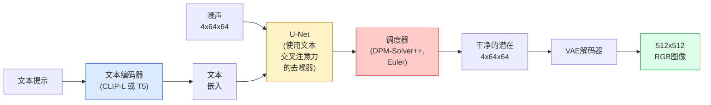

# Stable Diffusion（稳定扩散）——架构与微调（Architecture and Fine-Tuning）

> Stable Diffusion（稳定扩散）是一个在预训练 VAE 的潜空间（latent space）中运行的扩散概率模型（DDPM），通过交叉注意力（cross-attention）根据文本条件生成，使用快速确定性 ODE 求解器采样，并通过无分类器引导（classifier-free guidance）进行控制。

**类型:** 学习 + 应用  
**语言:** Python  
**先决条件:** 第4阶段第10课（扩散）、第7阶段第2课（自注意力）  
**时间:** 约75分钟

## 学习目标

- 理解 Stable Diffusion 流水线的五个组成部分：VAE、文本编码器、U-Net、调度器、安全检查器 — 以及它们各自的实际功能  
- 解释潜在扩散（latent diffusion）及为何在4x64x64的潜在空间中训练（而非3x512x512的图像空间）能在不损失质量的情况下减少48倍运算  
- 使用 `diffusers` 进行图像生成、图像到图像（img2img）、修复（inpainting）和 ControlNet 引导生成  
- 使用 LoRA 对 Stable Diffusion 进行微调，处理小型自定义数据集，并在推理时加载 LoRA 适配器

## 双语术语速查

| 中文术语 | English term |
|----------|--------------|
| Stable Diffusion | Stable Diffusion |
| 稳定扩散 | Stable Diffusion |
| 潜在扩散 | Latent diffusion |
| 变分自编码器 | Variational Autoencoder, VAE |
| 潜空间 | Latent space |
| 文本编码器 | Text encoder |
| 交叉注意力 | Cross-attention |
| 调度器 | Scheduler |
| 安全检查器 | Safety checker |
| ODE 求解器 | ODE solver |
| 无分类器引导 | Classifier-free guidance, CFG |
| 提示词 | Prompt |
| 图像修补 | Inpainting |
| 图生图 | Image-to-image, img2img |
| ControlNet | ControlNet |
| 低秩适配 | Low-Rank Adaptation, LoRA |


## 问题背景

直接在512x512 RGB图像上训练 DDPM 非常昂贵。每个训练步骤都需要通过一个输入为3x512x512=786,432个数值的 U-Net 进行反向传播，采样时则需连续进行50次以上的前向传播。在 Stable Diffusion 1.5 质量水平（2022年发布）下，像素空间扩散大约需要256 GPU 月的训练时间，以及消费者级 GPU 上每张图像10-30秒的采样时间。

使得开源文本到图像生成实用的关键是 **潜在扩散**（latent diffusion，Rombach 等，CVPR 2022）。先训练一个 VAE，将3x512x512图像编码成4x64x64的潜在张量并解码回图像，然后在这个潜在空间中进行扩散。计算量下降了 `(3*512*512)/(4*64*64) = 48倍`。采样时间则从数十秒降到在同一 GPU 下不足两秒。

几乎所有现代图像生成模型——SDXL、SD3、FLUX、混元迪特（HunyuanDiT）、玩视频（Wan-Video）——都是潜在扩散模型，只是在自动编码器、去噪器（U-Net 或 DiT）和文本条件方面有所变化。学习 Stable Diffusion 即是学习这一模板。

## 概念讲解

### 关键公式（Key equations）

潜在扩散先用编码器把图像压缩为潜变量，再在潜空间中做去噪：

$$
z = E(x), \qquad \hat{x} = D(z)
$$

无分类器引导（classifier-free guidance）用条件与无条件噪声预测的差值放大文本控制：

$$
\hat\epsilon_\theta(x_t, c) = \epsilon_\theta(x_t, \varnothing) + s\left(\epsilon_\theta(x_t, c) - \epsilon_\theta(x_t, \varnothing)\right)
$$

### 流水线



- **VAE** — 冻结的自动编码器。编码器将图像转为潜在向量（用于图像到图像和训练），解码器将潜在向量还原为图像。  
- **文本编码器** — CLIP文本编码器（SD 1.x/2.x）、CLIP-L + CLIP-G（SDXL）、或 T5-XXL（SD3/FLUX）。输出一串令牌嵌入。  
- **U-Net** — 去噪器。包含交叉注意力层，在每个分辨率层级中，从潜在向量关注文本嵌入。  
- **调度器** — 采样算法（DDIM，Euler，DPM-Solver++）。选择sigmas，将预测噪声混入潜在。  
- **安全检查器** — 可选的非安全内容（NSFW）/非法内容过滤器。

### 无分类器引导（Classifier-free guidance, CFG）

普通文本条件学习的是 `epsilon_theta(x_t, t, c)`，对每个提示 `c`。CFG通过让条件向量 `c` 10% 概率置为空向量（丢弃条件），训练相同网络得到一个能同时预测有条件和无条件噪声的模型。推理时：

```text
eps = eps_uncond + w * (eps_cond - eps_uncond)
```

其中 `w` 是引导尺度。`w=0` 表示无条件，`w=1` 是普通条件，`w>1` 表示输出更“受提示条件约束”，但多样性降低。SD默认 `w=7.5`。

CFG 是文本到图像能达到生产级质量的关键。没有它，提示对输出的影响很弱；使用它，提示主导生成结果。

### 潜在空间几何

VAE的4通道潜向量不是简单的压缩图像，而是一个流形，算术操作大体对应语义编辑（提示工程和插值均在此空间完成），而 U-Net 的扩散模型只在这个流形上受训。随机解码一个4x64x64潜向量不会生成随机图像，而是产生垃圾，因为只有流形的特定子集能解码成有效图像。

两个后果：

1. **图像到图像（img2img）** = 将图像编码成潜向量，添加部分噪声，运行去噪器，解码。图像结构保留下来，内容视提示而变。  
2. **修复（inpainting）** = 类似 img2img，但去噪器仅更新掩码区域；非掩码区保持编码潜向量。

### U-Net 架构

SD U-Net 是第10课 TinyUNet 的大型版本，并包括三项新增：

- 每个空间分辨率都加了 Transformer 块，包含自注意力和对文本嵌入的交叉注意力。  
- 通过 MLP 和正弦编码产生时间嵌入。  
- 在相同分辨率的编码器与解码器间使用跳跃连接。

SD 1.5 总参数约 8.6 亿，SDXL 约 26 亿，FLUX 约120亿。参数增加多来源于注意力层。

### LoRA 微调

完整微调 Stable Diffusion 需超过20GB显存，更新8.6亿参数。LoRA（低秩适配）冻结基础模型，在注意力层注入小型低秩分解矩阵。SD的LoRA适配器一般为10-50MB，单张消费者级GPU上10-60分钟训练完成，推理时作为即插即用的修改加载。

```text
原始权重: W_q : (d_in, d_out)   冻结
LoRA:     W_q + alpha * (A @ B)   其中 A : (d_in, r), B : (r, d_out)

r 通常为4-32。
```

几乎所有社区微调都是以LoRA形式分发。CivitAI和Hugging Face托管数百万模型。

### 常见调度器

- **DDIM** — 确定性，约50步，简单。  
- **Euler祖先采样（Euler ancestral）** — 随机采样，30-50步，增加创造性。  
- **DPM-Solver++ 2M Karras** — 确定性，20-30步，生产默认方案。  
- **LCM / TCD / Turbo** — 一致性模型与蒸馏变体；仅1-4步，品质稍差。

在 `diffusers` 中更换调度器只需一行代码，且有时无需重训即可改善样本质量。

## 实践操作

本课使用 `diffusers` 完成端到端操作，不从零复现 Stable Diffusion。构建所需组件（VAE、文本编码器、U-Net、调度器）在其他课程中详细讲解，此处目标是掌握生产级 API。

### 第1步：文本到图像

```python
import torch
from diffusers import StableDiffusionPipeline

pipe = StableDiffusionPipeline.from_pretrained(
    "runwayml/stable-diffusion-v1-5",
    torch_dtype=torch.float16,
).to("cuda")

image = pipe(
    prompt="a dog riding a skateboard in tokyo, studio ghibli style",
    guidance_scale=7.5,
    num_inference_steps=25,
    generator=torch.Generator("cuda").manual_seed(42),
).images[0]
image.save("dog.png")
```

`float16`将显存减半且无明显质量损失。`num_inference_steps=25` 配合默认DPM-Solver++，等效于 DDIM 的 50步。

### 第2步：更换调度器

```python
from diffusers import DPMSolverMultistepScheduler, EulerAncestralDiscreteScheduler

pipe.scheduler = DPMSolverMultistepScheduler.from_config(pipe.scheduler.config)
pipe.scheduler = EulerAncestralDiscreteScheduler.from_config(pipe.scheduler.config)
```

调度器状态与 U-Net 权重分离。可在 DDPM 训练后用任何调度器采样。

### 第3步：图像到图像

```python
from diffusers import StableDiffusionImg2ImgPipeline
from PIL import Image

img2img = StableDiffusionImg2ImgPipeline.from_pretrained(
    "runwayml/stable-diffusion-v1-5",
    torch_dtype=torch.float16,
).to("cuda")

init_image = Image.open("dog.png").convert("RGB").resize((512, 512))
out = img2img(
    prompt="a dog riding a skateboard, oil painting",
    image=init_image,
    strength=0.6,
    guidance_scale=7.5,
).images[0]
```

`strength` 控制添加噪声多少后去噪（0.0 = 完全不变，1.0 = 完全重新生成）。通常用0.5-0.7做风格迁移。

### 第4步：修复（Inpainting）

```python
from diffusers import StableDiffusionInpaintPipeline

inpaint = StableDiffusionInpaintPipeline.from_pretrained(
    "runwayml/stable-diffusion-inpainting",
    torch_dtype=torch.float16,
).to("cuda")

image = Image.open("dog.png").convert("RGB").resize((512, 512))
mask = Image.open("dog_mask.png").convert("L").resize((512, 512))

out = inpaint(
    prompt="a cat",
    image=image,
    mask_image=mask,
    guidance_scale=7.5,
).images[0]
```

掩码图中白色像素区域表示需要重新生成；黑色像素区域保持不变。

### 第5步：加载 LoRA

```python
pipe.load_lora_weights("sayakpaul/sd-lora-ghibli")
pipe.fuse_lora(lora_scale=0.8)

image = pipe(prompt="a village square in ghibli style").images[0]
```

`lora_scale` 控制效果强度；0.0表示无效应，1.0为完全效果。`fuse_lora` 会将适配器权重合并入模型权重，提高推理速度，但禁止切换适配器。加载其他适配器前调用 `pipe.unfuse_lora()`。

### 第6步：LoRA训练（示范）

实际 LoRA 训练在 `peft` 或 `diffusers.training` 中实现。步骤示意：

```python
# 伪代码
for step, batch in enumerate(dataloader):
    images, prompts = batch
    latents = vae.encode(images).latent_dist.sample() * 0.18215

    t = torch.randint(0, num_train_timesteps, (batch_size,))
    noise = torch.randn_like(latents)
    noisy_latents = scheduler.add_noise(latents, noise, t)

    text_emb = text_encoder(tokenizer(prompts))

    pred_noise = unet(noisy_latents, t, text_emb)  # 此处注入 LoRA 权重

    loss = F.mse_loss(pred_noise, noise)
    loss.backward()
    optimizer.step()
```

只有 LoRA 矩阵接收梯度，基础 U-Net、VAE 和文本编码器被冻结。单批量大小为1，启用梯度检查点，可在8GB显存内训练。

## 应用建议

实际生产中，您要做的决策包括：

- **模型家族**：SD 1.5 用于开源社区微调，SDXL 提供更高保真度，SD3 / FLUX 代表最先进技术和严格许可要求。  
- **调度器**：生产默认 DPM-Solver++ 2M Karras，20-30步；延迟要求低于1秒时用 LCM-LoRA。  
- **精度选择**：4080/4090上用`float16`，A100及更新用`bfloat16`，显存紧张时用`int8`（通过`bitsandbytes`或`compel`）。  
- **条件方式**：纯文本条件可用；需更强控制时在基础流水线基础上加入 ControlNet（canny 边缘检测、深度、姿态等）。

批量生成社区主流工具为 `AUTO1111` / `ComfyUI`，生产级 API 用 `diffusers` + `accelerate` 或 `optimum-nvidia` 配合 TensorRT 编译。

## 输出内容

本课产出：

- `outputs/prompt-sd-pipeline-planner.md` — 一个基于延迟预算、目标质量和授权约束来选择 SD 1.5 / SDXL / SD3 / FLUX 及调度器和精度的提示脚本。  
- `outputs/skill-lora-training-setup.md` — 一个技能脚本，生成完整的 LoRA 训练配置，支持自定义数据集及标题、秩、批量大小和学习率配置。

## 练习

1. **（简单）** 使用 `guidance_scale` 在 `[1, 3, 5, 7.5, 10, 15]` 中生成相同的提示词。描述图像如何变化。在哪个 guidance（引导）值时出现了伪影？
2. **（中等）** 选择任意真实照片，使用 `StableDiffusionImg2ImgPipeline` 并将 `strength` 设置为 `[0.2, 0.4, 0.6, 0.8, 1.0]`。哪个 strength（强度）能够保持构图同时改变风格？为什么 1.0 会完全忽略输入？
3. **（困难）** 在一组 10-20 张单一主题（宠物、标志、角色）的图像上训练一个 LoRA，并生成包含该主题的新场景。报告产生最佳身份保持且未过拟合输入图像的 LoRA 低秩（rank）和训练步骤。

## 关键词

| 术语 | 通俗说法 | 实际含义 |
|------|----------|----------|
| Latent diffusion（潜在扩散） | “在潜变量中扩散” | 在 VAE（变分自编码器）潜在空间（4x64x64）而非像素空间（3x512x512）运行整个 DDPM；节省 48 倍计算量 |
| VAE scale factor（VAE 规模因子） | “0.18215” | 重新缩放 VAE 原始潜变量至近似单位方差的常数；每个 SD 管线中硬编码 |
| Classifier-free guidance（无分类器引导） | “CFG” | 混合条件和无条件的噪声预测；单一最重要的推理调节参数 |
| Scheduler（调度器） | “采样器” | 将噪声加模型预测转换为去噪潜变量轨迹的算法 |
| LoRA（低秩适配器） | “Low-rank adapter” | 在不修改基础权重的情况下微调注意力层的小型低秩分解矩阵 |
| Cross-attention（交叉注意力） | “文本-图像注意力” | 潜在令牌对文本令牌的注意力；在每个 U-Net 层级注入提示词信息 |
| ControlNet（控制网络） | “结构条件” | 一个单独训练的适配器，利用额外输入（canny 边缘、深度、姿势、分割）引导 SD |
| DPM-Solver++（DPM 求解器++） | “默认调度器” | 二阶确定性常微分方程求解器；在低步数（20-30）时提供最佳质量，2026 年起使用 |

## 延伸阅读

- [High-Resolution Image Synthesis with Latent Diffusion (Rombach et al., 2022)](https://arxiv.org/abs/2112.10752) — Stable Diffusion 论文；包含所有消融实验以证明设计合理性
- [Classifier-Free Diffusion Guidance (Ho & Salimans, 2022)](https://arxiv.org/abs/2207.12598) — 无分类器引导（CFG）论文
- [LoRA: Low-Rank Adaptation of Large Language Models (Hu et al., 2021)](https://arxiv.org/abs/2106.09685) — LoRA 最初用于自然语言处理，后几乎无改动地转用于 Stable Diffusion
- [diffusers documentation](https://huggingface.co/docs/diffusers) — 每个 SD / SDXL / SD3 / FLUX 管线的参考文档
