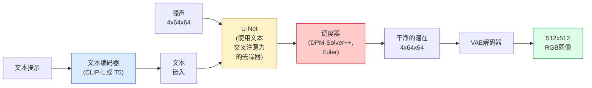

# Stable Diffusion（稳定扩散）：架构与微调

> Stable Diffusion 是一种潜在扩散模型：它不直接在像素上去噪，而是在预训练 VAE 的潜空间中运行 DDPM；它用交叉注意力接收文本条件，用调度器完成采样，并用无分类器引导（CFG）增强提示词控制。

**类型:** 学习 + 应用
**语言:** Python
**先决条件:** 第4阶段第10课（扩散）、第7阶段第2课（自注意力）
**时间:** 约75分钟

## 学习目标

- 理解 Stable Diffusion 流水线的五个组成部分：VAE、文本编码器、U-Net、调度器和安全检查器，以及它们各自负责什么
- 解释潜在扩散（latent diffusion）：为什么把图像压到 4x64x64 的潜空间，而不是直接在 3x512x512 的像素空间训练，可以把计算量降低约 48 倍
- 使用 `diffusers` 进行图像生成、图像到图像（img2img）、修复（inpainting）和 ControlNet 引导生成
- 使用 LoRA 在小型自定义数据集上微调 Stable Diffusion，并在推理时加载 LoRA 适配器

## 双语术语速查

| 中文术语 | English term |
|----------|--------------|
| Stable Diffusion | Stable Diffusion |
| 稳定扩散 | Stable Diffusion |
| 潜在扩散 | Latent diffusion |
| 变分自编码器 | Variational Autoencoder, VAE |
| 潜空间 | Latent space |
| 文本编码器 | Text encoder |
| 交叉注意力 | Cross-attention |
| 调度器 | Scheduler |
| 安全检查器 | Safety checker |
| ODE 求解器 | ODE solver |
| 无分类器引导 | Classifier-free guidance, CFG |
| 提示词 | Prompt |
| 图像修补 | Inpainting |
| 图生图 | Image-to-image, img2img |
| ControlNet | ControlNet |
| 低秩适配 | Low-Rank Adaptation, LoRA |


## 问题背景

直接在 512x512 的 RGB 图像上训练 DDPM 成本很高。每一步训练都要让 U-Net 处理 `3*512*512 = 786,432` 个输入值，并完成一次反向传播；采样时还要连续前向传播 50 次以上。以 Stable Diffusion 1.5（2022 年发布）的质量水平为参考，像素空间扩散大约需要 256 个 GPU 月训练，消费者级 GPU 上生成一张图也要 10 到 30 秒。

让开源文本生成图像真正实用起来的关键，是 **潜在扩散**（latent diffusion，Rombach 等，CVPR 2022）。做法是先训练一个 VAE，把 3x512x512 的图像编码成 4x64x64 的潜在张量，并能从这个潜在张量解码回图像。扩散模型随后只在这个更小的潜空间中工作。计算量约下降 `(3*512*512)/(4*64*64) = 48` 倍；在同一块 GPU 上，采样时间也可以从几十秒降到两秒以内。

今天的大多数图像生成模型，例如 SDXL、SD3、FLUX、混元 DiT（HunyuanDiT）和 Wan-Video，仍然沿用这个模板：先把图像压到潜空间，再在潜空间中去噪。不同模型主要变化在三个位置：自动编码器、去噪器（U-Net 或 DiT）和文本条件方式。因此，学懂 Stable Diffusion，也就是学懂现代生成图像系统的基本骨架。

## 概念讲解

### 关键公式（Key equations）

潜在扩散先用编码器把图像压缩成潜变量，再在潜空间中完成去噪。最后，解码器把干净的潜变量还原为图像：

$$
z = E(x), \qquad \hat{x} = D(z)
$$

无分类器引导（classifier-free guidance, CFG）比较“看提示词”和“不看提示词”时的噪声预测差异，并把这个差异放大：

$$
\hat\epsilon_\theta(x_t, c) = \epsilon_\theta(x_t, \varnothing) + s\left(\epsilon_\theta(x_t, c) - \epsilon_\theta(x_t, \varnothing)\right)
$$

### 流水线（Pipeline）



- **VAE**：冻结的自动编码器。编码器把图像变成潜变量，常用于 img2img 和训练；解码器把潜变量还原成图像。
- **文本编码器**：把提示词变成一串 token embedding。SD 1.x/2.x 常用 CLIP 文本编码器，SDXL 使用 CLIP-L + CLIP-G，SD3/FLUX 常见 T5-XXL。
- **U-Net**：真正的去噪器。它在不同分辨率层级中使用交叉注意力，让潜变量“看见”文本嵌入。
- **调度器**：采样算法，例如 DDIM、Euler、DPM-Solver++。它决定每一步如何根据预测噪声更新潜变量。
- **安全检查器**：可选的输出过滤器，用于拦截 NSFW 或非法内容。

### 无分类器引导（Classifier-free guidance, CFG）

先看最普通的文本条件训练。模型学习的是：给定当前带噪潜变量和提示词，应该预测出什么噪声。

$$
\epsilon_\theta(x_t, t, c)
$$

其中，$x_t$ 是当前带噪潜变量，$t$ 是时间步，$c$ 是提示词的文本嵌入。只这样训练时，模型确实会参考提示词，但提示词对最终图像的约束通常偏弱。

CFG 的核心做法，是在训练时随机“拿走”一部分提示词。例如，约 10% 的训练样本会把 $c$ 替换为空文本嵌入 $\varnothing$。这样，同一个 U-Net 会同时学会两种预测：

- **有条件预测** $\epsilon_\theta(x_t, t, c)$：按照提示词生成时，当前噪声应该是什么。
- **无条件预测** $\epsilon_\theta(x_t, t, \varnothing)$：完全不看提示词时，当前噪声应该是什么。

推理时，对同一个 $x_t$，模型会跑两次：一次带提示词，一次不带提示词。两次结果的差值可以看作“提示词带来的方向”。CFG 做的事，就是把这个方向放大：

$$
\hat\epsilon_\theta(x_t, c) = \epsilon_\theta(x_t, \varnothing) + w\left(\epsilon_\theta(x_t, c) - \epsilon_\theta(x_t, \varnothing)\right)
$$

可以把括号里的部分理解为：

$$
\epsilon_\theta(x_t, c) - \epsilon_\theta(x_t, \varnothing)
$$

这项差值回答了一个问题：“提示词让模型的预测相对无提示时改变了多少？” $w$ 就是这股改变的放大倍数，在 `diffusers` 里叫 `guidance_scale`。

- $w=0$：无条件生成，基本不听提示词。
- $w=1$：普通文本条件生成，不额外放大提示词影响。
- $w>1$：更强地朝提示词方向推进。图像通常更贴合提示词，但多样性会下降；数值过高时，还容易出现过饱和、形体变形或重复纹理。

Stable Diffusion 常用默认值是 $w=7.5$。经验上，$5$ 到 $9$ 通常比较稳；更高的值适合强行强调提示词，但要检查画面是否开始失真。

CFG 是文本到图像能够达到生产级质量的关键机制。没有 CFG，提示词只是轻微影响采样方向；有了 CFG，提示词会成为生成结果的主导约束。

### 潜空间几何（Latent space geometry）

VAE 的 4 通道潜变量不只是“压缩后的图像”。更准确地说，它位于一个潜在流形上：在这个空间里，向量运算常常对应某种语义变化，提示词编辑和插值也都发生在这里。U-Net 的训练预算主要用来学习如何在这个流形附近去噪。

这也解释了一个反直觉现象：随便采样一个 4x64x64 的潜变量并解码，并不会得到一张随机但合理的图片，通常只会得到无意义结果。原因是只有潜空间中的一部分区域能被 VAE 解码成有效图像。

这带来两个直接后果：

1. **图像到图像（img2img）**：先把输入图像编码成潜变量，加入一部分噪声，再运行去噪器并解码。因为编码近似可逆，原图结构会保留下来；内容和风格则会受提示词影响。
2. **修复（inpainting）**：流程类似 img2img，但只更新掩码区域；非掩码区域继续使用原图编码得到的潜变量。

### U-Net 架构

SD 的 U-Net 可以看作第 10 课 TinyUNet 的大型版本，但多了三类关键组件：

- 每个空间分辨率都加入 Transformer 块，内部包含自注意力，以及面向文本嵌入的交叉注意力。
- 通过 MLP 和正弦编码产生时间嵌入。
- 在相同分辨率的编码器与解码器间使用跳跃连接。

SD 1.5 约有 8.6 亿参数，SDXL 约 26 亿，FLUX 约 120 亿。参数量的增长主要来自注意力层和更大的文本条件模块。

### LoRA 微调

完整微调 Stable Diffusion 很贵：通常需要超过 20 GB 显存，还要更新 8.6 亿级别的参数。LoRA（低秩适配）的目标是只学习“需要改动的那一小部分”，而不是重训整个模型。

做法很简单：基础模型的权重保持冻结，训练时只额外学习两个很小的矩阵。推理时，把这两个小矩阵产生的增量加回原权重，就得到带有新风格、新角色或新概念的模型。

以注意力层里的查询投影矩阵 $W_q$ 为例。原始权重不更新：

$$
W_q \in \mathbb{R}^{d_{\text{in}} \times d_{\text{out}}}
\qquad \text{冻结}
$$

LoRA 不直接训练一个完整的新矩阵，而是训练一个低秩增量：

$$
W_q' = W_q + \alpha AB
$$

这里 $W_q'$ 是加载 LoRA 后实际使用的等效权重。低秩增量由两个小矩阵相乘得到：

$$
A \in \mathbb{R}^{d_{\text{in}} \times r},
\qquad
B \in \mathbb{R}^{r \times d_{\text{out}}},
\qquad
r \in [4, 32]
$$

关键是 $r$ 很小，通常只有 4 到 32。原来要训练 $d_{\text{in}} \times d_{\text{out}}$ 个参数；现在只训练 $d_{\text{in}} \times r + r \times d_{\text{out}}$ 个参数。当 $r$ 远小于 $d_{\text{in}}$ 和 $d_{\text{out}}$ 时，训练量会小很多。

可以把 LoRA 理解成一个“可插拔补丁”：

- 基础模型提供通用绘图能力。
- LoRA 只记录某个风格、角色或主题需要偏移多少。
- $\alpha$ 控制补丁强度；值越大，LoRA 对结果的影响越明显。

因此，一个 SD LoRA 适配器通常只有 10 到 50 MB，在单张消费者级 GPU 上训练 10 到 60 分钟即可完成，推理时也能像插件一样加载。社区里的大多数微调模型都以 LoRA 形式分发，CivitAI 和 Hugging Face 上托管了大量这类适配器。

### 常见调度器（Schedulers）

- **DDIM**：确定性采样，通常约 50 步，概念简单。
- **Euler ancestral 采样**：随机采样，通常 30 到 50 步，结果更有变化。
- **DPM-Solver++ 2M Karras**：确定性采样，通常 20 到 30 步，是常见生产默认选择。
- **LCM / TCD / Turbo**：一致性模型和蒸馏变体，只需 1 到 4 步，但质量通常会有所下降。

在 `diffusers` 中，更换调度器通常只需要一行代码。有时即使不重新训练模型，只换采样算法也能改善生成质量。

## 实践操作

本课使用 `diffusers` 完成端到端操作，不从零复现 Stable Diffusion。VAE、文本编码器、U-Net 和调度器的内部实现会在其他课程中拆开讲；这里的目标是掌握生产级 API 的使用方式。

### 第1步：文本到图像

```python
import torch
from diffusers import StableDiffusionPipeline

pipe = StableDiffusionPipeline.from_pretrained(
    "runwayml/stable-diffusion-v1-5",
    torch_dtype=torch.float16,
).to("cuda")

image = pipe(
    prompt="a dog riding a skateboard in tokyo, studio ghibli style",
    guidance_scale=7.5,
    num_inference_steps=25,
    generator=torch.Generator("cuda").manual_seed(42),
).images[0]
image.save("dog.png")
```

`float16` 可以把显存占用减半，通常不会带来明显画质损失。`num_inference_steps=25` 配合默认的 DPM-Solver++，实际效果接近 DDIM 的 50 步。

### 第2步：更换调度器

```python
from diffusers import DPMSolverMultistepScheduler, EulerAncestralDiscreteScheduler

pipe.scheduler = DPMSolverMultistepScheduler.from_config(pipe.scheduler.config)
pipe.scheduler = EulerAncestralDiscreteScheduler.from_config(pipe.scheduler.config)
```

调度器状态和 U-Net 权重是分离的。也就是说，同一个去噪模型可以搭配不同调度器采样；训练时用 DDPM，并不意味着推理时也必须用 DDPM。市面上还有Euler、LMS、PNDM、DPM++、DPM2MSampler 等多种调度器，`diffusers` 都提供了接口。

### 第3步：图像到图像

```python
from diffusers import StableDiffusionImg2ImgPipeline
from PIL import Image

img2img = StableDiffusionImg2ImgPipeline.from_pretrained(
    "runwayml/stable-diffusion-v1-5",
    torch_dtype=torch.float16,
).to("cuda")

init_image = Image.open("dog.png").convert("RGB").resize((512, 512))
out = img2img(
    prompt="a dog riding a skateboard, oil painting",
    image=init_image,
    strength=0.6,
    guidance_scale=7.5,
).images[0]
```

`strength` 控制先给输入图像加多少噪声，再开始去噪。`0.0` 表示几乎不改输入图，`1.0` 表示接近完全重新生成。做风格迁移时，`0.5` 到 `0.7` 通常是比较稳的范围。

### 第4步：修复（Inpainting）

```python
from diffusers import StableDiffusionInpaintPipeline

inpaint = StableDiffusionInpaintPipeline.from_pretrained(
    "runwayml/stable-diffusion-inpainting",
    torch_dtype=torch.float16,
).to("cuda")

image = Image.open("dog.png").convert("RGB").resize((512, 512))
mask = Image.open("dog_mask.png").convert("L").resize((512, 512))

out = inpaint(
    prompt="a cat",
    image=image,
    mask_image=mask,
    guidance_scale=7.5,
).images[0]
```

掩码图中的白色区域会被重新生成，黑色区域会尽量保持不变。

### 第5步：加载 LoRA

```python
pipe.load_lora_weights("sayakpaul/sd-lora-ghibli")
pipe.fuse_lora(lora_scale=0.8)

image = pipe(prompt="a village square in ghibli style").images[0]
```

`lora_scale` 控制 LoRA 效果强度：`0.0` 表示不生效，`1.0` 表示完整应用。`fuse_lora` 会把适配器权重合并进模型权重，以提高推理速度；代价是不能直接切换适配器。加载其他适配器前，需要先调用 `pipe.unfuse_lora()`。

### 第6步：LoRA 训练（示范）

真实项目中的 LoRA 训练通常由 `peft` 或 `diffusers.training` 实现。核心步骤如下：

```python
# 伪代码
for step, batch in enumerate(dataloader):
    images, prompts = batch
    latents = vae.encode(images).latent_dist.sample() * 0.18215

    t = torch.randint(0, num_train_timesteps, (batch_size,))
    noise = torch.randn_like(latents)
    noisy_latents = scheduler.add_noise(latents, noise, t)

    text_emb = text_encoder(tokenizer(prompts))

    pred_noise = unet(noisy_latents, t, text_emb)  # 此处注入 LoRA 权重

    loss = F.mse_loss(pred_noise, noise)
    loss.backward()
    optimizer.step()
```

训练时，只有 LoRA 矩阵接收梯度；基础 U-Net、VAE 和文本编码器都保持冻结。如果 batch size 设为 1，并启用梯度检查点，8 GB 显存也可以完成训练。

## 应用建议

实际生产中，你通常需要做四类决策：

- **模型家族**：SD 1.5 适合使用社区微调生态；SDXL 适合更高保真度；SD3 / FLUX 更接近当前前沿，但要注意许可约束。
- **调度器**：DPM-Solver++ 2M Karras 是常见生产默认选择，通常 20 到 30 步；如果延迟必须低于 1 秒，可以考虑 LCM-LoRA。
- **精度选择**：4080/4090 上常用 `float16`；A100 及更新硬件可用 `bfloat16`；显存紧张时再考虑 `int8`，例如通过 `bitsandbytes` 或 `compel`。
- **条件方式**：纯文本条件已经够用；如果需要更强结构控制，可以在基础流水线上叠加 ControlNet，例如 canny 边缘、深度图或人体姿态。

批量生成时，社区常用工具是 `AUTO1111` 和 `ComfyUI`。如果要接入生产级 API，常见组合是 `diffusers` + `accelerate`，或使用 `optimum-nvidia` 配合 TensorRT 编译。

## 输出内容

完成本课后，你会得到两个可复用产物：

- `outputs/prompt-sd-pipeline-planner.md`：一个提示脚本，根据延迟预算、目标质量和授权约束，选择 SD 1.5 / SDXL / SD3 / FLUX，以及对应的调度器和精度。
- `outputs/skill-lora-training-setup.md`：一个技能脚本，用来生成完整的 LoRA 训练配置，包括自定义数据集、caption、rank、batch size 和学习率。

## 练习

1. **（简单）** 固定同一个提示词，把 `guidance_scale` 分别设为 `[1, 3, 5, 7.5, 10, 15]`。观察图像如何变化：什么时候提示词更明显？什么时候开始出现伪影？
2. **（中等）** 选择任意真实照片，使用 `StableDiffusionImg2ImgPipeline`，并把 `strength` 分别设为 `[0.2, 0.4, 0.6, 0.8, 1.0]`。哪个强度最能保留构图，同时改变风格？为什么 `1.0` 会几乎忽略输入图？
3. **（困难）** 准备 10 到 20 张同一主题的图片，例如宠物、标志或角色，训练一个 LoRA，并生成包含该主题的新场景。记录哪个 LoRA rank 和训练步数最能保留身份特征，同时不过拟合训练图像。

## 关键词

| 术语 | 通俗说法 | 实际含义 |
|------|----------|----------|
| Latent diffusion（潜在扩散） | “在潜变量中扩散” | 在 VAE 潜空间（4x64x64）而不是像素空间（3x512x512）运行 DDPM，可节省约 48 倍计算量 |
| VAE scale factor（VAE 缩放因子） | “0.18215” | 把 VAE 原始潜变量重新缩放到近似单位方差的常数，常在 SD 管线中硬编码 |
| Classifier-free guidance（无分类器引导） | “CFG” | 混合条件和无条件噪声预测，是最重要的推理调节参数之一 |
| Scheduler（调度器） | “采样器” | 根据噪声和模型预测，逐步更新潜变量轨迹的算法 |
| LoRA（低秩适配器） | “Low-rank adapter” | 不修改基础权重，只通过小型低秩矩阵微调注意力层 |
| Cross-attention（交叉注意力） | “文本-图像注意力” | 让潜变量 token 关注文本 token，在每个 U-Net 层级注入提示词信息 |
| ControlNet（控制网络） | “结构条件” | 单独训练的适配器，用 canny 边缘、深度、姿态或分割等额外输入引导 SD |
| DPM-Solver++（DPM 求解器++） | “默认调度器” | 二阶确定性 ODE 求解器，在 20 到 30 步的低步数采样中通常质量较好 |

## 延伸阅读

- [High-Resolution Image Synthesis with Latent Diffusion (Rombach et al., 2022)](https://arxiv.org/abs/2112.10752) — Stable Diffusion 的核心论文，包含验证设计选择的消融实验
- [Classifier-Free Diffusion Guidance (Ho & Salimans, 2022)](https://arxiv.org/abs/2207.12598) — 无分类器引导（CFG）论文
- [LoRA: Low-Rank Adaptation of Large Language Models (Hu et al., 2021)](https://arxiv.org/abs/2106.09685) — LoRA 最初用于自然语言处理，后来几乎无改动地迁移到 Stable Diffusion
- [diffusers documentation](https://huggingface.co/docs/diffusers) — SD、SDXL、SD3 和 FLUX 等管线的官方参考文档
