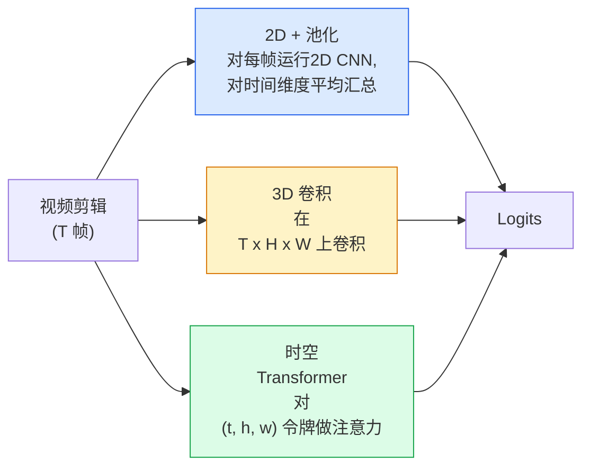

# 视频理解（Video Understanding）——时间建模（Temporal Modeling）

> 视频（video）是图像序列加上将它们连接起来的物理过程。每种视频模型要么将时间视为额外轴（3D convolution）、要么作为一个序列来注意（Transformer）、要么提取一次特征后池化（2D + pooling）。

**类型：** 学习 + 构建  
**语言：** Python  
**先决条件：** 第4阶段第3课（卷积神经网络CNN）、第4阶段第4课（图像分类）  
**时间：** 约45分钟

## 学习目标

- 区分三大主要视频建模方法（2D+池化、3D 卷积、时空 Transformer），并预测其计算成本与准确率的权衡  
- 在 PyTorch 中实现帧采样、时间池化及 2D+池化基准分类器  
- 解释为什么 I3D 的“膨胀”3D 卷积核可很好的从 ImageNet 权重迁移，以及因式分解（2+1）D 卷积有何不同  
- 阅读标准动作识别数据集与指标：Kinetics-400/600、UCF101、Something-Something V2；剪辑级和视频级的 top-1 准确率

## 双语术语速查

| 中文术语 | English term |
|----------|--------------|
| 视频理解 | Video understanding |
| 时间建模 | Temporal modeling |
| 帧 | Frame |
| 剪辑 | Clip |
| 视频级分类 | Video-level classification |
| 剪辑级分类 | Clip-level classification |
| 时间池化 | Temporal pooling |
| 3D 卷积 | 3D convolution |
| 2D+池化 | 2D + pooling |
| 时空 Transformer | Spatiotemporal Transformer |
| 膨胀 3D 卷积 | Inflated 3D convolution, I3D |
| 因式分解卷积 | Factorized convolution, (2+1)D |
| 帧采样 | Frame sampling |
| 动作识别 | Action recognition |
| Kinetics | Kinetics |
| UCF101 | UCF101 |
| Top-1 准确率 | Top-1 accuracy |


## 问题描述

一个 30 秒、30 fps 的视频包含 900 帧。直观来看，视频分类就是对每一帧进行图像分类 900 次，再做某种汇总。当动作在几乎每个帧都能看到时（运动、烹饪、锻炼视频）这样可行；当动作本身依赖运动定义时，完全失效：例如“将物体从左推到右”在每一帧里看起来像两个静止的物体。

每个视频架构的核心问题是：何时以及如何建模时间结构？答案决定了之后的一切——计算成本、预训练策略、是否能重用 ImageNet 权重，以及模型训练用的数据集。

本课刻意比静态图像课程短。核心的图像处理机制已经具备，视频理解主要是时间维度的取样、建模和汇总。

## 概念介绍

### 关键公式（Key equations）

最简单的视频分类基线先逐帧提取特征，再沿时间维做平均池化：

$$
h_t = f_\theta(x_t), \qquad \bar h = \frac{1}{T}\sum_{t=1}^{T} h_t
$$

$$
p(y \mid x_{1:T}) = \operatorname{softmax}(W\bar h + b)
$$

### 三大架构体系



### 2D + 池化

选用一个 2D CNN（如 ResNet, EfficientNet, ViT）。对采样的每一帧独立运行。对每帧特征做平均（或最大池化、注意力池化）汇总。汇总向量输入分类器。

优点：  
- ImageNet 预训练权重可直接迁移  
- 实现最简单  
- 便宜：计算成本约为 T 帧 × 单帧推理成本

缺点：  
- 无法建模运动，动作就是外观的累积  
- 时间池化不区分顺序；“开门”和“关门”看起来一样

适用场景：偏重外观的任务、小型视频数据集迁移学习、初始基线。

### 3D 卷积

用3D卷积核替代2D（H, W）卷积核，卷积同时作用于空间与时间维度。代表架构：C3D、I3D、SlowFast。

I3D窍门：用预训练的 2D ImageNet 模型，将每个 2D 卷积核沿时间轴复制“膨胀”。一个3×3的二维卷积核变成3×3×3的三维卷积核。这样3D模型继承了强大的预训练权重，而非从头训练。

优点：  
- 直接建模运动  
- I3D 膨胀提供免费迁移学习

缺点：  
- FLOPs 要比 2D 版本高约 T/8 倍（时间卷积核为 3 且堆叠3次）  
- 时间卷积核小，需使用金字塔或双流架构捕捉长程运动

适用场景：动作识别，运动是主要信号（Something-Something V2、运动类较多的 Kinetics）

### 时空 Transformer

将视频切分为空间-时间小块令牌，对所有令牌做注意力。代表：TimeSformer、ViViT、Video Swin、VideoMAE。

关注的注意力模式：  
- **联合型** — 对 (t, h, w) 做一次大注意力。计算复杂度约为 `(T*H*W)^2`；开销大。  
- **分割型** — 每个模块做两轮注意力：一轮时间，一轮空间。近似线性扩展。  
- **因式分解型** — 时间注意力和空间注意力交替做。

优点：  
- 所有主流基准上的最先进准确率  
- 可以通过膨胀结构从图像 Transformer（ViT）迁移  
- 支持长时间上下文的视频长序列稀疏注意力

缺点：  
- 计算耗费大  
- 注意力模式设计需谨慎，否则运行时内存爆炸

适用场景：大规模数据集、高精度视频理解、多模态视频+文本任务。

### 帧采样

一个 10 秒钟30 fps 的视频有 300 帧，一次性喂入所有帧十分浪费。常用策略：

- **均匀采样** — 在整体剪辑上均匀选择T帧。2D+池化的默认选法。  
- **密集采样** — 随机选一段连续T帧。3D卷积常用，因为运动需要邻近帧。  
- **多剪辑采样** — 从同一视频采样多个T帧窗口，分别分类，测试时取平均。

T通常取8、16、32或64。T越大，时间信息越丰富，但计算代价更高。

### 评估指标

两个层级：  
- **剪辑级准确率** — 模型仅见到单个 T 帧剪辑，报告 top-k。  
- **视频级准确率** — 多剪辑预测平均，准确率更高更稳定。

建议同时报告。一个在剪辑级得78%，视频级得82%的模型，依赖测试时多剪辑平均；而剪辑级80%，视频级81%的模型则单剪辑更稳健。

### 常用数据集

- **Kinetics-400 / 600 / 700** — 通用动作识别数据集。40万剪辑，YouTube链接（多半已失效）。  
- **Something-Something V2** — 动作定义依赖运动（“移动X从左到右”），2D+池化无法解决。  
- **UCF-101**, **HMDB-51** — 较老且小型，仍常被引用。  
- **AVA** — 动作的时空*定位*，比单纯分类难度更大。

## 构建实现

### 步骤1：帧采样器

实现均匀和密集采样器，输入帧列表（或视频张量）输出索引。

```python
import numpy as np

def sample_uniform(num_frames_total, T):
    if num_frames_total <= T:
        return list(range(num_frames_total)) + [num_frames_total - 1] * (T - num_frames_total)
    step = num_frames_total / T
    return [int(i * step) for i in range(T)]


def sample_dense(num_frames_total, T, rng=None):
    rng = rng or np.random.default_rng()
    if num_frames_total <= T:
        return list(range(num_frames_total)) + [num_frames_total - 1] * (T - num_frames_total)
    start = int(rng.integers(0, num_frames_total - T + 1))
    return list(range(start, start + T))
```

两者都返回长度为 T 的索引用于切片视频张量。

### 步骤2：2D+池化基线

在每帧上运行二维 ResNet-18，特征做平均池化后分类。

```python
import torch
import torch.nn as nn
from torchvision.models import resnet18, ResNet18_Weights

class FramePool(nn.Module):
    def __init__(self, num_classes=400, pretrained=True):
        super().__init__()
        weights = ResNet18_Weights.IMAGENET1K_V1 if pretrained else None
        backbone = resnet18(weights=weights)
        self.features = nn.Sequential(*(list(backbone.children())[:-1]))  # 保留全局平均池化层
        self.head = nn.Linear(512, num_classes)

    def forward(self, x):
        # x: (N, T, 3, H, W)
        N, T = x.shape[:2]
        x = x.view(N * T, *x.shape[2:])
        feats = self.features(x).view(N, T, -1)
        pooled = feats.mean(dim=1)
        return self.head(pooled)

model = FramePool(num_classes=10)
x = torch.randn(2, 8, 3, 224, 224)
print(f"输出：{model(x).shape}")
print(f"参数量：{sum(p.numel() for p in model.parameters()):,}")
```

约1100万参数，ImageNet预训练，每帧独立推理后平均分类。在外观主导的任务中，这个基线比3D模型通常只低5-10个百分点，有时更好，因为它可用更强的ImageNet骨干网络。

### 步骤3：I3D风格的膨胀3D卷积

将单个2D卷积沿时间轴复制权重，实现3D卷积。

```python
def inflate_2d_to_3d(conv2d, time_kernel=3):
    out_c, in_c, kh, kw = conv2d.weight.shape
    weight_3d = conv2d.weight.data.unsqueeze(2)  # (out, in, 1, kh, kw)
    weight_3d = weight_3d.repeat(1, 1, time_kernel, 1, 1) / time_kernel
    conv3d = nn.Conv3d(in_c, out_c, kernel_size=(time_kernel, kh, kw),
                        padding=(time_kernel // 2, conv2d.padding[0], conv2d.padding[1]),
                        stride=(1, conv2d.stride[0], conv2d.stride[1]),
                        bias=False)
    conv3d.weight.data = weight_3d
    return conv3d

conv2d = nn.Conv2d(3, 64, kernel_size=3, padding=1, bias=False)
conv3d = inflate_2d_to_3d(conv2d, time_kernel=3)
print(f"2D 权重形状：  {tuple(conv2d.weight.shape)}")
print(f"3D 权重形状：  {tuple(conv3d.weight.shape)}")
x = torch.randn(1, 3, 8, 56, 56)
print(f"3D 输出形状：  {tuple(conv3d(x).shape)}")
```

除以 `time_kernel` 保持激活量级大致恒定——防止首批通过时破坏 BatchNorm（批归一化）统计。

### 步骤4：因式分解（2+1）D卷积

将3D卷积分解为空间的2D卷积和时间的1D卷积。视野相同，参数更少，有些基准精度更优。

```python
class Conv2Plus1D(nn.Module):
    def __init__(self, in_c, out_c, kernel_size=3):
        super().__init__()
        mid_c = (in_c * out_c * kernel_size * kernel_size * kernel_size) \
                // (in_c * kernel_size * kernel_size + out_c * kernel_size)
        self.spatial = nn.Conv3d(in_c, mid_c, kernel_size=(1, kernel_size, kernel_size),
                                 padding=(0, kernel_size // 2, kernel_size // 2), bias=False)
        self.bn = nn.BatchNorm3d(mid_c)
        self.act = nn.ReLU(inplace=True)
        self.temporal = nn.Conv3d(mid_c, out_c, kernel_size=(kernel_size, 1, 1),
                                  padding=(kernel_size // 2, 0, 0), bias=False)

    def forward(self, x):
        return self.temporal(self.act(self.bn(self.spatial(x))))

c = Conv2Plus1D(3, 64)
x = torch.randn(1, 3, 8, 56, 56)
print(f"(2+1)D输出形状: {tuple(c(x).shape)}")
```

完整 R(2+1)D 网络就是将 ResNet-18 的所有3×3卷积替换为 `Conv2Plus1D`。

## 使用技巧

两个库覆盖生产级视频建模：

- `torchvision.models.video` — R(2+1)D、MViT、Swin3D，含预训练的 Kinetics 权重。API与图像模型相同。  
- `pytorchvideo`（Meta） — 模型库、Kinetics/SSv2/AVA 数据加载器、标准变换。

视觉语言多模态视频模型（视频字幕、视频问答）推荐用 `transformers`（如 `VideoMAE`、`VideoLLaMA`、`InternVideo`）。

## 部署产出

本课产出：

- `outputs/prompt-video-architecture-picker.md` — 根据外观vs运动、数据集大小和计算预算推荐 2D+池化 / I3D / (2+1)D / Transformer 的提示。  
- `outputs/skill-frame-sampler-auditor.md` — 审核视频管线中采样器的技能，标记常见错误：索引 off-by-one，`num_frames < T` 时采样不均匀，缺失保留长宽比裁剪等。

## 练习

1. **（简单）** 计算 FramePool（T=8）和 I3D风格3D ResNet（T=8）的 FLOPs（近似）。解释为何 2D+池化计算成本低3-5倍。  
2. **（中等）** 生成合成视频数据集：随机小球以随机方向移动，标记为运动方向（“左-右”、“右-左”、“对角上”）。用 FramePool 训练，显示其准确率接近随机，证明仅靠外观不能解决运动任务。  
3. **（困难）** 将 ResNet-18 中的每个 Conv2d 替换为 `Conv2Plus1D`，构建 R(2+1)D-18。用 ImageNet 预训练 ResNet-18 膨胀第一层卷积权重。用练习2的运动数据集训练，打败 FramePool。

## 关键术语

| 术语 | 大家说什么 | 实际含义 |
|------|------------|----------|
| 2D + pool | “逐帧分类器” | 对每个采样帧运行2D CNN，跨时间平均池化特征，进行分类 |
| 3D convolution（3D 卷积） | “时空卷积核” | 在（T，H，W）上卷积的卷积核；能够原生建模运动 |
| Inflation（膨胀） | “将2D权重提升到3D” | 通过沿新时间轴重复2D卷积权重初始化3D卷积权重，然后除以kernel_T以保持激活尺度 |
| (2+1)D | “分解卷积” | 将3D卷积分解为2D空间卷积+1D时间卷积；参数更少，且在两者之间有额外非线性 |
| Divided attention（分离注意力） | “先时间后空间” | Transformer块中每层有两个注意力：分别作用于同一帧的token和同一位置的token |
| Clip（片段） | “T帧窗口” | 采样的T帧子序列；视频模型的输入单元 |
| Clip vs video accuracy（片段与视频准确度） | “两种评估设置” | 片段：每个视频采样一次，视频：多个采样片段的平均 |
| Kinetics（Kinetics 数据集） | “视频版的ImageNet” | 400-700个动作类别，30万+ YouTube片段，标准视频预训练语料库 |

## 延伸阅读

- [I3D: Quo Vadis, Action Recognition (Carreira & Zisserman, 2017)](https://arxiv.org/abs/1705.07750) — 介绍了膨胀和Kinetics数据集
- [R(2+1)D: A Closer Look at Spatiotemporal Convolutions (Tran et al., 2018)](https://arxiv.org/abs/1711.11248) — 分解卷积，依然是强基线
- [TimeSformer: Is Space-Time Attention All You Need? (Bertasius et al., 2021)](https://arxiv.org/abs/2102.05095) — 第一个强大的视频Transformer
- [VideoMAE (Tong et al., 2022)](https://arxiv.org/abs/2203.12602) — 用于视频的掩码自编码预训练；当前主流预训练方案
