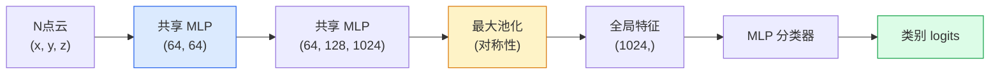

# 3D 视觉（3D Vision）——点云（Point Clouds）与神经辐射场（NeRFs）

> 3D 视觉（3D vision）有两种形式。点云（point clouds）是传感器的原始输出。神经辐射场（NeRF）是学习得到的体积场。两者都回答“空间中什么东西在哪里”。

**类型：** 学习 + 构建  
**语言：** Python  
**先决条件：** 第4阶段第3课（CNNs），第1阶段第12课（张量操作）  
**时间：** 约45分钟

## 学习目标

- 区分显式（点云、网格、体素）与隐式（符号距离场、NeRF）三维表示及各自的应用场景  
- 理解 PointNet 的对称函数技巧，它使神经网络对无序点集保持置换不变性  
- 梳理 NeRF 的前向过程：光线投射、体积渲染、位置编码、多层感知机密度+颜色头  
- 使用 `nerfstudio` 或 `instant-ngp` 完成从少量姿态已知图像进行的预训练三维重建  

## 双语术语速查

| 中文术语 | English term |
|----------|--------------|
| 3D 视觉 | 3D vision |
| 点云 | Point cloud |
| 神经辐射场 | Neural Radiance Field, NeRF |
| 体积场 | Volumetric field |
| 射线 | Ray |
| 射线投射 | Ray casting |
| 体积渲染 | Volumetric rendering |
| 透过率 | Transmittance |
| 密度 | Density |
| 颜色场 | Color field |
| 位置编码 | Positional encoding |
| 傅里叶特征 | Fourier features |
| 多层感知机 | Multi-layer perceptron, MLP |
| 置换不变性 | Permutation invariance |
| PointNet | PointNet |
| 符号距离场 | Signed Distance Field, SDF |
| Instant-NGP | Instant Neural Graphics Primitives |


## 问题描述

相机输出二维图像。激光雷达（LIDAR）输出无序的三维点集。运动结构恢复管线产生稀疏的三维关键点云。NeRF 从数张已知姿态的图像重建整个三维场景。它们都是“视觉”，但没有一个像 CNN 期望的密集张量。

三维视觉重要，因为几乎所有高价值机器人任务都在三维空间中运行：抓取、避障、导航、增强现实遮挡、三维内容采集。只懂二维图像的视觉工程师会被快速增长的领域分支（AR/VR 内容、机器人、自主驾驶堆栈、基于 NeRF 的房地产或建筑三维重建）拒之门外。

两种表示因不同原因占主导。点云是传感器免费提供的。NeRF 及其后继（3D 高斯点渲染、神经符号距离场）是让神经网络学习场景得到的表示。

## 概念介绍

### 关键公式（Key equations）

NeRF 沿相机射线积分颜色和密度，得到像素颜色：

$$
\mathbf{r}(t) = \mathbf{o} + t\mathbf{d}
$$

$$
C(\mathbf{r}) = \int_{t_n}^{t_f} T(t)\sigma(\mathbf{r}(t))\mathbf{c}(\mathbf{r}(t), \mathbf{d})\,dt, \qquad T(t)=\exp\left(-\int_{t_n}^{t}\sigma(\mathbf{r}(s))\,ds\right)
$$

### 点云（Point clouds）

点云是 R^3 空间中无序的 N 个点集合，可以为每个点附带特征（颜色、强度、法向量）。

```python
cloud = [
  (x1, y1, z1, r1, g1, b1),
  (x2, y2, z2, r2, g2, b2),
  ...
  (xN, yN, zN, rN, gN, bN),
]
```

无网格，无连通性。两个特性使神经网络操作困难：

- **置换不变性** — 输出不依赖点的顺序。  
- **点数可变** — 单一模型处理不同大小点云。

PointNet（Qi 等，2017）用一个想法解决了这两点：对每个点应用共享的多层感知机（MLP），然后用对称函数（max pool 最大池化）汇聚。输出是一个固定大小的向量，不依赖顺序。

```python
f(P) = max_{p in P} MLP(p)
```

这就是 PointNet 的核心。更深的变体（PointNet++、Point Transformer）新增分层采样和局部聚合，但对称函数技巧不变。

### PointNet 网络结构



“共享 MLP” 表示同一个 MLP 独立地作用于每个点。为效率起见实现为对点维度的1x1卷积。

### 神经辐射场（Neural Radiance Fields，NeRF）

NeRF（Mildenhall 等，2020）提出了“能否从 N 张照片重建三维场景？”的问题，并用将场景作为神经网络来回答。网络将 `(x, y, z, 观察方向)` 映射到 `(密度, 颜色)`。渲染视角即在此网络上进行光线投射循环。

```text
NeRF MLP:  (x, y, z, theta, phi) -> (sigma, r, g, b)

渲染新视角的像素 (u, v)：
  1. 从相机通过像素 (u, v) 投射光线
  2. 在光线上取距离 t_1, t_2, ..., t_N 的采样点
  3. 对每个采样点查询 MLP
  4. 用 (1 - exp(-sigma * dt)) 权重合成颜色
  5. 求和得到最终像素颜色
```

损失比较渲染像素与训练照片中的真实像素。通过渲染步骤反向传播更新 MLP。无三维真值，无显式几何——场景存在于 MLP 权重中。

### NeRF 中的位置编码（Positional encoding）

普通 MLP 对 `(x, y, z)` 无法表示高频细节，因为 MLP 对低频有偏向。NeRF 通过将每个坐标先编码成傅里叶特征向量送入 MLP 来解决：

```text
gamma(p) = (sin(2^0 π p), cos(2^0 π p), sin(2^1 π p), cos(2^1 π p), ...)
```

最高到 L=10 个频率层级。这与 Transformer 中的位置编码技巧相同，也出现在扩散模型的时间调节中（第10课）。缺失此编码，NeRF 会显得模糊。

### 体积渲染公式

```text
C(r) = sum_i T_i * (1 - exp(-sigma_i * delta_i)) * c_i

T_i  = exp(- sum_{j<i} sigma_j * delta_j)
delta_i = t_{i+1} - t_i
```

`T_i` 是透射率——光线到点 i 的存活概率。`(1 - exp(-sigma_i * delta_i))` 是点 i 的不透明度。`c_i` 是颜色。最终像素是沿光线加权和。

### NeRF 的替代方案

纯 NeRF 训练慢（数小时），渲染慢（秒/图）。后续发展：

- **Instant-NGP**（2022）— 用哈希网格编码替代 MLP 位置输入，秒级训练。  
- **Mip-NeRF 360** — 处理无界场景及抗锯齿。  
- **3D Gaussian Splatting**（2023）— 用数百万三维高斯点替代体积场，分钟训练，实时渲染。当前生产默认方案。

2026年几乎所有 NeRF 产品其实都是 3D 高斯渲染。心智模型仍是 NeRF。

### 数据集与基准

- **ShapeNet** — 用点云分类与分割三维 CAD 模型。  
- **ScanNet** — 室内扫描用于分割。  
- **KITTI** — 户外激光雷达点云用于自动驾驶。  
- **NeRF Synthetic** / **Blended MVS** — 姿态图像数据集用于新视角合成。  
- **Mip-NeRF 360** 数据集 — 无界真实场景数据。

## 构建示例

### 第1步：PointNet 分类器

```python
import torch
import torch.nn as nn

class PointNet(nn.Module):
    def __init__(self, num_classes=10):
        super().__init__()
        self.mlp1 = nn.Sequential(
            nn.Conv1d(3, 64, 1),    nn.BatchNorm1d(64),   nn.ReLU(inplace=True),
            nn.Conv1d(64, 64, 1),   nn.BatchNorm1d(64),   nn.ReLU(inplace=True),
        )
        self.mlp2 = nn.Sequential(
            nn.Conv1d(64, 128, 1),  nn.BatchNorm1d(128),  nn.ReLU(inplace=True),
            nn.Conv1d(128, 1024, 1), nn.BatchNorm1d(1024), nn.ReLU(inplace=True),
        )
        self.head = nn.Sequential(
            nn.Linear(1024, 512),   nn.BatchNorm1d(512),  nn.ReLU(inplace=True),
            nn.Dropout(0.3),
            nn.Linear(512, 256),    nn.BatchNorm1d(256),  nn.ReLU(inplace=True),
            nn.Dropout(0.3),
            nn.Linear(256, num_classes),
        )

    def forward(self, x):
        # x: (N, 3, num_points) — 转置以适配 Conv1d
        x = self.mlp1(x)
        x = self.mlp2(x)
        x = torch.max(x, dim=-1)[0]       # (N, 1024)
        return self.head(x)

pts = torch.randn(4, 3, 1024)
net = PointNet(num_classes=10)
print(f"output: {net(pts).shape}")
print(f"params: {sum(p.numel() for p in net.parameters()):,}")
```

约160万参数。可处理每云1024个点。

### 第2步：位置编码

```python
def positional_encoding(x, L=10):
    """
    x: (..., D) -> (..., D * 2 * L)
    """
    freqs = 2.0 ** torch.arange(L, dtype=x.dtype, device=x.device)
    args = x.unsqueeze(-1) * freqs * 3.141592653589793
    sinc = torch.cat([args.sin(), args.cos()], dim=-1)
    return sinc.reshape(*x.shape[:-1], -1)

x = torch.randn(5, 3)
y = positional_encoding(x, L=10)
print(f"input:  {x.shape}")
print(f"encoded: {y.shape}     # (5, 60)")
```

乘以 `2^l * π` 产生逐渐更高的频率。

### 第3步：简易 NeRF MLP

```python
class TinyNeRF(nn.Module):
    def __init__(self, L_pos=10, L_dir=4, hidden=128):
        super().__init__()
        self.L_pos = L_pos
        self.L_dir = L_dir
        pos_dim = 3 * 2 * L_pos
        dir_dim = 3 * 2 * L_dir
        self.trunk = nn.Sequential(
            nn.Linear(pos_dim, hidden), nn.ReLU(inplace=True),
            nn.Linear(hidden, hidden),  nn.ReLU(inplace=True),
            nn.Linear(hidden, hidden),  nn.ReLU(inplace=True),
            nn.Linear(hidden, hidden),  nn.ReLU(inplace=True),
        )
        self.sigma = nn.Linear(hidden, 1)
        self.color = nn.Sequential(
            nn.Linear(hidden + dir_dim, hidden // 2), nn.ReLU(inplace=True),
            nn.Linear(hidden // 2, 3), nn.Sigmoid(),
        )

    def forward(self, x, d):
        x_enc = positional_encoding(x, self.L_pos)
        d_enc = positional_encoding(d, self.L_dir)
        h = self.trunk(x_enc)
        sigma = torch.relu(self.sigma(h)).squeeze(-1)
        rgb = self.color(torch.cat([h, d_enc], dim=-1))
        return sigma, rgb

nerf = TinyNeRF()
x = torch.randn(128, 3)
d = torch.randn(128, 3)
s, c = nerf(x, d)
print(f"sigma: {s.shape}   rgb: {c.shape}")
```

相比原版 NeRF（含深度8的2个MLP干路）算是极简版本。足以演示架构。

### 第4步：沿光线体积渲染

```python
def volumetric_render(sigma, rgb, t_vals):
    """
    sigma: (..., N_samples)
    rgb:   (..., N_samples, 3)
    t_vals: (N_samples,) 光线上距离
    """
    delta = torch.cat([t_vals[1:] - t_vals[:-1], torch.full_like(t_vals[:1], 1e10)])
    alpha = 1.0 - torch.exp(-sigma * delta)
    trans = torch.cumprod(torch.cat([torch.ones_like(alpha[..., :1]), 1.0 - alpha + 1e-10], dim=-1), dim=-1)[..., :-1]
    weights = alpha * trans
    rendered = (weights.unsqueeze(-1) * rgb).sum(dim=-2)
    depth = (weights * t_vals).sum(dim=-1)
    return rendered, depth, weights


N = 64
t_vals = torch.linspace(2.0, 6.0, N)
sigma = torch.rand(N) * 0.5
rgb = torch.rand(N, 3)
rendered, depth, weights = volumetric_render(sigma, rgb, t_vals)
print(f"rendered colour: {rendered.tolist()}")
print(f"depth:           {depth.item():.2f}")
```

单条光线，64个采样点，合成单像素 RGB 和深度。

## 使用建议

真实项目中：

- `nerfstudio`（Tancik 等）— NeRF/Instant-NGP/高斯渲染的权威库。提供命令行和网页查看器。  
- `pytorch3d`（Meta）— 可微渲染，点云工具，网格操作。  
- `open3d` — 点云处理、配准、可视化。

部署时，3D 高斯渲染大幅取代纯 NeRF，渲染速度提升约100倍，重建质量相近。

## 交付产物

本课产出：

- `outputs/prompt-3d-task-router.md` — 根据任务及输入数据路由至合适的3D表示（点云、网格、体素、NeRF、高斯渲染）的提示模板。  
- `outputs/skill-point-cloud-loader.md` — 用于读取 .ply / .pcd / .xyz 文件的 PyTorch `Dataset` 技能，包含正确归一化、中心化及点采样。

## 练习

1. **（简单）** 证明 PointNet 是置换不变的（permutation-invariant）：对同一个点云运行两次，一次点顺序打乱。验证输出在浮点数噪声范围内相同。
2. **（中等）** 实现一个最小射线生成函数，给定相机内参和姿态，为 H x W 图像的每个像素产生射线起点和方向。
3. **（困难）** 在一个合成数据集上训练 TinyNeRF，数据集包含一个彩色立方体的渲染视图（通过可微渲染或简单光线追踪生成）。报告第 1、10、100 轮训练的渲染损失。模型在哪一轮生成可识别的视图？

## 关键词

| 术语 | 常见说法 | 实际含义 |
|------|----------|----------|
| Point cloud（点云） | “来自激光雷达的3D点” | 无序的 (x, y, z) 集合+每点可选特征 |
| PointNet | “首个点云神经网络” | 对每点共享 MLP + 对称（最大）池化；从结构上保证置换不变 |
| NeRF（神经辐射场） | “是场景的 MLP” | 网络将 (x, y, z, 方向) 映射到（密度、颜色）；通过射线投射渲染 |
| Positional encoding（位置编码） | “Fourier 特征” | 将坐标编码为多个频率的 sin/cos，克服 MLP 对低频的偏好 |
| Volumetric rendering（体积渲染） | “射线积分” | 使用透过率和 alpha 将射线上的样本合成为单像素 |
| Instant-NGP | “哈希网格 NeRF” | 用多分辨率哈希网格替代 NeRF 的坐标 MLP；快 100-1000 倍 |
| 3D Gaussian splatting（3D 高斯喷溅） | “数百万个高斯分布” | 场景由3D高斯集合构成；实时渲染，数分钟训练完成 |
| SDF（符号距离场） | “符号距离场” | 返回到最近表面符号距离的函数；另一种隐式表示 |

## 延伸阅读

- [PointNet (Qi et al., 2017)](https://arxiv.org/abs/1612.00593) — 置换不变分类器
- [NeRF (Mildenhall et al., 2020)](https://arxiv.org/abs/2003.08934) — 使照片3D重建成为神经网络问题的论文
- [Instant-NGP (Müller et al., 2022)](https://arxiv.org/abs/2201.05989) — 哈希网格，实现1000倍加速
- [3D Gaussian Splatting (Kerbl et al., 2023)](https://arxiv.org/abs/2308.04079) — 取代 NeRF 的生产架构
