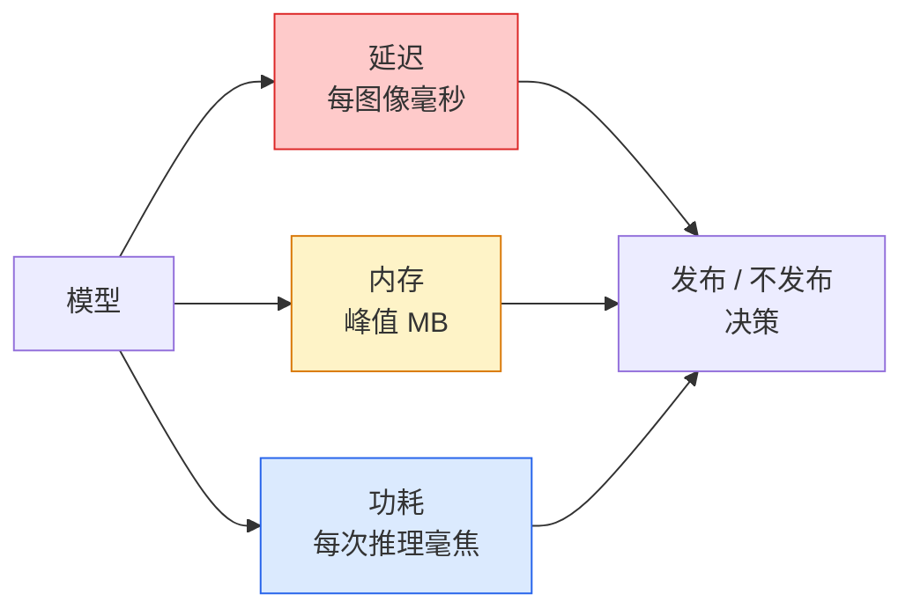

# 实时视觉（Real-Time Vision）——边缘部署（Edge Deployment）

> 边缘推理（edge inference）是指让一个 90% 准确率的模型在具有 2 GB 内存的设备上以 30 fps 运行的学科。每一个准确率的百分点都要与毫秒级的延迟（latency）权衡。

**类型:** 学习 + 实践  
**语言:** Python  
**先决条件:** 第4阶段第04课（图像分类）、第10阶段第11课（量化）  
**时间:** ~75分钟

## 学习目标

- 测量任何 PyTorch 模型的推理延迟、峰值内存和吞吐量，并理解 FLOPs / 参数数 / 延迟之间的权衡  
- 使用 PyTorch 的后训练量化将视觉模型量化为 INT8，并验证准确率损失小于1%  
- 导出到 ONNX 并使用 ONNX Runtime 或 TensorRT 编译；能说出三种最常见的导出失败及其解决方法  
- 解释何时为边缘受限选择 MobileNetV3、EfficientNet-Lite、ConvNeXt-Tiny 或 MobileViT  

## 双语术语速查

| 中文术语 | English term |
|----------|--------------|
| 实时视觉 | Real-time vision |
| 边缘部署 | Edge deployment |
| 边缘推理 | Edge inference |
| 延迟 | Latency |
| 吞吐量 | Throughput |
| 每秒帧数 | Frames per second, FPS |
| 浮点运算次数 | FLOPs |
| 模型大小 | Model size |
| 峰值内存 | Peak memory |
| 量化 | Quantization |
| INT8 量化 | INT8 quantization |
| 后训练量化 | Post-training quantization, PTQ |
| 量化感知训练 | Quantization-aware training, QAT |
| 蒸馏 | Distillation |
| ONNX | Open Neural Network Exchange, ONNX |
| TensorRT | TensorRT |
| TFLite | TensorFlow Lite |
| p95/p99 延迟 | p95/p99 latency |


## 问题

训练时的视觉模型是浮点运算的庞然大物。100M 参数，每次前传需要 10 GFLOPs，使用 2 GB 显存。这些都装不进手机、车载信息娱乐系统、工业相机或无人机。交付一个视觉系统意味着在100倍更小的预算内实现相同的预测。

三个旋钮做大部分工作：模型选择（用相同配方缩小架构）、量化（用 INT8 取代 FP32）、推理运行时（ONNX Runtime、TensorRT、Core ML、TFLite）。选对它们，是演示能在工作站上运行和产品能在30美元摄像头模块上发布的区别。

本课首先建立测量纪律（不能优化无法测量的东西），然后演示三个旋钮。目标不是学会每种边缘运行时，而是了解存在的杠杆，以及如何验证它们按预期工作。

## 概念

### 关键公式（Key equations）

实时系统先看吞吐和延迟。帧率由每帧端到端耗时决定，量化则把浮点数映射到整数网格：

$$
\operatorname{FPS} = \frac{1000}{\operatorname{latency}_{\mathrm{ms}}}
$$

$$
x_{\mathrm{int8}} = \operatorname{clip}\left(\operatorname{round}\left(\frac{x}{s}\right) + z, -128, 127\right)
$$

其中 $s$ 是 scale，$z$ 是 zero-point。

### 三个预算



- **延迟**：p50、p95、p99。仅平均p50会掩盖尾延迟，尾延迟对实时系统至关重要。  
- **峰值内存**：设备达到的最大内存使用，而非稳定态平均值。关乎嵌入式目标上内存不足（OOM）致命。  
- **功耗 / 能耗**：电池供电设备上每次推理的毫焦。通常用 CPU/GPU 利用率 × 时间近似。

基于（模型、延迟、内存、准确率）的表格是做边缘决策的依据。所有数据都在目标设备上测量，而非工作站。

### 测量纪律

每个边缘性能评估应遵循三条规则：

1. **预热**模型，先用5-10次虚拟前向传递。冷缓存和即时编译（JIT）导致首次数字不具代表性。  
2. **同步**GPU，使用 `torch.cuda.synchronize()` 在计时前后。否则你测的是核调度时间，不是核执行时间。  
3. **固定输入尺寸**为生产时的分辨率。224x224的延迟不等于512x512的延迟。

### FLOPs 作为代理指标

FLOPs（每次推理的浮点运算次数）是成本低、设备无关的延迟代理指标。适合架构比较，但作为绝对壁钟时间有误导性。一个FLOPs多10%的模型，实际上可能快两倍，因为它使用硬件友好的操作（深度卷积编译良好，7x7大卷积则不然）。

规则: 用FLOPs做架构搜索，用设备上延迟做部署决策。

### 一句话量化

用 INT8 替代 FP32 权重和激活。模型大小减4倍，内存带宽减4倍，计算减少2-4倍（在有 INT8 内核的硬件上，如现代移动 SoC 和 NVIDIA GPU带 Tensor Cores）。视觉任务上的准确率损失通常在 0.1-1 个百分点，使用后训练静态量化。

类型：

- **动态量化** — 权重量化为 INT8，激活在 FP 中计算，简单，小幅加速。  
- **静态量化（后训练）** — 权重量化 + 在小校准集上校准激活范围。比动态更快很多。  
- **量化感知训练（QAT）** — 训练时模拟量化，模型学会适应。准确率最高，需要标注数据。

视觉任务中后训练静态量化使用5%努力即可获得95%收益。只有当 PTQ 准确率损失不可接受时才用 QAT。

### 剪枝与蒸馏

- **剪枝** — 去除不重要权重（基于幅度）或通道（结构剪枝）。对过度参数化模型效果好，对已有紧凑架构作用有限。  
- **蒸馏** — 训练小型学生模型模仿大型教师的logits。通常能恢复缩小模型带来的大部分准确率损失。生产边缘模型的标准方法。

### 推理运行时

- **PyTorch eager** — 慢，不适合部署。仅用于开发。  
- **TorchScript** — 旧版。已被 `torch.compile` 和 ONNX 导出取代。  
- **ONNX Runtime** — 中立运行时。CPU、CUDA、CoreML、TensorRT、OpenVINO 都有 ONNX 提供者。从这里开始。  
- **TensorRT** — NVIDIA 的编译器。NVIDIA GPU（工作站和 Jetson）上最佳延迟。可集成 ONNX Runtime 或单独使用。  
- **Core ML** — 苹果iOS/macOS运行时。需 `.mlmodel` 或 `.mlpackage` 文件。  
- **TFLite** — 谷歌 Android/ARM 运行时。需 `.tflite` 文件。  
- **OpenVINO** — 英特尔 CPU/VPU 运行时。需 `.xml` + `.bin` 文件。

实践中流程是：PyTorch -> ONNX -> 目标运行时。ONNX 是通用语言。

### 边缘架构选择器

| 预算 | 模型 | 理由 |
|--------|-------|-----|
| < 3M 参数 | MobileNetV3-Small | 处处可编译，良好基线 |
| 3-10M | EfficientNet-Lite-B0 | TFLite上每参数精度最高 |
| 10-20M | ConvNeXt-Tiny | 每参数准确率最高，CPU友好 |
| 20-30M | MobileViT-S 或 EfficientViT | ImageNet准确率的Transformer |
| 30-80M | Swin-V2-Tiny | 如果栈支持窗口注意 |

除非有特定原因，否则全部量化为 INT8。

## 搭建它

### 步骤1：正确测量延迟

```python
import time
import torch

def measure_latency(model, input_shape, device="cpu", warmup=10, iters=50):
    model = model.to(device).eval()
    x = torch.randn(input_shape, device=device)
    with torch.no_grad():
        for _ in range(warmup):
            model(x)
        if device == "cuda":
            torch.cuda.synchronize()
        times = []
        for _ in range(iters):
            if device == "cuda":
                torch.cuda.synchronize()
            t0 = time.perf_counter()
            model(x)
            if device == "cuda":
                torch.cuda.synchronize()
            times.append((time.perf_counter() - t0) * 1000)
    times.sort()
    return {
        "p50_ms": times[len(times) // 2],
        "p95_ms": times[int(len(times) * 0.95)],
        "p99_ms": times[int(len(times) * 0.99)],
        "mean_ms": sum(times) / len(times),
    }
```

预热，同步，使用 `time.perf_counter()`。报告百分位数，不仅仅是均值。

### 步骤2：参数和 FLOP 计数

```python
def parameter_count(model):
    return sum(p.numel() for p in model.parameters())

def flops_estimate(model, input_shape):
    """
    针对仅包含卷积/线性层模型的粗略FLOP计数。生产应使用 `fvcore` 或 `ptflops`。
    """
    total = 0
    def conv_hook(m, inp, out):
        nonlocal total
        c_out, c_in, kh, kw = m.weight.shape
        h, w = out.shape[-2:]
        total += 2 * c_in * c_out * kh * kw * h * w
    def linear_hook(m, inp, out):
        nonlocal total
        total += 2 * m.in_features * m.out_features
    hooks = []
    for m in model.modules():
        if isinstance(m, torch.nn.Conv2d):
            hooks.append(m.register_forward_hook(conv_hook))
        elif isinstance(m, torch.nn.Linear):
            hooks.append(m.register_forward_hook(linear_hook))
    model.eval()
    with torch.no_grad():
        model(torch.randn(input_shape))
    for h in hooks:
        h.remove()
    return total
```

真实项目用 `fvcore.nn.FlopCountAnalysis` 或 `ptflops`，它们能正确处理所有模块类型。

### 步骤3：后训练静态量化

```python
def quantise_ptq(model, calibration_loader, backend="x86"):
    import torch.ao.quantization as tq
    model = model.eval().cpu()
    model.qconfig = tq.get_default_qconfig(backend)
    tq.prepare(model, inplace=True)
    with torch.no_grad():
        for x, _ in calibration_loader:
            model(x)
    tq.convert(model, inplace=True)
    return model
```

三步：配置，准备（插入观察者），用真实数据校准，转换（融合 + 量化）。需要模型融合（`Conv -> BN -> ReLU` 融合为 `ConvBnReLU`），`torch.ao.quantization.fuse_modules` 会处理。

### 步骤4：导出到 ONNX

```python
def export_onnx(model, sample_input, path="model.onnx"):
    model = model.eval()
    torch.onnx.export(
        model,
        sample_input,
        path,
        input_names=["input"],
        output_names=["output"],
        dynamic_axes={"input": {0: "batch"}, "output": {0: "batch"}},
        opset_version=17,
    )
    return path
```

`opset_version=17` 是2026年的安全默认。`dynamic_axes`让ONNX模型支持任意批量大小。

### 步骤5：基准测试并比较方案

```python
import torch.nn as nn
from torchvision.models import mobilenet_v3_small

def compare_regimes():
    model = mobilenet_v3_small(weights=None, num_classes=10)
    params = parameter_count(model)
    flops = flops_estimate(model, (1, 3, 224, 224))
    lat_fp32 = measure_latency(model, (1, 3, 224, 224), device="cpu")
    print(f"FP32 MobileNetV3-Small: {params:,} params  {flops/1e9:.2f} GFLOPs  "
          f"p50={lat_fp32['p50_ms']:.2f}ms  p95={lat_fp32['p95_ms']:.2f}ms")
```

对 `resnet50`、`efficientnet_v2_s` 和 `convnext_tiny` 运行相同函数，即得部署决策所需的比较表。

## 使用它

生产栈通常收敛到三条路径之一：

- **Web / 无服务器**：PyTorch -> ONNX -> ONNX Runtime（CPU 或 CUDA 提供者）。最简单，大多数情况够用。  
- **NVIDIA 边缘（Jetson，GPU 服务器）**：PyTorch -> ONNX -> TensorRT。延迟最佳，工程量最大。  
- **移动端**：PyTorch -> ONNX -> Core ML（iOS）或 TFLite（Android）。导出前量化。

测量时，`torch-tb-profiler`、`nvprof` / `nsys` 和 macOS 的 Instruments 提供逐层细分。`benchmark_app`（OpenVINO）和 `trtexec`（TensorRT）提供独立 CLI 基准。

## 发布它

本课输出：

- `outputs/prompt-edge-deployment-planner.md` — 给定目标设备与延迟 SLA，挑选骨干网、量化策略和运行时的提示。  
- `outputs/skill-latency-profiler.md` — 一个技能，编写包含预热、同步、百分位和内存监控的完整延迟基准测试脚本。

## 练习

1. **（简单）** 测量 `resnet18`、`mobilenet_v3_small`、`efficientnet_v2_s` 和 `convnext_tiny` 在 224x224 尺寸、CPU 上的 p50 延迟。报告表格并找出哪个架构具有最佳的准确率每毫秒比。
2. **（中等）** 对 `mobilenet_v3_small` 应用后训练静态量化（post-training static quantisation）。报告 FP32 与 INT8 在 CIFAR-10 或类似数据集持出子集上的延迟和准确率损失。
3. **（困难）** 将 `convnext_tiny` 导出为 ONNX，使用 `onnxruntime` 和 `CPUExecutionProvider` 运行，并与 PyTorch eager 基线延迟进行比较。找出 ONNX Runtime 较快的第一层并解释原因。

## 关键词

| 术语 | 人们说法 | 实际含义 |
|------|----------|----------|
| Latency（延迟） | “多快” | 从输入到输出的时间；p50/p95/p99 分位数，而非均值 |
| FLOPs（浮点运算次数） | “模型大小” | 每次前向传播的浮点运算次数；计算成本的粗略代理指标 |
| INT8 quantisation（8 位量化） | “8 位” | 用 8 位整数替换 FP32 权重/激活；体积约缩小 4 倍，速度提升 2-4 倍 |
| PTQ（后训练量化） | “后训练量化” | 不重新训练地量化已训练模型；简单且通常足够 |
| QAT（量化感知训练） | “量化感知训练” | 训练中模拟量化过程；准确率最佳，但需要带标签数据 |
| ONNX | “通用格式” | 被主流推理运行时支持的模型交换格式 |
| TensorRT | “NVIDIA 编译器” | 将 ONNX 编译为 NVIDIA GPU 的优化引擎 |
| Distillation（蒸馏） | “老师 -> 学生” | 训练小模型模仿大模型的 logits；恢复大部分丢失的准确率 |

## 延伸阅读

- [EfficientNet（Tan & Le, 2019）](https://arxiv.org/abs/1905.11946) — 用于高效架构的复合缩放方法
- [MobileNetV3（Howard 等，2019）](https://arxiv.org/abs/1905.02244) — 以移动为首的架构，包含 h-swish 和 squeeze-excite 机制
- [TensorRT 优化实用指南（NVIDIA）](https://developer.nvidia.com/blog/accelerating-model-inference-with-tensorrt-tips-and-best-practices-for-pytorch-users/) — 如何实际获得论文中的吞吐量数值
- [ONNX Runtime 文档](https://onnxruntime.ai/docs/) — 量化、图优化、计算提供者选择
