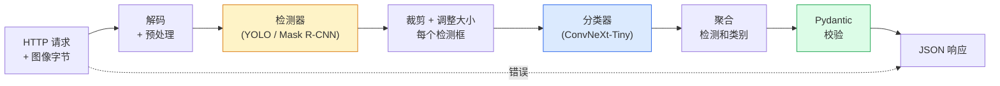

# 完整视觉流水线（Vision Pipeline）——毕业项目（Capstone）

> 一个生产级视觉系统（production vision system）是由模型和规则组成的链条，通过数据契约（data contracts）连接。此阶段中的各个部分已存在；毕业项目将它们端到端地连接起来。

**类型：** 构建  
**语言：** Python  
**先决条件：** 第4阶段课程 01-15  
**时间：** 约120分钟

## 学习目标

- 设计一个生产级视觉流水线，能够检测物体、分类物体，并输出结构化 JSON——处理所有失败路径  
- 将一个检测器（Mask R-CNN 或 YOLO）、一个分类器（ConvNeXt-Tiny）和一个数据契约（Pydantic）插入到一个服务中  
- 对端到端流水线进行基准测试，并识别首个瓶颈（通常是预处理，然后是检测器）  
- 发布一个最小的 FastAPI 服务，支持图像上传，运行流水线，并返回带有分类的检测结果  

## 双语术语速查

| 中文术语 | English term |
|----------|--------------|
| 视觉流水线 | Vision pipeline |
| 生产视觉系统 | Production vision system |
| 数据契约 | Data contract |
| 预处理 | Preprocessing |
| 推理 | Inference |
| 后处理 | Postprocessing |
| 微批处理 | Microbatching |
| 健康检查 | Health check |
| 跟踪 ID | Trace ID |
| 错误码 | Failure code |
| 模式验证 | Schema validation |
| 端到端延迟 | End-to-end latency |
| 烟雾测试 | Smoke test |
| 可观测性 | Observability |
| 服务就绪探针 | Readiness probe |
| 负载均衡器 | Load balancer |


## 问题背景

单个视觉模型是有用的；但视觉产品是这些模型的链条。零售货架审核是检测器+产品分类器+价格 OCR 流水线。自动驾驶是2D检测器+3D检测器+分割器+跟踪器+规划器。医疗预筛查是分割器+区域分类器+临床医生界面。

连接这些链条是将机器学习原型和产品区分开来的部分。模型之间的每个接口都是可能出现错误的新位置。每个坐标变换、每个归一化、每个掩码调整大小都是静默失败的潜在点。流水线的强度取决于其最弱接口。

本毕业项目设置了最小可用流水线：检测 + 分类 + 结构化输出 + 服务层。第4阶段的所有其他内容都能插入这个骨架中：替换 Mask R-CNN 为 YOLOv8，加入 OCR 头，加入分割分支，加入跟踪器。架构稳定；组件可插拔。

## 概念介绍

### 关键公式（Key equations）

流水线评估要同时考虑模型质量和系统吞吐。若各阶段串行执行，总延迟是各阶段延迟之和：

$$
\operatorname{latency}_{\mathrm{total}} = \sum_{k=1}^{K}\operatorname{latency}_k
$$

检测后的业务指标常写成阈值函数，例如只保留置信度和 IoU 都达标的结果：

$$
\operatorname{keep}(b) = \mathbb{1}[s_b \ge \tau_s] \, \mathbb{1}[\operatorname{IoU}(b, g) \ge \tau_{\mathrm{IoU}}]
$$

### 流水线结构



共七个阶段。两个模型阶段计算量大；其他五个阶段是潜在的错误产生地。

### 使用 Pydantic 的数据契约

每个模型边界都变成一个类型化对象。这将静默失败转变为明显的失败。

```text
Detection(
    box: tuple[float, float, float, float],   # (x1, y1, x2, y2)，绝对像素
    score: float,                              # [0, 1]
    class_id: int,                             # 来自检测器的标签映射
    mask: Optional[list[list[int]]],           # 如有，RLE编码
)

PipelineResult(
    image_id: str,
    detections: list[Detection],
    classifications: list[Classification],
    inference_ms: float,
)
```

当检测器返回 `(cx, cy, w, h)` 形式的框而非 `(x1, y1, x2, y2)` 时，Pydantic 会在边界处校验失败，你可以即时发现，而不用调试下游裁剪时默默返回空区域的问题。

### 延迟分布

几乎所有视觉流水线都遵循三条规律：

1. **预处理往往是最大单块时间。** JPEG 解码、颜色空间转换、调整尺寸都是 CPU 绑定且容易被忽视。  
2. **检测器占用大部分 GPU 时间。** 70-90% 的 GPU 时间用于检测前向计算。  
3. **后处理（NMS、RLE 编码/解码）在 GPU 上开销小，在 CPU 上开销大。** 始终基于实际目标进行性能分析。

掌握时间分布能使优化变成优先级列表。

### 失败模式

- **空检测结果** — 返回空列表，不崩溃。记录日志。  
- **越界框** — 在裁剪前钳制到图像尺寸内。  
- **过小裁剪** — 对比分类器最小输入，过小者跳过分类。  
- **上传损坏** — 返回400状态码和特定错误码，而非500错误。  
- **模型加载失败** — 在服务启动时失败，而非首次请求时失败。

生产流水线主动处理这些情况，而不是写通用 `try/except` 隐藏失败。所有失败都有命名代码和响应。

### 批处理

生产服务对多客户端提供服务。跨请求批量处理检测和分类可提升吞吐量。权衡是额外延迟等待批次填满。典型设置：收集请求最多20毫秒，批量处理，分发响应。`torchserve` 和 `triton` 原生支持；小型负载可自定义微批处理。

## 构建步骤

### 步骤1：数据契约

```python
from pydantic import BaseModel, Field
from typing import List, Optional, Tuple

class Detection(BaseModel):
    box: Tuple[float, float, float, float]
    score: float = Field(ge=0, le=1)
    class_id: int = Field(ge=0)
    mask_rle: Optional[str] = None


class Classification(BaseModel):
    detection_index: int
    class_id: int
    class_name: str
    score: float = Field(ge=0, le=1)


class PipelineResult(BaseModel):
    image_id: str
    detections: List[Detection]
    classifications: List[Classification]
    inference_ms: float
```

五秒钟代码，节省数小时调试。

### 步骤2：最简流水线类

```python
import time
import numpy as np
import torch
from PIL import Image

class VisionPipeline:
    def __init__(self, detector, classifier, class_names,
                 device="cpu", min_crop=32):
        self.detector = detector.to(device).eval()
        self.classifier = classifier.to(device).eval()
        self.class_names = class_names
        self.device = device
        self.min_crop = min_crop

    def preprocess(self, image):
        """
        image: PIL.Image 或 np.ndarray (H, W, 3) uint8
        返回: 设备上的 CHW 格式 float tensor
        """
        if isinstance(image, Image.Image):
            image = np.asarray(image.convert("RGB"))
        tensor = torch.from_numpy(image).permute(2, 0, 1).float() / 255.0
        return tensor.to(self.device)

    @torch.no_grad()
    def detect(self, image_tensor):
        return self.detector([image_tensor])[0]

    @torch.no_grad()
    def classify(self, crops):
        if len(crops) == 0:
            return []
        batch = torch.stack(crops).to(self.device)
        logits = self.classifier(batch)
        probs = logits.softmax(-1)
        scores, cls = probs.max(-1)
        return list(zip(cls.tolist(), scores.tolist()))

    def run(self, image, image_id="anonymous"):
        t0 = time.perf_counter()
        tensor = self.preprocess(image)
        det = self.detect(tensor)

        crops = []
        detections = []
        valid_indices = []
        for i, (box, score, cls) in enumerate(zip(det["boxes"], det["scores"], det["labels"])):
            x1, y1, x2, y2 = [max(0, int(b)) for b in box.tolist()]
            x2 = min(x2, tensor.shape[-1])
            y2 = min(y2, tensor.shape[-2])
            detections.append(Detection(
                box=(x1, y1, x2, y2),
                score=float(score),
                class_id=int(cls),
            ))
            if (x2 - x1) < self.min_crop or (y2 - y1) < self.min_crop:
                continue
            crop = tensor[:, y1:y2, x1:x2]
            crop = torch.nn.functional.interpolate(
                crop.unsqueeze(0),
                size=(224, 224),
                mode="bilinear",
                align_corners=False,
            )[0]
            crops.append(crop)
            valid_indices.append(i)

        class_preds = self.classify(crops)

        classifications = []
        for valid_idx, (cls_id, cls_score) in zip(valid_indices, class_preds):
            classifications.append(Classification(
                detection_index=valid_idx,
                class_id=int(cls_id),
                class_name=self.class_names[cls_id],
                score=float(cls_score),
            ))

        return PipelineResult(
            image_id=image_id,
            detections=detections,
            classifications=classifications,
            inference_ms=(time.perf_counter() - t0) * 1000,
        )
```

每个接口均有类型，失败路径有具体处理策略。

### 步骤3：连接检测器和分类器

```python
from torchvision.models.detection import maskrcnn_resnet50_fpn_v2
from torchvision.models import convnext_tiny

# 用 ImageNet 预训练权重实现真实流水线，无需训练
detector = maskrcnn_resnet50_fpn_v2(weights="DEFAULT")
classifier = convnext_tiny(weights="DEFAULT")
class_names = [f"imagenet_class_{i}" for i in range(1000)]

pipe = VisionPipeline(detector, classifier, class_names)

# 用合成图像进行冒烟测试
test_image = (np.random.rand(400, 600, 3) * 255).astype(np.uint8)
result = pipe.run(test_image, image_id="demo")
print(result.model_dump_json(indent=2)[:500])
```

### 步骤4：FastAPI 服务

```python
from fastapi import FastAPI, UploadFile, HTTPException
from io import BytesIO

app = FastAPI()
pipe = None  # 启动时初始化

@app.on_event("startup")
def load():
    global pipe
    detector = maskrcnn_resnet50_fpn_v2(weights="DEFAULT").eval()
    classifier = convnext_tiny(weights="DEFAULT").eval()
    pipe = VisionPipeline(detector, classifier, class_names=[f"c{i}" for i in range(1000)])

@app.post("/detect")
async def detect_endpoint(file: UploadFile):
    if file.content_type not in {"image/jpeg", "image/png", "image/webp"}:
        raise HTTPException(status_code=400, detail="不支持的图片类型")
    data = await file.read()
    try:
        img = Image.open(BytesIO(data)).convert("RGB")
    except Exception:
        raise HTTPException(status_code=400, detail="无法解码图像")
    result = pipe.run(img, image_id=file.filename or "upload")
    return result.model_dump()
```

使用命令 `uvicorn main:app --host 0.0.0.0 --port 8000` 运行。用命令 `curl -F 'file=@dog.jpg' http://localhost:8000/detect` 测试。

### 步骤5：流水线基准测试

```python
import time

def benchmark(pipe, num_runs=20, image_size=(400, 600)):
    img = (np.random.rand(*image_size, 3) * 255).astype(np.uint8)
    pipe.run(img)  # 预热

    stages = {"preprocess": [], "detect": [], "classify": [], "total": []}
    for _ in range(num_runs):
        t0 = time.perf_counter()
        tensor = pipe.preprocess(img)
        t1 = time.perf_counter()
        det = pipe.detect(tensor)
        t2 = time.perf_counter()
        crops = []
        for box in det["boxes"]:
            x1, y1, x2, y2 = [max(0, int(b)) for b in box.tolist()]
            x2 = min(x2, tensor.shape[-1])
            y2 = min(y2, tensor.shape[-2])
            if (x2 - x1) >= pipe.min_crop and (y2 - y1) >= pipe.min_crop:
                crop = tensor[:, y1:y2, x1:x2]
                crop = torch.nn.functional.interpolate(
                    crop.unsqueeze(0), size=(224, 224), mode="bilinear", align_corners=False
                )[0]
                crops.append(crop)
        pipe.classify(crops)
        t3 = time.perf_counter()
        stages["preprocess"].append((t1 - t0) * 1000)
        stages["detect"].append((t2 - t1) * 1000)
        stages["classify"].append((t3 - t2) * 1000)
        stages["total"].append((t3 - t0) * 1000)

    for stage, times in stages.items():
        times.sort()
        print(f"{stage:12s}  p50={times[len(times)//2]:7.1f} ms  p95={times[int(len(times)*0.95)]:7.1f} ms")
```

CPU 上的典型输出：预处理约 3 毫秒，检测 300-500 毫秒，分类 20-40 毫秒，总计 350-550 毫秒。在 GPU 上，检测为 20-40 毫秒，预处理 + 分类在相对时间上开始变得更重要。

## 使用它

生产模板趋向于相同的结构，外加：

- **模型版本控制（Model versioning）** — 始终在响应中记录模型名称和权重哈希。
- **每请求跟踪 ID（Per-request trace IDs）** — 记录每个请求的每个阶段时间，以便将慢响应与具体阶段相关联。
- **回退路径（Fallback path）** — 如果分类器超时，返回无分类的检测结果，而不是使整个请求失败。
- **安全过滤（Safety filters）** — NSFW / PII 过滤在分类后运行，在响应离开服务之前执行。
- **批处理端点（Batch endpoint）** — 一个 `/detect_batch` 端点，接受图像 URL 列表以进行批量处理。

对于生产服务，`torchserve`、`Triton Inference Server` 和 `BentoML` 开箱即用地处理批处理、版本控制、指标和健康检查。直接运行 `FastAPI` 适合原型和小规模产品。

## 发布它

本课产出：

- `outputs/prompt-vision-service-shape-reviewer.md` — 一个 prompt，用于审查视觉服务代码中的契约/响应结构违规，并指出第一个破坏性 bug。
- `outputs/skill-pipeline-budget-planner.md` — 一个技能，给定目标延迟和吞吐量，为每个流水线阶段分配时间预算，并标记首个超时的阶段。

## 练习

1. **（简单）** 在任何公开数据集上对 10 张图像运行流水线。报告每个阶段的平均时间和每张图像检测计数的分布。
2. **（中等）** 在 `Detection` 中添加一个掩码输出字段，并将其编码为 RLE。验证即使在 10 个目标的图像中，JSON 仍保持在 1MB 以下。
3. **（困难）** 在分类器前添加一个微批处理器（micro-batcher）：收集作物最长 10 毫秒，统一在一 GPU 调用中分类，结果按请求返回。测量 5 个并发请求每秒时吞吐量提升和增加的延迟。

## 关键术语

| 术语 | 常用说法 | 实际含义 |
|------|----------|----------|
| Pipeline（流水线） | “系统” | 一组有序的预处理、推理和后处理步骤，阶段间接口有类型约束 |
| Data contract（数据契约） | “模式” | Pydantic / dataclass 定义，确保每个阶段输入输出符合，用以捕获边界集成错误 |
| Preprocessing（预处理） | “模型之前” | 解码、颜色转换、调整大小、归一化；通常是 CPU 时间最大消耗点 |
| Postprocessing（后处理） | “模型之后” | 非极大抑制（NMS）、掩码调整大小、阈值处理、RLE 编码；GPU 便宜，CPU 昂贵 |
| Microbatcher（微批处理器） | “收集然后转发” | 聚合器，等待固定时间窗口内的多个请求，执行单次批量前向传递 |
| Trace ID（跟踪 ID） | “请求 ID” | 每请求标识符，记录在所有阶段，便于端到端跟踪慢请求 |
| Failure code（错误码） | “命名错误” | 针对特定失败类别的错误代码，非通用 500，支持客户端重试策略 |
| Health check（健康检查） | “就绪探针” | 轻量级端点，报告服务是否可用；负载均衡器依赖此功能 |

## 深入阅读

- [Full Stack Deep Learning — Deploying Models](https://fullstackdeeplearning.com/course/2022/lecture-5-deployment/) — 生产级 ML 部署的权威概述
- [BentoML docs](https://docs.bentoml.com) — 支持批处理、版本管理和指标的服务框架
- [torchserve docs](https://pytorch.org/serve/) — PyTorch 官方服务库
- [NVIDIA Triton Inference Server](https://developer.nvidia.com/triton-inference-server) — 支持批处理和多模型的高吞吐量服务
