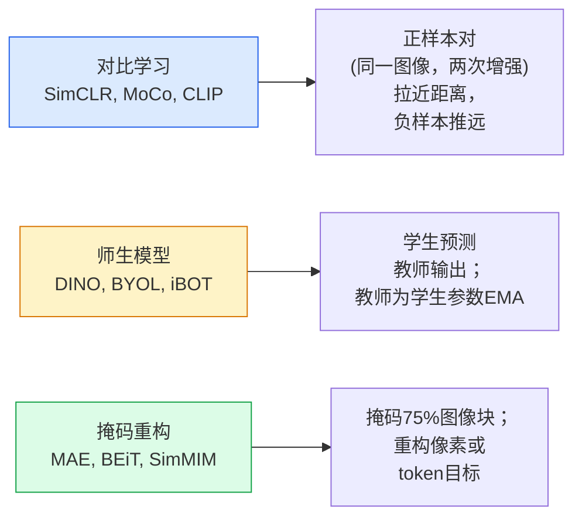

# 自监督视觉（Self-Supervised Vision）——SimCLR、DINO、MAE

> 标签（labels）是监督式视觉的瓶颈。自监督预训练（self-supervised pretraining）移除它们：从 1 亿无标签图像中学习视觉特征，再用 1 万有标签图像微调。

**类型:** 学习 + 构建  
**语言:** Python  
**先修:** 第4阶段第04课（图像分类）、第4阶段第14课（ViT）  
**时长:** ~75分钟

## 学习目标

- 追踪三大自监督家族——对比学习（SimCLR）、师生模型（DINO）、掩码重构（MAE），并说明各自的优化目标
- 从零实现InfoNCE损失，并解释为何512的批量大小有效而32的失败
- 解释MAE的75%掩码比例为何不是随意的，以及它如何不同于文本中BERT的15%
- 使用DINOv2或MAE ImageNet检查点进行线性探测（linear probing）和零样本检索

## 双语术语速查

| 中文术语 | English term |
|----------|--------------|
| 自监督视觉 | Self-supervised vision |
| 自监督学习 | Self-supervised learning, SSL |
| 预训练 | Pretraining |
| 前置任务 | Pretext task |
| 表示学习 | Representation learning |
| 线性探测 | Linear probe |
| 对比学习 | Contrastive learning |
| InfoNCE | InfoNCE |
| NT-Xent | Normalized temperature-scaled cross-entropy, NT-Xent |
| 正样本对 | Positive pair |
| 负样本 | Negative sample |
| EMA 教师 | Exponential moving average teacher, EMA teacher |
| DINO | Self-distillation with no labels, DINO |
| SimCLR | Simple Framework for Contrastive Learning, SimCLR |
| MAE | Masked Autoencoder, MAE |
| 掩码比例 | Mask ratio |
| 表示坍缩 | Representation collapse |


## 问题背景

监督式ImageNet有130万张带标签的图像，标注成本估计达1000万美元。医学和工业数据集更小且标注成本更高。每个视觉团队都会问：我们能否在廉价的无标签数据——YouTube帧、网页爬取、网络摄像头素材、卫星扫描——上预训练，然后在小规模有标签集上微调？

自监督学习是答案。现代自监督ViT在LAION或JFT数据集上训练，当微调时精准度达到或超过监督式ImageNet预训练。它的下游任务迁移能力（检测、分割、深度估计）也优于监督预训练。DINOv2（Meta，2023）和MAE（Meta，2022）是当前可迁移视觉特征的生产默认选择。

概念上的转变是：前置任务（pretext task）——模型训练的目标——不必是下游任务。关键在于任务能促使模型学习有用的特征。预测灰度图像的颜色、将图像旋转并让模型判别旋转角度、掩码并重构图像块——这些方法都曾成功。三种可扩展方法是对比学习、师生蒸馏和掩码重构。

## 概念说明

### 关键公式（Key equations）

SimCLR 使用 InfoNCE 对比损失，把同一图像的两个增强视图拉近，把批内其他视图推远：

$$
\mathcal{L}_{i,j} = -\log \frac{\exp(\operatorname{sim}(z_i,z_j)/\tau)}{\sum_{k=1}^{2N}\mathbb{1}_{k\ne i}\exp(\operatorname{sim}(z_i,z_k)/\tau)}
$$

MAE 则重建被遮挡补丁：

$$
\mathcal{L}_{\mathrm{MAE}} = \frac{1}{|M|}\sum_{p\in M}\left\|x_p - \hat{x}_p\right\|_2^2
$$

### 三大体系



### 对比学习（SimCLR）

取一张图，应用两种随机增强，得到两个视图。将两者通过相同编码器和投影头。最小化损失，要求“这两个嵌入相近”，同时“该嵌入与批内所有其他图像嵌入距离远”。

```text
正样本对 (z_i, z_j)，批内共有2N视图的损失:

   L_ij = -log( exp(sim(z_i, z_j) / tau) / sum_k in batch \ {i} exp(sim(z_i, z_k) / tau) )

sim = 余弦相似度
tau = 温度参数（标准为0.1）
```

这就是InfoNCE损失。它需要每个正样本许多负样本，因此批量大小很关键——SimCLR需要512到8192。MoCo引入了动量队列，存储过去批次，解除负样本数和批量大小的绑定。

### 师生模型（DINO）

两个结构相同的网络：学生和教师。教师权重是学生权重的指数滑动平均（EMA）。两者均看增强图像。训练目标是学生输出匹配教师输出——无显式负样本。

```text
loss = CE( student_output(view_1),  teacher_output(view_2) )
     + CE( student_output(view_2),  teacher_output(view_1) )

teacher_weights = m * teacher_weights + (1 - m) * student_weights   (m ≈ 0.996)
```

为何不坍缩为“预测常数”：教师输出经过中心化（每维减均值）和锐化（除以较小温度）。中心化防止某维支配，锐化避免输出均匀分布坍缩。

DINO是DINOv2的基础，使用1.42亿精心挑选图像训练。它的特征在零样本视觉检索和密集预测上是当前SOTA。

### 掩码重构（MAE）

掩码ViT输入的75%图像块，只将剩余25%可见块传入编码器。小型解码器接收编码器输出和掩码位置的掩码token，训练重构被掩码图像块的像素。

```text
编码器： 传入25%可见图像块 -> 生成特征
解码器： 特征 + 掩码token -> 重构像素
损失：   仅掩码块的重构像素与原像素的MSE
```

关键设计：

- **75%掩码比例**——很高。迫使编码器学习语义特征；重构25%几乎是小菜一碟（邻近像素的相关性极大，CNN都能轻松完成）。
- **非对称编码器/解码器**——大型ViT编码器仅见可见块；小解码器（8层，512维）负责重构。比BEiT预训练快3倍。
- **像素空间重构目标**——比BEiT的token化目标简单且更适合ViT。

预训练结束后丢弃解码器，仅使用编码器作为特征提取器。

### 为什么是75%而不是15%

BERT掩码15%token，MAE掩码75%。区别在信息密度。

- 自然语言每token熵很高，掩码15%仍然困难，因为每掩码位置有很多合理填充。
- 图像块熵低，一个未掩码邻域几乎能完全决定掩码块像素。为使预测需语义理解，掩码比例要高。

75%足够高，简单的空间外推无法解决，编码器必须表示图像语义。

### 线性探测评估

自监督预训练后，标准用法是**线性探测**：固定编码器，仅在其顶层训练线性分类器，用ImageNet标签，报告top-1准确率。

- SimCLR ResNet-50: ~71% (2020)
- DINO ViT-S/16: ~77% (2021)
- MAE ViT-L/16: ~76% (2022)
- DINOv2 ViT-g/14: ~86% (2023)

线性探测是纯特征质量指标；微调通常提升2-5个百分点，但加入了头部微调影响。

## 构建示例

### 步骤1：两视图增强流水线

```python
import torch
import torchvision.transforms as T

two_view_train = lambda: T.Compose([
    T.RandomResizedCrop(96, scale=(0.2, 1.0)),
    T.RandomHorizontalFlip(),
    T.ColorJitter(0.4, 0.4, 0.4, 0.1),
    T.RandomGrayscale(p=0.2),
    T.ToTensor(),
])


class TwoViewDataset(torch.utils.data.Dataset):
    def __init__(self, base):
        self.base = base
        self.aug = two_view_train()

    def __len__(self):
        return len(self.base)

    def __getitem__(self, i):
        img, _ = self.base[i]
        v1 = self.aug(img)
        v2 = self.aug(img)
        return v1, v2
```

每个`__getitem__`返回同一图像的两个增强视图；不需要标签。

### 步骤2：InfoNCE损失

```python
import torch.nn.functional as F

def info_nce(z1, z2, tau=0.1):
    """
    z1, z2: (N, D) L2归一化的配对视图嵌入
    """
    N, D = z1.shape
    z = torch.cat([z1, z2], dim=0)  # (2N, D)
    sim = z @ z.T / tau              # (2N, 2N)

    mask = torch.eye(2 * N, dtype=torch.bool, device=z.device)
    sim = sim.masked_fill(mask, float("-inf"))

    targets = torch.cat([torch.arange(N, 2 * N), torch.arange(0, N)]).to(z.device)
    return F.cross_entropy(sim, targets)
```

调用前对嵌入做L2归一化。`tau=0.1`是SimCLR默认；更小温度使损失更尖锐，需更多负样本。

### 步骤3：InfoNCE的合理性检测

```python
z1 = F.normalize(torch.randn(16, 32), dim=-1)
z2 = z1.clone()
loss_same = info_nce(z1, z2, tau=0.1).item()
z2_random = F.normalize(torch.randn(16, 32), dim=-1)
loss_random = info_nce(z1, z2_random, tau=0.1).item()
print(f"InfoNCE相同对损失:  {loss_same:.3f}")
print(f"InfoNCE随机对损失: {loss_random:.3f}")
```

相同对理应较低损失（大批次和低温度时接近0）。随机对的损失约为log(2N-1) ≈ log(31) ≈ 3.4，批量16对。

### 步骤4：MAE样式掩码

```python
def random_mask_indices(num_patches, mask_ratio=0.75, seed=0):
    g = torch.Generator().manual_seed(seed)
    n_keep = int(num_patches * (1 - mask_ratio))
    perm = torch.randperm(num_patches, generator=g)
    visible = perm[:n_keep]
    masked = perm[n_keep:]
    return visible.sort().values, masked.sort().values


num_patches = 196
visible, masked = random_mask_indices(num_patches, mask_ratio=0.75)
print(f"可见块数量: {len(visible)} / {num_patches}")
print(f"掩码块数量: {len(masked)} / {num_patches}")
```

简单、快速且对固定种子确定。真实MAE实现批量化，保持每样本掩码。

## 使用示例

DINOv2是2026年的生产标准：

```python
import torch
from transformers import AutoImageProcessor, AutoModel

processor = AutoImageProcessor.from_pretrained("facebook/dinov2-base")
model = AutoModel.from_pretrained("facebook/dinov2-base")
model.eval()

# 用于零样本检索的单图像嵌入
with torch.no_grad():
    inputs = processor(images=[pil_image], return_tensors="pt")
    outputs = model(**inputs)
    embedding = outputs.last_hidden_state[:, 0]  # CLS token
```

得到的768维嵌入是现代图像检索、密集匹配和零样本迁移管线的骨干。微调下游任务通常只需线性头。

图文嵌入的对标是SigLIP或OpenCLIP；MAE样式微调，`timm`仓库提供所有MAE检查点。

## 交付物

本课产出：

- `outputs/prompt-ssl-pretraining-picker.md` — 根据数据集大小、算力和下游任务选择SimCLR / MAE / DINOv2的提示语
- `outputs/skill-linear-probe-runner.md` — 用于任意冻结编码器+有标签数据集写线性探测评估的技能

## 练习

1. **（简单）** 验证InfoNCE损失在良好对齐嵌入时温度降低损失降低，而在随机嵌入时温度降低损失升高。绘制`tau`在[0.05, 0.1, 0.2, 0.5]上的损失曲线。
2. **（中等）** 实现DINO样式的中心缓冲区。展示没有中心化时学生模型在几轮内坍缩为常向量。
3. **（困难）** 用第10课的TinyUNet作为骨干网络，在CIFAR-100上训练MAE。报告10、50、200轮的线性探测准确率。证明MAE预训练的线性探测优于同样1,000张图像子集上的从头监督线性探测。

## 关键术语

| 术语 | 大众说法 | 实际含义 |
|------|----------|----------|
| Self-supervised（自监督） | “无标签” | 利用无标签数据完成前置任务，产生有用特征表示 |
| Pretext task（前置任务） | “伪任务” | SSL期间目标（重构图块，视图匹配等），预训练结束即弃用 |
| Linear probe（线性探测） | “冻结编码器+线性头” | 标准SSL评估：仅训练冻结特征上的线性分类器 |
| InfoNCE | “对比损失” | 基于余弦相似度的softmax；正样本对为目标类别，其余为负样本 |
| EMA teacher（EMA教师） | “滑动平均教师” | 权重为学生参数指数滑动平均的教师；BYOL、MoCo、DINO采用 |
| Mask ratio（掩码比例） | “掩码图块百分比” | MAE掩码比例；视觉为75%，文本为15% |
| Representation collapse（表示坍缩） | “输出恒定向量” | SSL失败，编码器对所有输入输出相同向量；通过中心化、锐化或负样本避免 |
| DINOv2 | “生产级自监督骨干” | Meta 2023年自监督ViT；2026年最强通用图像特征 |

## 深入阅读

- [SimCLR (Chen et al., 2020)](https://arxiv.org/abs/2002.05709) — 对比学习参考资料
- [DINO (Caron et al., 2021)](https://arxiv.org/abs/2104.14294) — 带动量（momentum）、居中（centring）、锐化（sharpening）的师生（teacher-student）方法
- [MAE (He et al., 2022)](https://arxiv.org/abs/2111.06377) — 用于 ViT 的掩码自编码器预训练（masked autoencoder pretraining）
- [DINOv2 (Oquab et al., 2023)](https://arxiv.org/abs/2304.07193) — 将自监督 ViT 扩展到生产特征（production features）
