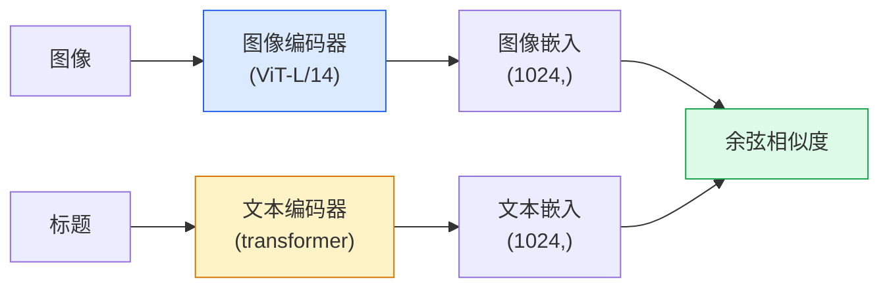

# 开放词汇视觉（Open-Vocabulary Vision）——CLIP

> 同时训练图像编码器（image encoder）和文本编码器（text encoder），使匹配的图像-标题对在共享空间中落在同一点。这就是整个技巧所在。

**类型:** 构建 + 使用  
**语言:** Python  
**先决条件:** 第4阶段第14课（ViT）、第4阶段第17课（自监督）  
**时间:** ~45分钟

## 学习目标

- 解释 CLIP 的双塔架构（two-tower architecture）和对比训练目标（contrastive training objective）  
- 使用预训练的 CLIP（或 SigLIP）进行零样本分类（zero-shot classification），无需任何特定任务训练  
- 从头实现零样本分类：编码类别提示词（class prompts），计算余弦相似度，取最大值  
- 区分 CLIP、SigLIP、OpenCLIP 和 LLaVA/LLaMA-vision 模型——以及它们在 2026 年的应用场景

## 双语术语速查

| 中文术语 | English term |
|----------|--------------|
| 开放词汇视觉 | Open-vocabulary vision |
| CLIP | Contrastive Language-Image Pretraining, CLIP |
| 双塔模型 | Two-tower model |
| 图像编码器 | Image encoder |
| 文本编码器 | Text encoder |
| 共享嵌入空间 | Shared embedding space |
| 余弦相似度 | Cosine similarity |
| 温度参数 | Temperature parameter |
| logit_scale | Logit scale |
| 零样本分类 | Zero-shot classification |
| 提示模板 | Prompt template |
| 提示集成 | Prompt ensembling |
| 开放词汇分类 | Open-vocabulary classification |
| SigLIP | Sigmoid Language Image Pretraining, SigLIP |
| OpenCLIP | OpenCLIP |
| 视觉语言模型 | Vision-Language Model, VLM |


## 问题定义

传统分类器是闭集词汇（closed-vocabulary）：一个1000类的 ImageNet 模型只能预测1000个标签。每新增一个类别都需要有标注数据和重新训练头部。

CLIP（Radford 等，OpenAI 2021）展示了在互联网上爬取的4亿（图像，标题）对上训练，可以得到一个模型，推理时可以分类任意一组用自然语言描述的类别。你通过写一句话就能给它一个新类别。

这种能力——零样本迁移（zero-shot transfer）——是现代视觉系统都以 CLIP 家族检查点开始的原因。目标检测（Grounding DINO、OWL-ViT）、分割（CLIPSeg、SAM）、检索、内容审核、视觉语言模型（VLMs）和文本生成图像都基于 CLIP 风格的联合嵌入。

## 概念

### 关键公式（Key equations）

CLIP 归一化图像和文本嵌入后，用批内对比学习最大化匹配对相似度：

$$
s_{ij} = \frac{\langle \hat{v}_i, \hat{t}_j \rangle}{\tau}
$$

$$
\mathcal{L}_{\mathrm{CLIP}} = \frac{1}{2}\left(\operatorname{CE}(s_{i,:}, i) + \operatorname{CE}(s_{:,i}, i)\right)
$$

### 双塔



两个编码器都以线性投影到相同的嵌入维度结束（CLIP-B/32为512，CLIP-L/14为1024）。进行L2归一化后计算余弦相似度。

### 目标函数（objective）

给定一个N对（图像，标题）批次，构建一个 NxN 的相似度矩阵。训练两个编码器，使得对角线上的匹配对相似度高，非对角线上的非匹配对相似度低。

```text
sim_matrix = image_embeddings @ text_embeddings.T / tau

loss_i2t = cross_entropy(sim_matrix,       targets=arange(N))
loss_t2i = cross_entropy(sim_matrix.T,     targets=arange(N))
loss = (loss_i2t + loss_t2i) / 2
```

对称（symmetric）是因为需要图像到文本和文本到图像的双向检索均有效。`tau`（温度系数 temperature）通常是一个标量参数，初始化为0.07。

### SigLIP：更优的损失函数

SigLIP（Zhai 等，2023）将 softmax 换成逐对的 sigmoid：

```text
loss = mean over pairs of log(1 + exp(-y_ij * sim_ij))
y_ij = +1 if matching, -1 otherwise
```

逐对损失去掉了 CLIP 所需的批次级别归一化。SigLIP 在小批量训练下表现更佳，且在同等数据量下能达到或超越 CLIP 的性能。

### 零样本分类

给定训练好的 CLIP：

1. 对每个类别，构造提示词："a photo of a {class}"。  
2. 用文本编码器编码所有类别提示词 -> 形状为 `T` (C, d)。  
3. 编码测试图像 -> 形状为 `I` (1, d)。  
4. 计算相似度 = `I @ T.T` (1, C)。  
5. 取最大值位置作为预测类别。

提示词设计（prompt engineering）很重要。OpenAI 发布了用于 ImageNet 的80种模板（"a photo of a {}", "a blurry photo of a {}", "a sketch of a {}" 等），对每个类别取所有模板的嵌入平均可额外提升1-3%的top-1准确率。

### 2026 年 CLIP 风格模型的应用场景

- **零样本分类** — 直接应用。  
- **图像检索** — 对所有图像进行一次编码，推理时对查询编码。  
- **文本条件检测** — Grounding DINO，OWL-ViT 把 CLIP 文本塔包裹进检测模型。  
- **文本条件分割** — CLIPSeg；SAM 通过 CLIP 输入文本提示。  
- **视觉语言模型（VLMs）** — LLaVA、Qwen-VL、InternVL 将 CLIP 家族的视觉编码器接入大型语言模型（LLM）。  
- **文本生成图像** — Stable Diffusion、DALL-E 3 以 CLIP 文本嵌入作为条件。

拥有共享嵌入空间后，所有视觉+语言任务都归结为距离计算。

## 构建它

### 第1步：一个小型双塔模型

真正的 CLIP 是 ViT + transformer。本课用两个小型 MLP 对预提取特征进行处理，实现 CPU 上可见的训练信号。

```python
import torch
import torch.nn as nn
import torch.nn.functional as F


class TwoTower(nn.Module):
    def __init__(self, img_in=128, txt_in=64, emb=64):
        super().__init__()
        self.image_proj = nn.Sequential(nn.Linear(img_in, 128), nn.ReLU(), nn.Linear(128, emb))
        self.text_proj = nn.Sequential(nn.Linear(txt_in, 128), nn.ReLU(), nn.Linear(128, emb))
        self.logit_scale = nn.Parameter(torch.ones([]) * 2.6592)  # ln(1/0.07)

    def forward(self, img_feats, txt_feats):
        i = F.normalize(self.image_proj(img_feats), dim=-1)
        t = F.normalize(self.text_proj(txt_feats), dim=-1)
        return i, t, self.logit_scale.exp()
```

两个投影，相同的输出维度，学习的温度参数。形状与真实 CLIP API 一致。

### 第2步：对比损失（contrastive loss）

```python
def clip_loss(image_emb, text_emb, logit_scale):
    N = image_emb.size(0)
    sim = logit_scale * image_emb @ text_emb.T
    targets = torch.arange(N, device=sim.device)
    l_i = F.cross_entropy(sim, targets)
    l_t = F.cross_entropy(sim.T, targets)
    return (l_i + l_t) / 2
```

对称。更高的 logit_scale 代表更尖锐的 softmax，置信度更高，但有不稳定风险。

### 第3步：零样本分类器

```python
@torch.no_grad()
def zero_shot_classify(model, image_feats, class_text_feats, class_names):
    """
    image_feats:      (N, img_in)
    class_text_feats: (C, txt_in)   一个类别一个平均嵌入
    """
    i = F.normalize(model.image_proj(image_feats), dim=-1)
    t = F.normalize(model.text_proj(class_text_feats), dim=-1)
    sim = i @ t.T
    pred = sim.argmax(dim=-1)
    return [class_names[p] for p in pred.tolist()]
```

一步一行。此即生产环境CLIP检查点使用的零样本过程。

### 第4步：完整性检查

```python
torch.manual_seed(0)
model = TwoTower()

img = torch.randn(8, 128)
txt = torch.randn(8, 64)
i, t, scale = model(img, txt)
loss = clip_loss(i, t, scale)
print(f"批大小: {i.size(0)}   损失: {loss.item():.3f}")
```

随机初始化模型的损失接近 `log(N) = log(8) = 2.08`，是对称交叉熵目标，因为尚未学习到结构。

## 使用它

OpenCLIP 是 2026 年社区默认选择：

```python
import open_clip
import torch
from PIL import Image

model, _, preprocess = open_clip.create_model_and_transforms("ViT-B-32", pretrained="laion2b_s34b_b79k")
tokenizer = open_clip.get_tokenizer("ViT-B-32")

image = preprocess(Image.open("dog.jpg")).unsqueeze(0)
text = tokenizer(["a photo of a dog", "a photo of a cat", "a photo of a car"])

with torch.no_grad():
    image_features = model.encode_image(image)
    text_features = model.encode_text(text)
    image_features = image_features / image_features.norm(dim=-1, keepdim=True)
    text_features = text_features / text_features.norm(dim=-1, keepdim=True)
    probs = (100.0 * image_features @ text_features.T).softmax(dim=-1)

print(probs)
```

SigLIP 更新，在小规模训练时效果更好，且更适合新项目：`google/siglip-base-patch16-224`。Hugging Face 两者均有提供。

## 部署它

本课产出：

- `outputs/prompt-zero-shot-class-picker.md` — 一个提示生成器，基于类别列表和领域设计零样本CLIP的类别模板。  
- `outputs/skill-image-text-retriever.md` — 一个技能模块，用任何CLIP检查点构建图像嵌入索引，支持文本查询和图像查询。

## 练习

1. **（简单）** 使用预训练 OpenCLIP ViT-B/32，在 CIFAR-10 上用80模板提示集合做零样本分类。报告 top-1 准确率，应在85-90%左右。  
2. **（中等）** 比较单模板（"a photo of a {}"）与80模板平均嵌入在相同 CIFAR-10 任务上的效果。量化差距并解释模板为何有帮助。  
3. **（困难）** 构建零样本图像检索索引：用 CLIP 嵌入1000张图片，构建 FAISS 索引，用自然语言描述查询。针对20条你手工写的查询，报告检索 recall@5。

## 关键术语

| 术语           | 人们的说法            | 实际含义                          |
|----------------|----------------------|---------------------------------|
| 两塔（Two-tower） | “双编码器”           | 分别的图像和文本编码器，输出共享维度的投影头 |
| 零样本（Zero-shot） | “无特定任务训练”       | 只用文本描述类别进行推理，不使用标签            |
| 温度 / logit_scale | “tau”                | 学习得到的标量，调整相似度矩阵的软max形状       |
| 提示模板（Prompt template） | “A photo of a {}”     | 类别名称的自然语言包装，多个模板平均提升零样本准确率 |
| CLIP           | “图像+文本模型”         | 2021年OpenAI模型；2026年领域的标准词汇          |
| SigLIP         | “Sigmoid CLIP”        | 用每对sigmoid替代softmax；小批次训练效果更好    |
| OpenCLIP       | “开源复刻”             | 社区训练的LAION基础CLIP变体，开源流水线生产默认     |
| VLM            | “视觉语言模型”           | CLIP家族编码器加上LLM，训练用来回答图像问题      |

## 深入阅读

- [CLIP: Learning Transferable Visual Models from Natural Language Supervision (Radford et al., 2021)](https://arxiv.org/abs/2103.00020)  
- [SigLIP: Sigmoid Loss for Language-Image Pre-Training (Zhai et al., 2023)](https://arxiv.org/abs/2303.15343)  
- [OpenCLIP](https://github.com/mlfoundations/open_clip) — 社区代码库  
- [DINOv2 vs CLIP vs MAE: a features comparison](https://huggingface.co/blog/dinov2) — Hugging Face 的对比用例介绍
