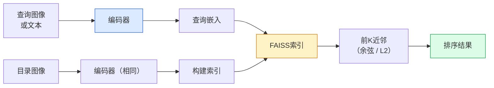

# 图像检索（Image Retrieval）与度量学习（Metric Learning）

> 检索系统（retrieval system）通过嵌入空间（embedding space）中的距离对候选项进行排序。度量学习（metric learning）是塑造该空间的学科，使距离能够表达你想要的含义。

**类型：** 构建  
**语言：** Python  
**先决条件：** 第4阶段第14课（ViT）、第4阶段第18课（CLIP）  
**时间：** ~45分钟

## 学习目标

- 解释三元组、对比（contrastive）和基于代理（proxy-based）的度量学习损失，并为给定数据集选择合适的损失函数
- 正确实现L2归一化和余弦相似度，区别“同一项”（same item）与“同一类”（same class）检索的差异
- 构建FAISS索引，通过文本和图像查询，并报告保留率recall@K在保留的查询集上的性能
- 使用DINOv2、CLIP和SigLIP作为开箱即用的嵌入骨干网络，并了解何时使用哪一个具有优势

## 双语术语速查

| 中文术语 | English term |
|----------|--------------|
| 图像检索 | Image retrieval |
| 度量学习 | Metric learning |
| 嵌入 | Embedding |
| 嵌入空间 | Embedding space |
| 最近邻搜索 | Nearest-neighbor search |
| 余弦相似度 | Cosine similarity |
| L2 归一化 | L2 normalization |
| 对比损失 | Contrastive loss |
| 三元组损失 | Triplet loss |
| 锚点/正样本/负样本 | Anchor/positive/negative |
| 边界 | Margin |
| 半难样本挖掘 | Semi-hard mining |
| 代理损失 | Proxy-based loss |
| ProxyNCA | Proxy Neighborhood Component Analysis, ProxyNCA |
| Recall@K | Recall@K |
| FAISS | Facebook AI Similarity Search, FAISS |
| HNSW | Hierarchical Navigable Small World, HNSW |


## 问题描述

检索系统在生产视觉任务中无处不在：重复检测、反向图像搜索、视觉搜索（“查找相似产品”）、人脸重识别、监控中的行人再识别、电子商务中的实例级匹配。产品问题始终如一：“给定这张查询图像，如何对我的目录进行排序。”

两个设计决策决定了整个系统：嵌入——哪个模型产生嵌入向量；索引——如何在大规模下寻找最近邻。到2026年，这两者都是现成品（使用DINOv2作为嵌入模型，FAISS作为索引库），因此难点变为：定义*什么算相似*，然后塑造嵌入空间使距离符合定义。

这种塑造就是度量学习。它是一个小而高杠杆的领域。

## 概念介绍

### 关键公式（Key equations）

检索常用 L2 归一化后的余弦相似度。三元组损失要求锚点更接近正样本而远离负样本：

$$
\operatorname{sim}(a,b) = \frac{a^\top b}{\|a\|_2\|b\|_2}
$$

$$
\mathcal{L}_{\mathrm{triplet}} = \max\left(0, d(a,p) - d(a,n) + m\right)
$$

### 检索一览



### 四类损失函数家族

| 损失 | 需要 | 优点 | 缺点 |
|------|----------|------|------|
| **对比损失（Contrastive）** | （anchor，positive）+ 负样本 | 简单，适用于任意对标签 | 若负样本不够多，收敛慢 |
| **三元组损失（Triplet）** | （anchor，positive，negative） | 直观；边界（margin）可控 | 硬三元组采样代价高 |
| **NT-Xent / InfoNCE** | 对及批量采样负样本 | 可扩展到大批量 | 需要大批量或动量队列 |
| **基于代理损失（ProxyNCA）** | 仅需类别标签 | 快速，稳定，无需采样 | 在小数据集易过拟合代理 |

绝大多数生产场景首次使用预训练骨干，只在开箱即用嵌入在测试集不佳时才添加度量学习微调。

### 三元组损失形式化表达

```text
L = max(0, ||f(a) - f(p)||^2 - ||f(a) - f(n)||^2 + margin)
```

拉近锚点`a`和正样本`p`，推远负样本`n`，`margin`确保距离间隔。三图结构可以推广到任意相似度排序。

采样很关键：简单三元组（`n`已经远离`a`）贡献零损失，只有困难三元组才能有效训练网络。半难采样（`n`比`p`远，但在margin内）是2016年FaceNet的经典方法，并仍然广泛使用。

### 余弦相似度 vs L2距离

两种度量，两个约定：

- **余弦相似度（Cosine）**：向量间角度。需要L2归一化的嵌入。
- **L2距离**：欧几里得距离。可用于原始或归一化嵌入，但通常配合L2归一化+平方L2使用。

对于大多数现代网络，它们等价：`||a - b||^2 = 2 - 2 cos(a, b)` 前提是 `||a|| = ||b|| = 1`。选择与嵌入训练匹配的度量，混用将改变“最近邻”的定义。

### Recall@K（召回率@K）

标准检索指标：

```text
recall@K = 查询集中至少有一个正确匹配出现在前K结果的查询比例
```

同时报告 recall@1、@5、@10。若recall@10 > 0.95但recall@1 < 0.5，说明嵌入空间结构合理但排序噪声较大——尝试更长时间微调或加做重排序。

重复检测中precision@K更重要，因为每个误报都是用户可见错误。视觉搜索中recall@K是产品信号。

### FAISS简介

Facebook AI Similarity Search。事实上的最近邻搜索库。三种索引选项：

- `IndexFlatIP` / `IndexFlatL2` — 直接暴力搜索，精确无训练，适用于约1百万向量以下。
- `IndexIVFFlat` — 将空间划分为K个cell，只搜索最邻近的部分cells。近似，快速，需要训练。
- `IndexHNSW` — 基于图结构，适合大量查询，索引体积大。

100k向量一般选用`IndexFlatIP`做余弦相似度搜索。10M向量用`IndexIVFFlat`。超过1亿时结合产品量化用`IndexIVFPQ`。

### 实例级 vs 类别级检索

同名但非常不同的问题：

- **类别级** — “在目录中查找猫。” 类条件相似度；开箱CLIP/DINOv2嵌入效果好。
- **实例级** — “查找*这件具体商品*。” 需要区分视觉上相似的同类物体；开箱嵌入表现不佳；度量学习微调关键。

选模型前务必明确解决的问题类型。

## 构建步骤

### 第1步：三元组损失函数

```python
import torch
import torch.nn.functional as F

def triplet_loss(anchor, positive, negative, margin=0.2):
    d_ap = F.pairwise_distance(anchor, positive, p=2)
    d_an = F.pairwise_distance(anchor, negative, p=2)
    return F.relu(d_ap - d_an + margin).mean()
```

一句话实现。可用于L2归一化或原始嵌入。

### 第2步：半难采样

给定一批嵌入和标签，找到每个锚点最困难的半难负样本。

```python
def semi_hard_negatives(emb, labels, margin=0.2):
    dist = torch.cdist(emb, emb)
    same_class = labels[:, None] == labels[None, :]
    diff_class = ~same_class
    N = emb.size(0)

    positives = dist.clone()
    positives[~same_class] = float("-inf")
    positives.fill_diagonal_(float("-inf"))
    pos_idx = positives.argmax(dim=1)

    semi_hard = dist.clone()
    semi_hard[same_class] = float("inf")
    d_ap = dist[torch.arange(N), pos_idx].unsqueeze(1)
    semi_hard[dist <= d_ap] = float("inf")
    neg_idx = semi_hard.argmin(dim=1)

    fallback_mask = semi_hard[torch.arange(N), neg_idx] == float("inf")
    if fallback_mask.any():
        hardest = dist.clone()
        hardest[same_class] = float("inf")
        neg_idx = torch.where(fallback_mask, hardest.argmin(dim=1), neg_idx)
    return pos_idx, neg_idx
```

每个锚点选择同类中最困难的正样本，以及比正样本远但在margin范围内的半难负样本。

### 第3步：Recall@K计算

```python
def recall_at_k(query_emb, gallery_emb, query_labels, gallery_labels, k=1):
    sim = query_emb @ gallery_emb.T
    _, top_k = sim.topk(k, dim=-1)
    matches = (gallery_labels[top_k] == query_labels[:, None]).any(dim=-1)
    return matches.float().mean().item()
```

L2归一化嵌入上用内积排序等价于用余弦排序。报告查询中至少有一个正确邻居的比例均值。

### 第4步：综合示例

```python
import torch
import torch.nn as nn
from torch.optim import Adam

class Encoder(nn.Module):
    def __init__(self, in_dim=128, emb_dim=64):
        super().__init__()
        self.net = nn.Sequential(
            nn.Linear(in_dim, 128), nn.ReLU(),
            nn.Linear(128, emb_dim),
        )

    def forward(self, x):
        return F.normalize(self.net(x), dim=-1)

torch.manual_seed(0)
num_classes = 6
protos = F.normalize(torch.randn(num_classes, 128), dim=-1)

def sample_batch(bs=32):
    labels = torch.randint(0, num_classes, (bs,))
    x = protos[labels] + 0.15 * torch.randn(bs, 128)
    return x, labels

enc = Encoder()
opt = Adam(enc.parameters(), lr=3e-3)

for step in range(200):
    x, y = sample_batch(32)
    emb = enc(x)
    pos_idx, neg_idx = semi_hard_negatives(emb, y)
    loss = triplet_loss(emb, emb[pos_idx], emb[neg_idx])
    opt.zero_grad(); loss.backward(); opt.step()
```

几百步后，嵌入形成每类一个簇。

## 使用指南

2026年生产架构：

- **DINOv2 + FAISS** — 通用视觉检索，开箱即用。
- **CLIP + FAISS** — 查询为文本时。
- **微调的DINOv2 + FAISS** — 实例级检索、人脸再识别、时尚、电子商务。
- **Milvus / Weaviate / Qdrant** — 基于FAISS或HNSW的托管向量数据库封装。

最先进实例检索流程：DINOv2骨干，添加嵌入头，用三元组或InfoNCE损失微调实例标注对，在FAISS中建立索引。

## 部署成果

本课产物：

- `outputs/prompt-retrieval-loss-picker.md` — 针对检索问题选择三元组/InfoNCE/ProxyNCA损失函数的提示语。
- `outputs/skill-recall-at-k-runner.md` — 规范化的recall@K评测框架，支持训练/验证/图库划分和正确数据契约。

## 练习

1. **（简单）** 运行上述示例。训练前后用PCA绘制嵌入，观察六簇形成。
2. **（中等）** 增加ProxyNCA损失实现：每类一个学习的代理，基于余弦相似度进行交叉熵计算。对比玩具数据上的收敛速度与三元组损失。
3. **（困难）** 取1000张ImageNet验证图像，用HuggingFace的DINOv2嵌入，构建FAISS平面索引。用相同图像做查询报告recall@1,5,10（应为1.0），并用保留数据集和ImageNet标签做地面真值测试。

## 关键词汇

| 术语 | 常见说法 | 实际含义 |
|------|----------|----------|
| 度量学习（Metric learning） | “塑造空间” | 训练编码器使其输出空间距离反映目标相似度 |
| 三元组损失（Triplet loss） | “拉近拉远” | L = max(0, d(a, p) - d(a, n) + margin)；经典度量学习损失 |
| 半难采样（Semi-hard mining） | “有用负样本” | 负样本距离锚点比正样本远但在margin内；实证最有效 |
| 代理损失（Proxy-based loss） | “类原型” | 每类一个学习代理；基于代理相似度算交叉熵；无需对采样 |
| Recall@K | “Top-K命中率” | 查询中前K结果包含至少一个正确项的比例 |
| 实例检索（Instance retrieval） | “找这件具体物品” | 细粒度匹配；开箱特征通常效果较差 |
| FAISS | “最近邻库” | Facebook的最近邻搜索库；支持精确和近似索引 |
| HNSW | “图索引” | 分层导航小世界图；快速近似NN，内存开销小 |

## 延伸阅读

- [FaceNet: A Unified Embedding for Face Recognition (Schroff et al., 2015)](https://arxiv.org/abs/1503.03832) — 三元组损失与半难采样论文
- [In Defense of the Triplet Loss for Person Re-Identification (Hermans et al., 2017)](https://arxiv.org/abs/1703.07737) — 三元组微调实用指南
- [FAISS文档](https://github.com/facebookresearch/faiss/wiki) — 所有索引和权衡介绍
- [SMoT: Metric Learning Taxonomy (Kim et al., 2021)](https://arxiv.org/abs/2010.06927) — 现代损失函数及关系综述
