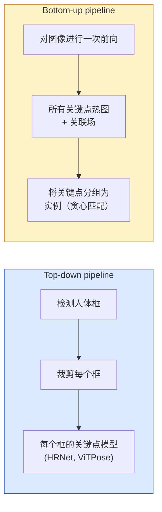

# 关键点检测（Keypoint Detection）与姿态估计（Pose Estimation）

> 姿态（pose）是一个有序关键点集合。关键点检测器（keypoint detector）是热图回归器（heatmap regressor）。其他都是辅助工作。

**类型：** 构建  
**语言：** Python  
**先决条件：** 第4阶段第06课（检测），第4阶段第07课（U-Net）  
**时长：** 约45分钟

## 学习目标

- 区分 top-down（自顶向下）和 bottom-up（自底向上）姿态估计，并说明各自的应用场景
- 使用 Gaussian-per-keypoint（每个关键点的高斯）目标回归 K 个关键点的热图，并在推理时提取关键点坐标
- 解释 Part Affinity Fields（PAFs，部件关联场）及其在 bottom-up 流水线中如何将关键点关联成实例
- 使用 MediaPipe Pose 或 MMPose 进行生产级关键点估计，并理解它们的输出格式

## 双语术语速查

| 中文术语 | English term |
|----------|--------------|
| 关键点检测 | Keypoint detection |
| 姿态估计 | Pose estimation |
| 姿态 | Pose |
| 热图 | Heatmap |
| 高斯目标 | Gaussian target |
| 自顶向下 | Top-down |
| 自底向上 | Bottom-up |
| 人体检测器 | Person detector |
| 部件关联场 | Part Affinity Field, PAF |
| 关键点分组 | Keypoint grouping |
| 物体关键点相似度 | Object Keypoint Similarity, OKS |
| HRNet | High-Resolution Network, HRNet |
| ViTPose | ViTPose |
| MediaPipe Pose | MediaPipe Pose |
| MMPose | MMPose |
| 三维姿态 | 3D pose |


## 问题描述

关键点任务以多种名称出现：人体姿态（17个关节），面部标志（68 或 478 个点），手部（21个点），动物姿态，机器人物体姿态，医学解剖标志。它们共享相同结构：检测物体上的 K 个离散点，输出它们的（x, y）坐标。

姿态估计是动作捕捉、健身应用、体育分析、手势控制、动画、增强现实试穿、机器人抓取的基础。二维情况成熟；三维姿态（从单摄像头估计世界坐标中的关节位置）是当前研究前沿。

工程问题在于规模。单张图像上的单人姿态问题耗时约 20ms。人群中的多人姿态以 30 fps 实时处理则是不同的问题，需要不同架构。

## 概念

### 关键公式（Key equations）

关键点热图通常用以真实坐标为中心的二维高斯作为监督目标：

$$
H_k(u,v) = \exp\left(-\frac{(u-x_k)^2 + (v-y_k)^2}{2\sigma^2}\right)
$$

训练时回归整张热图，推理时取最大响应位置：

$$
(\hat{x}_k, \hat{y}_k) = \arg\max_{u,v} \; \hat{H}_k(u,v)
$$

### Top-down 与 bottom-up



- **Top-down（自顶向下）** — 先检测人体，然后针对每个人体框运行关键点模型。精度最高；随人数线性扩展。  
- **Bottom-up（自底向上）** — 一次前向预测所有关键点及其关联场；完成后分组。推理时间常量，与人群大小无关。

Top-down（HRNet, ViTPose）精度领先；bottom-up（OpenPose, HigherHRNet）在人多场景下吞吐量领先。

### 热图回归

不直接回归`(x, y)`，而是为每个关键点预测一个大小为`H x W`的热图，热图中心为真实位置的高斯斑点。

```text
target[k, y, x] = exp(-((x - cx_k)^2 + (y - cy_k)^2) / (2 sigma^2))
```

推理时，每个热图的最大值索引即为预测的关键点位置。

热图优于直接回归的原因：网络的空间结构（卷积特征图）与空间输出自然对齐。高斯目标还有正则化作用——小的定位误差对应小的损失，而非零损失。

### 亚像素定位

Argmax 提供整数坐标。为获得亚像素精度，可以对最大值及其邻域拟合抛物线，或使用知名偏移量 `(dx, dy) = 0.25 * (heatmap[y, x+1] - heatmap[y, x-1], ...)` 方向微调。

### 部件关联场（PAFs）

OpenPose 用于 bottom-up 关联的技巧。对每对连接的关键点（例如左肩到左肘），预测一个 2 通道场，编码从一端指向另一端的单位向量。关联肩膀和肘部时，沿连接候选对的直线积分 PAF；积分最高的匹配成功。

```text
对于每条连接（肢体）：
  PAF 通道数：2（单位向量 x, y）
  线积分：对采样点的 (PAF · 线方向) 求和
  积分越高 = 匹配越强
```

该方法优雅且可以扩展到任意人群规模，无需逐人裁剪。

### COCO关键点

标准人体姿态数据集：每人17个关键点，使用 PCK（正确关键点百分比）和 OKS（物体关键点相似度）作为指标。OKS 是关键点的 IoU 类比，COCO mAP@OKS 汇报的主要指标。

### 2D 与 3D

- **2D姿态** — 图像坐标；生产级质量已解决（MediaPipe, HRNet, ViTPose）。
- **3D姿态** — 世界/摄像头坐标；仍在研究中。常见方法：
  - 使用小型 MLP 升维 2D 预估到 3D（VideoPose3D）。
  - 直接从图像回归 3D（PyMAF, MHFormer）。
  - 多视角设置（CMU Panoptic）获取真实标签。

## 构建步骤

### 第一步：高斯热图目标

```python
import numpy as np
import torch

def gaussian_heatmap(size, cx, cy, sigma=2.0):
    yy, xx = np.meshgrid(np.arange(size), np.arange(size), indexing="ij")
    return np.exp(-((xx - cx) ** 2 + (yy - cy) ** 2) / (2 * sigma ** 2)).astype(np.float32)

hm = gaussian_heatmap(64, 32, 32, sigma=2.0)
print(f"peak: {hm.max():.3f} at ({hm.argmax() % 64}, {hm.argmax() // 64})")
```

每个关键点热图沿通道轴堆叠构成完整目标张量。

### 第二步：微型关键点网络头

一个类似 U-Net 的模型，输出 K 通道热图。

```python
import torch.nn as nn
import torch.nn.functional as F

class TinyKeypointNet(nn.Module):
    def __init__(self, num_keypoints=4, base=16):
        super().__init__()
        self.down1 = nn.Sequential(nn.Conv2d(3, base, 3, 2, 1), nn.ReLU(inplace=True))
        self.down2 = nn.Sequential(nn.Conv2d(base, base * 2, 3, 2, 1), nn.ReLU(inplace=True))
        self.mid = nn.Sequential(nn.Conv2d(base * 2, base * 2, 3, 1, 1), nn.ReLU(inplace=True))
        self.up1 = nn.ConvTranspose2d(base * 2, base, 2, 2)
        self.up2 = nn.ConvTranspose2d(base, num_keypoints, 2, 2)

    def forward(self, x):
        h1 = self.down1(x)
        h2 = self.down2(h1)
        h3 = self.mid(h2)
        u1 = self.up1(h3)
        return self.up2(u1)
```

输入 `(N, 3, H, W)`，输出 `(N, K, H, W)`。损失为针对高斯目标的逐像素均方误差。

### 第三步：推理 — 提取关键点坐标

```python
def heatmap_to_coords(heatmaps):
    """
    heatmaps: (N, K, H, W)
    返回: (N, K, 2) 图像像素的浮点坐标
    """
    N, K, H, W = heatmaps.shape
    hm = heatmaps.reshape(N, K, -1)
    idx = hm.argmax(dim=-1)
    ys = (idx // W).float()
    xs = (idx % W).float()
    return torch.stack([xs, ys], dim=-1)

coords = heatmap_to_coords(torch.randn(2, 4, 32, 32))
print(f"coords: {coords.shape}")  # (2, 4, 2)
```

推理时一行代码完成。亚像素精度可在 argmax 附近插值实现。

### 第四步：合成关键点数据集

简单做法：在白色画布上画四个点，学习预测它们的位置。

```python
def make_synthetic_sample(size=64):
    img = np.ones((3, size, size), dtype=np.float32)
    rng = np.random.default_rng()
    kps = rng.integers(8, size - 8, size=(4, 2))
    for cx, cy in kps:
        img[:, cy - 2:cy + 2, cx - 2:cx + 2] = 0.0
    hms = np.stack([gaussian_heatmap(size, cx, cy) for cx, cy in kps])
    return img, hms, kps
```

足够简单，微型模型几分钟即可学会。

### 第五步：训练

```python
model = TinyKeypointNet(num_keypoints=4)
opt = torch.optim.Adam(model.parameters(), lr=3e-3)

for step in range(200):
    batch = [make_synthetic_sample() for _ in range(16)]
    imgs = torch.from_numpy(np.stack([b[0] for b in batch]))
    hms = torch.from_numpy(np.stack([b[1] for b in batch]))
    pred = model(imgs)
    # 上采样预测热图到 full resolution
    pred = F.interpolate(pred, size=hms.shape[-2:], mode="bilinear", align_corners=False)
    loss = F.mse_loss(pred, hms)
    opt.zero_grad(); loss.backward(); opt.step()
```

## 实际应用

- **MediaPipe Pose** — 谷歌生产级姿态估计器；提供 WebGL 和移动设备运行时，延迟低于10ms。  
- **MMPose**（OpenMMLab）— 研究代码库；涵盖所有 SOTA 架构并提供预训练权重。  
- **YOLOv8-pose** — 单次前向实现最快的实时多人姿态。  
- **transformers HumanDPT / PoseAnything** — 新兴的视觉-语言结合方法，实现开放词汇姿态（任何物体、任何关键点集）。

## 输出内容

本课产出：

- `outputs/prompt-pose-stack-picker.md` — 依据延迟、人群规模、2D 与 3D 需求，选择 MediaPipe / YOLOv8-pose / HRNet / ViTPose 的提示。  
- `outputs/skill-heatmap-to-coords.md` — 实现亚像素热图到坐标转换的技能代码，适用于所有生产级姿态模型。

## 练习

1. **（简单）** 在合成4点数据集上训练微型关键点模型。报告200步后的预测与真实关键点的平均 L2 误差。  
2. **（中等）** 添加亚像素微调：基于 argmax 位置，使用邻域像素拟合一维抛物线，分别沿 x 和 y 调整。报告相较整数 argmax 的精度提升。  
3. **（困难）** 构造包含两个人实例的合成数据集。训练一个带 PAF 的 bottom-up 流水线，以预测关键点属于哪个实例，并评估 OKS。

## 关键术语

| 术语 | 一般说法 | 实际含义 |
|------|----------|----------|
| Keypoint（关键点） | “一个标志点” | 物体上的特定有序点（关节、角点、特征） |
| Pose（姿态） | “骨架” | 属于一个实例的有序关键点集合 |
| Top-down（自顶向下） | “先检测再估计” | 两阶段流水线：人体检测器 + 每个框关键点模型；精度最高 |
| Bottom-up（自底向上） | “先估计再分组” | 单次前向预测所有关键点并分组；推理时间与人数无关 |
| Heatmap（热图） | “高斯目标” | 每个关键点对应的 H×W 张量，峰值在真实位置；首选回归目标 |
| PAF（部件关联场） | “Part Affinity Field” | 2通道单位向量场，编码肢体方向；用于关键点分组 |
| OKS（物体关键点相似度） | “关键点 IoU” | COCO 上的关键点标准指标 |
| HRNet（高分辨率网络） | “High-Resolution Net” | 主流自顶向下关键点架构；保持高分辨率特征 |

## 深入阅读

- [OpenPose（Cao 等，2017）](https://arxiv.org/abs/1812.08008) — bottom-up 与 PAF ；仍是该方法的最佳论文讲解  
- [HRNet（Sun 等，2019）](https://arxiv.org/abs/1902.09212) — 自顶向下参考架构  
- [ViTPose（Xu 等，2022）](https://arxiv.org/abs/2204.12484) — 纯 ViT 作为姿态骨干；当前多项基准最优  
- [MediaPipe Pose](https://developers.google.com/mediapipe/solutions/vision/pose_landmarker) — 生产级实时姿态；2026年最快部署栈
