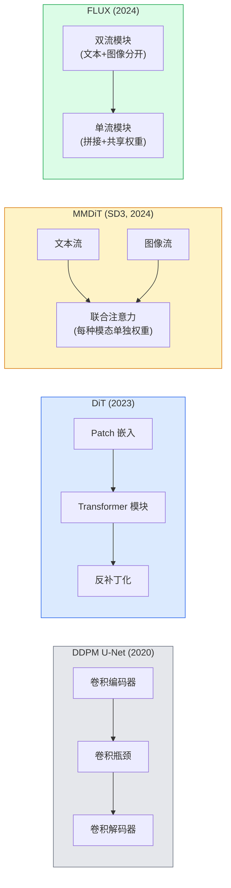

# 扩散 Transformer（Diffusion Transformers）与整流流（Rectified Flow）

> U-Net 不是扩散的秘密。用 Transformer 替代它，用直线流（rectified flow）替换噪声调度，瞬间诞生了 SD3、FLUX 以及所有 2026 年的文本生成图像模型。

**类型：** 学习 + 构建  
**语言：** Python  
**先修知识：** 第4阶段第10课（扩散 DDPM）、第4阶段第14课（ViT）、第7阶段第02课（自注意力）  
**时长：** 约75分钟

## 学习目标

- 追踪从 U-Net DDPM（第10课）到 Diffusion Transformer（DiT）、MMDiT（SD3）以及单流+双流 DiT（FLUX）的演变  
- 解释 rectified flow（整流流）：为何噪声与数据间的直线路径让模型能用20步而非1000步进行采样  
- 实现一个小型 DiT 模块和一个 rectified-flow 训练循环，两者均在100行代码以内  
- 按架构、参数数量与授权区分模型变体（SD3、FLUX.1-dev、FLUX.1-schnell、Z-Image、Qwen-Image）

## 双语术语速查

| 中文术语 | English term |
|----------|--------------|
| 扩散 Transformer | Diffusion Transformer, DiT |
| 整流流 | Rectified Flow |
| 流匹配 | Flow matching |
| 速度场 | Velocity field |
| 直线路径 | Straight-line path |
| 噪声到数据路径 | Noise-to-data path |
| 补丁嵌入 | Patch embedding |
| 反补丁化 | Unpatchify |
| AdaLN 条件 | Adaptive LayerNorm conditioning, AdaLN |
| 多模态 DiT | Multimodal DiT, MMDiT |
| 单流/双流 | Single-stream / dual-stream |
| 采样步数 | Sampling steps |
| 文本到图像 | Text-to-image |
| SD3 | Stable Diffusion 3, SD3 |
| FLUX | FLUX |
| Qwen-Image | Qwen-Image |


## 问题背景

第10课构建了带有 U-Net 去噪器的 DDPM。该套路于2020-2023年主导：U-Net + beta调度 + 噪声预测损失。它产出了 Stable Diffusion 1.5 和 2.1 以及 DALL-E 2。

到了2026年，所有领先的文本生成图像模型都跳出了这一框架。Stable Diffusion 3、FLUX、SD4、Z-Image、Qwen-Image、Hunyuan-Image——均不使用 U-Net，而是采用 Diffusion Transformers（DiT）。SD3 和 FLUX 还用 rectified flow 替换了 DDPM 的噪声调度，使从噪声到数据的路径变直，支持 1-4 步推理且结果一致，或使用精炼变体。

这一转变关键在于它让基于扩散的图像生成变得可控、提示精确（SD3/SD4 解决了文本渲染问题）、且产出速度快。理解 DiT + rectified flow 就等于理解2026年的生成图像堆栈。

## 概念解析

### 关键公式（Key equations）

整流流把噪声 $x_0$ 与数据 $x_1$ 用直线路径连接，模型学习路径上的速度场：

$$
x_t = (1-t)x_0 + t x_1
$$

$$
v^*(x_t,t) = x_1 - x_0, \qquad \mathcal{L}_{\mathrm{RF}} = \mathbb{E}_{t,x_0,x_1}\left[\left\|v_\theta(x_t,t) - (x_1-x_0)\right\|_2^2\right]
$$

### 从 U-Net 到 Transformer



- **DiT**（Peebles & Xie, 2023）— 用类似 ViT 的 Transformer 替代 U-Net，对潜在补丁进行建模。使用自适应层归一化（AdaLN）进行条件控制。  
- **MMDiT**（SD3，Esser 等，2024）— 两个流，文本和图像 token 分别使用独立权重，通过联合注意力机制共享信息。  
- **FLUX**（Black Forest Labs，2024）— 前 N 个模块为双流类似 SD3，后续模块则拼接输入共享权重形成单流，提升深层效率。  
- **Z-Image**（2025）— 一种6B参数的高效单流 DiT，挑战“一味追求规模”的思路。

### 一句话理解 rectified flow

DDPM 把正向过程定义为一个带噪声的随机微分方程（SDE），其中 `x_t` 被逐步腐蚀。逆向过程是另一个 SDE，通过1000小步解决。

Rectified flow 定义了数据清洁样本与纯噪声间的**直线路径插值**：

```text
x_t = (1 - t) * x_0 + t * epsilon,     t ∈ [0, 1]
```

训练网络去预测速度 `v_theta(x_t, t) = epsilon - x_0`——即沿着从干净数据到噪声的直线路径的前进方向（`dx_t/dt`）。采样时，向后积分速度，从噪声朝数据逼近。由此产生的微分方程更接近直线，所需积分步数大幅减少。

SD3 称之为**整流流匹配（Rectified Flow Matching）**。FLUX、Z-Image 和大部分 2026 模型采用相同目标。典型推理步骤：20-30步欧拉积分（确定性），相比旧 DDPM 制度中 50+ 步 DDIM 大幅减少。精炼 / turbo / schnell / LCM 变体能降至1-4步。

### AdaLN 条件控制

DiT 通过**自适应层归一化**（AdaLN）对时间步和类别/文本进行条件化：从条件向量预测 `scale` 和 `shift`，在 LayerNorm 后应用它们。比 U-Net 里的 FiLM 式调制更干净，也是所有现代 DiT 的默认。

```text
cond -> MLP -> (scale, shift, gate)
norm(x) * (1 + scale) + shift，然后残差相加 * gate
```

### SD3 和 FLUX 中的文本编码器

- **SD3** 使用三种文本编码器：两个 CLIP 模型 + T5-XXL。嵌入拼接后作为文本条件输入图像路径。  
- **FLUX** 使用一个 CLIP-L + T5-XXL。  
- **Qwen-Image/Z-Image** 变体用自家内置文本编码器，和其基础的大型语言模型（LLM）对齐。

文本编码器是 SD3/FLUX 在提示理解上大幅优于 SD1.5 的重要原因。仅 T5-XXL 就有47亿参数。

### 无监督引导依然有效

整流流只改变采样器，不变条件机制。无监督引导策略（训练时随机丢弃文本条件10%，推理时混合有条件与无条件预测）同样适用于整流流。大多数 2026 模型引导尺度为 3.5-5，低于 SD1.5 的 7.5，因为整流流模型默认更贴合提示。

### Consistency, Turbo, Schnell, LCM

四种说法，都是将慢速多步模型蒸馏为快速少步模型的同一思路。

- **LCM（Latent Consistency Model）** — 训练一个学生网络，能从任意中间状态 `x_t` 一步预测最终 `x_0`。  
- **SDXL Turbo / FLUX schnell** — 1-4步的模型，采用对抗扩散蒸馏训练。  
- **SD Turbo** — OpenAI 风格的 Consistency Models，适配潜变量扩散。

任何新模型的上线都会同时提供“全质量”检查点和“turbo/schnell”精简版。Schnell（德语意为“快”，Black Forest Labs习惯用）在1-4步内运行，适合实时流水线。

### 2026年模型格局

| 模型 | 规模 | 架构 | 许可证 |
|-------|------|--------------|---------|
| Stable Diffusion 3 Medium | 20亿 | MMDiT | SAI Community |
| Stable Diffusion 3.5 Large | 80亿 | MMDiT | SAI Community |
| FLUX.1-dev | 120亿 | 双流 + 单流 DiT | 非商业 |
| FLUX.1-schnell | 120亿 | 同上，精炼版 | Apache 2.0 |
| FLUX.2 | — | 迭代版 FLUX.1 | 混合 |
| Z-Image | 60亿 | S3-DiT（可扩展单流） | 宽松 |
| Qwen-Image | 约200亿 | DiT + Qwen 文本塔 | Apache 2.0 |
| Hunyuan-Image-3.0 | 约800亿 | DiT | 研究用途 |
| SD4 Turbo | 30亿 | DiT + 蒸馏 | SAI 商业版 |

FLUX.1-schnell 是 2026 年的开源默认。Z-Image 是高效表现王者。FLUX.2 和 SD4 是当前质量顶尖。

### 为什么这次阶段跃迁重要

DDPM + U-Net 能用。DiT + rectified flow 更**优、更快、更易扩展**。这转变类似 NLP 中从 RNN 到 Transformer 的飞跃——两者解决的都是同一问题，但 Transformer 能规模化，如今全面统治。每篇 2026 年的图像、视频或 3D 生成论文都使用 DiT 形态的去噪器，且多采用整流流目标。U-Net DDPM 现主要用于教学（第10课）。

## 构建实践

### 第一步：带 AdaLN 的 DiT 模块

```python
import torch
import torch.nn as nn


class AdaLNZero(nn.Module):
    """
    带门控的自适应 LayerNorm。由条件预测 (scale, shift, gate)。
    初始化使整个模块从恒等映射开始（“零初始化”）。
    """

    def __init__(self, dim, cond_dim):
        super().__init__()
        self.norm = nn.LayerNorm(dim, elementwise_affine=False)
        self.mlp = nn.Linear(cond_dim, dim * 3)
        nn.init.zeros_(self.mlp.weight)
        nn.init.zeros_(self.mlp.bias)

    def forward(self, x, cond):
        scale, shift, gate = self.mlp(cond).chunk(3, dim=-1)
        h = self.norm(x) * (1 + scale.unsqueeze(1)) + shift.unsqueeze(1)
        return h, gate.unsqueeze(1)


class DiTBlock(nn.Module):
    def __init__(self, dim=192, heads=3, mlp_ratio=4, cond_dim=192):
        super().__init__()
        self.adaln1 = AdaLNZero(dim, cond_dim)
        self.attn = nn.MultiheadAttention(dim, heads, batch_first=True)
        self.adaln2 = AdaLNZero(dim, cond_dim)
        self.mlp = nn.Sequential(
            nn.Linear(dim, dim * mlp_ratio),
            nn.GELU(),
            nn.Linear(dim * mlp_ratio, dim),
        )

    def forward(self, x, cond):
        h, gate1 = self.adaln1(x, cond)
        a, _ = self.attn(h, h, h, need_weights=False)
        x = x + gate1 * a
        h, gate2 = self.adaln2(x, cond)
        x = x + gate2 * self.mlp(h)
        return x
```

`AdaLNZero` 以恒等映射开始，因为它的 MLP 权重初始化为零。训练过程中会将模块逐步移动出恒等，这大大稳定了深层 Transformer 扩散模型。

### 第二步：一个小型 DiT

```python
def timestep_embedding(t, dim):
    import math
    half = dim // 2
    freqs = torch.exp(-math.log(10000) * torch.arange(half, device=t.device) / half)
    args = t[:, None].float() * freqs[None]
    return torch.cat([args.sin(), args.cos()], dim=-1)


class TinyDiT(nn.Module):
    def __init__(self, image_size=16, patch_size=2, in_channels=3, dim=96, depth=4, heads=3):
        super().__init__()
        self.patch_size = patch_size
        self.num_patches = (image_size // patch_size) ** 2
        self.patch = nn.Conv2d(in_channels, dim, kernel_size=patch_size, stride=patch_size)
        self.pos = nn.Parameter(torch.zeros(1, self.num_patches, dim))
        self.time_mlp = nn.Sequential(
            nn.Linear(dim, dim * 2),
            nn.SiLU(),
            nn.Linear(dim * 2, dim),
        )
        self.blocks = nn.ModuleList([DiTBlock(dim, heads, cond_dim=dim) for _ in range(depth)])
        self.norm_out = nn.LayerNorm(dim, elementwise_affine=False)
        self.head = nn.Linear(dim, patch_size * patch_size * in_channels)

    def forward(self, x, t):
        n = x.size(0)
        x = self.patch(x)
        x = x.flatten(2).transpose(1, 2) + self.pos
        t_emb = self.time_mlp(timestep_embedding(t, self.pos.size(-1)))
        for blk in self.blocks:
            x = blk(x, t_emb)
        x = self.norm_out(x)
        x = self.head(x)
        return self._unpatchify(x, n)

    def _unpatchify(self, x, n):
        p = self.patch_size
        h = w = int(self.num_patches ** 0.5)
        x = x.view(n, h, w, p, p, -1).permute(0, 5, 1, 3, 2, 4).reshape(n, -1, h * p, w * p)
        return x
```

### 第三步：rectified flow 训练

```python
import torch.nn.functional as F

def rectified_flow_train_step(model, x0, optimizer, device):
    model.train()
    x0 = x0.to(device)
    n = x0.size(0)
    t = torch.rand(n, device=device)
    epsilon = torch.randn_like(x0)
    x_t = (1 - t[:, None, None, None]) * x0 + t[:, None, None, None] * epsilon

    target_velocity = epsilon - x0
    pred_velocity = model(x_t, t)

    loss = F.mse_loss(pred_velocity, target_velocity)
    optimizer.zero_grad()
    loss.backward()
    optimizer.step()
    return loss.item()
```

与 DDPM 的噪声预测损失（第10课）相比：结构相同，目标不同。不是预测噪声 `epsilon`，而是预测从数据到噪声沿直线插值方向的**速度** `epsilon - x_0`。

### 第4步：Euler采样器

Rectified flow 是一个常微分方程（ODE）。Euler 方法是最简单的，对于训练良好的 rectified-flow 模型，在20步以上时，精度几乎与更高阶求解器相当。

```python
@torch.no_grad()
def rectified_flow_sample(model, shape, steps=20, device="cpu"):
    model.eval()
    x = torch.randn(shape, device=device)
    dt = 1.0 / steps
    t = torch.ones(shape[0], device=device)
    for _ in range(steps):
        v = model(x, t)
        x = x - dt * v
        t = t - dt
    return x
```

20步。在训练模型上，这会生成与1000步DDPM相媲美的样本。

### 第5步：端到端冒烟测试

```python
import numpy as np

def synthetic_blobs(num=200, size=16, seed=0):
    rng = np.random.default_rng(seed)
    out = np.zeros((num, 3, size, size), dtype=np.float32)
    yy, xx = np.meshgrid(np.arange(size), np.arange(size), indexing="ij")
    for i in range(num):
        cx, cy = rng.uniform(4, size - 4, size=2)
        r = rng.uniform(2, 4)
        mask = (xx - cx) ** 2 + (yy - cy) ** 2 < r ** 2
        colour = rng.uniform(-1, 1, size=3)
        for c in range(3):
            out[i, c][mask] = colour[c]
    return torch.from_numpy(out)
```

用 rectified flow 在此数据集上训练一个 `TinyDiT`。经过500步采样，输出应当看起来像是颜色淡淡的斑点。

## 使用它

对于使用 FLUX / SD3 / Z-Image 的真实图像生成，`diffusers` 提供统一的API：

```python
from diffusers import FluxPipeline, StableDiffusion3Pipeline
import torch

pipe = FluxPipeline.from_pretrained(
    "black-forest-labs/FLUX.1-schnell",
    torch_dtype=torch.bfloat16,
).to("cuda")

out = pipe(
    prompt="a golden retriever surfing a tsunami, hyperrealistic, studio lighting",
    guidance_scale=0.0,           # schnell 在没有CFG下训练
    num_inference_steps=4,
    max_sequence_length=256,
).images[0]
out.save("surf.png")
```

三行代码。`FLUX.1-schnell` 仅用四步。用 `black-forest-labs/FLUX.1-dev` 替换模型 ID，可在20-30步配合CFG获得更高质量。

SD3示例：

```python
pipe = StableDiffusion3Pipeline.from_pretrained(
    "stabilityai/stable-diffusion-3.5-large",
    torch_dtype=torch.bfloat16,
).to("cuda")
out = pipe(prompt, guidance_scale=3.5, num_inference_steps=28).images[0]
```

## 交付成品

本课输出：

- `outputs/prompt-dit-model-picker.md` — 在质量、延迟和许可证限制下，选择 SD3、FLUX.1-dev、FLUX.1-schnell、Z-Image、SD4 Turbo 模型。
- `outputs/skill-rectified-flow-trainer.md` — 编写完整的使用 AdaLN DiT 和 Euler 采样的 rectified flow 训练循环。

## 练习

1. **（简单）** 使用上述合成斑点数据集训练 TinyDiT 500步。比较不同 Euler 步数（10、20、50）下生成的样本差异。
2. **（中等）** 通过将学习的类别嵌入拼接到时间嵌入中，为合成斑点数据添加文本条件（10个颜色类别）。在类别0、5和9下采样，验证颜色是否匹配。
3. **（困难）** 计算采用相同数据、相同训练步数的 rectified-flow 和 DDPM 版本同规模网络生成样本之间的 Fréchet 距离（FID 近似）。汇报哪种方法收敛更快。

## 关键词汇

| 术语           | 俗称                     | 实际含义                                             |
|----------------|--------------------------|------------------------------------------------------|
| DiT            | “Diffusion transformer”  | 以Transformer替代U-Net作为扩散去噪器；对补丁化潜变量操作 |
| AdaLN          | “Adaptive layer norm”    | 通过学习的scale、shift、gate在LayerNorm后进行时间/文本条件调节；现代DiT标准配置 |
| MMDiT          | “Multi-modal DiT (SD3)” | 针对文本和图像token分别使用不同权重流，但共享联合自注意力机制 |
| Single-stream / double-stream | “FLUX trick”      | 前N个模块为双流（每模态独立权重），后续模块为单流（拼接+共享权重），提高效率 |
| Rectified flow | “Straight-line noise-to-data” | 数据与噪声间的线性插值；网络预测速度；推理时需要更少ODE步数 |
| Velocity target| “epsilon - x_0”          | rectified flow中的回归目标，指向从干净数据到噪声的向量 |
| CFG guidance   | “classifier-free guidance” | 混合条件与无条件预测；仍被用于 rectified-flow 模型 |
| Schnell / turbo / LCM | “1-4 step distillation” | 从高质量模型蒸馏出来的小步数版本；面向生产实时推理 |

## 延伸阅读

- [Scalable Diffusion Models with Transformers (Peebles & Xie, 2023)](https://arxiv.org/abs/2212.09748) — DiT 论文
- [Scaling Rectified Flow Transformers (Esser et al., SD3 paper)](https://arxiv.org/abs/2403.03206) — MMDiT 和 rectified-flow 的大规模扩展
- [FLUX.1 model card and technical report (Black Forest Labs)](https://huggingface.co/black-forest-labs/FLUX.1-dev) — 双流与单流细节
- [Z-Image: Efficient Image Generation Foundation Model (2025)](https://arxiv.org/html/2511.22699v1) — 6B参数单流 DiT
- [Elucidating the Design Space of Diffusion (Karras et al., 2022)](https://arxiv.org/abs/2206.00364) — 所有扩散设计权衡的参考资料
- [Latent Consistency Models (Luo et al., 2023)](https://arxiv.org/abs/2310.04378) — LCM-LoRA 如何实现4步推理
