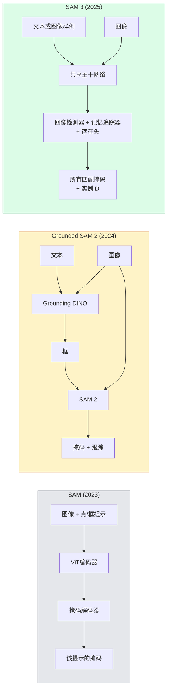

# SAM 3 与开放词汇分割（Open-Vocabulary Segmentation）

> 给模型一个文本提示（text prompt）和一张图片，得到所有匹配对象的掩码（masks）。SAM 3 实现了一次前向传递完成这个任务。

**类型：** 使用 + 构建  
**语言：** Python  
**先决条件：** 第四阶段第07课（U-Net）、第四阶段第08课（Mask R-CNN）、第四阶段第18课（CLIP）  
**时间：** 约60分钟

## 学习目标

- 区分 SAM（仅视觉提示）、Grounded SAM / SAM 2（检测器 + SAM）和 SAM 3（通过可提示概念分割的原生文本提示）
- 解释 SAM 3 架构：共享主干网络 + 图像检测器 + 基于记忆的视频追踪器 + 存在头 + 解耦检测器-追踪器设计
- 使用 Hugging Face `transformers` SAM 3 集成进行文本提示的检测、分割和视频追踪
- 根据延迟、概念复杂度和部署目标选择 SAM 3、Grounded SAM 2、YOLO-World 和 SAM-MI

## 双语术语速查

| 中文术语 | English term |
|----------|--------------|
| 开放词汇分割 | Open-vocabulary segmentation |
| SAM 3 | Segment Anything Model 3, SAM 3 |
| 可提示概念分割 | Promptable Concept Segmentation, PCS |
| 概念提示 | Concept prompt |
| 文本提示 | Text prompt |
| 图像示例提示 | Image-example prompt |
| 存在头 | Presence head |
| 共享主干网络 | Shared backbone |
| 图像检测器 | Image detector |
| 视频追踪器 | Video tracker |
| 记忆库 | Memory bank |
| 对象多路复用 | Object Multiplex |
| 解耦检测器-追踪器 | Decoupled detector-tracker |
| YOLO-World | YOLO-World |
| Grounded SAM | Grounded SAM |
| SAM-MI | SAM-MI |
| 稀疏点提示 | Sparse point prompting |


## 问题描述

2023年的 SAM 是一个仅支持视觉提示的模型：你点击一个点或画一个框，它返回一个掩码。对于“给我这张照片中所有的橙子”这类需求，需要一个检测器（如 Grounding DINO）生成框，再用 SAM 对每个框进行分割。Grounded SAM 把这变成了一个流水线，但它是两个冻结模型的级联，不可避免地产生误差累积。

SAM 3（Meta，2025年11月，ICLR 2026）将级联合并到一起。它接受一个简短的名词短语或图像样例作为提示，并一次前向传递返回所有匹配的掩码和实例 ID。这就是**可提示概念分割（Promptable Concept Segmentation, PCS）**。结合2026年3月的对象多路复用更新（SAM 3.1），它能高效地跟踪视频中同一概念的多个实例。

本课重点介绍这种结构上的转变。二维分割、检测和文本-图像对齐合成一个模型。生产环境下的问题不再是“我要串联哪些流水线”，而是“哪个可提示模型能端到端满足我的需求”。

## 概念

### 关键公式（Key equations）

开放词汇分割通常把文本概念嵌入与像素或区域嵌入做相似度匹配，再转成存在概率：

$$
s_{u,v,c} = \frac{\langle \hat{f}_{u,v}, \hat{e}_c \rangle}{\tau}
$$

$$
p_{u,v,c} = \sigma(s_{u,v,c})
$$

其中 $\hat{f}_{u,v}$ 是像素特征，$\hat{e}_c$ 是文本概念特征。

### 三代模型



### 可提示概念分割

“概念提示”是一个短的名词短语（如 `"yellow school bus"`、“黄色校车”； `"striped red umbrella"`、“有条纹的红伞”； `"hand holding a mug"`、“手拿杯子”）或者一个图像样例。模型返回图像中所有匹配该概念的实例分割掩码，并给出每个匹配的唯一实例 ID。

这与经典的视觉提示 SAM 有三点不同：

1. 不需要对每个实例单独提示 — 一个文本提示返回所有匹配。
2. 开放词汇 — 概念可以是任何自然语言描述的内容。
3. 一次返回多个实例的掩码，而非每个提示只返回一个掩码。

### 关键架构组件

- **共享主干网络** — 单个 ViT 处理图像。检测器头与基于记忆的追踪器都从中读取特征。
- **存在头** — 预测图像中是否存在该概念。将“这里有吗？”与“在哪里？”解耦，减少不存在概念时的误检。
- **解耦检测器-追踪器** — 图像级检测和视频级跟踪分别有独立头部，避免互相干扰。
- **记忆库** — 存储跨帧的每个实例特征，用于视频追踪（与 SAM 2 使用机制相同）。

### 大规模训练

SAM 3 在由 AI + 人工复核迭代注释和校正出的数据引擎生成的**400万个独特概念**上训练。新的 **SA-CO 基准**包含270K独特概念，是之前基准的50倍。SAM 3 在 SA-CO 上达到人类表现的75%—80%，并且在图像 + 视频 PCS 上比现有系统提升一倍。

### SAM 3.1 对象多路复用

2026年3月更新：**对象多路复用（Object Multiplex）** 引入共享记忆机制，支持一次性多实例联合跟踪。之前跟踪 N 个实例意味着 N 个独立的记忆库。多路复用将其合并成一个共享记忆，使用每实例查询。结果：多目标跟踪大幅加速且不牺牲准确率。

### 2026年 Grounded SAM 仍然重要的场景

- 需要替换特定开放词汇检测器（如 DINO-X、Florence-2）时。
- SAM 3 授权（受限于 Hugging Face）成阻碍时。
- 需要比 SAM 3 提供的检测阈值更灵活的控制时。
- 用于检测器组件的研究/消融实验时。

模块化流水线依然有市场。对于大多数生产工作，SAM 3 是更简洁的选择。

### YOLO-World 与 SAM 3 的对比

- **YOLO-World** — 仅开放词汇检测器（无掩码）。实时性能优异。适合需要高帧率框检测时使用。
- **SAM 3** — 完整分割 + 跟踪。速度较慢，但输出更丰富。

生产环境主要分工：YOLO-World 用于快速纯检测流水线（如机器人导航、快速仪表盘），SAM 3 用于需要掩码或跟踪的场景。

### SAM-MI 效率优化

SAM-MI（2025-2026）解决 SAM 解码瓶颈。关键思想：

- **稀疏点提示** — 使用少量精选点替代密集提示，减少96%解码器调用次数。
- **浅层掩码聚合** — 将粗糙掩码预测合并为更锐利的掩码。
- **解耦掩码注入** — 解码器接收预计算的掩码特征，而非重新运行。

效果：在开放词汇基准上，相比 Grounded SAM 提升约1.6倍速度。

### 三个模型的输出格式

都返回相同的通用结构（框 + 标签 + 分数 + 掩码 + ID），方便下游流水线无需根据模型切换代码。

## 构建

### 第1步：提示构造

构建辅助函数，将用户句子拆分为 SAM 3 概念提示列表。这是“用户输入”与“模型消费”之间的边界。

```python
def split_concepts(sentence):
    """
    多概念提示的启发式拆分器。
    返回短名词短语列表。
    """
    for sep in [",", ";", "and", "or", "&"]:
        if sep in sentence:
            parts = [p.strip() for p in sentence.replace("and ", ",").split(",")]
            return [p for p in parts if p]
    return [sentence.strip()]

print(split_concepts("cats, dogs and balloons"))
```

SAM 3 每次前向传递只接受一个概念；多概念查询需循环或批处理。

### 第2步：后处理辅助

将 SAM 3 的原始输出转换为符合第四阶段第16课流水线接口的检测列表。

```python
from dataclasses import dataclass
from typing import List

@dataclass
class ConceptDetection:
    concept: str
    instance_id: int
    box: tuple          # (x1, y1, x2, y2)
    score: float
    mask_rle: str       # 运行长度编码 (RLE)


def rle_encode(binary_mask):
    flat = binary_mask.flatten().astype("uint8")
    runs = []
    prev, count = flat[0], 0
    for v in flat:
        if v == prev:
            count += 1
        else:
            runs.append((int(prev), count))
            prev, count = v, 1
    runs.append((int(prev), count))
    return ";".join(f"{v}x{c}" for v, c in runs)
```

RLE 保持响应负载较小，即使是许多高分辨率掩码也适用。此格式兼容 SAM 2、SAM 3 和 Grounded SAM 2。

### 第3步：统一开放词汇分割接口

将任何后端（SAM 3、Grounded SAM 2、YOLO-World + SAM 2）都封装到统一方法下。后续代码不因后端更换而变化。

```python
from abc import ABC, abstractmethod
import numpy as np

class OpenVocabSeg(ABC):
    @abstractmethod
    def detect(self, image: np.ndarray, concept: str) -> List[ConceptDetection]:
        ...


class StubOpenVocabSeg(OpenVocabSeg):
    """
    确定性存根，用于未加载真实模型时的流水线测试。
    """
    def detect(self, image, concept):
        h, w = image.shape[:2]
        return [
            ConceptDetection(
                concept=concept,
                instance_id=0,
                box=(w * 0.2, h * 0.3, w * 0.5, h * 0.8),
                score=0.89,
                mask_rle="0x100;1x50;0x200",
            ),
            ConceptDetection(
                concept=concept,
                instance_id=1,
                box=(w * 0.55, h * 0.25, w * 0.85, h * 0.75),
                score=0.74,
                mask_rle="0x80;1x40;0x220",
            ),
        ]
```

真正的 `SAM3OpenVocabSeg` 子类会包装 `transformers.Sam3Model` 和 `Sam3Processor`。

### 第4步：Hugging Face SAM 3 使用方法（参考）

实际模型的 `transformers` 集成：

```python
from transformers import Sam3Processor, Sam3Model
import torch

processor = Sam3Processor.from_pretrained("facebook/sam3")
model = Sam3Model.from_pretrained("facebook/sam3").eval()

inputs = processor(images=pil_image, return_tensors="pt")
inputs = processor.set_text_prompt(inputs, "yellow school bus")

with torch.no_grad():
    outputs = model(**inputs)

masks = processor.post_process_masks(
    outputs.masks, inputs.original_sizes, inputs.reshaped_input_sizes
)
boxes = outputs.boxes
scores = outputs.scores
```

一次提示，返回所有匹配结果。

### 第5步：衡量用 SAM 3 替换 Grounded SAM 2 的效果

一个真实的基准测试：将 Grounded SAM 2 替换成 SAM 3 后流水线表现如何？

- 延迟：SAM 3 省去一次前向传递（无独立检测器），但模型更重；通常净效应持平或略有加速。
- 准确率：SAM 3 在罕见或复合概念（如“有条纹的红伞”）上显著更好；日常单词概念表现相似。
- 灵活性：Grounded SAM 2 可替换检测器（DINO-X, Florence-2, Grounding DINO 1.5），SAM 3 是单体模型。

结论：SAM 3 是2026年开放词汇分割的默认选择。当需要检测器灵活性或不同授权时，Grounded SAM 2 仍然是合适方案。

## 使用

生产部署模式：

- **实时标注** — SAM 3 + CVAT的文本提示标签功能。标注人员选择标签名称，SAM 3 预标注所有匹配实例，人工复核和修正。
- **视频分析** — SAM 3.1 对象多路复用实现多目标追踪；将视频帧输入基于记忆的追踪器。
- **机器人** — SAM 3 用于开放词汇操作（“拿起红杯”）；作为规划原语运行。
- **医疗影像** — SAM 3 微调医疗概念；需在 HF 上申请访问权限。

Ultralytics 在其 Python 包中封装了 SAM 3：

```python
from ultralytics import SAM

model = SAM("sam3.pt")
results = model(image_path, prompts="yellow school bus")
```

同 YOLO 和 SAM 2 具有相同接口。

## 交付成果

本课内容产出：

- `outputs/prompt-open-vocab-stack-picker.md` — 一个根据延迟、概念复杂度和许可选择 SAM 3 / Grounded SAM 2 / YOLO-World / SAM-MI 的提示。
- `outputs/skill-concept-prompt-designer.md` — 一个技能，将用户语句转换为格式良好的 SAM 3 概念提示（拆分、消歧、回退）。

## 练习

1. **（简单）** 使用你选择的概念提示在 10 张图像上运行 SAM 3。与同一批图像上的 SAM 2 + Grounding DINO 1.5 进行比较。报告各模型遗漏的概念。
2. **（中等）** 在 SAM 3 之上构建“点击包含/点击排除”界面：文本提示返回候选实例；用户点击保留其作为正例。最终概念集合以 JSON 格式输出。
3. **（困难）** 对 SAM 3 进行自定义概念集（例如 5 种电子元件）的微调，每种标注 20 张图像。与同一测试集上的零样本 SAM 3 对比；测量掩码 IoU 提升。

## 关键词

| 术语 | 常见说法 | 实际含义 |
|------|----------|----------|
| Open-vocabulary segmentation（开放词汇分割） | “按文本分割” | 对用自然语言描述的对象生成掩码，而非固定标签集 |
| PCS（Promptable Concept Segmentation，可提示概念分割） | “可以提示的概念分割” | SAM 3 的核心任务——给定名词短语或图像示例，分割所有匹配实例 |
| Concept prompt（概念提示） | “文本输入” | 简短的名词短语或图像示例；非完整句子 |
| Presence head（存在头） | “这里有吗？” | SAM 3 模块，用于判断概念是否存在于图像中，定位之前 |
| SA-CO | “SAM 3 基准” | 27 万概念开放词汇分割基准；是之前开放词汇基准的 50 倍 |
| Object Multiplex（对象多路复用） | “SAM 3.1 更新” | 共享内存多目标跟踪；快速联合跟踪多实例 |
| Grounded SAM 2（有根 SAM 2） | “模块化管线” | 检测器 + SAM 2 级联；当检测器替换重要时仍然相关 |
| SAM-MI | “高效 SAM 变体” | 掩码注入，实现比 Grounded-SAM 快 1.6 倍 |

## 相关阅读

- [SAM 3: Segment Anything with Concepts（arXiv 2511.16719）](https://arxiv.org/abs/2511.16719)
- [SAM 3.1 Object Multiplex（Meta AI，2026 年 3 月）](https://ai.meta.com/blog/segment-anything-model-3/)
- [Hugging Face 上的 SAM 3 模型页](https://huggingface.co/facebook/sam3)
- [Grounded SAM 2 教程（PyImageSearch）](https://pyimagesearch.com/2026/01/19/grounded-sam-2-from-open-set-detection-to-segmentation-and-tracking/)
- [Ultralytics SAM 3 文档](https://docs.ultralytics.com/models/sam-3/)
- [SAM3-I：基于指令的 SAM（arXiv 2512.04585）](https://arxiv.org/abs/2512.04585)
