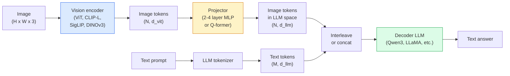

# 视觉语言模型（Vision-Language Models）——ViT-MLP-LLM 模式

> 视觉编码器（vision encoder）将图像转换为标记（tokens）。MLP 投影器（projector）将这些标记映射到 LLM（大型语言模型）嵌入空间。语言模型负责剩余部分。这个模式——ViT-MLP-LLM——是 2026 年所有生产级视觉语言模型（VLM）的标准。

**类型:** 学习 + 使用  
**语言:** Python  
**前置知识:** 第4阶段第14课（ViT）、第4阶段第18课（CLIP）、第7阶段第02课（自注意力）  
**时长:** 约75分钟  

## 学习目标

- 阐述 ViT-MLP-LLM 架构，解释三个组件各自的贡献
- 对比 Qwen3-VL、InternVL3.5、LLaVA-Next 和 GLM-4.6V 在参数量、上下文长度和基准性能上的差异
- 解释 DeepStack：为何多层 ViT 特征比单层特征更能强化视觉语言对齐
- 使用跨模态错误率（Cross-Modal Error Rate，CMER）衡量生产中的 VLM 幻觉问题，并根据信号调整策略

## 双语术语速查

| 中文术语 | English term |
|----------|--------------|
| 视觉语言模型 | Vision-Language Model, VLM |
| 视觉编码器 | Vision encoder |
| 图像令牌 | Image token |
| 投影器 | Projector |
| 多层感知机投影器 | MLP projector |
| Q-former | Querying Transformer, Q-former |
| 语言模型 | Large Language Model, LLM |
| 嵌入空间 | Embedding space |
| DeepStack | DeepStack |
| 对齐 | Alignment |
| 预训练 | Pre-training |
| 指令微调 | Instruction tuning |
| 跨模态错误率 | Cross-Modal Error Rate, CMER |
| 视觉代理 | Visual agent |
| 时序旋转位置嵌入 | Temporal Rotary Position Embedding, T-RoPE |
| LoRA | Low-Rank Adaptation, LoRA |
| QLoRA | Quantized LoRA, QLoRA |


## 问题背景

CLIP（第4阶段第18课）为图像和文本提供了共享的嵌入空间，足以进行零样本分类和检索。但它不能回答“这张图中有多少辆红色汽车？”这类生成式问题，因为 CLIP 不生成文本，只给出相似度评分。

视觉语言模型（VLM）——如 Qwen3-VL、InternVL3.5、LLaVA-Next、GLM-4.6V——将 CLIP 系列的视觉编码器和完整语言模型结合起来。模型接收图像和问题输入，生成回答。到了 2026 年，开源的 VLM 在多模态基准测试（MMMU、MMBench、DocVQA、ChartQA、MathVista、OSWorld）上能匹敌或超越 GPT-5 和 Gemini-2.5-Pro。

三个部分（ViT、投影器、LLM）是标准组合。各模型间的差异在于选用哪种 ViT、哪种投影器、哪种 LLM、训练数据和对齐策略。一旦理解了这个模式，替换任何部分都相当机械。

## 概念介绍

### 关键公式（Key equations）

VLM 的投影器把视觉 token 映射到语言模型的嵌入维度，然后与文本 token 拼接输入 LLM：

$$
Z_v = \operatorname{MLP}(F_{\mathrm{ViT}}(x)) \in \mathbb{R}^{N_v \times d_{\mathrm{LLM}}}
$$

$$
P(y \mid x, q) = \prod_{t=1}^{T} P\left(y_t \mid Z_v, q, y_{<t}\right)
$$

### ViT-MLP-LLM 架构



1. **视觉编码器（Vision encoder）** — 预训练 ViT（例如 CLIP-L/14、SigLIP、DINOv3，或其微调版本），输出图像 patch 的标记。
2. **投影器（Projector）** — 小型模块（2-4 层 MLP 或 Q-former），将视觉标记映射到 LLM 嵌入维度。这里是大多数微调操作的重点。
3. **LLM** — 仅解码器语言模型（例如 Qwen3、Llama、Mistral、GLM、InternLM），顺序读取视觉和文本标记并生成文本。

理论上这三个部分都可训练。实际中，视觉编码器和 LLM 大多保持冻结，投影器训练——这提供了数十亿参数的信号，成本低廉。

### DeepStack

普通投影仅使用 ViT 最后一层。DeepStack（Qwen3-VL）采样多个 ViT 深度的特征并堆叠。较深层携带高级语义信息，较浅层携带细粒度空间和纹理信息。将两者一起输入 LLM 缩小了“图像包含什么”（语义）和“具体在哪儿”（空间定位）之间的差距。

### 三个训练阶段

现代 VLM 分阶段训练：

1. **对齐（Alignment）** — 冻结 ViT 和 LLM，仅训练投影器，利用图像-标题对让投影器学会映射视觉空间到语言空间。
2. **预训练（Pre-training）** — 解冻所有模块，使用大规模交织图文数据（500M+ 对）训练，构建视觉知识库。
3. **指令调优（Instruction tuning）** — 在精选的（图像、问题、答案）三元组上微调，让模型学会对话行为和任务格式。这个阶段让“视觉感知的语言模型”变成实用助手。

大多数 LoRA 微调针对第3阶段，用小规模标注数据。

### 模型家族对比（2026年初）

| 模型 | 参数量 | 视觉编码器 | LLM | 上下文长度 | 优势 |
|-------|--------|------------|-----|-----------|-------|
| Qwen3-VL-235B-A22B (MoE) | 235B（22B活跃） | 定制ViT + DeepStack | Qwen3 | 256K | 通用 SOTA，GUI 代理 |
| Qwen3-VL-30B-A3B (MoE) | 30B（3B活跃） | 定制ViT + DeepStack | Qwen3 | 256K | 更小的 MoE 替代 |
| Qwen3-VL-8B (密集) | 8B | 定制ViT | Qwen3 | 128K | 生产密集默认版本 |
| InternVL3.5-38B | 38B | InternViT-6B | Qwen3 + GPT-OSS | 128K | MMBench / MMVet 表现强 |
| InternVL3.5-241B-A28B | 241B（28B活跃） | InternViT-6B | Qwen3 | 128K | 与 GPT-4o 竞争 |
| LLaVA-Next 72B | 72B | SigLIP | Llama-3 | 32K | 开源，易于微调 |
| GLM-4.6V | 约70B | 定制 | GLM | 64K | 开源，强大的 OCR |
| MiniCPM-V-2.6 | 8B | SigLIP | MiniCPM | 32K | 适合边缘设备 |

### 视觉代理（Visual agents）

Qwen3-VL-235B 在 OSWorld（面向 GUI 操作的视觉代理基准）上达到全球顶尖水平。该模型读取截屏，理解界面并执行操作（点击、输入、滚动）。结合工具实现桌面日常任务的闭环。这是大多数 2026 年“AI PC”演示背后的核心技术。

### 代理能力与 RoPE 变种

VLM 需要知道视频中的帧“何时”出现。Qwen3-VL 从 T-RoPE（时序旋转位置编码）进化为**基于文本的时间对齐**——用显式时间戳文本标记嵌入视频帧。模型能看到“`<timestamp 00:32>` 帧，提示”并推理时间关系。

### 对齐问题

抓取的数据集中约12%的图文对描述并未完全基于图像内容。这样训练的 VLM 会默默学会幻觉：虚构物体，误读数字，编造关系。生产环境中这是主要失败模式。

Skywork.ai 引入了 **跨模态错误率（CMER）** 来监控：

```text
CMER = 输出文本置信度高但图文相似度（通过 CLIP 系列检查器）低的比例
```

高 CMER 意味着模型自信地说出未基于图像的内容。监测 CMER 并将其作为生产关键指标，使其生产环境的幻觉率降低约35%。技巧不在于“修模型”，而是“将高 CMER 输出送人审查”。

### 用 LoRA / QLoRA 微调

完整微调 70B VLM 对多数团队不可行。LoRA（秩16-64）针对注意力和投影器层，或带4-bit基础权重的 QLoRA，可在单卡 A100 / H100 上完成。成本：5,000-50,000样本，100-5,000美元算力，2-10小时训练。

### 空间推理仍较弱

当前 VLM 在空间推理基准（上下、左右、计数、距离）上得分50-60%。如果用例依赖“哪个物体叠加哪个”，请重点验证——通用 VLM 表现不及人类。纯空间任务的替代方案：专用关键点/姿态估计器、深度模型，或带边框几何后处理的检测模型。

## 实践构建

### 步骤1：投影器

最常训练的部分。2-4 层 GELU MLP。

```python
import torch
import torch.nn as nn


class Projector(nn.Module):
    def __init__(self, vit_dim=768, llm_dim=4096, hidden=4096):
        super().__init__()
        self.net = nn.Sequential(
            nn.Linear(vit_dim, hidden),
            nn.GELU(),
            nn.Linear(hidden, llm_dim),
        )

    def forward(self, x):
        return self.net(x)
```

输入为 `(N_patches, d_vit)` 标记张量。输出为 `(N_patches, d_llm)`。LLM 将每一输出行视作另一个标记。

### 步骤2：端到端组装 ViT-MLP-LLM

最小 VLM 前向过程骨架。实际代码用 `transformers`，此处示意架构。

```python
class MinimalVLM(nn.Module):
    def __init__(self, vit, projector, llm, image_token_id):
        super().__init__()
        self.vit = vit
        self.projector = projector
        self.llm = llm
        self.image_token_id = image_token_id  # 文本提示中的占位符标记

    def forward(self, image, input_ids, attention_mask):
        # 1. 视觉特征
        vision_tokens = self.vit(image)                     # (B, N_patches, d_vit)
        vision_embeds = self.projector(vision_tokens)       # (B, N_patches, d_llm)

        # 2. 文本嵌入
        text_embeds = self.llm.get_input_embeddings()(input_ids)  # (B, M, d_llm)

        # 3. 用视觉嵌入替换文本中的图像占位符标记
        merged = self._merge(text_embeds, vision_embeds, input_ids)

        # 4. 运行 LLM
        return self.llm(inputs_embeds=merged, attention_mask=attention_mask)

    def _merge(self, text_embeds, vision_embeds, input_ids):
        out = text_embeds.clone()
        expected = vision_embeds.size(1)
        for b in range(input_ids.size(0)):
            positions = (input_ids[b] == self.image_token_id).nonzero(as_tuple=True)[0]
            if len(positions) != expected:
                raise ValueError(
                    f"批次项 {b} 中有 {len(positions)} 个图像标记，但 vision_embeds 有 {expected} 个 patch。"
                    "批次中每个样本必须提前填充同样数量的图像占位符标记。")
            out[b, positions] = vision_embeds[b]
        return out
```

文本中的 `<image>` 占位符被实际图像嵌入替换——LLaVA、Qwen-VL 和 InternVL 都采用此模式。

### 步骤3：CMER 计算

轻量运行时检查。

```python
import torch.nn.functional as F


def cross_modal_error_rate(image_emb, text_emb, text_confidence, sim_threshold=0.25, conf_threshold=0.8):
    """
    image_emb, text_emb: 图像与生成文本的嵌入（内部已归一化）
    text_confidence:      [0, 1] 区间的平均每标记概率
    Returns:              高置信度但图文对齐低的输出比例
    """
    image_emb = F.normalize(image_emb, dim=-1)
    text_emb = F.normalize(text_emb, dim=-1)
    sim = (image_emb * text_emb).sum(dim=-1)        # 余弦相似度
    high_conf_low_sim = (text_confidence > conf_threshold) & (sim < sim_threshold)
    return high_conf_low_sim.float().mean().item()
```

将 CMER 作为生产关键指标监控。按端点、提示类型、客户细分监测。CMER 上升表明模型在部分输入分布出现幻觉。

### 步骤4：玩具 VLM 分类器（可运行）

演示投影器训练。输入假“ViT 特征”，输出一个极简 LLM 式标记预测类别。

```python
class ToyVLM(nn.Module):
    def __init__(self, vit_dim=32, llm_dim=64, num_classes=5):
        super().__init__()
        self.projector = Projector(vit_dim, llm_dim, hidden=64)
        self.head = nn.Linear(llm_dim, num_classes)

    def forward(self, vision_tokens):
        projected = self.projector(vision_tokens)
        pooled = projected.mean(dim=1)
        return self.head(pooled)
```

可以在不到 200 步内拟合此合成（特征，类别）对——足以展示投影器（projector）模式的有效性。

## 使用方法

2026 年生产团队使用 VLM（视觉语言模型）的方法有三种：

- **托管 API** — OpenAI Vision、Anthropic Claude Vision、Google Gemini Vision。零基础设施，无供应商风险。
- **开源自托管** — 通过 `transformers` 和 `vllm` 使用 Qwen3-VL 或 InternVL3.5。全面控制，但前期工作量较大。
- **领域微调** — 加载 Qwen2.5-VL-7B 或 LLaVA-1.6-7B，使用 LoRA 在 5k-50k 定制样本上微调，并用 `vllm` 或 `TGI` 部署。

```python
from transformers import AutoProcessor, AutoModelForVision2Seq
import torch
from PIL import Image

model_id = "Qwen/Qwen3-VL-8B-Instruct"
processor = AutoProcessor.from_pretrained(model_id)
model = AutoModelForVision2Seq.from_pretrained(model_id, torch_dtype=torch.bfloat16, device_map="auto")

messages = [{
    "role": "user",
    "content": [
        {"type": "image", "image": Image.open("plot.png")},
        {"type": "text", "text": "What does this chart show?"},
    ],
}]
inputs = processor.apply_chat_template(messages, add_generation_prompt=True, tokenize=True, return_dict=True, return_tensors="pt").to("cuda")
generated = model.generate(**inputs, max_new_tokens=256)
answer = processor.decode(generated[0][inputs["input_ids"].shape[1]:], skip_special_tokens=True)
```

`apply_chat_template` 隐藏了 `<image>` 占位符的分词处理；模型内部处理合并。

## 部署

本节内容产出：

- `outputs/prompt-vlm-selector.md` — 根据准确率、延迟、上下文长度和预算选择 Qwen3-VL / InternVL3.5 / LLaVA-Next / API。
- `outputs/skill-cmer-monitor.md` — 生成用于监控生产环境 VLM 端点的跨模态错误率（CMER）、每端点仪表盘和告警阈值的代码。

## 练习

1. **（简单）** 对五张图片用任意开源 VLM 运行三个提示语（“这是什么？”，“数数物体”，“描述场景”）。手工将每个答案评为正确/部分正确/幻觉。计算一次 CMER 类似的初步错误率。
2. **（中等）** 在 500 张带有标题的目标领域图片上，用 LoRA（秩 16）微调 Qwen2.5-VL-3B 或 LLaVA-1.6-7B。对比零-shot 和微调后的 MMBench 风格准确率。
3. **（困难）** 用 DINOv3 替换 VLM 的默认图像编码器 SigLIP/CLIP。只重新训练投影器（冻结 LLM 和 DINOv3）。测量密集预测任务（计数、空间推理）的性能提升情况。

## 关键词

| 术语 | 常说的定义 | 实际含义 |
|------|------------|---------|
| ViT-MLP-LLM | “VLM 模式” | 视觉编码器 + 投影器 + 语言模型；是每个 2026 年的 VLM |
| Projector（投影器） | “桥梁” | 2-4 层 MLP（或 Q-former），将视觉令牌映射到 LLM 嵌入空间 |
| DeepStack | “Qwen3-VL 特征技巧” | 多层 ViT 特征堆叠，而非只用最后一层 |
| Image token（图像令牌） | “<image> 占位符” | 文本流中特殊令牌，用投影视觉嵌入替代 |
| CMER | “幻觉指标” | 跨模态错误率；当文本置信度高但图文相似度低时高 |
| Visual agent（视觉代理） | “会点击的 VLM” | 操作 GUI（操作系统、移动、网页）并调用工具的 VLM |
| Q-former | “固定数目令牌桥” | BLIP-2 风格的投影器，生成固定数量视觉查询令牌 |
| Alignment / pre-training / instruction tuning | “三阶段” | 标准 VLM 训练流程 |

## 拓展阅读

- [Qwen3-VL 技术报告 (arXiv 2511.21631)](https://arxiv.org/abs/2511.21631)
- [InternVL3.5 推动开源多模态模型 (arXiv 2508.18265)](https://arxiv.org/html/2508.18265v1)
- [LLaVA-Next 系列](https://llava-vl.github.io/blog/2024-05-10-llava-next-stronger-llms/)
- [BentoML: 2026 年最佳开源 VLM](https://www.bentoml.com/blog/multimodal-ai-a-guide-to-open-source-vision-language-models)
- [MMMU：多学科多模态理解基准](https://mmmu-benchmark.github.io/)
- [VLM 在制造业中的应用（Robotics Tomorrow，2026 年 3 月）](https://www.roboticstomorrow.com/story/2026/03/when-machines-learn-to-see-like-experts-the-rise-of-vision-language-models-in-manufacturing/26335/)
