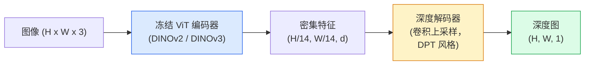

# 单目深度（Monocular Depth）与几何估计（Geometric Estimation）

> 深度图（depth map）是单通道图像，每个像素表示距离相机的距离。过去单帧 RGB 预测深度不可能实现，除非使用立体视觉（stereo vision）或激光雷达（LiDAR）。2026 年，使用冻结的 ViT 编码器加轻量级头部的模型，预测精度已接近真实值几个百分点。

**类型：** 构建 + 使用  
**语言：** Python  
**先修知识：** 第4阶段第14课（ViT 架构）、第4阶段第17课（自监督视觉）、第4阶段第07课（U-Net）  
**时间：** ~60分钟

## 学习目标

- 区分相对深度（relative depth）和计量深度（metric depth），并说明各生产模型（MiDaS、Marigold、Depth Anything V3、ZoeDepth）解决的是哪种问题
- 使用 Depth Anything V3（DINOv2 主干）预测任意单张图像的深度，无需校准
- 解释单目深度为何能从单张图像中生效（透视线索、纹理梯度、学习到的先验）及其不能恢复的信息（绝对尺度、被遮挡的几何结构）
- 利用深度图和针孔相机内参将二维检测转换为三维点

## 双语术语速查

| 中文术语 | English term |
|----------|--------------|
| 单目深度 | Monocular depth |
| 几何估计 | Geometric estimation |
| 深度图 | Depth map |
| 相对深度 | Relative depth |
| 计量深度 | Metric depth |
| 立体视觉 | Stereo vision |
| 激光雷达 | Light Detection and Ranging, LiDAR |
| 针孔相机模型 | Pinhole camera model |
| 相机内参 | Camera intrinsics |
| 焦距 | Focal length |
| 主点 | Principal point |
| 反投影 | Back-projection |
| DPT 解码器 | Dense Prediction Transformer decoder, DPT decoder |
| 条件扩散 | Conditional diffusion |
| 绝对相对误差 | Absolute Relative Error, AbsRel |
| 阈值准确率 | Threshold accuracy, delta accuracy |
| 尺度平移不变 | Scale-and-shift invariant |


## 问题描述

深度是二维计算机视觉中缺失的维度。给定 RGB 图像，能知道物体在图像平面中的位置，但无法得知距离。深度传感器（立体相机、LiDAR、飞行时间相机）直接解决这一问题，但设备昂贵、易损且测距范围有限。

单目深度估计——从单张 RGB 图像预测深度——过去只能产生模糊且不可靠的结果。到了 2026 年，使用大规模预训练编码器的模型彻底改变了这一情况：Depth Anything V3 使用冻结的 DINOv2 主干，生成在室内、室外、医疗及卫星等多种领域均能泛化的深度图。Marigold 将深度重构视为条件扩散问题，ZoeDepth进行真实计量深度回归。

深度还是二维检测到三维理解之间的桥梁：将检测框像素与深度乘积结合，可将二维物体提升为三维点云。这是所有增强现实遮挡系统、障碍物避让流以及“捡杯子”机器人的核心。

## 核心概念

### 关键公式（Key equations）

针孔相机模型把像素坐标和深度反投影到三维相机坐标：

$$
Z = D(u,v), \qquad X = \frac{(u-c_x)Z}{f_x}, \qquad Y = \frac{(v-c_y)Z}{f_y}
$$

常见深度回归损失在对数空间比较预测与真实深度：

$$
\mathcal{L}_{\log} = \frac{1}{N}\sum_i \left|\log \hat{D}_i - \log D_i\right|
$$

### 相对深度与计量深度

- **相对深度** — 仅表示顺序的 z 值，无真实世界单位。如：“像素 A 比像素 B 近，但距离比例未锚定为米。”
- **计量深度** — 以米为单位的相机绝对距离。模型需学习图像线索与真实距离间的统计关系。

MiDaS 和 Depth Anything V3 产生相对深度。Marigold 也输出相对深度。ZoeDepth、UniDepth 和 Metric3D 生成计量深度。计量模型对相机内参敏感，相对模型不敏感。

### 编码器-解码器模式



Depth Anything V3 锁定编码器权重，仅训练 DPT 风格解码器。编码器提供丰富特征，解码器将特征插值回图像分辨率并回归深度。

### 单张图像为何能预测深度

二维图像包含许多与深度相关的单目线索：

- **透视法则** — 三维中的平行线在二维图中汇聚。
- **纹理梯度** — 远处物体纹理更细小、密集。
- **遮挡顺序** — 更近的物体遮挡更远的物体。
- **大小恒常性** — 已知物体（车辆、人类）提供尺度参照。
- **大气透视** — 户外场景中远处物体更模糊且偏蓝。

经过数十亿图像训练的 ViT 内部学会了这些线索。大数据和强编码器令单目深度即使无显式三维监督，也能达到合理精度。

### 单目深度的局限

- **无内参或无已知物体，无法恢复绝对计量尺度。** 网络可预测“杯子距离是勺子的两倍”，但无法确认杯子是 1 米还是 10 米远。
- **被遮挡的几何结构不可见，不能可靠推断。** 如椅背是隐藏部分。
- **完全无纹理或反光表面无法准确预测。** 如镜子、玻璃、纯色墙面，网络给出合理但错误的深度。

### 2026 年版 Depth Anything V3

- 采用标准 DINOv2 ViT-L/14 作为编码器（冻结）。
- DPT 解码器。
- 使用多源姿态图像对训练（无需显式深度监督，依赖光度一致性）。
- 支持**任意数量视觉输入，且可有可无已知相机姿态**，预测空间一致性几何。
- 在单目深度、任意视角几何、视觉渲染、相机位姿估计多项任务中达 SOTA。

这是 2026 年需要深度时的首选模型。

### Marigold — 基于扩散的深度估计

Marigold（Ke 等人，CVPR 2024）将深度估计视为条件图像到图像的扩散过程。条件为 RGB，目标为深度图。采用预训练的 Stable Diffusion 2 U-Net 作为骨干，深度图在物体边界异常锐利。代价是推理速度慢于前向模型（需 10-50 次降噪步长）。

### 内参与针孔相机模型

将深度为 d 的像素 (u, v) 转换为相机坐标系中的三维点 (X, Y, Z)：

```text
fx, fy, cx, cy = 相机内参
X = (u - cx) * d / fx
Y = (v - cy) * d / fy
Z = d
```

内参来源于 EXIF 元数据、标定图案，或单目内参估计器（如 Perspective Fields、UniDepth）。无内参时，可假设 60-70° 视场和中等分辨率主点进行渲染，仅供可视化，无法用于测量。

### 评估指标

两个标准指标：

- **AbsRel**（绝对相对误差）：`mean(|d_pred - d_gt| / d_gt)`。数值越低越好。生产模型约 0.05-0.1。
- **delta < 1.25**（阈值准确率）：预测与真实深度比或倒数小于 1.25 的像素比例。数值越高越好。SOTA 超过 0.9。

对于相对深度（Depth Anything V3、MiDaS）使用尺度平移不变的指标版本。

## 实战构建

### 步骤1：深度指标计算

```python
import torch

def abs_rel_error(pred, target, mask=None):
    if mask is not None:
        pred = pred[mask]
        target = target[mask]
    return (torch.abs(pred - target) / target.clamp(min=1e-6)).mean().item()


def delta_accuracy(pred, target, threshold=1.25, mask=None):
    if mask is not None:
        pred = pred[mask]
        target = target[mask]
    ratio = torch.maximum(pred / target.clamp(min=1e-6), target / pred.clamp(min=1e-6))
    return (ratio < threshold).float().mean().item()
```

评估前务必屏蔽无效深度像素（零、NaN、饱和值）。

### 步骤2：尺度平移对齐

对相对深度模型，预测与真实值线性拟合：`a * pred + b = target`，使用最小二乘法：

```python
def align_scale_shift(pred, target, mask=None):
    if mask is not None:
        p = pred[mask]
        t = target[mask]
    else:
        p = pred.flatten()
        t = target.flatten()
    A = torch.stack([p, torch.ones_like(p)], dim=1)
    coeffs, *_ = torch.linalg.lstsq(A, t.unsqueeze(-1))
    a, b = coeffs[:2, 0]
    return a * pred + b
```

对 MiDaS / Depth Anything 评估时先调用 `align_scale_shift`。

### 步骤3：深度转点云

```python
import numpy as np

def depth_to_point_cloud(depth, intrinsics):
    H, W = depth.shape
    fx, fy, cx, cy = intrinsics
    v, u = np.meshgrid(np.arange(H), np.arange(W), indexing="ij")
    z = depth
    x = (u - cx) * z / fx
    y = (v - cy) * z / fy
    return np.stack([x, y, z], axis=-1)


depth = np.random.uniform(0.5, 4.0, (240, 320))
intr = (320.0, 320.0, 160.0, 120.0)
pc = depth_to_point_cloud(depth, intr)
print(f"点云形状: {pc.shape}  (H, W, 3)")
```

一个函数适用于所有三维提升场景。将点云导出为 `.ply` 格式，用 MeshLab 或 CloudCompare 打开查看。

### 步骤4：合成深度场景烟雾测试

```python
def synthetic_depth(size=96):
    yy, xx = np.meshgrid(np.arange(size), np.arange(size), indexing="ij")
    # 地面：线性梯度，由近（上方）到远（下方）
    depth = 1.0 + (yy / size) * 4.0
    # 中间的盒子：更近
    mask = (np.abs(xx - size / 2) < size / 6) & (np.abs(yy - size * 0.6) < size / 6)
    depth[mask] = 2.0
    return depth.astype(np.float32)


gt = torch.from_numpy(synthetic_depth(96))
pred = gt + 0.3 * torch.randn_like(gt)  # 模拟预测
aligned = align_scale_shift(pred, gt)
print(f"对齐前  absRel = {abs_rel_error(pred, gt):.3f}")
print(f"对齐后  absRel = {abs_rel_error(aligned, gt):.3f}")
```

### 步骤5：Depth Anything V3 用法（示例）

```python
import torch
from transformers import pipeline
from PIL import Image

pipe = pipeline(task="depth-estimation", model="LiheYoung/depth-anything-v2-large")

image = Image.open("street.jpg").convert("RGB")
out = pipe(image)
depth_np = np.array(out["depth"])
```

三行代码调用。`out["depth"]` 是 PIL 灰度图，转换为 numpy 方便后续运算。特指 Depth Anything V3 时，公开后替换模型 ID，API 不变。

## 使用指导

- **Depth Anything V3**（Meta AI / 字节跳动，2024-2026）— 默认相对深度模型。生产中最快的 ViT-Large 主干模型。
- **Marigold**（ETH，2024）— 最佳视觉质量，推理较慢。
- **UniDepth**（ETH，2024）— 计量深度及内参估计。
- **ZoeDepth**（英特尔，2023）— 计量深度，较老但稳定。
- **MiDaS v3.1** — 传统但稳定，良好基线。

典型集成流程：

1. 输入 RGB 帧。
2. 深度模型生成深度图。
3. 目标检测生成检测框。
4. 利用深度提升检测框中心到三维点；若有点云则合并。
5. 下游应用：AR 遮挡、路径规划、物体尺寸评估、立体视觉替代。

实时使用可选 Depth Anything V2 Small（INT8 量化），518x518 分辨率下约 30fps 运行于消费级 GPU。

## 交付内容

本课产出：

- `outputs/prompt-depth-model-picker.md` — 基于延迟、计量或相对需求及场景类型，选择 Depth Anything V3、Marigold、UniDepth、MiDaS。
- `outputs/skill-depth-to-pointcloud.md` — 构建深度图到点云的技能，正确处理内参并导出 `.ply`。

## 练习

1. **（简单）** 对桌面任意 10 张图像运行 Depth Anything V2，保存深度图为灰度 PNG 并检查。找出一件预测深度异常的物体，分析单目线索失败原因。
2. **（中等）** 给定 RGB + Depth (Depth Anything V2)，提升为点云并用 `open3d` 渲染。比较室内与室外场景视觉可信度。
3. **（困难）** 准备五对仅有已知物体位置变化（如瓶子移动 30 cm）的图像。用 UniDepth 预测计量深度，报告预估距离变化与实际 30 cm 的差异。

## 关键术语

| 术语 | 大众说法 | 实际含义 |
|------|----------|----------|
| Monocular depth（单目深度） | “单幅图像深度” | 从一帧 RGB 图像估计深度，无需立体或 LiDAR |
| Relative depth（相对深度） | “有序深度” | 有序的 z 值，无真实世界单位 |
| Metric depth（度量深度） | “绝对距离” | 以米为单位的深度；需要校准或带度量监督训练的模型 |
| AbsRel（绝对相对误差） | “绝对相对误差” | 平均 |d_pred - d_gt| / d_gt；标准深度指标 |
| Delta accuracy（Delta 精度） | “delta < 1.25” | 预测深度在真实值 25% 范围内的像素比例 |
| Pinhole camera（针孔相机） | “fx, fy, cx, cy” | 用于将 (u, v, d) 映射到 (X, Y, Z) 的相机模型 |
| DPT（Dense Prediction Transformer，密集预测转换器） | “Dense Prediction Transformer” | 用在冻结 ViT 编码器顶层的基于卷积的解码器，用于深度 |
| DINOv2 backbone（DINOv2 主干） | “它成功的原因” | 无需深度标签即可泛化跨领域的自监督特征 |

## 深入阅读

- [Depth Anything V3 论文页面](https://depth-anything.github.io/) — 使用 DINOv2 编码器的最先进单目深度方法
- [Marigold (Ke et al., CVPR 2024)](https://marigoldmonodepth.github.io/) — 基于扩散的深度估计
- [UniDepth (Piccinelli et al., 2024)](https://arxiv.org/abs/2403.18913) — 带内参的度量深度
- [MiDaS v3.1 (Intel ISL)](https://github.com/isl-org/MiDaS) — 标准相对深度基线
- [DINOv3 博客文章 (Meta)](https://ai.meta.com/blog/dinov3-self-supervised-vision-model/) — 提升深度准确率的编码器家族
