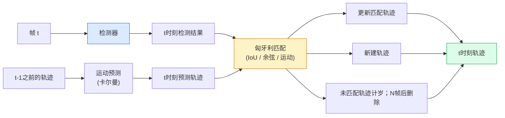

# 多目标追踪（Multi-Object Tracking）与视频记忆（Video Memory）

> 追踪（tracking）是检测（detection）加关联（association）。在每一帧进行检测。将当前帧的检测结果与上一帧的轨迹按 ID 匹配。

**类型：** 构建  
**语言：** Python  
**先决条件：** 第4阶段第06课（YOLO检测），第4阶段第08课（Mask R-CNN），第4阶段第24课（SAM 3）  
**时间：** ~60分钟

## 学习目标

- 区分基于检测的追踪（tracking-by-detection）与基于查询的追踪（query-based tracking），并列举算法家族（SORT、DeepSORT、ByteTrack、BoT-SORT、SAM 2 memory tracker、SAM 3.1 Object Multiplex）
- 从零实现基于IoU加匈牙利算法的经典基于检测的追踪
- 解释SAM 2的内存库（memory bank）及其为什么比基于IoU的匹配更能处理遮挡
- 读懂三种追踪指标（MOTA、IDF1、HOTA），并根据具体用例判断哪个指标更重要

## 双语术语速查

| 中文术语 | English term |
|----------|--------------|
| 多目标追踪 | Multi-object tracking, MOT |
| 视频记忆 | Video memory |
| 基于检测的追踪 | Tracking-by-detection |
| 基于查询的追踪 | Query-based tracking |
| 数据关联 | Data association |
| 匈牙利算法 | Hungarian algorithm |
| 卡尔曼滤波器 | Kalman filter |
| 运动模型 | Motion model |
| 外观特征 | Appearance feature |
| 重识别嵌入 | Re-identification embedding, ReID embedding |
| 轨迹生命周期 | Track lifecycle |
| 遮挡 | Occlusion |
| ID 切换 | ID switch |
| MOTA | Multi-Object Tracking Accuracy, MOTA |
| IDF1 | ID F1 score, IDF1 |
| HOTA | Higher Order Tracking Accuracy, HOTA |
| 对象多路复用 | Object Multiplex |


## 问题描述

检测器告诉你单帧中的物体位置。追踪器告诉你帧`t`中的检测结果和帧`t-1`中的哪个检测是同一物体。如果没有追踪，你无法统计穿越某条线的物体数目，无法通过遮挡跟踪球，或者知道“车#4已经在车道上停留了8秒”。

追踪对于所有视频相关产品都是基础：体育分析、监控、自动驾驶、医学视频分析、野生动物监测、商标计数。核心组件共通：每帧检测器、运动模型（卡尔曼滤波器或更复杂的模型）、关联步骤（匈牙利算法，根据IoU / 余弦相似度 / 学习特征匹配），以及轨迹生命周期（生成、更新、消亡）。

2026年出现两种新模式：**基于SAM 2的记忆追踪**（用特征记忆替代运动模型关联）和**SAM 3.1对象多路复用**（同一概念多个实例共享内存）。本课先介绍经典流程，再介绍基于记忆的方法。

## 基本概念

### 关键公式（Key equations）

经典追踪把检测框与已有轨迹做二分图匹配，代价可由 IoU 或外观距离定义：

$$
C_{ij} = 1 - \operatorname{IoU}(b_i^{\mathrm{track}}, b_j^{\mathrm{det}})
$$

匈牙利算法求解最小总代价匹配：

$$
\pi^* = \arg\min_{\pi}\sum_i C_{i,\pi(i)}
$$

### 基于检测的追踪（Tracking-by-detection）



你在2026年会遇到的每个追踪器，都是这套循环的变种。区别如下：

- **SORT**（2016）：卡尔曼滤波+IoU匈牙利，简单快速，无外观模型。
- **DeepSORT**（2017）：SORT基础上添加基于CNN的轨迹外观特征（ReID嵌入），更好地处理交叉情况。
- **ByteTrack**（2021）：保留低置信度检测作为第二阶段，不需要外观特征，在MOT17上表现最好。
- **BoT-SORT**（2022）：ByteTrack+相机运动补偿+ReID。
- **StrongSORT / OC-SORT** — ByteTrack后代，改进运动和外观。

### 卡尔曼滤波器简述

卡尔曼滤波器为每条轨迹维护状态向量 `(x, y, w, h, dx, dy, dw, dh)` 和协方差。每帧首先用匀速模型**预测**状态，然后用匹配的检测结果进行**更新**。当预测不确定性较高时，更新会更信任检测。由此轨迹平滑且可穿越短时遮挡（1-5帧）。

经典追踪器的运动预测步骤皆用卡尔曼滤波。

### 匈牙利算法

给定一个 `M x N` 的代价矩阵（轨迹数×检测数），找到使总代价最小的一一匹配方案。代价通常是 `1 - IoU(轨迹框, 检测框)` 或外观特征余弦相似度的负数。运行时间为 O((M+N)^3)，对M，N最多约1000的规模，用Python的 `scipy.optimize.linear_sum_assignment` 足够快。

### ByteTrack的关键思路

标准追踪器忽略低置信度检测（<0.5）。ByteTrack将它们作为**二阶段候选**保留：先匹配高置信度检测，未匹配轨迹再尝试匹配低置信度检测，放宽IoU阈值。恢复短时遮挡，避免拥挤环境ID切换。

### SAM 2基于记忆的追踪

SAM 2通过维护每个实例的**时空特征内存库**处理视频。给定单帧中的提示（点击、框选、文本），将该实例编码进内存；随后帧通过内存对当前帧特征做cross-attention，解码器输出该实例的新掩码。

没有卡尔曼滤波，没有匈牙利匹配。关联隐含于记忆注意力操作中。

优点：
- 对大范围遮挡鲁棒（记忆跨帧保持实例身份）。
- 结合SAM 3文本提示则可实现开放词汇追踪。
- 无需单独运动模型。

缺点：
- 多目标追踪速度慢于ByteTrack。
- 内存库增大，限制上下文窗口大小。

### SAM 3.1对象多路复用

早期SAM 2 / SAM 3追踪为每个实例维护独立内存库。50个物体则50个内存库。2026年3月发布的对象多路复用，将它们合并为一个共享内存，使用**每实例查询标记**。成本关于实例数目呈亚线性增长。

多路复用成为2026年群体追踪的默认方案：音乐会人群、仓库工人、交通路口等。

### 三大必须了解的指标

- **MOTA（多目标追踪准确率）** — 1 - (漏检 + 错检 + ID切换) / 真实标注。加权所有错误类型，单一指标合并检测与关联失败。
- **IDF1（ID F1分数）** — ID精度和召回的调和平均。专注于每个真实轨迹的ID是否保持一致。对ID切换敏感的任务优于MOTA。
- **HOTA（更高阶追踪精度）** — 分解为检测准确度（DetA）和关联准确度（AssA）。2020年以来社区标准，最全面。

监控（辨识身份）用IDF1；体育分析（计传球数）用HOTA；学术对比用HOTA。

## 实操构建

### 步骤1：基于IoU的代价矩阵

```python
import numpy as np


def bbox_iou(a, b):
    """
    a, b: (N, 4) 格式的 [x1, y1, x2, y2]
    返回形状为 (N_a, N_b) 的IoU矩阵
    """
    ax1, ay1, ax2, ay2 = a[:, 0], a[:, 1], a[:, 2], a[:, 3]
    bx1, by1, bx2, by2 = b[:, 0], b[:, 1], b[:, 2], b[:, 3]
    inter_x1 = np.maximum(ax1[:, None], bx1[None, :])
    inter_y1 = np.maximum(ay1[:, None], by1[None, :])
    inter_x2 = np.minimum(ax2[:, None], bx2[None, :])
    inter_y2 = np.minimum(ay2[:, None], by2[None, :])
    inter = np.clip(inter_x2 - inter_x1, 0, None) * np.clip(inter_y2 - inter_y1, 0, None)
    area_a = (ax2 - ax1) * (ay2 - ay1)
    area_b = (bx2 - bx1) * (by2 - by1)
    union = area_a[:, None] + area_b[None, :] - inter
    return inter / np.clip(union, 1e-8, None)
```

### 步骤2：最简实现SORT式追踪器

固定的常速度卡尔曼滤波出于简洁未实现；这里用简单IoU进行匹配；生产环境必加卡尔曼预测。完整版可用`srot` Python包。

```python
from scipy.optimize import linear_sum_assignment


class Track:
    def __init__(self, tid, bbox, frame):
        self.id = tid
        self.bbox = bbox
        self.last_frame = frame
        self.hits = 1

    def update(self, bbox, frame):
        self.bbox = bbox
        self.last_frame = frame
        self.hits += 1


class SimpleTracker:
    def __init__(self, iou_threshold=0.3, max_age=5):
        self.tracks = []
        self.next_id = 1
        self.iou_threshold = iou_threshold
        self.max_age = max_age

    def step(self, detections, frame):
        if not self.tracks:
            for d in detections:
                self.tracks.append(Track(self.next_id, d, frame))
                self.next_id += 1
            return [(t.id, t.bbox) for t in self.tracks]

        track_boxes = np.array([t.bbox for t in self.tracks])
        det_boxes = np.array(detections) if len(detections) else np.empty((0, 4))

        iou = bbox_iou(track_boxes, det_boxes) if len(det_boxes) else np.zeros((len(track_boxes), 0))
        cost = 1 - iou
        cost[iou < self.iou_threshold] = 1e6

        matched_track = set()
        matched_det = set()
        if cost.size > 0:
            row, col = linear_sum_assignment(cost)
            for r, c in zip(row, col):
                if cost[r, c] < 1.0:
                    self.tracks[r].update(det_boxes[c], frame)
                    matched_track.add(r); matched_det.add(c)

        for i, d in enumerate(det_boxes):
            if i not in matched_det:
                self.tracks.append(Track(self.next_id, d, frame))
                self.next_id += 1

        self.tracks = [t for t in self.tracks if frame - t.last_frame <= self.max_age]
        return [(t.id, t.bbox) for t in self.tracks]
```

60行代码。输入每帧检测，输出每帧轨迹ID。真实系统会加卡尔曼预测、ByteTrack二阶段重匹配、外观特征。

### 步骤3：合成轨迹测试

```python
def synthetic_frames(num_frames=20, num_objects=3, H=240, W=320, seed=0):
    rng = np.random.default_rng(seed)
    starts = rng.uniform(20, 200, size=(num_objects, 2))
    velocities = rng.uniform(-5, 5, size=(num_objects, 2))
    frames = []
    for f in range(num_frames):
        dets = []
        for i in range(num_objects):
            cx, cy = starts[i] + f * velocities[i]
            dets.append([cx - 10, cy - 10, cx + 10, cy + 10])
        frames.append(dets)
    return frames


tracker = SimpleTracker()
for f, dets in enumerate(synthetic_frames()):
    tracks = tracker.step(dets, f)
```

三目标匀速直线运动，应该在全部20帧保持ID不变。

### 步骤4：ID切换统计指标

```python
def count_id_switches(tracks_per_frame, gt_per_frame):
    """
    tracks_per_frame:  每帧列表，元素为 (track_id, bbox)
    gt_per_frame:      每帧列表，元素为 (gt_id, bbox)
    返回ID切换次数
    """
    prev_assignment = {}
    switches = 0
    for tracks, gts in zip(tracks_per_frame, gt_per_frame):
        if not tracks or not gts:
            continue
        t_boxes = np.array([b for _, b in tracks])
        g_boxes = np.array([b for _, b in gts])
        iou = bbox_iou(g_boxes, t_boxes)
        for g_idx, (gt_id, _) in enumerate(gts):
            j = iou[g_idx].argmax()
            if iou[g_idx, j] > 0.5:
                t_id = tracks[j][0]
                if gt_id in prev_assignment and prev_assignment[gt_id] != t_id:
                    switches += 1
                prev_assignment[gt_id] = t_id
    return switches
```

这是一个简化的IDF1相关指标：统计多少次真实目标切换了预测轨迹ID。真实的MOTA / IDF1 / HOTA计算请使用 `py-motmetrics` 和 `TrackEval` 工具包。

## 使用它

2026年的生产级跟踪器：

- `ultralytics` — 集成了YOLOv8 + ByteTrack / BoT-SORT。使用 `results = model.track(source, tracker="bytetrack.yaml")`。默认选择。
- `supervision`（Roboflow） — ByteTrack封装及标注工具。
- SAM 2 / SAM 3.1 — 通过 `processor.track()` 实现基于内存的跟踪。
- 自定义方案：检测器（YOLOv8 / RT-DETR） + `sort-tracker` / `OC-SORT` / `StrongSORT`。

选择建议：

- 行人/车辆/箱子，30+帧每秒：**ultralytics 的 ByteTrack**。
- 人群中大量同类实例：**SAM 3.1 Object Multiplex（对象复用）**。
- 重度遮挡且外观可辨识：**DeepSORT / StrongSORT**（使用ReID特征）。
- 体育运动/复杂交互场景：**BoT-SORT**或基于学习的跟踪器（如MOTRv3）。

## 部署它

本课产出：

- `outputs/prompt-tracker-picker.md` — 根据场景类型、遮挡模式和延迟预算，挑选SORT / ByteTrack / BoT-SORT / SAM 2 / SAM 3.1。
- `outputs/skill-mot-evaluator.md` — 完整的MOTA / IDF1 / HOTA评估框架，基于真实轨迹进行评估。

## 练习

1. **（简单）** 使用上述合成跟踪器分别运行3、10和30个目标的场景。报告每种情况下的ID切换次数。找出单纯基于IoU关联开始失效的位置。
2. **（中等）** 在关联前加入恒定速度Kalman预测步骤。展示短时间（2-3帧）遮挡不再导致ID切换。
3. **（困难）** 集成SAM 2的基于内存的跟踪器（通过`transformers`），作为替代跟踪后端。在一段30秒的人群视频上同时运行SimpleTracker和SAM 2，比较ID切换次数，自行标注5个显著人物的真实ID。

## 关键术语

| 术语 | 俗称 | 实际含义 |
|------|------|----------|
| Tracking-by-detection（检测跟踪） | “先检测再关联” | 每帧检测器+基于IoU/外观的匈牙利分配算法 |
| Kalman filter（卡尔曼滤波） | “运动预测” | 线性动力学+协方差矩阵平滑轨迹预测及遮挡处理 |
| Hungarian algorithm（匈牙利算法） | “最优分配” | 解决最小成本二分匹配问题；`scipy.optimize.linear_sum_assignment` |
| ByteTrack | “低置信度二次匹配” | 重新匹配未匹配轨迹与低置信度检测，恢复短时遮挡 |
| DeepSORT | “SORT+外观特征” | 添加ReID特征实现跨帧匹配，更好保持ID一致性 |
| Memory bank（内存库） | “SAM 2技巧” | 逐实例时空特征跨帧存储，交叉注意力替代显式关联 |
| Object Multiplex（对象复用） | “SAM 3.1共享内存” | 单一共享内存配合逐实例查询，实现场景中多目标快速跟踪 |
| HOTA | “现代跟踪指标” | 细分检测精度与关联精度，业界标准方法 |

## 延伸阅读

- [SORT (Bewley et al., 2016)](https://arxiv.org/abs/1602.00763) — 最简检测跟踪论文
- [DeepSORT (Wojke et al., 2017)](https://arxiv.org/abs/1703.07402) — 添加外观特征
- [ByteTrack (Zhang et al., 2022)](https://arxiv.org/abs/2110.06864) — 低置信度二次匹配
- [BoT-SORT (Aharon et al., 2022)](https://arxiv.org/abs/2206.14651) — 相机运动补偿
- [HOTA (Luiten et al., 2020)](https://arxiv.org/abs/2009.07736) — 细分式跟踪评估指标
- [SAM 2视频分割 (Meta, 2024)](https://ai.meta.com/sam2/) — 基于内存的跟踪器
- [SAM 3.1 Object Multiplex (Meta, 2026年3月)](https://ai.meta.com/blog/segment-anything-model-3/)
