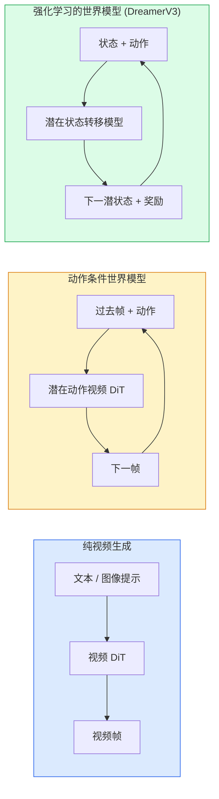

# 世界模型（World Models）与视频扩散（Video Diffusion）

> 预测场景接下来几秒的视频模型（video model）就是世界模拟器（world simulator）。在动作条件（action conditioning）下进行这种预测，你就有了一个可学习的游戏引擎。

**类型：** 学习 + 构建  
**语言：** Python  
**先决条件：** 第四阶段第10课（扩散），第四阶段第12课（视频理解），第四阶段第23课（DiT + 校正流）  
**时间：** 约75分钟

## 学习目标

- 解释纯视频生成模型（Sora 2）与动作条件世界模型（Genie 3，DreamerV3）之间的区别  
- 描述视频DiT：时空补丁、3D位置编码、(T, H, W) 令牌的联合注意力  
- 理解世界模型如何接入机器人学：VLM规划 → 视频模型模拟 → 逆动力学发出动作  
- 在Sora 2、Genie 3、Runway GWM-1 Worlds、Wan-Video 和 HunyuanVideo 中针对特定用例（创意视频、交互模拟、自动驾驶合成）做出选择  

## 双语术语速查

| 中文术语 | English term |
|----------|--------------|
| 世界模型 | World model |
| 视频扩散 | Video diffusion |
| 世界模拟器 | World simulator |
| 动作条件 | Action conditioning |
| 学习型游戏引擎 | Learned game engine |
| 视频 DiT | Video Diffusion Transformer, Video DiT |
| 时空补丁 | Spatiotemporal patch |
| 3D 位置编码 | 3D positional encoding |
| 联合注意力 | Joint attention |
| 分割式注意力 | Divided attention |
| 窗口注意力 | Window attention |
| 潜在动作 | Latent action |
| 物体常存性 | Object permanence |
| 物理合理性 | Physical plausibility |
| 逆动力学模型 | Inverse dynamics model |
| Fréchet 视频距离 | Fréchet Video Distance, FVD |
| 可控性 | Controllability |


## 问题描述

视频生成与世界建模于2026年融合。一个能生成连贯一分钟视频的模型，在某种意义上学会了世界如何运动：物体常存性、重力、因果关系、风格。如果你在预测中加入动作条件（向左走，开门），视频模型即成为一个可学习的模拟器，可以取代游戏引擎、驾驶模拟器或机器人环境。

利害关系非常具体。Genie 3从单张图像生成可玩的环境。Runway GWM-1 Worlds合成无限可探索场景。Sora 2生成带同步音频和物理建模的分钟级视频。NVIDIA Cosmos-Drive、Wayve Gaia-2 和 Tesla DrivingWorld生成逼真的驾驶视频用于自动驾驶训练数据。世界模型范式悄然主导机器人仿真到现实的转移。

本课是第四阶段的“宏观视野”课，连接了图像生成、视频理解和智能推理，形成主流研究逐渐走向的架构模式。

## 概念

### 关键公式（Key equations）

动作条件世界模型预测未来视频或潜状态，核心是给定历史帧与动作序列的条件分布：

$$
p(x_{t+1:t+H} \mid x_{1:t}, a_{t:t+H-1})
$$

在潜空间中可写成状态转移模型：

$$
z_{t+1} = f_\theta(z_t, a_t, \epsilon_t), \qquad \hat{x}_{t+1} = D_\phi(z_{t+1})
$$

### 三类世界建模家族



- **Sora 2** 是条件于提示的纯视频生成，没有动作接口，无法在过程中“操控”。  
- **Genie 3**、**GWM-1 Worlds**、**Mirage / Magica** 是动作条件世界模型，从观察视频中推断潜在动作，再基于动作预测未来帧。交互式—你按键或移动摄像机，场景响应。  
- **DreamerV3** 和经典强化学习的世界模型在潜在空间内，明确条件于动作，训练时利用奖励信号。视觉表现较弱，但对高效样本利用的强化学习有用。

### 视频 DiT 架构

```text
视频潜表示:          (C, T, H, W)
空间分块:            每帧 P_h x P_w 的补丁网格
时间分块:            将 P_t 帧组成时间补丁
产生的令牌数量:       (T / P_t) * (H / P_h) * (W / P_w) 令牌
```

位置编码是3D的：针对(t, h, w)坐标的旋转或学习嵌入。注意力有三种方式：

- **全联合** — 所有令牌相互注意。N个令牌时复杂度为O(N^2)。对长视频非常昂贵。  
- **分割式** — 交替进行时间注意（同一空间位置，跨时间，复杂度为 `(H*W) * T^2`）和空间注意（同一时间步，跨空间，复杂度为`T * (H*W)^2`）。TimeSformer和大多数视频DiT采用此法。  
- **窗口局部** — 在 (t, h, w) 中局部窗口范围内注意。Video Swin采用此法。

每个2026年视频扩散模型都采用其中一种策略，加上AdaLN条件（第23课）和校正流。

### 动作条件：潜在动作模型

Genie通过区分地预测连续帧之间的动作，学习每帧的**潜在动作**。模型的解码器条件该潜动作——而非明确的键盘动作。在推断时，用户可以指定潜动作（或从新先验中采样），模型据此生成下一帧。

Sora 完全跳过动作接口。其解码器从过去时空令牌预测未来令牌，提示设定开头，中途无人操控。

### 物理合理性

Sora 2 于2026年发布时，明确宣传了**物理合理性**：重量、平衡、物体常存、因果关系。团队通过人工评分衡量；模型在物体掉落、碰撞、故意失败（漏跳）等方面显著优于Sora 1。

合理性依然是主要失败点。2024-2025年关于人吃意大利面或喝饮料的视频揭示模型缺乏持久的物体表示。2026年的模型（Sora 2、Runway Gen-5、HunyuanVideo）在这方面有所减少，但未彻底消除。

### 自动驾驶世界模型

自动驾驶世界模型生成基于轨迹、边界框或导航地图的逼真道路场景。用途包括：

- **Cosmos-Drive-Dreams**（NVIDIA）— 生成数分钟驾驶视频供强化学习训练。  
- **Gaia-2**（Wayve）— 基于轨迹的场景合成用于策略评估。  
- **DrivingWorld**（Tesla）— 模拟多变天气、时间和交通状况。  
- **Vista**（字节跳动）— 反应式驾驶场景合成。

这些替代了昂贵的真实数据采集，尤其是拐角案例—夜间行人乱穿马路、结冰路口、特殊车辆类型——否则需要数百万英里驾驶数据。

### 机器人栈：VLM + 视频模型 + 逆动力学

新兴的三部分机器人循环：

1. **VLM（视觉语言模型）**解析目标（“拿起红杯子”），规划高层动作序列。  
2. **视频生成模型**模拟每个动作执行的观测——预测N帧后情景。  
3. **逆动力学模型**推断执行那些观测所需的具体控制命令。

这替代了奖赏设计和样本繁重的强化学习。世界模型做想象，逆动力学闭合操控环路。Genie Envisioner是此结构的实例，多个研究组趋向此模式。

### 评估指标

- **视觉质量** — FVD（Fréchet视频距离）、用户调研  
- **提示对齐度** — 每帧CLIPScore，类似VQA评测  
- **物理合理性** — 手动评分基准（Sora 2内测，VBench）  
- **可控性**（针对交互式世界模型） — 动作与观测一致性，是否能回到先前状态？  

### 2026年模型格局

| 模型 | 用途 | 参数量 | 输出 | 许可 |
|-------|-----|--------|------|------|
| Sora 2 | 文本到视频，音频 | — | 1分钟1080p + 音频 | 仅API |
| Runway Gen-5 | 文本/图像到视频 | — | 10秒剪辑 | API |
| Runway GWM-1 Worlds | 交互式世界 | — | 无限3D展开 | API |
| Genie 3 | 从图像生成交互世界 | 110亿+ | 可玩视频帧 | 研究预览 |
| Wan-Video 2.1 | 开放文本到视频 | 140亿 | 高质量剪辑 | 非商业 |
| HunyuanVideo | 开放文本到视频 | 130亿 | 10秒剪辑 | 宽松授权 |
| Cosmos / Cosmos-Drive | 自动驾驶模拟 | 7-14亿 | 驾驶场景 | NVIDIA开源 |
| Magica / Mirage 2 | AI原生游戏引擎 | — | 可修改世界 | 产品 |

## 构建实践

### 第1步：视频3D分块

```python
import torch
import torch.nn as nn


class VideoPatch3D(nn.Module):
    def __init__(self, in_channels=4, dim=64, patch_t=2, patch_h=2, patch_w=2):
        super().__init__()
        self.proj = nn.Conv3d(
            in_channels, dim,
            kernel_size=(patch_t, patch_h, patch_w),
            stride=(patch_t, patch_h, patch_w),
        )
        self.patch_t = patch_t
        self.patch_h = patch_h
        self.patch_w = patch_w

    def forward(self, x):
        # x: (N, C, T, H, W)
        x = self.proj(x)
        n, c, t, h, w = x.shape
        tokens = x.reshape(n, c, t * h * w).transpose(1, 2)
        return tokens, (t, h, w)
```

内核大小等于步幅的3D卷积即为空间-时间的分块器。`(T, H, W) -> (T/2, H/2, W/2)`的令牌网格。

### 第2步：3D旋转位置编码

沿 `t`、`h`、`w` 轴分别应用旋转位置嵌入（RoPE）：

```python
def rope_3d(tokens, t_dim, h_dim, w_dim, grid):
    """
    tokens: (N, T*H*W, D)
    grid: (T, H, W) 大小
    t_dim + h_dim + w_dim == D
    """
    T, H, W = grid
    n, seq, d = tokens.shape
    if t_dim + h_dim + w_dim != d:
        raise ValueError(f"t_dim+h_dim+w_dim ({t_dim}+{h_dim}+{w_dim}) must equal D={d}")
    assert seq == T * H * W
    t_idx = torch.arange(T, device=tokens.device).repeat_interleave(H * W)
    h_idx = torch.arange(H, device=tokens.device).repeat_interleave(W).repeat(T)
    w_idx = torch.arange(W, device=tokens.device).repeat(T * H)
    # 简化处理：仅用频率缩放通道。真正的RoPE旋转成对通道。
    freqs_t = torch.exp(-torch.log(torch.tensor(10000.0)) * torch.arange(t_dim // 2, device=tokens.device) / (t_dim // 2))
    freqs_h = torch.exp(-torch.log(torch.tensor(10000.0)) * torch.arange(h_dim // 2, device=tokens.device) / (h_dim // 2))
    freqs_w = torch.exp(-torch.log(torch.tensor(10000.0)) * torch.arange(w_dim // 2, device=tokens.device) / (w_dim // 2))
    emb_t = torch.cat([torch.sin(t_idx[:, None] * freqs_t), torch.cos(t_idx[:, None] * freqs_t)], dim=-1)
    emb_h = torch.cat([torch.sin(h_idx[:, None] * freqs_h), torch.cos(h_idx[:, None] * freqs_h)], dim=-1)
    emb_w = torch.cat([torch.sin(w_idx[:, None] * freqs_w), torch.cos(w_idx[:, None] * freqs_w)], dim=-1)
    return tokens + torch.cat([emb_t, emb_h, emb_w], dim=-1)
```

简化的加法形式。真正的RoPE以不同频率对通道成对旋转；位置编码信息相同。

### 第3步：分割注意力块

```python
class DividedAttentionBlock(nn.Module):
    def __init__(self, dim=64, heads=2):
        super().__init__()
        self.time_attn = nn.MultiheadAttention(dim, heads, batch_first=True)
        self.space_attn = nn.MultiheadAttention(dim, heads, batch_first=True)
        self.ln1 = nn.LayerNorm(dim)
        self.ln2 = nn.LayerNorm(dim)
        self.ln3 = nn.LayerNorm(dim)
        self.mlp = nn.Sequential(nn.Linear(dim, 4 * dim), nn.GELU(), nn.Linear(4 * dim, dim))

    def forward(self, x, grid):
        T, H, W = grid
        n, seq, d = x.shape
        # 时间注意力：相同 (h, w) 位置，跨时间t
        xt = x.view(n, T, H * W, d).permute(0, 2, 1, 3).reshape(n * H * W, T, d)
        a, _ = self.time_attn(self.ln1(xt), self.ln1(xt), self.ln1(xt), need_weights=False)
        xt = (xt + a).reshape(n, H * W, T, d).permute(0, 2, 1, 3).reshape(n, seq, d)
        # 空间注意力：相同时间t，跨 (h, w)
        xs = xt.view(n, T, H * W, d).reshape(n * T, H * W, d)
        a, _ = self.space_attn(self.ln2(xs), self.ln2(xs), self.ln2(xs), need_weights=False)
        xs = (xs + a).reshape(n, T, H * W, d).reshape(n, seq, d)
        xs = xs + self.mlp(self.ln3(xs))
        return xs
```

时间注意力（time attention）关注每个空间位置随时间的变化；空间注意力（space attention）关注每一帧内的各个位置。两个 O(T^2 + (HW)^2) 的操作代替单个 O((THW)^2) 操作。这是 TimeSformer（TimeSformer 架构）和每个现代视频 DiT（视频 Diffusion Transformer）模型的核心。

### 步骤4：构建一个超小型视频 DiT

```python
class TinyVideoDiT(nn.Module):
    def __init__(self, in_channels=4, dim=64, depth=2, heads=2):
        super().__init__()
        self.patch = VideoPatch3D(in_channels=in_channels, dim=dim, patch_t=2, patch_h=2, patch_w=2)
        self.blocks = nn.ModuleList([DividedAttentionBlock(dim, heads) for _ in range(depth)])
        self.out = nn.Linear(dim, in_channels * 2 * 2 * 2)

    def forward(self, x):
        tokens, grid = self.patch(x)
        for blk in self.blocks:
            tokens = blk(tokens, grid)
        return self.out(tokens), grid
```

不是一个可直接使用的视频生成器；是一个结构示范，确保每个部分的形状正确。

### 步骤5：检查形状

```python
vid = torch.randn(1, 4, 8, 16, 16)  # (N, C, T, H, W)
model = TinyVideoDiT()
out, grid = model(vid)
print(f"input  {tuple(vid.shape)}")
print(f"tokens grid {grid}")
print(f"output {tuple(out.shape)}")
```

预期 `grid = (4, 8, 8)`，`out = (1, 256, 32)`，这意味着经过分块后，头部投影到每个 token 的时空块，准备被重新合成为视频。

## 使用它

2026年生产访问模式：

- **Sora 2 API**（OpenAI）— 文本到视频，带同步音频。高级定价。
- **Runway Gen-5 / GWM-1**（Runway）— 图像到视频，交互式世界。
- **Wan-Video 2.1 / HunyuanVideo** — 开源自托管。
- **Cosmos / Cosmos-Drive**（NVIDIA）— 自动驾驶模拟开源权重。
- **Genie 3** — 研究预览，需申请访问。

构建交互式世界模型演示：从 Wan-Video 开始以保证质量，叠加潜在动作适配器实现交互。自动驾驶模拟：Cosmos-Drive 是 2026 年的开源参考模型。

机器人领域常用堆栈：

1. 语言目标 -> VLM（Qwen3-VL）-> 高层计划。
2. 计划 -> 潜在动作视频模型 -> 想象滚动（imagined rollout）。
3. 滚动结果 -> 逆动力学模型 -> 低层动作。
4. 动作执行 -> 观察反馈回步骤1。

## 发布它

本课生成：

- `outputs/prompt-video-model-picker.md` — 根据任务、许可证和延迟选择 Sora 2 / Runway / Wan / HunyuanVideo / Cosmos。
- `outputs/skill-physical-plausibility-checks.md` — 定义对任何生成视频执行自动物理合理性检查（物体永久性、重力、连续性）的技能。

## 练习

1. **（简单）** 计算一个 5 秒 360p 视频，patch_t=2，patch_h=8，patch_w=8 时的 token 数。评估该规模的注意力内存需求。
2. **（中等）** 将上面使用的分层注意力块替换为完整联合注意力块，测量形状和参数量。解释为什么实际视频模型必须使用分层注意力。
3. **（困难）** 构建一个最小潜在动作视频模型：使用（frame_t, action_t, frame_{t+1}）三元组数据集（任意简单二维游戏），训练一个基于动作嵌入的 tiny video DiT，展示不同动作生成不同下一帧。

## 关键词

| 术语 | 俗称 | 实际含义 |
|------|------|----------|
| World model（世界模型） | “Learned simulator（学习型模拟器）” | 给定状态和动作，预测未来观察的模型 |
| Video DiT（视频 Diffusion Transformer） | “Spacetime transformer（时空 Transformer）” | 使用3D分块和分层注意力的扩散 Transformer |
| Latent action（潜在动作） | “Inferred control（推断控制）” | 从帧对中推断的离散或连续动作潜变量，用于条件生成下一帧 |
| Divided attention（分层注意力） | “Time then space（先时间后空间）” | 每个块两次注意力操作——先跨时再跨空间，保持 O(N^2) 计算可控 |
| Object permanence（物体永久性） | “Things stay real（物体保持真实）” | 视频模型必须学习的场景属性；在食物、玻璃器皿等场景中经常出错 |
| FVD（Fréchet Video Distance） | “视频版 FID” | 视频的主视觉质量评价指标 |
| Inverse dynamics model（逆动力学模型） | “Observations to actions（观察到动作）” | 给定状态和下一个状态，输出连接它们的动作；关闭机器人控制闭环 |
| Cosmos-Drive | “NVIDIA driving sim（NVIDIA 自动驾驶模拟器）” | 用于强化学习和评估的开源权重自动驾驶世界模型 |

## 深入阅读

- [Sora 技术报告（OpenAI）](https://openai.com/index/video-generation-models-as-world-simulators/)
- [Genie: Generative Interactive Environments (Bruce et al., 2024)](https://arxiv.org/abs/2402.15391) — 潜在动作世界模型
- [TimeSformer (Bertasius et al., 2021)](https://arxiv.org/abs/2102.05095) — 视频 Transformer 的分层注意力
- [DreamerV3 (Hafner et al., 2023)](https://arxiv.org/abs/2301.04104) — 强化学习的世界模型
- [Cosmos-Drive-Dreams (NVIDIA, 2025)](https://research.nvidia.com/labs/toronto-ai/cosmos-drive-dreams/) — 自动驾驶世界模型
- [2026 年十大视频生成模型 (DataCamp)](https://www.datacamp.com/blog/top-video-generation-models)
- [从视频生成到世界模型 — 综述仓库](https://github.com/ziqihuangg/Awesome-From-Video-Generation-to-World-Model/)
