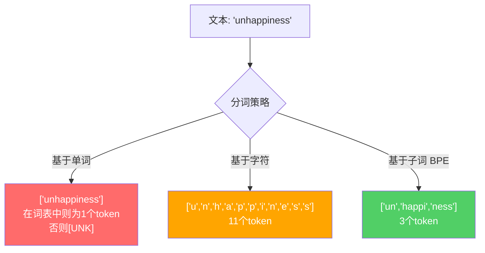
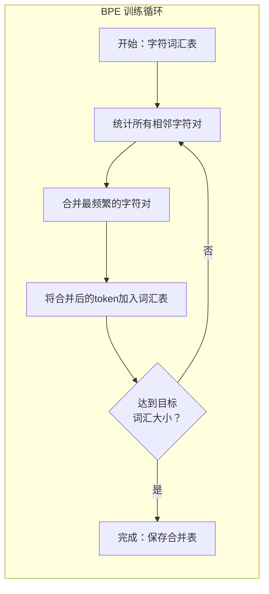
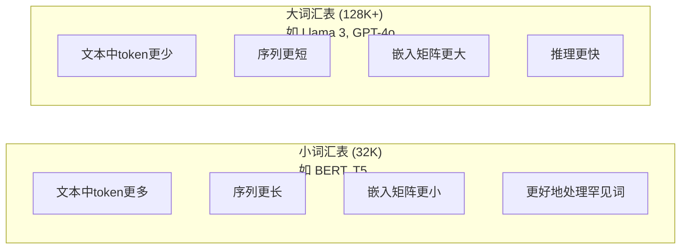

# Tokenizers: BPE, WordPiece, SentencePiece（分词器：BPE、WordPiece、SentencePiece）

> 你的大语言模型（LLM）不会读英文。它读整数。分词器决定这些整数是否携带意义或浪费意义。

**类型：** 实践  
**语言：** Python  
**先决条件：** 第05阶段（NLP基础）  
**时间：** ~90分钟

## 学习目标

- 从零实现 BPE、WordPiece 和 Unigram 分词算法，并比较它们的合并策略  
- 解释词汇表大小如何影响模型效率：太小会产生长序列，太大浪费嵌入参数  
- 分析不同语言及代码中的分词伪影，识别特定分词器失效的情况  
- 使用 tiktoken 和 sentencepiece 库对文本进行分词，并检查得到的 token ID

## 问题所在

你的 LLM 不会读英文。它不读任何语言。它读数字。

“Hello, world!” 和 [15496, 11, 995, 0] 之间的差距，就是分词器。每个单词、每个空格、每个标点都必须先转换为整数，模型才能处理。这种转换并非中立，它将假设烙印到模型中，无法事后撤销。

如果做错了，你的模型就会浪费容量，用多个 token 编码常见词。"unfortunately" 变成四个 token 而不是一个。你128K的上下文窗口，遇到多音节词时瞬间缩小75%。如果做对了，同样的上下文窗口能承载两倍信息。常见的区别是“模型能很好地处理代码”与“模型对Python处理不佳”，往往归结于分词器的训练方式。

你调用 GPT-4 或 Claude 的每次 API 都按 token 计费。模型生成的每个 token 都消耗计算资源。所需 token 越少，推理速度越快。分词不是预处理，它是架构。

## 概念介绍

### 三种失败的做法（和一种成功的）

将文本转为数字，有三种显而易见的方式，其中两种不适用大规模。

**基于单词的分词**根据空格和标点符号拆分。"The cat sat" 变成 ["The", "cat", "sat"]。简单，但“tokenization”呢？“GPT-4o”呢？或者德语复合词“Geschwindigkeitsbegrenzung”呢？基于单词需要庞大词汇表来覆盖所有语言里的所有词。漏词了，就得用可怕的 `[UNK]`（未知）token——模型用来表示“我不知道这是什么”。单英语的词形就超过一百万。再加上代码、URL、科学计数法以及100多种语言，这词汇表需要无限大。

**基于字符的分词**走了另一条路。"hello"变成["h", "e", "l", "l", "o"]。词汇表很小（几百个字符）。永远没有未知token。但序列极长。一个句子10个单词级token，变成50个字符级token。模型得学会“t”、“h”、“e”组合成“the”，白白消耗注意力资源，这对人类来说三岁就掌握了。

**基于子词的分词**找到了平衡点。常见词保持完整："the" 是一个token。罕见词拆成有意义部分："unhappiness" 变成 ["un", "happi", "ness"]。词汇表保持可管理（30K到128K token）。序列保持较短。几乎没有未知token，因为任何词都可以由子词组合构成。

现代所有 LLM 都用子词分词。GPT-2、GPT-4、BERT、Llama 3、Claude——它们都用。区别是用哪种算法。



### BPE：字节对编码（Byte Pair Encoding）

BPE 是一种贪心压缩算法，被重新用于分词。思路简单，能写在一张索引卡上。

从单个字符开始。统计训练语料中所有相邻字符对的频率。合并出现最频繁的字符对为新token。重复直到达到目标词汇大小。

下面是 BPE 在一个包含单词 "lower", "lowest", "newest" 的小语料上运行的示例：

```text
语料（含词频）：
  "lower"  x5
  "lowest" x2
  "newest" x6

步骤 0 -- 从字符开始：
  l o w e r       (x5)
  l o w e s t     (x2)
  n e w e s t     (x6)

步骤 1 -- 统计相邻字符对：
  (e,s): 8    (s,t): 8    (l,o): 7    (o,w): 7
  (w,e): 13   (e,r): 5    (n,e): 6    ...

步骤 2 -- 合并最频繁对 (w,e) -> "we":
  l o we r        (x5)
  l o we s t      (x2)
  n e we s t      (x6)

步骤 3 -- 重新统计并合并 (e,s) -> "es":
  l o we r        (x5)
  l o we s t      (x2)    <- 'es' 这里只来自 'e' + 's'，不是 'we' + 's'
  n e we s t      (x6)    <- 甚至 'e' 在 'we' 前，'s' 在 'we' 后

精确跟踪：
  合并"we"后剩余对：
  (l,o): 7   (o,we): 7   (we,r): 5   (we,s): 8
  (s,t): 8   (n,e): 6    (e,we): 6

步骤 3 -- 合并 (we,s) -> "wes" 或 (s,t) -> "st"（频率同为8，选择第一个）：
  合并 (we,s) -> "wes":
  l o we r        (x5)
  l o wes t       (x2)
  n e wes t       (x6)

步骤 4 -- 合并 (wes,t) -> "west":
  l o we r        (x5)
  l o west        (x2)
  n e west        (x6)

...持续进行直到达到目标词汇大小。
```

合并表格即为分词器。编码新文本时，按学习到的合并顺序应用。训练语料决定合并关系，永久影响模型看到的内容。



### 字节级 BPE（Byte-Level BPE，GPT-2、GPT-3、GPT-4）

标准BPE针对Unicode字符，字节级BPE针对原始字节（0-255）。这让基础词汇表恰好是256个token，支持任何语言或编码，且永不产生未知token。

GPT-2引入了此方法。基础词汇表包含所有可能字节，BPE基于此做合并。OpenAI的 tiktoken 库实现了字节级 BPE，词汇大小如下：

- GPT-2：50,257个token  
- GPT-3.5/GPT-4：约100,256个token（cl100k_base编码）  
- GPT-4o：200,019个token（o200k_base编码）

### WordPiece（BERT）

WordPiece 与 BPE 看起来相似，但合并策略不同。它不是单纯依据频率，而是最大化训练数据的似然：

```text
BPE 合并准则：      count(A, B)
WordPiece 合并准则： count(AB) / (count(A) * count(B))
```

BPE问：“哪对出现得最频繁？”WordPiece问：“哪对一起出现的概率比随机更高？”这种细微差别产生不同词汇表。WordPiece偏好那些共现惊讶度高的合并，而非仅频繁。

WordPiece中，后续子词带有“##”前缀：

```text
"unhappiness" -> ["un", "##happi", "##ness"]
"embedding"   -> ["em", "##bed", "##ding"]
```

“##”指出该部分是前一个token的延续。BERT采用WordPiece，词汇大小为30,522个token。所有BERT变种——包括DistilBERT。RoBERTa的分词器其实是BPE，但BERT本身是WordPiece。

### SentencePiece（Llama、T5）

SentencePiece 将输入视为原始Unicode字符流，包括空白符。无预分词，无语言边界规则。这使其真正语言无关，适用于中文、日文、泰文及其他无空格分词的语言。

SentencePiece支持两种算法：  
- **BPE模式**：和标准BPE逻辑相同，应用于原始字符序列  
- **Unigram模式**：从大词汇表开始，逐步删除对整体似然影响最小的token。是BPE的反向操作——剪枝而非合并。

Llama 2用的是SentencePiece BPE，词汇大小32,000。T5用SentencePiece Unigram，32,000词汇大小。注意：Llama 3改用了基于tiktoken的字节级BPE，词汇大小128,256。

### 词汇大小权衡

这是真实工程中的决策，带来可量化影响。



具体数字：128K词汇表和4,096维嵌入时，嵌入矩阵大小是 128,000 x 4,096 = 5.24亿参数。32K词汇表是1.31亿参数。单词汇表差异就带来4亿参数差别。

更大的词汇表能更积极压缩文本。一个英文段落使用32K词汇表可能需要100个token，使用128K词汇表只需70个token。这意味着生成时前向传播次数降低30%。对服务数百万请求的模型来说，直接减少计算成本。

趋势显著：词汇表规模持续增长。GPT-2用50,257。GPT-4用约10万个。Llama 3用128K。GPT-4o用20万个。

| 模型 | 词汇大小 | 分词器类型 | 每英文单词平均token数 |
|-------|---------|--------------|-------------------|
| BERT | 30,522 | WordPiece | ~1.4 |
| GPT-2 | 50,257 | 字节级 BPE | ~1.3 |
| Llama 2 | 32,000 | SentencePiece BPE | ~1.4 |
| GPT-4 | ~100,256 | 字节级 BPE | ~1.2 |
| Llama 3 | 128,256 | 字节级 BPE（tiktoken） | ~1.1 |
| GPT-4o | 200,019 | 字节级 BPE | ~1.0 |

### 多语言的“税费”

主要在英语语料上训练的分词器对其他语言极为苛刻。GPT-2分词器中，韩语词平均2-3 token。中文情况更糟。这意味着一个韩语用户的上下文窗口有效大小是英语用户的一半，却支付同样价格获取更低信息密度。

这就是 Llama 3 将词汇表从32K增长到128K的原因。给非英语字符集更多token，保证多语言使用上的压缩公平。

## 实践构建

### 步骤1：字符级分词器

从基础开始。字符级分词器直接将每个字符映射到其Unicode码点。无须训练。永不产生未知token。就是简单的映射。

```python
class CharTokenizer:
    def encode(self, text):
        return [ord(c) for c in text]

    def decode(self, tokens):
        return "".join(chr(t) for t in tokens)
```

"hello" 变成 [104, 101, 108, 108, 111]。每个字符自身就是一个token。这是我们改进的基线。

### 第 2 步：从零实现 BPE Tokenizer（字节对编码分词器）

真正的实现。我们使用原始字节（像 GPT-2 一样）进行训练，统计对（pair）出现次数，合并出现频率最高的对，并按顺序记录每一次合并。合并表就是分词器。

```python
from collections import Counter

class BPETokenizer:
    def __init__(self):
        self.merges = {}
        self.vocab = {}

    def _get_pairs(self, tokens):
        pairs = Counter()
        for i in range(len(tokens) - 1):
            pairs[(tokens[i], tokens[i + 1])] += 1
        return pairs

    def _merge_pair(self, tokens, pair, new_token):
        merged = []
        i = 0
        while i < len(tokens):
            if i < len(tokens) - 1 and tokens[i] == pair[0] and tokens[i + 1] == pair[1]:
                merged.append(new_token)
                i += 2
            else:
                merged.append(tokens[i])
                i += 1
        return merged

    def train(self, text, num_merges):
        tokens = list(text.encode("utf-8"))
        self.vocab = {i: bytes([i]) for i in range(256)}

        for i in range(num_merges):
            pairs = self._get_pairs(tokens)
            if not pairs:
                break
            best_pair = max(pairs, key=pairs.get)
            new_token = 256 + i
            tokens = self._merge_pair(tokens, best_pair, new_token)
            self.merges[best_pair] = new_token
            self.vocab[new_token] = self.vocab[best_pair[0]] + self.vocab[best_pair[1]]

        return self

    def encode(self, text):
        tokens = list(text.encode("utf-8"))
        for pair, new_token in self.merges.items():
            tokens = self._merge_pair(tokens, pair, new_token)
        return tokens

    def decode(self, tokens):
        byte_sequence = b"".join(self.vocab[t] for t in tokens)
        return byte_sequence.decode("utf-8", errors="replace")
```

训练循环是 BPE 的核心：统计对，合并胜出者，重复。每次合并都减少总的 token 数量。经过 `num_merges` 轮后，词汇表从 256（基础字节）增长到 256 + num_merges。

编码时必须按照学习的绝对顺序应用合并。这很重要。如果第 1 个合并产生了 "th"，第 5 个合并产生了 "the"，那么编码时必须先应用第 1 个合并，这样第 5 个合并才能将 "th" + "e" 合成 "the"。

解码是逆过程：查表每个 token ID，拼接字节序列，再按 UTF-8 解码。

### 第 3 步：编码和解码的往返测试

```python
corpus = (
    "The cat sat on the mat. The cat ate the rat. "
    "The dog sat on the log. The dog ate the frog. "
    "Natural language processing is the study of how computers "
    "understand and generate human language. "
    "Tokenization is the first step in any NLP pipeline."
)

tokenizer = BPETokenizer()
tokenizer.train(corpus, num_merges=40)

test_sentences = [
    "The cat sat on the mat.",
    "Natural language processing",
    "tokenization pipeline",
    "unhappiness",
]

for sentence in test_sentences:
    encoded = tokenizer.encode(sentence)
    decoded = tokenizer.decode(encoded)
    raw_bytes = len(sentence.encode("utf-8"))
    ratio = len(encoded) / raw_bytes
    print(f"'{sentence}'")
    print(f"  Tokens: {len(encoded)} (from {raw_bytes} bytes) -- ratio: {ratio:.2f}")
    print(f"  Roundtrip: {'PASS' if decoded == sentence else 'FAIL'}")
```

压缩比告诉你分词器的效率。0.50 的比率表示分词器将文本压缩到原始字节数的一半的 token 数量。比率越低越好。在训练语料上比率会很好；对如 "unhappiness" （语料中未出现）这类分布外文本，比率会差一些——分词器会回退到字符级编码来处理未见过的模式。

### 第 4 步：与 tiktoken 的对比

```python
import tiktoken

enc = tiktoken.get_encoding("cl100k_base")

texts = [
    "The cat sat on the mat.",
    "unhappiness",
    "Hello, world!",
    "def fibonacci(n): return n if n < 2 else fibonacci(n-1) + fibonacci(n-2)",
    "Geschwindigkeitsbegrenzung",
]

for text in texts:
    our_tokens = tokenizer.encode(text)
    tiktoken_tokens = enc.encode(text)
    tiktoken_pieces = [enc.decode([t]) for t in tiktoken_tokens]
    print(f"'{text}'")
    print(f"  Our BPE:   {len(our_tokens)} tokens")
    print(f"  tiktoken:  {len(tiktoken_tokens)} tokens -> {tiktoken_pieces}")
```

tiktoken 使用完全相同的算法，但在数百 GB 文本上训练、进行了 10 万次合并。算法相同，区别在于训练数据和合并次数。你基于一段文本训练的 40 次合并的分词器，无法和 tiktoken 在海量语料上 10 万次合并的表现比拟，但原理一致。

### 第 5 步：词汇表分析

```python
def analyze_vocabulary(tokenizer, test_texts):
    total_tokens = 0
    total_chars = 0
    token_usage = Counter()

    for text in test_texts:
        encoded = tokenizer.encode(text)
        total_tokens += len(encoded)
        total_chars += len(text)
        for t in encoded:
            token_usage[t] += 1

    print(f"Vocabulary size: {len(tokenizer.vocab)}")
    print(f"Total tokens across all texts: {total_tokens}")
    print(f"Total characters: {total_chars}")
    print(f"Avg tokens per character: {total_tokens / total_chars:.2f}")

    print(f"\nMost used tokens:")
    for token_id, count in token_usage.most_common(10):
        token_bytes = tokenizer.vocab[token_id]
        display = token_bytes.decode("utf-8", errors="replace")
        print(f"  Token {token_id:4d}: '{display}' (used {count} times)")

    unused = [t for t in tokenizer.vocab if t not in token_usage]
    print(f"\nUnused tokens: {len(unused)} out of {len(tokenizer.vocab)}")
```

这揭示了词汇表中的 Zipf 分布。少数几个 token 占主导（空格、"the"、"e"）。大多数 token 很少出现。生产环境的分词器会针对这种分布进行优化——常见模式用更短的 token ID，罕见模式用更长表示。

## 使用它

你的手写 BPE 运行了。现在看看生产级工具是什么样子。

### tiktoken（OpenAI）

```python
import tiktoken

enc = tiktoken.get_encoding("cl100k_base")

text = "Tokenizers convert text to integers"
tokens = enc.encode(text)
print(f"Tokens: {tokens}")
print(f"Pieces: {[enc.decode([t]) for t in tokens]}")
print(f"Roundtrip: {enc.decode(tokens)}")
```

tiktoken 用 Rust 编写，提供 Python 绑定，编码速度达到每秒数百万 token。使用同样的 BPE 算法，工业级实现。

### Hugging Face tokenizers

```python
from tokenizers import Tokenizer
from tokenizers.models import BPE
from tokenizers.trainers import BpeTrainer
from tokenizers.pre_tokenizers import ByteLevel

tokenizer = Tokenizer(BPE())
tokenizer.pre_tokenizer = ByteLevel()

trainer = BpeTrainer(vocab_size=1000, special_tokens=["<pad>", "<eos>", "<unk>"])
tokenizer.train(["corpus.txt"], trainer)

output = tokenizer.encode("The cat sat on the mat.")
print(f"Tokens: {output.tokens}")
print(f"IDs: {output.ids}")
```

Hugging Face 的 tokenizers 库底层也是 Rust。能在几秒钟内在 GB 级语料上训练 BPE。这是你训练自有模型时用的工具。

### 加载 Llama 的分词器

```python
from transformers import AutoTokenizer

tokenizer = AutoTokenizer.from_pretrained("meta-llama/Llama-3.1-8B")

text = "Tokenizers are the unsung heroes of LLMs"
tokens = tokenizer.encode(text)
print(f"Token IDs: {tokens}")
print(f"Tokens: {tokenizer.convert_ids_to_tokens(tokens)}")
print(f"Vocab size: {tokenizer.vocab_size}")

multilingual = ["Hello world", "Hola mundo", "Bonjour le monde"]
for text in multilingual:
    ids = tokenizer.encode(text)
    print(f"'{text}' -> {len(ids)} tokens")
```

Llama 3 的 128K 词汇表对非英文文本的压缩远优于 GPT-2 的 50K。你可以自己验证 —— 对同一句多语言编码，比较 token 数量。

## 发布它

本课将生成 `outputs/prompt-tokenizer-analyzer.md` —— 一个可复用提示，分析任何文本与模型组合的分词效率。输入文本样本，它会告诉你哪个模型的分词器表现最优。

## 练习

1. 修改 BPE 分词器，使其在每一步合并时打印词汇表。观察 “t” + “h” 变成 “th”，再如何 “th” + “e” 变成 “the”。跟踪常见英文单词如何逐步组装。

2. 向 BPE 分词器添加特殊 token（`<pad>`、`<eos>`、`<unk>`），分配 ID 为 0、1、2，其他所有 token ID 相应向后移动。实现一个预分词步骤，在运行 BPE 前先按空白符切分。

3. 实现 WordPiece 的合并准则（用似然比替代频率，likelihood ratio = count(AB)/(count(A)*count(B))）。在同一语料、同样合并次数下分别训练 BPE 和 WordPiece，比较两者的词汇表——哪个产生的子词更具语言学意义？

4. 构建一个多语言分词效率基准。选取英文、西班牙文、中文、韩文和阿拉伯文各 10 句话。用 tiktoken（cl100k_base）分别分词，计算每个语言的平均 token/字符比，量化“多语言惩罚”。

5. 用更大语料（下载一篇维基百科文章）训练你的 BPE 分词器。调节合并次数，使压缩比在该文本上与 tiktoken 差距不超过 10%。这迫使你理解语料大小、合并次数和压缩质量的关系。

## 关键词

| 术语 | 常被说成 | 实际含义 |
|------|----------|----------|
| Token | “一个单词” | 模型词汇表中的一个单位——可以是字符、子词、单词或多词片段 |
| BPE | “某种压缩技术” | Byte Pair Encoding（字节对编码）——迭代合并出现频率最高的相邻 token 对，直到达到目标词汇表大小 |
| WordPiece | “BERT 的分词器” | 类似 BPE，但合并准则是最大化似然比 count(AB)/(count(A)*count(B))，而非单纯频率 |
| SentencePiece | “一个分词库” | 语言无关的分词器，直接对原始 Unicode 操作，无需预分词，支持 BPE 和 Unigram 算法 |
| Vocabulary size | “它知道多少单词” | 唯一 token 总数：GPT-2 有 50,257，BERT 有 30,522，Llama 3 有 128,256 |
| Fertility（繁殖率） | “不是分词术语” | 平均每个单词映射多少 token —— 衡量分词效率（1.0 最优，3.0 表示模型工作负担是正常的三倍） |
| Byte-level BPE | “GPT 的分词器” | 对原始字节（0-255）执行 BPE，确保输入不会出现未知 token |
| Merge table | “分词器文件” | 按顺序的合并对列表——这就是分词器，顺序很重要 |
| Pre-tokenization | “通过空格切分” | 子词分词前的规则：空白切分、数字分离、标点处理 |
| Compression ratio | “分词效率” | 生成 token 数除以输入字节数——越低越好，代表更好压缩、更快推理 |

## 深入阅读

- [Sennrich 等人，2016 -- "Neural Machine Translation of Rare Words with Subword Units"](https://arxiv.org/abs/1508.07909) -- 该论文介绍了用于 NLP 的 BPE，将1994年的压缩算法转变为现代分词（tokenization）的基础
- [Kudo & Richardson，2018 -- "SentencePiece: A simple and language independent subword tokenizer"](https://arxiv.org/abs/1808.06226) -- 语言无关的分词方法，使多语言模型变得实用
- [OpenAI tiktoken 仓库](https://github.com/openai/tiktoken) -- 用 Rust 实现并带有 Python 绑定的生产级 BPE 实现，应用于 GPT-3.5/4/4o
- [Hugging Face Tokenizers 文档](https://huggingface.co/docs/tokenizers) -- 拥有 Rust 性能的生产级分词器训练
