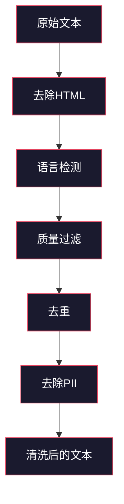
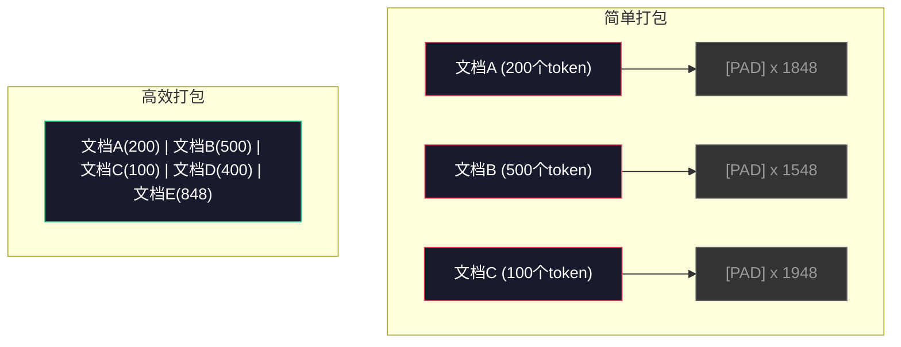

# 预训练的数据管道

> 模型是一面镜子。它反映你输入的任何数据。输入垃圾，它也会以完美流畅的方式反映垃圾。

**类型：** 构建  
**语言：** Python  
**前置知识：** 第10阶段，第01-02课（分词器，构建分词器）  
**时间：** 约90分钟  

## 学习目标

- 构建一个流式数据管道，实现对TB级文本的分词、分块、乱序和批处理，而无需全部加载到内存中  
- 实现真实预训练管道中使用的数据质量过滤器（去重、语言检测、内容过滤）  
- 创建固定长度的训练序列，正确设置注意力掩码并处理文档边界  
- 对管道吞吐量进行性能分析，确保数据加载速度跟上GPU训练速度  

## 问题描述

你有一个分词器。现在你需要数据。

不是一个数据集，不是一个CSV文件，而是TB级别的文本——经过清理、去重、质量过滤、分词成固定长度序列，并以随机批次足够快速地提供，保证你的8-GPU集群永远不等待下一个批次。

大多数人认为训练大语言模型（LLM）是关于模型架构的。其实不是。Llama 3用了15.6万亿（trillion）个token，GPT-3用了3000亿，DeepSeek-V2用了8.1万亿。这三者的架构大致相同：堆叠的Transformer（Transformer 架构）块，包含注意力层和前馈层。输出质量的差异，很大程度上来自数据。

DeepMind的Chinchilla论文阐明了这个点。对于给定的计算预算，有一个模型参数数量与训练token数量的最佳比例。Chinchilla证明，2022年的大多数模型都严重训练不足——相比它们看到的数据量，它们的参数太多。一个70B参数模型训练于1.4万亿token（符合Chinchilla最优），比一个训练于3000亿token的280B模型（Gopher）表现更好。

你的数据管道决定了你的模型是学习语言还是学习噪声。

## 概念介绍

### 数据来源

每个大语言模型都训练于多种来源混合的数据。确切比例对大多数实验室是商业机密，但我们足够了解不同类别。

| 来源 | 大小 | 质量 | 使用者 |
|--------|------|---------|---------|
| Common Crawl | ~250 TB 原始数据 | 低（需大量过滤） | GPT-3、Llama、大多数开源模型 |
| 维基百科（Wikipedia） | ~20 GB | 高 | 所有主要LLM |
| GitHub代码 | ~1 TB+ | 中（大量重复、死代码） | StarCoder、CodeLlama、DeepSeek-Coder |
| 书籍（BookCorpus, Pile） | ~100 GB | 高 | GPT-2、GPT-3、早期模型 |
| 学术论文（arXiv, S2ORC） | ~100 GB | STEM领域高质量 | Llama、Galactica |
| StackOverflow, Reddit | ~100 GB | 中等 | Llama、Falcon |
| 精选网页（C4, RefinedWeb） | ~5 TB | 中高（预过滤） | T5、Falcon |

Llama 3披露了其数据结构：大约50%为网络数据，25%是代码，13%是书籍和学术论文，8%是数学数据，4%是多语言网络数据。总计为15.6万亿token，来源合计超过5TB的原始文本。

比例和总大小同等重要。过多网页数据，模型就像Reddit鹦鹉；代码太少，无法编程；数学数据不足，推理失败。如何调配此混合，是训练大语言模型最难的部分之一，且没有公式，需依赖实验和评估。

### 数据清洗

原始网页数据非常脏。典型的Common Crawl数据包含：

- HTML标签和JavaScript  
- 样板头部、页脚、导航菜单  
- 重复页面（完全重复和近重复）  
- 机器生成的垃圾内容  
- 个人身份信息（PII）  
- 低质量文本（关键词列表、SEO垃圾）  
- 作为文本编码的非文本内容  

清洗不可选，否则模型会生成连贯段落与混杂产品列表和HTML标签的区别。



每个步骤消除一类噪声：

**去除HTML：** 移除所有标记，只保留可见文本内容。使用如 `trafilatura` 或 `readability` 等库提取文章主体，去除导航、广告和样板内容。

**语言检测：** 利用fastText的语言检测模型（lid.176.bin）分类每篇文档，过滤出目标语言。被分类为英语且置信度低于0.8的文档，可能不是干净的英文。

**质量过滤：** 要点来了。Falcon背后的数据集RefinedWeb使用基于困惑度（perplexity）的过滤器：用小语言模型训练维基百科数据，再对每篇文档评分。高困惑度表示文档与维基百科差异大——很可能是垃圾内容、关键词列表或机器生成内容。困惑度高于阈值的文档被移除。

**去重：** 是最有影响力的清理步骤。Common Crawl包含海量重复页面，比如法律声明、Cookie通知、服务条款。训练时带重复内容浪费计算资源，还可能导致模型记忆并逐字复述特定段落。

**PII去除：** 名字、邮箱、电话、社保号等。通过正则表达式检测结构化PII，利用NER模型基于上下文识别名字。

### 使用MinHash实现去重

精确去重很简单：对每个文档hash，移除重复。但真实问题是近重复：两篇同一新闻的不同广告版本，约95%相似但字节不同。

MinHash 和 局部敏感哈希（LSH）高效处理此问题。


思路：

1. **Shingling（分片）：** 将每个文档转成n-gram集合（如5个词或字符构成一个shingle）。“the quick brown fox”用3词shingle就是 {"the quick brown", "quick brown fox"}。

2. **MinHash：** 对每个文档的shingle集合计算k个hash值。每个hash值是不同hash函数下所有shingle的最小hash值。这生成了一个固定大小的签名，用于估算两个文档的Jaccard相似度。

3. **LSH：** 根据MinHash签名分段分桶。处于同一桶的文档是可能的近重复对。避免了所有对的比较，只比较候选对。

4. **验证：** 对候选对计算精确Jaccard相似度。超过阈值（一般0.8）则去除一个副本。

Llama团队称其通过去重清除约38%的网络数据。这数量不小。超过三分之一的Common Crawl内容是重复或近重复。

### 序列打包（Sequence Packing）

你的模型需要固定长度输入序列。文档长度各异：有的50 token，有的50000 token。

简单办法：每篇文档填充至最大序列长度。这会浪费大量计算资源在没有学习贡献的padding上。

更优办法：将多篇文档打包进一个序列，中间用结束符（EOS）分隔。2048-token序列可能包含三个短文档，每个间用 [EOS] 分隔。



注意力掩码（attention mask）必须正确设置。文档A内的token不应关注文档B里的token，需采用块状对角矩阵掩码。

长文档会在序列边界截断或切成多个块。切点很重要：句中拆分使模型只能看到不完整思想，有些管道会尽量对齐至段落或句子边界。

### Chinchilla缩放定律

固定计算预算C（以FLOPs计），最优模型大小N和数据大小D的关系为：

```text
N_opt ~ C^0.5
D_opt ~ C^0.5
```

实践中，模型参数数量和训练token数量应大致同步增长。参数多10倍，训练token需求也约10倍，以达到相同损失水平。

| 模型 | 参数量 | 训练token数 | 是否符合Chinchilla最优？ |
|-------|--------|-------------|-------------------------|
| GPT-3 | 175B   | 300B        | 否（训练不足3-4倍）      |
| Chinchilla | 70B   | 1.4T        | 是（设计值）            |
| Llama 2 | 70B   | 2T          | 过度训练（故意）         |
| Llama 3 | 70B   | 15T         | 严重过度训练             |

Llama 3故意违反了Chinchilla定律。Meta发现，在推理应用中，相较于计算最优比例，更多的数据过度训练能获得更优模型。额外的训练成本只需付出一次，但为更小模型服务带来更低成本。2024年后，此“推理最优”缩放方式成为业界标准。

## 构建实现

### 第1步：文本清理

去除HTML，标准化空白，移除非文本内容。我们使用公共领域文本（古腾堡计划Project Gutenberg）作为小型语料库。

```python
import re

def clean_text(text):
    text = re.sub(r"<[^>]+>", "", text)
    text = re.sub(r"http\S+", "", text)
    text = re.sub(r"[^\x20-\x7E\n]", "", text)
    text = re.sub(r"\n{3,}", "\n\n", text)
    text = re.sub(r" {2,}", " ", text)
    return text.strip()

def quality_filter(text, min_words=50, max_ratio_caps=0.3, max_ratio_special=0.1):
    words = text.split()
    if len(words) < min_words:
        return False
    caps_ratio = sum(1 for w in words if w.isupper()) / len(words)
    if caps_ratio > max_ratio_caps:
        return False
    special_chars = sum(1 for c in text if not c.isalnum() and not c.isspace())
    if special_chars / max(len(text), 1) > max_ratio_special:
        return False
    return True
```

质量过滤器会拦截SEO垃圾内容（全大写），机器生成的噪声（特殊字符比例高），以及内容过短的空壳页面。这三项检查本身就能从网页抓取的数据中剔除大量垃圾信息。

### 步骤 2：MinHash 去重

从零实现 MinHash。无需外部库，只用 `hashlib`。

```python
import hashlib
from collections import defaultdict

def get_shingles(text, k=5):
    words = text.lower().split()
    if len(words) < k:
        return set()
    return {" ".join(words[i:i+k]) for i in range(len(words) - k + 1)}

def minhash_signature(shingles, num_hashes=128):
    signature = []
    for i in range(num_hashes):
        min_hash = float("inf")
        for shingle in shingles:
            h = int(hashlib.sha256(f"{i}:{shingle}".encode()).hexdigest(), 16)
            min_hash = min(min_hash, h)
        signature.append(min_hash)
    return signature

def lsh_buckets(signature, bands=16):
    rows_per_band = len(signature) // bands
    buckets = []
    for b in range(bands):
        start = b * rows_per_band
        band_data = tuple(signature[start:start + rows_per_band])
        bucket_hash = hashlib.md5(str(band_data).encode()).hexdigest()
        buckets.append((b, bucket_hash))
    return buckets

def deduplicate(documents, threshold=0.8, num_hashes=128, bands=16):
    signatures = []
    shingle_sets = []
    for doc in documents:
        shingles = get_shingles(doc)
        shingle_sets.append(shingles)
        signatures.append(minhash_signature(shingles, num_hashes))

    bucket_map = defaultdict(list)
    for doc_idx, sig in enumerate(signatures):
        for band_id, bucket_hash in lsh_buckets(sig, bands):
            bucket_map[(band_id, bucket_hash)].append(doc_idx)

    duplicate_pairs = set()
    for bucket_docs in bucket_map.values():
        if len(bucket_docs) < 2:
            continue
        for i in range(len(bucket_docs)):
            for j in range(i + 1, len(bucket_docs)):
                duplicate_pairs.add((bucket_docs[i], bucket_docs[j]))

    removed = set()
    for i, j in duplicate_pairs:
        if i in removed or j in removed:
            continue
        s1, s2 = shingle_sets[i], shingle_sets[j]
        if not s1 or not s2:
            continue
        jaccard = len(s1 & s2) / len(s1 | s2)
        if jaccard >= threshold:
            removed.add(j)

    return [doc for idx, doc in enumerate(documents) if idx not in removed], len(removed)
```

参数 `num_hashes=128` 和 `bands=16` 控制精准率与召回率的权衡。更多的哈希函数能获得更精确的相似度估计。更多的桶数（bands）增加召回率（捕获更多重复），但也会带来更多误报。这些参数适用于典型的网页文本。

### 步骤 3：分词和序列打包

对经过清理和去重后的文本进行分词，并打包成固定长度的训练序列。

```python
def tokenize_corpus(documents, tokenizer):
    all_tokens = []
    for doc in documents:
        tokens = tokenizer.encode(doc)
        all_tokens.extend(tokens)
        all_tokens.append(tokenizer.eos_id)
    return all_tokens

def pack_sequences(token_ids, seq_length, pad_id=0):
    sequences = []
    attention_masks = []
    for i in range(0, len(token_ids), seq_length):
        seq = token_ids[i:i + seq_length]
        mask = [1] * len(seq)
        if len(seq) < seq_length:
            pad_count = seq_length - len(seq)
            seq = seq + [pad_id] * pad_count
            mask = mask + [0] * pad_count
        sequences.append(seq)
        attention_masks.append(mask)
    return sequences, attention_masks
```

### 步骤 4：训练用数据加载器（DataLoader）

生成随机化的打包序列批次，供训练循环消费。

```python
import random

class PreTrainingDataLoader:
    def __init__(self, sequences, attention_masks, batch_size, shuffle=True):
        self.sequences = sequences
        self.attention_masks = attention_masks
        self.batch_size = batch_size
        self.shuffle = shuffle

    def __len__(self):
        return (len(self.sequences) + self.batch_size - 1) // self.batch_size

    def __iter__(self):
        indices = list(range(len(self.sequences)))
        if self.shuffle:
            random.shuffle(indices)
        for start in range(0, len(indices), self.batch_size):
            batch_idx = indices[start:start + self.batch_size]
            batch_seqs = [self.sequences[i] for i in batch_idx]
            batch_masks = [self.attention_masks[i] for i in batch_idx]
            yield batch_seqs, batch_masks
```

### 步骤 5：数据集统计

计算关键统计指标：总令牌数、唯一令牌数、压缩率、文档长度分布。

```python
from collections import Counter

def compute_statistics(documents, token_ids, sequences, tokenizer_vocab_size):
    total_chars = sum(len(d) for d in documents)
    total_tokens = len(token_ids)
    unique_tokens = len(set(token_ids))
    compression_ratio = total_chars / total_tokens

    doc_lengths = [len(d.split()) for d in documents]
    avg_doc_length = sum(doc_lengths) / max(len(doc_lengths), 1)
    max_doc_length = max(doc_lengths) if doc_lengths else 0
    min_doc_length = min(doc_lengths) if doc_lengths else 0

    token_counts = Counter(token_ids)
    top_tokens = token_counts.most_common(10)

    non_pad_tokens = sum(sum(1 for t in seq if t != 0) for seq in sequences)
    total_positions = sum(len(seq) for seq in sequences)
    utilization = non_pad_tokens / max(total_positions, 1)

    stats = {
        "total_documents": len(documents),
        "total_characters": total_chars,
        "total_tokens": total_tokens,
        "unique_tokens": unique_tokens,
        "vocab_utilization": unique_tokens / tokenizer_vocab_size,
        "compression_ratio": compression_ratio,
        "avg_doc_length_words": avg_doc_length,
        "max_doc_length_words": max_doc_length,
        "min_doc_length_words": min_doc_length,
        "num_sequences": len(sequences),
        "sequence_utilization": utilization,
        "top_10_tokens": top_tokens,
    }
    return stats
```

压缩率说明分词器在该语料上的效率。英文文本通常约为每个令牌 3-4 个字符。如果看到 1.5 字符每令牌，说明分词器切得过细；如果达到 8 个以上，说明分词器学习了非常领域特定的合并策略。

序列利用率反映了打包序列中实际数据占比与填充（pad）占比。低于 90% 意味着打包效率不高，产生大量填充令牌浪费计算资源。

## 使用示例

### 与 HuggingFace Datasets 对比

通过 HuggingFace 的 datasets 库加载相同语料，比较流水线速度。

```python
from datasets import load_dataset
from transformers import AutoTokenizer

ds = load_dataset("wikitext", "wikitext-2-raw-v1", split="train")
tokenizer = AutoTokenizer.from_pretrained("meta-llama/Meta-Llama-3-8B")

import time

start = time.time()
tokenized = ds.map(
    lambda x: tokenizer(x["text"], truncation=True, max_length=2048),
    batched=True,
    num_proc=4,
)
hf_time = time.time() - start
total_tokens = sum(len(t) for t in tokenized["input_ids"])
print(f"HuggingFace: {total_tokens:,} tokens in {hf_time:.2f}s ({total_tokens/hf_time:,.0f} tokens/sec)")
```

HuggingFace 流水线底层使用 Rust 实现的分词器，并行跨 4 核心处理。纯 Python 实现会慢 10-50 倍。这就是为什么生产团队偏好编译语言分词器。算法相同，区别在于实现语言。

## 上线使用

本课产生了一个用于验证和调试大型语言模型训练数据质量的提示模板，见 `outputs/prompt-data-quality-checker.md`。

## 练习

1. **简单：**  用简单启发式方法（字符集分析）给清理流水线添加语言检测。仅保留英文文档，并统计清理掉了多少文档。
2. **中等：**  在 MinHash 近似去重之外，实现基于 SHA-256 的精确去重。比较两种方法在爬取网络语料上捕获的重复数。
3. **困难：**  构建基于困惑度（perplexity）的质量过滤器。在维基百科语料上训练小型二元语法模型，对文档打分并去除困惑度最高的 20%。比较使用过滤和未过滤数据训练的模型质量差异。

## 关键词汇

| 术语 | 常见说法 | 实际含义 |
|------|----------|----------|
| Common Crawl | “互联网” | 一个非营利组织，每月爬取网页约 250TB 原始数据，是大多数大型语言模型训练数据的起点 |
| MinHash | “某种哈希技巧” | 使用固定大小签名估计集合 Jaccard 相似度的技术 —— 支持大规模近重复检测 |
| LSH | “局部敏感哈希（Locality-Sensitive Hashing）” | 将相似项归入同一桶的算法 —— 将成对比较从 O(n²) 降至近线性 |
| Sequence packing | “拼接文档” | 将多份文档装入固定长度序列，并配合正确的注意力掩码（attention mask） —— 消除填充浪费 |
| Chinchilla scaling | “训练更多数据” | 固定计算预算下，最佳性能需模型大小和训练令牌数大致同等比例扩展 |
| Fertility | “每词令牌数” | 平均每个词对应的令牌数 —— GPT-4 中英语约为 1.3，非拉丁文字更高 |
| Data mixing | “挑选训练数据” | 代码、文本、数学、多语种数据比例 —— 无最佳公式，需反复试验 |
| Perplexity filter | “质量评分” | 用小型语言模型给文档打分 —— 高困惑度说明文本与干净参考数据差异大 |
| Deduplication | “去重” | 删除完全相同或近重复文档 —— 通常能剔除原始网络数据的 30-40% |
| Attention mask | “关注哪些令牌” | 二进制掩码，防止模型跨文档边界注意，保证打包序列中序列独立 |

## 进一步阅读

- [Hoffmann et al., 2022 -- 训练计算最优大型语言模型（Chinchilla）](https://arxiv.org/abs/2203.15556) —— 改变我们对数据规模认知的论文
- [Penedo et al., 2023 -- Falcon LLM 的 RefinedWeb 数据集](https://arxiv.org/abs/2306.01116) —— 如何过滤 Common Crawl 保证高质量
- [Touvron et al., 2023 -- Llama 2：开源基础模型和微调聊天模型](https://arxiv.org/abs/2307.09288) —— Llama 2 的数据流水线细节
- [Lee et al., 2022 -- 去重复训练数据能让语言模型更好](https://arxiv.org/abs/2107.06499) —— 为什么去重比你想象的重要
- [Broder, 1997 -- 文档的相似度与包含性](https://ieeexplore.ieee.org/document/666900) —— 原始 MinHash 论文
- [Meta, 2024 -- Llama 3 技术报告](https://arxiv.org/abs/2407.21783) —— 15.6T 令牌，数据混合比例，过滤流水线
