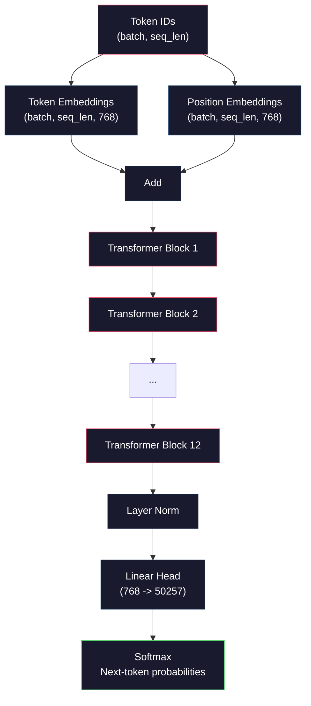
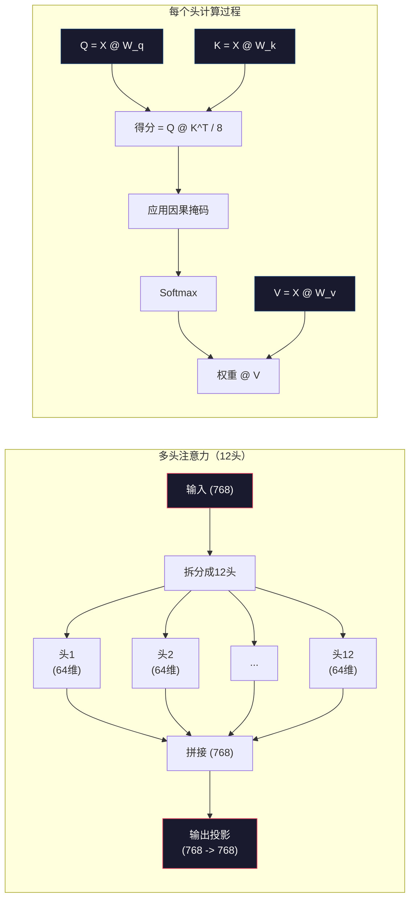
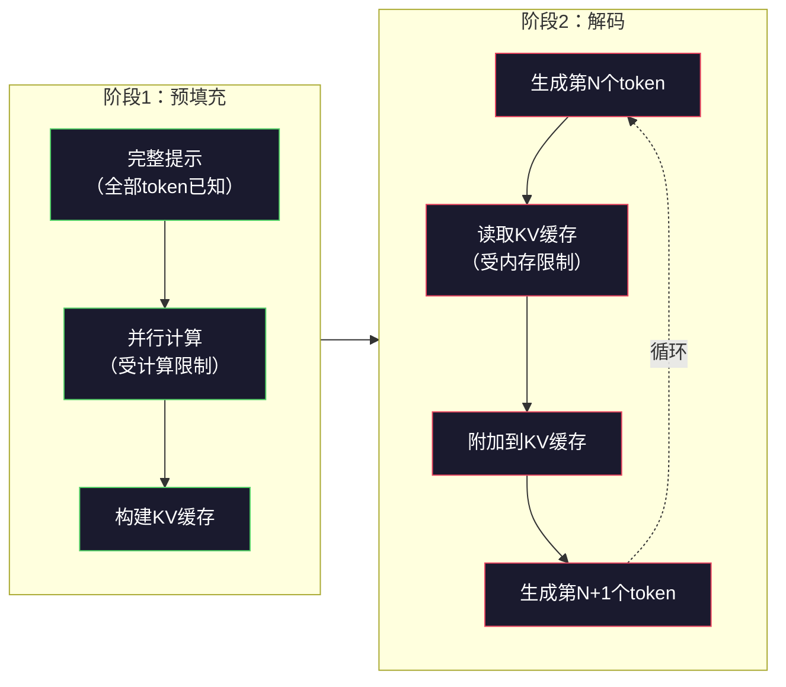

# 预训练一个迷你 GPT（1.24亿参数）

> GPT-2 Small 有1.24亿参数。包含12层transformer（Transformer 架构）块，12个注意力头（attention heads），768维的嵌入向量。你可以用一块GPU几小时内从零开始训练。大多数人不做这件事。他们使用预训练的检查点。但如果你不自己训一个，你实际上并不了解构建产品时模型内部发生了什么。

**类型：** 构建  
**语言：** Python（含 numpy）  
**先修课程：** 阶段10，第01-03课（分词器，构建分词器，数据流水线）  
**时间：** 约120分钟

## 学习目标

- 从零实现完整的GPT-2架构（1.24亿参数）：词嵌入（token embeddings）、位置嵌入（positional embeddings）、transformer块和语言模型头
- 使用交叉熵损失（cross-entropy loss）基于文本语料训练GPT模型进行下一令牌预测
- 实现自回归文本生成，支持温度采样（temperature sampling）及top-k/top-p过滤
- 监控训练损失曲线，验证模型是否学会连贯的语言模式

## 问题描述

你知道什么是transformer。你看过各种示意图。你能背诵“attention is all you need”并能在白板上画出贴有“Multi-Head Attention”标签的方框。

但这些并不意味着你理解生成文本时模型内部发生了什么。

GPT-2 Small（权重共享）有124,438,272个参数。这其中的每一个，都是通过训练循环执行：前向传播、计算损失、反向传播、更新权重设置的。12个transformer块，每块12个注意力头，768维嵌入空间，50257个词表大小。每当模型生成一个令牌时，所有1.24亿参数都参与了一个矩阵乘法链，将一串token ID映射成下一令牌的概率分布。

如果你从未自己构建过这个模型，就像在操作一个黑箱。你可以调用API，进行微调。但当出现问题时——比如模型产生幻觉、重复自己、拒绝遵循指令——你根本没有心理模型理解“为什么”。

本课将从零开始用numpy（而非PyTorch）实现GPT-2 Small。每个矩阵乘法都清晰可见。每个梯度都由你的代码计算。你将直观看到1.24亿数字如何协同预测下一个词。

## 概念介绍

### GPT架构

GPT是一个自回归语言模型（autoregressive language model）。“自回归”表示它一次生成一个token，每个token都基于之前所有token条件生成。其架构是一叠transformer解码器块（transformer decoder blocks）。

以下是从token ID到下一token概率的完整计算图：

1. 输入token ID，形状：(batch_size, seq_len)。
2. 查词嵌入：每个ID映射到768维向量，形状：(batch_size, seq_len, 768)。
3. 查位置嵌入：每个位置（0, 1, 2, ...）映射到768维向量，形状相同。
4. 叠加词嵌入与位置嵌入。
5. 通过12个transformer块。
6. 最终层归一化（layer normalization）。
7. 线性投影到词表大小，形状：(batch_size, seq_len, vocab_size)。
8. 经过softmax得到概率分布。

整个模型就是这样。无卷积，无循环。只有嵌入、注意力、前馈网络和层归一化，堆叠12次。



### Transformer块

12个块结构相同，采用预归一化（pre-norm）架构（GPT-2采用pre-norm，而非原始transformer的post-norm）：

1. 层归一化（LayerNorm）
2. 多头自注意力（Multi-Head Self-Attention）
3. 残差连接（输入相加）
4. 层归一化（LayerNorm）
5. 前馈网络（Feed-Forward Network，MLP）
6. 残差连接（输入相加）

残差连接至关重要。没有它们，梯度在反向传播过程中传播到第1块时会消失。有了它们，梯度可以通过跳跃路径直接从损失传递到任意层。这就是为什么你可以堆叠12、32甚至96个块（据传GPT-4使用120层）。

### 注意力机制

自注意力（self-attention）允许每个token关注所有之前token，并决定关注程度。数学公式如下。

对每个token位置，从输入计算三个向量：  
- **Query（Q）**：“我在找什么？”  
- **Key（K）**：“我包含什么？”  
- **Value（V）**：“我携带什么信息？”

```text
Q = input @ W_q    (768 -> 768)
K = input @ W_k    (768 -> 768)
V = input @ W_v    (768 -> 768)

attention_scores = Q @ K^T / sqrt(d_k)
attention_scores = mask(attention_scores)   # 因果掩码：未来位置得分为 -inf
attention_weights = softmax(attention_scores)
output = attention_weights @ V
```

因果掩码保证GPT是自回归的。位置5可关注0到5，但不能关注6、7、8等未来位置，防止训练时模型“作弊”窥探未来token。

**多头注意力**将768维拆成12个64维头，每个头学习不同的注意力模式。一个头可能捕捉语法关系（主谓一致），另一个头捕捉语义相似（同义词），第三个头捕捉位置邻近（附近词汇）。12个头的输出拼接后映射回768维。



除以sqrt(d_k)——sqrt(64)=8——是缩放操作。否则高维点积值过大，softmax会进入梯度近零区域。这是“Attention Is All You Need”论文的关键贡献之一。

### KV缓存：推理加速秘诀

训练时一次处理全序列。推理时逐个生成token。若无优化，生成第N个token时需重新计算前N-1个token的注意力，单个生成步开销是O(N^2)，长度为N的序列总开销是O(N^3)。

KV缓存解决此问题。计算每个token的K和V后缓存，下次生成新token只需计算新的Q并查询缓存的K、V。这样K、V计算成本从O(N)降为O(1)。注意力得分还需O(N)遍历先前token，但避免了重复矩阵乘法。

GPT-2有12层12头的KV缓存量为：2（K+V）×12层×12头×64维 = 18432个数/token。1024token序列大约占用75MB FP32内存。Llama 3 405B有128层，单序列的KV缓存可超过10GB，这也是长上下文推理受限于内存的原因。

### Prefill与Decode：推理的两个阶段

给大语言模型（LLM）发起提示时，推理分两阶段：

**Prefill**并行处理完整提示。所有令牌已知，因此注意力可同时计算。此阶段受计算资源限制，GPU全速执行矩阵乘法。以A100 GPU为例，处理1000个token预填充约需20-50ms。

**Decode**逐步生成token。每个新token依赖历史全部token。此阶段受内存带宽限制，瓶颈在于从GPU内存读取模型权重和KV缓存，而非矩阵运算。GPU计算核心大部分时间空闲等待内存。GPT-2的每步解码耗时几乎不受矩阵乘法FLOPs影响，因为内存带宽才是关键。

此区别对生产系统影响巨大。Prefill吞吐随GPU计算性能线性增长（更多FLOPS更快）。Decode吞吐随内存带宽增长（更快内存更快解码）。这也是NVIDIA H100相较A100更注重内存带宽提升的原因——直接加速token生成。



### 训练循环

训练大语言模型是做下一令牌预测。给定令牌序列[0, 1, 2, ..., N-1]，预测序列[1, 2, 3, ..., N]。损失函数是预测分布与真实下一个token的交叉熵。

一次训练步骤：

1. **前向传播**：将批次输入通过12个块，获得每个位置的logits（softmax前分数）。
2. **计算损失**：logits与目标token（输入右移一位）间交叉熵。
3. **反向传播**：计算全部1.24亿参数的梯度。
4. **优化步骤**：更新权重。GPT-2使用Adam优化器，带学习率预热和余弦衰减。

学习率调度器的重要性远超你的预期。GPT-2在前2,000步内从0升温到峰值学习率，然后按照余弦曲线衰减。起始使用过高的学习率会导致模型发散。保持恒定高学习率会在训练后期引起震荡。升温后衰减的模式是所有主流大语言模型（LLM）都在使用的。

### GPT-2 Small：参数数量

| 组件 | 形状 | 参数数量 |
|-----------|-------|------------|
| 词元嵌入（Token embeddings） | (50257, 768) | 38,597,376 |
| 位置嵌入（Position embeddings） | (1024, 768) | 786,432 |
| 每块注意力层（W_q, W_k, W_v, W_out） | 4 x (768, 768) | 2,359,296 |
| 每块前馈网络（FFN，上采样+下采样） | (768, 3072) + (3072, 768) | 4,718,592 |
| 每块层规范化（LayerNorm，2个） | 2 x 768 x 2 | 3,072 |
| 最终层规范化 | 768 x 2 | 1,536 |
| **每块合计** | | **7,080,960** |
| **总计（12个块）** | | **85,054,464 + 39,383,808 = 124,438,272** |

输出投影（logits 头）与词元嵌入矩阵权重共享。这称为权重绑定（weight tying）——它减少了3800万参数，并且提升性能，因为它强制模型在输入和输出之间使用相同的表示空间。

## 构建模型

### 第1步：嵌入层

词元嵌入将50,257个可能的词元映射为768维向量。位置嵌入添加序列中每个词元所在位置的信息。两者相加。

```python
import numpy as np

class Embedding:
    def __init__(self, vocab_size, embed_dim, max_seq_len):
        self.token_embed = np.random.randn(vocab_size, embed_dim) * 0.02
        self.pos_embed = np.random.randn(max_seq_len, embed_dim) * 0.02

    def forward(self, token_ids):
        seq_len = token_ids.shape[-1]
        tok_emb = self.token_embed[token_ids]
        pos_emb = self.pos_embed[:seq_len]
        return tok_emb + pos_emb
```

初始化采用的0.02标准差来源于GPT-2论文。数值太大，初始前向传播会产生极端值，导致训练不稳定。数值太小，初始输出对所有输入几乎相同，早期的梯度信号无效。

### 第2步：带因果掩码的自注意力

先实现单头注意力。因果掩码（causal mask）将未来位置置为负无穷大，保证softmax后，当前位置只能关注自身及之前的位置。

```python
def attention(Q, K, V, mask=None):
    d_k = Q.shape[-1]
    scores = Q @ K.transpose(0, -1, -2 if Q.ndim == 4 else 1) / np.sqrt(d_k)
    if mask is not None:
        scores = scores + mask
    weights = np.exp(scores - scores.max(axis=-1, keepdims=True))
    weights = weights / weights.sum(axis=-1, keepdims=True)
    return weights @ V
```

softmax实现中先减去最大值再指数化。否则，exp(大数)会溢出到无穷大。这是数值稳定性技巧，不改变输出，因为softmax(x - c) = softmax(x)，c为任意常数。

### 第3步：多头注意力

把768维输入拆成12个头，每个64维。每个头独立计算注意力。把结果拼接，再投影回768维。

```python
class MultiHeadAttention:
    def __init__(self, embed_dim, num_heads):
        self.num_heads = num_heads
        self.head_dim = embed_dim // num_heads
        self.W_q = np.random.randn(embed_dim, embed_dim) * 0.02
        self.W_k = np.random.randn(embed_dim, embed_dim) * 0.02
        self.W_v = np.random.randn(embed_dim, embed_dim) * 0.02
        self.W_out = np.random.randn(embed_dim, embed_dim) * 0.02

    def forward(self, x, mask=None):
        batch, seq_len, d = x.shape
        Q = (x @ self.W_q).reshape(batch, seq_len, self.num_heads, self.head_dim).transpose(0, 2, 1, 3)
        K = (x @ self.W_k).reshape(batch, seq_len, self.num_heads, self.head_dim).transpose(0, 2, 1, 3)
        V = (x @ self.W_v).reshape(batch, seq_len, self.num_heads, self.head_dim).transpose(0, 2, 1, 3)

        scores = Q @ K.transpose(0, 1, 3, 2) / np.sqrt(self.head_dim)
        if mask is not None:
            scores = scores + mask
        weights = np.exp(scores - scores.max(axis=-1, keepdims=True))
        weights = weights / weights.sum(axis=-1, keepdims=True)
        attn_out = weights @ V

        attn_out = attn_out.transpose(0, 2, 1, 3).reshape(batch, seq_len, d)
        return attn_out @ self.W_out
```

reshape-转置-reshape步骤是多头注意力最难理解的部分。过程是：(batch, seq_len, 768)变成 (batch, seq_len, 12, 64)，再转置成 (batch, 12, seq_len, 64)。这样12个头各自得到一个形状为(seq_len, 64)的矩阵用于计算注意力。后续再反向操作合并回(batch, seq_len, 768)。

### 第4步：Transformer 块

完整的 transformer 块：层规范化，带残差连接的多头注意力，层规范化，带残差连接的前馈网络。

```python
class LayerNorm:
    def __init__(self, dim, eps=1e-5):
        self.gamma = np.ones(dim)
        self.beta = np.zeros(dim)
        self.eps = eps

    def forward(self, x):
        mean = x.mean(axis=-1, keepdims=True)
        var = x.var(axis=-1, keepdims=True)
        return self.gamma * (x - mean) / np.sqrt(var + self.eps) + self.beta


class FeedForward:
    def __init__(self, embed_dim, ff_dim):
        self.W1 = np.random.randn(embed_dim, ff_dim) * 0.02
        self.b1 = np.zeros(ff_dim)
        self.W2 = np.random.randn(ff_dim, embed_dim) * 0.02
        self.b2 = np.zeros(embed_dim)

    def forward(self, x):
        h = x @ self.W1 + self.b1
        h = np.maximum(0, h)  # GELU近似：为简单起见用ReLU
        return h @ self.W2 + self.b2


class TransformerBlock:
    def __init__(self, embed_dim, num_heads, ff_dim):
        self.ln1 = LayerNorm(embed_dim)
        self.attn = MultiHeadAttention(embed_dim, num_heads)
        self.ln2 = LayerNorm(embed_dim)
        self.ffn = FeedForward(embed_dim, ff_dim)

    def forward(self, x, mask=None):
        x = x + self.attn.forward(self.ln1.forward(x), mask)
        x = x + self.ffn.forward(self.ln2.forward(x))
        return x
```

前馈网络把768维输入扩展到3072维（4倍），应用非线性，然后投影回768维。这样的扩展-收缩模式让模型在每个位置拥有更“宽”的内部表示。GPT-2用的是GELU激活，我们为了简化用ReLU，区别不大。

### 第5步：完整GPT模型

堆叠12个transformer块。前面加嵌入层，后面加输出投影。

```python
class MiniGPT:
    def __init__(self, vocab_size=50257, embed_dim=768, num_heads=12,
                 num_layers=12, max_seq_len=1024, ff_dim=3072):
        self.embedding = Embedding(vocab_size, embed_dim, max_seq_len)
        self.blocks = [
            TransformerBlock(embed_dim, num_heads, ff_dim)
            for _ in range(num_layers)
        ]
        self.ln_f = LayerNorm(embed_dim)
        self.vocab_size = vocab_size
        self.embed_dim = embed_dim

    def forward(self, token_ids):
        seq_len = token_ids.shape[-1]
        mask = np.triu(np.full((seq_len, seq_len), -1e9), k=1)

        x = self.embedding.forward(token_ids)
        for block in self.blocks:
            x = block.forward(x, mask)
        x = self.ln_f.forward(x)

        logits = x @ self.embedding.token_embed.T
        return logits

    def count_parameters(self):
        total = 0
        total += self.embedding.token_embed.size
        total += self.embedding.pos_embed.size
        for block in self.blocks:
            total += block.attn.W_q.size + block.attn.W_k.size
            total += block.attn.W_v.size + block.attn.W_out.size
            total += block.ffn.W1.size + block.ffn.b1.size
            total += block.ffn.W2.size + block.ffn.b2.size
            total += block.ln1.gamma.size + block.ln1.beta.size
            total += block.ln2.gamma.size + block.ln2.beta.size
        total += self.ln_f.gamma.size + self.ln_f.beta.size
        return total
```

注意权重绑定：`logits = x @ self.embedding.token_embed.T`。输出投影重复使用了词元嵌入矩阵的转置。这不仅是节省参数的技巧，更意味着模型用相同的向量空间理解词元（embedding）和预测词元（output）。

### 第6步：训练循环

真正训练一个1.24亿参数模型需要GPU和PyTorch。这个训练循环演示了纯numpy下的基本流程。我们用一个很小的模型（4层，4头，128维）便于理解。

```python
def cross_entropy_loss(logits, targets):
    batch, seq_len, vocab_size = logits.shape
    logits_flat = logits.reshape(-1, vocab_size)
    targets_flat = targets.reshape(-1)

    max_logits = logits_flat.max(axis=-1, keepdims=True)
    log_softmax = logits_flat - max_logits - np.log(
        np.exp(logits_flat - max_logits).sum(axis=-1, keepdims=True)
    )

    loss = -log_softmax[np.arange(len(targets_flat)), targets_flat].mean()
    return loss


def train_mini_gpt(text, vocab_size=256, embed_dim=128, num_heads=4,
                   num_layers=4, seq_len=64, num_steps=200, lr=3e-4):
    tokens = np.array(list(text.encode("utf-8")[:2048]))
    model = MiniGPT(
        vocab_size=vocab_size, embed_dim=embed_dim, num_heads=num_heads,
        num_layers=num_layers, max_seq_len=seq_len, ff_dim=embed_dim * 4
    )

    print(f"Model parameters: {model.count_parameters():,}")
    print(f"Training tokens: {len(tokens):,}")
    print(f"Config: {num_layers} layers, {num_heads} heads, {embed_dim} dims")
    print()

    for step in range(num_steps):
        start_idx = np.random.randint(0, max(1, len(tokens) - seq_len - 1))
        batch_tokens = tokens[start_idx:start_idx + seq_len + 1]

        input_ids = batch_tokens[:-1].reshape(1, -1)
        target_ids = batch_tokens[1:].reshape(1, -1)

        logits = model.forward(input_ids)
        loss = cross_entropy_loss(logits, target_ids)

        if step % 20 == 0:
            print(f"Step {step:4d} | Loss: {loss:.4f}")

    return model
```

损失初始接近ln(vocab_size)——对于256个字节级词元，约为ln(256) = 5.55。随机模型对每个词元概率均等。随着训练，损失逐渐降低，因为模型学会了预测一些常见模式：“t”后面经常是“th”，句号后面通常跟空格，等等。

实际生产中会用Adam优化器，配合梯度累积、学习率预热（warmup）、梯度裁剪。前向-损失-反向-更新的循环是一样的，优化器更复杂。

### 第7步：文本生成

生成时用训练好的模型逐步预测下一个词元。每次预测结果从输出概率分布采样，或选取概率最高的（贪婪法）。

```python
def generate(model, prompt_tokens, max_new_tokens=100, temperature=0.8):
    tokens = list(prompt_tokens)
    seq_len = model.embedding.pos_embed.shape[0]

    for _ in range(max_new_tokens):
        context = np.array(tokens[-seq_len:]).reshape(1, -1)
        logits = model.forward(context)
        next_logits = logits[0, -1, :]

        next_logits = next_logits / temperature
        probs = np.exp(next_logits - next_logits.max())
        probs = probs / probs.sum()

        next_token = np.random.choice(len(probs), p=probs)
        tokens.append(next_token)

    return tokens
```

Temperature 控制随机性。Temperature 1.0 使用原始分布。Temperature 0.5 会使分布变陡峭（更确定性——模型更频繁选择其最高概率的选项）。Temperature 1.5 会使分布变平坦（更随机——低概率的 token 获得更大机会）。Temperature 0.0 是贪心解码（总是选择概率最高的 token）。

`tokens[-seq_len:]` 窗口是必要的，因为模型有最大上下文长度（GPT-2 为 1024）。一旦超过这个长度，必须丢弃最旧的 token。这就是大家常说的“上下文窗口”。

## 使用方式

### 完整的训练与生成演示

```python
corpus = """The transformer architecture has revolutionized natural language processing.
Attention mechanisms allow the model to focus on relevant parts of the input.
Self-attention computes relationships between all pairs of positions in a sequence.
Multi-head attention splits the representation into multiple subspaces.
Each attention head can learn different types of relationships.
The feedforward network provides nonlinear transformations at each position.
Residual connections enable gradient flow through deep networks.
Layer normalization stabilizes training by normalizing activations.
Position embeddings give the model information about token ordering.
The causal mask ensures autoregressive generation during training.
Pre-training on large text corpora teaches the model general language understanding.
Fine-tuning adapts the pre-trained model to specific downstream tasks."""

model = train_mini_gpt(corpus, num_steps=200)

prompt = list("The transformer".encode("utf-8"))
output_tokens = generate(model, prompt, max_new_tokens=100, temperature=0.8)
generated_text = bytes(output_tokens).decode("utf-8", errors="replace")
print(f"\nGenerated: {generated_text}")
```

在一个小语料和小模型上，生成的文本充其量是半连贯的。它会从训练文本中学到一些字节级的模式，但无法像使用 40GB 训练数据和完整的 1.24 亿参数架构的 GPT-2 那样泛化。重点不是输出质量，而是你可以追踪每一步：embedding 查找、attention 计算、前馈变换、logit 投影、softmax 和采样。每个操作都是可见的。

## 部署

本节课程会生成 `outputs/prompt-gpt-architecture-analyzer.md` —— 一个可分析任何 GPT 风格模型架构选择的 prompt。输入模型卡或技术报告，它会拆解参数分配、attention 设计和扩展决策。

## 练习

1. 修改模型，将层数改为 24，head 数改为 16，替代原先的 12/12。计算参数数量。加倍深度和加倍宽度（embedding 维度）相比，参数量如何变化？

2. 实现 GELU 激活函数（GELU(x) = x * 0.5 * (1 + erf(x / sqrt(2)))），替换前馈网络中的 ReLU。分别用两种激活函数训练 500 步，比较最终的损失。

3. 为生成函数添加 KV cache。第一次前向后，存储各层的 K 和 V 张量，随后生成时复用它们。测量加速效果：生成 200 个 token，有无 cache 的时间花费对比。

4. 实现 top-k 采样（仅考虑概率最高的 k 个 token）和 top-p 采样（nucleus 采样：只考虑累计概率超过 p 的最小一组 token）。比较温度 0.8 下 top-k=50 与 top-p=0.95 的输出质量。

5. 制作训练损失曲线绘图器。训练模型 1000 步，绘制损失-步数曲线。识别三大阶段：快速初期下降（学习常见字节）、中期缓慢下降（学习字节模式）、稳定期（小语料上过拟合）。这条曲线的形状无论是训练 128 维模型还是 GPT-4 都相同。

## 关键术语

| 术语 | 大家怎么说 | 实际含义 |
|------|------------|----------|
| Autoregressive（自回归） | “一次生成一个词” | 每个输出 token 都依赖于所有先前 token —— 模型预测 \(P(\text{token}_n \mid \text{token}_0, ..., \text{token}_{n-1})\) |
| Causal mask（因果掩码） | “看不到未来” | 上三角矩阵，填充负无穷，防止训练时关注未来位置 |
| Multi-head attention（多头注意力） | “多种注意力模式” | 将 Q、K、V 分成多个平行头（如 GPT-2 的 12 个 64 维头），每个头学习不同关系类型 |
| KV Cache（键值缓存） | “缓存加速” | 存储前面 token 计算出的 Key 和 Value 张量，避免自回归生成时重复计算 |
| Prefill（填充推理） | “处理 prompt” | 推理的第一阶段，所有 prompt token 并行处理——GPU FLOPS 密集型 |
| Decode（解码推理） | “生成 token” | 推理的第二阶段，一次生成一个 token——GPU 带宽限制型 |
| Weight tying（权重绑定） | “共享嵌入” | 输入嵌入与输出投影头使用同一矩阵——GPT-2 节省 3800 万参数 |
| Residual connection（残差连接） | “跳跃连接” | 直接将输入加到子层输出（x + sublayer(x)）——支持深层网络梯度传播 |
| Layer normalization（层归一化） | “激活归一化” | 跨特征维度归一化，使均值为 0，方差为 1，带可学习缩放和偏置参数 |
| Cross-entropy loss（交叉熵损失） | “预测错误度量” | \(-\log(\text{正确下一个token概率})\) 的平均值——标准的大语言模型训练目标 |

## 延伸阅读

- [Radford 等，2019 ——《Language Models are Unsupervised Multitask Learners》（GPT-2）](https://cdn.openai.com/better-language-models/language_models_are_unsupervised_multitask_learners.pdf) —— 引入 1.24 亿至 15 亿参数家族的 GPT-2 论文
- [Vaswani 等，2017 ——《Attention Is All You Need》](https://arxiv.org/abs/1706.03762) —— 原始 Transformer 论文，介绍了缩放点积注意力和多头注意力
- [Llama 3 技术报告](https://arxiv.org/abs/2407.21783) —— Meta 如何用 1.6 万 GPU 将 GPT 架构扩展至 4050 亿参数
- [Pope 等，2022 ——《Efficiently Scaling Transformer Inference》](https://arxiv.org/abs/2211.05102) —— 正式定义了 prefill 与 decode 以及 KV cache 分析的论文
