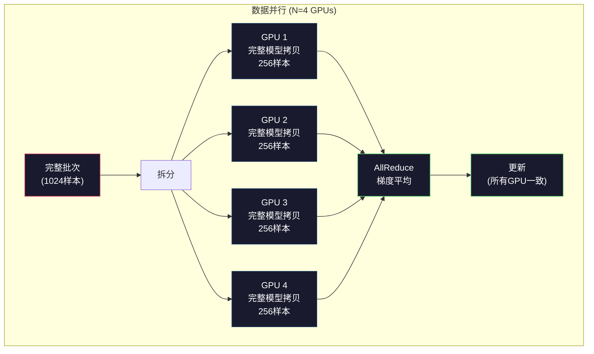
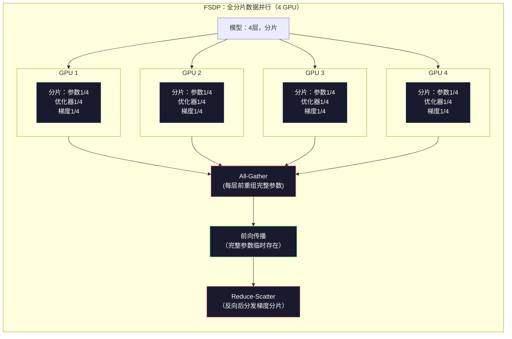
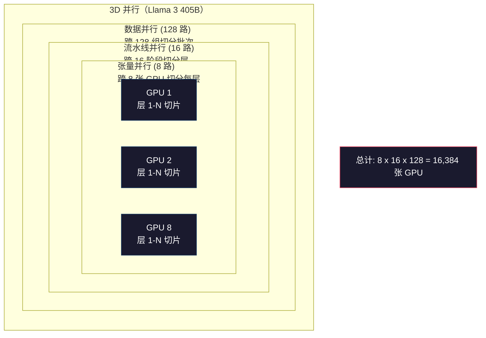

# 扩展：分布式训练、FSDP、DeepSpeed

> 你的124M模型只用一个GPU训练。现在试试70亿参数。模型无法放进内存。单机数据训练需要数周。在大规模训练下，分布式训练不是可选的，而是唯一的出路。

**类型：** 构建  
**语言：** Python  
**前置知识：** 第10阶段，第04课（预训练一个迷你GPT）  
**时间：** 约120分钟

## 学习目标

- 解释三种并行类型（数据并行（data parallelism）、张量并行（tensor parallelism）、流水线并行（pipeline parallelism））及根据模型和集群规模何时需要使用它们  
- 使用 PyTorch DDP 实现数据并行训练，执行跨多GPU的梯度同步  
- 计算给定模型大小（权重 + 优化器状态 + 梯度 + 激活）下的内存预算，确定最低硬件配置  
- 配置 FSDP 或 DeepSpeed ZeRO 阶段，实现模型状态的跨GPU分片（shard），使超出单GPU内存的模型得以训练  

## 问题所在

一个7B参数模型以FP16存储仅权重就需要14GB。Adam优化器为每个参数保存两份额外的拷贝（第一和第二矩估计）。这又是28GB。反向传播过程中的梯度增加14GB。存储完一条激活之前，你就已经用掉56GB了。

NVIDIA A100拥有80GB内存。

消耗了80GB中的56GB，还剩24GB给激活——这是前向传播中计算的中间值，必须保存以供反向传播。对于2048个token的序列和4096维模型，单层激活大约占64MB。32层模型，每个样本需要2GB，一批次大小8需要16GB，你有24GB，批次12就爆了。

现在试试70B参数的模型。仅权重就有140GB FP16。单个GPU装不下。你至少需要2个A100（2 x 80GB = 160GB）来存权重。加上优化器状态和梯度，需求更高：最少3个GPU，实际上取决于分片策略，要8-16个。

Llama 3 405B在16,384个NVIDIA H100 GPU上训练。估算训练成本达1亿美元。DeepSeek V3通过巧妙的架构设计（混合专家（Mixture of Experts）意味着每个token仅激活部分参数）和训练效率，训练了类似模型，成本约560万美元。

本课涵盖四种实现大规模训练的策略：数据并行、张量并行、流水线并行和全分片数据并行。你将用纯Python模拟每种方法，理解底层机制，再涉及分布式训练框架。

## 概念解析

### 为什么需要分布式

下面的内存计算均为精确计算而非估计。

| 模型 | 参数量 | 权重（FP16） | Adam状态 | 梯度（FP16） | 总计（不含激活） |
|-------|--------|--------------|-----------|--------------|------------------|
| GPT-2 Small | 124M | 248 MB | 992 MB | 248 MB | 1.5 GB |
| Llama 3 8B | 8B | 16 GB | 64 GB | 16 GB | 96 GB |
| Llama 3 70B | 70B | 140 GB | 560 GB | 140 GB | 840 GB |
| Llama 3 405B | 405B | 810 GB | 3,240 GB | 810 GB | 4,860 GB |

“Adam状态”栏目是最大杀手。Adam为每个参数存储运行均值（m）和方差（v），均为FP32。70B模型即是70B x 4字节 x 2 = 560GB。仅优化器状态就需要七个A100。

单个H100有80GB。Llama 3 405B需要至少61个H100来存权重、优化器和梯度。加上激活，数字还会更高。Meta之所以用16,384个GPU，不是想要，而是必须。

### 数据并行（Data Parallelism）

最简单的分布策略。将完整模型复制到N个GPU。将每批训练数据分成N等份。每个GPU对自己的数据片进行前后向传播。反向传播后，跨GPU平均梯度。每个GPU用相同平均梯度更新模型权重，保持同步。

**优点：** 吞吐量线性增长。N个GPU处理N倍数据。通信限制在梯度平均，且与计算可重叠。

**缺点：** 每个GPU保存完整模型、优化器状态和梯度。70B模型每个GPU需840GB。数据并行不减内存，只缩短训练时间。

**计算：** 有效批量大小 = 每GPU批量大小 x N。64个GPU，每GPU16批，整体批量为1024。Llama 3每步用达1600万token的有效批。



### 张量并行（Tensor Parallelism）

将每层拆分到多个GPU。单个矩阵乘法运算分布计算，每个GPU计算部分结果。

以一个(8192, 8192)权重矩阵为例，4路张量并行下，每个GPU持有(8192, 2048)分片。每个GPU乘以输入片段，产生部分结果。部分结果合并（通过all-reduce或all-gather）得出完整输出。

**优点：** 降低每GPU的权重内存需求。70B模型8路拆分，每个GPU保存约8.75B参数。

**缺点：** 每层后需快速跨GPU通信。每次matmul后all-reduce延迟明显。节点内NVLink互联（900 GB/s）支持良好，跨节点InferniBand（400 Gb/s，约50 GB/s）性能较差。张量并行原则上限于单节点内部（8 GPUs）。

**实际应用：** Megatron-LM开创张量并行。Llama 3 405B在每节点内部使用8路张量并行。

### 流水线并行（Pipeline Parallelism）

按层切分模型。GPU 1运行1-8层，GPU 2运行9-16层，GPU 3运行17-24层，GPU 4运行25-32层。数据经过流水线：GPU 1计算层后传激活给GPU 2，GPU 2计算后传GPU 3，如此类推。

**优点：** GPU间通信极少，仅层边界激活数据，较梯度和权重大幅减小。带宽需求低，支持跨节点应用。

**缺点：** 流水线气泡。GPU 4算第1个微批的前向时，GPU 1、2、3空闲（已计算完）。反向时模式反转。若无优化，N阶段流水线的GPU利用率仅约1/N。

**GPipe和PipeDream**通过将批次分割成微批解决气泡问题。GPU 1处理完微批1后立刻开始微批2，实现多阶段计算重叠。M个微批，N个阶段，气泡率降至(N-1)/M。用M=16和N=4时，气泡率仅18.75%。

### FSDP：全分片数据并行（Fully Sharded Data Parallel）

FSDP结合数据并行的扩展性与分片内存效率。不是每个GPU保存完整模型，而是每个GPU保存1/N的参数、梯度和优化器状态。

层前向时，FSDP执行**all-gather**，从所有GPU收集完整参数拷贝到本GPU内存。前向后，非本地参数弃用。反向时，重新运行all-gather重组参数以计算梯度。反向后，**reduce-scatter**分配梯度分片，让每GPU只存1/N梯度。

**70B模型，8 GPU情况的内存计算：**

| 组件 | 无FSDP | 使用FSDP |
|-------|---------|----------|
| 权重（FP16） | 每GPU 140 GB | 每GPU 17.5 GB |
| Adam状态（FP32） | 每GPU 560 GB | 每GPU 70 GB |
| 梯度（FP16） | 每GPU 140 GB | 每GPU 17.5 GB |
| **总计** | **每GPU 840 GB** | **每GPU 105 GB** |

无FSDP时单个80GB GPU放不下70B模型。FSDP下8GPU时，单卡需105GB仍超出。至少16GPU能降至单卡80GB以内，或结合激活检查点（反向时重算激活）节省内存。

通信开销较普通数据并行高，因每层前需all-gather。但内存节省让不可思议的训练成为可能。



### DeepSpeed ZeRO

DeepSpeed的ZeRO（Zero Redundancy Optimizer）与FSDP概念相同，但微软独立开发。它定义了三个阶段，分片越来越激进：

| 阶段 | 分片内容 | 内存节约 | 通信代价 |
|-------|----------|---------|---------|
| ZeRO-1 | 仅优化器状态 | 约4倍减小 | 与数据并行相同 |
| ZeRO-2 | + 梯度分片 | 约8倍减小 | 稍微多点 |
| ZeRO-3 | + 参数分片 | 约N倍减小（N GPU） | 每层all-gather |

ZeRO-3等效于FSDP。命名不同，机制相同。PyTorch在DeepSpeed成功后，添加了原生FSDP实现。

DeepSpeed 还引入了 ZeRO-Offload（将优化器状态卸载到 CPU 内存，成本更低且容量更大）和 ZeRO-Infinity（卸载到 NVMe SSD）。这些方法用计算速度换取内存容量——卸载操作较慢，但释放了 GPU 内存。

### 混合精度训练

现代训练同时使用多种浮点格式：

- **前向传播**：FP16 或 BF16（16 位）。内存占用是 FP32 的一半。张量核上的矩阵乘法速度提高 2 倍。
- **主权重**：FP32（32 位）。由优化器维护，用于权重更新时的数值精度。
- **损失缩放**：在反向传播之前将损失乘以一个大常数，以防止 FP16 梯度下溢为零。在优化器步骤之前除以相同常数。

BF16（Brain Float 16）与 FP32 具有相同指数范围（8 个指数位），但精度较低（7 个尾数位，FP32 为 23 位）。它很少需要损失缩放，因为可以表示相同范围的值。FP16 有 5 个指数位和 10 个尾数位——它可以表示更细粒度的值，但在极值处会发生溢出或下溢。

谷歌 TPU 原生支持 BF16。NVIDIA 的 A100 和 H100 支持 FP16 和 BF16。业界已基本转向 BF16，因为它避免了损失缩放的复杂问题。

**7B 模型的内存对比：**

| 精度 | 权重 | 优化器 | 梯度 | 总计 |
|-------|-------|---------|---------|-------|
| 全部 FP32 | 28 GB | 56 GB | 28 GB | 112 GB |
| 混合（BF16 + FP32 主权重） | 14 GB | 56 GB | 14 GB | 84 GB |

混合精度在该模型上节省了 28GB。优化器状态无论如何都保持 FP32——这是内存使用的主要部分。

### Megatron-LM 和 3D 并行

真正的大规模训练结合了三种并行方式：

- **数据并行**：跨节点组（扩展批量大小）
- **张量并行**：节点内（8 张 GPU 切分层）
- **流水线并行**：跨节点（将层组分布在多机器上）

Llama 3 405B 在 16,384 个 H100 上训练：
- 节点内 8 路张量并行（每个节点 8 张 GPU）
- 节点间 16 路流水线并行（16 个流水线阶段）
- 余下维度 128 路数据并行（16,384 / 8 / 16 = 128）

这种 3D 分解（8 x 16 x 128 = 16,384）是扩展到数千 GPU 的方法。每张 GPU 处理不同数据分片（数据并行），持有每层的一个切片（张量并行），计算不同层组（流水线并行）。

DeepSeek V3 采取了不同方法。其专家混合（Mixture of Experts）架构每个 token 仅激活 671B 参数中的 37B。这意味着每张 GPU 只需计算（并保存激活）激活参数。它使用 2048 个 H800 GPU 训练——不到 Meta GPU 数量的八分之一——总花费 560 万美元，而 Meta 估计为 1 亿美元。



## 实战构建

### 步骤 1：模拟数据并行

将一个批次拆分到模拟 GPU 上。每张 GPU 对其分片执行前向传播。对“梯度”（这里以损失值模拟）取平均。

```python
import numpy as np

def simulate_data_parallelism(data, num_gpus, model_fn):
    batch_size = len(data)
    shard_size = batch_size // num_gpus
    remainder = batch_size % num_gpus

    gpu_losses = []
    gpu_gradients = []

    offset = 0
    for gpu_id in range(num_gpus):
        extra = 1 if gpu_id < remainder else 0
        shard = data[offset:offset + shard_size + extra]
        offset += shard_size + extra

        loss, grad = model_fn(shard)
        gpu_losses.append(loss)
        gpu_gradients.append(grad)

    avg_loss = np.mean(gpu_losses)
    avg_gradient = np.mean(gpu_gradients, axis=0)

    return avg_loss, avg_gradient
```

全归约操作（对梯度取平均）是数据并行中唯一的通信过程。实际中，NVIDIA GPU 上使用 NCCL 库实现环形全归约：每个 GPU 将 1/N 的梯度发送给邻居，接收另一个邻居的 1/N，经过 N-1 轮后所有 GPU 获得完整平均。总通信量为 2 x 梯度大小 x (N-1)/N，大型 N 时接近 2 倍梯度大小。

### 步骤 2：模拟张量并行

将权重矩阵拆分到多张 GPU。每张 GPU 计算部分矩阵乘法。合并结果。

```python
def simulate_tensor_parallelism(input_data, weight_matrix, num_gpus):
    d_in, d_out = weight_matrix.shape
    assert d_out % num_gpus == 0, f"d_out {d_out} not divisible by num_gpus {num_gpus}"
    shard_size = d_out // num_gpus

    partial_results = []
    for gpu_id in range(num_gpus):
        start = gpu_id * shard_size
        end = start + shard_size
        weight_shard = weight_matrix[:, start:end]

        partial = input_data @ weight_shard
        partial_results.append(partial)

    full_output = np.concatenate(partial_results, axis=-1)

    direct_output = input_data @ weight_matrix
    error = np.abs(full_output - direct_output).max()

    return full_output, error
```

误差应为零（或机器精度）。张量并行数学上是精确的——它产生与单 GPU 完整矩阵乘法相同的结果。拆分沿输出维度进行，每个 GPU 产生不同列块，拼接还原完整输出。

列并行线性层（拆分输出维度）用拼接，行并行（拆分输入维度）用求和。Transformer 前馈网络中，第一个线性层（扩展）用列并行，第二个线性（收缩）用行并行，避免两层间的全归约。

### 步骤 3：模拟流水线并行

将模型层拆分到虚拟 GPU。展示“气泡问题”，即早期阶段空闲、后期阶段繁忙。

```python
def simulate_pipeline_parallelism(num_layers, num_stages, num_microbatches):
    layers_per_stage = num_layers // num_stages

    timeline = {}
    clock = 0

    for mb in range(num_microbatches):
        for stage in range(num_stages):
            start_time = max(
                timeline.get((stage, mb - 1, "fwd"), (0, 0))[1] if mb > 0 else 0,
                timeline.get((stage - 1, mb, "fwd"), (0, 0))[1] if stage > 0 else 0,
            )
            end_time = start_time + layers_per_stage
            timeline[(stage, mb, "fwd")] = (start_time, end_time)

    last_fwd_end = max(v[1] for v in timeline.values())

    for mb in range(num_microbatches - 1, -1, -1):
        for stage in range(num_stages - 1, -1, -1):
            deps = [last_fwd_end]
            if mb < num_microbatches - 1 and (stage, mb + 1, "bwd") in timeline:
                deps.append(timeline[(stage, mb + 1, "bwd")][1])
            if stage < num_stages - 1 and (stage + 1, mb, "bwd") in timeline:
                deps.append(timeline[(stage + 1, mb, "bwd")][1])
            start_time = max(deps)
            end_time = start_time + layers_per_stage
            timeline[(stage, mb, "bwd")] = (start_time, end_time)

    total_time = max(v[1] for v in timeline.values())
    compute_time = num_microbatches * num_stages * layers_per_stage * 2
    bubble_fraction = 1.0 - compute_time / (total_time * num_stages)

    return timeline, total_time, bubble_fraction
```

4 个阶段 1 个微批次时，气泡比例为 75%——4 张 GPU 中有 3 张空闲。16 个微批次时降至约 19%。消除气泡的代价是内存：必须同时保存所有正在运行微批次的激活。

### 步骤 4：内存计算器

计算任意模型大小的训练内存需求。

```python
def memory_calculator(
    params_billions,
    precision_bytes=2,
    optimizer="adam",
    num_gpus=1,
    sharding="none",
    sequence_length=2048,
    batch_size_per_gpu=1,
    hidden_dim=None,
    num_layers=None,
):
    params = params_billions * 1e9

    weight_memory = params * precision_bytes

    if optimizer == "adam":
        optimizer_memory = params * 4 * 2
    elif optimizer == "sgd":
        optimizer_memory = params * 4
    else:
        optimizer_memory = 0

    gradient_memory = params * precision_bytes

    total_no_activation = weight_memory + optimizer_memory + gradient_memory

    if hidden_dim and num_layers:
        activation_per_layer = (
            sequence_length * batch_size_per_gpu * hidden_dim * precision_bytes * 4
        )
        activation_memory = activation_per_layer * num_layers
    else:
        activation_memory = params * precision_bytes * 0.5

    if sharding == "fsdp" or sharding == "zero3":
        weight_memory /= num_gpus
        optimizer_memory /= num_gpus
        gradient_memory /= num_gpus
    elif sharding == "zero2":
        optimizer_memory /= num_gpus
        gradient_memory /= num_gpus
    elif sharding == "zero1":
        optimizer_memory /= num_gpus

    per_gpu_total = weight_memory + optimizer_memory + gradient_memory + activation_memory

    return {
        "params_billions": params_billions,
        "weights_gb": weight_memory / 1e9,
        "optimizer_gb": optimizer_memory / 1e9,
        "gradients_gb": gradient_memory / 1e9,
        "activations_gb": activation_memory / 1e9,
        "per_gpu_total_gb": per_gpu_total / 1e9,
        "total_across_gpus_gb": per_gpu_total * num_gpus / 1e9,
        "fits_on_80gb": per_gpu_total / 1e9 <= 80,
        "num_gpus": num_gpus,
        "sharding": sharding,
    }
```

该计算器回答了每个机器学习工程师都会问的问题：“我需要多少 GPU？”输入模型规模，查看是否可用。调整分片策略，直到每 GPU 内存需求低于 80GB。

### 步骤 5：混合精度模拟

比较 FP32、FP16 和混合精度训练的内存使用。

```python
def mixed_precision_comparison(params_billions):
    params = params_billions * 1e9

    fp32_weights = params * 4
    fp32_optimizer = params * 4 * 2
    fp32_gradients = params * 4
    fp32_total = fp32_weights + fp32_optimizer + fp32_gradients

    fp16_weights = params * 2
    fp16_master = params * 4
    fp16_optimizer = params * 4 * 2
    fp16_gradients = params * 2
    fp16_total = fp16_weights + fp16_master + fp16_optimizer + fp16_gradients

    mixed_weights = params * 2
    mixed_optimizer = params * 4 * 2
    mixed_gradients = params * 2
    mixed_total = mixed_weights + mixed_optimizer + mixed_gradients

    return {
        "fp32_total_gb": fp32_total / 1e9,
        "fp16_with_master_gb": fp16_total / 1e9,
        "mixed_bf16_gb": mixed_total / 1e9,
        "savings_vs_fp32": 1 - mixed_total / fp32_total,
    }
```

大多数人最大的惊讶是：混合精度（mixed precision）并不能将内存减半。优化器状态（Adam 的 m 和 v）无论精度如何，均保持 FP32。对于 7B 模型，FP32 训练使用 112GB 内存；混合精度使用 84GB，减少了 25%，而非 50%。优化器占主导。

## 使用它

### 运行所有模拟

```python
def run_all_demos():
    print("=" * 70)
    print("数据并行模拟（DATA PARALLELISM SIMULATION）")
    print("=" * 70)

    np.random.seed(42)
    data = np.random.randn(64, 32)
    weight = np.random.randn(32, 16)

    def model_fn(batch):
        output = batch @ weight
        loss = np.mean(output ** 2)
        grad = 2 * batch.T @ (batch @ weight) / len(batch)
        return loss, grad

    for n_gpus in [1, 2, 4, 8]:
        loss, grad = simulate_data_parallelism(data, n_gpus, model_fn)
        print(f"  {n_gpus} GPUs: loss={loss:.4f}, grad_norm={np.linalg.norm(grad):.4f}")

    print()
    print("=" * 70)
    print("张量并行模拟（TENSOR PARALLELISM SIMULATION）")
    print("=" * 70)

    x = np.random.randn(4, 8192)
    W = np.random.randn(8192, 8192)

    for n_gpus in [1, 2, 4, 8]:
        output, error = simulate_tensor_parallelism(x, W, n_gpus)
        print(f"  {n_gpus} GPUs: output_shape={output.shape}, max_error={error:.2e}")

    print()
    print("=" * 70)
    print("流水线并行模拟（PIPELINE PARALLELISM SIMULATION）")
    print("=" * 70)

    for n_mb in [1, 4, 8, 16, 32]:
        _, total_t, bubble = simulate_pipeline_parallelism(32, 4, n_mb)
        print(f"  {n_mb:2d} 微批次(micro-batches): total_time={total_t:4d}, bubble={bubble:.1%}")

    print()
    print("=" * 70)
    print("内存计算器（MEMORY CALCULATOR）")
    print("=" * 70)

    configs = [
        (7, "none", 1),
        (7, "fsdp", 8),
        (70, "none", 1),
        (70, "fsdp", 8),
        (70, "fsdp", 16),
        (405, "fsdp", 64),
        (405, "fsdp", 128),
    ]

    print(f"  {'模型':>8} {'分片':>8} {'GPU 数':>5} {'每GPU内存':>10} {'80GB 内存适配':>10}")
    print("  " + "-" * 50)
    for params, shard, gpus in configs:
        result = memory_calculator(params, num_gpus=gpus, sharding=shard)
        fits = "是" if result["fits_on_80gb"] else "否"
        print(f"  {params:>6}B {shard:>8} {gpus:>5} {result['per_gpu_total_gb']:>8.1f}GB {fits:>10}")

    print()
    print("=" * 70)
    print("混合精度对比（MIXED PRECISION COMPARISON）")
    print("=" * 70)

    for params_b in [7, 13, 70, 405]:
        result = mixed_precision_comparison(params_b)
        print(f"  {params_b}B: FP32={result['fp32_total_gb']:.0f}GB, "
              f"混合 BF16={result['mixed_bf16_gb']:.0f}GB, "
              f"节省={result['savings_vs_fp32']:.0%}")
```

## 交付它

本课生成 `outputs/prompt-distributed-training-planner.md` —— 一个通过模型规模和可用硬件输入，生成完整分布式训练计划的提示，包括并行策略、内存预算、通信开销和预期吞吐量。

## 练习

1. 修改内存计算器以包含激活检查点（activation checkpointing）。使用检查点时，只存储每隔 K 层的激活（典型 K=1，意味着全部重算）。展示内存与计算之间的权衡：检查点技术节省了多少内存，训练速度大约减慢多少（全重算约慢 33% 计算）？

2. 扩展流水线并行模拟，实现 PipeDream 使用的 1F1B（一个前向一个后向）调度。对比 4 个阶段和 8 个微批次时，1F1B 调度与朴素调度的泡沫比例。1F1B 调度在峰值内存上应更小，因为它更早开始反向传播。

3. 实现一个梯度累积（gradient accumulation）模拟器。不是每个微批次都执行 all-reduce，而是在本地累积 K 步梯度后再 all-reduce。展示这样能将通信减少 K 倍，同时保证最终梯度和训练结果保持一致。

4. 构建成本估算器。给定模型规模、目标令牌数、GPU 类型（A100 每小时 $2，H100 每小时 $3.50）和并行策略，估算总训练成本（美元）。验证预估与已知成本相符：Llama 3 405B 约 $1 亿，DeepSeek V3 约 $560 万。

5. 在内存计算器中加入 ZeRO-Offload。假设每节点 CPU RAM 512GB，NVMe 2TB。展示将优化器状态卸载到 CPU 如何允许 70B 模型用 4 张 GPU 训练（原为 16 张），代价是优化器步骤变慢 30-50%。

## 关键词

| 术语 | 大家说 | 实际含义 |
|------|--------|---------|
| Data parallelism（数据并行） | “把模型复制到每个 GPU” | 每个 GPU 处理不同的数据分片；每步后通过 all-reduce 平均梯度 |
| Tensor parallelism（张量并行） | “把一层拆分到多个 GPU” | 权重矩阵分片，每个 GPU 计算部分矩阵乘法；需要快速 NVLink 互联 |
| Pipeline parallelism（流水线并行） | “把层拆分到多个 GPU” | 每个 GPU 负责一组层；数据通过微批次在流水线中传递以减少停顿 |
| FSDP | “全面分片” | Fully Sharded Data Parallel，GPU 上各持有 1/N 权重、梯度、优化器状态；计算前 all-gather |
| ZeRO | “DeepSpeed 实现的 FSDP” | Zero Redundancy Optimizer，有三个阶段：分片优化器（阶段 1）、加梯度（阶段 2）、加参数（阶段 3） |
| All-reduce | “多 GPU 求平均” | 集体操作，每个 GPU 结束后拥有所有 GPU 输入的和（或平均）；通常用环形 all-reduce 实现 |
| All-gather | “从所有 GPU 收集” | 集体操作，每个 GPU 结束后得到所有 GPU 数据拼接；FSDP 用于重建完整参数 |
| Reduce-scatter | “求和并分发” | 集体操作，对数据求和后将不同部分分散给不同 GPU；FSDP 用于梯度分片 |
| Mixed precision（混合精度） | “用半精度训练” | 正向/反向用 FP16/BF16，优化器状态用 FP32；节省约 25% 内存，非 50%，因优化器占比大 |
| Pipeline bubble（流水线停顿时间） | “流水线中空闲时间” | GPU 等待前一阶段数据的时间比例；更多微批次可减少停顿 |

## 延伸阅读

- [Rajbhandari 等，2020 ——《ZeRO：走向千亿参数模型训练的内存优化》](https://arxiv.org/abs/1910.02054) —— 定义三阶段分片的 DeepSpeed ZeRO 论文
- [Shoeybi 等，2020 ——《Megatron-LM：使用模型并行训练数十亿参数语言模型》](https://arxiv.org/abs/1909.08053) —— NVIDIA 针对 Transformer 的张量并行方案
- [Narayanan 等，2021 ——《使用 Megatron-LM 在 GPU 集群上高效训练大规模语言模型》](https://arxiv.org/abs/2104.04473) —— 结合数据、张量和流水线并行的 3D 并行
- [Zhao 等，2023 ——《PyTorch FSDP：全面分片数据并行的扩展经验》](https://arxiv.org/abs/2304.11277) —— PyTorch 原生 FSDP 实现
- [Llama 3 技术报告](https://arxiv.org/abs/2407.21783) —— 16384 GPU 训练及 3D 并行细节
- [DeepSeek-V3 技术报告](https://arxiv.org/abs/2412.19437) —— MoE 架构如何将训练成本降低一个数量级
