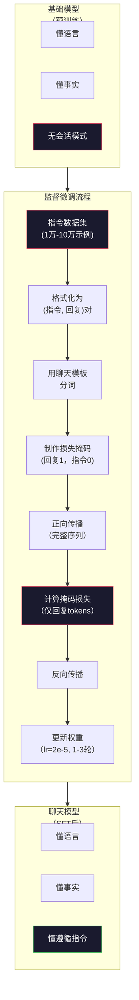

# Instruction Tuning（监督微调，SFT）

> 基础模型预测下一个 token，仅此而已。它不会遵循指令，不回答问题，也不会拒绝有害请求。SFT 是从一个 token 预测器到一个有用助手之间的桥梁。你与之对话过的每个模型——Claude、GPT、Llama Chat——都经历过这一步。

**类型：** 构建  
**语言：** Python（带 numpy）  
**先决条件：** 第10阶段，第04课（微型 GPT 预训练）  
**时间：** 约90分钟

## 学习目标

- 实现监督微调（SFT），将基础语言模型转换为遵循指令的助手  
- 使用有系统（system）、用户（user）和助手（assistant）角色的聊天模板格式化训练数据，并对非助手 token 进行损失掩码  
- 解释为何需要 SFT：基础模型是文本续写而非回答问题  
- 通过比较基础模型与微调模型在保留指令集上的响应，评估 SFT 质量

## 问题所在

你在第04课中训练了模型。它能给定序列预测下一个 token。给它输入“The transformer architecture”，它可能续写“has revolutionized natural language processing.” 这对一个下一个 token 预测器来说已相当不错。

现在尝试这个：给它输入“What is the capital of France?” 一个基础模型不会回答“Paris”，而是续写模式。它可能产生“What is the capital of Germany? What is the capital of Spain?”，因为它从包含问题列表的文档中学到过。或者可能产生“is a question that many people ask”，因为这是合理的下一个 token。模型没有“回答”概念，只知道“继续”。

这就是 GPT-3（基础模型，2020年6月发布）和 ChatGPT（指令微调，2022年11月发布）之间的差别。同一架构，同一预训练，不同点是 20,000 到 100,000 条精心设计的（指令，回复）对，教模型如何跟随对话模式。

斯坦福 Alpaca 证明你不需要数百万示例。2023年3月，他们仅用 52,000 条由 GPT-3.5 生成的指令-回复对微调 Llama 7B。总花费 600 美元。结果是一个能遵循指令、回答问题和进行对话的聊天机器人。虽然不及 ChatGPT，但仅花费600美元、几小时训练，已出人意料地接近。

Meta 的 Llama 2 Chat 在其初始 SFT 阶段只用了约 27,000 条高质量示例。关键洞察是：质量比数量更重要。27,000 条由专业标注员编写的示例胜过百万条从互联网爬取的杂乱数据。

## 概念

### SFT 实际做了什么

监督微调继续预训练的训练循环——前向传播、计算损失、反向传播、更新权重——但用不同种类的数据。你不再用原始文本训练，而是用结构化对话训练：

```json
{
  "system": "You are a helpful assistant.",
  "user": "What is the capital of France?",
  "assistant": "The capital of France is Paris."
}
```

模型已知 Paris 是法国首都。这是它在维基百科、教科书和网页上预训练期间学到的事实。SFT 不教它新知识。它教模型一种新*行为*：看到问题生成答案，看到指令生成完成，看到有害请求生成拒绝。

可以这样想：预训练给模型知识，SFT 给模型礼貌。

### 数据格式

业界主流有三种格式。它们编码相同信息——谁说了什么——通过不同分隔符。

**Alpaca 格式**（斯坦福，2023年3月）：

```json
{
  "instruction": "Summarize the following article in 3 sentences.",
  "input": "The European Central Bank raised interest rates...",
  "output": "The ECB increased rates by 25 basis points..."
}
```

简单且广泛使用。`input` 字段可选——许多指令不需额外上下文。斯坦福发布了 52,000 条此格式示例，由 GPT-3.5 生成，花费600美元。启动了开源指令微调浪潮。

**ShareGPT 格式**（社区，2023年）：

```json
{
  "conversations": [
    {"from": "system", "value": "You are a helpful assistant."},
    {"from": "human", "value": "What causes tides?"},
    {"from": "gpt", "value": "Tides are caused by the gravitational pull of the Moon..."},
    {"from": "human", "value": "How often do they occur?"},
    {"from": "gpt", "value": "Most coastal areas experience two high tides and two low tides per day..."}
  ]
}
```

支持多轮对话。“from” 字段约定用“human”和“gpt”，不论实际模型。Vicuna 用 70,000 条 ShareGPT 对话数据微调，这些数据从用户分享的 ChatGPT 文本中爬取。

**ChatML 格式**（OpenAI，许多开源模型使用）：

```text
<|im_start|>system
You are a helpful assistant.<|im_end|>
<|im_start|>user
What is the capital of France?<|im_end|>
<|im_start|>assistant
The capital of France is Paris.<|im_end|>
```

用特殊 token（`<|im_start|>`、`<|im_end|>`）分隔角色。这些 token 会在微调时添加到分词器词汇中。Qwen、Yi 和许多模型使用 ChatML。

这三种格式效果相同：告诉模型“这是指令，这是回复，学这个模式”。

### 为什么它能起作用

模型通过预训练已掌握语言。它见过数十亿问答对、指令-完成对和人与人对话，模式已编码在权重中。

SFT 将这种潜在能力聚焦起来。相较于模型需要从上下文判断应答还是续写，SFT 明确训练对话模式。几千条示例后，模型学会了：见助手角色标记时，生成有帮助的回复。

这就是 27,000 条示例足够的原因。你不是教模型英语；也不是教它新事实。你教它一个简单行为：回应指令。知识早已存在。

### 掩码损失

这是 SFT 最重要的技术细节，大多数教程会跳过。

预训练时，对每个 token 计算损失。模型学预测序列中每个下一个 token。SFT 时只对*回复*的 token 计算损失。指令 token 用于上下文，错误也不惩罚。

为何？你不想让模型学会*生成*指令，而是*回应*指令。若对指令 token 计算损失，模型可能学去预测“What is the capital of France?”，即它是提问者，这浪费梯度信号并混淆模型角色定位。

实际操作中，建立损失掩码：回复 token 为1，指令 token 为0。计算损失时每个 token 的损失乘以该掩码后再求均值。

```text
Tokens:    [SYS] You are helpful [USER] What is the capital? [ASST] Paris is the capital [EOS]
Loss mask:   0    0    0     0      0     0   0  0     0       1     1    1   1     1      1
```

只有 `[ASST]` 之后的 token 参与损失计算。模型正向传播时见完整对话（需指令生成正确回复），但权重更新只基于回复的预测情况。

### 训练超参数

SFT 用的超参数和预训练差别巨大。你不是从零训练，而是在调校一个已经可用的模型。

| 参数          | 预训练（Llama 2 7B）   | SFT（Llama 2 Chat）    |
|---------------|-------------------------|------------------------|
| 学习率        | 3e-4（峰值）            | 2e-5                   |
| 轮数          | 1（单遍数据）           | 2                      |
| 批量大小      | 400万 tokens            | 64 个样本              |
| 预热步数      | 2000                    | 0-100                  |
| 权重衰减      | 0.1                     | 0.0-0.1                |
| 数据规模      | 2万亿 tokens            | 2.7万个示例            |

学习率放小 15 倍对 SFT 极为重要。过大学习率会破坏预训练知识。模型“遗忘”预训练内容，过拟合小规模微调数据，发生灾难性遗忘。

两轮意味着模型看到每个样本两次。数据集小于3轮训练将过拟合，模型开始死记硬背，不再泛化。

### 灾难性遗忘

微调可能破坏模型的通用能力。训练时间过长，模型虽然更懂指令，但写代码、做数学题、创作等能力会丧失。它变得只擅长训练数据的特定格式，其余一无是处。

三个缓解：

1. **小学习率。** 1e-5 到 5e-5。小步长更新减少已学特征破坏。  
2. **训练时间短。** 1-3 轮。及时停止，避免过拟合。  
3. **混入预训练数据。** Llama 2 Chat 在 SFT 数据中混入 2-5% 预训练原始数据，让模型在学指令时“记得”通用能力。

### 真实数据

微调一个7B模型，用10,000条高质量指令对，大约需一小时，在单张 NVIDIA A100 80GB GPU 上。计算如下：

- 10,000 示例 × 512 token 平均 = 512 万 token  
- 2 轮 = 1024 万 token 总量  
- A100 对7B模型微调吞吐约3000 token/秒  
- 1024万 / 3000 = 约3400秒 ≈ 57分钟

对于我们的小型 GPT（4层，128维）几乎瞬间完成。重点是理解机制，不在于规模。



## 构建它

### 第一步：指令数据集

创建合成指令数据集。实际生产中，Scale AI、Anthropic 等公司雇佣人工标注员书写指令。我们编程生成用于演示格式。

```python
import numpy as np

INSTRUCTION_DATA = [
    {
        "instruction": "What is the capital of France?",
        "response": "The capital of France is Paris."
    },
    {
        "instruction": "Explain gravity in one sentence.",
        "response": "Gravity is the force that attracts objects with mass toward each other."
    },
    {
        "instruction": "Write a haiku about the ocean.",
        "response": "Waves crash on the shore, salt and foam beneath the sun, endless blue expanse."
    },
    {
        "instruction": "What is 15 multiplied by 7?",
        "response": "15 multiplied by 7 is 105."
    },
    {
        "instruction": "Name three programming languages.",
        "response": "Three programming languages are Python, Rust, and TypeScript."
    },
    {
        "instruction": "Summarize photosynthesis.",
        "response": "Photosynthesis converts sunlight, water, and carbon dioxide into glucose and oxygen."
    },
    {
        "instruction": "What year did World War II end?",
        "response": "World War II ended in 1945."
    },
    {
        "instruction": "Define machine learning.",
        "response": "Machine learning is a field where algorithms learn patterns from data to make predictions."
    },
]
```

八个示例非常少。斯坦福 Alpaca 使用了 52,000 个示例。但无论是 8 个还是 52,000 个，机制完全相同：分词（tokenize）、掩码（mask）、只在回应部分计算损失。

### 第 2 步：用聊天模板分词

将指令-回应对转换成带有特殊角色标记的 token 序列。标记告诉模型指令结束的位置和回应开始的位置。

```python
SPECIAL_TOKENS = {
    "INST_START": 253,
    "INST_END": 254,
    "RESP_START": 255,
}


def tokenize_instruction_pair(instruction, response, vocab_size=256):
    inst_tokens = list(instruction.encode("utf-8"))
    resp_tokens = list(response.encode("utf-8"))

    inst_tokens = [min(t, vocab_size - 4) for t in inst_tokens]
    resp_tokens = [min(t, vocab_size - 4) for t in resp_tokens]

    tokens = (
        [SPECIAL_TOKENS["INST_START"]]
        + inst_tokens
        + [SPECIAL_TOKENS["INST_END"]]
        + [SPECIAL_TOKENS["RESP_START"]]
        + resp_tokens
    )

    return tokens


def create_loss_mask(tokens):
    mask = np.zeros(len(tokens), dtype=np.float32)
    in_response = False

    for i, token in enumerate(tokens):
        if token == SPECIAL_TOKENS["RESP_START"]:
            in_response = True
            continue
        if in_response:
            mask[i] = 1.0

    return mask
```

损失掩码对于指令 token 全是零，对于回应 token 全是一。`RESP_START` token 本身掩码为 0，因为它是分隔符，不属于回应内容。

### 第 3 步：掩码交叉熵损失（Masked Cross-Entropy Loss）

标准交叉熵，但乘以损失掩码。仅回应 token 对梯度产生贡献。

```python
def masked_cross_entropy_loss(logits, targets, loss_mask):
    batch, seq_len, vocab_size = logits.shape
    logits_flat = logits.reshape(-1, vocab_size)
    targets_flat = targets.reshape(-1)
    mask_flat = loss_mask.reshape(-1)

    max_logits = logits_flat.max(axis=-1, keepdims=True)
    log_softmax = logits_flat - max_logits - np.log(
        np.exp(logits_flat - max_logits).sum(axis=-1, keepdims=True)
    )

    per_token_loss = -log_softmax[np.arange(len(targets_flat)), targets_flat]

    masked_loss = per_token_loss * mask_flat
    num_response_tokens = mask_flat.sum()
    if num_response_tokens == 0:
        return 0.0
    loss = masked_loss.sum() / num_response_tokens

    return loss
```

分母是 `num_response_tokens`，而非 `seq_len`。如果除以序列总长度，较长的指令会稀释梯度信号。除以回应 token 数保证了无论指令长度如何，每个回应 token 权重相同。

### 第 4 步：SFT 训练循环

重用第四课的 MiniGPT。训练循环几乎与预训练相同，区别在于指令格式化和掩码损失。

```python
import sys
import os
sys.path.insert(0, os.path.join(os.path.dirname(__file__), "..", "..", "04-pre-training-mini-gpt", "code"))
from main import MiniGPT, LayerNorm, FeedForward, MultiHeadAttention, TransformerBlock, Embedding


def sft_train(model, dataset, num_epochs=2, lr=2e-5, seq_len=64):
    formatted_data = []
    for example in dataset:
        tokens = tokenize_instruction_pair(example["instruction"], example["response"])
        mask = create_loss_mask(tokens)
        formatted_data.append((tokens, mask))

    print(f"SFT Training: {len(formatted_data)} examples, {num_epochs} epochs, lr={lr}")
    print(f"Total tokens: {sum(len(t) for t, _ in formatted_data):,}")
    print()

    losses = []

    for epoch in range(num_epochs):
        epoch_loss = 0.0
        num_batches = 0

        indices = np.random.permutation(len(formatted_data))

        for idx in indices:
            tokens, mask = formatted_data[idx]

            if len(tokens) < 3:
                continue
            if len(tokens) > seq_len:
                tokens = tokens[:seq_len]
                mask = mask[:seq_len]

            input_ids = np.array(tokens[:-1]).reshape(1, -1)
            target_ids = np.array(tokens[1:]).reshape(1, -1)
            loss_mask = np.array(mask[1:]).reshape(1, -1)

            logits = model.forward(input_ids)
            loss = masked_cross_entropy_loss(logits, target_ids, loss_mask)

            batch_size, s_len, v_size = logits.shape
            probs = np.exp(logits - logits.max(axis=-1, keepdims=True))
            probs = probs / probs.sum(axis=-1, keepdims=True)
            dlogits = probs.copy()
            dlogits[np.arange(batch_size)[:, None], np.arange(s_len), target_ids] -= 1.0

            mask_expanded = loss_mask[:, :, np.newaxis]
            num_resp = loss_mask.sum()
            if num_resp > 0:
                dlogits = dlogits * mask_expanded / num_resp

            for block in model.blocks:
                block.ffn.W1 -= lr * np.random.randn(*block.ffn.W1.shape) * 0.01
                block.ffn.W2 -= lr * np.random.randn(*block.ffn.W2.shape) * 0.01
                block.ffn.b1 -= lr * np.random.randn(*block.ffn.b1.shape) * 0.01
                block.ffn.b2 -= lr * np.random.randn(*block.ffn.b2.shape) * 0.01

            epoch_loss += loss
            num_batches += 1
            losses.append(loss)

        avg_loss = epoch_loss / max(num_batches, 1)
        print(f"Epoch {epoch + 1}/{num_epochs} | Avg Loss: {avg_loss:.4f}")

    return model, losses
```

学习率是 2e-5，与 Llama 2 Chat 一致。相比预训练时用的 3e-4，降低了 15 倍。梯度被掩码限制：指令 token 产生零梯度，只有回应 token 推动权重更新。

### 第 5 步：比较基础模型与 SFT 模型

SFT 的全部意义在于行为上的改变。通过检查模型对指令格式输入与原始文本续写的响应差异来衡量。

```python
def generate_response(model, prompt_tokens, max_new_tokens=50, temperature=0.8):
    tokens = list(prompt_tokens)
    seq_len = model.embedding.pos_embed.shape[0]

    for _ in range(max_new_tokens):
        context = np.array(tokens[-seq_len:]).reshape(1, -1)
        logits = model.forward(context)
        next_logits = logits[0, -1, :]

        next_logits = next_logits / max(temperature, 1e-8)
        probs = np.exp(next_logits - next_logits.max())
        probs = probs / probs.sum()
        probs = np.clip(probs, 1e-10, 1.0)
        probs = probs / probs.sum()

        next_token = np.random.choice(len(probs), p=probs)
        tokens.append(int(next_token))

    return tokens


def evaluate_instruction_following(model, instructions):
    print("评估指令遵循能力：")
    print("-" * 50)

    for instruction in instructions:
        tokens = (
            [SPECIAL_TOKENS["INST_START"]]
            + [min(t, 252) for t in list(instruction.encode("utf-8"))]
            + [SPECIAL_TOKENS["INST_END"]]
            + [SPECIAL_TOKENS["RESP_START"]]
        )

        output = generate_response(model, tokens, max_new_tokens=30, temperature=0.6)
        response_start = len(tokens)
        response_tokens = output[response_start:]
        response_bytes = bytes([t for t in response_tokens if t < 128])
        response_text = response_bytes.decode("utf-8", errors="replace")

        print(f"  问：{instruction}")
        print(f"  答：{response_text[:80]}")
        print()
```

在一个只有 8 个示例的小模型上，生成的回应没有实际意义是正常的。重要的是*结构*：模型学会在回应标记之后输出，而不是继续生成更多指令。

### 第 6 步：测量灾难性遗忘（Catastrophic Forgetting）

比较模型在 SFT 前后对下一个 token 预测能力。如果 SFT 损坏了通用能力，原始文本的损失会增加。

```python
def measure_forgetting(model, test_text, seq_len=64):
    tokens = np.array(list(test_text.encode("utf-8")[:512]))

    total_loss = 0.0
    num_windows = 0

    for start in range(0, len(tokens) - seq_len - 1, seq_len):
        input_ids = tokens[start:start + seq_len].reshape(1, -1)
        target_ids = tokens[start + 1:start + seq_len + 1].reshape(1, -1)

        logits = model.forward(input_ids)

        batch, s_len, vocab_size = logits.shape
        logits_flat = logits.reshape(-1, vocab_size)
        targets_flat = target_ids.reshape(-1)

        max_logits = logits_flat.max(axis=-1, keepdims=True)
        log_softmax = logits_flat - max_logits - np.log(
            np.exp(logits_flat - max_logits).sum(axis=-1, keepdims=True)
        )

        loss = -log_softmax[np.arange(len(targets_flat)), targets_flat].mean()
        total_loss += loss
        num_windows += 1

    return total_loss / max(num_windows, 1)
```

实际微调时，你应该在训练过程中持续跟踪这个指标。如果原始文本的损失增加超过 10-15%，说明你的 SFT 训练过度激进。此时降低学习率或减少训练 epoch 数。

## 使用示例

### 完整 SFT 流程演示

```python
if __name__ == "__main__":
    np.random.seed(42)

    test_text = """The transformer architecture processes sequences through self-attention.
Each layer applies multi-head attention followed by a feedforward network.
Residual connections and layer normalization stabilize deep networks.
The model learns to predict the next token given all previous tokens."""

    print("=" * 70)
    print("指令调优（SFT）演示")
    print("=" * 70)
    print()

    model = MiniGPT(
        vocab_size=256, embed_dim=128, num_heads=4,
        num_layers=4, max_seq_len=128, ff_dim=512
    )
    print(f"模型参数量：{model.count_parameters():,} 个")
    print(f"配置：4 层，4 头，128 维（第四课的迷你 GPT）")
    print()

    print("训练前：测量基础模型在原始文本上的损失")
    base_loss = measure_forgetting(model, test_text)
    print(f"  基础模型损失：{base_loss:.4f}")
    print()

    print("=" * 70)
    print("SFT 训练")
    print("=" * 70)

    model, losses = sft_train(
        model, INSTRUCTION_DATA, num_epochs=3, lr=2e-5, seq_len=128
    )

    print()
    print("训练后：测量微调模型在原始文本上的损失")
    sft_loss = measure_forgetting(model, test_text)
    print(f"  SFT 模型损失：{sft_loss:.4f}")
    print(f"  变化幅度：{((sft_loss - base_loss) / base_loss * 100):+.1f}%")
    if abs(sft_loss - base_loss) / base_loss < 0.15:
        print("  遗忘极小（变化 < 15%）")
    else:
        print("  检测到显著遗忘")
    print()

    print("=" * 70)
    print("指令遵循评估")
    print("=" * 70)
    print()

    test_instructions = [
        "法国的首都是什么？",
        "请说出一种编程语言。",
        "定义重力。",
    ]
    evaluate_instruction_following(model, test_instructions)

    print("=" * 70)
    print("数据格式示例")
    print("=" * 70)
    print()

    for i, example in enumerate(INSTRUCTION_DATA[:3]):
        tokens = tokenize_instruction_pair(example["instruction"], example["response"])
        mask = create_loss_mask(tokens)
        resp_count = int(mask.sum())
        total_count = len(tokens)
        print(f"  示例 {i + 1}：{total_count} 个 token，{resp_count} 个回应 token（占序列 {resp_count/total_count:.0%}）")
        print(f"    指令：{example['instruction']}")
        print(f"    回应：{example['response']}")
        print()

    print("=" * 70)
    print("训练损失曲线")
    print("=" * 70)
    print()

    if losses:
        window = max(1, len(losses) // 5)
        for i in range(0, len(losses), window):
            chunk = losses[i:i + window]
            avg = sum(chunk) / len(chunk)
            print(f"  步骤 {i:3d}-{i + len(chunk) - 1:3d}：平均损失 = {avg:.4f}")
```

## 发布它

本课产出文件 `outputs/prompt-sft-data-curator.md` —— 一个帮助你设计和策划针对 SFT（监督微调 Supervised Fine-Tuning）的指令数据集的提示。给定一个目标能力（代码生成、数学、对话），它会生成包含格式规范、质量标准和多样性要求的数据采集计划。

## 练习

1. 添加 system prompt（系统提示）支持。修改 `tokenize_instruction_pair` 以接受一个系统消息，并将其放在指令前面。创建 5 个带有不同系统提示（“你是一个诗人”，“你是数学导师”）的示例，验证训练时模型能看到不同的系统提示。

2. 实现数据混合。创建一个函数，输入为 SFT 数据集和原始文本语料，输出训练批次，其中 5% 的样本是原始文本（不进行掩码），95% 是指令对（掩码）。运行 3 个 epoch，比较与纯 SFT 训练的遗忘指标。

3. 构建数据质量评分器。对每个指令-响应对计算：（a）响应长度（以 token 计），（b）指令与响应长度比， （c）词汇多样性（独特 token 数 / 总 token 数）。过滤掉响应长度 < 10 个 token 或多样性 < 0.3 的样本。展示过滤后对最终损失的影响。

4. 实现多轮对话训练。拓展分词以支持 3 轮对话（用户-助手-用户-助手-用户-助手）。损失掩码应覆盖所有三个助手轮次。打印某个示例的 token 与掩码对齐，验证掩码正确。

5. 比较学习率。用 lr=1e-4，lr=2e-5 和 lr=1e-6 分别训练同一个模型三次。画损失曲线图。1e-4 应该显示快速的初期下降但最终损失较高（过拟合）；1e-6 基本无变化；2e-5 应该是最佳点。

## 关键术语

| 术语 | 大众说法 | 实际含义 |
|------|----------|----------|
| SFT | “对话微调” | 监督微调（Supervised Fine-Tuning）：在（指令，响应）对上继续训练，损失仅计算响应 token |
| Instruction tuning（指令微调） | “教模型遵循指令” | 在明确的指令-响应对上训练，使基础模型学习对话模式而非新知识 |
| Loss masking（损失掩码） | “忽略提示部分” | 对指令 token 设置损失为零，使梯度只由响应 token 预测生成 |
| ChatML | “聊天标记语言” | 使用 `<|im_start|>` 和 `<|im_end|>` 定界符标识对话角色的一种 token 格式 |
| Alpaca format（Alpaca 格式） | “斯坦福格式” | 一种包含 instruction/input/output 字段的 JSON 格式，用于 52K 个 GPT-3.5 生成的样本，成本 600 美元 |
| Catastrophic forgetting（灾难性遗忘） | “模型变笨了” | 微调导致预训练能力丢失，因为梯度更新用任务特定模式覆盖通用知识 |
| Weight tying（权重绑定） | “共享嵌入” | 输入 token 嵌入与输出预测头共用同一矩阵，节省参数且提升一致性 |
| Chat template（聊天模板） | “如何格式化提示” | 结构化对话的具体 token 序列（角色标记、定界符） |

## 进一步阅读

- [Ouyang 等，2022 —— “使用人类反馈训练语言模型遵循指令”（InstructGPT）](https://arxiv.org/abs/2203.02155) —— OpenAI 引入指令微调+RLHF 的论文
- [Taori 等，2023 —— “斯坦福 Alpaca：一个遵循指令的 LLaMA 模型”](https://github.com/tatsu-lab/stanford_alpaca) —— 52K 指令样本成本 600 美元，证明小规模数据 SFT 可行
- [Touvron 等，2023 —— “Llama 2：开放基础模型及微调聊天模型”](https://arxiv.org/abs/2307.09288) —— Meta 的 SFT + RLHF 流水线，使用 27K 高质量示例
- [Chiang 等，2023 —— “Vicuna: 一个让 GPT-4 赞叹的开源聊天机器人”](https://lmsys.org/blog/2023-03-30-vicuna/) —— 训练于 70K ShareGPT 会话
- [Zhou 等，2023 —— “LIMA: 少即是多的对齐方法”](https://arxiv.org/abs/2305.11206) —— 证明 1,000 个精心策划的示例能匹配更大规模数据的 SFT 效果
