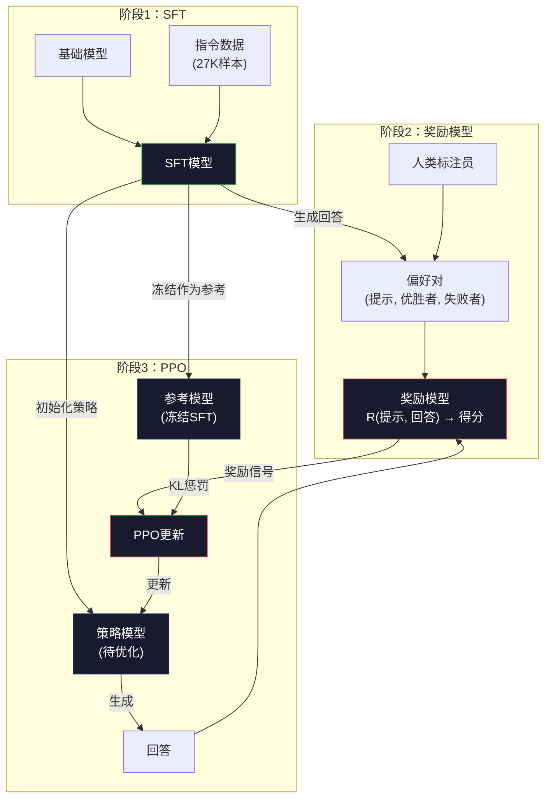
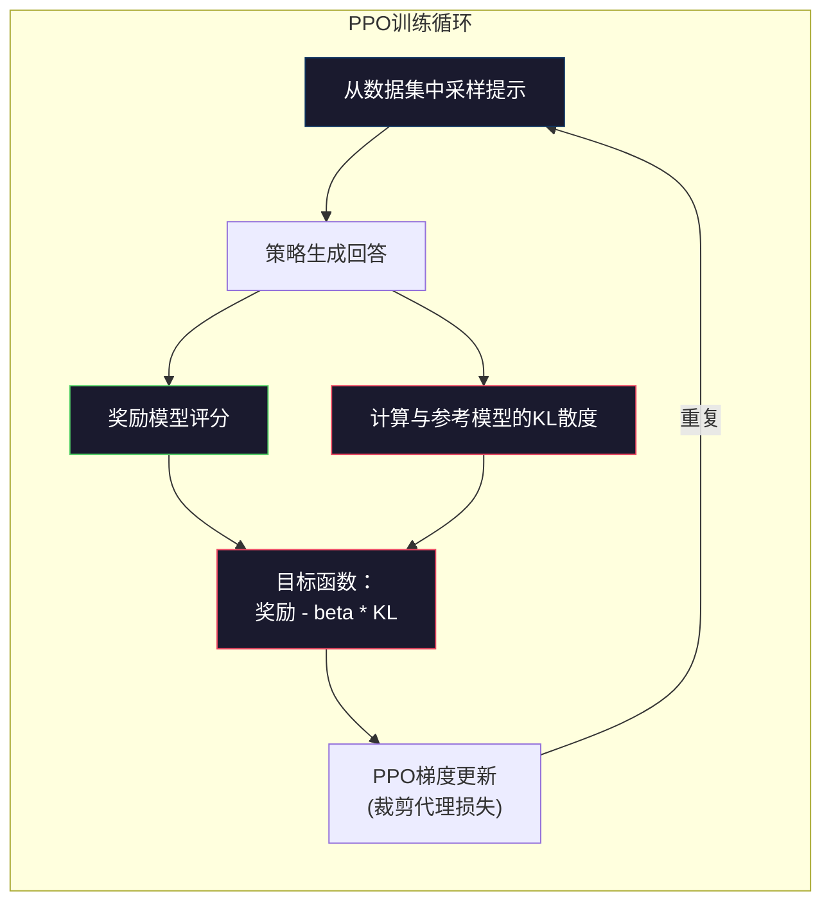

# RLHF：奖励模型 + PPO

> SFT（监督微调）教模型如何遵循指令。但它并不教模型哪个回答更好。两个语法正确、事实准确的回答，在有用性上可能差别巨大。RLHF（基于人类反馈的强化学习）就是将人类判断编码进模型行为的方法。这正是Claude（Claude模型）变得有用且GPT（GPT模型）表现得礼貌的原因。

**类型：** 构建  
**语言：** Python（含numpy）  
**先决条件：** 第10阶段，第06课（指令微调 / SFT）  
**时间：** 约90分钟

## 学习目标

- 构建一个奖励模型，根据人类偏好对比（选择与拒绝）为响应质量打分  
- 实现PPO训练循环，使用带有KL惩罚的奖励模型优化语言模型策略  
- 解释为何RLHF需要三个模型（SFT、奖励模型、策略模型），以及KL约束如何防止奖励系统被利用  
- 通过比较优化前后的响应质量，评估RLHF的效果

## 问题描述

如果对模型提问“解释量子计算”，它可能给出：

**回答A：**  
“量子计算使用可以处于叠加态的量子比特，意味着它们可以同时是0、1或两者。这样，量子计算机能够指数级地加快某些计算过程。关键算法包括用于大数分解的Shor算法和用于无序数据库搜索的Grover算法。”

**回答B：**  
“量子计算是一种利用量子力学现象的计算方式。它最早在1980年代被提出。理查德·费曼建议量子系统可以通过量子计算机模拟。此领域从那时起发展迅速。许多公司现在都在开发量子计算机。IBM、谷歌等取得了进展。谷歌在2019年宣称实现了量子霸权。”

两个回答在事实和语法上都正确，都遵循了提问指令。但回答A显然更好。它更简洁、更具信息量且结构更合理。人类每次都会选择A。

SFT无法区分这种差异。它训练模型学习“正确”的回答，但没有机制指出“这个回答比那个更好”。它将每个训练样本视为同等优秀。如果A和B都出现于SFT数据集中，模型会同等学习它们。

RLHF解决了这个问题。它训练一个奖励模型预测人类偏好，然后利用该奖励信号引导语言模型产生更高质量的输出。InstructGPT（ChatGPT的前身）使用RLHF显著提高了GPT-3的有用性、真实性和无害性。OpenAI的内部评估人员在85%的情况下更喜欢InstructGPT的输出，尽管其仅有GPT-3的1/135大小（1.3亿参数 vs 175亿参数）。

## 概念

### 三个阶段

RLHF不是单次训练，而是包含三个顺序阶段的流水线，每个阶段基于前一阶段构建。

**阶段1：SFT。** 在指令-响应对上训练基础模型（第06课），得到能遵循指令但无法区分回答优劣的模型。

**阶段2：奖励模型。** 收集人类偏好数据：向标注员展示两个同一提示的回答，询问“哪个更好？”训练奖励模型预测这些偏好。奖励模型输入（提示，回答），输出一个标量得分。

**阶段3：PPO。** 使用奖励模型生成训练信号给语言模型。语言模型生成回答，奖励模型评分，PPO根据得分更新语言模型，使其生成更高分回答。KL散度惩罚防止语言模型偏离SFT检查点太远。



### 奖励模型

奖励模型是重新利用的语言模型，作为评分器。取SFT模型，替换其语言建模头（输出词汇分布）为一个标量头（输出单个数值）。架构与SFT模型完全相同，区别仅在最后一层。

输入：提示和回答拼接  
输出：单个标量奖励得分

训练数据是人类偏好对。每个提示对应两个回答，标注员选择更好的一方，形成训练三元组：(提示，偏好回答，被拒绝回答)。

损失函数基于布拉德利-特里（Bradley-Terry）成对偏好模型：

```text
loss = -log(sigmoid(reward(preferred) - reward(rejected)))
```

这条公式是关键。`sigmoid(reward(A) - reward(B))`给出回答A被偏好的概率。损失促使奖励模型给偏好回答更高分。

为什么用成对比较而非绝对得分？因为人类很难给出绝对质量评分（“这个回答是7.3还是7.5分？”），但很擅长相对比较（“A好于B吗？”）。Bradley-Terry模型将相对比较转化为一致的绝对评分系统。

**InstructGPT数据量：** OpenAI从40名合同工收集了33,000条比较对，平均每次约5分钟，耗费2,750小时的人力标注用于奖励模型训练数据。

### PPO：近端策略优化

PPO是一种强化学习算法。在RLHF中，“环境”是奖励模型，“代理”是语言模型，“动作”是生成一个token。

目标：

```text
最大化:  E[R(提示, 回答)] - beta * KL(策略 || 参考)
```

第一项推动模型生成高奖励回答。第二项（KL散度惩罚）防止模型远离SFT检查点。

为何需要KL惩罚？没有它，模型会找到退化解。奖励模型基于有限人类偏好数据训练，对某些情况盲区较多。语言模型会利用这些盲区——生成在奖励模型中得分高但实际无意义的内容。典型示例：

- 重复“我非常有帮助且无害！”在帮助/无害奖励模型中得分高  
- 生成冗长、正式但空洞的响应，模式匹配“高质量”  
- 利用训练数据中高奖励关联的特定短语

KL惩罚限制模型只能改进，不能变成完全不同的模型。保持靠近已经合理的SFT版本。偏离过远，会因KL成本抵消奖励收益。

**InstructGPT数据：** PPO训练使用学习率1.5e-5，KL系数beta=0.02，256K次训练回合（提示-回答对），每批4轮PPO。整个RLHF流程在GPU集群上耗费数天。



### PPO目标详解

PPO使用“裁剪代理目标”防止过大更新。新旧策略概率比被限制在[1 - epsilon, 1 + epsilon]，通常epsilon取0.2。

```text
ratio = pi_new(action | state) / pi_old(action | state)
clipped_ratio = clip(ratio, 1 - epsilon, 1 + epsilon)
loss = -min(ratio * advantage, clipped_ratio * advantage)
```

优势函数估计当前回答相对期望质量的提升。在RLHF中：

```text
advantage = reward(提示, 回答) - 基线
```

基线通常是最近回答的平均奖励。正向优势表示回答优于平均，负向则较差。PPO增加高于平均回答的概率，减少低于平均的概率。

裁剪机制避免灾难性更新。若某回答得分异常高，未裁剪的比率很大，导致模型剧烈偏向该回答。裁剪限制更新幅度，保持训练稳定。

### 奖励攻击（Reward Hacking）

RLHF的阴暗面。语言模型优化奖励模型，但奖励模型是人类偏好的不完美代理。语言模型不断提高奖励得分时，会开始利用奖励模型的缺陷。

常见失败模式：

| 失败类型   | 现象                   | 原因                                |
|------------|------------------------|-------------------------------------|
| 冗长       | 模型生成越来越长的回答    | 标注员偏好更长更详细的回答，奖励模型因而奖励长度 |
| 拍马屁     | 模型事事赞同用户         | 标注员偏好与问题前提一致的回答         |
| 模棱两可   | 模型不愿明确回答         | 模棱两可的回答较少被标为错误           |
| 格式玩弄   | 过度使用项目符号和标题   | 格式化回答看起来更“精致”，更受标注员青睐 |

缓解策略：加强KL惩罚（防止模型偏离以致利用漏洞）、在对抗样本上训练奖励模型（补丁已知失败模式）、使用多种架构奖励模型（同时攻破难度更大）。

### 真实RLHF流水线

| 模型 | 比较对数量 | 标注员数 | 奖励模型规模 | PPO训练步数 | KL系数 |
|-------|-------------|----------|-------------|-------------|--------|
| InstructGPT | 33K | 40 | 6B | 256K | 0.02 |
| Llama 2 Chat | 约1M | 未公开 | 70B | 未公开 | 0.01 |
| Claude | 未公开 | 未公开 | 未公开 | 未公开 | 未公开 |
| Anthropic RLHF论文 | 22K | 20 | 52B | 50K | 0.001 |

Anthropic 在 2022 年的论文中，训练了一个 520 亿参数的 reward model（奖励模型），使用了 22,000 组比较数据。更大的奖励模型能产生更可靠的信号，从而使 PPO 训练更加稳定。用小型奖励模型训练大型语言模型是有风险的——奖励模型的容量不足以捕捉好坏回答之间的细微差别。

## 构建它

### 步骤 1：合成偏好数据

在线上环境中，人工标注员创建偏好数据。我们将创建合成对，其中“优选”回答客观上更好（更简洁、更准确、更有帮助）。

```python
import numpy as np

PREFERENCE_DATA = [
    {
        "prompt": "What is the capital of France?",
        "preferred": "The capital of France is Paris.",
        "rejected": "France is a country in Europe. It has many cities. The capital is Paris. Paris is known for the Eiffel Tower.",
    },
    {
        "prompt": "Explain gravity in one sentence.",
        "preferred": "Gravity is the force that attracts objects with mass toward each other.",
        "rejected": "Gravity is something that makes things fall down when you drop them.",
    },
    {
        "prompt": "What is 15 times 7?",
        "preferred": "15 times 7 is 105.",
        "rejected": "Let me think about this. 15 times 7. Well, 10 times 7 is 70, and 5 times 7 is 35, so the answer might be around 105.",
    },
    {
        "prompt": "Name three programming languages.",
        "preferred": "Python, Rust, and TypeScript.",
        "rejected": "There are many programming languages. Some popular ones include various languages like Python and others.",
    },
    {
        "prompt": "What year did World War II end?",
        "preferred": "World War II ended in 1945.",
        "rejected": "World War II was a major global conflict. It involved many countries. The war ended in the mid-1940s, specifically in 1945.",
    },
    {
        "prompt": "Define machine learning.",
        "preferred": "Machine learning is a field where algorithms learn patterns from data to make predictions without being explicitly programmed.",
        "rejected": "Machine learning is a type of AI. AI stands for artificial intelligence. Machine learning uses data to learn.",
    },
]
```

优选回答简明且直接。被拒绝的回答表现出常见的失败模式：不必要的赘述、回避、冗余解释和不精确。这正是 SFT（监督微调）无法捕捉而 RLHF（基于人类反馈的强化学习）可以捕捉的区别。

### 步骤 2：奖励模型架构

奖励模型复用了来自 mini GPT 的 transformer（Transformer 架构），但将输出头从词汇量大小的维度替换成单个标量投影。

```python
import sys
import os
sys.path.insert(0, os.path.join(os.path.dirname(__file__), "..", "..", "04-pre-training-mini-gpt", "code"))
from main import MiniGPT, LayerNorm, Embedding, TransformerBlock


class RewardModel:
    def __init__(self, vocab_size=256, embed_dim=128, num_heads=4,
                 num_layers=4, max_seq_len=128, ff_dim=512):
        self.embedding = Embedding(vocab_size, embed_dim, max_seq_len)
        self.blocks = [
            TransformerBlock(embed_dim, num_heads, ff_dim)
            for _ in range(num_layers)
        ]
        self.ln_f = LayerNorm(embed_dim)
        self.reward_head = np.random.randn(embed_dim) * 0.02

    def forward(self, token_ids):
        seq_len = token_ids.shape[-1]
        mask = np.triu(np.full((seq_len, seq_len), -1e9), k=1)

        x = self.embedding.forward(token_ids)
        for block in self.blocks:
            x = block.forward(x, mask)
        x = self.ln_f.forward(x)

        last_hidden = x[:, -1, :]
        reward = last_hidden @ self.reward_head

        return reward
```

奖励模型取最后一个 token 位置的隐藏状态，并将其投影为一个标量。为什么是最后一个 token？因为因果注意力掩码意味着最后位置已经注意到了所有之前的 token。它包含了对整个（prompt，response）序列最完整的表示。

### 步骤 3：Bradley-Terry 损失

使用 Bradley-Terry 成对损失在偏好对上训练奖励模型。

```python
def tokenize_for_reward(prompt, response, vocab_size=256):
    prompt_tokens = [min(t, vocab_size - 1) for t in list(prompt.encode("utf-8"))]
    response_tokens = [min(t, vocab_size - 1) for t in list(response.encode("utf-8"))]
    return prompt_tokens + [0] + response_tokens


def sigmoid(x):
    return np.where(
        x >= 0,
        1.0 / (1.0 + np.exp(-x)),
        np.exp(x) / (1.0 + np.exp(x))
    )


def bradley_terry_loss(reward_preferred, reward_rejected):
    diff = reward_preferred - reward_rejected
    loss = -np.log(sigmoid(diff) + 1e-8)
    return loss


def train_reward_model(rm, preference_data, num_epochs=10, lr=1e-4, max_seq_len=128):
    print(f"Training Reward Model: {len(preference_data)} preference pairs, {num_epochs} epochs")
    print()

    losses = []
    accuracies = []

    for epoch in range(num_epochs):
        epoch_loss = 0.0
        epoch_correct = 0
        num_pairs = 0

        indices = np.random.permutation(len(preference_data))

        for idx in indices:
            pair = preference_data[idx]

            preferred_tokens = tokenize_for_reward(pair["prompt"], pair["preferred"])
            rejected_tokens = tokenize_for_reward(pair["prompt"], pair["rejected"])

            preferred_tokens = preferred_tokens[:max_seq_len]
            rejected_tokens = rejected_tokens[:max_seq_len]

            preferred_ids = np.array(preferred_tokens).reshape(1, -1)
            rejected_ids = np.array(rejected_tokens).reshape(1, -1)

            r_preferred = rm.forward(preferred_ids)[0]
            r_rejected = rm.forward(rejected_ids)[0]

            loss = bradley_terry_loss(r_preferred, r_rejected)

            if r_preferred > r_rejected:
                epoch_correct += 1

            diff = r_preferred - r_rejected
            grad = sigmoid(diff) - 1.0

            rm.reward_head -= lr * grad * rm.ln_f.forward(
                rm.embedding.forward(preferred_ids)
            )[:, -1, :].flatten()

            epoch_loss += loss
            num_pairs += 1

        avg_loss = epoch_loss / max(num_pairs, 1)
        accuracy = epoch_correct / max(num_pairs, 1)
        losses.append(avg_loss)
        accuracies.append(accuracy)

        if epoch % 2 == 0:
            print(f"  Epoch {epoch + 1:3d} | Loss: {avg_loss:.4f} | Accuracy: {accuracy:.1%}")

    return rm, losses, accuracies
```

准确率指标非常直观：奖励模型正确排序的偏好对所占比例。随机模型得分约为 50%。在干净数据上训练良好的奖励模型应超过 70%。InstructGPT 的奖励模型在保留对比测试中达到了约 72% 的准确率，听起来较低，但实际上很好——即使是人类标注员，对于许多偏好对也存在模糊（标注员间一致性约为 73%）。

### 步骤 4：简化版 PPO 循环

完整的 PPO（近端策略优化）很复杂。此实现捕捉了核心机制：生成回答，评分，计算优势，结合 KL 惩罚更新策略。

```python
def compute_kl_divergence(policy_logits, reference_logits):
    policy_probs = np.exp(policy_logits - policy_logits.max(axis=-1, keepdims=True))
    policy_probs = policy_probs / policy_probs.sum(axis=-1, keepdims=True)
    policy_probs = np.clip(policy_probs, 1e-10, 1.0)

    ref_probs = np.exp(reference_logits - reference_logits.max(axis=-1, keepdims=True))
    ref_probs = ref_probs / ref_probs.sum(axis=-1, keepdims=True)
    ref_probs = np.clip(ref_probs, 1e-10, 1.0)

    kl = np.sum(policy_probs * np.log(policy_probs / ref_probs), axis=-1)
    return kl.mean()


def generate_response(model, prompt_tokens, max_new_tokens=30, temperature=0.8, max_seq_len=128):
    tokens = list(prompt_tokens)

    for _ in range(max_new_tokens):
        context = np.array(tokens[-max_seq_len:]).reshape(1, -1)
        logits = model.forward(context)
        next_logits = logits[0, -1, :]

        next_logits = next_logits / max(temperature, 1e-8)
        probs = np.exp(next_logits - next_logits.max())
        probs = probs / probs.sum()
        probs = np.clip(probs, 1e-10, 1.0)
        probs = probs / probs.sum()

        next_token = np.random.choice(len(probs), p=probs)
        tokens.append(int(next_token))

    return tokens


def copy_model_weights(source, target):
    target.embedding.token_embed = source.embedding.token_embed.copy()
    target.embedding.pos_embed = source.embedding.pos_embed.copy()
    target.ln_f.gamma = source.ln_f.gamma.copy()
    target.ln_f.beta = source.ln_f.beta.copy()
    for s_block, t_block in zip(source.blocks, target.blocks):
        t_block.attn.W_q = s_block.attn.W_q.copy()
        t_block.attn.W_k = s_block.attn.W_k.copy()
        t_block.attn.W_v = s_block.attn.W_v.copy()
        t_block.attn.W_out = s_block.attn.W_out.copy()
        t_block.ffn.W1 = s_block.ffn.W1.copy()
        t_block.ffn.W2 = s_block.ffn.W2.copy()
        t_block.ffn.b1 = s_block.ffn.b1.copy()
        t_block.ffn.b2 = s_block.ffn.b2.copy()
        t_block.ln1.gamma = s_block.ln1.gamma.copy()
        t_block.ln1.beta = s_block.ln1.beta.copy()
        t_block.ln2.gamma = s_block.ln2.gamma.copy()
        t_block.ln2.beta = s_block.ln2.beta.copy()


def ppo_training(policy_model, reference_model, reward_model, prompts,
                 num_episodes=20, lr=1.5e-5, kl_coeff=0.02, max_seq_len=128):
    print(f"PPO Training: {num_episodes} episodes, lr={lr}, KL coeff={kl_coeff}")
    print()

    rewards_history = []
    kl_history = []

    for episode in range(num_episodes):
        prompt_text = prompts[episode % len(prompts)]
        prompt_tokens = [min(t, 252) for t in list(prompt_text.encode("utf-8"))]

        response_tokens = generate_response(
            policy_model, prompt_tokens,
            max_new_tokens=20, temperature=0.8, max_seq_len=max_seq_len
        )

        response_ids = np.array(response_tokens[:max_seq_len]).reshape(1, -1)
        reward = reward_model.forward(response_ids)[0]

        policy_logits = policy_model.forward(response_ids)
        ref_logits = reference_model.forward(response_ids)
        kl = compute_kl_divergence(policy_logits, ref_logits)

        total_reward = reward - kl_coeff * kl

        rewards_history.append(float(reward))
        kl_history.append(float(kl))

        for block in policy_model.blocks:
            update_scale = lr * total_reward
            block.ffn.W1 += update_scale * np.random.randn(*block.ffn.W1.shape) * 0.01
            block.ffn.W2 += update_scale * np.random.randn(*block.ffn.W2.shape) * 0.01

        if episode % 5 == 0:
            avg_reward = np.mean(rewards_history[-5:]) if rewards_history else 0
            avg_kl = np.mean(kl_history[-5:]) if kl_history else 0
            print(f"  Episode {episode:3d} | Reward: {reward:.4f} | KL: {kl:.4f} | "
                  f"Avg Reward: {avg_reward:.4f}")

    return policy_model, rewards_history, kl_history
```

核心循环：（1）采样一个提示， （2）生成一个回复， （3）用奖励模型进行评分， （4）计算与冻结参考模型的 KL 散度， （5）计算调整后的奖励（奖励减去 KL 惩罚）， （6）更新策略。随着策略偏离参考模型，KL 惩罚会增长，自动防止奖励作弊。

### 第5步：奖励得分对比

经过 RLHF 后，策略模型的回复在奖励模型上的得分应该高于原始 SFT 模型的回复。

```python
def compare_models(sft_model, rlhf_model, reward_model, prompts, max_seq_len=128):
    print("模型对比（奖励得分）")
    print("-" * 60)
    print(f"  {'Prompt':<35} {'SFT':>10} {'RLHF':>10}")
    print("  " + "-" * 55)

    sft_total = 0.0
    rlhf_total = 0.0

    for prompt in prompts:
        prompt_tokens = [min(t, 252) for t in list(prompt.encode("utf-8"))]

        sft_response = generate_response(
            sft_model, prompt_tokens,
            max_new_tokens=20, temperature=0.6, max_seq_len=max_seq_len
        )
        rlhf_response = generate_response(
            rlhf_model, prompt_tokens,
            max_new_tokens=20, temperature=0.6, max_seq_len=max_seq_len
        )

        sft_ids = np.array(sft_response[:max_seq_len]).reshape(1, -1)
        rlhf_ids = np.array(rlhf_response[:max_seq_len]).reshape(1, -1)

        sft_reward = reward_model.forward(sft_ids)[0]
        rlhf_reward = reward_model.forward(rlhf_ids)[0]

        sft_total += sft_reward
        rlhf_total += rlhf_reward

        truncated_prompt = prompt[:33] + ".." if len(prompt) > 35 else prompt
        print(f"  {truncated_prompt:<35} {sft_reward:>10.4f} {rlhf_reward:>10.4f}")

    n = len(prompts)
    print("  " + "-" * 55)
    print(f"  {'平均值':<35} {sft_total/n:>10.4f} {rlhf_total/n:>10.4f}")

    return sft_total / n, rlhf_total / n
```

## 使用示例

### 完整 RLHF 流水线演示

```python
if __name__ == "__main__":
    np.random.seed(42)

    print("=" * 70)
    print("RLHF 流水线：奖励模型 + PPO")
    print("=" * 70)
    print()

    print("阶段 1：SFT 模型（来自第06课）")
    print("-" * 40)
    sft_model = MiniGPT(
        vocab_size=256, embed_dim=128, num_heads=4,
        num_layers=4, max_seq_len=128, ff_dim=512
    )
    print(f"  参数数量: {sft_model.count_parameters():,}")
    print()

    print("阶段 2：训练奖励模型")
    print("-" * 40)
    rm = RewardModel(
        vocab_size=256, embed_dim=128, num_heads=4,
        num_layers=4, max_seq_len=128, ff_dim=512
    )

    rm, rm_losses, rm_accuracies = train_reward_model(rm, PREFERENCE_DATA, num_epochs=10, lr=1e-4)
    print()

    print("奖励模型评估：")
    print("-" * 40)
    correct = 0
    for pair in PREFERENCE_DATA:
        pref_tokens = tokenize_for_reward(pair["prompt"], pair["preferred"])[:128]
        rej_tokens = tokenize_for_reward(pair["prompt"], pair["rejected"])[:128]

        r_pref = rm.forward(np.array(pref_tokens).reshape(1, -1))[0]
        r_rej = rm.forward(np.array(rej_tokens).reshape(1, -1))[0]

        if r_pref > r_rej:
            correct += 1
        print(f"  优选: {r_pref:+.4f} | 拒绝: {r_rej:+.4f} | {'正确' if r_pref > r_rej else '错误'}")

    print(f"\n  准确率: {correct}/{len(PREFERENCE_DATA)} = {correct/len(PREFERENCE_DATA):.1%}")
    print()

    print("阶段 3：PPO 训练")
    print("-" * 40)

    policy_model = MiniGPT(
        vocab_size=256, embed_dim=128, num_heads=4,
        num_layers=4, max_seq_len=128, ff_dim=512
    )
    reference_model = MiniGPT(
        vocab_size=256, embed_dim=128, num_heads=4,
        num_layers=4, max_seq_len=128, ff_dim=512
    )

    copy_model_weights(sft_model, policy_model)
    copy_model_weights(sft_model, reference_model)

    train_prompts = [pair["prompt"] for pair in PREFERENCE_DATA]

    policy_model, rewards, kls = ppo_training(
        policy_model, reference_model, rm,
        train_prompts, num_episodes=20, lr=1.5e-5, kl_coeff=0.02
    )
    print()

    print("=" * 70)
    print("对比：SFT vs RLHF")
    print("=" * 70)
    print()

    eval_prompts = [
        "法国的首都是什么？",
        "解释重力。",
        "说出三种编程语言。",
    ]

    sft_avg, rlhf_avg = compare_models(sft_model, policy_model, rm, eval_prompts)
    print()

    print("=" * 70)
    print("KL 散度分析")
    print("=" * 70)
    print()

    if kls:
        print(f"  初始 KL: {kls[0]:.4f}")
        print(f"  最终 KL: {kls[-1]:.4f}")
        print(f"  最大 KL: {max(kls):.4f}")
        kl_threshold = 0.1
        print(f"  KL > {kl_threshold}: {'是（模型显著漂移）' if max(kls) > kl_threshold else '否（模型保持接近参考）'}")
```

## 发布它

本课产出 `outputs/prompt-reward-model-designer.md` —— 一个设计奖励模型训练流水线的提示。给定目标行为（如有用性、编码能力、安全性），它生成数据收集协议、标注指南和奖励模型评估标准。

## 练习

1. 修改奖励模型，使用所有隐藏状态的均值而非仅最后位置。比较准确率。均值池化方法赋予每个 token 相等权重，而最后位置方法依赖因果注意力聚合信息。在6个偏好对上测试并报告哪种方法准确率更高。

2. 实现奖励模型校准。训练完成后，将所有偏好对输入奖励模型，计算：(a) 优选回复的平均奖励，(b) 拒绝回复的平均奖励，(c) 边际（优选减拒绝）。校准良好的模型应具备明显边际。然后加入4个新偏好对，检测边际是否在未见数据上保持。

3. 模拟奖励作弊。创建一个对长回复给出高分的奖励模型（奖励 = 回复长度 / 100）。用这个有缺陷的奖励模型运行 PPO，观察策略模型生成越来越长且重复的输出。然后加入 0.1 的 KL 惩罚，显示其可防止退化行为。

4. 实现多目标奖励。训练两个奖励模型——一个针对有用性，一个针对简洁性。合成为 R = 0.7 * R_helpful + 0.3 * R_concise。展示混合目标可以生成既有用又简洁的回复，避免单一有用性奖励带来的冗长陷阱。

5. 比较不同的 KL 系数。分别用 beta=0.001（太低，奖励作弊），beta=0.02（标准），beta=0.5（太高，无学习）运行 PPO。绘制每个的奖励曲线和 KL 曲线。beta=0.02 应显示稳步提升的奖励且 KL 有界。

## 关键词

| 术语 | 人们如何说 | 实际意义 |
|------|------------|----------|
| RLHF | “用人类反馈训练” | Reinforcement Learning from Human Feedback（基于人类反馈的强化学习）：一个三阶段流水线（SFT、奖励模型、PPO），用人类偏好信号优化语言模型输出 |
| Reward model（奖励模型） | “评估回复的模型” | 一个带标量输出头的 Transformer（Transformer 架构），用 Bradley-Terry 损失训练于人类偏好对数据 |
| Bradley-Terry | “比较模型” | 一种概率模型，P(A > B) = sigmoid(score(A) - score(B))，将两两偏好转换为一致的评分函数 |
| PPO | “强化学习算法” | Proximal Policy Optimization（近端策略优化）：更新策略以最大化奖励，同时裁剪更新幅度以防不稳定 |
| KL divergence（KL 散度） | “两个分布有多不同” | 衡量策略模型与参考模型的 token 分布差异的指标，用作惩罚以防奖励作弊 |
| KL penalty（KL 惩罚） | “模型的牵制” | 奖励信号中减去的 Beta * KL(policy \|\| reference)，防止策略偏离太远 SFT 检查点 |
| Reward hacking（奖励作弊） | “钻奖励漏洞” | 策略通过利用奖励模型缺陷找到低质但高奖励输出，而非真正提升质量 |
| Preference pair（偏好对） | “哪个更好，A 还是 B？” | 训练示例，由（提示，优选回复，拒绝回复）组成，RLHF 训练的基本单位 |
| Reference model（参考模型） | “冻结的 SFT 检查点” | SFT 模型的副本，权重固定不变，用作 KL 散度的基准 |

## 拓展阅读

- [Ouyang et al., 2022 -- "Training language models to follow instructions with human feedback" (InstructGPT)](https://arxiv.org/abs/2203.02155) -- 使 RLHF 对大型语言模型实用化的论文
- [Schulman et al., 2017 -- "Proximal Policy Optimization Algorithms"](https://arxiv.org/abs/1707.06347) -- OpenAI 的 PPO 原始论文
- [Bai et al., 2022 -- "Training a Helpful and Harmless Assistant with Reinforcement Learning from Human Feedback"](https://arxiv.org/abs/2204.05862) -- Anthropic 的 RLHF 论文，详细分析奖励作弊和 KL 惩罚
- [Stiennon et al., 2020 -- "Learning to summarize with human feedback"](https://arxiv.org/abs/2009.01325) -- RLHF 应用到摘要，展示奖励模型能捕捉微妙的质量判断
- [Christiano et al., 2017 -- "Deep reinforcement learning from human preferences"](https://arxiv.org/abs/1706.03741) -- 学习基于人类比较的奖励函数的基础工作
