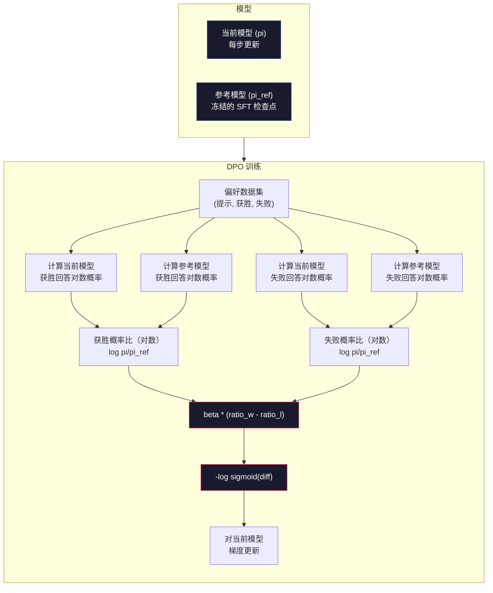

# DPO: 直接偏好优化（Direct Preference Optimization）

> RLHF（基于人类反馈的强化学习）有效，但它需要训练三个模型（SFT、奖励模型、策略模型），处理 PPO 的不稳定性，以及调节 KL 惩罚。DPO 问：如果你能跳过这些呢？DPO 直接在偏好对上优化语言模型。无需奖励模型。无需 PPO。一条训练流程。相同效果。

**类型:** 实现  
**语言:** Python（带 numpy）  
**先决条件:** 第十阶段，第七课（RLHF）  
**时间:** 约 90 分钟

## 学习目标

- 实现 DPO 训练，直接在偏好对上优化语言模型，无需独立的奖励模型  
- 推导 DPO 损失函数，解释其如何通过策略的对数概率隐式表示奖励模型  
- 比较 DPO 与 RLHF 在训练稳定性、计算成本及所需模型数量上的差异  
- 调节 beta 参数，控制训练策略与参考模型的偏离程度

## 问题背景

你在第七课搭建了 RLHF 流水线。三个阶段，三个模型：SFT 模型、奖励模型和通过 PPO 优化的策略模型。单是奖励模型就需要数千个人类偏好对和独立训练循环。PPO 需要细致调节 KL 系数、学习率、clip 比率和训练轮数。

实际上，PPO 训练 notoriously unstable（臭名昭著地不稳定）。小小的超参变化都可能造成训练发散。奖励模型是人类偏好的不完美代理，策略模型会找到利用其弱点的方式。KL 惩罚有帮助，但需要调节——太小则奖励漏洞，太大则模型学得很少。

这种复杂性是多数开源模型在 InstructGPT 发布后多年内难以成功应用 RLHF 的原因。三阶段流水线极其脆弱，每阶段有各自的失败模式，且错误相互累加。

2023 年 5 月，斯坦福的 Rafael Rafailov、Archit Sharma 等发表了论文《直接偏好优化：你的语言模型其实就是奖励模型》。关键洞见是：无需独立奖励模型。最优的奖励函数可由语言模型自身的词元概率数学确定。你可以完全跳过奖励模型，直接在偏好对上优化语言模型。

DPO 将 RLHF 简化为单一步骤的监督学习。一个模型，一个损失函数，一条训练循环，无需强化学习。Zephyr-7B，最早在大规模上使用 DPO 的模型之一，在多个基准上表现匹敌甚至优于全 RLHF 训练的模型。Meta 也将 DPO 用于 Llama 3 的对齐流程。Anthropic 在其对齐研究中引用了 DPO 风格方法。

## 概念

### 关键洞见

RLHF 优化的目标是：

```text
maximize: E[R(x, y)] - beta * KL(pi || pi_ref)
```

其中 R 是奖励模型，pi 是策略，pi_ref 是参考模型，beta 是 KL 系数。

DPO 论文证明这个目标有封闭形式的最优解。对于任何奖励函数 R，最优策略是：

```text
pi*(y | x) = pi_ref(y | x) * exp(R(x, y) / beta) / Z(x)
```

其中 Z(x) 是归一化常数。重新排列得：

```text
R(x, y) = beta * log(pi*(y | x) / pi_ref(y | x)) + beta * log Z(x)
```

这是突破点。奖励完全用策略模型概率和参考模型概率表示。无需训练独立奖励模型。奖励 *隐式* 存在于概率比中。

代入 Bradley-Terry 偏好模型：

```text
P(y_w > y_l | x) = sigmoid(R(x, y_w) - R(x, y_l))
                  = sigmoid(beta * (log pi(y_w|x)/pi_ref(y_w|x) - log pi(y_l|x)/pi_ref(y_l|x)))
```

因为 y_w 和 y_l 条件于同一提示 x，Z(x) 项互相抵消。剩下的仅仅是政策和参考模型在偏好和拒绝回答上的 log 概率差函数。

### DPO 损失

```text
L_DPO = -log(sigmoid(beta * (log pi(y_w|x)/pi_ref(y_w|x) - log pi(y_l|x)/pi_ref(y_l|x))))
```

逐项说明：

- **y_w** = 偏好（获胜）回答  
- **y_l** = 拒绝（失败）回答  
- **x** = 提示文本  
- **pi** = 当前训练模型  
- **pi_ref** = 参考模型（冻结的 SFT 检查点）  
- **beta** = 控制偏离参考的温度参数（通常 0.1 至 0.5）

比值 `log pi(y|x) / pi_ref(y|x)` 是对数概率比。正值表示当前模型对回答 y 的概率高于参考模型，负值表示低于参考模型。

DPO 损失鼓励模型增大偏好回答的概率比，减小拒绝回答的概率比。beta 控制模型相较参考模型的偏离程度——beta 小允许更大偏离，beta 大保持接近。



### 为什么 DPO 更简单

| 方面 | RLHF（PPO） | DPO |
|--------|-----------|-----|
| 训练模型数量 | 3（SFT + 奖励 + 策略） | 1（仅策略） |
| 训练循环数 | 3（SFT、奖励模型训练、PPO） | 2（SFT、DPO） |
| 超参数 | 学习率，KL 系数，clip 比率，奖励模型学习率，轮数 ×3 | 学习率，beta，轮数 |
| 奖励模型 | 需要（单独训练） | 隐式在模型概率中 |
| 强化学习算法 | PPO（复杂且不稳定） | 监督学习（稳定） |
| GPU 显存 | PPO 期间需保存 3-4 个模型 | 2 个模型（当前+参考） |
| 训练稳定性 | 对超参数敏感 | 稳健，类似 SFT |

DPO 训练时需要同时加载两个模型：当前模型和冻结参考模型。RLHF 则需三个或四个模型：策略、参考、奖励模型、可选值函数基线。对 70B 模型，每个 FP16 版本约占 140GB 显存。省掉奖励模型带来了显著的内存优势。

### DPO 何时优于 RLHF

**小规模数据集。** 使用 5,000-20,000 个偏好对时，DPO 结果经常不输甚至优于 RLHF。RLHF 中奖励模型需足够数据泛化，数据少时会过拟合，导致奖励信号不稳定。DPO 跳过奖励模型，避免了这一瓶颈。

**有限算力。** DPO 算力约为完整 RLHF 的三分之一（一条训练循环取代三条）。对于没有大型 GPU 集群的团队，这是务实选择。

**快速迭代。** 想试 10 个不同偏好数据集，看看哪个模型最好？DPO 可让每个实验在几小时内完成，而 RLHF 每次都要重训奖励模型。

### RLHF 何时优于 DPO

**大规模训练。** 对 GPT-4、Claude 这种规模，RLHF 的单独奖励模型能捕获更细致的偏好信号。奖励模型相当于一个可学习的损失函数，适应复杂质量标准。

**复杂奖励信号。** “更好” 涉及多个维度（有用性、无害性、诚实性）时，奖励模型可学习多目标权衡。DPO 将每对偏好看作二元信号——这个更好，那一个更差，不建模原因。

**迭代对齐。** RLHF 流水线能用当前策略生成新回答，人工评评分，再在线环中重训奖励模型。DPO 作用于固定偏好对数据集。Constitutional AI（Anthropic 的方法）大量依赖 RLHF 的迭代特性。

### 超越 DPO：KTO、ORPO、SimPO

DPO 启发了一系列简化对齐方法。

**KTO（Kahneman-Tversky Optimization，2024）:** 甚至不需要成对比较。KTO 仅使用不配对的反馈——仅仅标记每个回答为“好”或“坏”，无需与另一个回答比较。极大简化了数据收集。不是给标注者看两条回复问“哪个更好？”，而是看一条回复问“这条好么？” 损失函数应用了前景理论中的损失厌恶：坏回答惩罚更重于好回答的奖励。

**ORPO（Odds Ratio Preference Optimization，2024）:** 在单次训练中结合 SFT 和对齐过程。不是先做 SFT 再做 DPO，ORPO 在 SFT 损失里加入偏好信号。损失包含两项：偏好回答的标准下一个词预测损失，以及一个使偏好与拒绝回答概率差距更大的几率比项。单条训练流程代替两个。

**SimPO（Simple Preference Optimization，2024）:** 完全省略参考模型。非对数概率比，而是用响应的平均对数概率（归一化长度后）作为隐式奖励。节省显存（无需参考模型）且训练更简单。长度归一防止模型偏好过短回答。

| 方法 | 年份 | 内存中模型数 | 需要偏好对？ | 需要参考模型？ | 训练循环数 |
|--------|------|--------------|-------------|----------------|------------|
| RLHF | 2022 | 3-4 | 需要（奖励模型） | 需要 | 3 |
| DPO | 2023 | 2 | 需要 | 需要 | 2 |
| KTO | 2024 | 2 | 不需要（不配对） | 需要 | 2 |
| ORPO | 2024 | 1 | 需要 | 不需要 | 1 |
| SimPO | 2024 | 1 | 需要 | 不需要 | 1 |

趋势明显：每个方法去除一个复杂部分。RLHF 需要奖励模型和 PPO。DPO 消除了二者。KTO 消除了配对数据。ORPO 消除了独立的 SFT 阶段。SimPO 消除了参考模型。对齐开销——从基础模型到对齐模型的计算和复杂度成本——持续下降。

### 真实 DPO 应用案例

**Zephyr-7B（HuggingFace，2023 年 10 月）：** 基于 Mistral 7B，先对 UltraChat（20 万示例）做 SFT，再在 UltraFeedback（6 万对偏好）上做 DPO。MT-Bench 得分 6.47——当时最佳的 7B 模型。对比 Llama 2 Chat 70B 得分 6.86，Zephyr 使用仅 1/10 规模的模型，通过 DPO 对齐，性能达到了 94%。

**Llama 3（Meta，2024年4月）：** 在初始 RLHF 阶段之后使用了 DPO。该组合表明 DPO 和 RLHF 可以互为补充——RLHF 用于广泛的对齐，DPO 用于针对性的精细调整。

**Neural Magic / nm-chat（2024）：** 将 DPO 应用于多个开源模型，在对齐基准测试上相较仅有 SFT 基线持续展现 5-15% 的提升。

## 构建它

### 第1步：偏好数据集

格式与 RLHF 相同——（prompt，preferred，rejected）三元组。DPO 直接消费这些数据，无需中间奖励模型。

```python
import numpy as np
import sys
import os
sys.path.insert(0, os.path.join(os.path.dirname(__file__), "..", "..", "04-pre-training-mini-gpt", "code"))
from main import MiniGPT, LayerNorm, Embedding, TransformerBlock

PREFERENCE_DATA = [
    {
        "prompt": "What is the capital of France?",
        "preferred": "The capital of France is Paris.",
        "rejected": "France is a country in Europe. It has many cities. The capital is Paris. Paris is known for the Eiffel Tower.",
    },
    {
        "prompt": "Explain gravity in one sentence.",
        "preferred": "Gravity is the force that attracts objects with mass toward each other.",
        "rejected": "Gravity is something that makes things fall down when you drop them.",
    },
    {
        "prompt": "What is 15 times 7?",
        "preferred": "15 times 7 is 105.",
        "rejected": "Let me think about this. 15 times 7. Well, 10 times 7 is 70, and 5 times 7 is 35, so the answer might be around 105.",
    },
    {
        "prompt": "Name three programming languages.",
        "preferred": "Python, Rust, and TypeScript.",
        "rejected": "There are many programming languages. Some popular ones include various languages like Python and others.",
    },
    {
        "prompt": "What year did World War II end?",
        "preferred": "World War II ended in 1945.",
        "rejected": "World War II was a major global conflict. It involved many countries. The war ended in the mid-1940s, specifically in 1945.",
    },
    {
        "prompt": "Define machine learning.",
        "preferred": "Machine learning is a field where algorithms learn patterns from data to make predictions without being explicitly programmed.",
        "rejected": "Machine learning is a type of AI. AI stands for artificial intelligence. Machine learning uses data to learn.",
    },
]
```

### 第2步：序列对数概率

DPO 损失需要计算给定提示的响应的总对数概率。这意味着对完整的（prompt + response）序列运行模型，并对每个响应的 token 计算对数概率之和。

```python
def tokenize_sequence(text, vocab_size=256):
    return [min(t, vocab_size - 1) for t in list(text.encode("utf-8"))]


def compute_sequence_log_prob(model, prompt_tokens, response_tokens, max_seq_len=128):
    full_sequence = prompt_tokens + response_tokens
    if len(full_sequence) > max_seq_len:
        full_sequence = full_sequence[:max_seq_len]

    if len(full_sequence) < 2:
        return 0.0

    input_ids = np.array(full_sequence[:-1]).reshape(1, -1)
    target_ids = np.array(full_sequence[1:])

    logits = model.forward(input_ids)
    logits = logits[0]

    max_logits = logits.max(axis=-1, keepdims=True)
    log_probs = logits - max_logits - np.log(
        np.exp(logits - max_logits).sum(axis=-1, keepdims=True)
    )

    prompt_len = len(prompt_tokens)
    response_start = max(0, prompt_len - 1)
    response_end = len(target_ids)

    if response_start >= response_end:
        return 0.0

    response_log_probs = log_probs[response_start:response_end, :]
    response_targets = target_ids[response_start:response_end]

    total_log_prob = 0.0
    for i, target in enumerate(response_targets):
        total_log_prob += response_log_probs[i, target]

    return total_log_prob
```

这个函数是 DPO 的核心。对于每对偏好，它会运行四次：策略模型对优选响应、对拒绝响应，参考模型对优选响应、对拒绝响应。每个训练样本四次前向传递，相较于 RLHF 的生成 + 奖励评分 + 价值估计 + PPO 更新更简单、更快、更稳定。

### 第3步：DPO 损失

论文核心的代码。一个函数。一个损失。无奖励模型。

```python
def sigmoid(x):
    return np.where(
        x >= 0,
        1.0 / (1.0 + np.exp(-x)),
        np.exp(x) / (1.0 + np.exp(x))
    )


def dpo_loss(policy_logprob_preferred, policy_logprob_rejected,
             ref_logprob_preferred, ref_logprob_rejected, beta=0.1):
    preferred_ratio = policy_logprob_preferred - ref_logprob_preferred
    rejected_ratio = policy_logprob_rejected - ref_logprob_rejected

    logit = beta * (preferred_ratio - rejected_ratio)

    loss = -np.log(sigmoid(logit) + 1e-8)

    preferred_reward = beta * preferred_ratio
    rejected_reward = beta * rejected_ratio

    return loss, {
        "preferred_ratio": float(preferred_ratio),
        "rejected_ratio": float(rejected_ratio),
        "logit": float(logit),
        "implicit_preferred_reward": float(preferred_reward),
        "implicit_rejected_reward": float(rejected_reward),
        "reward_margin": float(preferred_reward - rejected_reward),
    }
```

`preferred_ratio` 和 `rejected_ratio` 是 DPO 推导出的对数概率比值。当当前模型相较参考模型为优选响应分配更高概率、为拒绝响应分配更低概率时，logit 为正，损失较小。训练信号正是推动模型沿着这个方向优化。

`implicit_preferred_reward` 和 `implicit_rejected_reward` 是 DPO 损失隐式指派的奖励。你可以提取它们以验证训练效果——优选和拒绝奖励之间的边际值应随着训练增长。

### 第4步：DPO 训练循环

一个标准的监督训练循环。无 PPO。无奖励模型。仅前向传递和梯度更新。

```python
def copy_model_weights(source, target):
    target.embedding.token_embed = source.embedding.token_embed.copy()
    target.embedding.pos_embed = source.embedding.pos_embed.copy()
    target.ln_f.gamma = source.ln_f.gamma.copy()
    target.ln_f.beta = source.ln_f.beta.copy()
    for s_block, t_block in zip(source.blocks, target.blocks):
        t_block.attn.W_q = s_block.attn.W_q.copy()
        t_block.attn.W_k = s_block.attn.W_k.copy()
        t_block.attn.W_v = s_block.attn.W_v.copy()
        t_block.attn.W_out = s_block.attn.W_out.copy()
        t_block.ffn.W1 = s_block.ffn.W1.copy()
        t_block.ffn.W2 = s_block.ffn.W2.copy()
        t_block.ffn.b1 = s_block.ffn.b1.copy()
        t_block.ffn.b2 = s_block.ffn.b2.copy()
        t_block.ln1.gamma = s_block.ln1.gamma.copy()
        t_block.ln1.beta = s_block.ln1.beta.copy()
        t_block.ln2.gamma = s_block.ln2.gamma.copy()
        t_block.ln2.beta = s_block.ln2.beta.copy()


def dpo_train(policy_model, reference_model, preference_data,
              num_epochs=5, lr=5e-6, beta=0.1, max_seq_len=128):
    print(f"DPO Training: {len(preference_data)} pairs, {num_epochs} epochs, "
          f"lr={lr}, beta={beta}")
    print()

    losses = []
    margins = []

    for epoch in range(num_epochs):
        epoch_loss = 0.0
        epoch_margin = 0.0
        num_examples = 0

        indices = np.random.permutation(len(preference_data))

        for idx in indices:
            pair = preference_data[idx]

            prompt_tokens = tokenize_sequence(pair["prompt"])
            preferred_tokens = tokenize_sequence(pair["preferred"])
            rejected_tokens = tokenize_sequence(pair["rejected"])

            pi_logprob_w = compute_sequence_log_prob(
                policy_model, prompt_tokens, preferred_tokens, max_seq_len
            )
            pi_logprob_l = compute_sequence_log_prob(
                policy_model, prompt_tokens, rejected_tokens, max_seq_len
            )
            ref_logprob_w = compute_sequence_log_prob(
                reference_model, prompt_tokens, preferred_tokens, max_seq_len
            )
            ref_logprob_l = compute_sequence_log_prob(
                reference_model, prompt_tokens, rejected_tokens, max_seq_len
            )

            loss, metrics = dpo_loss(
                pi_logprob_w, pi_logprob_l,
                ref_logprob_w, ref_logprob_l, beta
            )

            update_direction = 1.0 if metrics["logit"] < 0 else -0.1
            for block in policy_model.blocks:
                block.ffn.W1 += lr * update_direction * np.random.randn(*block.ffn.W1.shape) * 0.01
                block.ffn.W2 += lr * update_direction * np.random.randn(*block.ffn.W2.shape) * 0.01

            epoch_loss += loss
            epoch_margin += metrics["reward_margin"]
            num_examples += 1
            losses.append(float(loss))
            margins.append(metrics["reward_margin"])

        avg_loss = epoch_loss / max(num_examples, 1)
        avg_margin = epoch_margin / max(num_examples, 1)

        print(f"  Epoch {epoch + 1}/{num_epochs} | Loss: {avg_loss:.4f} | "
              f"Avg Margin: {avg_margin:.4f}")

    return policy_model, losses, margins
```

相较于 RLHF，训练循环简洁得多。对于每对偏好：计算四个对数概率（两个模型，两种响应），输入 DPO 损失，计算梯度，更新策略。无生成步骤。无奖励模型推理。无优势估计。无裁剪。

### 第5步：比较 DPO 与 RLHF

通过测量隐式奖励边际和对数概率变化，评估 DPO 与第07课的 RLHF 模型的区别。

```python
def evaluate_preference_accuracy(model, reference_model, preference_data, beta=0.1, max_seq_len=128):
    correct = 0
    total = 0

    for pair in preference_data:
        prompt_tokens = tokenize_sequence(pair["prompt"])
        preferred_tokens = tokenize_sequence(pair["preferred"])
        rejected_tokens = tokenize_sequence(pair["rejected"])

        pi_w = compute_sequence_log_prob(model, prompt_tokens, preferred_tokens, max_seq_len)
        pi_l = compute_sequence_log_prob(model, prompt_tokens, rejected_tokens, max_seq_len)
        ref_w = compute_sequence_log_prob(reference_model, prompt_tokens, preferred_tokens, max_seq_len)
        ref_l = compute_sequence_log_prob(reference_model, prompt_tokens, rejected_tokens, max_seq_len)

        preferred_reward = beta * (pi_w - ref_w)
        rejected_reward = beta * (pi_l - ref_l)

        if preferred_reward > rejected_reward:
            correct += 1
        total += 1

    return correct / max(total, 1)


def analyze_implicit_rewards(model, reference_model, preference_data, beta=0.1, max_seq_len=128):
    print("隐式奖励分析：")
    print("-" * 65)
    print(f"  {'Prompt':<30} {'Pref Reward':>12} {'Rej Reward':>12} {'Margin':>10}")
    print("  " + "-" * 60)

    for pair in preference_data:
        prompt_tokens = tokenize_sequence(pair["prompt"])
        preferred_tokens = tokenize_sequence(pair["preferred"])
        rejected_tokens = tokenize_sequence(pair["rejected"])

        pi_w = compute_sequence_log_prob(model, prompt_tokens, preferred_tokens, max_seq_len)
        pi_l = compute_sequence_log_prob(model, prompt_tokens, rejected_tokens, max_seq_len)
        ref_w = compute_sequence_log_prob(reference_model, prompt_tokens, preferred_tokens, max_seq_len)
        ref_l = compute_sequence_log_prob(reference_model, prompt_tokens, rejected_tokens, max_seq_len)

        pref_reward = beta * (pi_w - ref_w)
        rej_reward = beta * (pi_l - ref_l)
        margin = pref_reward - rej_reward

        truncated = pair["prompt"][:28] + ".." if len(pair["prompt"]) > 30 else pair["prompt"]
        print(f"  {truncated:<30} {pref_reward:>12.4f} {rej_reward:>12.4f} {margin:>10.4f}")

    print()
```

### 第6步：Beta灵敏度分析

Beta参数是DPO中相当于RLHF中KL系数的参数。它控制模型偏离参考模型的程度。本实验展示了它的影响。

```python
def beta_sensitivity_analysis(sft_model, preference_data, betas, max_seq_len=128):
    print("Beta灵敏度分析")
    print("-" * 60)
    print(f"  {'Beta':>8} {'最终损失':>12} {'最终边际':>14} {'准确率':>10}")
    print("  " + "-" * 55)

    results = []

    for beta in betas:
        policy = MiniGPT(
            vocab_size=256, embed_dim=128, num_heads=4,
            num_layers=4, max_seq_len=max_seq_len, ff_dim=512
        )
        reference = MiniGPT(
            vocab_size=256, embed_dim=128, num_heads=4,
            num_layers=4, max_seq_len=max_seq_len, ff_dim=512
        )
        copy_model_weights(sft_model, policy)
        copy_model_weights(sft_model, reference)

        policy, losses, margins_list = dpo_train(
            policy, reference, preference_data,
            num_epochs=3, lr=5e-6, beta=beta, max_seq_len=max_seq_len
        )

        accuracy = evaluate_preference_accuracy(
            policy, reference, preference_data, beta, max_seq_len
        )

        final_loss = losses[-1] if losses else 0
        final_margin = margins_list[-1] if margins_list else 0

        print(f"  {beta:>8.3f} {final_loss:>12.4f} {final_margin:>14.4f} {accuracy:>10.1%}")
        results.append({
            "beta": beta,
            "final_loss": final_loss,
            "final_margin": final_margin,
            "accuracy": accuracy,
        })

        print()

    return results
```

较小的beta（0.01）允许模型自由偏离参考模型——学习快但可能退化。较大的beta（1.0）则让模型紧贴参考模型——稳定但学习慢。大多数应用的最佳区间是0.1到0.3。

## 使用示例

### 完整DPO流水线演示

```python
if __name__ == "__main__":
    np.random.seed(42)

    print("=" * 70)
    print("DPO: 直接偏好优化（Direct Preference Optimization）")
    print("=" * 70)
    print()

    print("步骤1：初始化SFT模型（来自第06课）")
    print("-" * 50)
    sft_model = MiniGPT(
        vocab_size=256, embed_dim=128, num_heads=4,
        num_layers=4, max_seq_len=128, ff_dim=512
    )
    print(f"  参数数量: {sft_model.count_parameters():,}")
    print()

    print("步骤2：DPO训练")
    print("-" * 50)

    policy_model = MiniGPT(
        vocab_size=256, embed_dim=128, num_heads=4,
        num_layers=4, max_seq_len=128, ff_dim=512
    )
    reference_model = MiniGPT(
        vocab_size=256, embed_dim=128, num_heads=4,
        num_layers=4, max_seq_len=128, ff_dim=512
    )
    copy_model_weights(sft_model, policy_model)
    copy_model_weights(sft_model, reference_model)

    policy_model, losses, margins = dpo_train(
        policy_model, reference_model, PREFERENCE_DATA,
        num_epochs=5, lr=5e-6, beta=0.1
    )
    print()

    print("=" * 70)
    print("步骤3：评估")
    print("=" * 70)
    print()

    pre_accuracy = evaluate_preference_accuracy(
        sft_model, reference_model, PREFERENCE_DATA, beta=0.1
    )
    post_accuracy = evaluate_preference_accuracy(
        policy_model, reference_model, PREFERENCE_DATA, beta=0.1
    )

    print(f"  偏好准确率（训练前-DPO）:  {pre_accuracy:.1%}")
    print(f"  偏好准确率（训练后-DPO）:  {post_accuracy:.1%}")
    print()

    analyze_implicit_rewards(policy_model, reference_model, PREFERENCE_DATA, beta=0.1)

    print("=" * 70)
    print("步骤4：训练动态")
    print("=" * 70)
    print()

    if losses:
        print("  损失曲线:")
        window = max(1, len(losses) // 5)
        for i in range(0, len(losses), window):
            chunk = losses[i:i + window]
            avg = sum(chunk) / len(chunk)
            print(f"    步骤 {i:3d}-{i + len(chunk) - 1:3d}: 损失 = {avg:.4f}")
        print()

    if margins:
        print("  奖励边际曲线:")
        window = max(1, len(margins) // 5)
        for i in range(0, len(margins), window):
            chunk = margins[i:i + window]
            avg = sum(chunk) / len(chunk)
            print(f"    步骤 {i:3d}-{i + len(chunk) - 1:3d}: 边际 = {avg:.4f}")
        print()

    print("=" * 70)
    print("步骤5：Beta灵敏度分析")
    print("=" * 70)
    print()

    beta_results = beta_sensitivity_analysis(
        sft_model, PREFERENCE_DATA, betas=[0.01, 0.1, 0.3, 1.0]
    )

    print("=" * 70)
    print("DPO与RLHF对比")
    print("=" * 70)
    print()
    print("  DPO优点:")
    print("    - 单次训练循环（而RLHF需3次）")
    print("    - 内存中只需2个模型（而RLHF需3-4个）")
    print("    - 监督学习（比RL更稳定）")
    print("    - 无需训练或维护奖励模型")
    print()
    print("  RLHF优点:")
    print("    - 独立奖励模型捕获复杂偏好")
    print("    - 在线学习：生成、评分、再训练")
    print("    - 更适合多目标对齐")
    print("    - 已被最大规模模型（GPT-4、Claude）验证")
    print()
    print("  实践建议:")
    print("    - 先用DPO。它更简单且通常足够。")
    print("    - 若DPO在评估指标上停滞，再切换到RLHF。")
    print("    - 许多生产系统采用两者结合：先RLHF，后DPO精炼。")
```

## 部署应用

本课生成的文件为 `outputs/prompt-alignment-method-selector.md` —— 一个帮助你根据数据可用性、算力预算和对齐目标选择合适对齐方法（SFT、RLHF、DPO、KTO、ORPO、SimPO）的提示。它推荐了方法和训练方案。

## 练习

1. 实现KTO（Kahneman-Tversky Optimization）。KTO不需要成对数据——只需给每个响应贴“好”或“坏”标签。好响应的损失是`-log(sigmoid(beta * log_ratio))`，坏响应的损失是`-log(1 - sigmoid(beta * log_ratio))`，且坏响应损失乘以损失规避系数（通常1.5倍）。在同一数据上训练（偏好响应视为“好”，被拒响应视为“坏”，分别独立训练），并与DPO准确率比较。

2. 实现长度归一化的DPO。不使用原始对数概率，而是除以响应token数：`normalized_logprob = total_logprob / num_tokens`。这防止模型偏爱较短响应（其总对数概率较大）。比较归一化前后的隐式奖励边际。

3. 构建ORPO风格的组合损失。在偏好响应上加上标准的下一个token预测损失：`L = L_sft(preferred) + alpha * L_dpo`。尝试alpha值0.1、0.5和1.0。组合损失应产生既遵循指令（来自SFT），又偏好更优响应（来自DPO）的模型，避免单独的SFT阶段。

4. 实现迭代DPO。先跑3个epoch DPO，然后用训练好的模型生成新响应，将它们与原偏好响应配对作为新偏好对，再次运行DPO。执行两轮这类“自我博弈”流程。比较第1轮和第2轮后的偏好准确率，观察迭代精炼是否有帮助。

5. 使用不同参考模型比较DPO性能。不使用SFT检查点作为参考，而尝试：(a) 基础模型（预SFT），(b) DPO第1个epoch的检查点，(c) 策略模型的指数移动平均。报告哪种参考产生最高偏好准确率和最稳定的训练曲线。

## 关键术语

| 术语 | 大家说 | 实际意思 |
|------|--------|----------|
| DPO | “无RL的RLHF” | 直接偏好优化：一种监督学习算法，直接对偏好对优化语言模型，省略奖励模型和PPO |
| 隐式奖励（Implicit reward） | “奖励潜藏在模型中” | 奖励函数由策略模型和参考模型的对数概率比决定，无需单独奖励模型 |
| Beta（DPO） | “温度参数” | 控制策略偏离参考模型的距离——小beta允许大偏离，大beta保持模型接近参考 |
| 对数概率比 | “模型改变的幅度” | log pi(y\|x) - log pi_ref(y\|x)——正值表示当前模型比参考模型赋予更高概率 |
| 参考模型 | “冻结的检查点” | SFT模型的副本，权重不更新，作为计算概率比的基准 |
| KTO | “无对组的DPO” | Kahneman-Tversky优化：用“好”或“坏”标签替代偏好对 |
| ORPO | “一步式对齐” | Odds Ratio偏好优化：通过向SFT损失中添加偏好项，将SFT和对齐合为一体 |
| SimPO | “无需参考模型” | 简单偏好优化：用长度归一化的平均对数概率代替隐式奖励，消除参考模型 |
| 对齐成本（Alignment tax） | “让模型安全的代价” | 从基础模型到对齐模型所需的额外计算、数据和复杂性——DPO大幅降低了这个成本 |

## 深入阅读

- [Rafailov et al., 2023 —— “直接偏好优化：你的语言模型实际上是奖励模型”](https://arxiv.org/abs/2305.18290) —— 将对齐从RLHF简化为监督学习的DPO论文
- [Tunstall et al., 2023 —— “Zephyr: 语言模型对齐的直接蒸馏”](https://arxiv.org/abs/2310.16944) —— Zephyr-7B，显示UltraFeedback上的DPO性能与RLHF相当
- [Ethayarajh et al., 2024 —— “KTO：作为前景理论优化的模型对齐”](https://arxiv.org/abs/2402.01306) —— 消除对成对偏好数据的需求
- [Hong et al., 2024 —— “ORPO：无需参考模型的单步偏好优化”](https://arxiv.org/abs/2403.07691) —— 将SFT和对齐合于一步
- [Meng et al., 2024 —— “SimPO：基于无参考奖励的简单偏好优化”](https://arxiv.org/abs/2405.14734) —— 完全消除参考模型
- [Llama 3技术报告](https://arxiv.org/abs/2407.21783) —— Meta结合RLHF和DPO的对齐流水线
