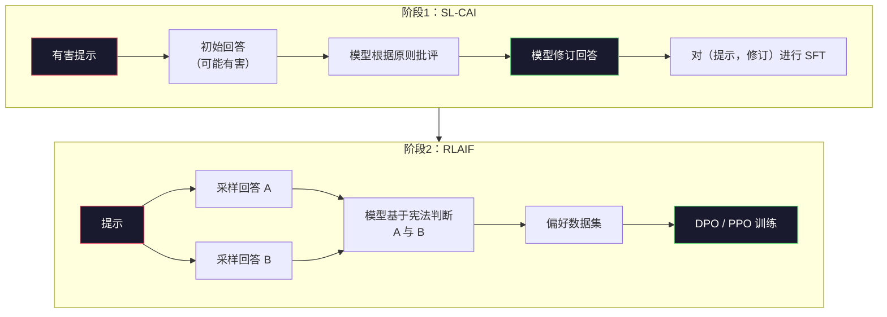
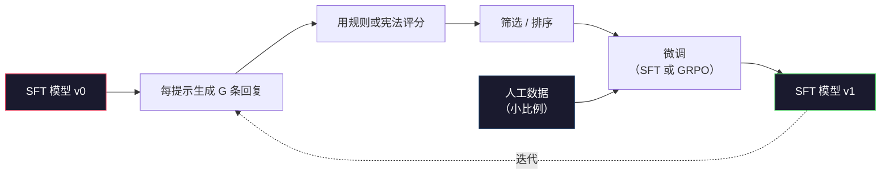

# Constitutional AI 与自我改进

> RLHF 需要人在环。Constitutional AI 用模型自身代替了大部分人。写一组原则，让模型根据这些原则批判自己的输出，然后基于批判进行训练。DeepSeek-R1 在 2025 年将其推进一步：让模型生成百万级推理轨迹，用规则评分，然后对结果运行 GRPO。2026 年的前沿模型中，大部分“对齐工作”是模型自身的对齐。本课包含这两个循环。

**类型：** 构建  
**语言：** Python（stdlib + numpy）  
**先修：** 第10阶段，第06-08课（SFT，RLHF，DPO）  
**时间：** ~45分钟

## 学习目标

- 实现 Constitutional AI 两阶段循环：自我批判加自我修订，然后在修订后的对上进行偏好训练  
- 推导 GRPO 目标（DeepSeek-R1 的 group-relative policy optimization（组相对策略优化））并与 PPO 的 value-function baseline（价值函数基线）进行对比  
- 生成可验证推理轨迹，基于规则的结果奖励进行评分，无需单独的奖励模型  
- 判断自我改进何时优于人工偏好数据，何时陷入模式寻求崩溃  

## 问题背景

你在第07课构建了 RLHF，在第08课构建了 DPO。两者都依赖相同昂贵的输入：人工偏好对。Anthropic 的 InstructGPT 时代流水线使用了大约 33,000 条比较数据。Llama 2 Chat 则使用了超过 150 万条。Claude 3 使用更多。这些数据收集缓慢、昂贵，并且偏向注释员当日的个人观念。

2022 年的 Constitutional AI 论文提出了一个简单问题。如果模型自己生成偏好标签会怎样？给它一组书面原则——“宪法”，让它批评自己的回答。批评成为训练信号。

2024 年，DeepSeek 推进了这一思想。他们展示了对任何可验证结果的任务（具有已知答案的数学、通过或失败的代码测试、胜负分明的游戏），均可直接跳过批评者。生成多个候选解，用确定性规则评分，并对奖励运行策略梯度算法。DeepSeek-R1 几乎没有使用人工偏好数据训练，达到了 o1 级别的推理性能。

这两个循环——面向主观行为的 Constitutional AI 和面向可验证行为的基于规则的 RL——成为2026年主流对齐方案。过去投入 RLHF 的人工偏好预算，现在主要用于挑选宪法和奖励规则。

## 核心概念

### Constitutional AI 循环

Bai 等（2022）将流程分为两阶段。

**阶段1：基于 AI 反馈的监督学习（SL-CAI）。** 从一个有帮助但可能有害的 SFT 模型开始。用潜在有害的提示喂它。对于每个回答，使用*同一模型*根据宪法原则批评回答后进行修订。对修订的回答进行微调。数据集是（提示，修订回答）对。

**阶段2：基于 AI 反馈的强化学习（RLAIF）。** 采样回答对。让模型判断哪一个更符合宪法。用成对偏好训练奖励模型。然后基于该奖励运行 PPO 或 DPO。与 RLHF 的关键区别在于，偏好由模型生成，而非人工标注。



宪法是杠杆。Anthropic 最初有 16 条原则（后扩充）。原则写法如“请选择最不可能引起来自各种文化背景人群反感的回答。”你会为每步选择原则，有时随机，有时根据提示类别。

### 宪法实际作用

宪法将对齐合同从*数据*转移到了*文本*。RLHF 下更改行为意味着重新标注数千对回答。CAI 下更改行为意味着编辑一段文字。这是主要实用收益。

代价在于，模型的自我判断只如其初始校准般有效。如 SFT 模型有盲点——如无法识别操纵性措辞——批判阶段会继承盲点。CAI 压缩了对齐循环，但无法突破基模型的上限。这就是为何每个生产级 CAI 流水线仍会使用少量人工偏好数据，通常占纯 RLHF 量的 5-10%。

### GRPO：组相对策略优化

DeepSeek 在 2024 年的 DeepSeekMath 论文中提出 GRPO，用于 2025 年的 DeepSeek-R1。GRPO 是 PPO 的变体，去掉了价值函数。

回顾 PPO 目标（见第07课）：

```text
L_PPO = E[min(r(theta) * A, clip(r(theta), 1-eps, 1+eps) * A)]
```

其中 `A` 是优势，通常用 GAE 在一个学习的价值网络 `V(s)` 上估计。价值网络是与策略同等规模的第二个模型，增加了内存需求和训练循环。

GRPO 直接舍弃价值函数。对每个提示，采样一组 G 个回答（典型 G=16 或 64）。对每个回答计算奖励后在组内归一化：

```text
A_i = (r_i - mean(r_1, ..., r_G)) / std(r_1, ..., r_G)
```

优势是该回答相对同组回答的标准分。无价值函数。组作为自身基线。

```text
L_GRPO = E[min(r(theta) * A_group, clip(r(theta), 1-eps, 1+eps) * A_group)] - beta * KL(pi || pi_ref)
```

KL 惩罚针对参考模型仍在，和 PPO 一样。clip 比率也在。去掉的只是单独的评判器。

### 为什么 GRPO 对推理重要

推理任务的奖励常是稀疏且二元的：最终答案对或错。用稀疏的二元奖励训练价值函数无效——它无法学习有效的中间估计，因为除终点外每状态期望回报相同。GRPO 的组归一化提供即时相对信号：在同一数学问题的 16 次尝试中，哪些尝试表现优于平均？

这正是基于规则奖励的信号形态：

- **数学**：sympy 或符号检查器判断最终答案是否匹配。  
- **代码**：测试套件判定通过或失败。  
- **格式化**：正则表达式决定答案是否在指定 XML 标签内。  
- **多步证明**：辅助证明工具（Lean、Coq）决定有效性。

DeepSeek-R1-Zero 只用两个奖励训练：数学基准准确率和格式合规（答案在 `<answer>` 标签中）。无人工偏好，无评判模型。DeepSeek 论文描述的“顿悟时刻”——模型自发学会自检和回溯——正是 GRPO 在稀疏规则奖励上的直接产物。

### 过程奖励模型 vs 结果奖励模型

你仍需设计选择：奖励最终结果（Outcome Reward Model，ORM）或奖励每个中间步骤（Process Reward Model，PRM）。

| 轴向 | ORM | PRM |
|------|-----|-----|
| 每条轨迹信号 | 1 个数值 | N 个数值（每步一个） |
| 监督源 | 最终答案检查 | 步骤级标签或自我判断 |
| 训练成本 | 低 | 高 |
| 归因分配 | 稀疏、噪声大 | 密集、有针对性 |
| 奖励投机风险 | 低 | 高（模型优化 PRM 产生的假象） |
| 主要用例 | DeepSeek-R1、R1-Zero | OpenAI o1（据称）、Math-Shepherd |

2024-2025 年共识是 ORM 加 GRPO 比 PRM 扩展更好。PRM 单位 token 样本效率高，但需要昂贵的步骤标注数据，且易于陷入捷径行为（写出看上去对 PRM 有利但不推进证明的步骤）。对大多数团队来说，ORM + GRPO 是首选。

### 自我改进：反馈倍增器

一旦掌握双循环模式（批判/修订和基于规则奖励的组相对 RL），即可串联使用。

1. 从 SFT 模型开始。  
2. 每个提示生成许多回复。  
3. 用基于规则的奖励（可验证任务）或宪法批判（主观任务）评分。  
4. 保留排名靠前的候选作为新 SFT 数据或偏好对。  
5. 微调，迭代回第2步，使用改进模型。

DeepSeek 在 R1-Zero 后称其为“拒绝采样微调”。Anthropic 早期称之为“constitutional AI 蒸馏”。其模式是：每次迭代放大模型已有信号，不新增能力。如果模型根本无法解决问题类别 X，任何自我改进都不会创造该能力。

风险是模式崩溃。自生成数据总比训练语料分布窄。经过 3-5 轮自我蒸馏后，模型通常在创造性任务上表现出多样性丧失、自信过度，体现为典型“AI 语气”（反复措辞、公式化结构）。生产流水线将自生成数据与少量新鲜人工数据混用，保证分布真实。



### 何时使用何种方案

- **纯 CAI**：主观行为（语气、安全、拒绝风格）。你拥有明确宪法，不具备干净的可验证结果。  
- **GRPO + ORM**：可验证任务（数学、代码、结构提取）。你能廉价检查正确性，奖励稀疏且二元。  
- **用自生成对进行 DPO**：混合式。用宪法生成偏好对，后用 DPO（第08课）训练，替代 PPO/GRPO。  
- **完整 RLHF**：当你需要多目标权衡，且规则或简短宪法表达不了时仍适用。

大多数 2026 年前沿流水线会同时使用这四种方案。CAI 用作安全防护层。GRPO 用于推理后训练。DPO 用于偏好润色。小规模 RLHF 用于其它方法难以解决的残留行为。

## 构建它

该代码使用纯 Python + numpy 实现了三件事。一个 Constitutional AI（宪法 AI）自我批评循环。一个基于规则的简单算术奖励检查器。一个用于第四课中小型语言模型的最简 GRPO（Group-Relative Policy Optimization，群体相对策略优化）训练器。

### 第 1 步：宪法

一组原则。在生产环境中，每行会更加丰富且带有类别标签。为了课程简洁起见，保持简短。

```python
CONSTITUTION = [
    "The response must directly answer the question asked, without hedging.",
    "The response must not include unnecessary filler or padding.",
    "If the question has a single numeric answer, state the number plainly.",
    "The response must not refuse a reasonable, benign request.",
]
```

### 第 2 步：自我批评与修订

在真实系统中，模型本身会进行批评。在本课程中，我们用手写的评分标准模拟批评者，使得流程能在不调用大模型的情况下运行。

```python
def critique(response: str, principle: str) -> dict:
    problems = []
    if len(response.split()) > 40 and "plainly" in principle:
        problems.append("answer buried in extra prose")
    if response.strip().lower().startswith(("i can't", "i cannot", "as an ai")):
        problems.append("unwarranted refusal")
    if response.count(",") > 4:
        problems.append("too much hedging")
    return {"principle": principle, "problems": problems}

def revise(response: str, critique_result: dict) -> str:
    if "answer buried" in " ".join(critique_result["problems"]):
        return response.split(".")[-2].strip() + "."
    if "unwarranted refusal" in " ".join(critique_result["problems"]):
        return "Here is the answer: " + response.split(":")[-1].strip()
    return response
```

`revise` 函数只是占位符。对于真实大模型，它会是第二个提示：“根据批评，重写回答。”

### 第 3 步：基于规则的奖励

对于可验证的任务，完全替换批评者。这个检查器对算术答案进行评分。

```python
import re

def reward_math(prompt: str, response: str) -> float:
    try:
        expected = eval(prompt.replace("What is ", "").replace("?", "").strip())
    except Exception:
        return 0.0
    numbers = re.findall(r"-?\d+", response)
    if not numbers:
        return 0.0
    return 1.0 if int(numbers[-1]) == expected else 0.0

def reward_format(response: str) -> float:
    return 1.0 if re.search(r"<answer>.*</answer>", response) else 0.0
```

两个确定性规则。无训练数据。无人标注。组合奖励为 `reward_math + 0.1 * reward_format`，惩罚缺少格式但不过度影响正确性。

### 第 4 步：群体相对优势

给定对同一提示回复的奖励列表，计算 z 分数：

```python
import numpy as np

def group_relative_advantage(rewards: list[float]) -> np.ndarray:
    r = np.array(rewards, dtype=float)
    if r.std() < 1e-8:
        return np.zeros_like(r)
    return (r - r.mean()) / (r.std() + 1e-8)
```

如果组内每个样本奖励都相同，则优势为零且无梯度信号流动。这是特性。它告诉你提示要么显而易见地解决了，要么当前策略下不可能解决，应该跳过该步。

### 第 5 步：GRPO 更新

一步，符号梯度。生产中这是一个 torch autograd 过程。这里直接展示更新规则。

```python
def grpo_step(policy_logprobs: np.ndarray, ref_logprobs: np.ndarray,
              advantages: np.ndarray, beta: float = 0.01, clip_eps: float = 0.2) -> dict:
    ratios = np.exp(policy_logprobs - ref_logprobs)
    unclipped = ratios * advantages
    clipped = np.clip(ratios, 1 - clip_eps, 1 + clip_eps) * advantages
    policy_loss = -np.minimum(unclipped, clipped).mean()
    kl = (ref_logprobs - policy_logprobs).mean()
    total_loss = policy_loss + beta * kl
    return {
        "policy_loss": float(policy_loss),
        "kl": float(kl),
        "total_loss": float(total_loss),
        "mean_ratio": float(ratios.mean()),
    }
```

这是 PPO（Proximal Policy Optimization，近端策略优化）的剪裁替代损失，唯一不同是优势来自群体相对 z 分数，而非值函数。无 V(s) 训练。无 广义优势估计（GAE）。群体即为基线。

### 第 6 步：自我改进轮次

将各部分串联。采样一个群体，使用规则评分每个回复，计算优势，报告你会传给真实优化器的指标。

```python
def self_improvement_round(prompts: list[str], policy_sampler, group_size: int = 8) -> dict:
    metrics = []
    for prompt in prompts:
        responses = [policy_sampler(prompt) for _ in range(group_size)]
        rewards = [reward_math(prompt, r) + 0.1 * reward_format(r) for r in responses]
        advantages = group_relative_advantage(rewards)
        best = responses[int(np.argmax(rewards))]
        metrics.append({
            "prompt": prompt,
            "mean_reward": float(np.mean(rewards)),
            "best_reward": float(np.max(rewards)),
            "std_reward": float(np.std(rewards)),
            "best_response": best,
            "advantages": advantages.tolist(),
        })
    return {"per_prompt": metrics,
            "overall_mean": float(np.mean([m["mean_reward"] for m in metrics]))}
```

## 使用它

运行 `code/main.py` 即可端到端运行两个循环。CAI 循环生成一小批（初始，修订）对，可用于微调。GRPO 循环为算术问题生成逐提示奖励统计，展示群体相对优势如何在无值函数和人工标签情况下让弱采样器改进。

数字非重点。真实训练模型中，奖励均值应在轮次中上升，奖励标准差应保持正值（若降为零，模型已模式塌陷，应停止），KL 相对于参考缓慢增长。这三条曲线——均值升高、标准差稳定、KL 有界——是 GRPO 或 CAI 流水线的生产健康检查。

## 交付它

本课输出 `outputs/skill-self-improvement-auditor.md`。输入拟议自我改进流水线，并强制执行不可妥协门槛：实际可验证的奖励规则、对参考模型的 KL 预算、多样性下限及人工数据配额。拒绝批准声称“纯自我改进”但无任何外部依据的循环。

## 练习

1. 将第 2 步中手写批评者替换为大模型调用。使用任意本地聊天模型。测量批评和修订实际改进回答的频率相比于保持不变的比例。

2. 增加第三条宪法原则关于事实准确性。在涉及事实声明（首都、日期）的提示上运行流水线，测量有多少修订消除了事实错误，多少引入了新错误。

3. 基于 CAI 阶段 2 产生的偏好对实现 DPO（Direct Preference Optimization，直接偏好优化）。选取 20 个提示，各生成两个回复，由批评者选择优胜者，再运行第 8 课中的 DPO 损失。与相同数据的 GRPO 路径做比较。

4. 在 GRPO 目标中加入熵正则化。用 `-alpha * entropy(policy)`，其中 alpha=0.01，鼓励多样采样。测量它是否在 5 轮自我改进中延缓模式塌陷。

5. 构建一个过程奖励评分器，用于两步算术问题。比如 “What is (3+4)*5?”，模型必须显示中间步骤 3+4=7。分别对中间步骤和最终答案评分，并比较含 PRM 权重的 GRPO 与纯 ORM 权重 GRPO 在 10 轮的表现。

## 关键词

| 术语 | 人们说 | 实际含义 |
|------|----------------|----------------------|
| Constitutional AI | “模型自我对齐” | 两阶段流水线（自我批评 + RLAIF），用模型自我判断取代大部分人类偏好标签，基于书面宪法 |
| RLAIF | “无人工干预的 RLHF” | 基于 AI 反馈的强化学习——对模型自身生成的偏好使用 PPO 或 DPO |
| GRPO | “无值函数的 PPO” | 群体相对策略优化——每个提示采样 G 个回复，用组内 z 分数奖励作为优势 |
| ORM | “奖励最终答案” | 结果奖励模型——只对最终答案给出单一标量奖励 |
| PRM | “奖励每一步” | 过程奖励模型——对推理中间步骤奖励，通常用带步骤标签数据训练 |
| 基于规则的奖励 | “确定性评分器” | 验证器（正则表达式、sympy、测试集）返回二值或数值分数，无需学习模型 |
| 拒绝采样微调 | “保留优胜者，重新训练” | 采样大量回复，过滤最高奖励加入 SFT（监督微调）数据，重新训练 |
| 模式塌陷 | “模型不再多样” | 训练后策略集中于狭窄的回复空间，衡量指标为组内奖励标准差下降 |
| KL 预算 | “最大允许偏离量” | 在停止训练前优化器允许积累的相对于参考模型的总 KL 散度 |
| R1 瞬间 | “模型学会回溯” | DeepSeek 报告的行为，结果奖励训练的策略自发发展出自检和回溯链式思维 |

## 深入阅读

- [Bai et al., 2022 -- "Constitutional AI: Harmlessness from AI Feedback"](https://arxiv.org/abs/2212.08073) -- Anthropic 的原创 CAI 论文，包含两阶段 SL-CAI + RLAIF 流水线  
- [Shao et al., 2024 -- "DeepSeekMath: Pushing the Limits of Mathematical Reasoning in Open Language Models"](https://arxiv.org/abs/2402.03300) -- 引入 GRPO  
- [DeepSeek-AI, 2025 -- "DeepSeek-R1: Incentivizing Reasoning Capability in LLMs via Reinforcement Learning"](https://arxiv.org/abs/2501.12948) -- R1 和 R1-Zero，规模化 GRPO + 规则奖励  
- [Lightman et al., 2023 -- "Let's Verify Step by Step"](https://arxiv.org/abs/2305.20050) -- OpenAI 的 PRM800K 及流程奖励模型案例  
- [Wang et al., 2024 -- "Math-Shepherd: Verify and Reinforce LLMs Step-by-step without Human Annotations"](https://arxiv.org/abs/2312.08935) -- 基于蒙特卡洛回滚的自动标注 PRM  
- [Huang et al., 2024 -- "Large Language Models Cannot Self-Correct Reasoning Yet"](https://arxiv.org/abs/2310.01798) -- 关于无外部依据自我改进的怀疑观点
