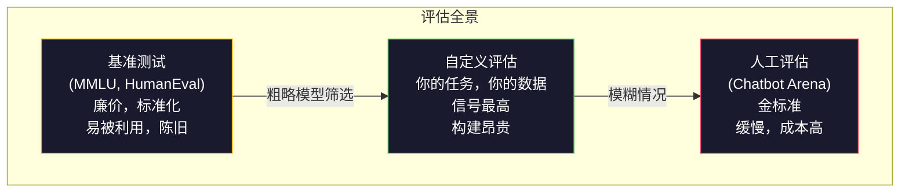
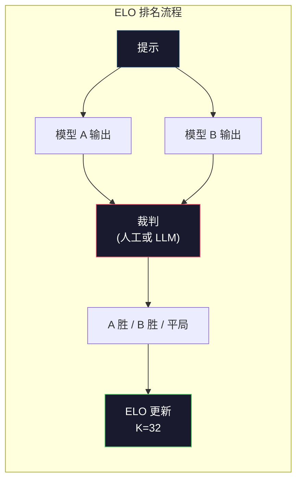

# 评估：基准测试、Evals、LM Harness（语言模型测试框架）

> 古德哈特定律（Goodhart's Law）：当一个度量成为目标时，它就不再是一个好的度量。每个前沿实验室都会利用基准测试玩游戏。MMLU 分数上升，而模型仍然无法可靠地数清“strawberry”中 R 的数量。唯一重要的评估是你的评估——在你的任务上，用你的数据。

**类型：** 构建  
**语言：** Python  
**前置条件：** Phase 10，课程 01-05（从零开始的 LLMs）  
**时间：** 约 90 分钟

## 学习目标

- 构建一个自定义评估框架，用于对语言模型运行多项选择题和开放式基准测试  
- 解释为何标准基准测试（MMLU、HumanEval）会达到饱和且无法区分前沿模型  
- 实现针对特定任务的评估及合适的指标：exact match（精确匹配）、F1、BLEU，以及 LLM-as-judge（语言模型作为裁判）评分  
- 设计一个针对你的具体用例的自定义评估套件，而非仅依赖公共排行榜

## 问题描述

MMLU 于 2020 年发布，涵盖 57 个学科，共 15,908 道题目。三年内，前沿模型对其表现达到饱和。GPT-4 得分 86.4%，Claude 3 Opus 得分 86.8%，Llama 3 405B 得分 88.6%。排行榜集中在 3 分范围内，差异仅为统计噪声，并不代表真实能力差距。

与此同时，这些模型在 10 岁儿童能轻松完成的任务上失败。Claude 3.5 Sonnet 在 MMLU 中得分 88.7%，最初却无法数清“strawberry”中的字母个数——这是个不需要任何世界知识和推理，仅需对字符逐一遍历的任务。HumanEval 用 164 个问题测试代码生成。模型得分超过 90%，但仍然生成会在边缘情况下崩溃的代码，而这些错误即使是初级开发者也能察觉。

基准测试表现与现实可靠性之间的差距是 LLM 评估的核心问题。基准测试告诉你模型在该基准上的表现，几乎无法反映该模型在你的具体任务、你的具体数据、面对你特定失败模式时的表现。如果你构建客服机器人，MMLU 毫无意义。如果你构建代码助手，HumanEval 只涵盖函数级代码生成——它对调试、重构或跨文件代码解释一无所知。

你需要自定义评估。不是因为基准测试没用——它们在粗略模型筛选中仍有用——而是因为最终评估必须完全匹配你的部署条件。

## 概念解析

### 评估全景图

评估有三类，成本和信号质量各异。

**基准测试**是标准化的测试套件。MMLU、HumanEval、SWE-bench、MATH、ARC、HellaSwag。你让模型运行基准，然后得分。优点是：所有人用同一测试，可以横向比较模型。缺点是：模型和训练数据越来越污染这些基准。实验室在训练中包含了基准测试题目。分数提升，但能力不一定提升。

**自定义评估**是你为特定用例构建的测试套件。你定义输入、期望输出和评分函数。法律文档摘要器在法律文档上评估。SQL 生成器在你数据库的 Schema 上评估。此类评估成本较高，但它是预测生产性能的唯一评估。

**人工评估**由付费标注员根据有用性、正确性、流利度和安全性等标准评判模型输出。是自动评分失败时开放式任务的金标准。Chatbot Arena 收集了超过 200 万条人为偏好投票，涵盖 100+ 模型。缺点是成本（每次判断 $0.10-$2.00）和速度（数小时到数天）。



### 基准测试为何失效

基准分数不再反映真实能力有三大机制。

**数据污染。**训练语料抓取互联网，基准测试题目存在于互联网上，模型训练时看到答案。虽不是传统意义上的作弊——实验室不会故意包含基准数据——但大规模抓取几乎不可能排除。

**针对测试优化。**实验室对训练混合进行优化以提升基准表现。如果 5% 的训练数据是 MMLU 风格多选题，模型学习题目格式和答案分布。MMLU 是 4 选 1 问题，模型学到答案大致均匀分布于 A/B/C/D，哪怕不知道答案也能借此提高分数。

**饱和效应。**当所有前沿模型在基准上的得分均为 85%-90% 时，基准失去区分力。剩下的 10%-15% 题目可能模糊、标注错误或需要晦涩领域知识。MMLU 从 87% 提升到 89% 可能意味着模型背诵了两个罕见题目，而非真正变聪明。

### 困惑度（Perplexity）：快速健康检查

困惑度衡量模型对一段词元序列的“惊讶度”。形式上是负对数似然均值的指数：

```text
PPL = exp(-1/N * sum(log P(token_i | context)))
```

困惑度为 10 意味着模型平均在每个词元位置上，如同在 10 个选项中等概率选择。值越低越好。GPT-2 对 WikiText-103 的困惑度约为 30，GPT-3 约为 20，Llama 3 8B 约为 7。

困惑度适合比较模型在同一测试集上的表现，但存在盲点。模型可能在预测常见模式时困惑度低，但在罕见且重要模式上表现糟糕。困惑度也反映不了指令遵从、推理或事实准确性。作为健康检查用，不可作为最终判断。

### LLM 作为裁判（LLM-as-Judge）

用强模型评价弱模型的输出。原理简单：让 GPT-4o 或 Claude Sonnet 对回答进行 1-5 分的正确性、有用性和安全性评分。使用 GPT-4o-mini 费用约 $0.01/次，且与人工评分高度相关——大多数任务约 80% 一致率。

评分提示词比模型本身更关键。模糊提示词（“评价这个回答”）导致评分噪声大。结构化提示词加评分标准（“如果答案事实正确且引用来源得 5 分，正确但无源得 4 分，部分正确得 3 分...”）生成一致且可复现的评分。

失败模式：裁判模型表现出位置偏差（在两回答比较中偏好首个回答）、冗长偏差（偏好更长回答）和自我偏好（GPT-4 对自身输出评分比同等 Claude 输出高）。缓解措施：随机顺序、长度归一化、用与被评估模型不同的裁判。

### 基于两两比较的 ELO 排名

Chatbot Arena 的方法。展示同一提示不同模型的两个回复。人类（或 LLM 裁判）选出更优者。通过数千次比较，为每个模型计算 ELO 分数——即国际象棋使用的排名系统。

ELO 优点：相对排名比绝对得分更可靠，平局处理优雅，且比对每个输出独立评分所需的比较更少。到 2026 年初，Chatbot Arena 排名显示 GPT-4o、Claude 3.5 Sonnet 和 Gemini 1.5 Pro 顶部分差不超过 20 ELO 分。



### 评估框架

**lm-evaluation-harness**（EleutherAI）：标准开源评估框架。支持 200+ 基准测试，一条命令即可对 Hugging Face 上任何模型运行 MMLU、HellaSwag、ARC 等。Open LLM Leaderboard 使用该框架。

**RAGAS**：专门为 RAG（检索增强生成）流水线设计的评估框架。衡量真实性（答案是否与检索上下文匹配）、相关性（检索内容是否与问题相关）及答案正确性。

**promptfoo**：基于配置的提示词工程评估工具。在 YAML 中定义测试用例，针对多模型运行，生成通过/失败报告。适合做提示词回归测试——确保提示改动不会破坏已有测试。

### 构建自定义评估

生产中唯一重要的评估。流程：

1. **定义任务。** 模型具体要做什么？要精确。例如“回答问题”太含糊，“针对客户投诉邮件，提取产品名称、问题类别和情感倾向”则可评估。

2. **创建测试用例。** 原型评估至少 50 条，生产级至少 200 条。每条包含（输入，期望输出）对。包括边界情况：空输入、对抗性输入、模糊输入、其他语言输入。

3. **定义评分规则。** 结构化输出用 exact match（精确匹配）。文本相似性用 BLEU/ROUGE。开放式质量用 LLM-as-judge。抽取任务用 F1。多指标可加权组合。

4. **自动化。** 每次评估都能一键运行，无需人工干预。结果存储格式要能支持时间对比分析。

5. **跟踪趋势。** 单一分数无意义。需关注趋势线。提示更改后分数提升了吗？换模型后分数回落了吗？评估应与提示版本共同管理。

| 评估类型       | 每次判断成本        | 与人工一致率       | 适用场景                 |
|--------------|------------------|------------------|----------------------|
| 精确匹配       | 约 $0            | 100%（适用时）     | 结构化输出，分类          |
| BLEU/ROUGE   | 约 $0            | 约 60%            | 翻译，摘要               |
| LLM 作为裁判   | 约 $0.01         | 约 80%            | 开放式生成               |
| 人工评估       | $0.10-$2.00      | N/A（为金标准）    | 模糊，高风险任务           |

## 构建它

### 第 1 步：最简评估框架

定义核心抽象。评估用例包含输入、期望输出和可选元数据字典。评分器接收预测和参考，返回 0 到 1 之间的评分。

```python
import json
from collections import Counter

class EvalCase:
    def __init__(self, input_text, expected, metadata=None):
        self.input_text = input_text
        self.expected = expected
        self.metadata = metadata or {}

class EvalSuite:
    def __init__(self, name, cases, scorers):
        self.name = name
        self.cases = cases
        self.scorers = scorers

    def run(self, model_fn):
        results = []
        for case in self.cases:
            prediction = model_fn(case.input_text)
            scores = {}
            for scorer_name, scorer_fn in self.scorers.items():
                scores[scorer_name] = scorer_fn(prediction, case.expected)
            results.append({
                "input": case.input_text,
                "expected": case.expected,
                "prediction": prediction,
                "scores": scores,
            })
        return results
```

### 步骤 2：评分函数

构建 exact match（完全匹配）、token F1（词元 F1）和模拟 LLM-as-judge（作为裁判的语言模型）评分器。

```python
def exact_match(prediction, expected):
    return 1.0 if prediction.strip().lower() == expected.strip().lower() else 0.0

def token_f1(prediction, expected):
    pred_tokens = set(prediction.lower().split())
    exp_tokens = set(expected.lower().split())
    if not pred_tokens or not exp_tokens:
        return 0.0
    common = pred_tokens & exp_tokens
    precision = len(common) / len(pred_tokens)
    recall = len(common) / len(exp_tokens)
    if precision + recall == 0:
        return 0.0
    return 2 * (precision * recall) / (precision + recall)

def llm_judge_simulated(prediction, expected):
    pred_words = set(prediction.lower().split())
    exp_words = set(expected.lower().split())
    if not exp_words:
        return 0.0
    overlap = len(pred_words & exp_words) / len(exp_words)
    length_penalty = min(1.0, len(prediction) / max(len(expected), 1))
    return round(overlap * 0.7 + length_penalty * 0.3, 3)
```

### 步骤 3：ELO 评分系统

实现带有 ELO 更新的成对比较。这正是 Chatbot Arena 用来对模型进行排名的系统。

```python
class ELOTracker:
    def __init__(self, k=32, initial_rating=1500):
        self.ratings = {}
        self.k = k
        self.initial_rating = initial_rating
        self.history = []

    def _ensure_player(self, name):
        if name not in self.ratings:
            self.ratings[name] = self.initial_rating

    def expected_score(self, rating_a, rating_b):
        return 1 / (1 + 10 ** ((rating_b - rating_a) / 400))

    def record_match(self, player_a, player_b, outcome):
        self._ensure_player(player_a)
        self._ensure_player(player_b)

        ea = self.expected_score(self.ratings[player_a], self.ratings[player_b])
        eb = 1 - ea

        if outcome == "a":
            sa, sb = 1.0, 0.0
        elif outcome == "b":
            sa, sb = 0.0, 1.0
        else:
            sa, sb = 0.5, 0.5

        self.ratings[player_a] += self.k * (sa - ea)
        self.ratings[player_b] += self.k * (sb - eb)

        self.history.append({
            "a": player_a, "b": player_b,
            "outcome": outcome,
            "rating_a": round(self.ratings[player_a], 1),
            "rating_b": round(self.ratings[player_b], 1),
        })

    def leaderboard(self):
        return sorted(self.ratings.items(), key=lambda x: -x[1])
```

### 步骤 4：困惑度（Perplexity）计算

使用词元概率计算困惑度。实际中你会从模型的 logits（对数几率）获取这些概率。这里我们用概率分布做模拟。

```python
import numpy as np

def perplexity(log_probs):
    if not log_probs:
        return float("inf")
    avg_neg_log_prob = -np.mean(log_probs)
    return float(np.exp(avg_neg_log_prob))

def token_log_probs_simulated(text, model_quality=0.8):
    np.random.seed(hash(text) % 2**31)
    tokens = text.split()
    log_probs = []
    for i, token in enumerate(tokens):
        base_prob = model_quality
        if len(token) > 8:
            base_prob *= 0.6
        if i == 0:
            base_prob *= 0.7
        prob = np.clip(base_prob + np.random.normal(0, 0.1), 0.01, 0.99)
        log_probs.append(float(np.log(prob)))
    return log_probs
```

### 步骤 5：汇总结果

计算评测过程中各项统计汇总：均值、中位数、阈值通过率以及各指标细分。

```python
def summarize_results(results, threshold=0.8):
    all_scores = {}
    for r in results:
        for metric, score in r["scores"].items():
            all_scores.setdefault(metric, []).append(score)

    summary = {}
    for metric, scores in all_scores.items():
        arr = np.array(scores)
        summary[metric] = {
            "mean": round(float(np.mean(arr)), 3),
            "median": round(float(np.median(arr)), 3),
            "std": round(float(np.std(arr)), 3),
            "min": round(float(np.min(arr)), 3),
            "max": round(float(np.max(arr)), 3),
            "pass_rate": round(float(np.mean(arr >= threshold)), 3),
            "n": len(scores),
        }
    return summary

def print_summary(summary, suite_name="Eval"):
    print(f"\n{'=' * 60}")
    print(f"  {suite_name} 汇总")
    print(f"{'=' * 60}")
    for metric, stats in summary.items():
        print(f"\n  {metric}:")
        print(f"    平均值:    {stats['mean']:.3f}")
        print(f"    中位数:    {stats['median']:.3f}")
        print(f"    标准差:    {stats['std']:.3f}")
        print(f"    范围:      [{stats['min']:.3f}, {stats['max']:.3f}]")
        print(f"    通过率:    {stats['pass_rate']:.1%} (阈值 >= 0.8)")
        print(f"    样本数:    {stats['n']}")
```

### 步骤 6：运行完整流水线

将一切串联起来。定义任务，创建测试用例，模拟两个模型，运行评测，通过成对比较计算 ELO 排名，并打印排行榜。

```python
def demo_model_good(prompt):
    responses = {
        "What is the capital of France?": "Paris",
        "What is 2 + 2?": "4",
        "Who wrote Hamlet?": "William Shakespeare",
        "What language is PyTorch written in?": "Python and C++",
        "What is the boiling point of water?": "100 degrees Celsius",
    }
    return responses.get(prompt, "I don't know")

def demo_model_bad(prompt):
    responses = {
        "What is the capital of France?": "Paris is the capital city of France",
        "What is 2 + 2?": "The answer is four",
        "Who wrote Hamlet?": "Shakespeare",
        "What language is PyTorch written in?": "Python",
        "What is the boiling point of water?": "212 Fahrenheit",
    }
    return responses.get(prompt, "Unknown")

cases = [
    EvalCase("What is the capital of France?", "Paris"),
    EvalCase("What is 2 + 2?", "4"),
    EvalCase("Who wrote Hamlet?", "William Shakespeare"),
    EvalCase("What language is PyTorch written in?", "Python and C++"),
    EvalCase("What is the boiling point of water?", "100 degrees Celsius"),
]

suite = EvalSuite(
    name="常识问答",
    cases=cases,
    scorers={
        "exact_match": exact_match,
        "token_f1": token_f1,
        "llm_judge": llm_judge_simulated,
    },
)

results_good = suite.run(demo_model_good)
results_bad = suite.run(demo_model_bad)

print_summary(summarize_results(results_good), "模型 A（简洁）")
print_summary(summarize_results(results_bad), "模型 B（冗长）")
```

“好”模型给出准确答案。“坏”模型给出冗长的复述。exact match 对冗长模型惩罚很重，而 token F1 和 LLM-as-judge 宽容一些。这说明评分标准的选择很重要：同一个模型根据评分方式可能表现非常好或很差。

### 步骤 7：ELO 锦标赛

跨多轮执行模型间成对比较。

```python
elo = ELOTracker(k=32)

for case in cases:
    pred_a = demo_model_good(case.input_text)
    pred_b = demo_model_bad(case.input_text)

    score_a = token_f1(pred_a, case.expected)
    score_b = token_f1(pred_b, case.expected)

    if score_a > score_b:
        outcome = "a"
    elif score_b > score_a:
        outcome = "b"
    else:
        outcome = "tie"

    elo.record_match("model_a_concise", "model_b_verbose", outcome)

print("\nELO 排行榜:")
for name, rating in elo.leaderboard():
    print(f"  {name}: {rating:.0f}")
```

### 步骤 8：困惑度对比

比较不同质量“模型”的困惑度。

```python
test_text = "The quick brown fox jumps over the lazy dog in the garden"

for quality, label in [(0.9, "强力模型"), (0.7, "中等模型"), (0.4, "弱模型")]:
    log_probs = token_log_probs_simulated(test_text, model_quality=quality)
    ppl = perplexity(log_probs)
    print(f"  {label} (质量={quality}): 困惑度 = {ppl:.2f}")
```

## 使用指南

### lm-evaluation-harness（EleutherAI）

任何模型基准测试的标准工具。

```python
# pip install lm-eval
# 命令行：
# lm_eval --model hf --model_args pretrained=meta-llama/Llama-3.1-8B --tasks mmlu --batch_size 8

# Python API：
# import lm_eval
# results = lm_eval.simple_evaluate(
#     model="hf",
#     model_args="pretrained=meta-llama/Llama-3.1-8B",
#     tasks=["mmlu", "hellaswag", "arc_easy"],
#     batch_size=8,
# )
# print(results["results"])
```

### promptfoo

基于配置的 prompt 工程评测。用 YAML 定义测试，针对多个提供商运行。

```yaml
# promptfoo.yaml
providers:
  - openai:gpt-4o-mini
  - anthropic:claude-3-haiku

prompts:
  - "Answer in one word: {{question}}"

tests:
  - vars:
      question: "What is the capital of France?"
    assert:
      - type: contains
        value: "Paris"
  - vars:
      question: "What is 2 + 2?"
    assert:
      - type: equals
        value: "4"
```

### RAGAS 用于 RAG 评估

```python
# pip install ragas
# from ragas import evaluate
# from ragas.metrics import faithfulness, answer_relevancy, context_precision
#
# result = evaluate(
#     dataset,
#     metrics=[faithfulness, answer_relevancy, context_precision],
# )
# print(result)
```

RAGAS 衡量通用评测可能忽略的方面：模型答案是否基于检索的上下文，而不仅仅是答案在抽象上的“正确”。

## 发布

本课输出 `outputs/prompt-eval-designer.md` —— 一个通用的 prompt，用于为任何任务设计自定义评测套件。输入任务描述，它能生成测试用例、评分函数以及通过/失败阈值建议。

同时输出 `outputs/skill-llm-evaluation.md` —— 一套基于任务类型、预算和延迟需求选择合适评测策略的决策框架。

## 练习

1. 添加一个“consistency（一致性）”评分器，对同一输入运行模型 5 次，统计输出匹配的频率。输入确定性强时答案不一致说明提示词脆弱或温度过高。

2. 扩展 ELO 追踪器支持多个裁判函数（exact match、F1、LLM-as-judge）并加权。比较加重 exact match 与加重 F1 时排行榜变化。

3. 构建一个特定任务的评测套件：电子邮件分类为 5 类。创建 100 个多样的测试用例，包括边缘情况（可能多类的邮件、空邮件、其他语言邮件）。评测不同“模型”（基于规则、关键词匹配、模拟 LLM）表现。

4. 实现“数据污染”检测：给定一组评测问题和训练语料库，检查评测问题（或近似改写）在训练数据中的覆盖比例。这是研究人员审计基准有效性的方式。

5. 制作“模型差异”工具。给定两个模型版本的评测结果，突出哪些具体测试用例表现提升、回退或持平。这是评测版的代码差异分析——理解改动效果的关键。

## 重要术语

| 术语           | 俗称               | 实际含义                                                                                 |
|----------------|--------------------|------------------------------------------------------------------------------------------|
| MMLU           | “那个基准”         | Massive Multitask Language Understanding（大规模多任务语言理解）——覆盖 57 个学科的 15,908 道选择题，目标 2025 年超过 88% |
| HumanEval      | “代码评测”         | OpenAI 提供的 164 个 Python 函数补全问题，只测试独立函数生成                             |
| SWE-bench      | “真实编码评测”     | 来自 12 个 Python 仓库的 2,294 个 GitHub issue，测量端到端 Bug 修复，包括测试生成        |
| Perplexity     | “模型困惑程度”     | exp(-avg(log P(token_i 给定上下文)))——越低说明模型对实际词元概率赋值越高                  |
| ELO rating     | “模型棋力排名”     | 通过成对赢输记录计算的相对技能评分，Chatbot Arena 用来排名 100+ 模型                     |
| LLM-as-judge   | “用 AI 评 AI”      | 强模型根据规则评分弱模型输出，人类裁判一致率约 80%，成本约 $0.01/次评分                   |
| Data contamination | “模型见过测试” | 训练数据包含基准测试题，导致得分虚高但能力未实质提升                                  |
| Eval suite     | “一堆测试集合”     | 版本化的(input, expected_output, scorer) 三元组集合，用于测量特定能力                    |
| Pass rate      | “正确率”           | 得分超过阈值的评测用例比例——比均分更能反映可靠性                                     |
| Chatbot Arena  | “模型排名网站”     | LMSYS 平台，集成 200 万+ 人类偏好投票，用 ELO 评分产生最可信的 LLM 排行榜               |

## 深入阅读

- [Hendrycks 等, 2021 -- "Measuring Massive Multitask Language Understanding"](https://arxiv.org/abs/2009.03300) -- MMLU 论文，尽管已趋于饱和，仍是引用最多的 LLM 基准测试
- [Chen 等, 2021 -- "Evaluating Large Language Models Trained on Code"](https://arxiv.org/abs/2107.03374) -- OpenAI 的 HumanEval 论文，建立了代码生成评估方法论
- [Zheng 等, 2023 -- "Judging LLM-as-a-Judge"](https://arxiv.org/abs/2306.05685) -- 系统分析使用 LLMs 评估 LLMs，包括位置偏差和冗长偏差的发现
- [LMSYS Chatbot Arena](https://chat.lmsys.org/) -- 众包模型比较平台，拥有 200万+ 投票，是最受信赖的真实世界 LLM 排名
