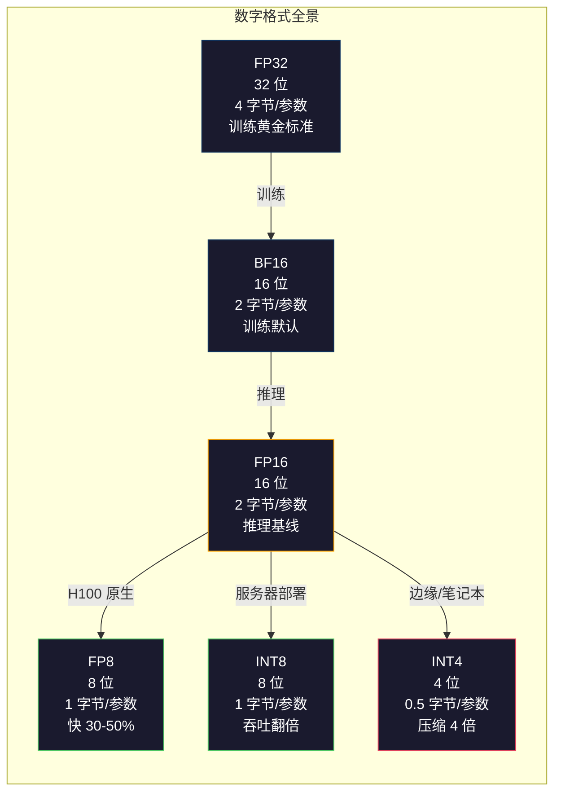
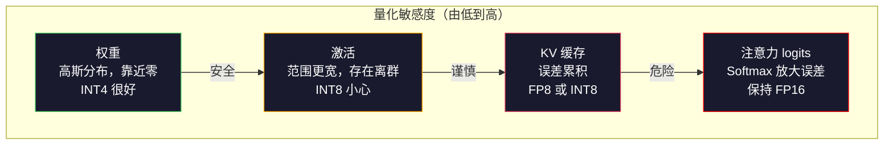
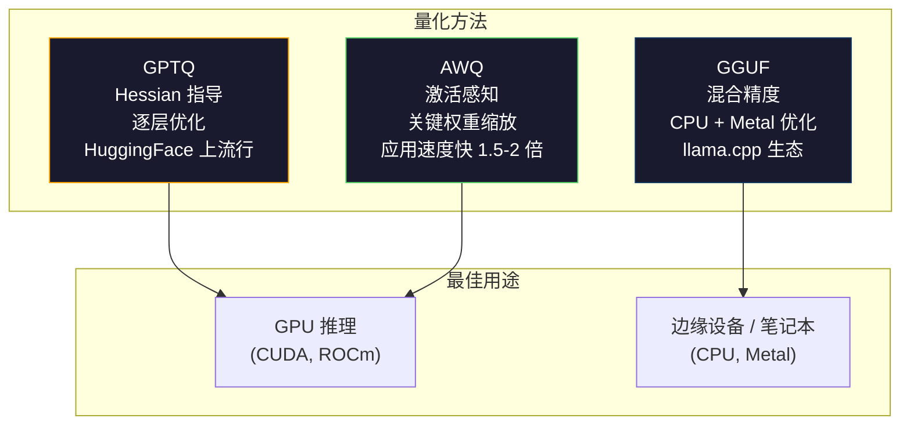

# 量化：让模型适配

> 一个 70B 模型的 FP16 需要 140GB。仅权重就需要两块 A100。量化到 FP8：一块 80GB GPU。INT4：一台 MacBook。

**类型：** 实践项目  
**语言：** Python（含 numpy）  
**前置知识：** 第 10 阶段，第 01-10 课（从零开始的 LLM）  
**时间：** 约 120 分钟

## 学习目标

- 实现从 FP16 到 INT8 和 INT4 的对称与非对称量化，包括按张量和按通道的缩放
- 计算量化所节省的内存，并确定某一精度是否适合给定 GPU 的显存（VRAM）
- 解释后训练量化（PTQ）与量化感知训练（QAT）之间的区别
- 应用 GPTQ 或 AWQ 对真实模型进行量化，并在基准测试上测量精度-内存的权衡

## 问题背景

Llama 3 70B 有 700 亿个参数。每个参数是一个 16 位浮点数。共计 1400 亿字节，即 140GB。单个 A100 只有 80GB 显存。你连权重都无法加载，更别说推理了。要运行这个模型，至少需要两块 2 美元/小时的 A100。

但每个参数用 16 位表示非常浪费。神经网络中的大多数权重都聚集在接近零的位置。FP16 的全动态范围（从 0.000000059 到 65504）几乎完全未被利用。如果你测量 Llama 3 70B 中权重的实际分布，95% 的权重在 -0.1 到 +0.1 之间。你用 16 位表示可以用 4 位表示的值，造成巨大浪费。

量化用低精度数值代替高精度数值。FP16 到 FP8 内存减半，FP16 到 INT4 内存减至四分之一。140GB 的模型变成了 35GB，可以装进一块普通显卡。再推到 2-bit 量化（激进且有损，但某些任务可用），同一个模型可以在 16GB 的笔记本上运行。

代价是精度。每减少一位，就丢失一部分信息。问题是你会损失多少精度以及在哪些部分。一个经过良好量化的 INT4 模型，在大多数基准测试中保持了原始质量的 95%-99%。而一个粗暴的 INT4 量化可能会毁掉模型。区别在于方法。

社区用 GPTQ 对 Llama 3 做的 INT4 量化，在 WikiText 上损失了大约 1-2 个困惑度点。Mistral 发布了 Mixtral 8x22B 的 FP8 检查点，在 MMLU 上几乎没有质量损失。GGUF 格式驱动 llama.cpp，使得 70B 模型可以在搭载 M 系芯片的 MacBook 上运行。量化不是黑科技，而是任何超过 7B 参数模型的标准部署路径。

## 概念介绍

### 数字格式：每个位的作用

每个浮点数有三部分：符号位（sign）、指数（exponent）和尾数（mantissa，也称有效位）。符号位 1 位，指数决定表示范围（数字大小跨度），尾数决定精度（小数点后位数）。

```text
FP32:  [1 符号] [8 指数] [23 尾数]  = 32 位
FP16:  [1 符号] [5 指数] [10 尾数]  = 16 位
BF16:  [1 符号] [8 指数] [7  尾数]  = 16 位
FP8:   [1 符号] [4 指数] [3  尾数]  = 8  位（E4M3）
FP8:   [1 符号] [5 指数] [2  尾数]  = 8  位（E5M2）
INT8:  [1 符号] [7 数值]              = 8  位（均匀步长）
INT4:  [1 符号] [3 数值]              = 4  位（共 16 个量化级别）
```

**FP32** 是全精度。23 位尾数约等于 7 位十进制有效数字。范围大约是 1.2 × 10^-38 到 3.4 × 10^38。训练曾经完全依赖 FP32，至今仍用于累积（矩阵乘法时的累加）。

**FP16** 位数减半。10 位尾数给出约 3.3 位十进制有效数字。指数只剩 5 位，范围大幅缩小（最大大约 65504）。对聚集零附近的权重来说够用了，但对激活和梯度这种训练中可能爆发的值不够安全。FP16 训练需要损失缩放（loss scaling）防止下溢。

**BF16**（Brain Float 16）保留了 FP32 的 8 位指数，尾数缩为 7 位。范围同 FP32，精度不及 FP16。谷歌专为深度学习设计。直观理解是神经网络更需要范围而非精度。FP16 下溢为零的 10^-20 的梯度，在 BF16 可正常表达。BF16 的 0.07342 权重约为 0.0734，足够接近。现代训练基本采用 BF16 或 BF16/FP32 混合。

**FP8** 有两种类型。E4M3（4 位指数，3 位尾数）用于推理中的权重和激活。E5M2（5 位指数，2 位尾数）用于训练中的梯度，强调范围多于精度。H100 GPU 上 FP8 推理比 FP16 快 30-50%，质量损失可忽略。

**INT8** 是整数格式。没有指数，没有尾数。256 个均匀间隔的数值，从 -128 到 127。需要一个缩放因子将浮点权重匹配到此范围。优势是整数运算比浮点运算速度快且更省电。A100 上 INT8 矩阵乘法峰值 624 TOPS，FP16 为 312 TFLOPS。

**INT4** 更进一步，仅有 16 种可能数值。缩放因子非常关键。质量完全依赖于缩放的选择和量化权重的方案。最先进 INT4 方法（GPTQ、AWQ）能够保留超过 95% 的原有模型质量。



### 量化的工作原理

核心操作很简单。对一个浮点张量找到缩放因子，乘上它，四舍五入到最近整数，存储整数和缩放因子。

**量化：**
```text
scale = max(abs(tensor)) / max_int_value
quantized = round(tensor / scale)
```

**反量化：**
```text
reconstructed = quantized * scale
```

对于区间对称的 INT8 量化（-127 到 127）：
```text
scale = max(abs(tensor)) / 127
quantized = clamp(round(tensor / scale), -128, 127)
```

误差就是四舍五入误差。每个数最多误差 `scale / 2`。整层误差取决于权重数量和模型受扰动的敏感度。

**按张量 vs 按通道量化。** 按张量用一个缩放因子量化整体权重矩阵。简单但有损：当某列权重较大，另一列较小时，小值精度大幅受损。按通道为每个输出通道（权重矩阵的行或列）分配缩放因子。开销大（存储 N 个缩放因子），但质量显著提升。所有生产级量化均采用按通道或更细粒度。

**非对称量化** 增加零点偏移：`quantized = round(tensor / scale) + zero_point`。用于分布不以零为中心的情况。例如 ReLU 激活恒为非负数。对称量化浪费了整数范围的一半来表示没出现的负数。非对称量化将实际范围 [min, max] 映射到整个整数范围。

### 敏感度层级

模型中不同部分对量化容忍度不同，存在明确层级。

**权重（最稳健）。** 权重训练时变化缓慢，近似服从均值为零的高斯分布。易于量化。带按通道比例尺的 INT8 权重几乎无损。INT4 需要更复杂方法，但也可行。

**激活（中等敏感）。** 激活是推理过程中传递的中间值。比权重动态范围大，存在离群值。单个注意力头激活或许比均值大 100 倍。离群值对模型质量至关重要。粗暴量化破坏信息。解决方案包括高精度保存离群通道（如 LLM.int8()），或基于每个 Token 或通道的激活缩放。

**KV 缓存（高度敏感）。** 键值缓存保存已计算的注意力状态。长上下文时，KV 缓存占显存主导。70B 模型 32K 上下文长度时，FP16 的 KV 缓存就有 40GB。量化 KV 缓存为 FP8 或 INT8 可节省大量内存，但误差会在未来所有注意力计算中累积。误差影响随序列长度增长。

**注意力 logits（最敏感）。** 注意力的 softmax 对输入值的小变动极其敏感。一个 0.01 的前 softmax logit 量化误差，就能显著改变注意力分布。大多数量化方案保持注意力计算的高精度（FP16 或 BF16），即便其它部分量化。



### PTQ 与 QAT

**后训练量化（PTQ）** 对已训练好的模型量化，无需再训练。将 FP16 权重计算缩放因子，四舍五入，部署。快速（几分钟到几小时），成本低。适用于 INT8 和 FP8。对 INT4，粗暴 PTQ 容易失败因为四舍五入误差积累。高级 PTQ 方法（GPTQ、AWQ）利用校准数据最大限度减少量化误差。

**量化感知训练（QAT）** 在训练时插入伪量化操作。模型学会调整权重以减小量化误差。梯度通过伪量化使用直通估计器（STE）传递：假设四舍五入操作的梯度为 1。QAT 在 INT4 和 INT2 方面优于 PTQ，但需要完整训练过程。谷歌用于 Gemini 高效部署，Meta 用于部分 Llama 目标。

| 方面 | PTQ | QAT |
|--------|-----|-----|
| 成本 | 几分钟到几小时 | 完整训练流程 |
| INT8 质量 | 极佳（<0.1% 损失） | 极佳 |
| INT4 质量 | GPTQ/AWQ 可达 1-3% 损失 | 更好（<1% 损失） |
| INT2 质量 | 差 | 部分任务可用 |
| 校准数据 | 128-1024 样本 | 全训练数据 |
| 适用场景 | 部署、迭代 | 低位宽最大质量 |

### GPTQ, AWQ, GGUF

**GPTQ（GPT 量化）** 是一种一次性 PTQ（后训练量化）方法。它逐层量化权重，使用一个小型校准数据集（通常128个样本）来测量 Hessian（赫塞矩阵，关于输出对每个权重敏感性的二阶信息）。Hessian 指出重要的权重会被更谨慎地量化。GPTQ 是第一个使 INT4 量化对大型语言模型实用的方法。Hugging Face 上的 TheBloke 通过发布数百个模型的量化版本普及了 GPTQ。

**AWQ（Activation-Aware Weight Quantization，激活感知权重量化）** 观察到只有很小一部分权重（约1%）异常重要，因为它们与大的激活值相乘。AWQ 使用校准数据识别这些关键权重，并在量化前将它们放大（随后相应地缩小激活值），这使得重要权重的数值范围更利于 INT4 量化的精度。AWQ 通常与或略优于 GPTQ 的质量持平，同时应用速度快 1.5-2 倍。

**GGUF（GPT-Generated Unified Format，GPT 生成统一格式）** 是 llama.cpp 及其生态系统使用的文件格式。它支持混合量化：不同层使用不同位宽。首尾层（嵌入层和输出头）通常保持较高精度，中间层使用 INT4 或 INT3。GGUF 文件自包含：权重、分词器、元数据全部在一个文件中。该格式专为 CPU 推理和 Apple Silicon 优化，加载整个模型到内存并在 CPU 或 Metal GPU 上运行矩阵乘法是标准路径。Q4_K_M 是最流行的 GGUF 量化变体，平衡了质量和体积。



### 质量测量

如何判断你的量化模型仍然优质？

**困惑度（Perplexity）。** 最常用的指标。数值越低越好。在一个保留的测试数据集（WikiText-2 是标准）上计算原始模型和量化模型的困惑度。差值代表量化造成的信息损失。经验规律：差值<0.5 非常好，0.5-1.0 良好，1.0-2.0 对多数任务可接受，超过2.0表示出现严重问题。

**特定任务基准测试。** 用量化模型跑 MMLU、HumanEval、GSM8K 或自定义评测套件。与原始模型对比。量化对不同能力影响不同，数学和编程任务对精度损失更敏感，比起一般知识任务。

**输出对比。** 对相同提示分别生成输出并比较。使用 LLM 作为判官（第10课）非常有效。计算胜率：量化模型在多少比例提示上与原模型持平或更优。

**延迟和吞吐量。** 量化的目的就是让模型更快更省钱。测量每秒生成的 token 数、首 token 时间、内存使用。量化后效率比原模型更差就毫无意义。

| 模型 | 格式 | 体积 | 困惑度 (WikiText-2) | MMLU | 令牌/秒 (A100) |
|-------|--------|------|------------------------|------|-------------------|
| Llama 3 70B | FP16 | 140GB | 3.12 | 79.5% | 38 |
| Llama 3 70B | FP8 | 70GB | 3.14 | 79.3% | 55 |
| Llama 3 70B | GPTQ INT4 | 35GB | 4.32 | 77.8% | 72 |
| Llama 3 70B | AWQ INT4 | 35GB | 4.18 | 78.1% | 75 |
| Llama 3 70B | GGUF Q4_K_M | 40GB | 4.25 | 77.9% | 28 (CPU) |

规律：FP8 几乎无代价。INT4 损失 1-2 个 MMLU 分数，但吞吐量翻倍，内存减小四分之一。对于几乎所有部署都值得权衡。

### 实际数据

FP16 到 FP8（H100）：推理速度提升30-50%，质量损失<0.1%。这是毫无疑问的轻松量化。所有 H100 部署都应使用。

FP16 到 INT8（LLM.int8()）：内存减半，质量损失<0.5%。混合精度方法保持异常值特征为 FP16，其余转为 INT8。

FP16 到 INT4（GPTQ/AWQ）：内存减四分之三，质量损失取决于模型与方法，1-3%。单块48GB显卡即可运行70B模型。

FP16 到 INT4（GGUF Q4_K_M）：内存减3.5倍，质量损失1-2%。优化 CPU 推理。70B 模型 Q4_K_M 约40GB，M3 Max 64GB 上运行速度约 10-15 令牌/秒。

FP16 到 INT2：内存减8倍，质量损失5-15%。仅适合可容忍精度下降的特定窄领域任务。研究前沿，非通用生产级。

## 实现步骤

### 第1步：数值格式表示

构建每种格式的位级表示，精确观察符号、指数和尾数的位分布。

```python
import numpy as np


def float_to_fp32_bits(value):
    bits = np.float32(value).view(np.uint32)
    sign = (bits >> 31) & 1
    exponent = (bits >> 23) & 0xFF
    mantissa = bits & 0x7FFFFF
    return {"sign": int(sign), "exponent": int(exponent), "mantissa": int(mantissa),
            "exponent_bits": format(int(exponent), '08b'),
            "mantissa_bits": format(int(mantissa), '023b'),
            "value": float(value),
            "actual_exponent": int(exponent) - 127}


def float_to_fp16_bits(value):
    fp16 = np.float16(value)
    bits = fp16.view(np.uint16)
    sign = (bits >> 15) & 1
    exponent = (bits >> 10) & 0x1F
    mantissa = bits & 0x3FF
    return {"sign": int(sign), "exponent": int(exponent), "mantissa": int(mantissa),
            "exponent_bits": format(int(exponent), '05b'),
            "mantissa_bits": format(int(mantissa), '010b'),
            "value": float(fp16),
            "actual_exponent": int(exponent) - 15}


def float_to_bf16_bits(value):
    fp32_bits = np.float32(value).view(np.uint32)
    bf16_bits = (fp32_bits >> 16).astype(np.uint16)
    sign = (bf16_bits >> 15) & 1
    exponent = (bf16_bits >> 7) & 0xFF
    mantissa = bf16_bits & 0x7F
    reconstructed = np.uint32(bf16_bits.astype(np.uint32) << 16).view(np.float32)
    return {"sign": int(sign), "exponent": int(exponent), "mantissa": int(mantissa),
            "exponent_bits": format(int(exponent), '08b'),
            "mantissa_bits": format(int(mantissa), '07b'),
            "value": float(reconstructed),
            "actual_exponent": int(exponent) - 127}


def simulate_fp8_e4m3(value):
    sign = 1 if value < 0 else 0
    abs_val = abs(value)
    max_val = 448.0
    abs_val = min(abs_val, max_val)
    if abs_val == 0:
        return {"sign": sign, "exponent": 0, "mantissa": 0, "value": 0.0,
                "exponent_bits": "0000", "mantissa_bits": "000"}
    exp = int(np.floor(np.log2(abs_val)))
    exp = max(-6, min(8, exp))
    mantissa_val = abs_val / (2.0 ** exp) - 1.0
    mantissa_quant = round(mantissa_val * 8) / 8
    mantissa_quant = max(0, min(0.875, mantissa_quant))
    reconstructed = (1.0 + mantissa_quant) * (2.0 ** exp)
    if sign:
        reconstructed = -reconstructed
    mantissa_int = int(round(mantissa_quant * 8))
    return {"sign": sign, "exponent": exp + 7, "mantissa": mantissa_int,
            "exponent_bits": format(exp + 7, '04b'),
            "mantissa_bits": format(mantissa_int, '03b'),
            "value": float(reconstructed),
            "actual_exponent": exp}


def display_format_comparison(value):
    fp32 = float_to_fp32_bits(value)
    fp16 = float_to_fp16_bits(value)
    bf16 = float_to_bf16_bits(value)
    fp8 = simulate_fp8_e4m3(value)

    print(f"\n  Value: {value}")
    print(f"  {'Format':<8} {'Stored Value':>14} {'Error':>12} {'Sign':>5} {'Exp Bits':>10} {'Man Bits':>25}")
    print(f"  {'-'*76}")
    print(f"  {'FP32':<8} {fp32['value']:>14.6f} {abs(fp32['value'] - value):>12.8f} {fp32['sign']:>5} {fp32['exponent_bits']:>10} {fp32['mantissa_bits']:>25}")
    print(f"  {'FP16':<8} {fp16['value']:>14.6f} {abs(fp16['value'] - value):>12.8f} {fp16['sign']:>5} {fp16['exponent_bits']:>10} {fp16['mantissa_bits']:>25}")
    print(f"  {'BF16':<8} {bf16['value']:>14.6f} {abs(bf16['value'] - value):>12.8f} {bf16['sign']:>5} {bf16['exponent_bits']:>10} {bf16['mantissa_bits']:>25}")
    print(f"  {'FP8e4m3':<8} {fp8['value']:>14.6f} {abs(fp8['value'] - value):>12.8f} {fp8['sign']:>5} {fp8['exponent_bits']:>10} {fp8['mantissa_bits']:>25}")
```

### 第2步：对称量化（Per-Tensor 和 Per-Channel）

基本的量化操作。Per-tensor（每张量）用一个比例因子作用于整个矩阵。Per-channel（每通道）对每行或每列分别使用一个比例因子。

```python
def quantize_symmetric(tensor, num_bits=8):
    qmin = -(2 ** (num_bits - 1))
    qmax = 2 ** (num_bits - 1) - 1
    abs_max = np.max(np.abs(tensor))
    if abs_max == 0:
        return np.zeros_like(tensor, dtype=np.int32), 1.0
    scale = abs_max / qmax
    quantized = np.clip(np.round(tensor / scale), qmin, qmax).astype(np.int32)
    return quantized, float(scale)


def dequantize_symmetric(quantized, scale):
    return quantized.astype(np.float64) * scale


def quantize_per_channel(tensor, num_bits=8, axis=0):
    qmin = -(2 ** (num_bits - 1))
    qmax = 2 ** (num_bits - 1) - 1

    if axis == 0:
        abs_max = np.max(np.abs(tensor), axis=1, keepdims=True)
    else:
        abs_max = np.max(np.abs(tensor), axis=0, keepdims=True)

    abs_max = np.where(abs_max == 0, 1.0, abs_max)
    scales = abs_max / qmax
    quantized = np.clip(np.round(tensor / scales), qmin, qmax).astype(np.int32)
    return quantized, scales.squeeze()


def dequantize_per_channel(quantized, scales, axis=0):
    if axis == 0:
        return quantized.astype(np.float64) * scales.reshape(-1, 1)
    else:
        return quantized.astype(np.float64) * scales.reshape(1, -1)


def quantize_asymmetric(tensor, num_bits=8):
    qmin = 0
    qmax = 2 ** num_bits - 1
    t_min = np.min(tensor)
    t_max = np.max(tensor)
    if t_max == t_min:
        return np.zeros_like(tensor, dtype=np.int32), 1.0, 0
    scale = (t_max - t_min) / (qmax - qmin)
    zero_point = int(np.round(qmin - t_min / scale))
    zero_point = max(qmin, min(qmax, zero_point))
    quantized = np.clip(np.round(tensor / scale + zero_point), qmin, qmax).astype(np.int32)
    return quantized, float(scale), int(zero_point)


def dequantize_asymmetric(quantized, scale, zero_point):
    return (quantized.astype(np.float64) - zero_point) * scale
```

### 第3步：质量测量

测量量化造成的信息损失。均方误差（MSE）、信噪比（SNR）和原始张量与重构张量的余弦相似度。

```python
def quantization_error(original, reconstructed):
    diff = original - reconstructed
    mse = float(np.mean(diff ** 2))
    rmse = float(np.sqrt(mse))
    max_error = float(np.max(np.abs(diff)))
    signal_power = float(np.mean(original ** 2))
    snr_db = 10 * np.log10(signal_power / max(mse, 1e-20))

    orig_flat = original.flatten()
    recon_flat = reconstructed.flatten()
    norm_orig = np.linalg.norm(orig_flat)
    norm_recon = np.linalg.norm(recon_flat)
    if norm_orig == 0 or norm_recon == 0:
        cosine_sim = 0.0
    else:
        cosine_sim = float(np.dot(orig_flat, recon_flat) / (norm_orig * norm_recon))

    return {"mse": mse, "rmse": rmse, "max_error": max_error,
            "snr_db": float(snr_db), "cosine_similarity": cosine_sim}


def compare_quantization_methods(tensor, num_bits=8):
    q_pt, s_pt = quantize_symmetric(tensor, num_bits)
    recon_pt = dequantize_symmetric(q_pt, s_pt)
    err_pt = quantization_error(tensor, recon_pt)

    q_pc, s_pc = quantize_per_channel(tensor, num_bits, axis=0)
    recon_pc = dequantize_per_channel(q_pc, s_pc, axis=0)
    err_pc = quantization_error(tensor, recon_pc)

    q_asym, s_asym, zp = quantize_asymmetric(tensor, num_bits)
    recon_asym = dequantize_asymmetric(q_asym, s_asym, zp)
    err_asym = quantization_error(tensor, recon_asym)

    print(f"\n  量化比较 ({num_bits}-bit, 张量形状 {tensor.shape}):")
    print(f"  {'方法':<20} {'MSE':>12} {'信噪比 (dB)':>10} {'余弦相似度':>12} {'最大误差':>12}")
    print(f"  {'-'*68}")
    print(f"  {'逐张量对称':<20} {err_pt['mse']:>12.8f} {err_pt['snr_db']:>10.2f} {err_pt['cosine_similarity']:>12.8f} {err_pt['max_error']:>12.8f}")
    print(f"  {'逐通道对称':<20} {err_pc['mse']:>12.8f} {err_pc['snr_db']:>10.2f} {err_pc['cosine_similarity']:>12.8f} {err_pc['max_error']:>12.8f}")
    print(f"  {'非对称':<20} {err_asym['mse']:>12.8f} {err_asym['snr_db']:>10.2f} {err_asym['cosine_similarity']:>12.8f} {err_asym['max_error']:>12.8f}")

    return {"per_tensor": err_pt, "per_channel": err_pc, "asymmetric": err_asym}
```

### 第4步：位宽扫描

对同一张量在不同位宽（2，3，4，8，16）下进行量化，并测量每个级别的质量。这可以准确显示质量的陡降点。

```python
def bit_width_sweep(tensor):
    print(f"\n  位宽扫描（张量形状 {tensor.shape}）:")
    print(f"  {'Bits':>6} {'Levels':>8} {'MSE':>14} {'SNR (dB)':>10} {'Cosine Sim':>12} {'Compression':>12}")
    print(f"  {'-'*64}")

    results = []
    for bits in [2, 3, 4, 8, 16]:
        q, s = quantize_per_channel(tensor, bits, axis=0)
        recon = dequantize_per_channel(q, s, axis=0)
        err = quantization_error(tensor, recon)
        levels = 2 ** bits
        compression = 32.0 / bits

        print(f"  {bits:>6} {levels:>8} {err['mse']:>14.8f} {err['snr_db']:>10.2f} {err['cosine_similarity']:>12.8f} {compression:>11.1f}x")
        results.append({"bits": bits, "levels": levels, "error": err, "compression": compression})

    return results
```

### 第5步：敏感性实验

模拟对 Transformer（Transformer 架构）不同部分进行量化，测量哪些组件最敏感。该实验展示了敏感性层次：权重 < 激活值 < KV cache（键值缓存） < attention（注意力）。

```python
def simulate_transformer_layer(input_data, weights, kv_scale=1.0):
    hidden = input_data @ weights["qkv"]
    seq_len = hidden.shape[1]
    d_model = weights["qkv"].shape[1] // 3
    q, k, v = hidden[:, :, :d_model], hidden[:, :, d_model:2*d_model], hidden[:, :, 2*d_model:]

    attn_scores = (q @ k.transpose(0, 2, 1)) / np.sqrt(d_model) * kv_scale
    attn_max = np.max(attn_scores, axis=-1, keepdims=True)
    attn_exp = np.exp(attn_scores - attn_max)
    attn_weights = attn_exp / np.sum(attn_exp, axis=-1, keepdims=True)

    attn_output = attn_weights @ v
    output = attn_output @ weights["out"]
    return output, {"q": q, "k": k, "v": v, "attn_scores": attn_scores,
                    "attn_weights": attn_weights, "attn_output": attn_output}


def sensitivity_experiment(batch_size=2, seq_len=16, d_model=64, num_bits=8):
    np.random.seed(42)
    input_data = np.random.randn(batch_size, seq_len, d_model) * 0.1

    weights = {
        "qkv": np.random.randn(d_model, 3 * d_model) * (2.0 / d_model) ** 0.5,
        "out": np.random.randn(d_model, d_model) * (2.0 / d_model) ** 0.5,
    }

    baseline_output, baseline_internals = simulate_transformer_layer(input_data, weights)

    experiments = {}

    q_qkv, s_qkv = quantize_per_channel(weights["qkv"], num_bits, axis=0)
    q_out, s_out = quantize_per_channel(weights["out"], num_bits, axis=0)
    quantized_weights = {
        "qkv": dequantize_per_channel(q_qkv, s_qkv, axis=0),
        "out": dequantize_per_channel(q_out, s_out, axis=0),
    }
    weight_quant_output, _ = simulate_transformer_layer(input_data, quantized_weights)
    experiments["Weights only"] = quantization_error(baseline_output, weight_quant_output)

    _, fresh_internals = simulate_transformer_layer(input_data, weights)
    q_act, s_act = quantize_per_channel(
        fresh_internals["attn_output"].reshape(-1, d_model), num_bits, axis=0
    )
    quant_attn_out = dequantize_per_channel(q_act, s_act, axis=0).reshape(batch_size, seq_len, d_model)
    act_quant_output = quant_attn_out @ weights["out"]
    experiments["Activations only"] = quantization_error(baseline_output, act_quant_output)

    q_k, s_k = quantize_per_channel(fresh_internals["k"].reshape(-1, d_model), num_bits, axis=0)
    q_v, s_v = quantize_per_channel(fresh_internals["v"].reshape(-1, d_model), num_bits, axis=0)
    quant_k = dequantize_per_channel(q_k, s_k, axis=0).reshape(batch_size, seq_len, d_model)
    quant_v = dequantize_per_channel(q_v, s_v, axis=0).reshape(batch_size, seq_len, d_model)
    attn_scores_kv = (fresh_internals["q"] @ quant_k.transpose(0, 2, 1)) / np.sqrt(d_model)
    attn_max_kv = np.max(attn_scores_kv, axis=-1, keepdims=True)
    attn_exp_kv = np.exp(attn_scores_kv - attn_max_kv)
    attn_weights_kv = attn_exp_kv / np.sum(attn_exp_kv, axis=-1, keepdims=True)
    kv_quant_output = (attn_weights_kv @ quant_v) @ weights["out"]
    experiments["KV cache only"] = quantization_error(baseline_output, kv_quant_output)

    noise_scale = np.std(fresh_internals["attn_scores"]) * 0.05
    noisy_scores = fresh_internals["attn_scores"] + np.random.randn(*fresh_internals["attn_scores"].shape) * noise_scale
    noisy_max = np.max(noisy_scores, axis=-1, keepdims=True)
    noisy_exp = np.exp(noisy_scores - noisy_max)
    noisy_weights = noisy_exp / np.sum(noisy_exp, axis=-1, keepdims=True)
    attn_quant_output = (noisy_weights @ fresh_internals["v"]) @ weights["out"]
    experiments["Attention logits (5% noise)"] = quantization_error(baseline_output, attn_quant_output)

    print(f"\n  敏感性实验（{num_bits}位量化）:")
    print(f"  {'组件':<30} {'MSE':>14} {'SNR (dB)':>10} {'余弦相似度':>12}")
    print(f"  {'-'*68}")
    for name, err in sorted(experiments.items(), key=lambda x: x[1]["mse"]):
        print(f"  {name:<30} {err['mse']:>14.8f} {err['snr_db']:>10.2f} {err['cosine_similarity']:>12.8f}")

    return experiments
```

### 第6步：模拟 GPTQ

GPTQ（一列一列地量化）使用 Hessian（海森矩阵）决定如何分配舍入误差。这是一个简化版本，抓住了核心思想：使用校准数据测量权重重要性，然后对不重要的权重更激进地量化。

```python
def simulated_gptq(weight_matrix, calibration_inputs, num_bits=4):
    n_in, n_out = weight_matrix.shape
    qmin = -(2 ** (num_bits - 1))
    qmax = 2 ** (num_bits - 1) - 1

    H = np.zeros((n_in, n_in))
    for x in calibration_inputs:
        x = x.reshape(-1, 1) if x.ndim == 1 else x
        for row in range(x.shape[0]):
            xi = x[row].reshape(-1, 1)
            H += xi @ xi.T
    H /= len(calibration_inputs)
    H += np.eye(n_in) * 1e-4

    weight_importance = np.diag(H)

    quantized = np.zeros_like(weight_matrix, dtype=np.int32)
    scales = np.zeros(n_out)
    errors = np.zeros(n_out)

    W = weight_matrix.copy()

    for col in range(n_out):
        w_col = W[:, col]
        abs_max = np.max(np.abs(w_col))
        if abs_max == 0:
            scales[col] = 1.0
            continue
        scale = abs_max / qmax
        scales[col] = scale

        q_col = np.clip(np.round(w_col / scale), qmin, qmax).astype(np.int32)
        quantized[:, col] = q_col

        quant_error = w_col - q_col * scale
        errors[col] = np.sqrt(np.mean(quant_error ** 2))

        if col < n_out - 1:
            importance_weights = weight_importance / (np.max(weight_importance) + 1e-10)
            for next_col in range(col + 1, min(col + 4, n_out)):
                compensation = quant_error * importance_weights * 0.1
                W[:, next_col] += compensation

    return quantized, scales, {"column_errors": errors,
                               "mean_error": float(np.mean(errors)),
                               "max_error": float(np.max(errors))}


def dequantize_gptq(quantized, scales):
    result = np.zeros_like(quantized, dtype=np.float64)
    for col in range(quantized.shape[1]):
        result[:, col] = quantized[:, col] * scales[col]
    return result
```

### 第7步：AWQ 模拟

AWQ（Activation-aware Weight Quantization）识别重要权重（与大激活值相乘的权重），并通过缩放保护它们，避免在量化时损失过大。

```python
def simulated_awq(weight_matrix, calibration_inputs, num_bits=4, salient_fraction=0.01):
    n_in, n_out = weight_matrix.shape
    qmin = -(2 ** (num_bits - 1))
    qmax = 2 ** (num_bits - 1) - 1

    activation_magnitudes = np.zeros(n_in)
    for x in calibration_inputs:
        if x.ndim == 1:
            activation_magnitudes += np.abs(x)
        else:
            activation_magnitudes += np.mean(np.abs(x), axis=0)
    activation_magnitudes /= len(calibration_inputs)

    n_salient = max(1, int(n_in * salient_fraction))
    salient_indices = np.argsort(activation_magnitudes)[-n_salient:]

    scale_factors = np.ones(n_in)
    for idx in salient_indices:
        col_max = np.max(np.abs(weight_matrix[idx, :]))
        if col_max > 0:
            scale_factors[idx] = min(4.0, 1.0 / (col_max + 1e-8) * np.mean(np.abs(weight_matrix)))

    scaled_weights = weight_matrix * scale_factors.reshape(-1, 1)

    quantized, scales = quantize_per_channel(scaled_weights, num_bits, axis=0)
    dequantized = dequantize_per_channel(quantized, scales, axis=0)

    result = dequantized / scale_factors.reshape(-1, 1)

    err = quantization_error(weight_matrix, result)

    return result, {"salient_indices": salient_indices,
                    "scale_factors": scale_factors[salient_indices],
                    "error": err,
                    "n_salient": n_salient}
```

### 第8步：完整流程

将所有步骤串联起来。比较朴素量化、逐通道量化、GPTQ 和 AWQ 在同一权重矩阵上的表现。

```python
def full_quantization_comparison(d_in=256, d_out=512, num_bits=4, n_calibration=32):
    np.random.seed(42)

    weight = np.random.randn(d_in, d_out) * 0.02
    outlier_rows = np.random.choice(d_in, size=5, replace=False)
    weight[outlier_rows] *= 10

    calibration = [np.random.randn(8, d_in) * 0.1 for _ in range(n_calibration)]

    q_naive, s_naive = quantize_symmetric(weight, num_bits)
    recon_naive = dequantize_symmetric(q_naive, s_naive)
    err_naive = quantization_error(weight, recon_naive)

    q_pc, s_pc = quantize_per_channel(weight, num_bits, axis=0)
    recon_pc = dequantize_per_channel(q_pc, s_pc, axis=0)
    err_pc = quantization_error(weight, recon_pc)

    q_gptq, s_gptq, gptq_info = simulated_gptq(weight, calibration, num_bits)
    recon_gptq = dequantize_gptq(q_gptq, s_gptq)
    err_gptq = quantization_error(weight, recon_gptq)

    recon_awq, awq_info = simulated_awq(weight, calibration, num_bits)
    err_awq = awq_info["error"]

    print(f"\n  全面量化比较（{num_bits}位, {d_in}x{d_out} 矩阵）")
    print(f"  矩阵包含 {len(outlier_rows)} 个异常行（放大10倍）")
    print()
    print(f"  {'方法':<20} {'MSE':>14} {'SNR (dB)':>10} {'余弦相似度':>12}")
    print(f"  {'-'*58}")
    print(f"  {'朴素逐张量':<20} {err_naive['mse']:>14.8f} {err_naive['snr_db']:>10.2f} {err_naive['cosine_similarity']:>12.8f}")
    print(f"  {'逐通道':<20} {err_pc['mse']:>14.8f} {err_pc['snr_db']:>10.2f} {err_pc['cosine_similarity']:>12.8f}")
    print(f"  {'模拟 GPTQ':<20} {err_gptq['mse']:>14.8f} {err_gptq['snr_db']:>10.2f} {err_gptq['cosine_similarity']:>12.8f}")
    print(f"  {'模拟 AWQ':<20} {err_awq['mse']:>14.8f} {err_awq['snr_db']:>10.2f} {err_awq['cosine_similarity']:>12.8f}")

    test_input = np.random.randn(4, d_in) * 0.1
    baseline = test_input @ weight
    output_naive = test_input @ recon_naive
    output_pc = test_input @ recon_pc
    output_gptq = test_input @ recon_gptq
    output_awq = test_input @ recon_awq

    print(f"\n  端到端输出误差（与测试输入的矩阵乘法）:")
    print(f"  {'方法':<20} {'输出MSE':>14} {'输出余弦相似度':>14}")
    print(f"  {'-'*50}")
    for name, output in [("Naive", output_naive), ("Per-channel", output_pc),
                          ("GPTQ", output_gptq), ("AWQ", output_awq)]:
        out_err = quantization_error(baseline, output)
        print(f"  {name:<20} {out_err['mse']:>14.8f} {out_err['cosine_similarity']:>14.8f}")

    return {"naive": err_naive, "per_channel": err_pc, "gptq": err_gptq, "awq": err_awq}


def memory_calculator(num_params_billions, bits_per_param):
    bytes_per_param = bits_per_param / 8
    total_bytes = num_params_billions * 1e9 * bytes_per_param
    total_gb = total_bytes / (1024 ** 3)
    return total_gb


def print_memory_table():
    print("\n  按模型和精度计算的内存需求:")
    print(f"  {'模型':<15} {'FP32':>8} {'FP16':>8} {'FP8':>8} {'INT8':>8} {'INT4':>8} {'INT2':>8}")
    print(f"  {'-'*64}")
    for name, params in [("7B", 7), ("13B", 13), ("34B", 34), ("70B", 70), ("405B", 405)]:
        fp32 = memory_calculator(params, 32)
        fp16 = memory_calculator(params, 16)
        fp8 = memory_calculator(params, 8)
        int8 = memory_calculator(params, 8)
        int4 = memory_calculator(params, 4)
        int2 = memory_calculator(params, 2)
        print(f"  {name:<15} {fp32:>7.1f}G {fp16:>7.1f}G {fp8:>7.1f}G {int8:>7.1f}G {int4:>7.1f}G {int2:>7.1f}G")


if __name__ == "__main__":
    np.random.seed(42)

    print("=" * 70)
    print("量化：让模型适配")
    print("=" * 70)

    print("\n第1步：数值格式比较")
    print("-" * 50)
    for val in [0.1, 3.14159, -0.00073, 42.5, 0.0000012]:
        display_format_comparison(val)

    print("\n\n第2步：内存需求")
    print("-" * 50)
    print_memory_table()

    print("\n\n第3步：量化方法比较")
    print("-" * 50)
    weight_matrix = np.random.randn(128, 256) * 0.02
    weight_matrix[0] *= 15
    weight_matrix[42] *= 8
    compare_quantization_methods(weight_matrix, num_bits=8)
    compare_quantization_methods(weight_matrix, num_bits=4)

    print("\n\n第4步：位宽扫描")
    print("-" * 50)
    sweep_tensor = np.random.randn(64, 128) * 0.05
    bit_width_sweep(sweep_tensor)

    print("\n\n第5步：敏感性实验")
    print("-" * 50)
    print("\n  INT8:")
    sensitivity_experiment(num_bits=8)
    print("\n  INT4:")
    sensitivity_experiment(num_bits=4)

    print("\n\n第6步：GPTQ vs AWQ vs 朴素（INT4）")
    print("-" * 50)
    full_quantization_comparison(d_in=256, d_out=512, num_bits=4)

    print("\n\n第7步：分布分析")
    print("-" * 50)
    np.random.seed(0)
    simulated_weights = np.random.randn(1000) * 0.02
    abs_vals = np.abs(simulated_weights)
    pct_in_range = np.mean(abs_vals < 0.1) * 100
    print(f"\n  模拟权重分布（1000个参数，标准差0.02）:")
    print(f"  权重位于[-0.1, 0.1]区间的比例: {pct_in_range:.1f}%")
    print(f"  权重位于[-0.05, 0.05]区间的比例: {np.mean(abs_vals < 0.05) * 100:.1f}%")
    print(f"  权重位于[-0.01, 0.01]区间的比例: {np.mean(abs_vals < 0.01) * 100:.1f}%")
    print(f"  最大绝对值: {np.max(abs_vals):.6f}")
    print(f"  平均绝对值: {np.mean(abs_vals):.6f}")

    histogram = np.histogram(simulated_weights, bins=20)
    print(f"\n  权重直方图:")
    max_count = max(histogram[0])
    for i in range(len(histogram[0])):
        bar_len = int(histogram[0][i] / max_count * 40)
        lo = histogram[1][i]
        hi = histogram[1][i + 1]
        print(f"  [{lo:>7.4f}, {hi:>7.4f}] {'#' * bar_len} ({histogram[0][i]})")

    print("\n\n" + "=" * 70)
    print("完成")
    print("=" * 70)
```

## 使用方法

### 使用 AutoGPTQ 进行量化

```python
# pip install auto-gptq transformers
# from auto_gptq import AutoGPTQForCausalLM, BaseQuantizeConfig
# from transformers import AutoTokenizer
#
# model_id = "meta-llama/Llama-3.1-8B"
# quantize_config = BaseQuantizeConfig(
#     bits=4,
#     group_size=128,
#     desc_act=False,
# )
#
# tokenizer = AutoTokenizer.from_pretrained(model_id)
# model = AutoGPTQForCausalLM.from_pretrained(model_id, quantize_config)
#
# calibration = [tokenizer(t, return_tensors="pt") for t in calibration_texts[:128]]
# model.quantize(calibration)
# model.save_quantized("llama-8b-gptq-int4")
```

### 使用 AutoAWQ 进行量化

```python
# pip install autoawq
# from awq import AutoAWQForCausalLM
# from transformers import AutoTokenizer
#
# model_id = "meta-llama/Llama-3.1-8B"
# model = AutoAWQForCausalLM.from_pretrained(model_id)
# tokenizer = AutoTokenizer.from_pretrained(model_id)
#
# model.quantize(tokenizer, quant_config={"zero_point": True, "q_group_size": 128, "w_bit": 4})
# model.save_quantized("llama-8b-awq-int4")
```

### 转换为 GGUF 格式

```bash
# pip install llama-cpp-python
# python convert_hf_to_gguf.py meta-llama/Llama-3.1-8B --outtype q4_k_m --outfile llama-8b-q4km.gguf
# llama-server -m llama-8b-q4km.gguf -c 4096 -ngl 99
```

### 使用 vLLM 部署服务

```python
# pip install vllm
# vllm serve model-awq --quantization awq --dtype half --max-model-len 8192
```

vLLM 原生支持 AWQ 和 GPTQ 模型。它在矩阵乘法时处理反量化（dequantization），并使用分页注意力（paged attention）管理 KV cache。对于 H100 上的 FP8，添加参数 `--dtype float8_e4m3fn`。

## 发布部署

本课生成 `outputs/skill-quantization.md`，一个选择合适量化策略的决策框架。根据你的模型大小、目标硬件和质量需求，它会告诉你使用哪种格式、方法及验证步骤。内容包含内存预算计算、各组件的精度推荐，以及适用于 vLLM、llama.cpp 和 TensorRT-LLM 的部署方案。

## 练习

1. 实现分组量化。不是每个通道用一个 scale，而是每个通道中每 128 个权重用一个 scale。这正是 GPTQ 和 AWQ 实际采用的方法。在同一权重矩阵上比较 32、64、128、256 四种组大小。组越小，质量越好，但 scale 因子存储开销更大。

2. 构建混合精度量化器。将多层网络的首尾层量化为 INT8，而中间层量化为 INT4。对比端到端输出质量，与均为 INT4 和均为 INT8 的情况相比。测量相较于全 INT8 的内存节省。

3. 实现量化感知训练（QAT）中的直通估计器（STE）。在一个简单的两层网络的前向传递中插入假量化/假反量化操作，并进行回归任务训练。比较正常训练模型后 PTQ 转为 INT4 和从头开始用 QAT 训练模型的最终损失。

4. 实现一个基于 LLM.int8() 思路的异常值感知量化器。检测激活幅度超过均值 6 倍的通道。把这些通道保持为 FP16，其他通道量化为 INT8。在步骤 5 的 transformer 层上以不同异常阈值（3 倍、6 倍、10 倍）测试端到端质量。

5. 构建一个量化质量仪表盘。给定权重矩阵，计算并展示：权重分布直方图、量化误差分布、每通道 scale 因子、误差最大通道（重构误差最高）、以及对 100 个随机输入，原始输出与量化输出的余弦相似度。找出哪些通道应保持更高精度。

## 关键词

| 术语 | 常见说法 | 实际含义 |
|------|----------|----------|
| FP16 | “半精度” | 16位浮点数，5位指数和10位尾数，最大值65504，标准推理格式 |
| BF16 | “Brain float” | 16位浮点数，8位指数（与 FP32 同范围）和7位尾数，谷歌设计用于训练 |
| FP8 | “八位浮点” | 两种变体：E4M3（推理，更高精度）和 E5M2（训练，更大范围），H100 原生支持 |
| INT8 | “八位整数” | 从 -128 到 127 的 256 个均匀间隔的值，需用 scale 转换浮点数 |
| INT4 | “四位整数” | 总共 16 个级别，需要复杂方法（GPTQ、AWQ）保持质量 |
| Per-channel quantization | “每行一个 scale” | 对每个输出通道用独立 scale，而非对整个张量单一 scale，大幅降低误差 |
| GPTQ | “Hessian 方法” | 利用二阶信息进行后训练量化，逐层最小化输出误差 |
| AWQ | “感知激活” | 对关键权重（与大激活相乘）先尺度缩放，再量化保护它们 |
| GGUF | “llama.cpp 格式” | 自包含模型文件，混合精度层设计，针对 CPU 和 Apple Silicon 推理优化 |
| PTQ | “训练后量化” | 训练完成后转换为低精度，无需再训练，速度快但极限压缩时有限制 |
| QAT | “训练时量化” | 在前向过程中插入假量化，使模型学会容忍舍入误差，INT4/INT2 更有效 |
| Calibration data | “128 个示例” | 用于计算激活统计的少量样本集，确定 scale 因子 |
| Scale factor | “乘数因子” | 浮点数与整数范围转换参数：`float_val = int_val * scale` |
| Perplexity delta | “差异困惑度” | 原始模型与量化模型之间困惑度差，<0.5 很好，>2.0 有问题 |

## 推荐阅读

- [Frantar et al., 2022 -- “GPTQ: Accurate Post-Training Quantization for Generative Pre-trained Transformers”](https://arxiv.org/abs/2210.17323) -- 使 LLM 的 INT4 量化实用的论文，采用 Hessian 引导的权重舍入
- [Lin et al., 2023 -- “AWQ: Activation-aware Weight Quantization for LLM Compression and Acceleration”](https://arxiv.org/abs/2306.00978) -- 量化前通过缩放保护关键权重，效果匹配或超越 GPTQ
- [Dettmers et al., 2022 -- “LLM.int8(): 8-bit Matrix Multiplication for Transformers at Scale”](https://arxiv.org/abs/2208.07339) -- 混合精度 INT8，关键特征保留 FP16，实现无质量损失 INT8 推理
- [Xiao et al., 2023 -- “SmoothQuant: Accurate and Efficient Post-Training Quantization for Large Language Models”](https://arxiv.org/abs/2211.10438) -- 将量化难点从激活迁移到权重，实现 W8A8 部署
- [Micikevicius et al., 2022 -- “FP8 Formats for Deep Learning”](https://arxiv.org/abs/2209.05433) -- NVIDIA/ARM/Intel 论文，定义了现 H100 原生支持的 E4M3 和 E5M2 格式
