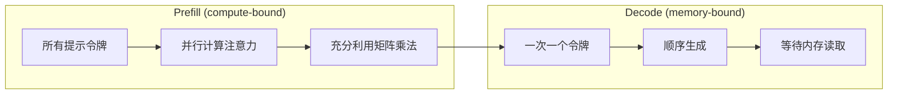
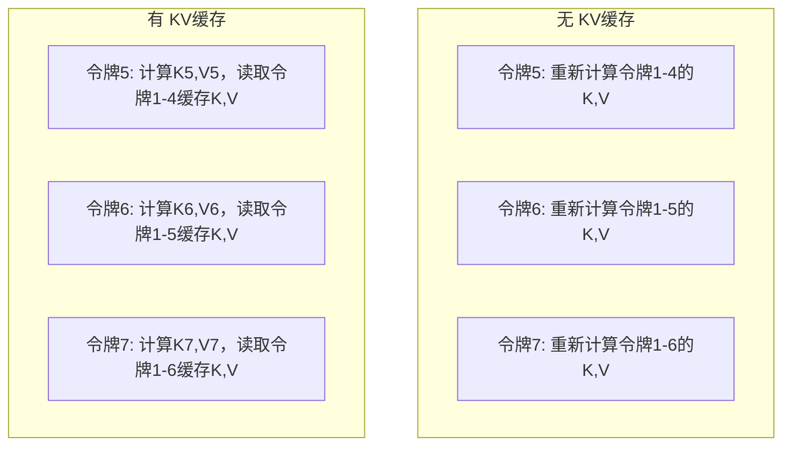
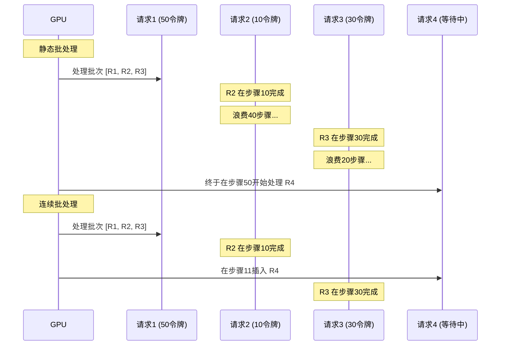
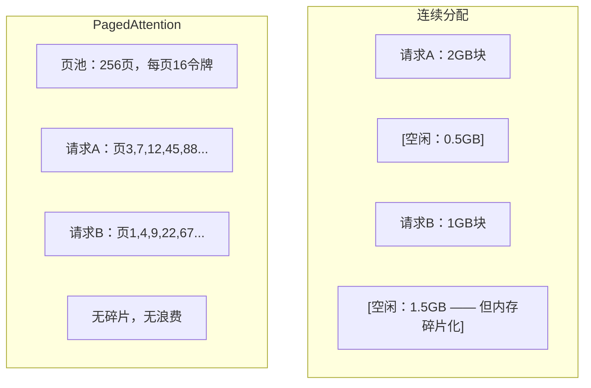
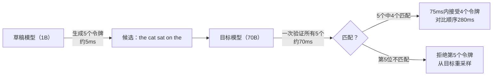

# 推理优化（Inference Optimization）

> 大型语言模型（LLM）推理分为两个阶段。Prefill（预填充）并行处理你的提示——计算受限（compute-bound）。Decode（解码）一次生成一个令牌——内存受限（memory-bound）。每项优化都针对其中一个或两个阶段。

**类型：** 构建  
**语言：** Python  
**先决条件：** 第10阶段，第01-08课（Transformer 架构，注意力机制）  
**时间：** 约120分钟

## 学习目标

- 实现 KV cache（键值缓存）以消除自回归令牌生成过程中的冗余计算  
- 解释 LLM 推理中的 prefill（预填充）与 decode（解码）阶段及它们为何存在不同瓶颈（计算受限 vs 内存受限）  
- 实现连续批处理（continuous batching）和 PagedAttention 概念，以最大化在并发请求下的 GPU 利用率  
- 比较推理优化技术（KV cache、推测解码（speculative decoding）、flash attention）及其吞吐量/延迟权衡  

## 问题描述

当你在4个A100 GPU上部署 Llama 3 70B 模型时。单用户每秒约生成50个令牌。感觉很快。然后100个用户同时访问端点。吞吐量骤降到每用户每秒3个令牌。你每月25000美元的GPU账单服务响应速度比人类打字还慢。

模型本身在1个用户和100个用户之间没有变化。相同权重，相同架构，相同计算。变化的是你如何调度工作。简单的推理浪费了90%+的GPU计算资源。等待第47令牌的用户会占用整个批次槽，同时GPU的内存总线在矩阵乘法之间处于空闲状态。与此同时，一个新用户2000令牌的提示本可以利用这段无效时间进行有效计算。

这不是扩展问题，而是调度问题。本课中的技术——KV缓存、连续批处理、PagedAttention、推测解码、前缀缓存——是将每月25000美元推理成本降至5000美元的关键。

vLLM在4xA100-80GB GPU上服务 Llama 3 70B，低并发时实现约50令牌/秒/用户，100并发请求时通过连续批处理和PagedAttention维持每用户15-25 TPS。若无这些优化，同一硬件在该并发下只能达到5 TPS。相同GPU，相同模型，吞吐量提升4倍。

## 概念

### Prefill（预填充）与 Decode（解码）

每个 LLM 推理请求有两个截然不同的阶段。

**Prefill** 处理整个输入提示。所有令牌均已知，因此注意力可在整个序列上并行计算。这是一个大型矩阵乘法——GPU核心保持繁忙。瓶颈是计算能力：每秒硬件可执行的浮点操作数（FLOPS）。一个A100能达到312 TFLOPS（BF16）。在单个A100上，70B模型对4096令牌的预填充约耗时400毫秒。

**Decode** 一次生成一个输出令牌。每个新令牌都要关注所有之前的令牌，但每个前向传播只产出一个令牌。权重矩阵和预填充阶段大小相同，但你是将它们与单个向量相乘，而非矩阵。GPU核心在微秒内完成计算，然后等待下一批权重从内存加载。瓶颈是内存带宽：从HBM（高带宽内存）到计算单元的权重传输速度。一块A100有2 TB/s带宽。70B模型FP16约140 GB，读取完整模型一次要70毫秒——这是单步解码的时间下限。



**操作数与字节比（ops:byte ratio）**（又称算术强度）体现了这一权衡。它衡量从内存读取每个字节时你执行了多少操作。

```text
ops:byte ratio = 每令牌浮点操作数 / 从内存读取的字节数
```

预填充时，批量4096令牌，每加载一个权重执行大约4096次乘加操作。比率很高——计算受限。解码时批量大小为1，加载一个权重只执行约1次操作。比率很低——内存受限。

根本见解：*解码受限于内存，因为你得读取整个模型才能生成一个令牌*。以下所有优化都要么减少读取量，要么增加每次读取处理的令牌数，要么完全避免读取。

### KV Cache（键值缓存）

注意力中，每个令牌的查询（query）关注所有先前令牌的键（key）和值（value）向量。若无缓存，生成第N令牌时需重新计算前N-1个令牌的键和值投影。第1令牌在生成第2令牌时计算一次，在生成第3令牌又计算一次，在第4令牌还得计算……到了第1000令牌，第1令牌被投影了999次。

KV缓存存储了所有先前令牌的键和值投影。生成第N令牌时只计算第N令牌的键和值，并将其与缓存中第1到N-1令牌的K/V串联起来。



**KV缓存的内存公式：**

```text
KV缓存大小 = 2 * 层数 * KV头数 * 头维度 * 序列长度 * 每参数字节数
```

Llama 3 70B（80层，带GQA的8个KV头，头维度128，BF16）：

```text
单令牌：2 * 80 * 8 * 128 * 2字节 = 327,680字节 = 320 KB
4096令牌：320 KB * 4096 = 1.28 GB
128K令牌：320 KB * 131,072 = 40 GB
```

Llama 3 70B单会话128K上下文消耗40 GB KV缓存——占半个A100显存。100个并发用户，均4K令牌，则KV缓存需求达128 GB。这就是KV缓存管理是推理优化中的核心难点。

### 连续批处理（Continuous Batching）

静态批处理等待批量N个请求到齐，批量处理它们，然后等*全部*完成后再接受新请求。如果一个请求需要500令牌，另一个只需10令牌，短请求完成后会空闲490个解码步骤。

连续批处理（又称迭代级批处理）会在任一请求完成后，立即将新请求插入批次。批次在每个解码步骤重新评估。完成10令牌的请求马上被等待请求替换。



吞吐量提升取决于输出长度的变异度。若长度均匀，连续批处理与静态批处理一致。长度不均时（常见），连续批处理能提升2-5倍吞吐，因为GPU插槽永远不会空闲。

### PagedAttention（分页注意力）

每个请求的KV缓存是一块连续内存。请求动态到达和离开导致内存碎片——就像操作系统的RAM碎片。4K令牌请求需要1.28 GB连续内存。即使你总共空闲2 GB，也未必有1.28 GB连续空间。这样会浪费内存或拒绝请求。

PagedAttention（源自vLLM）为KV缓存引入类操作系统的虚拟内存管理。不再为每个请求分配连续大块内存，而是分配固定大小的“页”（通常为16令牌）。页面可散布于物理GPU内存中。页表将每个请求的逻辑序列位置映射到物理页位置。



PagedAttention还支持**写时复制（copy-on-write）**用于共享前缀。如果50个请求共享同一个系统提示，则该系统提示的KV缓存页只存一次，被50个请求共同引用。仅当某请求产生分支（不同用户消息）时才拥有独自的页。此机制大幅降低共享系统提示应用的内存使用。

据vLLM，PagedAttention几乎无内存浪费（约4%），而简单分配浪费60-80%。

### Speculative Decoding（推测解码）

解码缓慢因其顺序特性——每次生成一个令牌，再将其反馈，生成下一个。但如果你能快速猜测接下来5个令牌，再一次验证它们呢？

推测解码使用小型快速的**草稿模型**生成K个候选令牌。大型**目标模型**随后在单次前向计算中处理所有K个候选（类似预填充——并行，计算受限，高效）。如果目标模型同意草稿模型的预测，则在一次目标前向时长内接受所有K个令牌；若在位置j不同意，则接受第1到j-1个，丢弃剩余。



加速倍数取决于**接受率**——草稿模型预测与目标模型匹配的频率。Llama 3 8B为Llama 3 70B的草稿模型时，接受率在自然语言上通常是70-85%，对应2-3倍解码加速。

三种推测解码方法：

| 方法 | 草稿来源 | 接受率 | 额外开销 |
|------|----------|---------|---------|
| Draft-target（Leviathan等） | 独立小模型 | 70-85% | 草稿模型内存 |
| EAGLE（Li等） | 目标模型的轻量头 | 75-90% | 约1%额外参数 |
| N-gram查表 | 令牌n-gram表 | 40-60% | 可忽略 |

**EAGLE**在目标模型隐藏层之上训练小型自回归头，使用目标模型倒数第二层特征预测下一令牌的嵌入。因其运行于目标模型自身表示（非独立模型），实现更高接受率且内存开销极低。EAGLE-2引入动态草稿树，基于上下文动态调整候选数量。

**N-gram speculative decoding（N-gram 推测解码）** 维护一个从当前上下文或预构建语料库中的 n-gram 连续表。如果草稿与同一对话中之前出现的内容匹配（重复模式、代码、结构化输出），则该方法以零神经网络开销触发。接受率平均较低，但每次推测的成本基本为零。

推测解码在*数学上是精确的*——输出分布与目标模型的分布完全相同。它不是近似。验证步骤确保每个接受的 token 具有目标模型分配的精确概率。

### 前缀缓存（Prefix Caching）

许多请求共享相同的前缀。一个聊天机器人系统提示（system prompt）、一个 RAG 上下文块、几次示例集。如果没有前缀缓存，每个请求都会从头重新计算这些共享 token 的 KV 缓存。

前缀缓存存储公共前缀的 KV 缓存并在请求之间复用。当新请求带有已知前缀时，系统复制（或引用）缓存的 KV 条目，只计算唯一后缀的 KV。

对于一个跨所有请求共享的 2000-token 系统提示，前缀缓存每个请求减少约 400 毫秒的预填充时间。在 100 请求/秒下，每秒节省 40 秒的 GPU 计算时间——超过一块 GPU 的工作量。

SGLang 的 RadixAttention 使用基数树（trie）通过其token内容索引前缀来实现前缀缓存。任何与存储前缀匹配的请求都能免费获得其 KV 缓存。该树支持部分前缀匹配——如果你与缓存条目共享 2000 个前缀 token 中的 1500 个，则复用这 1500 个，只需重新计算剩余的 500 个。

### 推理引擎（Inference Engines）

三款引擎主导生产级大模型（LLM）服务：

| 引擎 | 关键创新 | 最适合 |
|--------|---------------|----------|
| vLLM | PagedAttention、连续批处理（continuous batching） | 通用服务，最高兼容性 |
| SGLang | RadixAttention（前缀缓存）、结构化生成 | 多轮聊天机器人、约束解码 |
| TensorRT-LLM | NVIDIA 内核融合、FP8 量化 | NVIDIA 硬件上单卡最大吞吐量 |

**vLLM** 是默认的起点。它支持最广范围的模型，运行于任何 GPU 供应商（NVIDIA、AMD、Intel）且通过 PagedAttention + 连续批处理实现高吞吐量。兼容 OpenAI API，意味着可以无缝替换任何 OpenAI API 调用。

**SGLang** 建立在与 vLLM 相同的基础上，但增加了用于前缀缓存的 RadixAttention 和用于结构化 LLM 程序的领域特定语言。如果工作负载涉及多轮对话、工具使用或约束解码（如 JSON 输出、基于正则的生成），SGLang 通过前缀复用通常在性能上比 vLLM 高出 2-5 倍。

**TensorRT-LLM** 将模型编译为经过优化的 NVIDIA GPU 内核。它融合操作（attention + 线性层 + 激活函数于一个内核），在 H100 GPU 上使用 FP8，并与 NVIDIA Triton 推理服务器集成用于生产部署。它在 NVIDIA 硬件上实现最高单卡吞吐量，但需要更多配置且仅支持 NVIDIA GPU。

以 Llama 3 70B（4×A100-80GB，BF16）为例的实际数据：

| 指标 | vLLM | SGLang | TensorRT-LLM |
|--------|------|--------|---------------|
| 吞吐量（1 用户） | ~50 TPS | ~55 TPS | ~65 TPS |
| 吞吐量（100 用户） | ~2,500 总 TPS | ~3,200 总 TPS | ~3,000 总 TPS |
| 首个 token 时间 | ~400ms | ~300ms（前缀命中） | ~350ms |
| 最大上下文长度 | 128K | 128K | 128K |

### Ops:Byte 框架

你无法优化未被衡量的内容。ops:byte 比率告诉你是否受限于计算或内存，这决定了哪些优化有效。

```text
计算上限：GPU 的峰值 FLOPS
内存上限：峰值带宽 × ops:byte 比率
```

当 ops:byte 低（解码、小批量时），你受内存带宽限制。增加计算能力（更高时钟、更多核心）无效。你需要减少内存读取（量化、KV 缓存压缩）或增加批量大小以在更多有效工作上摊销读取成本。

当 ops:byte 高（预填充、大批量时），你受计算能力限制。内存带宽优化无效。你需要更快的 GPU、内核融合或降低精度以挤出更多 FLOPS。

| 场景 | ops:byte | 受限于 | 优化方式 |
|----------|----------|-------|---------------|
| 预填充，batch=1 | ~4,096 | 计算 | 内核融合、FP8 |
| 解码，batch=1 | ~1 | 内存 | 量化、KV 压缩 |
| 解码，batch=32 | ~32 | 内存 | 更大批量，连续批处理 |
| 解码，batch=256 | ~256 | 过渡期 | 双方皆重要 |
| 解码，batch=1024 | ~1,024 | 计算 | 内核融合、张量并行 |

A100 的临界点约为 ops:byte = 156（312 TFLOPS / 2 TB/s）。低于 156 表示受内存限制，高于 156 表示受计算限制。连续批处理通过每次迭代处理更多 token 将解码推向临界点。

## 构建（Build It）

### 步骤 1：从头构建 KV 缓存

我们构建一个多头 KV 缓存，存储每层、每个头的 key 和 value 投影，并演示内存增长模式。

```python
import numpy as np

class KVCache:
    def __init__(self, num_layers, num_heads, head_dim, max_seq_len, dtype=np.float16):
        self.num_layers = num_layers
        self.num_heads = num_heads
        self.head_dim = head_dim
        self.max_seq_len = max_seq_len
        self.dtype = dtype

        self.k_cache = np.zeros(
            (num_layers, num_heads, max_seq_len, head_dim), dtype=dtype
        )
        self.v_cache = np.zeros(
            (num_layers, num_heads, max_seq_len, head_dim), dtype=dtype
        )
        self.seq_len = 0

    def update(self, layer_idx, new_keys, new_values):
        num_new = new_keys.shape[1]
        end = self.seq_len + num_new
        self.k_cache[layer_idx, :, self.seq_len:end, :] = new_keys
        self.v_cache[layer_idx, :, self.seq_len:end, :] = new_values
        return (
            self.k_cache[layer_idx, :, :end, :],
            self.v_cache[layer_idx, :, :end, :]
        )

    def advance(self, num_tokens):
        self.seq_len += num_tokens

    def memory_bytes(self):
        return self.k_cache.nbytes + self.v_cache.nbytes

    def used_bytes(self):
        per_token = 2 * self.num_layers * self.num_heads * self.head_dim * np.dtype(self.dtype).itemsize
        return per_token * self.seq_len
```

### 步骤 2：基于 KV 缓存的注意力机制

一个简化的多头注意力模块，使用 KV 缓存进行解码步骤。

```python
def scaled_dot_product_attention(query, keys, values):
    head_dim = query.shape[-1]
    scores = np.matmul(query, keys.transpose(0, 1, 3, 2)) / np.sqrt(head_dim)
    seq_len_q = scores.shape[-2]
    seq_len_k = scores.shape[-1]
    if seq_len_q > 1:
        mask = np.triu(np.ones((seq_len_q, seq_len_k), dtype=np.float32), k=seq_len_k - seq_len_q + 1)
        scores = scores + mask * (-1e9)
    max_scores = np.max(scores, axis=-1, keepdims=True)
    exp_scores = np.exp(scores - max_scores)
    attn_weights = exp_scores / np.sum(exp_scores, axis=-1, keepdims=True)
    return np.matmul(attn_weights, values)


class MultiHeadAttention:
    def __init__(self, d_model, num_heads):
        self.num_heads = num_heads
        self.head_dim = d_model // num_heads
        scale = np.sqrt(2.0 / d_model)
        self.W_q = np.random.randn(d_model, d_model).astype(np.float32) * scale
        self.W_k = np.random.randn(d_model, d_model).astype(np.float32) * scale
        self.W_v = np.random.randn(d_model, d_model).astype(np.float32) * scale
        self.W_o = np.random.randn(d_model, d_model).astype(np.float32) * scale

    def forward(self, x, kv_cache=None, layer_idx=0):
        batch, seq_len, d_model = x.shape
        Q = np.matmul(x, self.W_q).reshape(batch, seq_len, self.num_heads, self.head_dim).transpose(0, 2, 1, 3)
        K = np.matmul(x, self.W_k).reshape(batch, seq_len, self.num_heads, self.head_dim).transpose(0, 2, 1, 3)
        V = np.matmul(x, self.W_v).reshape(batch, seq_len, self.num_heads, self.head_dim).transpose(0, 2, 1, 3)

        if kv_cache is not None:
            K_full, V_full = kv_cache.update(layer_idx, K[0], V[0])
            K = K_full[np.newaxis, :, :, :]
            V = V_full[np.newaxis, :, :, :]
            if seq_len == 1:
                kv_cache.advance(1)

        attn_out = scaled_dot_product_attention(Q, K, V)
        attn_out = attn_out.transpose(0, 2, 1, 3).reshape(batch, -1, d_model)
        return np.matmul(attn_out, self.W_o)
```

### 步骤 3：连续批处理模拟器

模拟静态批处理与连续批处理间的调度差异。

```python
import heapq

class Request:
    def __init__(self, request_id, prompt_tokens, output_tokens, arrival_step):
        self.request_id = request_id
        self.prompt_tokens = prompt_tokens
        self.output_tokens = output_tokens
        self.arrival_step = arrival_step
        self.tokens_generated = 0
        self.start_step = None
        self.end_step = None

    def is_done(self):
        return self.tokens_generated >= self.output_tokens


def simulate_static_batching(requests, batch_size):
    step = 0
    completed = []
    queue = list(requests)
    queue.sort(key=lambda r: r.arrival_step)

    while queue:
        batch = []
        while queue and len(batch) < batch_size:
            r = queue.pop(0)
            r.start_step = max(step, r.arrival_step)
            batch.append(r)

        if batch:
            step = max(step, max(r.start_step for r in batch))
            max_output = max(r.output_tokens for r in batch)
            for r in batch:
                r.tokens_generated = r.output_tokens
                r.end_step = step + max_output
            step += max_output
            completed.extend(batch)

    return completed


def simulate_continuous_batching(requests, batch_size):
    step = 0
    completed = []
    queue = sorted(requests, key=lambda r: r.arrival_step)
    queue_idx = 0
    active = []
    waiting = []

    while queue_idx < len(queue) or active or waiting:
        while queue_idx < len(queue) and queue[queue_idx].arrival_step <= step:
            waiting.append(queue[queue_idx])
            queue_idx += 1

        while waiting and len(active) < batch_size:
            r = waiting.pop(0)
            r.start_step = step
            active.append(r)

        if not active:
            if waiting:
                step += 1
                continue
            elif queue_idx < len(queue):
                step = queue[queue_idx].arrival_step
                continue
            else:
                break

        for r in active:
            r.tokens_generated += 1

        done = [r for r in active if r.is_done()]
        for r in done:
            r.end_step = step + 1
            completed.append(r)
        active = [r for r in active if not r.is_done()]

        step += 1

    return completed


def batching_stats(completed):
    latencies = [r.end_step - r.arrival_step for r in completed]
    total_time = max(r.end_step for r in completed) - min(r.arrival_step for r in completed)
    total_tokens = sum(r.output_tokens for r in completed)
    return {
        "avg_latency": np.mean(latencies),
        "p50_latency": np.median(latencies),
        "p99_latency": np.percentile(latencies, 99),
        "total_time": total_time,
        "throughput": total_tokens / total_time if total_time > 0 else 0,
    }
```

### 第4步：前缀缓存（Prefix Cache）

基于Trie的前缀缓存，用于存储共享前缀的KV条目。

```python
class TrieNode:
    def __init__(self):
        self.children = {}
        self.kv_data = None
        self.hit_count = 0


class PrefixCache:
    def __init__(self, max_entries=1000):
        self.root = TrieNode()
        self.max_entries = max_entries
        self.total_entries = 0
        self.hits = 0
        self.misses = 0

    def _walk(self, token_ids):
        node = self.root
        depth = 0
        for tid in token_ids:
            if tid not in node.children:
                break
            node = node.children[tid]
            depth += 1
        return node, depth

    def lookup(self, token_ids):
        node, depth = self._walk(token_ids)
        if depth > 0:
            self.hits += 1
            current = self.root
            for tid in token_ids[:depth]:
                current = current.children[tid]
                current.hit_count += 1
            kv_entries = []
            current = self.root
            for tid in token_ids[:depth]:
                current = current.children[tid]
                if current.kv_data is not None:
                    kv_entries.append(current.kv_data)
            return depth, kv_entries
        self.misses += 1
        return 0, []

    def insert(self, token_ids, kv_per_token):
        node = self.root
        for i, tid in enumerate(token_ids):
            if tid not in node.children:
                if self.total_entries >= self.max_entries:
                    return i
                node.children[tid] = TrieNode()
                self.total_entries += 1
            node = node.children[tid]
            if i < len(kv_per_token):
                node.kv_data = kv_per_token[i]
        return len(token_ids)

    def hit_rate(self):
        total = self.hits + self.misses
        return self.hits / total if total > 0 else 0.0
```

### 第5步：投机解码（Speculative Decoding）模拟器

我们模拟草稿-目标投机解码，支持可配置的接受率。

```python
class DraftModel:
    def __init__(self, vocab_size, acceptance_rate=0.8):
        self.vocab_size = vocab_size
        self.acceptance_rate = acceptance_rate

    def generate(self, context, num_tokens):
        tokens = np.random.randint(0, self.vocab_size, size=num_tokens)
        return tokens

    def get_probs(self, context, token):
        probs = np.random.dirichlet(np.ones(self.vocab_size))
        return probs


class TargetModel:
    def __init__(self, vocab_size):
        self.vocab_size = vocab_size

    def get_probs(self, context, tokens=None):
        if tokens is not None:
            return [np.random.dirichlet(np.ones(self.vocab_size)) for _ in tokens]
        return np.random.dirichlet(np.ones(self.vocab_size))


def speculative_decode(draft_model, target_model, context, num_speculative=5,
                       draft_cost=1.0, target_cost=10.0, verify_cost=12.0):
    total_tokens = 0
    total_cost = 0.0
    accepted_counts = []
    context = list(context)

    max_tokens = 100

    while total_tokens < max_tokens:
        draft_tokens = draft_model.generate(context, num_speculative)
        total_cost += draft_cost * num_speculative

        target_probs = target_model.get_probs(context, draft_tokens)
        total_cost += verify_cost

        accepted = 0
        for i, token in enumerate(draft_tokens):
            draft_p = draft_model.get_probs(context + list(draft_tokens[:i]), token)
            target_p = target_probs[i]

            r = np.random.random()
            acceptance_prob = min(1.0, target_p[token] / (draft_p[token] + 1e-10))

            if r < draft_model.acceptance_rate:
                accepted += 1
                context.append(token)
                total_tokens += 1
            else:
                new_token = np.random.choice(draft_model.vocab_size, p=target_p)
                context.append(new_token)
                total_tokens += 1
                break

        accepted_counts.append(accepted)

        if accepted == num_speculative:
            bonus_probs = target_model.get_probs(context)
            bonus_token = np.random.choice(draft_model.vocab_size, p=bonus_probs)
            context.append(bonus_token)
            total_tokens += 1

    sequential_cost = total_tokens * target_cost
    return {
        "total_tokens": total_tokens,
        "speculative_cost": total_cost,
        "sequential_cost": sequential_cost,
        "speedup": sequential_cost / total_cost if total_cost > 0 else 1.0,
        "avg_accepted": np.mean(accepted_counts),
        "acceptance_rate": np.mean(accepted_counts) / num_speculative,
    }


def compare_speculation_strategies(vocab_size=1000, num_trials=20):
    results = {}

    for name, acceptance_rate, spec_tokens in [
        ("Draft-target (8B->70B)", 0.78, 5),
        ("EAGLE", 0.85, 6),
        ("N-gram", 0.50, 4),
        ("No speculation", 0.0, 0),
    ]:
        if spec_tokens == 0:
            results[name] = {
                "speedup": 1.0,
                "acceptance_rate": 0.0,
                "avg_accepted": 0.0,
            }
            continue

        trial_results = []
        for _ in range(num_trials):
            draft = DraftModel(vocab_size, acceptance_rate=acceptance_rate)
            target = TargetModel(vocab_size)
            context = list(np.random.randint(0, vocab_size, size=10))
            result = speculative_decode(draft, target, context, num_speculative=spec_tokens)
            trial_results.append(result)

        results[name] = {
            "speedup": np.mean([r["speedup"] for r in trial_results]),
            "acceptance_rate": np.mean([r["acceptance_rate"] for r in trial_results]),
            "avg_accepted": np.mean([r["avg_accepted"] for r in trial_results]),
        }

    return results
```

### 第6步：KV缓存内存分析器

针对真实模型配置计算KV缓存的内存需求。

```python
MODEL_CONFIGS = {
    "Llama-3-8B": {
        "num_layers": 32, "num_kv_heads": 8, "head_dim": 128,
        "model_params_b": 8, "gqa": True,
    },
    "Llama-3-70B": {
        "num_layers": 80, "num_kv_heads": 8, "head_dim": 128,
        "model_params_b": 70, "gqa": True,
    },
    "Llama-3-405B": {
        "num_layers": 126, "num_kv_heads": 8, "head_dim": 128,
        "model_params_b": 405, "gqa": True,
    },
    "Mistral-7B": {
        "num_layers": 32, "num_kv_heads": 8, "head_dim": 128,
        "model_params_b": 7, "gqa": True,
    },
    "GPT-4-est": {
        "num_layers": 120, "num_kv_heads": 96, "head_dim": 128,
        "model_params_b": 1800, "gqa": False,
    },
}


def kv_cache_memory(config, seq_len, dtype_bytes=2):
    per_token = 2 * config["num_layers"] * config["num_kv_heads"] * config["head_dim"] * dtype_bytes
    total = per_token * seq_len
    return {
        "per_token_bytes": per_token,
        "per_token_kb": per_token / 1024,
        "total_bytes": total,
        "total_mb": total / (1024 ** 2),
        "total_gb": total / (1024 ** 3),
    }


def memory_budget(config, gpu_memory_gb, model_dtype_bytes=2, kv_dtype_bytes=2):
    model_memory_gb = config["model_params_b"] * 1e9 * model_dtype_bytes / (1024 ** 3)
    overhead_gb = gpu_memory_gb * 0.1
    available_for_kv = gpu_memory_gb - model_memory_gb - overhead_gb

    if available_for_kv <= 0:
        return {"error": "Model does not fit in GPU memory", "model_memory_gb": model_memory_gb}

    per_token = 2 * config["num_layers"] * config["num_kv_heads"] * config["head_dim"] * kv_dtype_bytes
    max_tokens = int(available_for_kv * (1024 ** 3) / per_token)

    return {
        "gpu_memory_gb": gpu_memory_gb,
        "model_memory_gb": round(model_memory_gb, 1),
        "overhead_gb": round(overhead_gb, 1),
        "available_for_kv_gb": round(available_for_kv, 1),
        "max_total_tokens": max_tokens,
        "max_users_at_2k": max_tokens // 2048,
        "max_users_at_4k": max_tokens // 4096,
        "max_users_at_32k": max_tokens // 32768,
    }
```

## 使用方法

使用 vLLM：

```python
from vllm import LLM, SamplingParams

llm = LLM(
    model="meta-llama/Llama-3-70B-Instruct",
    tensor_parallel_size=4,
    enable_prefix_caching=True,
    max_model_len=8192,
    gpu_memory_utilization=0.9,
)

params = SamplingParams(temperature=0.7, max_tokens=256)
outputs = llm.generate(["Explain inference optimization in one paragraph."], params)
```

使用 SGLang 进行前缀缓存和结构化输出：

```python
import sglang as sgl

@sgl.function
def classify(s, text):
    s += sgl.system("You are a classifier. Output JSON only.")
    s += sgl.user(f"Classify this text: {text}")
    s += sgl.assistant(sgl.gen("result", regex=r'\{"label": "(positive|negative|neutral)"\}'))

runtime = sgl.Runtime(model_path="meta-llama/Llama-3-70B-Instruct", tp_size=4)
sgl.set_default_backend(runtime)

results = classify.run_batch([
    {"text": "This product is amazing!"},
    {"text": "Terrible experience."},
    {"text": "It was okay I guess."},
])
```

使用 TensorRT-LLM：

```python
import tensorrt_llm
from tensorrt_llm.runtime import ModelRunner

runner = ModelRunner.from_dir("./llama-70b-trt-engine/", rank=0)

outputs = runner.generate(
    batch_input_ids=[tokenizer.encode("Explain KV caching.")],
    max_new_tokens=256,
    temperature=0.7,
)
```

## 发布

本课程生成：
- `outputs/skill-inference-optimization.md` —— 一个用于诊断和优化大型语言模型推理服务的技能文档

## 练习题

1. 修改KV缓存分析器，比较FP16、FP8与INT4 KV缓存量化。对于Llama 3 70B在4K上下文长度下，计算4×A100-80GB环境中的最大并发用户数。KV量化到INT4应大约能使用户容量增加4倍。

2. 扩展连续批处理模拟器，追踪GPU利用率（每步填写的批次槽位比例）。绘制50个请求的利用率随时间变化图，输出长度服从Pareto分布（shape=1.5，scale=20）。连续批处理应保持>80%利用率。

3. 实现分组查询注意力（GQA）版本的KV缓存，其中`num_kv_heads < num_query_heads`。Llama 3 70B使用64个查询头，但只有8个KV头。计算相较于完整多头注意力的内存节省（KV缓存大小减少8倍）。

4. 构建一个使用LRU（最近最少使用）淘汰的前缀缓存。设置`max_entries=500`，生成1000个请求，其中60%共享5个常见前缀之一。测量命中率并与无限制缓存进行比较。良好的淘汰策略下，命中率应保持在55%以上。

5. 扩展投机解码模拟器，实现基于树形结构的投机（EAGLE-2风格）。不再是单链的K个草稿令牌，而是生成候选树（例如3层，每层2个分支，共8个叶节点候选）。比较每轮验证中接受的总令牌数与线性投机的区别。

## 关键词

| 术语 | 俗称 | 实际含义 |
|------|------|----------|
| Prefill（预填充） | “处理提示” | 对所有输入令牌并行计算注意力，计算密集型，因为完整矩阵乘法持续占用GPU核心 |
| Decode（解码） | “生成令牌” | 每次前向传播生成一个令牌，每次都要读取完整模型权重，受内存限制，因为计算完成早于下一批权重加载 |
| KV cache（KV缓存） | “缓存注意力状态” | 存储所有已生成令牌的key和value投影，避免每次解码时重复计算，以内存换取计算 |
| Continuous batching（连续批处理） | “动态批处理” | 在任一请求完成后立即将新请求加入当前批次，解码迭代时动态评估，而不是等待整个批次集合完成 |
| PagedAttention（分页注意力） | “KV缓存虚拟内存” | 以固定大小页管理KV缓存，避免内存碎片化，支持共享前缀的写时复制 |
| Speculative decoding（投机解码） | “草稿与验证” | 使用快速草稿模型生成多个令牌，再通过目标模型一次性验证，数学上精确，速度提升2-3倍 |
| EAGLE | “自投机解码” | 一种投机解码变体，训练一个轻量头部基于目标模型自身隐藏状态，比单独草稿模型接受率更高 |
| Prefix caching（前缀缓存） | “重用系统提示KV” | 存储常用前缀（系统提示、少量示例）的KV缓存条目，多请求共享，跳过重复预填充 |
| Ops:byte ratio（计算字节比） | “算术强度” | 计算操作数与读取内存字节数的比率，用于判断性能瓶颈是计算（高比）还是内存（低比） |
| Time to first token（首个令牌时间） | “TTFT” | 从接收请求到生成第一个输出令牌的延迟，长提示时主要由预填充时间决定 |

## 延伸阅读

- Kwon 等人，《Efficient Memory Management for Large Language Model Serving with PagedAttention》（2023）——提出了分页 KV cache 管理的 vLLM 论文，现在已成为推理服务的行业标准
- Leviathan 等人，《Fast Inference from Transformers via Speculative Decoding》（2023）——基础性论文，证明了草稿-校验（draft-verify）推测方法能产生精确的目标模型分布，同时实现 2-3 倍速度提升
- Li 等人，《EAGLE: Speculative Sampling Requires Rethinking Feature Uncertainty》（2024）——通过在目标模型自身特征上训练一个头，而非使用独立草稿模型，实现了更高的接受率
- Zheng 等人，《SGLang: Efficient Execution of Structured Language Model Programs》（2024）——引入了用于前缀缓存的 RadixAttention 和多调用大语言模型程序的编程模型
- Williams 等人，《Roofline: An Insightful Visual Performance Model for Multicore Architectures》（2009）——原始的 roofline 论文，形式化了用于分析计算与内存瓶颈的 ops:byte 框架
