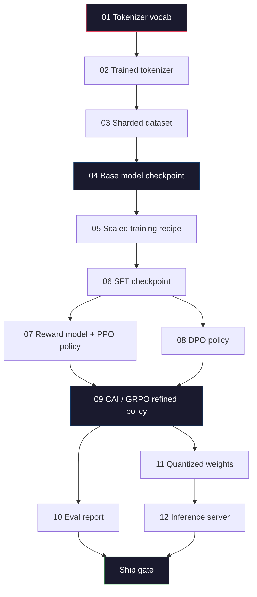
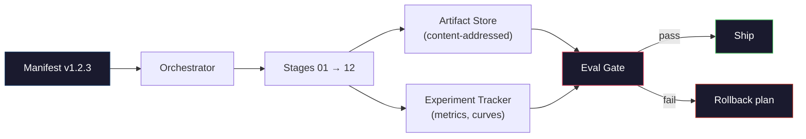

# 构建完整的LLM管道

> 从第01课到第12课的一切，都是一个管道的一个阶段。本课是搭建起这些阶段，形成单个端到端运行的脚手架：分词（tokenize）、预训练（pre-train）、扩展（scale）、SFT、对齐（align）、评估（evaluate）、量化（quantize）、服务（serve）。你不会在笔记本上训练一个70B模型。你将产出一个2026年前沿团队用以决定交付内容的编排层、清单、评估门控和回滚计划。这是压轴之作。

**类型：** 构建  
**语言：** Python（标准库）  
**前置条件：** 第10阶段全部课程01-12  
**时间：** ~120分钟

## 学习目标

- 将之前十一课（分词器、数据、预训练、扩展、SFT、RLHF、DPO、CAI、评估、量化、推理）组成一个可复现的单一管道规范  
- 定义阶段之间的工件合约：每个阶段消费什么，产生什么，以及下一阶段如何验证输入  
- 构建一个用于跟踪实验、散列工件，并基于评估阈值决定是否交付的编排器  
- 设计回滚计划：哪些工件便宜重跑，哪些昂贵，损坏的检查点成本是多少  

## 问题描述

前面各节课均可独立运行。分词器训练好了。Tiny GPT预训练好了。SFT 数据集准备好了。奖励模型训练好了。DPO运行完成。评估测量了。量化权重导出了。推理服务器启动了。每个都是一个笔记本。每个有自己的约定、自己的输出路径、自己的随机种子。

前沿的训练运行不是笔记本。Llama 3 405B耗费约5400万H100小时，历时约54天。DeepSeek-V3约280万H800小时。在此期间，一处损坏的检查点、一次数据污染、一次评估回退就可能让团队损失一周的墙钟时间和一个月的GPU预算。团队靠管道卫生习惯存活：每个阶段都存在确定性输入、确定性输出、清单、散列和门控。

这是压轴。你不会在笔记本上端到端运行管道。你会编写编排器来协调这些阶段，编写描述运行的清单，编写决定交付的验证器，以及编写让第三方能通过单个文件重跑你工作的重放计划。代码不大；但纪律严格。

此模式从1亿参数规模到1万亿参数规模无变化。相同的四个组件——清单（manifest）、编排器（orchestrator）、评估门控（eval gate）、工件存储（artifact store）——既执行Llama 3，也运行你的爱好级GPT。差异只是在每个阶段配置里的数值大小，不在管道形态。

## 概念

### 十二个阶段

每个第10阶段课程都是一个阶段。这里是完整的依赖图。



阶段07和08可并行执行。其余均是严格依赖。阶段02（分词器）变更使后续所有工件失效。阶段10（评估）变更仅使交付决策失效。

### 清单（Manifest）

清单是描述一次运行的单文件，足够完整以重新执行。管道产生的任何内容不应依赖清单之外的状态。字段枯燥且必填。

```text
pipeline_version: 1.2.3
seed: 42
git_commit: a1b2c3d4
stages:
  01_tokenizer:
    recipe: bpe_32k
    input_hash: sha256:...
    output_hash: sha256:...
    wall_clock_sec: 3600
    cost_usd: 12
```

阶段N的输出哈希是阶段N+1的输入哈希。任何偏差都会让管道停止运行。这是捕获数据损坏的早期方法。也是团队成员身处不同大陆时验证重放产物一致的方式。

实际中团队使用较小的YAML schema，再用清单检查器(diff前次成功运行)检测差异。除预期字段（成本、墙钟时间）外任何变动都是红旗。

### 工件类型化

每阶段输出的工件都有类型。不是目录大块，不是pickle，而是带已知schema的命名类型。

| 阶段   | 工件类型        | 关键字段                                  |
|--------|-----------------|-----------------------------------------|
| 01-02  | Tokenizer       | vocab.json, merges.txt, config.json, hash |
| 03     | Dataset         | shards[], 行数, 令牌数, 去重统计                          |
| 04-05  | Checkpoint     | weights.safetensors, config.json, 优化器状态, 步数         |
| 06     | SFT Model       | checkpoint + SFT配方 + 数据混合                      |
| 07     | Reward Model    | 奖励模型检查点 + 偏好数据哈希                           |
| 08-09  | Policy          | 检查点 + 参考哈希 + beta + 消耗的KL预算                 |
| 10     | Eval Report     | 基准分数 + 回归差异 + 评估数据哈希                       |
| 11     | Quantized Model | 量化权重 + 校准数据 + 相较FP16的精度差异               |
| 12     | Server Spec     | 端点 + 模型哈希 + 配置 + 可观测性钩子                   |

类型化防止了最常见失败模式：使用阶段08输出作为阶段06输入，将DPO训练模型通过SFT路径交付。类型化工件和阶段签名将这些错误变成编译期错误，而非事后惊现。

### 评估门控（Eval Gate）

交付不是“训练完成”。交付是“训练完成且通过评估门”。门控在运行前定义。

```text
gates:
  mmlu:      >= baseline + 0.5   # 不回退
  humaneval: >= baseline + 1.0
  truthfulqa: >= baseline         # 不下降
  safety_refusal_rate: <= 0.05
  kl_from_reference: <= 25.0
  cost_total_usd: <= 50000
```

每个门是数值阈值。无“看着不错”的门。无主观签字。若所有门通过，工件标记为可交付。若任一门失败，运行暂停，待命名评审明确覆盖，且覆盖记录在清单里。

两门大多数灾难都能拦截。*回归门*（新模型在核心基准上至少不差于之前）拦截训练bug。*KL预算门*（以对齐策略不得超出参考策略多少层偏移）拦截过度对齐。每个生产管道都有这两门。

### 编排器（Orchestrator）

一小段代码，读取清单、调度阶段、追踪工件、发生合约违约时停止。不是Airflow。不是Kubeflow。为管道卫生你要写一些无聊代码。

编排器职能狭窄：

1. 从清单解析有向无环图  
2. 检查每阶段预期输出及其哈希是否存在（存在则跳过）  
3. 运行阶段，捕获stdout/stderr，测量墙钟和成本  
4. 验证输出哈希与下游阶段预期输入哈希匹配  
5. 失败时写入部分清单，标明失败阶段，并以非零退出  

这约200行Python代码。你将在本课看到`code/main.py`的样子。底层真实管道用`torchrun`或`ray`在集群执行各阶段，编排器本身运行于单机。

### 实验追踪和工件存储

管道有两个外部系统支撑。

**实验追踪器（wandb, neptune, mlflow）。** 记录每阶段损失曲线、评估指标、系统遥测。你三周后需比对A运行与B运行时去这里。团队一般用托管追踪器，自己写的话损失本该训练的时间。

**工件存储（S3, R2, GCS）。** 不可变对象存储检查点、数据集、分词器、评估报告。工件通过哈希寻址，不用文件名。文件名类似`latest.pt`极易出错；`ckpt-7b-step-20000-sha256:abc123.safetensors`是合约。

编排器同时写入两者。追踪器给人看图表。工件存储给下阶段查输入。

### 成本计算

前沿跑有贴美元的预算。预算纪律体现在两个方面。

**运行前估计。** 从清单计算FLOPs（预训练为6 × 参数数 × 令牌数）、预估GPU小时（FLOPs / 峰值吞吐 / 利用率）和当前租金下美元成本。估计超预算门，管道拒绝启动。

**运行中追踪。** 分阶段墙钟和成本登记到清单。每阶段结束检查剩余预算。若超支，下一阶段门根据新预算评估。不会等VC打电话时才知没钱。

Llama 3报告成本6100万美元。DeepSeek-V3预训练报道560万美元。差别主要是硬件效率和专家混合，但成本细节因两队均分阶段跟踪而可见。

### 可复现性与确定性

两者不同。*可复现*意为同一清单、同一代码、同一基础设施下产出下游指标等效检查点。*确定性*指输出比特完全一致。

现代LLM训练是可复现非确定性。分布式训练的规约顺序、GPU核非确定性（cuBLAS, flash-attn）、混精度舍入导致运行间浮点差异约1e-5。最终指标不变，问题不大。调试比特级差异时致命。解决是记录每阶段输入哈希、输出哈希及主要指标——如果它们吻合，运行即算复现，即使权重非比特同。



### 回滚计划

运行开始前，写明每阶段失败时做什么。三类：

- **便宜重跑（小时级）**：分词器、评估、量化、推理服务器。直接重跑。  
- **中等（天级）**：SFT、DPO、CAI。保留基础模型；仅重跑对齐阶段。  
- **昂贵（周级及数百万美元）**：预训练。此处回滚计划非“重跑”，而是“用最后良好检查点，重新运行数据修正后的下游阶段”。  

因阶段依赖均类型化且散列化，编排器可自动计算回滚集：使失败阶段及所有后代失效。阶段06（SFT）失败使06至12失效。阶段11（量化）失败仅使11和12失效。前置命名避免疲惫凌晨临时凑合。

### 2026年观察到的生产配方

大多数前沿团队趋于采用相同的骨架。

- Tokenizer（分词器）：128k BPE，带字节回退。训练于一个小型且平衡的多语言片段。
- 预训练：10-20万亿（T）tokens，主要包括网页内容、代码和合成数据。MuON或AdamW优化器。FSDP2或DeepSpeed ZeRO-3。梯度检查点。BF16权重，FP32主权重。
- SFT（监督微调）：50万-200万条指令对，混合人类和合成数据，严格去重并排除评估集。
- Alignment（对齐）：DPO或CAI + GRPO。只有当偏好信号过于多维无法用DPO处理时才使用RLHF。
- 评估：MMLU-Pro、MATH、HumanEval+、GPQA、SWE-Bench Verified、LiveBench，以及一个公众永远看不到的私有保留集。
- 量化：线上服务用4-bit GPTQ或AWQ，安全评估用8-bit，因精度差异重要。
- 服务：vLLM，TensorRT-LLM，或自研。连续批处理。投机解码。KV缓存驱逐。

这些数字每六个月变化一次，但骨架不变。

## 构建它

本课代码是一个编排器和清单检查器，而不是十二个训练脚本。每个阶段用占位符模拟，生成正确形状和哈希的输出工件。运行编排器端到端可以证明流水线的管道正常，避免在真实阶段烧钱。

完整实现见 `code/main.py`。关键部分：

- `Manifest` 数据类：流水线版本、随机种子、git提交、阶段、门控。
- `Stage` 数据类：名称、类型、输入（哈希）、输出（哈希）、实际耗时、成本。
- `Orchestrator.run()`：解析DAG，调度阶段，验证哈希，更新清单。
- `EvalGate.check()`：读取阈值，比对最新评估报告，返回通过/不通过。
- `ArtifactStore`（内存存根）：按哈希存取，模拟S3。
- `CostTracker`：记录每阶段及累计成本，超预算时停止。

`main.py` 中流水线运行十二个占位符阶段，产生清单，并触发一个失败的评估门，展示保留运行的效果。将每个占位符换成相应课时的真实训练脚本，即得到前沿流水线的骨架。

## 使用它

标准工作流程有三个命令。

```text
python code/main.py plan    # 验证清单，计算成本估计，打印DAG
python code/main.py run     # 执行阶段，写入 manifest.out.yaml
python code/main.py gate    # 读取 manifest.out.yaml，应用评估门，决定交付或保留
```

每次都先运行 `plan`。大多数流水线错误会在计划阶段发现——缺少门控阈值、哈希过期、预算超支。运行 `plan` 是免费的，运行 `run` 代价昂贵。通过在便宜的阶段捕获错误来省钱。

`gate` 输出为 `SHIP` 或 `HOLD: <原因>`。保留运行不是失败，而是一种决策点。指定的审查员可覆盖（且覆盖会被记录），或批准回滚。

## 交付它

本课生成 `outputs/skill-llm-pipeline-reviewer.md`。提供一个拟议的流水线清单，它会检查所有合同：阶段类型、哈希链、门控、回滚计划、成本估计。若缺少评估门、不受控KL预算，或训练和评估数据混用，则拒绝批准清单。

## 练习

1. 扩展编排器，支持并行执行阶段07和08。使用标准库 `concurrent.futures` 模块。确认最终清单记录两个阶段输出，且阶段09输入哈希是两者的确定性组合。

2. 添加“污染检查”门。给定评估数据集哈希和训练数据分片，计算重叠（完全字符串匹配或13-gram匹配）。若重叠超过0.1%，门失败。输入被污染的训练集，确认门使运行保留。

3. 从基本原理实现成本估计。针对阶段04（预训练），估算FLOPs为6 x 参数量 x tokens，假设H100的MFU（模型FLOPs利用率）为40%，峰值性能989 TFLOPs BF16，价格$2.50/GPU小时。报告7B模型在2T tokens训练的估计值。与已发布的Llama 2数据对比。

4. 构建部分回滚。模拟阶段09（CAI）失败，然后只重跑阶段09到12，缓存阶段01-08。编排器应通过哈希检测缓存工件并跳过。测量与完整重跑相比节省的实际时间。

5. 添加可观测性。为每个阶段发出OpenTelemetry追踪，包含参数数量、已查看tokens、损失和成本等属性。将追踪数据发送到本地采集器。重点不是仪表盘，而是确保每阶段健康状况可由单个trace ID追踪。

## 关键术语

| 术语 | 常见说法 | 实际含义 |
|------|----------------|----------------------|
| Manifest（清单） | “配方文件” | 描述流水线版本、种子、各阶段配置和门控阈值的YAML或JSON —— 可用于重放一次运行 |
| Content-addressed（内容寻址） | “按哈希非按名” | 工件按照其内容的SHA-256哈希存储，不会混淆版本A和版本B |
| Eval gate（评估门） | “交付标准” | 需通过基准测试指标和安全分数的数值阈值，才能标记工件可交付 |
| KL budget（KL预算） | “对齐偏离度” | 整体KL(policy || reference)累计上限，在对齐阶段作为门控执行 |
| MFU | “GPU利用率” | 模型FLOPs利用率——实际FLOPs除以理论峰值。70B规模典型为40%，7B为55% |
| Rollback plan（回滚计划） | “发生故障怎么处理” | 每阶段故障时预先设定的操作：重跑、回退、用修订数据重训 |
| Orchestrator（编排器） | “指挥者” | 读取清单、调度阶段、验证哈希，任一合同违约则停止的进程 |
| Artifact store（工件仓库） | “权重的版本化S3” | 不可变的内容寻址对象存储——检查点、数据集、评估报告的单一真实来源 |
| Reproducible（可复现） | “重放获得相同指标” | 不同位级权重但下游指标等效——分布式LLM训练的现实目标 |
| Cost gate（成本门） | “不能超预算” | 运行前成本估计与运行中实时跟踪——若估计超预算，流水线拒绝启动 |

## 延伸阅读

- [Dubey 等，2024——“Llama 3模型族”](https://arxiv.org/abs/2407.21783) —— 关于数据、训练、对齐、评估的最详尽公开前沿流水线描述
- [DeepSeek-AI，2024——“DeepSeek-V3技术报告”](https://arxiv.org/abs/2412.19437) —— 以效率为先的流水线，成本约为Llama 3训练的十分之一
- [Kaplan 等，2020——“神经语言模型的规模法则”](https://arxiv.org/abs/2001.08361) —— 原始的计算-数据-参数规模关系
- [Hoffmann 等，2022——“计算最优大型语言模型训练（Chinchilla）”](https://arxiv.org/abs/2203.15556) —— 对Kaplan进行修正，重新校准现代数据预算
- [PyTorch FSDP2 文档](https://pytorch.org/docs/stable/fsdp.html) —— PyTorch 2.4+中替代FSDP1的分布式训练原语
- [Weights & Biases LLM 报告](https://wandb.ai/site/llms) —— 开源LLM运行的真实清单和实验跟踪输出，可作为可抄袭模板
