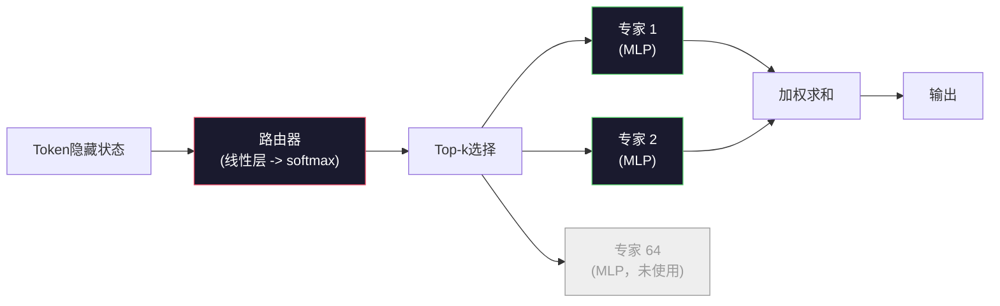

# 开源模型：架构详解

> 你在第04课中从零构建了一个 GPT-2 Small。2026年的前沿开源模型属于同一家族，只做了五六个具体的调整。用 RMSNorm 替代 LayerNorm。用 SwiGLU 替代 GELU。用 RoPE 替代学习位置编码。用 GQA 或 MLA 替代全量多头注意力（MHA）。在大规模上使用专家混合（Mixture-of-Experts）。你已学会的数学覆盖了95%的内容。本课将 Llama 3、DeepSeek-V3、Mixtral、Qwen 和 Gemma 并排阅读，指出每个架构具体差异的精确代码行。

**类型:** 学习  
**语言:** Python（标准库）  
**先决条件:** 阶段10，第04、05、12课（预训练、扩展、推理）  
**时长:** 约45分钟

## 学习目标

- 阅读 Llama 3、Mistral、Mixtral、Gemma 2、Qwen 2.5 和 DeepSeek-V3 的 config.json，解释每个字段含义
- 指出每个模型相较于 GPT-2 Small 的具体架构变更，并从原理上说明理由
- 仅凭配置计算任何开源模型的参数量、KV缓存大小和激活内存  
- 根据延迟、内存和能力限制为部署目标选出合适的开源模型

## 问题描述

在第04课你写了350行numpy代码，得到了一个GPT-2形状的模型。Llama 3 405B 有一本200页的技术报告。你的直觉是它们是不同的物种。实际上并不是。那200页描述的是带有五六个充分理由修改的同一对象，加上一千条关于扩展的实现细节。骨架——词嵌入、变换器块、注意力、MLP、归一化、头部——保持不变。

本课是个差异比较。对每个主流开源模型家族，我们列出相较 GPT-2 发生了何种改动，为何改动，代价是什么。学完后你能读懂一张全新模型卡，脑中自动转换回 GPT-2 基线。

实际收益是，当 Meta 发布 Llama 5 或 DeepSeek 发布 V4 时，你无需新的心智模型。你看配置即可知晓调节了哪些知名“旋钮”，预测下游影响。2026年的架构是有限的工具箱，每个新模型选用其中不同子集。

## 核心概念

### 不变的核心

所有自回归开源模型共有：

- 词汇表大小 × 隐藏维度的词嵌入矩阵。
- N层解码器堆栈：归一化、自注意力、残差、归一化、MLP、残差。
- 最终归一化和线性头，投影到词汇表大小（通常和嵌入权重共享）。
- 因果遮罩（causal mask）、下一个词交叉熵损失。

这是模型基本形状。其余都是参数调节“旋钮”。

### 六大关键“旋钮”

2024至2026年各大前沿开源模型反复选用同样六个设计选择：

1. **归一化（Normalization）**：LayerNorm 替换为 RMSNorm。
2. **位置编码（Positional encoding）**：学习的绝对位置编码替换为 RoPE（含变体 YaRN，NTK）。
3. **激活函数（Activation）**：GELU 替换为 SwiGLU（或 GeGLU）。
4. **注意力头共享（Attention head sharing）**：MHA → GQA → MQA → MLA。
5. **稠密与稀疏 MLP（Dense vs sparse MLP）**：稠密 MLP 替换为 Mixture-of-Experts。
6. **预归一化位置（Pre-norm placement）**：保留预归一化，去除后归一化。

其它（学习率调度、数据混合、批大小、上下文长度）属于训练配置，不算架构。唯此六旋钮。

### 旋钮1：RMSNorm

LayerNorm 减去均值，除以标准差，再缩放和偏移。RMSNorm 仅保留缩放：

```text
RMSNorm(x) = x / sqrt(mean(x^2) + eps) * gamma
```

无减均值，无偏置。每个token少一个矩阵乘法。Zhang 和 Sennrich（2019）证明其在机器翻译任务中性能相当，而快约10%。每个现代开源模型都用了它。

代价：无。收益：轻微吞吐提升，代码更简洁。

### 旋钮2：RoPE

GPT-2中学习位置嵌入是1024长度查表。1285的上下文位置超表外。模型无法推断超训练长度外输入。

Rotary Position Embedding（RoPE，Su等2021）通过在注意力点积前，将Q、K向量成对旋转引入位置信息。旋转角度是位置的确定函数，无需学习且不会越界。结合缩放技巧（如 NTK-aware 插值、YaRN），训练8k上下文的模型推理时可扩展到128k，精度损失有限。

```text
q_rotated = rotate(q, angle(pos))
k_rotated = rotate(k, angle(pos))
score = q_rotated · k_rotated
```

所有 Llama、Mistral、Qwen、DeepSeek、Gemma 都用 RoPE。Gemma 2使用混合方案（大部分层用 RoPE，部分层用局部滑动窗口注意力）。

### 旋钮3：SwiGLU

GPT-2的MLP是 `x -> gelu(xW1 + b1) -> ... W2 + b2`。SwiGLU（Shazeer 2020）替换为门控乘积：

```text
SwiGLU(x) = (xW1) * sigmoid(xW1) * xV
```

两个投影并行，使用 Swish 激活门控。参数效率更优。Llama 2采用，业界跟进。MLP隐藏层大小通常设为总参数匹配原稠密MLP：如果 GPT-2 用 `ff_dim = 4 * hidden`，SwiGLU 用 `ff_dim = (2/3) * 4 * hidden = 8/3 * hidden`。

### 旋钮4：注意力头共享

GPT-2用**多头注意力（MHA）**：每个头有独立Q、K、V。

**多查询注意力（MQA，Shazeer 2019）**所有头共享一个K和一个V。KV缓存减少 num_heads 倍，通常为12到32倍减少。硬基准准确度稍降。

**分组查询注意力（GQA，Ainslie等2023）**介于两者之间：G组Q头共享一组K和V。Llama 3 8B用32 Q头和8 KV头（G=8），KV缓存缩小4倍。

**多头潜在注意力（MLA，DeepSeek 2024）**将K、V压缩成共享低秩潜在向量，每个头再投影回去。KV缓存更小，保留每头表达力。DeepSeek-V2和V3依赖此实现长上下文性能。

| 方案   | KV头数量           | KV缓存          | 准确度   |
|--------|---------------------|-----------------|----------|
| MHA    | num_heads            | 全量            | 最佳     |
| GQA    | num_groups（G < num_heads）| KV缓存减少 num_heads / G 倍 | 接近MHA  |
| MQA    | 1                    | KV缓存减少 num_heads 倍       | 小幅下降 |
| MLA    | 潜在变量，头内解压    | 比 MQA 更小      | 接近MHA  |

超过13B参数的模型基本必须用GQA或MLA。大规模全MHA是KV缓存灾难。

### 旋钮5：专家混合（Mixture of Experts）

稠密MLP对每个token激活全部参数。MoE MLP有 K 个专家，每个token路由器选前k（通常top-2）专家激活，只有这些专家的权重参与前向。

```text
router_logits = xW_r
indices, weights = top_k(router_logits, k=2)
output = sum_i weights[i] * expert[indices[i]](x)
```

优点：参数多，计算量与稠密模型相当。Mixtral 8x7B总参数47B，每token只激活13B。DeepSeek-V3总参数671B，每token只激活37B。



优点：计算量不变，参数翻倍，容量更强。缺点：专家权重仍占内存（部署时需要比等效稠密模型更多显存），路由器负载平衡难，微调路由器需额外研究。

### 旋钮6：预归一化保留

原始 Transformer 在每个子层后应用 LayerNorm。自 GPT-2 起所有开源模型均在子层*前*归一化。预归一化训练更深层Transformer更稳定，无争论。

### 模型差异详情

具体如下表体现。

| 模型           | 年份 | 总参数   | 激活参数 | 归一化        | 激活函数 | 位置编码          | 注意力        | MoE                | 上下文长度 |
|----------------|------|----------|----------|---------------|----------|-------------------|---------------|--------------------|------------|
| GPT-2 Small    | 2019 | 1.24亿   | 1.24亿   | LayerNorm     | GELU     | Learned           | MHA (12头)    | 无                 | 1k         |
| Llama 3 8B    | 2024 | 80亿     | 80亿     | RMSNorm       | SwiGLU   | RoPE              | GQA (32/8)    | 无                 | 128k       |
| Llama 3 70B   | 2024 | 700亿    | 700亿    | RMSNorm       | SwiGLU   | RoPE              | GQA (64/8)    | 无                 | 128k       |
| Llama 3 405B  | 2024 | 4050亿   | 4050亿   | RMSNorm       | SwiGLU   | RoPE              | GQA (128/16)  | 无                 | 128k       |
| Mistral 7B    | 2023 | 72亿     | 72亿     | RMSNorm       | SwiGLU   | RoPE              | GQA           | 无                 | 32k        |
| Mixtral 8x7B  | 2023 | 470亿    | 130亿    | RMSNorm       | SwiGLU   | RoPE              | GQA           | 是（8专家，top-2） | 32k        |
| Gemma 2 9B    | 2024 | 90亿     | 90亿     | RMSNorm（前后）| GeGLU    | RoPE+滑动窗口      | GQA           | 无                 | 8k         |
| Qwen 2.5 72B  | 2024 | 720亿    | 720亿    | RMSNorm       | SwiGLU   | RoPE（YaRN）      | GQA (64/8)    | 无                 | 128k       |
| DeepSeek V2 236B | 2024 | 2360亿  | 210亿    | RMSNorm       | SwiGLU   | RoPE              | MLA           | 是（160专家，top-6）| 128k       |
| DeepSeek V3    | 2024 | 6710亿   | 370亿    | RMSNorm       | SwiGLU   | RoPE              | MLA           | 是（256专家，top-8）| 128k       |

扫视表格可见：RMSNorm通用。SwiGLU或近亲GeGLU通用。RoPE通用。7B以上普遍用GQA，除非用MLA。MoE 是顶端区别。

### 读取 config.json

以 Llama 3 8B 配置为例：

```json
{
  "hidden_size": 4096,
  "intermediate_size": 14336,
  "num_hidden_layers": 32,
  "num_attention_heads": 32,
  "num_key_value_heads": 8,
  "max_position_embeddings": 131072,
  "rope_theta": 500000.0,
  "rms_norm_eps": 1e-5,
  "vocab_size": 128256
}
```

每个字段对应你已实现的内容：

- `hidden_size`：嵌入维度。
- `intermediate_size`：MLP隐藏层大小（3.5倍hidden尺寸——SwiGLU数学）。
- `num_hidden_layers`：堆叠层数。
- `num_attention_heads`：Q头数量。
- `num_key_value_heads`：KV头数量（GQA）。
- `max_position_embeddings`：训练上下文长度。
- `rope_theta`：RoPE基频。Meta为长上下文外推从默认1万调到50万。
- `rms_norm_eps`：数值稳定项。
- `vocab_size`：词汇表大小。

仅凭这些参数你即可计算总参数数、KV缓存大小和峰值激活内存。具体公式见 `code/main.py`。

### 激活内存预算

激活是数十亿参数以上模型训练时内存主因。预训练（带梯度检查点）的估算法则：

```text
activation_mem ~ batch_size * seq_len * hidden_size * num_layers * bytes_per_element
```

以 Llama 3 8B，batch=1，seq=8192，BF16格式，32层，hidden=4096为例：用checkpoint约8 GB激活内存，无checkpoint约40 GB。这也是 flash-attention 和 ring-attention 受重视原因，它们重写注意力计算使激活内存可控。

### KV缓存预算

最大上下文推理中：

```text
kv_cache = 2 * num_layers * num_kv_heads * head_dim * max_seq_len * bytes_per_element
```

Llama 3 8B，128k上下文，BF16，head_dim = hidden / num_heads = 128：

`2 * 32 * 8 * 128 * 131072 * 2 = 17.2 GB`，每条序列。

8B 权重在 BF16 格式下占用 16 GB。单个 128k 序列的 KV cache 的大小超过了权重。这就是驱动 GQA、MLA 和 KV cache 量化研究的内存压力来源。

### 每种模型的优势场景

- **单张 80GB GPU，无 MoE**：Llama 3 8B，Mistral 7B，Gemma 2 9B。易于部署，工具支持广泛。
- **单节点（8x80GB），大容量**：Llama 3 70B，Qwen 2.5 72B。最高的稠密（dense）开源能力。
- **最大开源能力，接受 MoE 复杂度**：DeepSeek V3，Mixtral 8x22B。每单位活跃 FLOP 最佳能力。
- **长上下文需求**：Llama 3（128k 带 RoPE 缩放），DeepSeek（MLA 优势）。
- **低延迟服务**：Gemma 2 9B（滑动窗口减少长上下文计算）。

## 构建它

本课代码是一个计算器。给定任意 `config.json`，它打印各组件的参数数量、最大上下文的 KV cache、SwiGLU MLP 比例，以及对架构（稠密 / GQA / MLA / MoE）的简短点评。

```python
config = {
    "hidden_size": 4096, "intermediate_size": 14336,
    "num_hidden_layers": 32, "num_attention_heads": 32,
    "num_key_value_heads": 8, "vocab_size": 128256,
    "max_position_embeddings": 131072,
}
```

脚本逐字段遍历架构，计算嵌入层、注意力（含 GQA 减少）、MLP（含 SwiGLU 扩张）、层归一化和头部的参数数量。然后根据信息计算指定上下文长度下的 KV cache 并打印总结。

实现见 `code/main.py`。

## 使用它

在脚本中附带的 Llama 3 8B、Mistral 7B、Mixtral 8x7B 和 DeepSeek V3 配置上运行计算器。对比参数细分。注意 MoE 模型总参数远超稠密模型，但活跃参数通常更少。注意 DeepSeek V3 的 KV cache 小于 Llama 3 405B 虽然其总参数更多——这就是 MLA 的体现。

然后插入你本地任意模型的配置，查看总结，决定是否适合你的 GPU。

## 部署它

本课生成 `outputs/skill-open-model-picker.md`。给定部署目标（GPU 类型、显存、上下文长度、延迟预算）和任务配置（聊天、代码、推理、长上下文），它推荐一个开源模型、Lesson 11 的量化方案和 Lesson 12 的推理堆栈，并对六个架构旋钮进行明确推理。

## 练习

1. 从 HuggingFace 读取 Qwen 2.5 72B 配置。从头计算总参数。与 HF 报告值比较，找出差异来源（头维度取整、KV 共享因子等）。

2. DeepSeek V3 使用 256 个专家，top-8 路由。计算激活专家与总专家的比例，并与 Mixtral 8x7B 的 top-2/8 比较。从稀疏（25%）转向更密集稀疏（3%）对每 FLOP 容量意味着什么？

3. 计算 Llama 3 405B 在 128k 上下文下的 FP8 和 BF16 KV cache。FP8 是 BF16 的一半。在单个 8xH100 节点（80GB x8 = 640GB 显存，减去权重内存）上可服务多少并行序列？

4. Gemma 2 交替使用全注意力和滑动窗口注意力层。写出半数层使用 4096-token 滑动窗口替代全上下文时 KV cache 的计算方法。在 8k 总上下文中节省多少内存？

5. 找一个本课程撰写后发布的最新前沿开源模型。识别其选用的六个旋钮中哪些，以及是否引入了第七个旋钮。课程内容一旦有新架构发布就会显得过时——目标是在不重建认知模型的前提下更新你的表格。

## 关键词

| 术语       | 常见说法                     | 实际含义                                               |
|------------|------------------------------|--------------------------------------------------------|
| RMSNorm    | “没有均值的 LayerNorm”       | 仅通过均方根（root mean square）归一化，带学习缩放因子 —— 更廉价且性能可比 LayerNorm |
| RoPE       | “旋转位置编码”               | 在二维对中旋转每个 Q 和 K 向量，角度依位置变化 —— 利用缩放技巧超出训练长度推断       |
| SwiGLU     | “新型 MLP 激活函数”          | 带 Swish 门控线性单元 `(xW1) * sigmoid(xW1) * xV` —— 2024+ 开源模型标配            |
| GQA        | “中间态注意力”               | Grouped-Query Attention：G 组 Q 头共享一个 K 和一个 V 头 —— 缩小 KV cache 且无 MQA 的准确率损失 |
| MLA        | “DeepSeek 的注意力”          | 多头潜在注意力：将 K/V 压缩为共享低秩潜在空间，每头解压 —— 大模型最小 KV cache       |
| MoE        | “稀疏专家”                   | Mixture of Experts：每个块有 N 个 MLP，路由器为每个 token 选 top-k —— 总参数巨大，活跃参数小  |
| Top-k routing | “每 token 选择 k 个专家”   | 路由器计算每个专家分数，激活分数最高的 k 个 —— 常见 k 从 2（Mixtral）到 8（DeepSeek）  |
| YaRN       | “RoPE 的扩展”                | 又一种 RoPE 扩展 —— 通过插值旋转角度将上下文从 8k 扩展到 128k+ 推理时使用           |
| 滑动窗口注意力 | “不对全部 token 注意”      | 每个 token 仅关注最近 W 个 token —— 将注意力成本限制为每 token O(W)，Gemma 2 和早期 Mistral 使用  |
| 活跃参数   | “每 token 激活的参数量”       | MoE 模型中，参与每 token 前向的参数数（远小于总参数） —— 决定每 token FLOP 消耗       |

## 延伸阅读

- [Dubey 等, 2024 — “Llama 3 模型族”](https://arxiv.org/abs/2407.21783) — 稠密 Llama 3 家族的架构和训练参考
- [DeepSeek-AI, 2024 — “DeepSeek-V3 技术报告”](https://arxiv.org/abs/2412.19437) — MLA，附加无辅助损失负载均衡，671B MoE
- [Jiang 等, 2024 — “Mixtral 专家混合”](https://arxiv.org/abs/2401.04088) — 标准 MoE 开源模型论文
- [Su 等, 2021 — “RoFormer：旋转位置编码增强 Transformer”](https://arxiv.org/abs/2104.09864) — RoPE 论文
- [Shazeer, 2020 — “GLU 变种提升 Transformer”](https://arxiv.org/abs/2002.05202) — SwiGLU、GeGLU 及其变体
- [Ainslie 等, 2023 — “GQA：训练泛化多查询 Transformer”](https://arxiv.org/abs/2305.13245) — GQA 论文
- [Gemma 2 团队, 2024 — “Gemma 2：实用规模下改善开源语言模型”](https://arxiv.org/abs/2408.00118) — 混合全注意力+滑动注意力，前后归一化
- [Qwen 团队, 2024 — “Qwen 2.5 技术报告”](https://arxiv.org/abs/2412.15115) — YaRN 上下文扩展和长上下文训练方案
