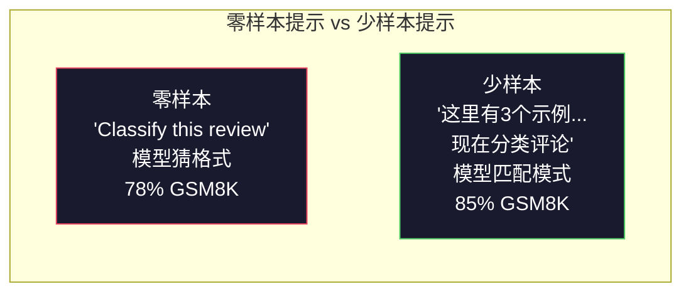
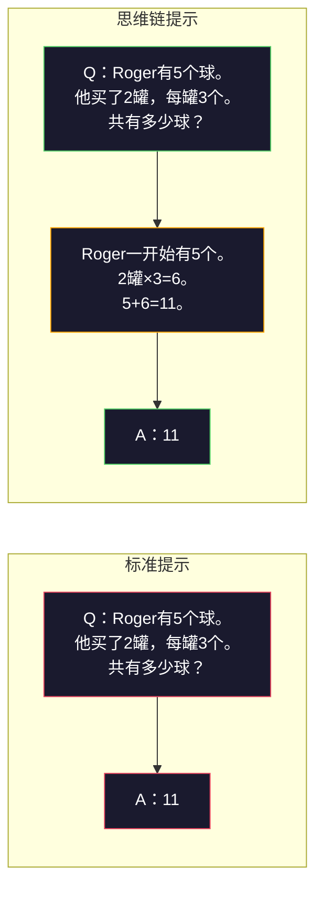
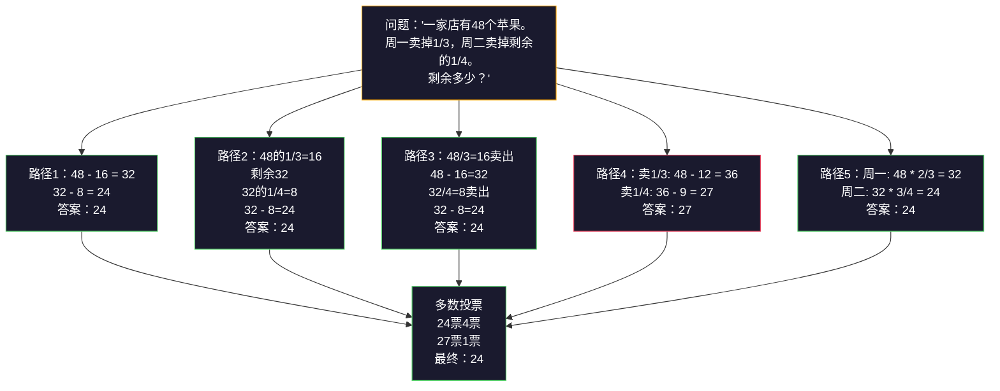
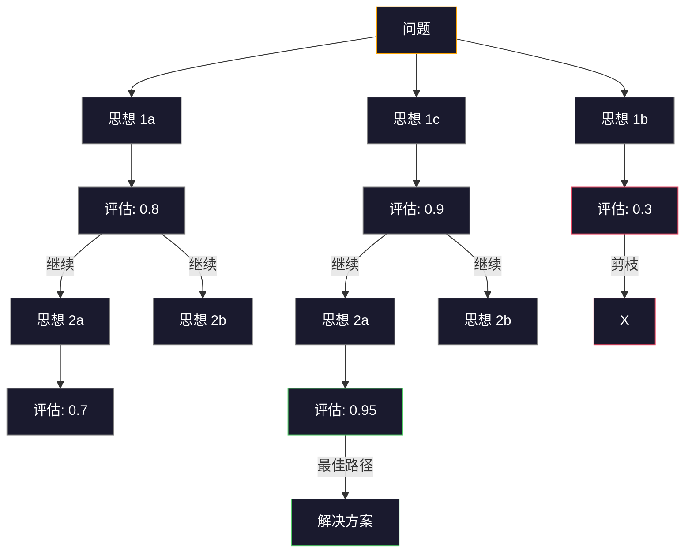

# Few-Shot, Chain-of-Thought, Tree-of-Thought

> 告诉模型做什么叫做提示（prompting）。展示它如何思考是工程（engineering）。在同一模型、同一任务、同一数据上从78%到91%的准确率差距，不是更好的模型，而是更好的推理策略。

**类型:** 构建  
**语言:** Python  
**先决条件:** 课程 11.01（提示工程（Prompt Engineering））  
**时间:** ~45 分钟

## 学习目标

- 通过选择和格式化示例演示实现 few-shot prompting（少量演示提示）以最大化任务准确率  
- 应用 chain-of-thought（CoT，思维链）推理提升多步骤问题（如数学文字题）的准确率  
- 构建 tree-of-thought（ToT，思维树）提示以探索多个推理路径并选择最佳路径  
- 测量零-shot、few-shot和CoT在标准基准上的准确率提升

## 问题描述

你开发了一个数学辅导应用。你的提示是：“Solve this word problem.” GPT-5 在 GSM8K（标准小学数学基准）上正确率为94%，你以为已经达到顶峰了。其实未然——chain-of-thought 仍能带来3-4个百分点的提升。

只需增加五个词——“Let's think step by step（让我们一步步思考）”——准确率跳到91%。加上几个示例计算过程，准确率达95%。同一模型、同一温度、同一API成本，唯一不同是你给了模型“草稿纸”。

这不是技巧，而是推理本身的运作方式。人类不会一步跳完多步骤问题。Transformer（Transformer架构）也不会。当你强迫模型生成中间 token，这些 token 成为下一 token 的上下文。每一步推理以计算方式推进到答案。

但“step by step”只是开始，不是终点。假如你采样五路推理路径，取多数投票？假如你让模型探索一颗可能性的树，评估并剪枝分支？假如你把推理和工具使用交错？这都不是假设，而是已发表的技术并有明确提升，你将在本课构建所有这些。

## 概念说明

### Zero-Shot vs Few-Shot：何时示例胜于指令

Zero-shot prompting（零样本提示）只给模型任务；few-shot prompting（少样本提示）先给示例。

Wei等（2022）在8个基准上测评。简单任务如情感分类，零样本和少样本相差不到2%。复杂任务如多步算术和符号推理，少样本能提升10-25%。

直觉：示例是压缩的指令。不是告诉输出格式，而是展示。不是解释推理过程，而是示范。模型基于实例更可靠地匹配模式，比解读抽象指令强。



**少样本胜出时机：** 格式敏感任务、分类、结构抽取、领域术语、模型需匹配具体模式的任务。

**零样本胜出时机：** 简单事实问答、示例限制创造力的创意任务、找不到好示例但能写好指令的任务。

### 示例选择：相似优于随机

示例不全然平等。选择与目标输入相似的示例，比随机选出在分类任务上优越5-15%（Liu等，2022）。三大原则：

1. **语义相似度**：挑选嵌入空间中最靠近输入的示例  
2. **标签多样性**：覆盖输出类别全范围  
3. **难度匹配**：匹配目标问题的复杂度

大多数任务最佳示例数为3-5。少于3信号太弱、难提取模式。超过5回报递减且浪费上下文窗口。多标签分类至少每标签一示例。

### Chain-of-Thought：给模型草稿纸

Chain-of-Thought（CoT）提示由Wei等（2022）在谷歌大脑提出。思路简单：不只求答案，还让模型先展示推理步骤。



为何有效？Transformer 生成的每个 token 都成为下一 token 的上下文。无 CoT，模型需将所有推理压缩至一次前向隐状态。用 CoT，模型将中间计算外显为 token，每步推理延长有效计算深度。

**GSM8K基准（小学数学，8.5K题）：**

| 模型 | 零样本 | 零样本CoT | 少样本CoT |
|-------|-----------|---------------|--------------|
| GPT-4o | 78% | 91% | 95% |
| GPT-5 | 94% | 97% | 98% |
| o4-mini（推理） | 97% | — | — |
| Claude Opus 4.7 | 93% | 97% | 98% |
| Gemini 3 Pro | 92% | 96% | 98% |
| Llama 4 70B | 80% | 89% | 94% |
| DeepSeek-V3.1 | 89% | 94% | 96% |

**关于推理模型**：OpenAI的o系列（o3, o4-mini）和DeepSeek-R1在回答前内部运行链式推理，附加“Let's think step by step”是多余且有时反效果——它们已做过推理。

CoT 两种形式：

**Zero-shot CoT（零样本思维链）**：向提示末尾追加“Let's think step by step”。无须示例。Kojima等（2022）显示此语句可提升算术、常识及符号推理准确度。

**Few-shot CoT（少样本思维链）**：提供含推理步骤的示例。比零样本CoT更有效，因模型见到期望推理格式。

**CoT不适用场景**：简单事实记忆（“法国首都是哪里？”）、单步分类、重视速度胜于准确性的任务。CoT 每次查询增加50-200个推理token，低复杂度高吞吐任务成本浪费。

### Self-Consistency：多采样多投票

Wang等（2023）提出 self-consistency（自洽性）。洞见是：单一路径CoT可能有错误。采样N条独立推理路径（用temperature > 0），以最终答案少数服从多数，错误会被抵消。



Self-consistency使GSM8K准确率由56.5%（单路径CoT）提升到74.4%（N=40，原PaLM 540B）。GPT-5提升不大（97%→98%），因基线已饱和。此技术对60-85%准确率模型效果最佳，即单路径错误较多但无系统性错误的区间。推理模型（o系列，R1）内置采样自带此特性。

代价：N倍API调用与延迟。实测N=5捕捉大部分优势。N=3为有效投票最小样本量。多数任务N>10回报递减。

### Tree-of-Thought：分支探索

Yao等（2023）提出 Tree-of-Thought（ToT，思维树）。CoT沿一条线性推理路径前进，ToT探索多分支并评估哪些更优再继续。



ToT 包含三部分：

1. **思想生成**：产生多个下一步候选  
2. **状态评估**：给候选打分（可用大模型自身作评估者）  
3. **搜索算法**：广度优先或深度优先搜索树状结构，剪枝低分支

“24点游戏”（四数加减乘除组成24）任务中，GPT-4 普通提示解出7.3%题，CoT仅4.0%（CoT此处反而拉低，因搜索空间广），ToT则达74%。

ToT成本高。树中每个节点调用一次大模型。分支因子为3，深度3，可达39次调用。只适合搜索空间大且可评估的问题——如规划、谜题解法、约束创意问题。

### ReAct：思考 + 行动

Yao 等人（2022）将推理轨迹与动作结合起来。模型在思考（生成推理）和行动（调用工具、搜索、计算）之间交替进行。


ReAct 在以知识为密集的任务中优于纯 CoT（chain-of-thought 链式思维），因为它能基于真实数据来支撑推理。在 HotpotQA（多跳问答）任务中，使用 GPT-4 的 ReAct 达到 35.1% 的准确匹配率，而单纯 CoT 为 29.4%。真正的优势是推理错误可以通过观察结果纠正—模型能在执行过程中更新计划。

ReAct 是现代 AI agent（智能代理）的基础。所有代理框架（如 LangChain、CrewAI、AutoGen）都实现了某种形式的思考-行动-观察循环。你将在第 14 阶段构建完整的智能代理。本节课讲述的是提示（prompting）模式。

### 结构化提示：XML 标签、分隔符、标题

随着提示越来越复杂，结构化能防止模型混淆不同部分。有三种方式：

**XML 标签**（在 Claude 上效果最好，其他场景也很稳健）：
```text
<context>
你正在审查一个 pull request。
代码库使用 TypeScript 和 React。
</context>

<task>
请检查以下 diff，寻找漏洞、安全问题和样式违规。
</task>

<diff>
{diff_content}
</diff>

<output_format>
列出每个问题：文件，行号，严重性（关键/警告/信息），描述。
</output_format>
```

**Markdown 标题**（通用方案）：
```text
## 角色
一家金融科技公司的高级安全工程师。

## 任务
分析该 API 端点的漏洞。

## 输入
{api_code}

## 规则
- 重点关注 OWASP Top 10
- 对每个发现评等级：关键、高、中、低
- 包含修复建议
```

**分隔符**（简单但有效）：
```text
---INPUT---
{user_text}
---END INPUT---

---INSTRUCTIONS---
用三个要点总结上述内容。
---END INSTRUCTIONS---
```

### 提示链（Prompt Chaining）：顺序分解

有些任务对单个提示来说过于复杂。提示链将任务分解成多个步骤，每个步骤的输出作为下一个步骤的输入。


链式提示优于单提示的三个原因：

1. **每一步更简单**：模型只需要处理一个聚焦任务，而非兼顾所有内容
2. **中间输出可检查**：你可以在步骤之间验证和修正
3. **不同步骤可用不同模型**：用便宜模型做提取，用昂贵模型做推理

### 性能对比

| 技术 | 适用场景 | GSM8K 准确率（GPT-5） | API 调用次数 | 令牌开销 | 复杂度 |
|-----------|----------|------------------------|-----------|----------------|------------|
| Zero-Shot（零样本） | 简单任务 | 94% | 1 | 无 | 简单 |
| Few-Shot（少样本） | 格式匹配 | 96% | 1 | 200-500 令牌 | 低 |
| Zero-Shot CoT（零样本链式思维） | 快速提升推理 | 97% | 1 | 50-200 令牌 | 简单 |
| Few-Shot CoT（少样本链式思维） | 单次调用最高准确率 | 98% | 1 | 300-600 令牌 | 低 |
| Self-Consistency (N=5)（自洽性，5次采样） | 高风险推理 | 98.5% | 5 | 5倍令牌成本 | 中等 |
| Reasoning model (o4-mini)（推理模型替代CoT） | 直接替代CoT | 97% | 1 | 隐藏（2-10倍内部开销） | 简单 |
| Tree-of-Thought（思维树） | 搜索/规划问题 | N/A（Game of 24: 74%） | 10-40+ | 10-40倍令牌成本 | 高 |
| ReAct | 知识支撑推理 | N/A（HotpotQA: 35.1%） | 3-10+ | 可变 | 高 |
| Prompt Chaining（提示链） | 复杂多步任务 | 96%（流水线） | 2-5 | 2-5倍令牌成本 | 中等 |

选用哪种技术取决于三个因素：准确率需求、延迟预算和成本容忍度。大多数生产系统使用少样本 CoT 并结合 3 样本自洽性回退即可覆盖 90% 应用场景。

## 实践构建

我们将构建一个数学问题求解器，结合少样本提示、链式思维推理和自洽性投票于一体的流水线。后续会加入思维树以解决更难问题。

完整实现见 `code/advanced_prompting.py`。以下是关键组件。

### 第一步：少样本示例库

该组件管理少样本示例，并选出与当前问题最相关的示例。

```python
GSM8K_EXAMPLES = [
    {
        "question": "Janet 的鸭子每天下来 16 个蛋。她每天早晨早餐吃三个，给朋友们烤松饼用了四个。她在农贸市场以每个 $2 的价格卖出所有蛋。她每天在农贸市场赚多少钱？",
        "reasoning": "Janet 的鸭子每天下 16 个蛋。她吃了 3 个，烤松饼用了 4 个，总共用了 3 + 4 = 7 个蛋。所以剩下 16 - 7 = 9 个蛋。每个卖 $2，收入是 9 * 2 = $18 每天。",
        "answer": "18"
    },
    ...
]
```

每个示例包含三个部分：问题、推理链和最终答案。推理链是把普通少样本示例升级为链式思维少样本示例的关键。

### 第二步：链式思维提示构建器

提示构建器将系统消息、带推理链的示例以及目标问题拼接成一个完整的提示。

```python
def build_cot_prompt(question, examples, num_examples=3):
    system = (
        "你是一个数学问题求解器。"
        "对每个问题展示逐步推理，"
        "然后在最后一行给出最终的数字答案，"
        "格式为：‘The answer is [数字]’。"
    )

    example_text = ""
    for ex in examples[:num_examples]:
        example_text += f"Q: {ex['question']}\n"
        example_text += f"A: {ex['reasoning']} The answer is {ex['answer']}.\n\n"

    user = f"{example_text}Q: {question}\nA:"
    return system, user
```

格式约束（“The answer is [数字]”）非常关键。没有它，自洽性投票无法从多个示例中提取和比较答案。

### 第三步：自洽性投票

采样 N 条推理路径，取多数答案。

```python
def self_consistency_solve(question, examples, client, model, n_samples=5):
    system, user = build_cot_prompt(question, examples)

    answers = []
    reasonings = []
    for _ in range(n_samples):
        response = client.chat.completions.create(
            model=model,
            messages=[
                {"role": "system", "content": system},
                {"role": "user", "content": user}
            ],
            temperature=0.7
        )
        text = response.choices[0].message.content
        reasonings.append(text)
        answer = extract_answer(text)
        if answer is not None:
            answers.append(answer)

    vote_counts = Counter(answers)
    best_answer = vote_counts.most_common(1)[0][0] if vote_counts else None
    confidence = vote_counts[best_answer] / len(answers) if best_answer else 0

    return best_answer, confidence, reasonings, vote_counts
```

温度 0.7 很重要。温度设置为 0.0 时，N 个采样完全相同，失去多样性。需要足够随机性产生不同推理路径，但不能太乱产生无意义结果。

### 第四步：思维树求解器

对线性推理失败的问题，ToT（tree-of-thought 思维树）探索多个思路，评估哪个方向最有前景。

```python
def tree_of_thought_solve(question, client, model, breadth=3, depth=3):
    thoughts = generate_initial_thoughts(question, client, model, breadth)
    scored = [(t, evaluate_thought(t, question, client, model)) for t in thoughts]
    scored.sort(key=lambda x: x[1], reverse=True)

    for current_depth in range(1, depth):
        next_thoughts = []
        for thought, score in scored[:2]:
            extensions = extend_thought(thought, question, client, model, breadth)
            for ext in extensions:
                ext_score = evaluate_thought(ext, question, client, model)
                next_thoughts.append((ext, ext_score))
        scored = sorted(next_thoughts, key=lambda x: x[1], reverse=True)

    best_thought = scored[0][0] if scored else ""
    return extract_answer(best_thought), best_thought
```

评估器本身是一个 LLM 调用。你问模型：“请给这个推理路径解决问题的前景打分，范围 0.0 到 1.0。”这是思维树的关键洞见——模型评估自己的部分解。

### 第五步：完整流水线

流水线结合所有技术，并支持升级策略。

```python
def solve_with_escalation(question, examples, client, model):
    system, user = build_cot_prompt(question, examples)
    single_response = call_llm(client, model, system, user, temperature=0.0)
    single_answer = extract_answer(single_response)

    sc_answer, confidence, _, _ = self_consistency_solve(
        question, examples, client, model, n_samples=5
    )

    if confidence >= 0.8:
        return sc_answer, "self_consistency", confidence

    tot_answer, _ = tree_of_thought_solve(question, client, model)
    return tot_answer, "tree_of_thought", None
```

升级逻辑是：先尝试便宜的单次 CoT。如果自洽性置信度低于 0.8（5 个采样中少于 4 个一致），则升级为思维树方法。这平衡了成本和准确率——大多数问题低成本解决，复杂问题投入更多计算资源。

## 使用方法

### 使用 LangChain

LangChain 提供内置支持的提示模板和输出解析，简化少样本和 CoT 模式：

```python
from langchain_core.prompts import FewShotPromptTemplate, PromptTemplate
from langchain_openai import ChatOpenAI

example_prompt = PromptTemplate(
    input_variables=["question", "reasoning", "answer"],
    template="Q: {question}\nA: {reasoning} The answer is {answer}."
)

few_shot_prompt = FewShotPromptTemplate(
    examples=examples,
    example_prompt=example_prompt,
    suffix="Q: {input}\nA: Let's think step by step.",
    input_variables=["input"]
)

llm = ChatOpenAI(model="gpt-4o", temperature=0.7)
chain = few_shot_prompt | llm
result = chain.invoke({"input": "If a train travels 120 km in 2 hours..."})
```

LangChain 还提供了用于语义相似性选择的 `ExampleSelector` 类：

```python
from langchain_core.example_selectors import SemanticSimilarityExampleSelector
from langchain_openai import OpenAIEmbeddings

selector = SemanticSimilarityExampleSelector.from_examples(
    examples,
    OpenAIEmbeddings(),
    k=3
)
```

### 使用 DSPy

DSPy 将提示策略视为可优化模块。您无需手工设计链式思维（Chain of Thought, CoT）提示，而是定义签名，让 DSPy 优化提示：

```python
import dspy

dspy.configure(lm=dspy.LM("openai/gpt-4o", temperature=0.7))

class MathSolver(dspy.Module):
    def __init__(self):
        self.solve = dspy.ChainOfThought("question -> answer")

    def forward(self, question):
        return self.solve(question=question)

solver = MathSolver()
result = solver(question="Janet's ducks lay 16 eggs per day...")
```

DSPy 的 `ChainOfThought` 会自动添加推理轨迹。`dspy.majority` 实现了自洽性（self-consistency）：

```python
result = dspy.majority(
    [solver(question=q) for _ in range(5)],
    field="answer"
)
```

### 对比：从零开始实现 vs 框架

| 功能 | 从零开始（本课） | LangChain | DSPy |
|---------|--------------------------|-----------|------|
| 控制提示格式 | 完全控制 | 基于模板 | 自动化 |
| 自洽性 | 手动投票 | 手动 | 内置（`dspy.majority`） |
| 示例选择 | 自定义逻辑 | `ExampleSelector` | `dspy.BootstrapFewShot` |
| 思维树（Tree-of-Thought） | 自定义树搜索 | 社区链 | 非内置 |
| 提示优化 | 手动迭代 | 手动 | 自动编译 |
| 适合场景 | 学习，自定义管道 | 标准工作流程 | 研究，优化 |

## 发布成果

本课产生两个产物：

**1. 推理链提示模板（Reasoning Chain Prompt）** (`outputs/prompt-reasoning-chain.md`)：可用于生产环境的少样本 CoT 提示模板，支持自洽性。只需插入您的示例和问题领域。

**2. CoT 模式选择技能** (`outputs/skill-cot-patterns.md`)：一个决策框架，用于根据任务类型、准确率需求和成本约束选择合适的推理技术。

## 练习

1. **测量差距**：取 10 个 GSM8K 问题，分别用零样本、少样本、零样本 CoT 和少样本 CoT 进行解答。记录每种方法的准确率。哪种方法对您的模型提升最大？

2. **示例选择实验**：对同样的 10 个问题，比较随机示例选择和手工挑选相似示例。测量准确率差异。示例质量在哪个点比示例数量更重要？

3. **自洽性成本曲线**：在 20 个 GSM8K 问题上，分别以 N=1、3、5、7、10 执行自洽性采样。绘制准确率与成本（总标记数）的关系图。您的模型的曲线“拐点”在哪？

4. **构建 ReAct 循环**：用计算器工具扩展流程。当模型生成数学表达式时，使用 Python 的 `eval()` （沙箱中）执行，并将结果反馈回去。测量工具辅助推理是否优于纯 CoT。

5. **创意任务的思维树**：将思维树求解器调整用于创意写作任务：“写一个既幽默又悲伤的六字故事。”用大语言模型（LLM）作为评估器。分支探索是否比单次生成产出更佳创意结果？

## 关键词

| 术语 | 普通描述 | 实际含义 |
|------|----------|----------|
| 少样本提示（Few-shot prompting） | “给它一些示例” | 在提示中包含输入-输出示范，用以锚定模型输出格式和行为 |
| 链式思维（Chain-of-Thought） | “让它一步步思考” | 诱导模型生成中间推理标记，扩展模型有效计算过程，最终生成答案 |
| 自洽性（Self-Consistency） | “多次运行” | 在温度 > 0 下采样 N 条多样推理路径，通过多数投票选出最终答案 |
| 思维树（Tree-of-Thought） | “让它探索选项” | 结构化搜索推理分支，对每个部分解进行评估，仅扩展有前景路径 |
| ReAct | “思考 + 工具使用” | 在思维轨迹中交替执行外部动作（搜索、计算、调用 API），即思考-动作-观察循环 |
| 提示链（Prompt chaining） | “拆分步骤” | 将复杂任务分解为顺序提示，每个输出作为下个输入 |
| 零样本 CoT（Zero-shot CoT） | “只需加‘一步步思考’” | 在提示末尾附加推理触发短语，无需示例，依赖模型内隐推理能力 |

## 延伸阅读

- [Chain-of-Thought Prompting Elicits Reasoning in Large Language Models](https://arxiv.org/abs/2201.11903) -- Wei 等，2022。Google Brain 的原始 CoT 论文。阅读第 2-3 节了解核心结果。
- [Self-Consistency Improves Chain of Thought Reasoning in Language Models](https://arxiv.org/abs/2203.11171) -- Wang 等，2023。自洽性论文。表 1 包含所需所有数字。
- [Tree of Thoughts: Deliberate Problem Solving with Large Language Models](https://arxiv.org/abs/2305.10601) -- Yao 等，2023。思维树论文。第 4 节的 24 点游戏结果是亮点。
- [ReAct: Synergizing Reasoning and Acting in Language Models](https://arxiv.org/abs/2210.03629) -- Yao 等，2022。现代 AI 代理的基础。第 3 节解释了思考-动作-观察循环。
- [Large Language Models are Zero-Shot Reasoners](https://arxiv.org/abs/2205.11916) -- Kojima 等，2022。“让我们一步步思考”论文。简单却非常有效。
- [DSPy: Compiling Declarative Language Model Calls into Self-Improving Pipelines](https://arxiv.org/abs/2310.03714) -- Khattab 等，2023。将提示视为编译问题。想超越手工提示工程建议阅读。
- [OpenAI — Reasoning models guide](https://platform.openai.com/docs/guides/reasoning) -- 官方指南，说明链式思维什么时候成为“内部、按标记计费”的推理模式，何时仅是提示技巧。
- [Lightman et al., "Let's Verify Step by Step" (2023)](https://arxiv.org/abs/2305.20050) -- 过程奖励模型（PRM），给链中每一步评分；成功的推理监督信号。
- [Snell et al., "Scaling LLM Test-Time Compute Optimally" (2024)](https://arxiv.org/abs/2408.03314) -- 系统研究 CoT 长度、自洽性采样和蒙特卡洛树搜索（MCTS）；“一步步思考”在准确率比延迟更重要时走向何方。
