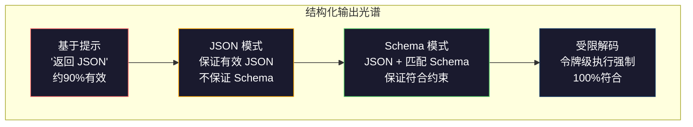
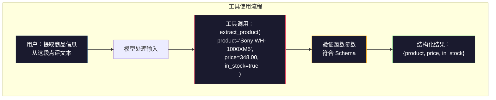

# 结构化输出：JSON、Schema 验证、受限解码

> 你的大语言模型（LLM）返回了一个字符串，而你的应用需要 JSON。这个差距导致的崩溃比模型幻觉还要多得多。结构化输出是自然语言和类型化数据之间的桥梁。做对了，你的 LLM 就变成了一个可靠的 API。做错了，你就在凌晨三点用正则表达式解析自由文本。

**类型：** 构建  
**语言：** Python  
**先决条件：** 第10阶段，第01-05课（从零构建大语言模型）  
**时间：** 约90分钟  
**相关内容：** 第5阶段·20课（结构化输出与受限解码）涵盖了解码器级别的理论（有限状态机/上下文无关文法（FSM/CFG）对数处理器、大纲（Outlines）、XGrammar）。本课侧重于生产级 SDK 接口（OpenAI 的 `response_format`、Anthropic 的工具调用、Instructor）— 如果你想理解 API 底层发生了什么，先读第5阶段·20课。

## 学习目标

- 使用 OpenAI 和 Anthropic API 参数实现 JSON 模式和基于 Schema 的受限输出
- 构建 Pydantic 验证层，拒绝格式错误的 LLM 输出并带错误反馈重试
- 解释如何通过受限解码在令牌层面强制生成有效 JSON，避免后处理
- 设计健壮的抽取提示，从非结构化文本可靠地转换为类型化数据结构

## 问题描述

你问 LLM：“从这段文本中提取产品名称、价格和库存状态。”它回答：

```text
The product is the Sony WH-1000XM5 headphones, which cost $348.00 and are currently in stock.
```

这是完全正确的答案，但对你的应用来说毫无用处。你的库存系统需要的是 `{"product": "Sony WH-1000XM5", "price": 348.00, "in_stock": true}`。你需要带特定键名、特定类型及特定值约束的 JSON 对象，而不是一句话。

最简单的方案是在提示里加“用 JSON 格式回答”。这种方法 90% 时候有效，但剩下 10% 模型会把 JSON 包裹在 markdown 代码块里，或者添加诸如“这是 JSON：”的前缀，还可能生成语法错误的 JSON（比如括号缺失）。你的 JSON 解析器崩溃了，管道断了。你加上 try/except 和重试循环，但重试有时会返回不同的数据。现在你面临比解析错误更严重的一致性问题。

这不是提示工程的问题，而是解码问题。模型从左到右生成令牌。每个位置它从十几万个词汇选项中挑选最可能的下一个令牌。大多数选项在当前位置会产生无效 JSON。比如模型刚输出 `{"price":`，下一个令牌必须是数字、引号（表示字符串）、`null`、`true`、`false` 或负号。其他任何令牌都会导致无效 JSON。如果没有约束，模型可能选择语法错误的词（虽然对英语语义合理）。

## 概念介绍

### 结构化输出光谱

结构化输出的控制力有四个级别，可靠性逐级提高。



**基于提示**（“请返回有效 JSON”）：无强制措施。模型通常能配合，但偶尔不行。可靠性约90%。失败模式包括 markdown 代码块、前缀文本、不完整输出、结构错误。

**JSON 模式**：API 保证输出符合 JSON 语法。OpenAI 的 `response_format: { type: "json_object" }` 开启该模式，输出可被无误解析。但不保证符合预期 Schema——可能多了字段、类型错、缺字段。

**Schema 模式**：API 接受 JSON Schema 并保证输出匹配。到了 2026 年，所有主流服务商均原生支持：OpenAI 的 `response_format: { type: "json_schema", json_schema: {...} }`（搭配 `tool_choice="required"`），Anthropic 的带 `input_schema` 的工具调用，Gemini 的 `response_schema` + `response_mime_type: "application/json"`。输出完全符合你指定的键名、类型和约束。

**受限解码**：生成过程中，解码器在每个令牌位置屏蔽所有可能导致无效输出的令牌。如果 Schema 要求数字，模型将无法输出字母。概率为零。模型只能产出符合有效结构的令牌。这就是 OpenAI 结构化输出模式及开源库如 Outlines、Guidance 的底层原理。

### JSON Schema：约定语言

JSON Schema 告诉模型（或验证层）输出的结构必须是什么样。每个主流结构化输出系统都用它。

```json
{
  "type": "object",
  "properties": {
    "product": { "type": "string" },
    "price": { "type": "number", "minimum": 0 },
    "in_stock": { "type": "boolean" },
    "categories": {
      "type": "array",
      "items": { "type": "string" }
    }
  },
  "required": ["product", "price", "in_stock"]
}
```

该 Schema 表示输出必须是一个对象，必须包含字符串字段 `product`，非负数字字段 `price`，布尔型字段 `in_stock`，可选的字符串数组字段 `categories`。不匹配此 Schema 的输出会被拒绝。

Schema 可以处理难点：嵌套对象、有类型元素的数组、枚举（限制字符串可选值）、模式匹配（字符串正则），以及组合器（oneOf、anyOf、allOf 实现多态结构）。

### Pydantic 模式

Python 中不用手写 JSON Schema。你定义 Pydantic 模型，它帮你生成 Schema。

```python
from pydantic import BaseModel

class Product(BaseModel):
    product: str
    price: float
    in_stock: bool
    categories: list[str] = []
```

这会生成与上面 JSON Schema 等价的 Schema。Instructor 库（以及 OpenAI SDK）支持直接接收 Pydantic 模型：传入模型类，返回验证过的实例。若 LLM 输出不符，Instructor 会自动重试。

### 函数调用 / 工具使用

解决同一问题的另一种接口。不是让模型直接生成 JSON，而是定义带有类型参数的“工具”（函数）。模型输出函数调用及结构化参数。OpenAI 称之为“函数调用”，Anthropic 称之为“工具使用”。结果一样：结构化数据。



当模型需选择调用哪个函数，而非仅填入参数时，工具使用更优。如果你有 10 个不同提取 Schema，模型需要根据输入选择合适的，这种方式同时实现 Schema 选择和结构化输出。

### 常见失败模式

即使有 Schema 约束，结构化输出仍有细微失败。

**幻觉值**：输出符合 Schema，但含有虚构数据。模型生成 `{"price": 299.99}`，而文本里标价是 348。Schema 无法捕获，类型正确但值错误。

**枚举混淆**：你限定字段值只能是 `["in_stock", "out_of_stock", "preorder"]`，模型输出了 `"available"`——语义上对，但不在允许范围内。良好的受限解码可防止这类错误，基于提示的方法则不能。

**嵌套对象深度**：层级深（4层以上）的 Schema 容易出错。每多一级嵌套都是模型丢失结构的风险点。

**数组长度**：模型可能生成数组元素太多或太少。Schema 支持 `minItems` 和 `maxItems`，但不是所有供应商都在解码层面强制执行。

**可选字段缺失**：模型遗漏了技术上可选但语义重要的字段。即使数据有时缺失，也建议在 Schema 中将字段设为必需，强制模型显式输出 `null`。

## 实战构建

### 步骤1：JSON Schema 验证器

从零构建验证器，检查 Python 对象是否匹配 JSON Schema。这是输出端进行符合性验证的核心。

```python
import json

def validate_schema(data, schema):
    errors = []
    _validate(data, schema, "", errors)
    return errors

def _validate(data, schema, path, errors):
    schema_type = schema.get("type")

    if schema_type == "object":
        if not isinstance(data, dict):
            errors.append(f"{path}: expected object, got {type(data).__name__}")
            return
        for key in schema.get("required", []):
            if key not in data:
                errors.append(f"{path}.{key}: required field missing")
        properties = schema.get("properties", {})
        for key, value in data.items():
            if key in properties:
                _validate(value, properties[key], f"{path}.{key}", errors)

    elif schema_type == "array":
        if not isinstance(data, list):
            errors.append(f"{path}: expected array, got {type(data).__name__}")
            return
        min_items = schema.get("minItems", 0)
        max_items = schema.get("maxItems", float("inf"))
        if len(data) < min_items:
            errors.append(f"{path}: array has {len(data)} items, minimum is {min_items}")
        if len(data) > max_items:
            errors.append(f"{path}: array has {len(data)} items, maximum is {max_items}")
        items_schema = schema.get("items", {})
        for i, item in enumerate(data):
            _validate(item, items_schema, f"{path}[{i}]", errors)

    elif schema_type == "string":
        if not isinstance(data, str):
            errors.append(f"{path}: expected string, got {type(data).__name__}")
            return
        enum_values = schema.get("enum")
        if enum_values and data not in enum_values:
            errors.append(f"{path}: '{data}' not in allowed values {enum_values}")

    elif schema_type == "number":
        if not isinstance(data, (int, float)):
            errors.append(f"{path}: expected number, got {type(data).__name__}")
            return
        minimum = schema.get("minimum")
        maximum = schema.get("maximum")
        if minimum is not None and data < minimum:
            errors.append(f"{path}: {data} is less than minimum {minimum}")
        if maximum is not None and data > maximum:
            errors.append(f"{path}: {data} is greater than maximum {maximum}")

    elif schema_type == "boolean":
        if not isinstance(data, bool):
            errors.append(f"{path}: expected boolean, got {type(data).__name__}")

    elif schema_type == "integer":
        if not isinstance(data, int) or isinstance(data, bool):
            errors.append(f"{path}: expected integer, got {type(data).__name__}")
```

### 步骤 2：Pydantic-样式模型到 Schema（模式）

构建一个最小的类到 Schema 转换器。定义一个 Python 类并自动生成其 JSON Schema。

```python
class SchemaField:
    def __init__(self, field_type, required=True, default=None, enum=None, minimum=None, maximum=None):
        self.field_type = field_type
        self.required = required
        self.default = default
        self.enum = enum
        self.minimum = minimum
        self.maximum = maximum

def python_type_to_schema(field):
    type_map = {
        str: "string",
        int: "integer",
        float: "number",
        bool: "boolean",
    }

    schema = {}

    if field.field_type in type_map:
        schema["type"] = type_map[field.field_type]
    elif field.field_type == list:
        schema["type"] = "array"
        schema["items"] = {"type": "string"}
    elif isinstance(field.field_type, dict):
        schema = field.field_type

    if field.enum:
        schema["enum"] = field.enum
    if field.minimum is not None:
        schema["minimum"] = field.minimum
    if field.maximum is not None:
        schema["maximum"] = field.maximum

    return schema

def model_to_schema(name, fields):
    properties = {}
    required = []

    for field_name, field in fields.items():
        properties[field_name] = python_type_to_schema(field)
        if field.required:
            required.append(field_name)

    return {
        "type": "object",
        "properties": properties,
        "required": required,
    }
```

### 步骤 3：约束 Token 过滤器（Constrained Token Filter）

模拟约束解码（constrained decoding）。给定部分 JSON 字符串和一个 schema，确定当前位置允许的 token 类别。

```python
def next_valid_tokens(partial_json, schema):
    stripped = partial_json.strip()

    if not stripped:
        return ["{"]

    try:
        json.loads(stripped)
        return ["<EOS>"]
    except json.JSONDecodeError:
        pass

    last_char = stripped[-1] if stripped else ""

    if last_char == "{":
        return ['"', "}"]
    elif last_char == '"':
        if stripped.endswith('":'):
            return ['"', "0-9", "true", "false", "null", "[", "{"]
        return ["a-z", '"']
    elif last_char == ":":
        return [" ", '"', "0-9", "true", "false", "null", "[", "{"]
    elif last_char == ",":
        return [" ", '"', "{", "["]
    elif last_char in "0123456789":
        return ["0-9", ".", ",", "}", "]"]
    elif last_char == "}":
        return [",", "}", "]", "<EOS>"]
    elif last_char == "]":
        return [",", "}", "<EOS>"]
    elif last_char == "[":
        return ['"', "0-9", "true", "false", "null", "{", "[", "]"]
    else:
        return ["any"]

def demonstrate_constrained_decoding():
    partial_states = [
        '',
        '{',
        '{"product"',
        '{"product":',
        '{"product": "Sony"',
        '{"product": "Sony",',
        '{"product": "Sony", "price":',
        '{"product": "Sony", "price": 348',
        '{"product": "Sony", "price": 348}',
    ]

    print(f"{'Partial JSON':<45} {'Valid Next Tokens'}")
    print("-" * 80)
    for state in partial_states:
        valid = next_valid_tokens(state, {})
        display = state if state else "(empty)"
        print(f"{display:<45} {valid}")
```

### 步骤 4：抽取流水线（Extraction Pipeline）

将所有环节组合到一个抽取流水线：定义 schema，模拟 LLM 生成结构化输出，校验输出，处理重试。

```python
def simulate_llm_extraction(text, schema, attempt=0):
    if "headphones" in text.lower() or "sony" in text.lower():
        if attempt == 0:
            return '{"product": "Sony WH-1000XM5", "price": 348.00, "in_stock": true, "categories": ["audio", "headphones"]}'
        return '{"product": "Sony WH-1000XM5", "price": 348.00, "in_stock": true}'

    if "laptop" in text.lower():
        return '{"product": "MacBook Pro 16", "price": 2499.00, "in_stock": false, "categories": ["computers"]}'

    return '{"product": "Unknown", "price": 0, "in_stock": false}'

def extract_with_retry(text, schema, max_retries=3):
    for attempt in range(max_retries):
        raw = simulate_llm_extraction(text, schema, attempt)

        try:
            data = json.loads(raw)
        except json.JSONDecodeError as e:
            print(f"  Attempt {attempt + 1}: JSON parse error -- {e}")
            continue

        errors = validate_schema(data, schema)
        if not errors:
            return data

        print(f"  Attempt {attempt + 1}: Schema validation errors -- {errors}")

    return None

product_schema = {
    "type": "object",
    "properties": {
        "product": {"type": "string"},
        "price": {"type": "number", "minimum": 0},
        "in_stock": {"type": "boolean"},
        "categories": {"type": "array", "items": {"type": "string"}},
    },
    "required": ["product", "price", "in_stock"],
}
```

### 步骤 5：运行完整流水线

```python
def run_demo():
    print("=" * 60)
    print("  结构化输出流水线演示")
    print("=" * 60)

    print("\n--- Schema 定义 ---")
    product_fields = {
        "product": SchemaField(str),
        "price": SchemaField(float, minimum=0),
        "in_stock": SchemaField(bool),
        "categories": SchemaField(list, required=False),
    }
    generated_schema = model_to_schema("Product", product_fields)
    print(json.dumps(generated_schema, indent=2))

    print("\n--- Schema 校验 ---")
    test_cases = [
        ({"product": "Test", "price": 10.0, "in_stock": True}, "有效对象"),
        ({"product": "Test", "price": -5.0, "in_stock": True}, "负价格"),
        ({"product": "Test", "in_stock": True}, "缺少价格"),
        ({"product": "Test", "price": "ten", "in_stock": True}, "价格为字符串"),
        ("not an object", "字符串而不是对象"),
    ]

    for data, label in test_cases:
        errors = validate_schema(data, product_schema)
        status = "通过" if not errors else f"失败：{errors}"
        print(f"  {label}: {status}")

    print("\n--- 约束解码模拟 ---")
    demonstrate_constrained_decoding()

    print("\n--- 抽取流水线 ---")
    texts = [
        "The Sony WH-1000XM5 headphones are priced at $348 and currently available.",
        "The new MacBook Pro 16-inch laptop costs $2499 but is sold out.",
        "This is a random sentence with no product info.",
    ]

    for text in texts:
        print(f"\n  输入: {text[:60]}...")
        result = extract_with_retry(text, product_schema)
        if result:
            print(f"  输出: {json.dumps(result)}")
        else:
            print(f"  输出: 重试后失败")
```

## 使用方法

### OpenAI 结构化输出

```python
# from openai import OpenAI
# from pydantic import BaseModel
#
# client = OpenAI()
#
# class Product(BaseModel):
#     product: str
#     price: float
#     in_stock: bool
#
# response = client.beta.chat.completions.parse(
#     model="gpt-5-mini",
#     messages=[
#         {"role": "system", "content": "Extract product information."},
#         {"role": "user", "content": "Sony WH-1000XM5, $348, in stock"},
#     ],
#     response_format=Product,
# )
#
# product = response.choices[0].message.parsed
# print(product.product, product.price, product.in_stock)
```

OpenAI 的结构化输出模式内部使用约束解码。模型生成的每个 token 都保证输出符合 Pydantic schema。无需重试，无需额外校验。该约束内置于解码过程中。

### Anthropic 工具调用

```python
# import anthropic
#
# client = anthropic.Anthropic()
#
# response = client.messages.create(
#     model="claude-opus-4-7",
#     max_tokens=1024,
#     tools=[{
#         "name": "extract_product",
#         "description": "Extract product information from text",
#         "input_schema": {
#             "type": "object",
#             "properties": {
#                 "product": {"type": "string"},
#                 "price": {"type": "number"},
#                 "in_stock": {"type": "boolean"},
#             },
#             "required": ["product", "price", "in_stock"],
#         },
#     }],
#     messages=[{"role": "user", "content": "Extract: Sony WH-1000XM5, $348, in stock"}],
# )
```

Anthropic 通过工具调用实现结构化输出。模型输出带有与 `input_schema` 匹配的结构化函数调用参数。结果相同，API 形式不同。

### Instructor 库

```python
# pip install instructor
# import instructor
# from openai import OpenAI
# from pydantic import BaseModel
#
# client = instructor.from_openai(OpenAI())
#
# class Product(BaseModel):
#     product: str
#     price: float
#     in_stock: bool
#
# product = client.chat.completions.create(
#     model="gpt-5-mini",
#     response_model=Product,
#     messages=[{"role": "user", "content": "Sony WH-1000XM5, $348, in stock"}],
# )
```

Instructor 封装任何 LLM 客户端，添加自动重试和校验。如果第一次尝试未通过校验，会将错误反馈给模型作为上下文，要求修正输出。适用于所有供应商，不仅仅是 OpenAI。

## 交付成果

本课生成 `outputs/prompt-structured-extractor.md` —— 一个可复用的提示模板，基于给定的 schema 定义，从任意文本抽取结构化数据，返回经过校验的 JSON。

还生成 `outputs/skill-structured-outputs.md` —— 一个决策框架，根据你的供应商、可靠性要求和 schema 复杂度，选择合适的结构化输出策略。

## 练习

1. 扩展 schema 校验器支持 `oneOf`（数据必须严格匹配多个 schema 中的一个）。这能处理多态输出——例如某字段可以是形状不同的 `Product` 或 `Service` 对象。

2. 构建一个“schema 差异”工具，比较两个 schema 并识别破坏性变更（去除必需字段、变更类型）与非破坏性变更（新增可选字段、放宽约束）。这是生产中管理抽取 schema 版本的关键。

3. 实现更真实的约束解码模拟器。给定 JSON Schema 和包含 100 个 token（字母、数字、标点、关键词）的词汇表，逐步生成，逐步遮蔽当前位置无效的 token。统计每步允许的词汇占比。

4. 构建抽取评测套件。创建 50 条带手工标注 JSON 输出的产品描述。对所有 50 条运行抽取流水线，测量完全匹配率、字段级准确率和类型合规性。找出最难抽取的字段。

5. 为抽取流水线添加“置信度分数”。为每个抽取字段估计模型的置信度（根据 token 概率，或通过运行多次抽取对比一致性）。对低置信度字段标记人工复审。

## 关键词

| 术语 | 俗称 | 实际含义 |
|------|------|----------|
| JSON 模式（mode） | “返回 JSON” | API 标志保证输出语法合法 JSON，但不强制任何特定 schema |
| 结构化输出（Structured output） | “有类型的 JSON” | 输出符合特定 JSON Schema，关键字、类型、约束都正确 |
| 约束解码（Constrained decoding） | “引导生成” | 每个 token 位置遮蔽会导致无效输出的 token —— 保证 100% 符合 schema |
| JSON Schema | “JSON 模板” | 一种描述 JSON 数据结构、类型和约束的声明式语言（OpenAPI、JSON Forms 都用它） |
| Pydantic | “强化 Python 数据类” | Python 库，定义带类型校验的数据模型，FastAPI 和 Instructor 用它生成 JSON Schema |
| 函数调用（Function calling） | “工具调用” | LLM 生成结构化的函数调用（函数名 + 类型化参数），非自由文本 — OpenAI 和 Anthropic 均支持 |
| Instructor | “LLM 用的 Pydantic” | Python 库，封装 LLM 客户端，返回校验合格的 Pydantic 实例，失败自动重试 |
| Token 掩码（Masking） | “过滤词汇” | 生成时将指定 token 概率设为零，使模型无法生成它们 |
| Schema 合规 | “形状匹配” | 输出包含所有必需字段，类型正确，值在约束内，无额外非法字段 |
| 重试循环（Retry loop） | “失败重试” | 将校验错误反馈给模型，要求修正输出 —— Instructor 自动完成，限最大次数 |

## 深度阅读

- [OpenAI Structured Outputs Guide](https://platform.openai.com/docs/guides/structured-outputs) -- OpenAI API 中基于 JSON Schema（JSON 模式）约束解码的官方文档
- [Willard & Louf, 2023 -- "Efficient Guided Generation for Large Language Models"](https://arxiv.org/abs/2307.09702) -- Outlines 论文，描述如何将 JSON Schema 编译为用于 token 级约束的有限状态机（finite state machines）
- [Instructor documentation](https://python.useinstructor.com/) -- 一个使用 Pydantic 验证和重试从任何 LLM 获取结构化输出的标准库
- [Anthropic Tool Use Guide](https://docs.anthropic.com/en/docs/tool-use) -- 介绍 Claude 如何通过使用带有 JSON Schema input_schema 的工具实现结构化输出
- [JSON Schema specification](https://json-schema.org/) -- 所有主流结构化输出系统所使用的 JSON Schema 模式语言的完整规范
- [Outlines library](https://github.com/outlines-dev/outlines) -- 使用正则表达式和编译成有限状态机的 JSON Schema 进行开源约束生成
- [Dong et al., "XGrammar: Flexible and Efficient Structured Generation Engine for Large Language Models" (MLSys 2025)](https://arxiv.org/abs/2411.15100) -- 当前最先进的语法引擎；基于下推自动机（pushdown-automaton）的编译，以 ~100 纳秒/token 的速度屏蔽 tokens。
- [Beurer-Kellner et al., "Prompting Is Programming: A Query Language for Large Language Models" (LMQL)](https://arxiv.org/abs/2212.06094) -- LMQL 论文，将约束解码视为带有类型和值约束的查询语言。
- [Microsoft Guidance (framework docs)](https://github.com/guidance-ai/guidance) -- 基于模板驱动的约束生成；作为 Outlines 和 XGrammar 的厂商无关的补充工具。
