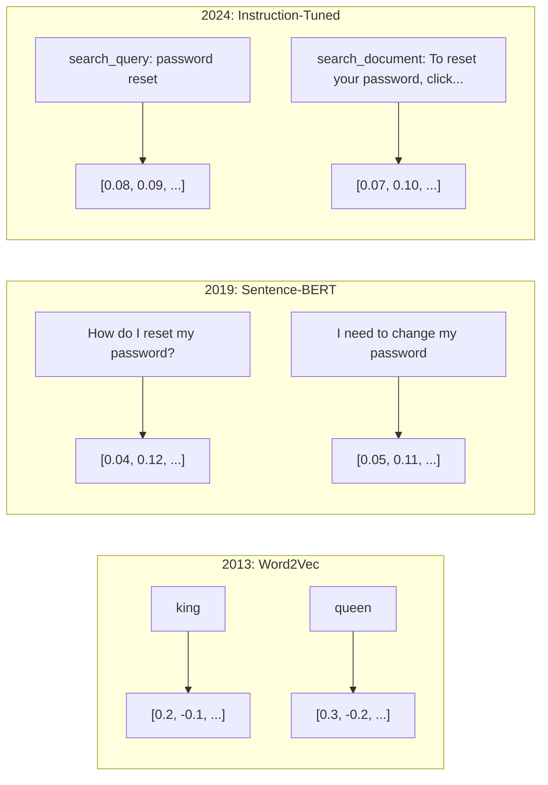
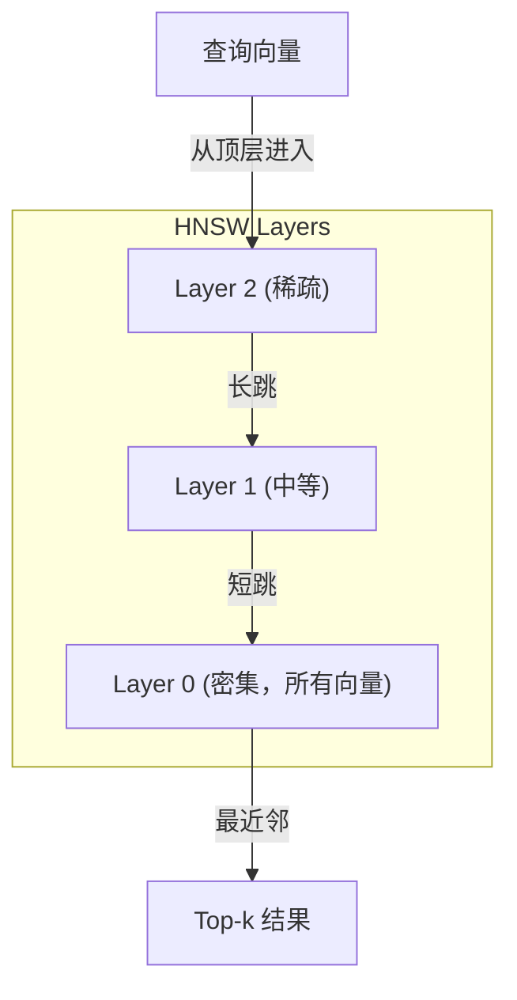
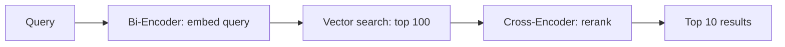

# Embeddings & Vector Representations（嵌入与向量表示）

> 文本是离散的。数学是连续的。每当你让大型语言模型（LLM）查找“相似”文档、比较含义或超越关键词搜索时，你都依赖于连接这两个世界的桥梁。这个桥梁就是embedding（嵌入）。如果你不理解embedding，你就不理解现代AI。你只是在使用它。

**类型：** Build（构建）  
**语言：** Python  
**先决条件：** 第11阶段，第01课（Prompt Engineering 提示工程）  
**时间：** ~75分钟  
**关联内容：** 第5阶段⸱22课（Embedding Models Deep Dive 嵌入模型深度解析）涵盖稠密向量与稀疏向量与多向量、套娃截断（Matryoshka truncation）、以及按轴模型选择。本课重点是生产流水线（向量数据库，HNSW， 相似度数学）。选模型前请先阅读第5阶段⸱22课。

## 学习目标

- 使用API提供商和开源模型生成文本embedding，计算它们之间的余弦相似度
- 解释为什么embedding能解决关键词搜索无法处理的词汇不匹配问题
- 构建语义搜索索引，通过意义而非精确关键词匹配来检索文档
- 使用检索基准（precision@k，召回率）评估embedding质量，选择适合任务的embedding模型

## 问题描述

你有1万个支持工单。客户写道“my payment didn't go through（我的付款未成功）。”你需要找到类似的过往工单。关键词搜索会找到包含“payment（付款）”和“didn't go through（未成功）”的工单，但会漏掉“transaction failed（交易失败）”、“charge was declined（收费被拒绝）”和“billing error（账单错误）”。这些工单描述的是同一个问题，但用的词完全不同。

这就是词汇不匹配问题。人类语言有几十种方式表达同一个意思。关键词搜索把每个词视为独立符号，毫无语义可言。它不知道“declined（被拒绝）”和“didn't go through（未成功）”指的是同一个概念。

你需要一种文本表示，语义而非拼写决定相似度。你希望把“my payment didn't go through”和“transaction was declined”放在某个数学空间里相近的位置，而把“my payment arrived on time（我的付款及时到账）”放得很远，尽管它们都包含单词“payment”。

这种表示就是embedding。

## 概念介绍

### 什么是embedding？

embedding是一组浮点数的稠密向量，用来表示文本的语义。这里的“稠密”很重要——每个维度都有信息，不像稀疏表示（词袋模型、TF-IDF）大多数维度为零。

“ The cat sat on the mat ”会转为类似 `[0.023, -0.041, 0.087, ..., 0.012]` 的数列——向量维度通常在768到3072之间，具体取决于模型。这些数字编码了语义。你不直接查看它们，只比较。

### Word2Vec的突破

2013年，Google的Tomas Mikolov等人发表了Word2Vec。核心思想是训练神经网络根据上下文预测单词，网络的隐层权重成为有意义的词向量。

著名结果：

```text
king - man + woman = queen
```

词嵌入上的向量算术捕捉到了语义关系。“man”到“woman”的方向，大致等同于“king”到“queen”的方向。领域认识到几何能够编码语义。

Word2Vec生成300维向量。每个单词有一个向量，不区分上下文。“bank”在“river bank（河岸）”和“bank account（银行账户）”中用的向量是相同的。这种限制推动了接下来十年的研究。

### 从单词到句子

词嵌入表示单个token。实际系统需要对整个句子、段落或文档进行embedding。出现了四种方法：

**平均法**：对句中所有词向量做均值。简单，损失信息，但对短文本效果还行。完全丧失词序——“dog bites man（狗咬人）”和“man bites dog（人咬狗）”得到相同向量。

**CLS token**：Transformer模型（比如BERT，2018）输出一个特殊的[CLS] token代表整个输入。比平均法好，但[CLS]主要训练任务是下句预测，不是相似度。

**对比学习（Contrastive learning）**：明确训练模型把相似句子向量拉近，不相似的推远。Sentence-BERT（Reimers & Gurevych, 2019）采用此法，成为现代embedding模型基础。给定“How do I reset my password?”和“I need to change my password”，模型学会它们的向量几乎一样。

**指令调优embedding（Instruction-tuned embeddings）**：最新方法。模型如E5和GTE接受任务前缀（如“search_query:”，“search_document:”），指示模型生成何种embedding。一个模型可支持多任务。



### 现代embedding模型

市场上已有少数生产级选项（2026年初MTEB得分，MTEB v2）：

| 模型 | 提供商 | 维度 | MTEB | 上下文长度 | 成本 / 1M tokens |
|-------|----------|-----------|------|---------|------------------|
| Gemini Embedding 2 | Google | 3072（套娃） | 67.7（检索） | 8192 | $0.15 |
| embed-v4 | Cohere | 1024（套娃） | 65.2 | 128K | $0.12 |
| voyage-4 | Voyage AI | 1024/2048（套娃） | 66.8 | 32K | $0.12 |
| text-embedding-3-large | OpenAI | 3072（套娃） | 64.6 | 8192 | $0.13 |
| text-embedding-3-small | OpenAI | 1536（套娃） | 62.3 | 8192 | $0.02 |
| BGE-M3 | BAAI | 1024（稠密+稀疏+ColBERT） | 63.0 多语言 | 8192 | 开源权重 |
| Qwen3-Embedding | 阿里巴巴 | 4096（套娃） | 66.9 | 32K | 开源权重 |
| Nomic-embed-v2 | Nomic | 768（套娃） | 63.1 | 8192 | 开源权重 |

MTEB（Massive Text Embedding Benchmark）v2涵盖100+任务——检索、分类、聚类、重排、摘要等，分数越高越好。到2026年，开源权重模型（Qwen3-Embedding，BGE-M3）在大部分指标上能匹敌或超越封闭托管模型。Gemini Embedding 2在纯检索上领先；Voyage和Cohere在特定领域（金融、法律、代码）表现最佳。使用时务必先用自己查询做基准。

### 相似度度量

给定两个embedding向量，有三种常用相似度计算方法：

**余弦相似度（Cosine similarity）**：两向量夹角的余弦值，范围[-1, 1]。忽略向量大小——10词句子和500词文档只要方向一致可以得1.0。90%用例默认选此项。

```text
cosine_sim(a, b) = dot(a, b) / (||a|| * ||b||)
```

**点积（Dot product）**：向量的原始内积。向量归一化后与余弦相似度等价。计算速度更快。OpenAI的embedding归一化过，点积和余弦排名一致。

```text
dot(a, b) = sum(a_i * b_i)
```

**欧氏距离（Euclidean, L2 distance）**：向量空间中的直线距离。值小代表越相似。对大小差异敏感。定位空间绝对位置时用，而不仅仅方向。

```text
L2(a, b) = sqrt(sum((a_i - b_i)^2))
```

使用建议：

| 指标 | 适用场景 | 避免场景 |
|--------|----------|------------|
| 余弦相似度 | 比较不同长度文本；大多数检索任务 | 向量大小包含信息 |
| 点积 | 向量已归一化；追求速度 | 向量大小差异大 |
| 欧氏距离 | 聚类；空间最近邻 | 文档长度差异巨大 |

### 向量数据库和HNSW

暴力搜索需对每个存储向量计算相似度。100万条1536维向量，每次查询需15亿次乘加操作，速度太慢。

向量数据库用Approximate Nearest Neighbor（ANN，近似最近邻）算法解决。主流算法是HNSW（Hierarchical Navigable Small World）：

1. 构建多层向量图  
2. 顶层稀疏——远距离集群间长跳连接  
3. 底层密集——相邻向量细粒度连接  
4. 查询自顶层开始，贪心向下精确  
5. 以 O(log n) 时间返回近似前k个结果，替代暴力 O(n)

HNSW牺牲了极少准确率（一般95-99%召回）换取极大速度提升。1千万向量暴力搜索需秒级，HNSW毫秒级。



生产方案：

| 数据库 | 类型 | 适用场景 | 最大规模 |
|----------|------|----------|-----------|
| Pinecone | 托管SaaS | 零运维生产 | 十亿级 |
| Weaviate | 开源 | 自托管，混合搜索 | 1亿+ |
| Qdrant | 开源 | 高性能，支持过滤 | 1亿+ |
| ChromaDB | 嵌入式 | 原型开发、本地 | 100万 |
| pgvector | Postgres扩展 | 已用Postgres | 1000万 |
| FAISS | 库 | 进程内，研究用 | 10亿+ |

### 分块策略

文档太长不可单条向量表示。50页PDF涵盖数十主题，embedding就是混合平均，语义不明确。拆分文档成多个chunk，然后分别embedding。

**固定大小分块**：按每N个token拆，带M个token重叠。简单可控。适合无明显结构文档。举例512-token chunk重叠50：chunk1 tokens 0-511，chunk2 tokens 462-973。

**基于句子分块**：在句子边界拆，累积句子直至token上限。每个chunk至少有完整句子。优于固定大小，避免截断思想。

**递归分块**：优先在最大边界切分（章节标题），过大则往下切段落、句子、字符限制。LangChain的`RecursiveCharacterTextSplitter`实现此法，适合混合格式语料。

**语义分块**：先给每句生成embedding，连续相似句子合并成chunk。当相似度低于阈值时开启新块。代价高（每句单独embedding），但产出最连贯chunk。

| 策略 | 复杂度 | 质量 | 适用场景 |
|----------|-----------|---------|----------|
| 固定大小 | 低 | 尚可 | 无结构文本，日志 |
| 基于句子 | 低 | 较好 | 文章，邮件 |
| 递归 | 中等 | 好 | Markdown，HTML，混合文档 |
| 语义 | 高 | 最佳 | 关键检索质量 |

大多数系统的最佳范围：256-512 令牌块，重叠50令牌。

### Bi-Encoders（双编码器） vs Cross-Encoders（交叉编码器）

双编码器独立地对查询和文档进行嵌入，然后比较向量。速度快——你只需对查询嵌入一次，然后与预先计算好的文档嵌入进行比较。这是检索时使用的方法。

交叉编码器将查询和文档作为单一输入，输出相关性分数。速度慢——它需要对每个查询-文档对通过完整模型进行处理。但由于可以同时关注查询和文档的所有令牌，准确度更高得多。

生产环境模式：双编码器检索前100个候选，交叉编码器重新排序至前10个。这就是检索后重排序的流水线。



重排序模型：Cohere Rerank 3.5（每1000次查询2美元）、BGE-reranker-v2（免费，开源）、Jina Reranker v2（免费，开源）。

### Matryoshka Embeddings（套娃嵌入）

传统嵌入是全有或全无的。一个1536维向量使用1536个浮点数。你不能仅截断到256维而不重新训练。

Matryoshka Representation Learning（Kusupati 等，2022）解决了这个问题。该模型训练时使得前N维捕获最重要的信息，就像俄罗斯套娃。将1536维Matryoshka嵌入截断为256维会失去一些准确度，但仍然有效。

OpenAI的text-embedding-3-small和text-embedding-3-large支持通过`dimensions`参数进行Matryoshka截断。请求256维代替1536维，存储需求降低6倍，在MTEB基准测试中精度损失约为3-5%。

### Binary Quantization（二值量化）

一个1536维浮点32（float32）格式的嵌入占用6,144字节。乘以1000万个文档：仅向量部分就需要61GB。

二值量化将每个浮点转换为1位：正值变为1，负值变为0。存储从6,144字节降到192字节——减少32倍。相似度用汉明距离计算（统计不同位数），CPU可以单条指令完成。

准确率损失约为检索召回的5-10%。常见模式是：对数百万向量先用二值量化做首轮搜索，然后用全精度向量重评分前1000个结果。这样可以在内存减少32倍的情况下达到95%以上的全精度准确率。

## 实现它

我们从零开始构建一个语义搜索引擎。不使用向量数据库，不调用外部嵌入API。纯Python加numpy做数学运算。

### 第1步：文本切块

```python
def chunk_text(text, chunk_size=200, overlap=50):
    words = text.split()
    chunks = []
    start = 0
    while start < len(words):
        end = start + chunk_size
        chunk = " ".join(words[start:end])
        chunks.append(chunk)
        start += chunk_size - overlap
    return chunks


def chunk_by_sentences(text, max_chunk_tokens=200):
    sentences = text.replace("\n", " ").split(".")
    sentences = [s.strip() + "." for s in sentences if s.strip()]
    chunks = []
    current_chunk = []
    current_length = 0
    for sentence in sentences:
        sentence_length = len(sentence.split())
        if current_length + sentence_length > max_chunk_tokens and current_chunk:
            chunks.append(" ".join(current_chunk))
            current_chunk = []
            current_length = 0
        current_chunk.append(sentence)
        current_length += sentence_length
    if current_chunk:
        chunks.append(" ".join(current_chunk))
    return chunks
```

### 第2步：从零构建嵌入

我们实现一个简单的密集嵌入，使用TF-IDF且带L2归一化。这不是神经网络嵌入，但遵循同样的接口：文本输入，固定大小向量输出，相似文本产生相似向量。

```python
import math
import numpy as np
from collections import Counter

class SimpleEmbedder:
    def __init__(self):
        self.vocab = []
        self.idf = []
        self.word_to_idx = {}

    def fit(self, documents):
        vocab_set = set()
        for doc in documents:
            vocab_set.update(doc.lower().split())
        self.vocab = sorted(vocab_set)
        self.word_to_idx = {w: i for i, w in enumerate(self.vocab)}
        n = len(documents)
        self.idf = np.zeros(len(self.vocab))
        for i, word in enumerate(self.vocab):
            doc_count = sum(1 for doc in documents if word in doc.lower().split())
            self.idf[i] = math.log((n + 1) / (doc_count + 1)) + 1

    def embed(self, text):
        words = text.lower().split()
        count = Counter(words)
        total = len(words) if words else 1
        vec = np.zeros(len(self.vocab))
        for word, freq in count.items():
            if word in self.word_to_idx:
                tf = freq / total
                vec[self.word_to_idx[word]] = tf * self.idf[self.word_to_idx[word]]
        norm = np.linalg.norm(vec)
        if norm > 0:
            vec = vec / norm
        return vec
```

### 第3步：相似度函数

```python
def cosine_similarity(a, b):
    dot = np.dot(a, b)
    norm_a = np.linalg.norm(a)
    norm_b = np.linalg.norm(b)
    if norm_a == 0 or norm_b == 0:
        return 0.0
    return float(dot / (norm_a * norm_b))


def dot_product(a, b):
    return float(np.dot(a, b))


def euclidean_distance(a, b):
    return float(np.linalg.norm(a - b))
```

### 第4步：向量索引与暴力搜索

```python
class VectorIndex:
    def __init__(self):
        self.vectors = []
        self.texts = []
        self.metadata = []

    def add(self, vector, text, meta=None):
        self.vectors.append(vector)
        self.texts.append(text)
        self.metadata.append(meta or {})

    def search(self, query_vector, top_k=5, metric="cosine"):
        scores = []
        for i, vec in enumerate(self.vectors):
            if metric == "cosine":
                score = cosine_similarity(query_vector, vec)
            elif metric == "dot":
                score = dot_product(query_vector, vec)
            elif metric == "euclidean":
                score = -euclidean_distance(query_vector, vec)
            else:
                raise ValueError(f"Unknown metric: {metric}")
            scores.append((i, score))
        scores.sort(key=lambda x: x[1], reverse=True)
        results = []
        for idx, score in scores[:top_k]:
            results.append({
                "text": self.texts[idx],
                "score": score,
                "metadata": self.metadata[idx],
                "index": idx
            })
        return results

    def size(self):
        return len(self.vectors)
```

### 第5步：语义搜索引擎

```python
class SemanticSearchEngine:
    def __init__(self, chunk_size=200, overlap=50):
        self.embedder = SimpleEmbedder()
        self.index = VectorIndex()
        self.chunk_size = chunk_size
        self.overlap = overlap

    def index_documents(self, documents, source_names=None):
        all_chunks = []
        all_sources = []
        for i, doc in enumerate(documents):
            chunks = chunk_text(doc, self.chunk_size, self.overlap)
            all_chunks.extend(chunks)
            name = source_names[i] if source_names else f"doc_{i}"
            all_sources.extend([name] * len(chunks))
        self.embedder.fit(all_chunks)
        for chunk, source in zip(all_chunks, all_sources):
            vec = self.embedder.embed(chunk)
            self.index.add(vec, chunk, {"source": source})
        return len(all_chunks)

    def search(self, query, top_k=5, metric="cosine"):
        query_vec = self.embedder.embed(query)
        return self.index.search(query_vec, top_k, metric)

    def search_with_scores(self, query, top_k=5):
        results = self.search(query, top_k)
        return [
            {
                "text": r["text"][:200],
                "source": r["metadata"].get("source", "unknown"),
                "score": round(r["score"], 4)
            }
            for r in results
        ]
```

### 第6步：比较相似度度量

```python
def compare_metrics(engine, query, top_k=3):
    results = {}
    for metric in ["cosine", "dot", "euclidean"]:
        hits = engine.search(query, top_k=top_k, metric=metric)
        results[metric] = [
            {"score": round(h["score"], 4), "preview": h["text"][:80]}
            for h in hits
        ]
    return results
```

## 使用它

在生产嵌入API下，架构保持不变，仅更换嵌入器：

```python
from openai import OpenAI

client = OpenAI()

def openai_embed(texts, model="text-embedding-3-small", dimensions=None):
    kwargs = {"model": model, "input": texts}
    if dimensions:
        kwargs["dimensions"] = dimensions
    response = client.embeddings.create(**kwargs)
    return [item.embedding for item in response.data]
```

OpenAI的Matryoshka截断——同模型，更少维度，更低存储：

```python
full = openai_embed(["semantic search query"], dimensions=1536)
compact = openai_embed(["semantic search query"], dimensions=256)
```

256维向量占用的存储减少6倍。对1千万文档，10GB对比61GB。标准基准的准确性损失约3-5%。

Cohere的重排序示例：

```python
import cohere

co = cohere.ClientV2()

results = co.rerank(
    model="rerank-v3.5",
    query="What is the refund policy?",
    documents=["Full refund within 30 days...", "No refunds after 90 days..."],
    top_n=3
)
```

本地嵌入，无API依赖：

```python
from sentence_transformers import SentenceTransformer

model = SentenceTransformer("BAAI/bge-small-en-v1.5")
embeddings = model.encode(["semantic search query", "another document"])
```

我们构建的VectorIndex类适用于任一方法。只需替换嵌入函数，搜索逻辑不变。

## 发布它

本课产出：
- `outputs/prompt-embedding-advisor.md` —— 针对具体用例选择嵌入模型及策略的提示
- `outputs/skill-embedding-patterns.md` —— 教授智能体如何在生产环境中有效使用嵌入的技能

## 练习

1. **度量比较**：使用余弦相似度、点积和欧氏距离，对示例文档运行相同的5个查询。记录每种度量的前3个结果。哪些查询下度量结果不一致？为什么？

2. **切块大小实验**：用50、100、200、500词四种块大小对示例文档建立索引。分别运行5次查询并记录最高相似度分数。绘制块大小与检索质量的关系图，找出大块导致负面影响的临界点。

3. **套娃模拟**：构建一个产生500维向量的SimpleEmbedder。将其截断到50、100、200和500维。测量每次截断对检索召回率的影响。这模拟了套娃行为，无需真正的训练技巧。

4. **二值量化**：将搜索引擎中的嵌入转换为二值（正为1，负为0），实现汉明距离搜索。将前10名结果与全精度余弦相似度的结果比较，测量重叠百分比。

5. **基于句子的分块**（Sentence-based chunking）：用 `chunk_by_sentences` 替换固定大小分块。运行相同查询并比较检索分数。尊重句子边界是否改善结果？

## 关键词

| 术语 | 常见说法 | 实际含义 |
|------|----------|----------|
| Embedding（嵌入） | “文本转数字” | 一个稠密向量，其中几何距离编码语义相似度 |
| Word2Vec | “原始嵌入” | 2013年模型，通过预测上下文词学习单词向量；证明向量运算编码语义 |
| Cosine similarity（余弦相似度） | “两个向量相似度” | 向量夹角的余弦值；1=完全相同方向，0=正交，-1=完全相反 |
| HNSW | “快速向量搜索” | 层次化可导航小世界图（Hierarchical Navigable Small World），多层结构实现O(log n)近似最近邻搜索 |
| Bi-encoder（双编码器） | “分别嵌入，快速比较” | 独立编码查询和文档成向量；支持预计算和快速检索 |
| Cross-encoder（交叉编码器） | “慢但准确的重排序器” | 通过完整模型联合处理查询-文档对；精度更高，不支持预计算 |
| Matryoshka embeddings（套娃嵌入） | “可截断向量” | 训练使前N维捕获最重要信息，支持可变大小存储的嵌入 |
| Binary quantization（二值量化） | “1位嵌入” | 将浮点向量转换为仅有符号位的二进制，存储减少32倍，支持汉明距离搜索 |
| Chunking（分块） | “分割文本以嵌入” | 将文档切分为256-512 token片段，每个片段独立嵌入和检索 |
| Vector database（向量数据库） | “嵌入的搜索引擎” | 针对存储向量和大规模近似最近邻搜索优化的数据存储 |
| Contrastive learning（对比学习） | “通过比较训练” | 训练方法，拉近相似对向量距离，推远不相似对向量距离 |
| MTEB | “嵌入基准” | 大规模文本嵌入基准（Massive Text Embedding Benchmark）—覆盖8类任务的56个数据集；嵌入模型对比标准 |

## 拓展阅读

- Mikolov 等人，“Efficient Estimation of Word Representations in Vector Space”（2013）——启动嵌入革命的 Word2Vec 论文，提出了王-后类比
- Reimers & Gurevych，“Sentence-BERT: Sentence Embeddings using Siamese BERT-Networks”（2019）——如何训练用于句子级相似度的双编码器，是现代嵌入模型的基础
- Kusupati 等人，“Matryoshka Representation Learning”（2022）—— OpenAI 采用于 text-embedding-3 的可变维嵌入技术
- Malkov & Yashunin，“Efficient and Robust Approximate Nearest Neighbor using Hierarchical Navigable Small World Graphs”（2018）—— HNSW 论文，大多数生产向量搜索背后的算法
- OpenAI Embeddings Guide（platform.openai.com/docs/guides/embeddings）—— text-embedding-3 模型的实用参考，包括套娃维度缩减
- MTEB Leaderboard（huggingface.co/spaces/mteb/leaderboard）——对比所有嵌入模型跨任务和语言的实时排名
- [Muennighoff 等人，“MTEB: Massive Text Embedding Benchmark”（EACL 2023）](https://arxiv.org/abs/2210.07316)——定义8类任务（分类、聚类、对分类、重排序、检索、STS、摘要、双语挖掘）的基准，排行榜报告所依赖；信任任何单一 MTEB 分数前请先阅读。
- [Sentence Transformers 文档](https://www.sbert.net/)——双编码器 vs 交叉编码器、池化策略及本课实现的 ingest-split-embed-store RAG 流水线的权威参考。
