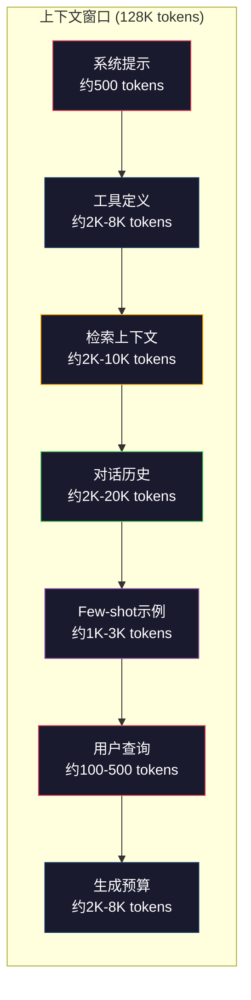
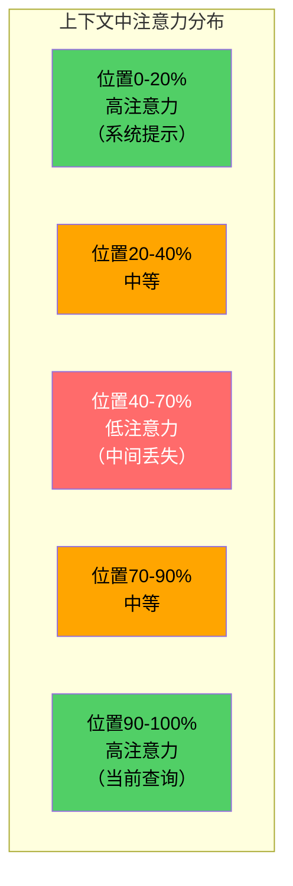
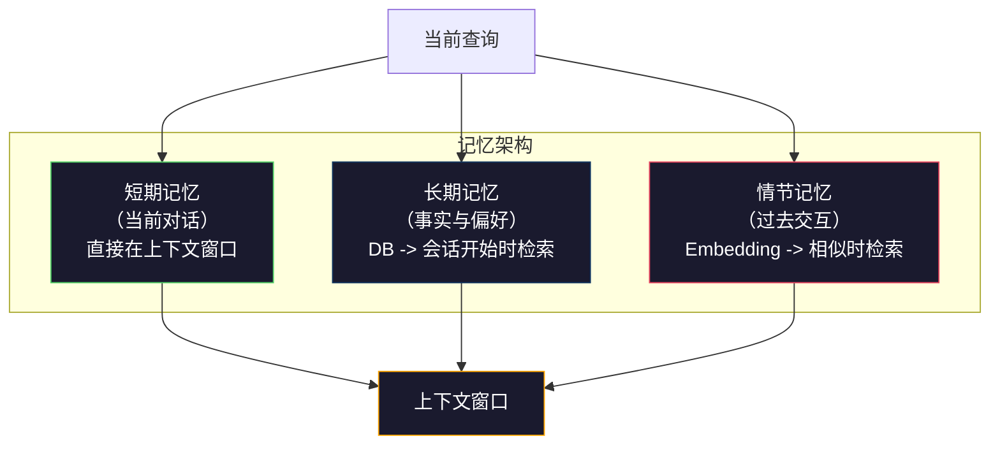

# 上下文工程：窗口、预算、内存和检索

> Prompt engineering（提示工程）只是子集。Context engineering（上下文工程）才是整体游戏。Prompt（提示）是你输入的字符串。Context（上下文）是进入模型窗口的所有内容：系统指令、检索到的文档、工具定义、对话历史、few-shot示例，以及提示本身。2026年最优秀的AI工程师是上下文工程师。他们决定放入什么，排除什么，以及按什么顺序。

**类型：** 构建  
**语言：** Python  
**先决条件：** Phase 10 (LLMs from Scratch)，Phase 11 Lesson 01-02  
**时间：** 约90分钟  
**相关：** Phase 11 · 15 (Prompt Caching) — cache-friendly（缓存友好）布局是上下文工程的拓展。Phase 5 · 28 (Long-Context Evaluation) 讲如何用 NIAH/RULER 测量 lost-in-the-middle 现象。

## 学习目标

- 计算所有上下文窗口组件（系统提示、工具、历史、检索文档、生成冗余）的token预算  
- 实施上下文窗口管理策略：截断、摘要和滑动窗口用于对话历史  
- 优先排序上下文组件，最大化模型对最相关信息的注意力  
- 构建动态分配token预算的上下文组装器，基于查询类型和可用窗口空间  

## 问题描述

Claude Opus 4.7 拥有200K token的窗口（beta版1M）。GPT-5 有400K。Gemini 3 Pro 有2M。Llama 4 声称10M。这些数字听起来很大，直到你填满它们。

下面是编码助手的实际拆分。系统提示：500 token。50个工具的工具定义：8,000 token。检索文档：4,000 token。对话历史（10轮）：6,000 token。当前用户查询：200 token。生成预算（最大输出）：4,000 token。共计：22,700 token。仅为128K窗口的18%。

但attention（注意力）不会随上下文长度线性增长。一个128K token上下文的模型需要支付二次方的attention成本（在vanilla transformers中为O(n^2)，但大多数生产模型采用高效attention变种）。更重要的是，检索准确度下降。“Needle in a Haystack”测试表明，模型在长上下文中，中间位置的信息难以定位。Liu等（2023）研究显示，LLM在长上下文的开头和结尾的检索准确率接近完美，但中间（上下文位置40%-70%）准确率下降10-20%。这种“lost-in-the-middle”（中间丢失）效应依模型而异，却影响所有现有架构。

实用结论：有200K token可用，并不代表使用200K token是有效的。精心筛选的10K token上下文常常优于堆砌的100K token上下文。Context engineering（上下文工程）是最大化上下文窗口内信噪比的学问。

你放入窗口的每个token都会挤占可能含有更相关信息的token空间。每条无关的工具定义、每段陈旧的对话、每块无法回答问题的检索文本——都会让模型在任务上略微变差。

## 概念解析

### 上下文窗口是稀缺资源

把上下文窗口想成RAM，不是磁盘。它快速、可直接访问，但有限。你无法装下所有东西，只能选择。



每个部分竞争空间。增加工具定义，减少对话历史空间。增加检索上下文，减少few-shot示例空间。上下文工程就是分配这有限预算以最大化任务表现的艺术。

### 中间丢失效应（Lost-in-the-Middle）

上下文工程中最重要的实证发现。模型对上下文的开头和结尾信息注意力更高，中间的信息关注度更低，更易被忽视。

Liu等（2023）系统测试。在20个无关文档中某位置放入相关文档，并测答案准确度。相关文档排首或末，准确率85-90%。中间（第10个位置）准确率骤降至60-70%。

工程含义：

- 把最重要信息放最前（系统提示，关键指令）  
- 把当前查询和最相关上下文放最后（recency bias（近期偏好）有帮助）  
- 把上下文中间视为最低优先区  
- 若必须放中间，关键内容复制到末尾  



### 上下文组成部分

**系统提示（System prompt）**：设定角色、约束和行为规则。最先出现，跨轮不变。Claude Code约用6,000 tokens包括工具定义和行为指令。保持精炼。系统提示的每个字都在每次API调用时重复。

**工具定义（Tool definitions）**：每个工具50-200 tokens（名称、描述、参数结构）。50个工具每个150 tokens即7,500 tokens，尚未开始对话。动态工具选择——只含与当前查询相关工具——可减少60-80%。

**检索上下文（Retrieved context）**：向量数据库文档、搜索结果、文件内容。检索质量直接决定回答质量。错误检索不如不检索——它填满窗口噪声，误导模型。

**对话历史（Conversation history）**：所有先前用户和助手消息。随对话轮数线性增长。50轮对话200 tokens/轮即10,000 tokens，绝大多数与当前查询无关。

**few-shot示例（Few-shot examples）**：输入输出对，展示期望行为。2至3个恰当示例常比数千tokens的指令更提升质量，但耗费空间。

**生成预算（Generation budget）**：给模型回复预留的tokens。窗口满了模型没地儿回答。保留至少2,000-4,000 tokens用于生成。

### 上下文压缩策略

**历史摘要（History summarization）**：不用完整保存所有历史轮次，周期性摘要对话。“我们讨论了X，决定了Y，用户想要Z”用100 tokens代替耗费2,000 tokens的10轮对话。在历史超阈值（如5,000 tokens）时做摘要。

**相关性过滤（Relevance filtering）**：为每检索文档评分，低于阈值删除。检索10块，只取3块高相关，其余丢弃。宁可3块相关的，也不要10块平庸。

**工具剪枝（Tool pruning）**：分类用户查询意图，仅包含相关工具。代码问题不需要日历工具，调度问题不需文件系统工具。工具定义可从8,000降至1,000 tokens。

**递归摘要（Recursive summarization）**：长文分阶段摘要，先摘要各章节，再摘要各摘要。50页文档变成含关键信息500 tokens摘要。

### 记忆系统

上下文工程跨越三种时间视野。

**短期记忆（Short-term memory）**：当前对话。直接存于上下文窗口。随轮次增长。通过摘要和截断管理。

**长期记忆（Long-term memory）**：跨对话持久事实和偏好。“用户偏好TypeScript” “项目使用PostgreSQL”。存数据库，开启会话时检索。Claude Code存于CLAUDE.md文件。ChatGPT使用memory功能。

**情节记忆（Episodic memory）**：具体过去交互，可能相关。“上周二，我们调试过auth模块类似问题”。存为embedding，当前对话匹配时检索。



### 动态上下文组装

关键洞见：不同查询需要不同上下文。静态系统提示+静态工具+静态历史浪费资源。最优系统按查询动态组装上下文。

1. 分类查询意图  
2. 选择相关工具（非全部）  
3. 检索相关文档（非固定组合）  
4. 包含相关历史轮（非全部历史）  
5. 添加匹配任务类型的few-shot示例  
6. 按重要度排序：关键最先，重要居后，次选居中  

这是优秀AI应用与优异AI应用的区别。模型相同，上下文不同。

## 实战构建

### 步骤1：Token计数器

无法预算就无法控制。构建简单token计数器（用空格分隔近似，因为准确计数依赖tokenizer）。

```python
import json
import numpy as np
from collections import OrderedDict

def count_tokens(text):
    if not text:
        return 0
    return int(len(text.split()) * 1.3)

def count_tokens_json(obj):
    return count_tokens(json.dumps(obj))
```

### 步骤2：上下文预算管理器

核心抽象。预算管理器跟踪各组件使用多少token并执行限制。

```python
class ContextBudget:
    def __init__(self, max_tokens=128000, generation_reserve=4000):
        self.max_tokens = max_tokens
        self.generation_reserve = generation_reserve
        self.available = max_tokens - generation_reserve
        self.allocations = OrderedDict()

    def allocate(self, component, content, max_tokens=None):
        tokens = count_tokens(content)
        if max_tokens and tokens > max_tokens:
            words = content.split()
            target_words = int(max_tokens / 1.3)
            content = " ".join(words[:target_words])
            tokens = count_tokens(content)

        used = sum(self.allocations.values())
        if used + tokens > self.available:
            allowed = self.available - used
            if allowed <= 0:
                return None, 0
            words = content.split()
            target_words = int(allowed / 1.3)
            content = " ".join(words[:target_words])
            tokens = count_tokens(content)

        self.allocations[component] = tokens
        return content, tokens

    def remaining(self):
        used = sum(self.allocations.values())
        return self.available - used

    def utilization(self):
        used = sum(self.allocations.values())
        return used / self.max_tokens

    def report(self):
        total_used = sum(self.allocations.values())
        lines = []
        lines.append(f"Context Budget Report ({self.max_tokens:,} token window)")
        lines.append("-" * 50)
        for component, tokens in self.allocations.items():
            pct = tokens / self.max_tokens * 100
            bar = "#" * int(pct / 2)
            lines.append(f"  {component:<25} {tokens:>6} tokens ({pct:>5.1f}%) {bar}")
        lines.append("-" * 50)
        lines.append(f"  {'Used':<25} {total_used:>6} tokens ({total_used/self.max_tokens*100:.1f}%)")
        lines.append(f"  {'Generation reserve':<25} {self.generation_reserve:>6} tokens")
        lines.append(f"  {'Remaining':<25} {self.remaining():>6} tokens")
        return "\n".join(lines)
```

### 第3步：中间丢失重新排序（Lost-in-the-Middle Reordering）

实现重排序策略：最重要的项排在最前和最后，最不重要的放在中间。

```python
def reorder_lost_in_middle(items, scores):
    paired = sorted(zip(scores, items), reverse=True)
    sorted_items = [item for _, item in paired]

    if len(sorted_items) <= 2:
        return sorted_items

    first_half = sorted_items[::2]
    second_half = sorted_items[1::2]
    second_half.reverse()

    return first_half + second_half

def score_relevance(query, documents):
    query_words = set(query.lower().split())
    scores = []
    for doc in documents:
        doc_words = set(doc.lower().split())
        if not query_words:
            scores.append(0.0)
            continue
        overlap = len(query_words & doc_words) / len(query_words)
        scores.append(round(overlap, 3))
    return scores
```

### 第4步：对话历史压缩器

对旧的对话轮次进行摘要，以回收token预算。

```python
class ConversationManager:
    def __init__(self, max_history_tokens=5000):
        self.turns = []
        self.summaries = []
        self.max_history_tokens = max_history_tokens

    def add_turn(self, role, content):
        self.turns.append({"role": role, "content": content})
        self._compress_if_needed()

    def _compress_if_needed(self):
        total = sum(count_tokens(t["content"]) for t in self.turns)
        if total <= self.max_history_tokens:
            return

        while total > self.max_history_tokens and len(self.turns) > 4:
            old_turns = self.turns[:2]
            summary = self._summarize_turns(old_turns)
            self.summaries.append(summary)
            self.turns = self.turns[2:]
            total = sum(count_tokens(t["content"]) for t in self.turns)

    def _summarize_turns(self, turns):
        parts = []
        for t in turns:
            content = t["content"]
            if len(content) > 100:
                content = content[:100] + "..."
            parts.append(f"{t['role']}: {content}")
        return "Previous: " + " | ".join(parts)

    def get_context(self):
        parts = []
        if self.summaries:
            parts.append("[Conversation Summary]")
            for s in self.summaries:
                parts.append(s)
        parts.append("[Recent Conversation]")
        for t in self.turns:
            parts.append(f"{t['role']}: {t['content']}")
        return "\n".join(parts)

    def token_count(self):
        return count_tokens(self.get_context())
```

### 第5步：动态工具选择器

仅包含与当前查询相关的工具。先进行意图分类，再过滤。

```python
TOOL_REGISTRY = {
    "read_file": {
        "description": "读取文件内容",
        "tokens": 120,
        "categories": ["code", "files"],
    },
    "write_file": {
        "description": "写入文件内容",
        "tokens": 150,
        "categories": ["code", "files"],
    },
    "search_code": {
        "description": "在代码库中搜索模式",
        "tokens": 130,
        "categories": ["code"],
    },
    "run_command": {
        "description": "执行 shell 命令",
        "tokens": 140,
        "categories": ["code", "system"],
    },
    "create_calendar_event": {
        "description": "创建新的日历事件",
        "tokens": 180,
        "categories": ["calendar"],
    },
    "list_emails": {
        "description": "列出最近的电子邮件",
        "tokens": 160,
        "categories": ["email"],
    },
    "send_email": {
        "description": "发送电子邮件消息",
        "tokens": 200,
        "categories": ["email"],
    },
    "web_search": {
        "description": "查询网页信息",
        "tokens": 140,
        "categories": ["research"],
    },
    "query_database": {
        "description": "在数据库上执行 SQL 查询",
        "tokens": 170,
        "categories": ["code", "data"],
    },
    "generate_chart": {
        "description": "从数据生成图表",
        "tokens": 190,
        "categories": ["data", "visualization"],
    },
}

def classify_intent(query):
    query_lower = query.lower()

    intent_keywords = {
        "code": ["code", "function", "bug", "error", "file", "implement", "refactor", "debug", "test"],
        "calendar": ["meeting", "schedule", "calendar", "appointment", "event"],
        "email": ["email", "mail", "send", "inbox", "message"],
        "research": ["search", "find", "what is", "how does", "explain", "look up"],
        "data": ["data", "query", "database", "chart", "graph", "analytics", "sql"],
    }

    scores = {}
    for intent, keywords in intent_keywords.items():
        score = sum(1 for kw in keywords if kw in query_lower)
        if score > 0:
            scores[intent] = score

    if not scores:
        return ["code"]

    max_score = max(scores.values())
    return [intent for intent, score in scores.items() if score >= max_score * 0.5]

def select_tools(query, token_budget=2000):
    intents = classify_intent(query)
    relevant = {}
    total_tokens = 0

    for name, tool in TOOL_REGISTRY.items():
        if any(cat in intents for cat in tool["categories"]):
            if total_tokens + tool["tokens"] <= token_budget:
                relevant[name] = tool
                total_tokens += tool["tokens"]

    return relevant, total_tokens
```

### 第6步：完整上下文组装流水线

将所有步骤连接起来。给定一个查询，动态组装最优上下文。

```python
class ContextEngine:
    def __init__(self, max_tokens=128000, generation_reserve=4000):
        self.budget = ContextBudget(max_tokens, generation_reserve)
        self.conversation = ConversationManager(max_history_tokens=5000)
        self.system_prompt = (
            "你是一位有帮助的 AI 助手。你可以使用用于 "
            "代码编辑、文件管理、网页搜索和数据分析的工具。"
            "针对每项任务使用合适的工具。请简洁且准确。"
        )
        self.knowledge_base = [
            "Python 3.12 引入了使用括号表示泛型类的类型参数语法。",
            "项目使用 PostgreSQL 16 和 pgvector 进行嵌入存储。",
            "认证由 Supabase Auth 和 JWT 令牌处理。",
            "前端使用基于 App Router 的 Next.js 15 构建。",
            "API 限速设置为每个用户每分钟 100 次请求。",
            "部署流水线使用 GitHub Actions 和 Docker 多阶段构建。",
            "所有新模块的测试覆盖率必须高于 80%。",
            "代码库遵循仓库模式来访问数据。",
        ]

    def assemble(self, query):
        self.budget = ContextBudget(self.budget.max_tokens, self.budget.generation_reserve)

        system_content, _ = self.budget.allocate("system_prompt", self.system_prompt, max_tokens=1000)

        tools, tool_tokens = select_tools(query, token_budget=2000)
        tool_text = json.dumps(list(tools.keys()))
        tool_content, _ = self.budget.allocate("tools", tool_text, max_tokens=2000)

        relevance = score_relevance(query, self.knowledge_base)
        threshold = 0.1
        relevant_docs = [
            doc for doc, score in zip(self.knowledge_base, relevance)
            if score >= threshold
        ]

        if relevant_docs:
            doc_scores = [s for s in relevance if s >= threshold]
            reordered = reorder_lost_in_middle(relevant_docs, doc_scores)
            doc_text = "\n".join(reordered)
            doc_content, _ = self.budget.allocate("retrieved_context", doc_text, max_tokens=3000)

        history_text = self.conversation.get_context()
        if history_text.strip():
            history_content, _ = self.budget.allocate("conversation_history", history_text, max_tokens=5000)

        query_content, _ = self.budget.allocate("user_query", query, max_tokens=500)

        return self.budget

    def chat(self, query):
        self.conversation.add_turn("user", query)
        budget = self.assemble(query)
        response = f"[Response to: {query[:50]}...]"
        self.conversation.add_turn("assistant", response)
        return budget


def run_demo():
    print("=" * 60)
    print("  上下文工程流水线演示")
    print("=" * 60)

    engine = ContextEngine(max_tokens=128000, generation_reserve=4000)

    print("\n--- 查询 1：代码任务 ---")
    budget = engine.chat("修复认证模块中 JWT 令牌过早过期的 bug")
    print(budget.report())

    print("\n--- 查询 2：研究任务 ---")
    budget = engine.chat("在 PostgreSQL 中实现向量搜索的最佳方法是什么？")
    print(budget.report())

    print("\n--- 查询 3：当对话历史积累后 ---")
    for i in range(8):
        engine.conversation.add_turn("user", f"关于系统实现细节的后续问题 {i+1}")
        engine.conversation.add_turn("assistant", f"这是后续问题 {i+1} 关于架构的技术细节回答")

    budget = engine.chat("现在实现我们讨论过的更改")
    print(budget.report())

    print("\n--- 工具选择示例 ---")
    test_queries = [
        "修复 auth.py 中的 bug",
        "为团队安排周二的会议",
        "显示数据库查询性能统计",
        "查找错误处理的最佳实践",
    ]

    for q in test_queries:
        tools, tokens = select_tools(q)
        intents = classify_intent(q)
        print(f"\n  查询：{q}")
        print(f"  意图：{intents}")
        print(f"  工具：{list(tools.keys())} （{tokens} tokens）")

    print("\n--- 中间丢失重新排序示例 ---")
    docs = ["文档 A（最相关）", "文档 B（较相关）", "文档 C（最不相关）",
            "文档 D（相关）", "文档 E（中等相关）"]
    scores = [0.95, 0.60, 0.20, 0.80, 0.50]
    reordered = reorder_lost_in_middle(docs, scores)
    print(f"  原始顺序：{docs}")
    print(f"  相关度分数：{scores}")
    print(f"  重排序后：{reordered}")
    print(f"  （最相关的放在开始和末尾，最不相关的放在中间）")
```

## 使用它

### Claude Code 的上下文策略

Claude Code 通过分层方法管理上下文。系统提示包含行为规则和工具定义（约6K令牌）。打开文件时，其内容会注入为上下文。搜索时，会添加搜索结果。旧的对话轮次会被总结。CLAUDE.md 提供跨会话持久的长期记忆。

关键的工程决策是：Claude Code 不会将整个代码库倾倒进上下文窗口，而是按需检索相关文件。这就是上下文工程的实践。

### Cursor 的动态上下文加载

Cursor 将整个代码库索引成嵌入（embeddings）。当你输入查询时，它使用向量相似度检索最相关的文件和代码块。仅那些片段被包含进上下文窗口。一个50万行的代码库被压缩成5~10个最相关的代码块。

这是典型模式：全部嵌入，按需检索，只包含相关内容。

### ChatGPT 记忆

ChatGPT 存储用户偏好和事实作为长期记忆。每次对话开始时，会检索相关记忆并包含在系统提示中。“用户偏好 Python”消耗5个令牌，但可以节省数百个令牌避免重复指令。

### RAG 作为上下文工程

检索增强生成（RAG）是上下文工程的形式化。它不将知识硬编码进模型权重（训练）或系统提示（静态上下文），而是在查询时检索相关文档并注入上下文窗口。整个 RAG 流程——切块、嵌入、检索、重排序——都是为了解决一个问题：将正确的信息放入上下文窗口。

## 部署它

本课生成 `outputs/prompt-context-optimizer.md` —— 可复用的提示，用于审计上下文组装策略并推荐优化方案。输入系统提示、工具数量、平均历史长度和检索策略，能识别令牌浪费并提出改进建议。

它还生成 `outputs/skill-context-engineering.md` —— 基于任务类型、上下文窗口大小和延迟预算设计上下文组装流程的决策框架。

## 练习

1. 为 ContextBudget 类添加“令牌浪费检测器”。它应标记占用超过30%预算的组件，并针对每种组件类型建议压缩策略（总结历史、裁剪工具、文档重排序）。

2. 为检索到的上下文实现语义去重。如果两个文档相似度超过80%（基于词重叠或嵌入的余弦相似度），只保留得分更高的那个。衡量节省的令牌预算。

3. 搭建“上下文重放”工具。给定对话记录，通过 ContextEngine 重放并可视化预算分配如何随轮次变化。绘制各组件的令牌使用随时间的曲线。识别开始压缩上下文的轮次。

4. 实现基于优先级的工具选择器。不再二元包含/排除，而是为每个工具分配与当前查询的相关性分数。按相关性降序包含工具，直到耗尽工具预算。比较包含5、10、20、50个工具时的任务表现。

5. 构建多策略上下文压缩器。实现三种压缩策略（截断、总结、关键句提取），并在20份文档上进行基准测试。衡量压缩率和信息保留的权衡（压缩版本是否仍包含查询答案？）。

## 关键词

| 术语 | 大家怎么说 | 实际含义 |
|------|------------|----------|
| Context window（上下文窗口） | “模型能读多少内容” | 模型单次前向传播可以处理的最大令牌数（输入+输出）——GPT-5为40万，Claude Opus 4.7为20万（1M beta），Gemini 3 Pro为200万 |
| Context engineering（上下文工程） | “高级提示工程” | 决定什么内容、以何种顺序和优先级放入上下文窗口的学科——涵盖检索、压缩、工具选择和记忆管理 |
| Lost-in-the-middle（中段遗忘） | “模型忘记中间内容” | 经验发现大型语言模型对上下文开头和结尾的关注更好，中间信息准确率下降10-20% |
| Token budget（令牌预算） | “还剩多少令牌” | 跨组件（系统提示、工具、历史、检索、生成）的上下文窗口容量分配，且分配有组件级限额 |
| Dynamic context（动态上下文） | “即时加载内容” | 针对每个查询基于意图分类、相关工具选择和检索结果不同地组装上下文窗口 |
| History summarization（历史总结） | “压缩对话内容” | 用简明摘要替代逐字的历史对话，降低令牌消耗，同时保留关键信息 |
| Tool pruning（工具裁剪） | “只包含相关工具” | 根据查询意图分类，只包含匹配的工具定义，工具令牌成本降低60-80% |
| Long-term memory（长期记忆） | “跨会话记忆” | 存储在数据库中的事实和偏好，在会话开始时检索——如CLAUDE.md、ChatGPT Memory及类似系统 |
| Episodic memory（情景记忆） | “记住具体的过去事件” | 将过去交互存为嵌入，当当前查询与过去对话相似时检索 |
| Generation budget（生成预算） | “回答的空间” | 为模型输出预留的令牌数——若上下文填满窗口，模型就无空间回复 |

## 拓展阅读

- [Liu et al., 2023 -- “Lost in the Middle: How Language Models Use Long Contexts”](https://arxiv.org/abs/2307.03172) —— 关于位置依赖注意力的权威研究，显示模型难以处理中段信息
- [Anthropic 的 Contextual Retrieval 博文](https://www.anthropic.com/news/contextual-retrieval) —— Anthropic 如何实现上下文感知分块检索，减少49%的检索失败率
- [Simon Willison 的“Context Engineering”](https://simonwillison.net/2025/Jun/27/context-engineering/) —— 该博文为该学科命名并将其与提示工程区分开
- [LangChain 关于 RAG 的文档](https://python.langchain.com/docs/tutorials/rag/) —— 检索增强生成作为上下文工程模式的实操指南
- [Greg Kamradt 的 Needle in a Haystack 测试](https://github.com/gkamradt/LLMTest_NeedleInAHaystack) —— 揭示所有主流模型中存在的位置依赖性检索失败基准
- [Pope et al., “Efficiently Scaling Transformer Inference” (2022)](https://arxiv.org/abs/2211.05102) —— 解析上下文长度如何影响内存和延迟，以及 KV 缓存、多查询注意力（MQA）、分组查询注意力（GQA）如何改变预算计算
- [Agrawal et al., “SARATHI: Efficient LLM Inference by Piggybacking Decodes with Chunked Prefills” (2023)](https://arxiv.org/abs/2308.16369) —— 推理的两个阶段导致长提示在 TTFT 中昂贵，在 TPOT 中便宜；上下文打包权衡的真实依据
- [Ainslie et al., “GQA: Training Generalized Multi-Query Transformer Models from Multi-Head Checkpoints” (EMNLP 2023)](https://arxiv.org/abs/2305.13245) —— 分组查询注意力论文，生产解码器中 KV 内存降低8倍，无质量损失。
