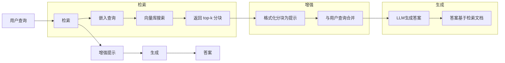
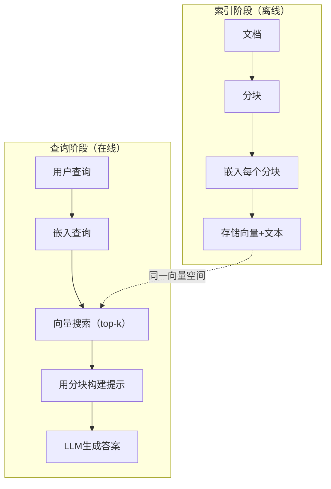

# RAG（检索增强生成）

> 你的大语言模型（LLM）只能知道训练截止时的信息。它不了解你公司的文档、代码库或上周的会议记录。RAG 通过检索相关文档并将其塞入提示中来解决这个问题。这是生产环境中最常用的模式。如果你从本课程中只做一件事，那就搭建一个 RAG 流水线。

**类型：** 构建  
**语言：** Python  
**先决条件：** 第10阶段（LLM从零开始），第11阶段课程01-05  
**时间：** 约90分钟  
**相关内容：** 第5阶段 · 23课（RAG的分块策略）介绍六种分块算法及其适用情形。第5阶段 · 22课（嵌入模型深入解析）讲解如何选择嵌入器。第11阶段 · 07课（高级RAG）涵盖混合搜索、重排序和查询转换。

## 学习目标

- 搭建完整的 RAG 流水线：文档加载、分块、嵌入、向量存储、检索与生成  
- 使用向量数据库（ChromaDB、FAISS 或 Pinecone）实现带有合适索引的语义搜索  
- 解释为什么在知识驱动应用中 RAG 优于微调（成本、新鲜度、溯源性）  
- 利用检索指标（准确率、召回率）和生成指标（忠实度、相关性）评估 RAG 质量  

## 问题

你为公司构建了一个聊天机器人。客户问“企业计划的退款政策是什么？”LLM给出了关于典型SaaS退款政策的通用答案。实际政策埋藏在200页内部维基中，说明企业客户享有60天的窗口期，并按比例退款。LLM从未见过这份文档，因此无法知道未被训练过的信息。

微调是一种解决办法。拿 LLM，在内部文档上训练它，部署更新后的模型。虽然有效，但存在严重问题。微调的计算成本达数千美元。文档一旦改变，模型立刻过时。无法追踪模型答案对应的来源文档。而且如果下个月公司收购了另一个产品线，则需再次微调。

RAG 是另一个解决方案。保持模型不变。当有问题时，从文档库中搜索相关段落，插入提示中问题之前，利用这些段落作为上下文让模型回答。文档库可在几分钟内更新。你可以准确查看检索到哪些文档。模型本体永不改变。这就是 RAG 在生产环境中占主导地位的原因：更便宜、更实时、更易审计，且适用于任何 LLM。

## 概念

### RAG 模式

整个模式包含四步：



查询 -> 检索 -> 增强提示 -> 生成。每个 RAG 系统都遵循此模式。生产环境的 RAG 系统差异在于每步细节：如何分块，如何嵌入，如何检索，如何构造提示。

### 为什么 RAG 优于微调

| 关注点 | 微调 | RAG |
|--------|------|-----|
| 成本 | 一次训练数千到十万美元 | 每查询0.01-0.10美元（嵌入+LLM） |
| 新鲜度 | 直到重新训练前都过时 | 通过重新索引文档几分钟内更新 |
| 可审计性 | 无法追踪答案来源 | 可显示精确检索段落 |
| 幻觉 | 仍会自由幻觉 | 基于检索文档做答 |
| 数据隐私 | 训练数据写入权重 | 文档留在向量库中 |

微调会永久改变模型权重，RAG 则是暂时改变模型上下文。对于大多数应用场景，暂时上下文更合适。

唯一微调占优的情况是：需要模型具备某种特定风格、语调或推理模式，仅靠提示无法实现。对于事实知识检索，RAG 完胜。

### 嵌入模型

嵌入模型将文本转换成密集向量。相似文本在高维空间中向量距离接近。“如何重置密码？”和“我需要更改我的密码”尽管词汇不同，但向量几乎相同。“猫坐在垫子上”的向量则截然不同。

常见嵌入模型（2026年版，详见第5阶段 · 22课）：

| 模型 | 维度 | 提供商 | 说明 |
|-------|-------|----------|-------|
| text-embedding-3-small | 1536（套娃） | OpenAI | 绝大多数场景性价比最佳 |
| text-embedding-3-large | 3072（套娃） | OpenAI | 精度更高，可截断为256/512/1024 |
| Gemini Embedding 2 | 3072（套娃） | Google | MTEB检索最佳；8K上下文 |
| voyage-4 | 1024/2048（套娃） | Voyage AI | 领域变体（代码、金融、法律） |
| Cohere embed-v4 | 1024（套娃） | Cohere | 强大的多语言支持，128K上下文 |
| BGE-M3 | 1024（密集 + 稀疏 + ColBERT） | BAAI（开源权重） | 一个模型的三种视角 |
| Qwen3-Embedding | 4096（套娃） | 阿里巴巴（开源权重） | 开源检索得分最高 |
| all-MiniLM-L6-v2 | 384 | 开源（Sentence Transformers）| 原型基线 |

本课我们用 TF-IDF 构建简单嵌入。不是因为 TF-IDF 是生产系统用的，而是让概念更清楚：文本输入，向量输出，相似文本产生相似向量。

### 向量相似度

给定两个向量，如何衡量相似度？三种方案：

**余弦相似度（Cosine similarity）**：两个向量夹角余弦值，范围[-1，1]。忽略长度，只考方向，是RAG默认选择。

```text
cosine_sim(a, b) = dot(a, b) / (||a|| * ||b||)
```

**点积（Dot product）**：向量内积，向量长度越大分数越高。适用于长度信息有意义的场景（长文档或许更相关）。

```text
dot(a, b) = sum(a_i * b_i)
```

**L2距离（欧氏距离）**：向量间直线距离，距离越小相似度越高。对长度差异敏感。

```text
L2(a, b) = sqrt(sum((a_i - b_i)^2))
```

余弦相似度是标准选择。它通过归一化长度，优雅地处理不同长度文档。日常说“向量搜索”几乎都是指余弦相似度。

### 分块策略

文档太长，不能作为单一向量嵌入。50页PDF可能主题杂乱，嵌入表现糟糕。需将文档拆分成多个分块，分别嵌入。

**定长分块**：每N个token切一次。简单且稳定。512个token，50个token重叠的例子：分块1是tokens 0-511，分块2是462-973，依此类推。重叠避免截断句子。

**语义分块**：按自然边界切分。段落、章节、Markdown标题。每块是连贯语义单元。实现复杂但效果更好。

**递归分块**：先在最大边界切（章节标题），再大块仍过大则按段落切，段落仍大则按句子切。LangChain RecursiveCharacterTextSplitter 方法，实践中效果不错。

分块大小的影响超乎想象：

- 太小（64-128 token）：上下文少。“上季度增长15%”没上下文，什么“它”都不清楚  
- 太大（2048+ token）：涵盖多主题，相关性被稀释。搜索“营收数据”却拿到90%关于人数的分块  
- 合适（256-512 token）：上下文充分且焦点明确

大多数生产环境RAG用256-512 token分块，50 token重叠。Anthropic的RAG指南也推荐该范围。

### 向量数据库

有了向量后，要存储并搜索它们。选项：

| 数据库 | 类型 | 适用场景 |
|--------|--------|----------|
| FAISS | 库（进程内） | 原型开发，中小规模数据 |
| Chroma | 轻量数据库 | 本地开发，小型部署 |
| Pinecone | 托管服务 | 生产环境，免运维负担 |
| Weaviate | 开源数据库 | 自建生产环境 |
| pgvector | Postgres扩展 | 已用Postgres环境 |
| Qdrant | 开源数据库 | 高性能自托管 |

本课构建简单内存向量库，向量存在列表，暴力余弦相似度搜索。等同于带flat索引的FAISS，约10万向量时开始慢。生产使用近似最近邻（ANN）算法如HNSW，可毫秒级搜索百万级向量。

### 整体流程



索引阶段针对每个文档运行一次（或文档更新时）。查询阶段针对每次用户请求运行。生产环境中，索引可能需处理数百万文档，耗时数小时。查询响应需秒级以内。

### 实际数值

多数生产RAG系统使用参数：

- **k（检索分块数）**：5到10  
- **分块大小**：256到512 token，50 token重叠  
- **上下文预算**：每次查询检索内容2500-5000 token  
- **总提示长度**：约8000到16000 token（系统提示+检索分块+对话历史+用户查询）  
- **嵌入向量维度**：384到3072，视模型而定  
- **索引吞吐**：API嵌入时每秒100-1000文档  
- **查询延迟**：检索50-200毫秒，生成500-3000毫秒  

## 实践构建

### 第1步：文档分块

```python
def chunk_text(text, chunk_size=200, overlap=50):
    words = text.split()
    chunks = []
    start = 0
    while start < len(words):
        end = start + chunk_size
        chunk = " ".join(words[start:end])
        chunks.append(chunk)
        start += chunk_size - overlap
    return chunks
```

### 第2步：TF-IDF 嵌入

我们构建一个简单的嵌入函数。TF-IDF（词频-逆文档频率）非神经嵌入，但它以捕捉词重要性的方式将文本转向量。文档中频繁出现的词有高TF，整个语料库中罕见的词有高IDF。乘积得到的向量中，特别且关键的词权重较高。

```python
import math
from collections import Counter

def build_vocabulary(documents):
    vocab = set()
    for doc in documents:
        vocab.update(doc.lower().split())
    return sorted(vocab)

def compute_tf(text, vocab):
    words = text.lower().split()
    count = Counter(words)
    total = len(words)
    return [count.get(word, 0) / total for word in vocab]

def compute_idf(documents, vocab):
    n = len(documents)
    idf = []
    for word in vocab:
        doc_count = sum(1 for doc in documents if word in doc.lower().split())
        idf.append(math.log((n + 1) / (doc_count + 1)) + 1)
    return idf

def tfidf_embed(text, vocab, idf):
    tf = compute_tf(text, vocab)
    return [t * i for t, i in zip(tf, idf)]
```

### 第三步：余弦相似度搜索（Cosine Similarity Search）

```python
def cosine_similarity(a, b):
    dot = sum(x * y for x, y in zip(a, b))
    norm_a = math.sqrt(sum(x * x for x in a))
    norm_b = math.sqrt(sum(x * x for x in b))
    if norm_a == 0 or norm_b == 0:
        return 0.0
    return dot / (norm_a * norm_b)

def search(query_embedding, stored_embeddings, top_k=5):
    scores = []
    for i, emb in enumerate(stored_embeddings):
        sim = cosine_similarity(query_embedding, emb)
        scores.append((i, sim))
    scores.sort(key=lambda x: x[1], reverse=True)
    return scores[:top_k]
```

### 第四步：Prompt 构建

这里是 RAG 中“增强”（augmented） 的核心。将检索到的文本块格式化为提示（prompt），并要求大语言模型（LLM）基于该上下文回答。

```python
def build_rag_prompt(query, retrieved_chunks):
    context = "\n\n---\n\n".join(
        f"[Source {i+1}]\n{chunk}"
        for i, chunk in enumerate(retrieved_chunks)
    )
    return f"""Answer the question based ONLY on the following context.
If the context doesn't contain enough information, say "I don't have enough information to answer that."

Context:
{context}

Question: {query}

Answer:"""
```

### 第五步：完整的 RAG 流水线

```python
class RAGPipeline:
    def __init__(self):
        self.chunks = []
        self.embeddings = []
        self.vocab = []
        self.idf = []

    def index(self, documents):
        all_chunks = []
        for doc in documents:
            all_chunks.extend(chunk_text(doc))
        self.chunks = all_chunks
        self.vocab = build_vocabulary(all_chunks)
        self.idf = compute_idf(all_chunks, self.vocab)
        self.embeddings = [
            tfidf_embed(chunk, self.vocab, self.idf)
            for chunk in all_chunks
        ]

    def query(self, question, top_k=5):
        query_emb = tfidf_embed(question, self.vocab, self.idf)
        results = search(query_emb, self.embeddings, top_k)
        retrieved = [(self.chunks[i], score) for i, score in results]
        prompt = build_rag_prompt(
            question, [chunk for chunk, _ in retrieved]
        )
        return prompt, retrieved
```

### 第六步：生成（模拟）

在生产环境中，这一步是调用 LLM API。这里我们用从检索上下文中提取最相关句子的方式进行生成模拟。

```python
def simple_generate(prompt, retrieved_chunks):
    query_words = set(prompt.lower().split("question:")[-1].split())
    best_sentence = ""
    best_score = 0
    for chunk in retrieved_chunks:
        for sentence in chunk.split("."):
            sentence = sentence.strip()
            if not sentence:
                continue
            words = set(sentence.lower().split())
            overlap = len(query_words & words)
            if overlap > best_score:
                best_score = overlap
                best_sentence = sentence
    return best_sentence if best_sentence else "I don't have enough information."
```

## 使用方法

使用真实的 embedding 模型和 LLM 时，代码几乎不变：

```python
from openai import OpenAI

client = OpenAI()

def embed(text):
    response = client.embeddings.create(
        model="text-embedding-3-small",
        input=text
    )
    return response.data[0].embedding

def generate(prompt):
    response = client.chat.completions.create(
        model="gpt-4o-mini",
        messages=[{"role": "user", "content": prompt}],
        temperature=0
    )
    return response.choices[0].message.content
```

或者使用 Anthropic：

```python
import anthropic

client = anthropic.Anthropic()

def generate(prompt):
    response = client.messages.create(
        model="claude-sonnet-4-20250514",
        max_tokens=1024,
        messages=[{"role": "user", "content": prompt}]
    )
    return response.content[0].text
```

流水线完全相同。替换 embedding 函数。替换生成函数。检索逻辑、切块、提示构建——无论用哪个模型，都保持一致。

大规模向量存储时，替换暴力搜索为合适的向量数据库：

```python
import chromadb

client = chromadb.Client()
collection = client.create_collection("my_docs")

collection.add(
    documents=chunks,
    ids=[f"chunk_{i}" for i in range(len(chunks))]
)

results = collection.query(
    query_texts=["What is the refund policy?"],
    n_results=5
)
```

Chroma 内部处理 embedding（默认使用 all-MiniLM-L6-v2），并将向量存储在本地数据库。模式相同，换了底层实现。

## 发布部署

本课材料产出：
- `outputs/prompt-rag-architect.md` —— 针对特定用例设计 RAG 系统的提示模板
- `outputs/skill-rag-pipeline.md` —— 教导代理构建和调试 RAG 流水线的技能

## 练习

1. 将 TF-IDF embedding 替换为简单的词袋模型（Bag-of-Words，二元：词存在为1，不存在为0）。比较样本文档上的检索质量。TF-IDF 应该表现更好，因为它对稀有词赋予更高权重。

2. 试验不同的切块大小：对同一文档集试试 50、100、200 和 500 词的块大小。对每种大小执行相同的5个查询，统计各自的前3名内有多少相关块。找到检索质量峰值的最佳块大小。

3. 为每个块添加元数据（来源文档名称、块序号）。修改提示模板以包含来源信息，确保 LLM 给出引用来源。

4. 实现一个简单的评估：对10个 QA 对，运行 RAG 流水线，计算检索到的块中包含答案的比例。即 Top-k 检索召回率。

5. 构建对话感知的 RAG 流水线：维护最近3轮对话历史，并将其与检索块一起加入提示。尝试后续问题，如“企业版怎么样？”紧跟着先前关于价格的问题。

## 关键词

| 术语 | 常见说法 | 实际含义 |
|------|----------|----------|
| RAG | “读取你的文档的 AI” | 检索相关文档，将它们粘贴到提示中，基于这些文档生成答案 |
| Embedding（嵌入） | “把文本转成数字” | 文本的密集向量表示，语义相近的文本产生相似向量 |
| Vector database（向量数据库） | “AI 的搜索引擎” | 优化存储向量，并通过相似度寻找最近邻的数据存储 |
| Chunking（切块） | “把文档拆成段” | 将文档拆分为较小段（一般为256-512个 token），方便单独嵌入和检索 |
| Cosine similarity（余弦相似度） | “两个向量有多像” | 两个向量夹角的余弦值；1 表示方向完全相同，0 表示正交，-1 表示相反 |
| Top-k retrieval（Top-k 检索） | “找出k个最佳匹配” | 返回向量库中与查询最相似的k个块 |
| Context window（上下文窗口） | “LLM 可查看文本量” | LLM 单次请求能处理的最大 token 数，检索的块必须能装进这个窗口 |
| Augmented generation（增强生成） | “用给定上下文回答” | 基于检索出的文档上下文生成回答，而非仅依赖训练知识 |
| TF-IDF | “词重要性评分” | 词频（Term Frequency）乘以逆文档频率（Inverse Document Frequency），根据词在语料库中的区分度加权 |
| Indexing（建立索引） | “准备文档以便搜索” | 离线进行文档切块、嵌入和存储，以支持查询时的快速搜寻 |

## 参考阅读

- Lewis 等人，“Retrieval-Augmented Generation for Knowledge-Intensive NLP Tasks” (2020) —— Facebook AI 研究提出的首篇 RAG 论文，正式化了先检索后生成的模式
- Anthropic 的 RAG 文档 (docs.anthropic.com) —— 关于切块大小、提示构建及评估的实用指导
- Pinecone 学习中心，“什么是 RAG？” —— 直观讲解 RAG 流水线及生产环境要点
- Sentence-BERT：Reimers & Gurevych (2019) —— all-MiniLM 嵌入模型背后的论文，介绍了语义相似度的双编码器训练方法
- [Karpukhin 等人，“Dense Passage Retrieval for Open-Domain Question Answering”（EMNLP 2020）](https://arxiv.org/abs/2004.04906) —— DPR 论文，证明密集双编码器检索优于 BM25，用于开放域问答，成为现代 RAG 检索器的标准
- [LlamaIndex 高级概念](https://docs.llamaindex.ai/en/stable/getting_started/concepts.html) —— 构建 RAG 流水线时需掌握的核心概念：数据加载器、节点解析器、索引、检索器、答案合成器
- [LangChain RAG 教程](https://python.langchain.com/docs/tutorials/rag/) —— 另一种实现检索生成模式的编排视角，基于运行链的方式
```text
